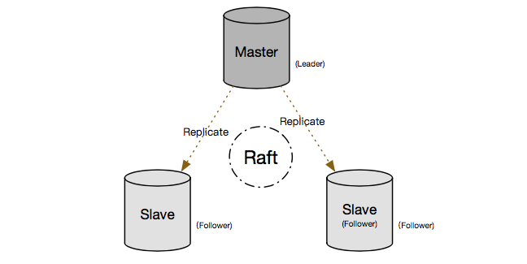

## 阿里云RDS金融数据库(三节点版) - 背景篇
         
### 作者          
digoal         
           
### 日期           
2017-07-09       
                    
### 标签    
PostgreSQL , MySQL , 三节点版 , 金融数据库 , Raft , 分布式共享存储版     
    
----    
     
## 背景  
提到金融级数据库，大家可能不约而同的会想到Oracle，DB2等商业数据库。但是随着开源数据库的发展，开源数据库正在逐渐成为数据库产业的核心，比如MySQL、PostgreSQL数据库 ，已经深入阿里、平安科技、苏宁、高德、国家电网（还有很多）的核心。可以看到，不管是MySQL还是PostgreSQL，有越来越多成功的核心应用案例。  
  
目前还有一些金融企业核心数据库依旧是老牌的商业数据库，个人认为并不是这些商业数据库比开源数据库有多优秀，而是牵一发而动全身，非单纯技术层面的问题。特别是关系民生的金融行业，更换数据库可不是那么容易。  
  
开源数据库在新生业务中是有巨大机会的，毕竟社会是在不断进步和发展的，老物件会逐渐成为人们的回忆，消失在历史的长河里。  
  
不管是商业数据库，还是开源数据库，在金融行业混，都必须跨过一道坎：高可用。  
  
（当然，不可否认，解决金融问题，除了高可用，还有更多，包括 功能，性能，SQL标准 方方面面。不在本系列文章讨论范畴）  
  
## 硬件为王 - 传统数据库高可用架构  
实际上扛起金融核心大旗的还不算Oracle，背后的硬件才是真正的王者，估计也是Oracle收购SUN的原因之一(感叹一下，SUN的ZFS至今无人能及)。  
  
IBM 大机、小机、高端存储，以其稳定性、可用性、性能等方面的卓越表现征服了当时的市场。而软件层面，实际上更多的是围绕硬件来进行设计，包括Oracle的RAC架构，也是需要依赖共享存储的。  
  
生态的原因，在硬件为王时代的数据库，由于硬件的强势，数据库软件依附这些硬件，这也是为什么又这么多基于共享存储的高可用的架构。  
  
  
  
### 传统数据库的高可用架构存在的问题  
  
价格昂贵，集中式存储单点故障（好的存储可能会在 链路、机头、存储介质、电源模块、内部背板等 层面全面解决单点问题）  
  
  
  
如果存储层存在单点（不管是机头还是链路或者其他），软件层面需要再做一层mirror或RAID冗余，例如LVM，ZFS，ASM等技术，但是存储的强一致一定会引入RT（需要软件层弥补，例如事务分组提交、异步WAL等）。  
  
  
  
甚至大量的容灾方案，也是出自存储硬件厂商之手，因为除了硬件厂商，没有人更了解如何对存储实现异地冗余了。  
  
## 弯道超车 - 开源数据库高可用架构  
随着x86硬件架构(以及对应的软件生态freebsd,linux等)、SSD硬盘的发展，到现在GPU\FPGA\TPU等芯片及其软件生态的成长。开放性硬件在功能、软件生态、硬件性能等方面全面提升，以IBM为代表的封闭式硬件逐渐失去了核心地位。  
  
业务的发展和开放性硬件生态的发展，助长了开源数据库的发展，MySQL、PostgreSQL数据库就是非常典型的代表。  
  
开放性使得更多的用户可以获取到，更多的用户又助长了软件本身的发展，这使得最近10年开源数据库已经开始全面超越商业数据库。最典型的例子是PostgreSQL，从SQL兼容性，硬件生态对接（LLVM，向量计算，多核并行，GPU计算等），软件生态对接（PL/R, PL/JAVA, PL/Python, PL/CUDA, 机器学习库等等），扩展性（9种扩展索引接口支持各种类型的检索，扩展类型支持DNA、图像特征值、化学类型等，扩展语言接口、扩展外部数据源接口等），云生态（RDS PG OSS可并行读写OSS海量存储外部表）等各个方面全面超越商业数据库。  
  
开源数据库通过内部的复制，实现了高可用架构的弯道超车。以MySQL为代表的binlog复制，以PostgreSQL为代表的stream replication。  
  
开源数据库采样通用硬件，多节点，更低的成本，更优秀的扩展性，解决了用户的高可用问题。  
  
### 两节点方案  
  
  
两节点的HA方案，属于廉价的解决方案，无法同时保证高可用和高可靠。  
  
要保证高可靠（0数据丢失），就必须等BINLOG或WAL复制到备库才返回，备库只要稍有抖动或者备库故障，就会导致可用性下降。（也就是说，主备任何一个异常都会影响可用性）。  
  
两节点方案采用自动降级机制，在备库正常的情况下，采用同步模式（数据需要写双份才返回给用户），保证可用性和可靠性。在备库异常时，则自动降级为异步，只能保证可用性（可靠性无法保证，如果此时主库挂了，备库恢复，发生HA切换，可能导致部分未同步的数据丢失）。  
  
阿里云RDS率先推出三节点方案，同时保证数据库的高可靠和高可用，满足了金融行业高可用和零数据丢失的需求。  
   
### 三节点方案  
  
  
可靠性保证：三节点方案中，用户在提交事务时，需要等待至少一个备库收到日志副本，才返回给用户事务成功结束的信号，确保数据库的可靠性（用户收到确认的事务，已持久化到多数派主机中）。  
  
可用性保证：三节点方案中，即使一台服务器挂掉（无论哪台），也不影响业务的可用性，因为已提交的数据至少有2份副本，挂掉一台，还有至少1台主机是包含了已提交事务的持久化内容的。  
  
### 多节点引入的世界问题  
多节点同时解决了可用性、可靠性的问题。但是实现并非易事，在解决可用性问题时，会涉及到另一个问题，因为异常时需要选出一个新的主库，什么情况下开始选举？选谁？都是问题。  
  
选主问题有一个非常著名的典故，拜占庭将军的问题。  
  
以下截取自互联网：  
  
拜占庭位于如今的土耳其的伊斯坦布尔，是东罗马帝国的首都。由于当时拜占庭罗马帝国国土辽阔，为了防御目的，军队相隔很远，将军与将军之间靠信差传消息。进行军事决策时，所有将军必需达成 “一致的共识”。但是，在军队内有可能存有叛徒和敌军的间谍，左右将军们的决定，在进行共识时，结果并不一定代表大多数人的意见。于是在已知有成员不可靠的情况下，其余忠诚的将军在不受叛徒或间谍的影响下如何达成一致的协议，拜占庭问题就此形成。  
  
拜占庭假设是对现实世界的模型化，由于硬件错误、网络拥塞或断开以及遭到恶意攻击，计算机和网络可能出现不可预料的行为。和我们提到的三节点要解决的问题是一致的。  
  
下一篇《阿里云RDS金融数据库(三节点版) - 理论篇》将讲解RDS三节点的理论基础 - Raft协议。  
    
  
    
## 系列文章  
[《阿里云RDS金融数据库(三节点版) - 背景篇》](../201707/20170709_02.md)  
  
[《阿里云RDS金融数据库(三节点版) - 理论篇》](../201707/20170710_01.md)  
  
[《阿里云RDS金融数据库(三节点版) - 性能篇》](../201707/20170713_01.md)  
  
[《阿里云RDS金融数据库(三节点版) - 案例篇》](../201707/20170723_01.md)  
  
## 阿里云RDS金融数据库(三节点版)
[阿里云RDS金融数据库 - MySQL三节点版](https://help.aliyun.com/document_detail/51701.htm)  
  
阿里云RDS金融数据库 - PostgreSQL三节点版(敬请期待)  
  
  
  
  
  
  
  
  
  
## [digoal's 大量PostgreSQL文章入口](https://github.com/digoal/blog/blob/master/README.md "22709685feb7cab07d30f30387f0a9ae")
  
