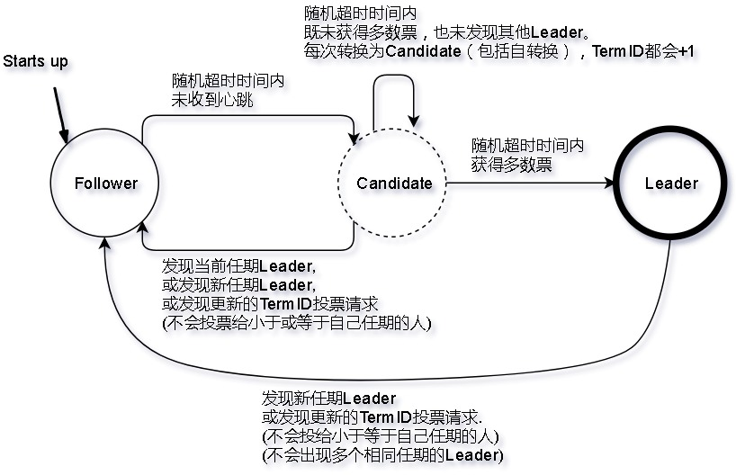
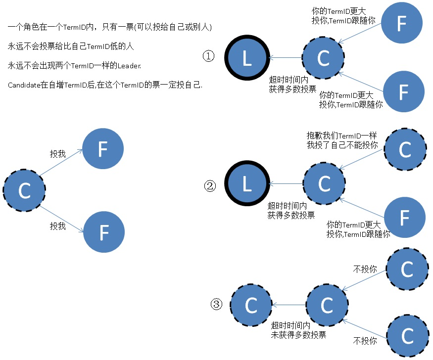
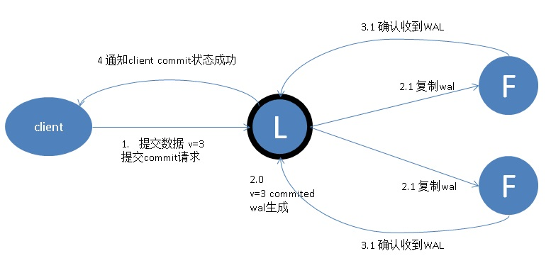
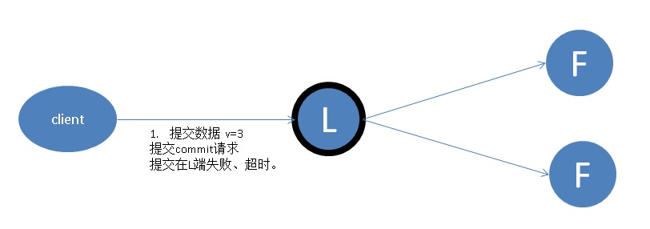
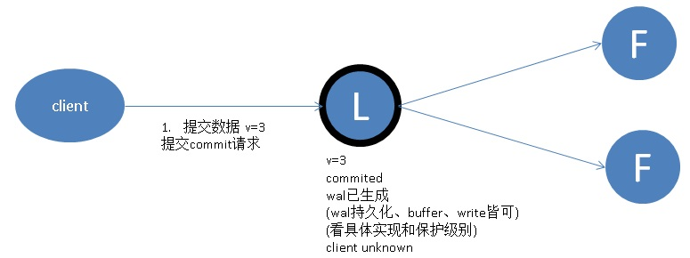
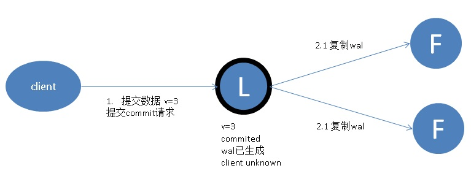
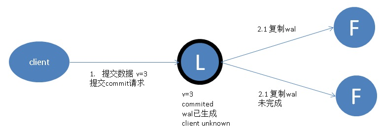
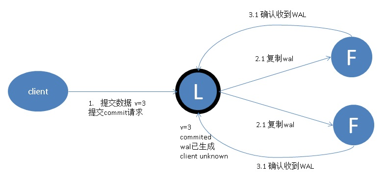
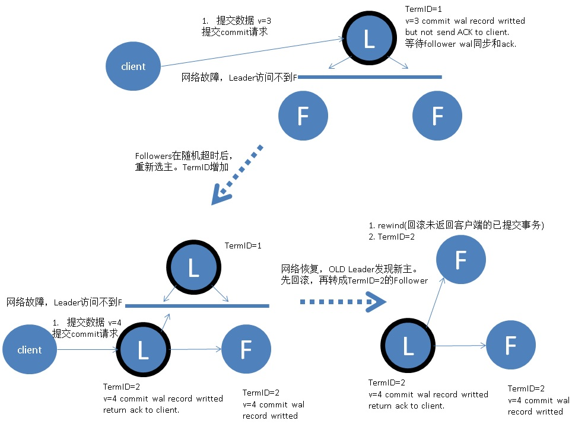

## 阿里云RDS金融数据库(三节点版) - 理论篇      
               
### 作者                
digoal               
                 
### 日期                 
2017-07-10             
                          
### 标签          
PostgreSQL , MySQL , 三节点版 , 金融数据库 , Raft , 分布式共享存储版           
          
----          
           
## 背景        
[《阿里云RDS金融数据库(三节点版) - 背景篇》](../201707/20170709_02.md)说明了为什么需要推出金融级数据库的三节点版本，以及三节点引入的一个世界难题 - 拜占庭将军问题。      
      
Lamport 在论文 《The Part-Time Parliament》中提出了一种算法Paxos，并使用了大量的数学公式论证了通过Paxos算法解决拜占庭问题的可行性。紧接着在《Paxos Made Simple》论文中，则完全放弃了所有数学符号的证明，使用纯英文的逻辑推导。原因是 Lamport 认为 Paxos 很 simple，但也许只是针对他的头脑而言。事实是大家理解起来都还是很困难，所以 Raft 就是建立在希望得到一个更易于理解的 Paxos 算法的替代品。把可理解性作为算法的主要目标之一，从论文题目就可看出来《In Search of an Understandable Consensus Algorithm》。       
      
拜占庭将军的问题和三节点选举主节点的问题类似，Raft是目前一种非常流行可靠（在有限前提下）的选举算法，也是RDS 金融数据库(三节点版)的理论基础，RDS对其算法与数据库进行融合，弥补了一些算法的缺陷，实现了高可用、高可靠兼具的金融数据库(三节点版)。    
      
## Raft 协议的易理解性描述        
在一个由 Raft 协议组织的集群中有三类角色：        
        
1、Leader（领袖）        
        
2、Follower（群众）        
        
3、Candidate（候选人）        
        
就像一个民主社会，领袖由民众投票选出。刚开始没有“领袖”，所有集群中的参与者都是“群众”，那么首先开启一轮大选，在大选期间所有群众都能参与竞选，这时所有群众的角色就变成了“候选人”，民主投票选出领袖后就开始了这届领袖的任期，然后选举结束，所有除领袖的候选人又变回群众角色服从领袖领导。这里提到一个概念「任期」，用术语 Term 表达（Term ID是自增的，每一轮成功的选举都会产生一个新的Term ID，注意所有角色发现了新Term ID时自动服从他，解决了脑裂的问题）。关于 Raft 协议的核心概念和术语就这么多而且和现实民主制度非常匹配，所以很容易理解。三类角色的变迁图如下，结合后面的选举过程来看很容易理解。        
        
        
      
三种角色的转变说明如下：      
      
1、Follower（群众）        
      
所有节点一开始都是Follower。      
      
Follower在150ms ~ 300ms的随机超时时间（Election Timeout）内，如果没有收到任何Leader发过来的心跳消息，将会转变为Candidate，给自己投票，同时请求其他人给自己投票，同时重置150ms ~ 300ms的随机超时时间。      
      
2、Candidate（候选人）        
      
Candidate在150ms ~ 300ms的随机超时时间内，没有发生角色变化（即没有转换为new Leader的Follower，也没有获得足够的票数转换为Leader），那么将重新发起选举(给自己投票，同时请求其他人给自己投票，同时重置150ms ~ 300ms的随机超时时间。)      
        
在选举过程中，Candidate获得了多数票数，则转换为new Leader。      
      
Candiate发现了当前任期(自选任期)或更新任期的Leader时(即收到Leader发来的心跳)，转变为该Leader的Follower。      
      
3、Leader（领袖）       
        
Leader发现了更新任期的Leader时，转变为新任期Leader的Follower。      
        
### 客户端视角事务的三种状态      
不管是三节点还是单节点，都可能会出现这几种状态。         
         
1、提交、回滚成功。客户端正常收到数据库的事务结束的信号，明确事务成功按要求结束。          
        
2、UNKNOWN。客户端发出了提交、回滚请求，但是未收到反馈。            
        
3、提交失败。客户端收到事务结束失败的信号，明确事务失败。         
        
无论是单节点还是多节点，都会有这三种事务状态的可能存在。         
         
### Leader 选举过程        
        
在极简的思维下，一个最小的 Raft 民主集群需要三个参与者（如下图：A、B、C），这样才可能投出多数票。初始状态 ABC 都是 Follower，Follower在150ms ~ 300ms的随机超时时间内，如果没有收到任何Leader发过来的心跳消息，将会转变为Candidate，给自己投票，同时请求其他人给自己投票，同时重置150ms ~ 300ms的随机超时时间。      
      
发起选举这时有三种可能情形发生。下图中前二种都能选出 Leader，第三种则表明本轮投票无效（Split Votes），每方都投给了自己，结果没有任何一方获得多数票。之后每个参与方随机休息一阵（Election Timeout）重新发起投票直到一方获得多数票。这里的关键就是 随机 timeout，最先从 timeout 中恢复发起投票的一方向还在 timeout 中的另外两方请求投票，这时它们就只能投给对方了，很快达成一致。        
        
        
        
选出 Leader 后，Leader 通过定期（heart timeout，heart timeout必须小于150ms）向所有 Follower 发送心跳信息维持其统治，每次Follower收到Leader心跳后，重置随机Election Timeout。      
      
若 Follower 一段时间（Election Timeout）未收到 Leader 的心跳则认为 Leader 可能已经挂了，Follower将发起选主（election）过程。        
      
### Leader 节点对一致性的影响        
        
Raft 协议强依赖 Leader 节点的可用性来确保集群数据的一致性。数据的流向只能从 Leader 节点向 Follower 节点转移。当 Client 向集群 Leader 节点提交数据后，Leader 节点接收到的数据处于未提交状态（Uncommitted），接着 Leader 节点会并发向所有 Follower 节点复制数据并等待接收响应，确保至少集群中超过半数节点(quorum based)已接收到数据后再向 Client 确认数据已接收。一旦向 Client 发出数据接收 Ack 响应后，表明此时数据状态进入已提交（Committed），Leader 节点再向 Follower 节点发通知告知该数据状态已提交。        
        
步骤4.1成功，客户端就认为事务提交成功，换句话说事务已经持久化了。         
        
因此4.2如果没有发送成功，并且此时如果Leader异常，并发生了重新选举，有没有风险？New Leader的这笔事务到底是commit还是uncommit?         
       
对于数据库来说，只要事务的WAL日志到位了，那么就该事务就持久化了，由于Follower已经有了WAL，因此数据库是不会让这笔事务丢失的，这也是ACID的D持久化，即用户看到COMMIT了，那就一定COMMIT了（开启异步提交遇到异常DOWN库或DOWN机除外）。      
        
        
        
在这个过程中，主节点可能在任意阶段挂掉，看下 Raft 协议如何针对不同阶段保障数据一致性的。        
        
### 1. 数据到达 Leader 节点前        
        
这个阶段 Leader 挂掉不影响一致性，不多说。        
        
        
        
### 2. 数据到达 Leader 节点，但未复制到 Follower 节点        
        
这个阶段 Leader 挂掉，数据属于未提交(uncommit)状态，Client 不会收到 Ack 会认为超时事务失败。Follower 节点上没有该数据，重新选主后 Client 重试 (重新发起整个事务请求) 重新提交可成功。原来的 Leader 节点恢复后作为 Follower 加入集群重新从当前任期的新 Leader 处同步数据，强制保持和 NEW Leader 数据一致。        
         
（为了达到一致，这里涉及到OLD Leader rewind的操作。）      
        
        
        
### 3. 数据到达 Leader 节点，成功复制到 Follower 所有节点，但还未向 Leader 响应接收        
        
这个阶段 Leader 挂掉，同时数据在 Follower 节点处于未提交状态（Uncommitted）但保持一致，重新选出 Leader 后可完成数据提交，此时 Client 不知到底提交成功没有，也就是说客户端视角事务状态为UNKNOWN。          
         
但是对于NEW Leader，和OLD Leader的数据是一致的。         
        
        
         
如何解决UNKNOWN的事务，后面的系列文章会讲到。          
        
### 4. 数据到达 Leader 节点，成功复制到 Follower 部分节点，但还未向 Leader 响应接收        
        
这个阶段 Leader 挂掉，数据在 Follower 节点处于未提交状态（Uncommitted）且不一致，Raft 协议要求投票只能投给拥有最新数据的节点。所以拥有最新数据的节点会被选为 Leader 再强制同步数据到其他 Follower，数据不会丢失并最终一致。        
          
与第三种情况类似，此时 Client 不知到底提交成功没有，也就是说客户端视角事务状态为UNKNOWN。          
        
但是对于NEW Leader，和OLD Leader的数据是一致的。         
        
        
        
### 5. 数据到达 Leader 节点，成功复制到 Follower 所有或多数节点，数据在 Leader 处于已提交状态，但在 Follower 处于未提交状态。（实际上就是图中标注的4.2步骤没有被执行）        
        
这个阶段 Leader 挂掉，重新选出新 Leader 后的处理流程和阶段 3 一样。         
         
这个情况下，Follower实际上已经包含了最新的数据库WAL日志，NEW Leader只要APPLY WAL即可达到事务committed的最终状态，不会丢失数据，也不会改变客户端视角对事务提交成功状态的认知。         
        
        
        
### 6. 网络分区导致的脑裂情况，出现双 Leader        
        
网络分区将原先的 Leader 节点和 Follower 节点分隔开，Follower 收不到 Leader 的心跳将发起选举产生新的 Leader。这时就产生了双 Leader，原先的 Leader 独自在一个区，向它提交数据不可能复制到多数节点所以“永远提交不成功”      
      
（虽然提交不成功，从数据库WAL日志角度来看，依旧可能出现 旧Leader 和 新Leader 存在差异的情况。例如 旧Leader 接收到某些请求，产生了WAL，只是提交事务的信息由于无法到达多数派，旧Leader是不会向客户端返回commit ack的，因此向OLD Leader发起事务提交请求的客户端会超时失败。）。      
      
客户端向新的 Leader 提交数据可以提交成功。      
      
网络恢复后 旧Leader 发现集群中有更新任期（Term）的新 Leader，旧Leader 自动降级为 Follower 并从 新Leader 处同步数据（对于数据库，可能OLD Leader首先要rewind，然后才能从NEW Leader同步）达成集群数据一致。         
        
        
    
综上穷举分析了最小集群（3 节点）面临的所有情况，可以看出 Raft 协议都能很好的应对一致性问题，并且很容易理解。        
      
### 一些逻辑定理     
      
1、永远不可能存在两个Term ID相同的Leader，因为同一个Term ID每个角色只有一票，所以绝对只有一个Leader得到多数票。     
     
2、如果同时存在两个Leader，Term ID低的那个，事务提交一定会超时，因为它的Follower一定是不足的，副本数不足，永远不会返回Client ack。      
      
### Raft协议与PostgreSQL的渊源  
前面介绍了理论知识，但是要结合数据库和Raft，实现金融级零数据丢失和一致性的数据库多副本产品，会更加复杂，例如rewind，以及UNKNOWN事务的处理（即使是单节点，依旧需要处理unknown事务）。        
      
PostgreSQL 10的社区版本推出了quorum based的同步流式复制，例如有1主2从，用户配置为(" ANY 1 (*) ")，表示用户提交事务时，主库会等待事务结束的WAL RECORD复制到1个备节点的ACK，然后才告诉客户端事务提交成功。      
      
这就保证了用户收到ACK的事务，一定有两份WAL。当主库挂掉时，数据是0丢失的。       
      
详见代码 src/backend/replication/syncrep.c     
     
PG 10 的流复制最佳实践请参考    
     
[《PostgreSQL 10 流式物理、逻辑主从 最佳实践》](20170711_01.md)    
     
PostgreSQL 10通过3节点，已经实现了数据0丢失的高可靠。对于高可用，只要加一个HA服务即可，HA服务的主要目的是正确的选出新主，让其他节点Follower新主，老主或其他节点Follower新主前的一些rewind调度等。  
  
HA这部分就可以使用Raft协议对接。      
      
## 总结        
        
算法以正确性、高效性、简洁性作为主要设计目标。        
        
虽然这些都是很有价值的目标，但这些目标都不会达成直到开发者写出一个可用的实现。        
        
所以我们相信可理解性同样重要。        
        
Raft 算法是 2013 年发表的，大家在参考[5]上面可以看到有多少个不同语言开源的实现库了，这就是算法可理解性的重要性。        
        
阿里云RDS金融数据库(三节点版)以Raft协议为基础，将重做日志的复制、选主与Raft进行结合，打造了一个可以同时满足可用性、可靠性，并保持高性能的金融级的数据库。       
        
## 参考        
        
[1]. LESLIE LAMPORT, ROBERT SHOSTAK, MARSHALL PEASE. [The Byzantine General Problem](http://research.microsoft.com/en-us/um/people/lamport/pubs/byz.pdf). 1982        
        
[2]. Leslie Lamport. [The Part-Time Parliament](http://research.microsoft.com/en-us/um/people/lamport/pubs/lamport-paxos.pdf). 1998        
        
[3]. Leslie Lamport. [Paxos Made Simple](http://research.microsoft.com/en-us/um/people/lamport/pubs/paxos-simple.pdf). 2001        
        
[4]. Diego Ongaro and John Ousterhout. [Raft Paper](https://ramcloud.stanford.edu/raft.pdf). 2013        
        
[5]. Raft Website. [The Raft Consensus Algorithm](https://raft.github.io/#implementations)        
        
[6]. Raft Demo. [Raft Animate Demo](http://thesecretlivesofdata.com/raft/)        
      
[7]. [Raft 为什么是更易理解的分布式一致性算法](http://www.cnblogs.com/mindwind/p/5231986.html)      
      
## 系列文章        
[《阿里云RDS金融数据库(三节点版) - 背景篇》](../201707/20170709_02.md)        
        
[《阿里云RDS金融数据库(三节点版) - 理论篇》](../201707/20170710_01.md)        
        
[《阿里云RDS金融数据库(三节点版) - 性能篇》](../201707/20170713_01.md)        
        
[《阿里云RDS金融数据库(三节点版) - 案例篇》](../201707/20170723_01.md)        
         
## 阿里云RDS金融数据库(三节点版)      
[阿里云RDS金融数据库 - MySQL三节点版](https://help.aliyun.com/document_detail/51701.htm)          
          
阿里云RDS金融数据库 - PostgreSQL三节点版(敬请期待)          
          
  
  
  
  
  
  
  
  
## [digoal's 大量PostgreSQL文章入口](https://github.com/digoal/blog/blob/master/README.md "22709685feb7cab07d30f30387f0a9ae")
  
