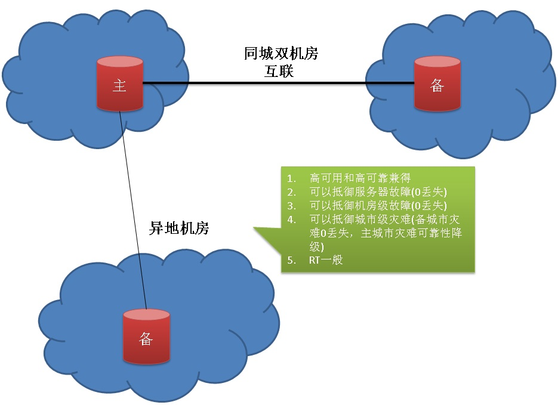

## 阿里云RDS金融数据库(三节点版) - 性能篇      
               
### 作者                
digoal               
                 
### 日期                 
2017-07-13             
                          
### 标签          
PostgreSQL , MySQL , 三节点版 , 金融数据库 , Raft , 分布式共享存储版           
          
----          
           
## 背景        
终于到了性能篇，三节点同时满足了企业对数据库的可用性、可靠性的要求，那么性能如何呢？    
    
提到性能测试，我有几点一定要说明一下，很多朋友对性能的理解可能有偏差，那么如何评判性能的好坏呢？    
    
1、首先要明确测试的环境，包括数据库主机（主要包括CPU、内存、网卡，如果你的数据库能用上FPGA、GPU的计算能力，还得算上他们，例如PostgreSQL就可以利用GPU和FPGA进行计算加速。）、数据存储（主要是各个块大小、Queue deep的连续、随机IOPS能力，连续、随机读写带宽）、测试机和数据库主机的网络（带宽和RT），测试机的硬件指标。    
    
2、明确参照物，没有参照物我们无法评判性能的好与坏。例如三节点、两节点、单节点的对比。    
    
3、明确测试的benchmark，例如对于OLTP场景，可以按工业标准TPC-C进行测试。或者用户可以自己建模进行测试。而对于MySQL的测试，大家喜欢用sysbench以及sysbench中自带的那些test case。     
    
[《数据库界的华山论剑 tpc.org》](../201701/20170125_01.md)      
    
4、测试中，注意数据库驱动、缓存预热、测试客户端、连接数、测试数据量、测试数据的分布。。。等对测试结果带来的干扰。我曾经就有遇到过有朋友同样的硬件环境，因为各种原因，测试出来的结果大相庭径的。    
    
例如测试客户端，开启了DEBUG日志输出，导致测试TPS下降严重。同样的测试CASE，用JAVA写的和用C写的，测试结果也有一定的差异。    
    
5、数据库、存储、OS、防火墙的优化对测试结果的影响也巨大。如果要对比测试结果，那么环境务必保持一致，包括这些配置。    
    
在考虑到以上因素的情况下，与参照物进行对比（例如pg 9.6和pg 10比较，pg和mysql 比较, 三节点和单节点、2节点的比较等），评判性能的好坏才有价值。    
      
## 性能评测case设计    
相信大家会比较关心三节点和单节点、双节点的性能对比，为了更加贴近现实场景我们来看看架构的区别。    
    
单节这里不多说，没有负担性能肯定是首当其冲的。    
    
我们从双节点开始说。    
    
双节点可以部署在同一机房，也可以部署在同城异地机房。    
    
当双节点部署在同城异地机房时，RT一定是打折扣的，所以对于小事务性能一定会下降明显，但是获得的好处是抵御机房级故障。    
    
    
    
同一机房可以获得良好的RT，但是无法抵御机房级故障，也无法同时做到可用性和可靠性，在满足可用性时，可靠性就必须打折扣（因为不能使用完全同步复制）。    
    
    
    
对于三节点，部署非常有弹性，我们可以选择同机房+同城机房的部署方法。可以抵御机房级故障，同时还有极好的RT。做到了性能、可靠性兼得。    
    
    
    
采样同机房+异地机房的部署方法，不仅能抵御机房故障，还能抵御城市灾难。    
    
    
    
对于三节点，还可以选择3机房的部分方法，牺牲一定的RT，可以抵御城市级灾难。    
    
    
    
根据以上论证，不难发现，性能和部署有关，部署和保护级别有关。    
    
三节点的部署极为灵活，根据主备节点的分布，抵御的风险级别不一样，当然RT也不一样。    
    
我们可以得出这样的预期。    
    
    
    
性能怎么样呢？    
    
## 三节点 vs 2节点 vs 单节点    
阿里云RDS目前提供了单节点、双节点、三节点几种形态的产品。  
  
1、单节点，主打经济实用，虽然是单节点，但是数据存储依旧是有多份的，备份和时间点恢复一个都不少。   
  
2、双节点，经典的一主一备架构，相比单节点可以做到更高的可用性和可靠性，但是两个节点的可用性和可靠性不可兼得（如果采用同步模式则失去了可用性，而采用异步模式则失去了可靠性。还好PostgreSQL提供了事务级可控的模式设置）。所以有了三节点。  
  
3、三节点，具备可用性的同时，还具备可靠性（多副本强同步模式，数据0丢失），是企业核心数据库、金融级业务的最佳选择。   
  
在PostgreSQL中，同步模式为事务级可控，目前包含：  
  
异步(到达wal buffer)、本地fsync(持久化)、本地持久化+备库write(到达os buffer)、本地fsync(持久化)+备库fsync(持久化)、本地持久化+备库apply（WAL应用）。     
  
在PostgreSQL中，副本数全局可控，目前包含：  
  
```
{FIRST | ANY } num {(standby_name1 , .... )  | (*) }
```
  
FIRST为经典模式，排在前面的num个STANDBY为同步备，后面的为候选同步备。  
  
ANY为quorum based模式，表示所有节点都是同步备，到达num指定的足够副本数即可。  
  
根据不同的 "同步模式+副本数" 组合，可以根据业务需求，形成非常灵活的数据库HA架构。   
  
下面分别对比三种形态的性能，给用户一个参考，用户有个直观的认识。   
      
## 测试环境    
     
1、双节点配置：    
    
32C，80万IOPS，512G内存，同机房10GB网络。同步复制模式（等待超过1秒自动降级为异步模式）。    
    
2、三节点配置（同机房+同城机房版本）：    
    
32C，80万IOPS，512G内存，同机房10GB网络，同城机房间网络带宽未知。同步复制模式（至少1个备库响应COMMIT RECORD ACK）。    
    
都不使用分组提交，WAL级别都为replica。    
    
以PostgreSQL 单节点、双节点、三节点为例，对比各个模式的性能。    
    
### 1、只读事务    
预期：    
    
只读事务，不管是几节点，性能是一样的。    
    
```    
-- 构造1000万记录，按PK查询。    
create table test1(id int primary key, info text, crt_time timestamp);    
insert into test1 select generate_series(1,10000000), md5(random()::text), now();    
    
-- 测试脚本如下，随机按PK查询。    
vi test1.sql    
\set id random(1,10000000)    
select * from test1 where id=:id;    
    
-- 并发测试    
pgbench -M prepared -n -r -P 1 -f ./test1.sql -c 64 -j 64 -T 120    
```    
    
测试结果    
    
```    
双节点：    
query mode: prepared  
number of clients: 64  
number of threads: 64  
duration: 120 s  
number of transactions actually processed: 127744490  
latency average = 0.060 ms  
latency stddev = 0.017 ms  
tps = 1064517.898216 (including connections establishing)  
tps = 1064671.106607 (excluding connections establishing)  
script statistics:  
 - statement latencies in milliseconds:  
         0.001  \set id random(1,10000000)  
         0.059  select * from test1 where id=:id;  
    
三节点：    
query mode: prepared  
number of clients: 64  
number of threads: 64  
duration: 120 s  
number of transactions actually processed: 128084101  
latency average = 0.060 ms  
latency stddev = 0.029 ms  
tps = 1067351.606315 (including connections establishing)  
tps = 1067570.502782 (excluding connections establishing)  
script statistics:  
 - statement latencies in milliseconds:  
         0.001  \set id random(1,10000000)  
         0.059  select * from test1 where id=:id;  
```    
    
### 2、只写小事务    
预期：    
    
只写的小事务，保护级别越高，RT就越高，RT在整个事务中的占比越高，性能影响就越大。    
    
```    
-- 构造表，UPSERT操作，按PK，有则更新，无则插入。    
create table test2(id int primary key, info text, crt_time timestamp);    
    
-- 测试脚本如下，ID范围1到10亿，有则更新，无则插入。    
vi test2.sql    
\set id random(1,1000000000)    
insert into test2 values (:id, md5(random()::text), now()) on conflict (id) do update set info=excluded.info,crt_time=excluded.crt_time;    
    
-- 并发测试    
pgbench -M prepared -n -r -P 1 -f ./test2.sql -c 64 -j 64 -T 120    
```    
    
测试结果    
    
```    
双节点：    
query mode: prepared  
number of clients: 64  
number of threads: 64  
duration: 120 s  
number of transactions actually processed: 16471972  
latency average = 0.466 ms  
latency stddev = 7.586 ms  
tps = 137244.632272 (including connections establishing)  
tps = 137264.346853 (excluding connections establishing)  
script statistics:  
 - statement latencies in milliseconds:  
         0.001  \set id random(1,1000000000)  
         0.465  insert into test2 values (:id, md5(random()::text), now()) on conflict (id) do update set info=excluded.info,crt_time=excluded.crt_time;  
    
三节点：    
query mode: prepared  
number of clients: 64  
number of threads: 64  
duration: 120 s  
number of transactions actually processed: 15043211  
latency average = 0.510 ms  
latency stddev = 9.061 ms  
tps = 125351.050926 (including connections establishing)  
tps = 125433.189301 (excluding connections establishing)  
script statistics:  
 - statement latencies in milliseconds:  
         0.001  \set id random(1,1000000000)  
         0.509  insert into test2 values (:id, md5(random()::text), now()) on conflict (id) do update set info=excluded.info,crt_time=excluded.crt_time;  
```    
    
### 读写混合事务（读多写少）    
预期：    
  
读多写少的混合事务，保护级别越高，RT就越高，但RT在整个事务中的占比与事务本身的耗时有关，整个事务的时间越短，RT的性能影响就越明显。    
    
```    
-- 构造读请求表，构造1000万记录，按PK查询。    
create table test3(id int primary key, info text, crt_time timestamp);    
insert into test3 select generate_series(1,10000000), md5(random()::text), now();    
    
-- 构造表，UPSERT操作，按PK，有则更新，无则插入。    
create table test4(id int primary key, info text, crt_time timestamp);    
    
-- 测试脚本如下，10个只读，一笔写操作，ID范围1到10亿，有则更新，无则插入。    
vi test3.sql    
\set id1 random(1,10000000)    
\set id2 random(1,1000000000)    
begin;  
select * from test3 where id=:id1;    
select * from test3 where id=:id1+1000;    
select * from test3 where id=:id1+5000;    
select * from test3 where id=:id1+10000;    
select * from test3 where id=:id1+100;    
select * from test3 where id=:id1-1000;    
select * from test3 where id=:id1-5000;    
select * from test3 where id=:id1-10000;    
select * from test3 where id=:id1+800;    
select * from test3 where id=:id1-800;    
insert into test4 values (:id2, md5(random()::text), now()) on conflict (id) do update set info=excluded.info,crt_time=excluded.crt_time;    
end;  
  
-- 并发测试    
pgbench -M prepared -n -r -P 1 -f ./test3.sql -c 64 -j 64 -T 120    
```    
    
测试结果    
    
```    
双节点：    
query mode: prepared  
number of clients: 64  
number of threads: 64  
duration: 120 s  
number of transactions actually processed: 6262104  
latency average = 1.226 ms  
latency stddev = 7.466 ms  
tps = 52175.718194 (including connections establishing)  
tps = 52182.927235 (excluding connections establishing)  
script statistics:  
 - statement latencies in milliseconds:  
         0.001  \set id1 random(1,10000000)  
         0.001  \set id2 random(1,1000000000)  
         0.034  begin;  
         0.069  select * from test3 where id=:id1;  
         0.065  select * from test3 where id=:id1+1000;  
         0.063  select * from test3 where id=:id1+5000;  
         0.062  select * from test3 where id=:id1+10000;  
         0.060  select * from test3 where id=:id1+100;  
         0.060  select * from test3 where id=:id1-1000;  
         0.060  select * from test3 where id=:id1-5000;  
         0.059  select * from test3 where id=:id1-10000;  
         0.058  select * from test3 where id=:id1+800;  
         0.058  select * from test3 where id=:id1-800;  
         0.104  insert into test4 values (:id2, md5(random()::text), now()) on conflict (id) do update set info=excluded.info,crt_time=excluded.crt_time;  
         0.471  end;  
    
三节点：    
query mode: prepared  
number of clients: 64  
number of threads: 64  
duration: 120 s  
number of transactions actually processed: 5926527  
latency average = 1.296 ms  
latency stddev = 9.677 ms  
tps = 49377.940916 (including connections establishing)  
tps = 49386.111317 (excluding connections establishing)  
script statistics:  
 - statement latencies in milliseconds:  
         0.002  \set id1 random(1,10000000)  
         0.001  \set id2 random(1,1000000000)  
         0.035  begin;  
         0.070  select * from test3 where id=:id1;  
         0.066  select * from test3 where id=:id1+1000;  
         0.064  select * from test3 where id=:id1+5000;  
         0.063  select * from test3 where id=:id1+10000;  
         0.061  select * from test3 where id=:id1+100;  
         0.061  select * from test3 where id=:id1-1000;  
         0.060  select * from test3 where id=:id1-5000;  
         0.060  select * from test3 where id=:id1-10000;  
         0.059  select * from test3 where id=:id1+800;  
         0.058  select * from test3 where id=:id1-800;  
         0.113  insert into test4 values (:id2, md5(random()::text), now()) on conflict (id) do update set info=excluded.info,crt_time=excluded.crt_time;  
         0.524  end;  
```    
    
### 读写混合事务（读少写多）    
预期：    
  
读少写多的混合事务，保护级别越高，RT就越高，但RT在整个事务中的占比与事务本身的耗时有关，整个事务的时间越短，RT的性能影响就越明显。    
    
```    
-- 测试脚本如下，10个写，一个读。    
vi test4.sql    
\set id1 random(1,10000000)    
\set id2 random(1,1000000000)    
begin;  
select * from test3 where id=:id1;    
insert into test4 values (:id2, md5(random()::text), now()) on conflict (id) do update set info=excluded.info,crt_time=excluded.crt_time;    
insert into test4 values (:id2+101, md5(random()::text), now()) on conflict (id) do update set info=excluded.info,crt_time=excluded.crt_time;    
insert into test4 values (:id2+1020, md5(random()::text), now()) on conflict (id) do update set info=excluded.info,crt_time=excluded.crt_time;    
insert into test4 values (:id2+2030, md5(random()::text), now()) on conflict (id) do update set info=excluded.info,crt_time=excluded.crt_time;    
insert into test4 values (:id2+5040, md5(random()::text), now()) on conflict (id) do update set info=excluded.info,crt_time=excluded.crt_time;    
insert into test4 values (:id2+10500, md5(random()::text), now()) on conflict (id) do update set info=excluded.info,crt_time=excluded.crt_time;    
insert into test4 values (:id2-106, md5(random()::text), now()) on conflict (id) do update set info=excluded.info,crt_time=excluded.crt_time;    
insert into test4 values (:id2-1070, md5(random()::text), now()) on conflict (id) do update set info=excluded.info,crt_time=excluded.crt_time;    
insert into test4 values (:id2-5080, md5(random()::text), now()) on conflict (id) do update set info=excluded.info,crt_time=excluded.crt_time;    
insert into test4 values (:id2-9090, md5(random()::text), now()) on conflict (id) do update set info=excluded.info,crt_time=excluded.crt_time;    
end;  
    
-- 并发测试    
pgbench -M prepared -n -r -P 1 -f ./test4.sql -c 64 -j 64 -T 120    
```    
    
测试结果    
    
```    
双节点：    
query mode: prepared  
number of clients: 64  
number of threads: 64  
duration: 120 s  
number of transactions actually processed: 3290435  
latency average = 2.334 ms  
latency stddev = 22.840 ms  
tps = 27416.206491 (including connections establishing)  
tps = 27419.825894 (excluding connections establishing)  
script statistics:  
 - statement latencies in milliseconds:  
         0.001  \set id1 random(1,10000000)  
         0.001  \set id2 random(1,1000000000)  
         0.035  begin;  
         0.079  select * from test3 where id=:id1;  
         0.162  insert into test4 values (:id2, md5(random()::text), now()) on conflict (id) do update set info=excluded.info,crt_time=excluded.crt_time;  
         0.110  insert into test4 values (:id2+101, md5(random()::text), now()) on conflict (id) do update set info=excluded.info,crt_time=excluded.crt_time;  
         0.107  insert into test4 values (:id2+1020, md5(random()::text), now()) on conflict (id) do update set info=excluded.info,crt_time=excluded.crt_time;  
         0.106  insert into test4 values (:id2+2030, md5(random()::text), now()) on conflict (id) do update set info=excluded.info,crt_time=excluded.crt_time;  
         0.107  insert into test4 values (:id2+5040, md5(random()::text), now()) on conflict (id) do update set info=excluded.info,crt_time=excluded.crt_time;  
         0.106  insert into test4 values (:id2+10500, md5(random()::text), now()) on conflict (id) do update set info=excluded.info,crt_time=excluded.crt_time;  
         0.099  insert into test4 values (:id2-106, md5(random()::text), now()) on conflict (id) do update set info=excluded.info,crt_time=excluded.crt_time;  
         0.099  insert into test4 values (:id2-1070, md5(random()::text), now()) on conflict (id) do update set info=excluded.info,crt_time=excluded.crt_time;  
         0.100  insert into test4 values (:id2-5080, md5(random()::text), now()) on conflict (id) do update set info=excluded.info,crt_time=excluded.crt_time;  
         0.099  insert into test4 values (:id2-9090, md5(random()::text), now()) on conflict (id) do update set info=excluded.info,crt_time=excluded.crt_time;  
         1.118  end;  
    
三节点：    
query mode: prepared  
number of clients: 64  
number of threads: 64  
duration: 120 s  
number of transactions actually processed: 3179246  
latency average = 2.416 ms  
latency stddev = 25.711 ms  
tps = 26485.773742 (including connections establishing)  
tps = 26489.361989 (excluding connections establishing)  
script statistics:  
 - statement latencies in milliseconds:  
         0.002  \set id1 random(1,10000000)  
         0.001  \set id2 random(1,1000000000)  
         0.035  begin;  
         0.079  select * from test3 where id=:id1;  
         0.161  insert into test4 values (:id2, md5(random()::text), now()) on conflict (id) do update set info=excluded.info,crt_time=excluded.crt_time;  
         0.107  insert into test4 values (:id2+101, md5(random()::text), now()) on conflict (id) do update set info=excluded.info,crt_time=excluded.crt_time;  
         0.104  insert into test4 values (:id2+1020, md5(random()::text), now()) on conflict (id) do update set info=excluded.info,crt_time=excluded.crt_time;  
         0.102  insert into test4 values (:id2+2030, md5(random()::text), now()) on conflict (id) do update set info=excluded.info,crt_time=excluded.crt_time;  
         0.101  insert into test4 values (:id2+5040, md5(random()::text), now()) on conflict (id) do update set info=excluded.info,crt_time=excluded.crt_time;  
         0.100  insert into test4 values (:id2+10500, md5(random()::text), now()) on conflict (id) do update set info=excluded.info,crt_time=excluded.crt_time;  
         0.096  insert into test4 values (:id2-106, md5(random()::text), now()) on conflict (id) do update set info=excluded.info,crt_time=excluded.crt_time;  
         0.094  insert into test4 values (:id2-1070, md5(random()::text), now()) on conflict (id) do update set info=excluded.info,crt_time=excluded.crt_time;  
         0.093  insert into test4 values (:id2-5080, md5(random()::text), now()) on conflict (id) do update set info=excluded.info,crt_time=excluded.crt_time;  
         0.092  insert into test4 values (:id2-9090, md5(random()::text), now()) on conflict (id) do update set info=excluded.info,crt_time=excluded.crt_time;  
         1.241  end;  
```    
    
性能对比报表如图：    
    
#### 1、TPS\QPS对比  
    
TPS     |只读   |只写   |读多写少       |读少写多    
---|---|---|---|---    
双节点(tps)     |1064671        |137264 |52182  |27419    
三节点(tps)     |1067570        |125433 |49386  |26489   
双节点(qps)     |1064671        |137264 |574002 |301609  
三节点(qps)     |1067570        |125433 |543246 |291379  
性能损耗        |-0.27%         |8.6%   |5.3%   |3.4%  
    
#### 2、平均响应时间  
    
平均响应时间    |只读   |只写   |读多写少       |读少写多    
---|---|---|---|---    
双节点(ms)      |0.060   |0.466  |1.226  |2.334    
三节点(ms)      |0.060  |0.510  |1.296  |2.416    
    
#### 3、响应抖动对比(方差)  
抖动主要和SSD的GC回收的管理机制，以及主备网络的稳定性有关。      
                                    
响应时间方差    |只读   |只写   |读多写少       |读少写多    
---|---|---|---|---    
双节点(ms)      |0.017  |7.586  |7.466  |22.840    
三节点(ms)      |0.029  |9.061  |9.677  |25.711    
  
#### 4、对比图  
  
1、TPS  
  
   
  
2、QPS  
  
    
  
3、事务响应时间  
  
    
  
4、事务响应时间抖动（方差）  
  
抖动主要和SSD的GC回收的管理机制，以及主备网络的稳定性有关。  
      
     
    
## 复制层面 - MySQL和PostgreSQL的差异    
复制机制决定了两种产品的差异。    
    
PostgreSQL，通过WAL的物理式复制同步备库。产生多少WAL就复制多少WAL，不需要等待事务结束才开始复制。因此备库与主库的WAL延迟与事务大小无关，仅仅与网络带宽和网络RT有关。每次事务结束时（不论事务大小），仅仅等待COMMIT RECORD ACK即可（commit record是固定大小的，非常小），所以不管事务多大，延迟都是等效的。    
    
MySQL，通过binlog进行复制同步备库。主库上没有结束的事务，binlog不会发给备库，因此备库的延迟和事务大小直接相关。事务越大(指产生影响的ROW越多的事务)，产生的BINLOG越多，事务提交的RT越高，延迟越严重。MySQL业务应尽量避免大事务。    
    
## 小结    
从测试结果不难发现，三节点与双节点的读性能几乎一致，而三节点写事务性能相比双节点略低一丁点(5%左右)，换来的是鱼与熊掌兼得(高可用和高可靠)。阿里云RDS(三节点版)已成为金融级用户的最佳选择。   
    
三节点的性能影响主要来自事务提交后，等待WAL或binlog发送给备库，收到ACK需要多久。PostgreSQL和MySQL的差异如上所述。    
    
经过以上测试，不同类型的场景，预期和实际测试效果一致。    
    
单节点的性能一定是最好的（因为不需要等待备库复制事务的WAL ACK），但是对于可用性和可靠性的测试意义不大。另一方面我们也能得到这样的推论。        
    
1、如果两节点为异步复制配置，那么性能应该和单节点相当。    
    
2、如果两节点为同步（带自动降级功能）复制配置，那么性能和三节点相当，这与测试完全相符，三节点和两节点的性能不相上下。    
    
### 1、只读事务    
    
只读事务，不管是几节点，性能是一样的。    
    
### 2、只写小事务    
    
只写的小事务，保护级别越高，RT就越高，RT在整个事务中的占比越高，性能影响就越大。    
  
### 3、读写混合事务（读多写少）    
    
读多写少的混合事务，保护级别越高，RT就越高，但RT在整个事务中的占比与事务本身的耗时有关，整个事务的时间越短，RT的性能影响就越明显。      
  
### 4、读写混合事务（读少写多）    
    
读少写多的混合事务，保护级别越高，RT就越高，但RT在整个事务中的占比与事务本身的耗时有关，整个事务的时间越短，RT的性能影响就越明显。      
      
## 系列文章        
[《阿里云RDS金融数据库(三节点版) - 背景篇》](../201707/20170709_02.md)      
       
[《阿里云RDS金融数据库(三节点版) - 理论篇》](../201707/20170710_01.md)      
        
[《阿里云RDS金融数据库(三节点版) - 性能篇》](../201707/20170713_01.md)        
        
[《阿里云RDS金融数据库(三节点版) - 案例篇》](../201707/20170723_01.md)        
         
## 阿里云RDS金融数据库(三节点版)      
[阿里云RDS金融数据库 - MySQL三节点版](https://help.aliyun.com/document_detail/51701.htm)          
          
阿里云RDS金融数据库 - PostgreSQL三节点版(敬请期待)          
          
  
<a rel="nofollow" href="http://info.flagcounter.com/h9V1"  ></a>  
  
  
  
  
  
  
## [digoal's 大量PostgreSQL文章入口](https://github.com/digoal/blog/blob/master/README.md "22709685feb7cab07d30f30387f0a9ae")
  
