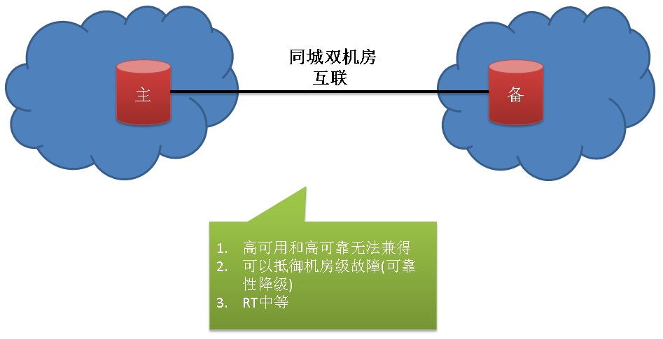
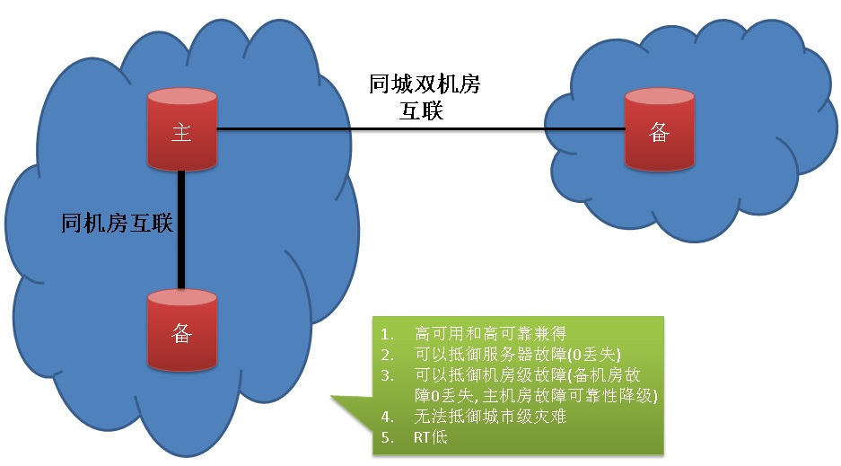
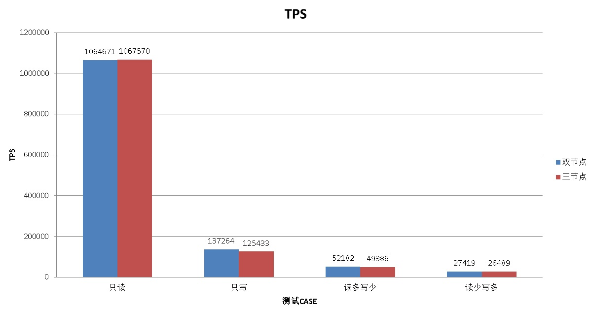
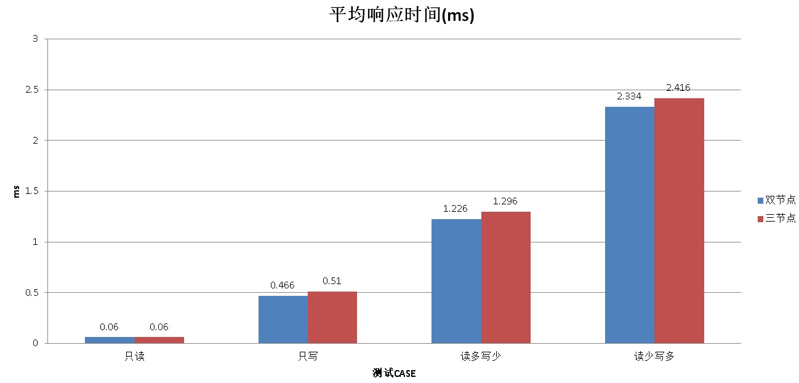

## 阿里云RDS金融数据库(三节点版) - 性能篇    
             
### 作者              
digoal             
               
### 日期               
2017-07-13           
                        
### 标签        
PostgreSQL , MySQL , 三节点版 , 金融数据库 , Raft , 分布式共享存储版         
        
----        
         
## 背景      
终于到了性能篇，三节点同时满足了企业对数据库的可用性、可靠性的要求，那么性能如何呢？  
  
提到性能测试，我有几点一定要说明一下，很多朋友对性能的理解可能有偏差，那么如何评判性能的好坏呢？  
  
1、首先要明确测试的环境，包括数据库主机（主要包括CPU、内存、网卡，如果你的数据库能用上FPGA、GPU的计算能力，还得算上他们，例如PostgreSQL就可以利用GPU和FPGA进行计算加速。）、数据存储（主要是各个块大小、Queue deep的连续、随机IOPS能力，连续、随机读写带宽）、测试机和数据库主机的网络（带宽和RT），测试机的硬件指标。  
  
2、明确参照物，没有参照物我们无法评判性能的好与坏。例如三节点、两节点、单节点的对比。  
  
3、明确测试的benchmark，例如对于OLTP场景，可以按工业标准TPC-C进行测试。或者用户可以自己建模进行测试。而对于MySQL的测试，大家喜欢用sysbench以及sysbench中自带的那些test case。   
  
[《数据库界的华山论剑 tpc.org》](../201701/20170125_01.md)    
  
4、测试中，注意数据库驱动、缓存预热、测试客户端、连接数、测试数据量、测试数据的分布。。。等对测试结果带来的干扰。我曾经就有遇到过有朋友同样的硬件环境，因为各种原因，测试出来的结果大相庭径的。  
  
例如测试客户端，开启了DEBUG日志输出，导致测试TPS下降严重。同样的测试CASE，用JAVA写的和用C写的，测试结果也有一定的差异。  
  
5、数据库、存储、OS、防火墙的优化对测试结果的影响也巨大。如果要对比测试结果，那么环境务必保持一致，包括这些配置。  
  
在考虑到以上因素的情况下，与参照物进行对比（例如pg 9.6和pg 10比较，pg和mysql 比较, 三节点和单节点、2节点的比较等），评判性能的好坏才有价值。  
    
## 性能评测case设计  
相信大家会比较关心三节点和单节点、双节点的性能对比，为了更加贴近现实场景我们来看看架构的区别。  
  
单节这里不多说，没有负担性能肯定是首当其冲的。  
  
我们从双节点开始说。  
  
双节点可以部署在同一机房，也可以部署在同城异地机房。  
  
当双节点部署在同城异地机房时，RT一定是打折扣的，所以对于小事务性能一定会下降明显，但是获得的好处是抵御机房级故障。  
  
  
  
同一机房可以获得良好的RT，但是无法抵御机房级故障，也无法同时做到可用性和可靠性，在满足可用性时，可靠性就必须打折扣（因为不能使用完全同步复制）。  
  
  
  
对于三节点，部署非常有弹性，我们可以选择同机房+同城机房的部署方法。可以抵御机房级故障，同时还有极好的RT。做到了性能、可靠性兼得。  
  
  
  
采样同机房+异地机房的部署方法，不仅能抵御机房故障，还能抵御城市灾难。  
  
  
  
对于三节点，还可以选择3机房的部分方法，牺牲一定的RT，可以抵御城市级灾难。  
  
  
  
根据以上论证，不难发现，性能和部署有关，部署和保护级别有关。  
  
三节点的部署极为灵活，根据主备节点的分布，抵御的风险级别不一样，当然RT也不一样。  
  
我们可以得出这样的预期。  
  
  
  
性能怎么样呢？  
  
## 三节点 vs 2节点 vs 单节点  
阿里云RDS目前提供了单节点、双节点、三节点几种形态的产品。  
  
1、单节点，主打经济实用，虽然是单节点，但是数据存储依旧是有多份的，备份和时间点恢复一个都不少。  
  
2、双节点，具备更高的可用性，主机故障带来的故障时间更短，但是采用的是异步（同步可降级模式）可靠性在定义的SLA范围内（无法做到0丢失）。  
  
3、三节点，具备可用性的同时，还具备可靠性（数据0丢失），金融级的最佳选择。  
  
下面分别对比三种形态的性能，给用户一个参考，用户有个直观的认识。  
  
## 测试环境  
1、单节点配置：  
  
32C，80万IOPS，512G内存，10GB网络。  
  
2、双节点配置：  
  
32C，80万IOPS，512G内存，同机房10GB网络。同步复制模式（等待超过1秒自动降级为异步模式）。  
  
3、三节点配置（同机房+同城机房版本）：  
  
32C，80万IOPS，512G内存，同机房10GB网络，同城机房间网络带宽未知。同步模式（只是1个备库响应COMMIT RECORD ACK）。  
  
都不使用分组提交，WAL级别都为replica。  
  
以PostgreSQL 单节点、双节点、三节点为例，对比各个模式的性能。  
  
### 只读事务  
预期：  
  
只读事务，不管是几节点，性能是一样的。  
  
```  
-- 构造1000万记录，按PK查询。  
create table test1(id int primary key, info text, crt_time timestamp);  
insert into test1 select generate_series(1,10000000), md5(random()::text), now();  
  
-- 测试脚本如下，随机按PK查询。  
vi test1.sql  
\set id random(1,10000000)  
select * from test1 where id=:id;  
  
-- 并发测试  
pgbench -M prepared -n -r -P 1 -f ./test1.sql -c 64 -j 64 -T 120  
```  
  
测试结果  
  
```  
单节点：  
query mode: prepared  
number of clients: 64  
number of threads: 64  
duration: 120 s  
number of transactions actually processed: 120630026  
latency average = 0.063 ms  
latency stddev = 0.031 ms  
tps = 1005132.560523 (including connections establishing)  
tps = 1016279.347885 (excluding connections establishing)  
script statistics:  
 - statement latencies in milliseconds:  
         0.001  \set id random(1,10000000)  
         0.062  select * from test1 where id=:id;  
  
三节点：  
query mode: prepared  
number of clients: 64  
number of threads: 64  
duration: 120 s  
number of transactions actually processed: 125610106  
latency average = 0.061 ms  
latency stddev = 0.015 ms  
tps = 1046622.166617 (including connections establishing)  
tps = 1046771.049111 (excluding connections establishing)  
script statistics:  
 - statement latencies in milliseconds:  
         0.001  \set id random(1,10000000)  
         0.060  select * from test1 where id=:id;  
```  
  
### 只写小事务  
预期：  
  
只写的小事务，保护级别越高，RT越高，RT在整个事务中的占比越高，性能越差。  
  
```  
-- 构造表，UPSERT操作，按PK，有则更新，无则插入。  
create table test2(id int primary key, info text, crt_time timestamp);  
  
-- 测试脚本如下，ID范围1到10亿，有则更新，无则插入。  
vi test2.sql  
\set id random(1,1000000000)  
insert into test2 values (:id, md5(random()::text), now()) on conflict (id) do update set info=excluded.info,crt_time=excluded.crt_time;  
  
-- 并发测试  
pgbench -M prepared -n -r -P 1 -f ./test2.sql -c 64 -j 64 -T 120  
```  
  
测试结果  
  
```  
单节点：  
query mode: prepared  
number of clients: 64  
number of threads: 64  
duration: 120 s  
number of transactions actually processed: 24987162  
latency average = 0.307 ms  
latency stddev = 0.383 ms  
tps = 208177.704141 (including connections establishing)  
tps = 208197.846664 (excluding connections establishing)  
script statistics:  
 - statement latencies in milliseconds:  
         0.001  \set id random(1,1000000000)  
         0.306  insert into test2 values (:id, md5(random()::text), now()) on conflict (id) do update set info=excluded.info,crt_time=excluded.crt_time;  
  
三节点：  
query mode: prepared  
number of clients: 64  
number of threads: 64  
duration: 120 s  
number of transactions actually processed: 17516730  
latency average = 0.439 ms  
latency stddev = 8.756 ms  
tps = 145723.501673 (including connections establishing)  
tps = 145743.685418 (excluding connections establishing)  
script statistics:  
 - statement latencies in milliseconds:  
         0.001  \set id random(1,1000000000)  
         0.438  insert into test2 values (:id, md5(random()::text), now()) on conflict (id) do update set info=excluded.info,crt_time=excluded.crt_time;  
```  
  
### 读写混合事务（读多写少）  
预期：  
  
读多写少的混合事务，保护级别越高，RT越高，但RT在整个事务中的占比与事务本身的耗时有关，整个事务的时间越短，性能越差。  
  
```  
-- 构造读请求表，构造1000万记录，按PK查询。  
create table test3(id int primary key, info text, crt_time timestamp);  
insert into test3 select generate_series(1,10000000), md5(random()::text), now();  
  
-- 构造表，UPSERT操作，按PK，有则更新，无则插入。  
create table test4(id int primary key, info text, crt_time timestamp);  
  
-- 测试脚本如下，10个只读，一笔写操作，ID范围1到10亿，有则更新，无则插入。  
vi test3.sql  
\set id1 random(1,10000000)  
\set id2 random(1,1000000000)  
select * from test3 where id=:id1;  
select * from test3 where id=:id1+1000;  
select * from test3 where id=:id1+5000;  
select * from test3 where id=:id1+10000;  
select * from test3 where id=:id1+100;  
select * from test3 where id=:id1-1000;  
select * from test3 where id=:id1-5000;  
select * from test3 where id=:id1-10000;  
select * from test3 where id=:id1+800;  
select * from test3 where id=:id1-800;  
insert into test4 values (:id2, md5(random()::text), now()) on conflict (id) do update set info=excluded.info,crt_time=excluded.crt_time;  
  
-- 并发测试  
pgbench -M prepared -n -r -P 1 -f ./test3.sql -c 64 -j 64 -T 120  
```  
  
测试结果  
  
```  
单节点：  
query mode: prepared  
number of clients: 64  
number of threads: 64  
duration: 120 s  
number of transactions actually processed: 7497290  
latency average = 1.024 ms  
latency stddev = 0.294 ms  
tps = 62469.713487 (including connections establishing)  
tps = 62476.551706 (excluding connections establishing)  
script statistics:  
 - statement latencies in milliseconds:  
         0.001  \set id1 random(1,10000000)  
         0.001  \set id2 random(1,1000000000)  
         0.080  select * from test3 where id=:id1;  
         0.074  select * from test3 where id=:id1+1000;  
         0.072  select * from test3 where id=:id1+5000;  
         0.071  select * from test3 where id=:id1+10000;  
         0.069  select * from test3 where id=:id1+100;  
         0.069  select * from test3 where id=:id1-1000;  
         0.068  select * from test3 where id=:id1-5000;  
         0.068  select * from test3 where id=:id1-10000;  
         0.067  select * from test3 where id=:id1+800;  
         0.066  select * from test3 where id=:id1-800;  
         0.320  insert into test4 values (:id2, md5(random()::text), now()) on conflict (id) do update set info=excluded.info,crt_time=excluded.crt_time;  
  
三节点：  
query mode: prepared  
number of clients: 64  
number of threads: 64  
duration: 120 s  
number of transactions actually processed: 6113773  
latency average = 1.256 ms  
latency stddev = 8.362 ms  
tps = 50936.622922 (including connections establishing)  
tps = 50943.325789 (excluding connections establishing)  
script statistics:  
 - statement latencies in milliseconds:  
         0.001  \set id1 random(1,10000000)  
         0.001  \set id2 random(1,1000000000)  
         0.085  select * from test3 where id=:id1;  
         0.078  select * from test3 where id=:id1+1000;  
         0.075  select * from test3 where id=:id1+5000;  
         0.074  select * from test3 where id=:id1+10000;  
         0.072  select * from test3 where id=:id1+100;  
         0.072  select * from test3 where id=:id1-1000;  
         0.071  select * from test3 where id=:id1-5000;  
         0.070  select * from test3 where id=:id1-10000;  
         0.069  select * from test3 where id=:id1+800;  
         0.068  select * from test3 where id=:id1-800;  
         0.519  insert into test4 values (:id2, md5(random()::text), now()) on conflict (id) do update set info=excluded.info,crt_time=excluded.crt_time;  
```  
  
### 读写混合事务（读少写多）  
预期：  
  
读少写多的混合事务，保护级别越高，RT越高，但RT在整个事务中的占比与事务本身的耗时有关，整个事务的时间越短，性能越差。  
  
```  
-- 测试脚本如下，10个写，一个读。  
vi test4.sql  
\set id1 random(1,10000000)  
\set id2 random(1,1000000000)  
select * from test3 where id=:id1;  
insert into test4 values (:id2, md5(random()::text), now()) on conflict (id) do update set info=excluded.info,crt_time=excluded.crt_time;  
insert into test4 values (:id2+100, md5(random()::text), now()) on conflict (id) do update set info=excluded.info,crt_time=excluded.crt_time;  
insert into test4 values (:id2+1000, md5(random()::text), now()) on conflict (id) do update set info=excluded.info,crt_time=excluded.crt_time;  
insert into test4 values (:id2+2000, md5(random()::text), now()) on conflict (id) do update set info=excluded.info,crt_time=excluded.crt_time;  
insert into test4 values (:id2+5000, md5(random()::text), now()) on conflict (id) do update set info=excluded.info,crt_time=excluded.crt_time;  
insert into test4 values (:id2+10000, md5(random()::text), now()) on conflict (id) do update set info=excluded.info,crt_time=excluded.crt_time;  
insert into test4 values (:id2-100, md5(random()::text), now()) on conflict (id) do update set info=excluded.info,crt_time=excluded.crt_time;  
insert into test4 values (:id2-1000, md5(random()::text), now()) on conflict (id) do update set info=excluded.info,crt_time=excluded.crt_time;  
insert into test4 values (:id2-5000, md5(random()::text), now()) on conflict (id) do update set info=excluded.info,crt_time=excluded.crt_time;  
insert into test4 values (:id2-9000, md5(random()::text), now()) on conflict (id) do update set info=excluded.info,crt_time=excluded.crt_time;  
  
-- 并发测试  
pgbench -M prepared -n -r -P 1 -f ./test4.sql -c 64 -j 64 -T 120  
```  
  
测试结果  
  
```  
单节点：  
query mode: prepared  
number of clients: 64  
number of threads: 64  
duration: 120 s  
number of transactions actually processed: 2519640  
latency average = 3.048 ms  
latency stddev = 1.192 ms  
tps = 20994.303252 (including connections establishing)  
tps = 20996.499448 (excluding connections establishing)  
script statistics:  
 - statement latencies in milliseconds:  
         0.001  \set id1 random(1,10000000)  
         0.000  \set id2 random(1,1000000000)  
         0.078  select * from test3 where id=:id1;  
         0.301  insert into test4 values (:id2, md5(random()::text), now()) on conflict (id) do update set info=excluded.info,crt_time=excluded.crt_time;  
         0.297  insert into test4 values (:id2+100, md5(random()::text), now()) on conflict (id) do update set info=excluded.info,crt_time=excluded.crt_time;  
         0.296  insert into test4 values (:id2+1000, md5(random()::text), now()) on conflict (id) do update set info=excluded.info,crt_time=excluded.crt_time;  
         0.296  insert into test4 values (:id2+2000, md5(random()::text), now()) on conflict (id) do update set info=excluded.info,crt_time=excluded.crt_time;  
         0.296  insert into test4 values (:id2+5000, md5(random()::text), now()) on conflict (id) do update set info=excluded.info,crt_time=excluded.crt_time;  
         0.297  insert into test4 values (:id2+10000, md5(random()::text), now()) on conflict (id) do update set info=excluded.info,crt_time=excluded.crt_time;  
         0.295  insert into test4 values (:id2-100, md5(random()::text), now()) on conflict (id) do update set info=excluded.info,crt_time=excluded.crt_time;  
         0.296  insert into test4 values (:id2-1000, md5(random()::text), now()) on conflict (id) do update set info=excluded.info,crt_time=excluded.crt_time;  
         0.297  insert into test4 values (:id2-5000, md5(random()::text), now()) on conflict (id) do update set info=excluded.info,crt_time=excluded.crt_time;  
         0.297  insert into test4 values (:id2-9000, md5(random()::text), now()) on conflict (id) do update set info=excluded.info,crt_time=excluded.crt_time;  
  
三节点：  
query mode: prepared  
number of clients: 64  
number of threads: 64  
duration: 120 s  
number of transactions actually processed: 1638278  
latency average = 4.687 ms  
latency stddev = 30.096 ms  
tps = 13649.890904 (including connections establishing)  
tps = 13651.483514 (excluding connections establishing)  
script statistics:  
 - statement latencies in milliseconds:  
         0.002  \set id1 random(1,10000000)  
         0.000  \set id2 random(1,1000000000)  
         0.079  select * from test3 where id=:id1;  
         0.490  insert into test4 values (:id2, md5(random()::text), now()) on conflict (id) do update set info=excluded.info,crt_time=excluded.crt_time;  
         0.464  insert into test4 values (:id2+100, md5(random()::text), now()) on conflict (id) do update set info=excluded.info,crt_time=excluded.crt_time;  
         0.463  insert into test4 values (:id2+1000, md5(random()::text), now()) on conflict (id) do update set info=excluded.info,crt_time=excluded.crt_time;  
         0.454  insert into test4 values (:id2+2000, md5(random()::text), now()) on conflict (id) do update set info=excluded.info,crt_time=excluded.crt_time;  
         0.448  insert into test4 values (:id2+5000, md5(random()::text), now()) on conflict (id) do update set info=excluded.info,crt_time=excluded.crt_time;  
         0.461  insert into test4 values (:id2+10000, md5(random()::text), now()) on conflict (id) do update set info=excluded.info,crt_time=excluded.crt_time;  
         0.455  insert into test4 values (:id2-100, md5(random()::text), now()) on conflict (id) do update set info=excluded.info,crt_time=excluded.crt_time;  
         0.452  insert into test4 values (:id2-1000, md5(random()::text), now()) on conflict (id) do update set info=excluded.info,crt_time=excluded.crt_time;  
         0.466  insert into test4 values (:id2-5000, md5(random()::text), now()) on conflict (id) do update set info=excluded.info,crt_time=excluded.crt_time;  
         0.453  insert into test4 values (:id2-9000, md5(random()::text), now()) on conflict (id) do update set info=excluded.info,crt_time=excluded.crt_time;  
```  
  
性能对比报表如图：  
  
#### TPS\QPS对比
  
TPS	|只读	|只写	|读多写少	|读少写多  
---|---|---|---|---  
单节点(tps)	|1016279	|208197	|62476	|20996  
单节点(qps)	|1016279	|208197	|687236 |230956
三节点(tps)	|1046771	|145743	|50943	|13651  
三节点(qps)	|1046771	|145743	|560373 |150161
  
#### 响应抖动对比(方差)
				  
响应时间方差	|只读	|只写	|读多写少	|读少写多  
---|---|---|---|---  
单节点(ms)	|0.031	|0.383	|0.294	|1.192  
三节点(ms)	|0.015	|8.756	|8.362	|30.096  
    
  
  
  
  
  
  
## 复制层面 - MySQL和PostgreSQL的差异  
复制机制决定了两种产品的差异。  
  
PostgreSQL，通过WAL的物理式复制同步备库。产生多少WAL就复制多少WAL，不需要等待事务结束才开始复制。因此备库与主库的WAL延迟与事务大小无关，仅仅与网络带宽和网络RT有关。每次事务结束时（不论事务大小），仅仅等待COMMIT RECORD ACK即可（commit record是固定大小的，非常小），所以不管事务多大，延迟都是等效的。  
  
MySQL，通过binlog进行复制同步备库。主库上没有结束的事务，binlog不会发给备库，因此备库的延迟和事务大小直接相关。事务越大(指产生影响的ROW越多的事务)，产生的BINLOG越多，事务提交的RT越高，延迟越严重。MySQL业务应尽量避免大事务。  
  
## 小结  
从测试结果不难发现，三节点在写事务层面相比单节点要低一些（但是在接受范围内），但给用户换来的是高可用和高可靠兼得的效果。毕竟性能可以通过拆库，优化等很多手段来弥补。金融级用户看中的更多是可靠性和可用性，阿里云RDS三节点版本是很好的选择。    
  
三节点的性能影响主要来自事务提交后，等待WAL或binlog发送给备库，收到ACK需要多久。PostgreSQL和MySQL的差异如上所述。  
  
不同类型的场景，预期和实际测试效果一致。  
  
虽然没有测试两节点，但是可以根据前面介绍的架构以及数据库的复制原理，推论出它的结果。   
  
1、如果两节点为异步复制配置，那么性能应该和单节点相当。  
  
2、如果两节点为同步（带自动降级功能）复制配置，那么性能和三节点相当。  
  
### 只读事务  
  
只读事务，不管是几节点，性能是一样的。  
  
### 只写小事务  
  
只写的小事务，保护级别越高，RT越高，RT在整个事务中的占比越高，性能越差。  
  
### 读写混合事务（读多写少）  
  
读多写少的混合事务，保护级别越高，RT越高，但RT在整个事务中的占比与事务本身的耗时有关，整个事务的时间越短，性能越差。  
  
### 读写混合事务（读少写多）  
  
读少写多的混合事务，保护级别越高，RT越高，但RT在整个事务中的占比与事务本身的耗时有关，整个事务的时间越短，性能越差。  
    
## 系列文章      
[《阿里云RDS金融数据库(三节点版) - 背景篇》](../201707/20170709_02.md)    
     
[《阿里云RDS金融数据库(三节点版) - 理论篇》](../201707/20170710_01.md)    
      
[《阿里云RDS金融数据库(三节点版) - 性能篇》](../201707/20170713_01.md)      
      
[《阿里云RDS金融数据库(三节点版) - 案例篇》]()      
       
## 阿里云RDS金融数据库(三节点版)    
[阿里云RDS金融数据库 - MySQL三节点版](https://help.aliyun.com/document_detail/51701.htm)        
        
阿里云RDS金融数据库 - PostgreSQL三节点版(敬请期待)        
        
