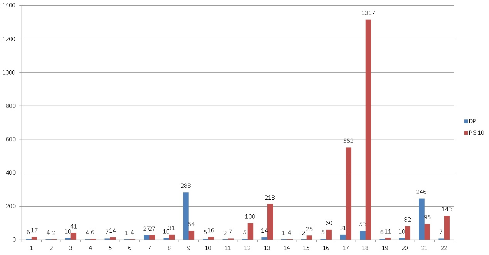

## TPC-H测试 - PostgreSQL 10 vs Deepgreen(Greenplum)     
##### [TAG 11](../class/11.md)
               
### 作者                
digoal               
                 
### 日期                 
2017-07-14             
                          
### 标签          
PostgreSQL , Deepgreen , Greenplum          
          
----          
           
## 背景        
通常一家企业除了有在线业务处理的数据库、也会有数据分析型的数据库。  
  
很长一段时间以来，数据库产品也是分场景设计的，例如MySQL就是非常典型的TP型数据库。Greenplum则是非常典型的AP型数据库。  
  
Oracle介于两者之间，具备典型TP型数据库的能力，同时还具备小型的数据分析的能力（例如通过并行查询提升计算能力，通过分析型SQL语法支持分析功能，通过大量的分析函数、窗口函数支持计算逻辑）。当数据量特别庞大时，还是典型的AP更加擅长（例如Greenplum）。  
  
目前除了商业数据库具备了TP+小型AP的能力，开源数据库也在往这块发展。  
  
开源数据库的TP+AP也分为两个阵营：一个是中间件阵营，一个是数据库阵营。  
  
1、中间件阵营，中间件不存数据，仅仅作为SQL解析、用户交互、计算。  
  
中间件也分为两种模式：  
  
一种是纯中间件，通过通用数据库接口连接数据库。这种往往数据传输效率不高。  
  
一种是用引擎的API，直接读写数据文件。  
  
中间件模式的好处是易于横向扩展，毕竟中间件本身是无状态的。  
  
缺点也很明显，毕竟不是完全掌控数据库存储，下推做得再好，总有下推不了的，下推不了的时候就得将数据收上来计算，存在搬运数据的可能。  
  
2、数据库引擎阵营，沿袭了Oracle的作风。  
  
优势显而易见，因为是数据库内核本身实现的，所以效率非常高。  
  
缺点是实现难度较高，所以开源界目前也只有PostgreSQL在往这个方向发展。  
  
我们可以看到PostgreSQL最近几年发布的特性，大量数据计算能力大幅提升：  
  
1、多核并行，单条SQL可以利用多个CPU并行计算。处理大查询非常高效。（通常是线性提升，例如32个并行，提升32倍。）  
  
2、向量计算，使用CPU的向量计算指令，减少函数回调，大幅提升大量数据处理的性能。（通常提升10倍左右。）  
  
需安装插件。（VOPS）  
  
3、JIT，动态编译，在处理大量的条件过滤或表达式时，性能提升非常的明显。（通常提升3~5倍）。  
  
4、列存储，更容易和JIT,向量计算结合，同时在处理按列统计时，效果非常好。  
  
需安装插件。（imcs, cstore）  
  
5、算子复用，一些聚合操作，中间步骤复用算子，减少运算量。效果提升也比较明显。  
  
6、GPU，利用GPU的计算能力，例如在十多个大表的JOIN时，效果提升20倍以上。  
  
需安装插件。（pg_strom）  
  
7、FPGA，利用FPGA的计算能力，效果与GPU类似。  
  
需安装插件。  
  
8、MPP插件，例如Citus插件，可以把PG数据库变成分布式数据库。  
  
需安装插件。（citus）  
  
9、流式计算，将计算分摊到每分每秒，解决集中式计算的运力需求。就好像春运一样，需要大量运力，而流计算不需要大量运力，因为把春运抹平了。  
  
需安装插件。（pipelinedb）  
  
10、时序插件，对应时序处理很有效。  
  
需安装插件。（timescale）  
  
11、R、Python组件，用户可以编写R或Python的计算逻辑，在数据库中直接运行用户编写的代码，将数据和计算整合在一起，提升效率。  
  
安装语言插件(plpython, plr)。  
  
12、MADLIB，机器学习库。通过函数接口进行调用，也是进军OLAP的信号。  
  
需安装插件。（madlib）  
  
这么多的信号在表明，PostgreSQL是一个HTAP数据库，用户即能用PG处理OLTP业务，同时也能处理OLAP业务场景。  
  
资源调度方面，目前还没有内置resource queue的功能，但是PG是进程模式，即使是使用CGROUP来管理也是可行的。  
  
说了这么多，PG 10的原生（不安装任何插件）的TPC-H性能如何？  
  
我以Deepgreen为参照，对比PG 10的tpc-h性能。  
  
Deepgreen是一个基于PostgreSQL的MPP数据库，应该是目前性能最好的OLAP商业产品。拿DP来比并不是不自量力，而是找到差距，看到可以提升的点。  
  
测试使用32C，512G，SSD环境。PG10开32个并行度。Deepgreen使用列存储，开48个计算节点。  
  
## PostgreSQL 10 TPC-H  
  
  
[explain result](20170714_01_zip_001.tar.bz2)  
  
## Deepgreen TPC-H  
  
  
[explain result](20170714_01_zip_002.tar.bz2)  
  
## 小结  
  
  
对比两者的EXPLAIN，DP的计算资源利用非常到位。（得益于JIT、列存储、向量计算和它的分布式优化器）  
  
1\. PG 10 优化器还有优化的空间。  
  
query 2, 20 没有拿到最优的执行计划，调整开关后性能更佳。  
  
query 2  
  
```  
set enable_mergejoin=off;  
set enable_nestloop=off;  
2s  
```  
  
query 20  
  
```  
set enable_hashjoin=off;  
82s  
```  
  
2\. 不可否认，相比其他OLTP数据库，PG 10的AP能力已经领先很多年了。  
  
3\. 在同等硬件条件下，PG 10软件层面还有优化空间。  
  
由于没有使用PG 10的向量计算、列存储插件，PG 10的效率还有很大的提升空间。  
  
4\. query 17, query 18和DP的差距非常明显，即使将执行计划都调成一样的。DP经过几轮重分布，48个计算节点，小数据量的内部HASH JOIN。  
  
PG 10 的并行HASH JOIN还有很大的优化空间，（其实PG 10比PG 9.6已经有了较大的优化，比如HASH TABLE不需要每个worker一份COPY了）。  
  
query 17   
  
PG 10   
  
```  
 Limit  (cost=30996689.95..30996689.97 rows=1 width=8)  
   ->  Aggregate  (cost=30996689.95..30996689.97 rows=1 width=8)  
         ->  Hash Join  (cost=17681423.82..30996217.92 rows=188813 width=8)  
               Hash Cond: (part.p_partkey = lineitem_1.l_partkey)  
               Join Filter: (lineitem.l_quantity < (('0.2'::double precision * avg(lineitem_1.l_quantity))))  
               ->  Gather  (cost=729877.62..14035697.89 rows=593311 width=32)  
                     Workers Planned: 32  
                     ->  Hash Join  (cost=729877.62..14035697.89 rows=18541 width=32)  
                           Hash Cond: (lineitem.l_partkey = part.p_partkey)  
                           ->  Parallel Seq Scan on lineitem  (cost=0.00..13235317.90 rows=18751190 width=24)  
                           ->  Hash  (cost=729630.42..729630.42 rows=19776 width=8)  
                                 ->  Seq Scan on part  (cost=0.00..729630.42 rows=19776 width=8)  
                                       Filter: ((p_brand = 'Brand#34'::bpchar) AND (p_container = 'WRAP PACK'::bpchar))  
               ->  Hash  (cost=16712866.90..16712866.90 rows=19094344 width=16)  
                     ->  HashAggregate  (cost=16235508.30..16521923.46 rows=19094344 width=16)  
                           Group Key: lineitem_1.l_partkey  
                           ->  Gather  (cost=0.00..13235317.90 rows=600038080 width=16)  
                                 Workers Planned: 32  
                                 ->  Parallel Seq Scan on lineitem lineitem_1  (cost=0.00..13235317.90 rows=18751190 width=16)  
```  
  
DP  
  
```  
 Limit  (cost=623298.39..623298.41 rows=1 width=8)  
   ->  Aggregate  (cost=623298.39..623298.41 rows=1 width=8)  
         ->  Gather Motion 48:1  (slice3; segments: 48)  (cost=623297.88..623298.38 rows=1 width=8)  
               ->  Aggregate  (cost=623297.88..623297.89 rows=1 width=8)  
                     ->  Hash Join  (cost=509798.96..623278.29 rows=164 width=8)  
                           Hash Cond: postgres.lineitem.l_partkey = part.p_partkey  
                           Join Filter: postgres.lineitem.l_quantity < part_agg.avg_quantity  
                           ->  Append  (cost=0.00..101520.00 rows=99001 width=24)  
                                 ->  Append-only Columnar Scan on lineitem_1_prt_1 lineitem  (cost=0.00..163.56 rows=160 width=24)  
......  
                                 ->  Append-only Columnar Scan on lineitem_1_prt_96 lineitem  (cost=0.00..0.00 rows=1 width=24)  
                           ->  Hash  (cost=509789.01..509789.01 rows=17 width=24)  
                                 ->  Broadcast Motion 48:48  (slice2; segments: 48)  (cost=125352.63..509789.01 rows=17 width=24)  
                                       ->  Hash Join  (cost=125352.63..509780.88 rows=1 width=24)  
                                             Hash Cond: part.p_partkey = part_agg.agg_partkey  
                                             ->  Append-only Columnar Scan on part  (cost=0.00..384181.00 rows=2059 width=8)  
                                                   Filter: p_brand = 'Brand#34'::bpchar AND p_container = 'WRAP PACK'::bpchar  
                                             ->  Hash  (cost=125340.12..125340.12 rows=21 width=16)  
                                                   ->  HashAggregate  (cost=125315.10..125330.11 rows=21 width=16)  
                                                         Group By: postgres.lineitem.l_partkey  
                                                         ->  Redistribute Motion 48:48  (slice1; segments: 48)  (cost=125280.06..125300.08 rows=21 width=40)  
                                                               Hash Key: postgres.lineitem.l_partkey  
                                                               ->  HashAggregate  (cost=125280.06..125280.06 rows=21 width=40)  
                                                                     Group By: postgres.lineitem.l_partkey  
                                                                     ->  Append  (cost=0.00..101520.00 rows=99001 width=16)  
                                                                           ->  Append-only Columnar Scan on lineitem_1_prt_1 lineitem  (cost=0.00..163.56 rows=160 width=16)  
......  
                                                                           ->  Append-only Columnar Scan on lineitem_1_prt_96 lineitem  (cost=0.00..0.00 rows=1 width=16)  
 Settings:  optimizer=off  
 Optimizer status: legacy query optimizer  
```  
  
query 18  
  
PG 10  
  
```  
 Limit  (cost=119441562.94..119441565.69 rows=100 width=55)  
   ->  GroupAggregate  (cost=119441562.94..130457672.11 rows=400585788 width=55)  
         Group Key: orders.o_totalprice, orders.o_orderdate, customer.c_name, customer.c_custkey, orders.o_orderkey  
         ->  Sort  (cost=119441562.94..120443027.41 rows=400585788 width=55)  
               Sort Key: orders.o_totalprice DESC, orders.o_orderdate, customer.c_name, customer.c_custkey, orders.o_orderkey  
               ->  Hash Join  (cost=27436526.10..53792051.41 rows=400585788 width=55)  
                     Hash Cond: (orders.o_orderkey = lineitem_1.l_orderkey)  
                     ->  Gather  (cost=7946450.25..26726494.83 rows=600038080 width=63)  
                           Workers Planned: 32  
                           ->  Hash Join  (cost=7946450.25..26726494.83 rows=18751190 width=63)  
                                 Hash Cond: (orders.o_custkey = customer.c_custkey)  
                                 ->  Hash Join  (cost=7228662.12..25422732.02 rows=18751190 width=44)  
                                       Hash Cond: (lineitem.l_orderkey = orders.o_orderkey)  
                                       ->  Parallel Seq Scan on lineitem  (cost=0.00..13235317.90 rows=18751190 width=16)  
                                       ->  Hash  (cost=4328257.72..4328257.72 rows=150000672 width=28)  
                                             ->  Seq Scan on orders  (cost=0.00..4328257.72 rows=150000672 width=28)  
                                 ->  Hash  (cost=530291.39..530291.39 rows=14999739 width=27)  
                                       ->  Seq Scan on customer  (cost=0.00..530291.39 rows=14999739 width=27)  
                     ->  Hash  (cost=18238319.10..18238319.10 rows=100140540 width=8)  
                           ->  HashAggregate  (cost=16235508.30..17236913.70 rows=100140540 width=8)  
                                 Group Key: lineitem_1.l_orderkey  
                                 Filter: (sum(lineitem_1.l_quantity) > '314'::double precision)  
                                 ->  Gather  (cost=0.00..13235317.90 rows=600038080 width=16)  
                                       Workers Planned: 32  
                                       ->  Parallel Seq Scan on lineitem lineitem_1  (cost=0.00..13235317.90 rows=18751190 width=16)  
```  
  
DP  
  
```  
 Limit  (cost=1373517167.24..1373517172.24 rows=100 width=104)  
   ->  Gather Motion 48:1  (slice3; segments: 48)  (cost=1373517167.24..1373517172.24 rows=100 width=104)  
         Merge Key: postgres.orders.o_totalprice, postgres.orders.o_orderdate, customer.c_name, customer.c_custkey, postgres.orders.o_orderkey  
         ->  Limit  (cost=1373517167.24..1373517170.24 rows=3 width=104)  
               ->  GroupAggregate  (cost=1373517167.24..1511389736.43 rows=95744840 width=104)  
                     Group By: postgres.orders.o_totalprice, postgres.orders.o_orderdate, customer.c_name, customer.c_custkey, postgres.orders.o_orderkey  
                     ->  Sort  (cost=1373517167.24..1385006548.00 rows=95744840 width=55)  
                           Sort Key: postgres.orders.o_totalprice, postgres.orders.o_orderdate, customer.c_name, customer.c_custkey, postgres.orders.o_orderkey  
                           ->  Hash Join  (cost=486078.65..58117733.98 rows=95744840 width=55)  
                                 Hash Cond: "IN_subquery".l_orderkey = postgres.orders.o_orderkey  
                                 ->  Hash Join  (cost=125317.60..298177.18 rows=99100 width=24)  
                                       Hash Cond: postgres.lineitem.l_orderkey = "IN_subquery".l_orderkey  
                                       ->  Append  (cost=0.00..101520.00 rows=99001 width=16)  
                                             ->  Append-only Columnar Scan on lineitem_1_prt_1 lineitem  (cost=0.00..163.56 rows=160 width=16)  
......  
                                             ->  Append-only Columnar Scan on lineitem_1_prt_96 lineitem  (cost=0.00..0.00 rows=1 width=16)  
                                       ->  Hash  (cost=125305.09..125305.09 rows=21 width=8)  
                                             ->  HashAggregate  (cost=125280.06..125295.08 rows=21 width=8)  
                                                   Filter: sum(postgres.lineitem.l_quantity) > 314::double precision  
                                                   Group By: postgres.lineitem.l_orderkey  
                                                   ->  Append  (cost=0.00..101520.00 rows=99001 width=16)  
                                                         ->  Append-only Columnar Scan on lineitem_1_prt_1 lineitem  (cost=0.00..163.56 rows=160 width=16)  
......  
                                                         ->  Append-only Columnar Scan on lineitem_1_prt_96 lineitem  (cost=0.00..0.00 rows=1 width=16)  
                                 ->  Hash  (cost=348684.17..348684.17 rows=20129 width=47)  
                                       ->  Redistribute Motion 48:48  (slice2; segments: 48)  (cost=52166.26..348684.17 rows=20129 width=47)  
                                             Hash Key: postgres.orders.o_orderkey  
                                             ->  Hash Join  (cost=52166.26..329361.15 rows=20129 width=47)  
                                                   Hash Cond: customer.c_custkey = postgres.orders.o_custkey  
                                                   ->  Append-only Columnar Scan on customer  (cost=0.00..227618.00 rows=312500 width=27)  
                                                   ->  Hash  (cost=40089.37..40089.37 rows=20129 width=28)  
                                                         ->  Redistribute Motion 48:48  (slice1; segments: 48)  (cost=0.00..40089.37 rows=20129 width=28)  
                                                               Hash Key: postgres.orders.o_custkey  
                                                               ->  Append  (cost=0.00..20766.35 rows=20129 width=28)  
                                                                     ->  Append-only Columnar Scan on orders_1_prt_1 orders  (cost=0.00..267.41 rows=260 width=28)  
......  
                                                                     ->  Append-only Columnar Scan on orders_1_prt_96 orders  (cost=0.00..0.00 rows=1 width=28)  
 Settings:  optimizer=off  
 Optimizer status: legacy query optimizer  
```  
  
5\. PG 10对相关性好的某些列，使用了BRIN索引，比如ORDERS，LINEITEM表的日期字段，未使用分区表。DP使用了时间按天分区。  
  
详见  
  
https://github.com/digoal/gp_tpch/blob/master/dss/tpch-load.sql.pg10  
  
https://github.com/digoal/gp_tpch/blob/master/dss/tpch-load.sql.column  
  
## 参考  
  
1\. https://github.com/digoal/gp_tpch  
  
2\. [《Parallel Query In PostgreSQL》](20170714_01_pdf_001.pdf)  
  
3\. https://sites.google.com/site/robertmhaas/presentations  
  
4\. [《Hash Joins Past, Present, Future》](20170714_01_pdf_002.pdf)    
  
5\. http://vitessedata.com/products/deepgreen-db/download/  
  
http://vitessedata.com/products/deepgreen-db/download/install/   
  
```
执行 gpinitsystem -c cluster.conf -h hostfile 之前，先设置一下

vi ~/deepgreendb/greenplum_path.sh

export MASTER_DATA_DIRECTORY=/data02/pg/gpdb/dg-1
export PGDATA=$MASTER_DATA_DIRECTORY
export PGHOST=127.0.0.1
export PGPORT=15432
export PGUSER=digoal
export PGPASSWORD=123
export PGDATABASE=postgres

. ~/deepgreendb/greenplum_path.sh
```
  
<a rel="nofollow" href="http://info.flagcounter.com/h9V1"  ></a>  
  
  
  
  
  
  
## [digoal's 大量PostgreSQL文章入口](https://github.com/digoal/blog/blob/master/README.md "22709685feb7cab07d30f30387f0a9ae")
  
