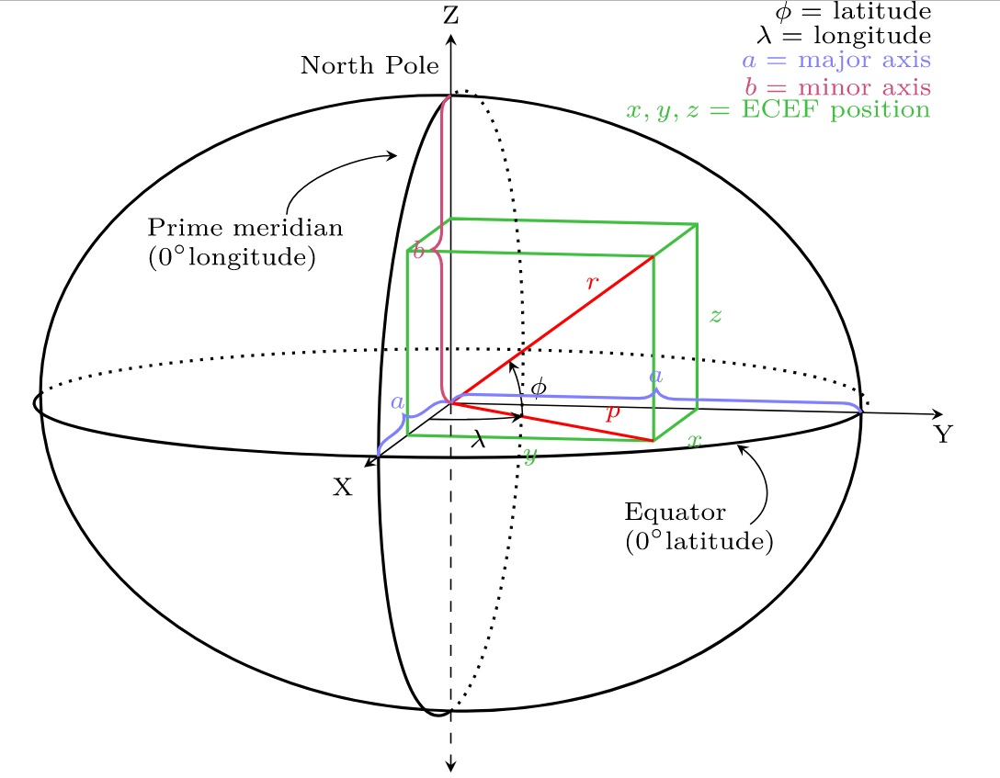
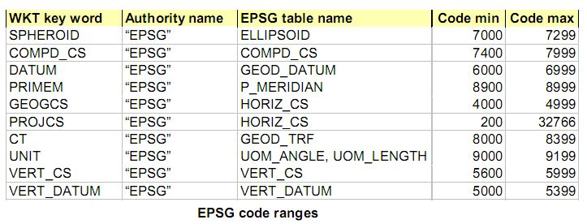

## SRID (空间引用识别号, 坐标系)  
                     
### 作者                      
digoal                     
                       
### 日期                       
2017-07-18                 
                                
### 标签                
PostgreSQL , PostGIS , 空间引用识别号 , SRID , 坐标系    
      
----    
       
## 背景     
转自互联网  
  
http://www.baike.com/wiki/srid  
  
http://www.cnblogs.com/jackdong/archive/2010/12/20/1911558.html  
  
https://en.wikipedia.org/wiki/Geographic_coordinate_system  
  
https://en.wikipedia.org/wiki/Spatial_reference_system#Identifier  
  
  
  
地球并不是平的，也不是正圆形，而是一个非标准的椭圆，在不同的经纬度位置，计算两点的距离没有一个完美的公式（即快速、有准确）。  
  
所以坐标系应运而生，SRID是指数据的坐标系，例如：  
  
在PostGIS中可以查到支持的SRID。查询与北京、中国有关的坐标系。  
  
```  
postgres=# select * from spatial_ref_sys where srtext ~* 'beijing';  
  
postgres=# select * from spatial_ref_sys where srtext ~* 'china';  
```  
  
数据可以在不同的坐标系之间转换，在进行GIS计算时，一定要在同一个坐标系中进行。  
  
例如   
  
http://postgis.net/docs/manual-2.3/reference.html  
  
```
SELECT ST_AsText(ST_Transform(ST_GeomFromText('POLYGON((743238 2967416,743238 2967450,
	743265 2967450,743265.625 2967416,743238 2967416))',2249),4326)) As wgs_geom;

 wgs_geom
---------------------------
 POLYGON((-71.1776848522251 42.3902896512902,-71.1776843766326 42.3903829478009,
-71.1775844305465 42.3903826677917,-71.1775825927231 42.3902893647987,-71.177684
8522251 42.3902896512902));
(1 row)

--3D Circular String example
SELECT ST_AsEWKT(ST_Transform(ST_GeomFromEWKT('SRID=2249;CIRCULARSTRING(743238 2967416 1,743238 2967450 2,743265 2967450 3,743265.625 2967416 3,743238 2967416 4)'),4326));

				 st_asewkt
--------------------------------------------------------------------------------------
 SRID=4326;CIRCULARSTRING(-71.1776848522251 42.3902896512902 1,-71.1776843766326 42.3903829478009 2,
 -71.1775844305465 42.3903826677917 3,
 -71.1775825927231 42.3902893647987 3,-71.1776848522251 42.3902896512902 4)
```
  
## 正文1  
srid，指的是空间引用标识符。   
  
空间引用标识符 (SRID)     
  
每个空间实例都有一个空间引用标识符 (SRID)。SRID 对应于基于特定椭圆体的空间引用系统，可用于平面球体映射或圆球映射。空间列可包含具有不同 SRID 的对象。然而，在使用 SQL Server 空间数据方法对数据执行操作时，仅可使用具有相同 SRID 的空间实例。从两个空间数据实例派生的任何空间方法的结果仅在这两个实例具有相同的 SRID（该 SRID 基于相同的用于确定实例坐标的度量单位、数据和投影）时才有效。SRID 最常见的度量单位为米或平方米。   
  
如果两个空间实例的 SRID 不相同，则对这两个实例使用 geometry 或 geography 数据类型方法后的结果将返回 NULL。例如，若要以下谓词返回非 NULL 结果，两个 geometry 实例（geometry1 和 geometry2）必须具有相同的 SRID：  
  
```  
geometry1.STIntersects(geometry2) = 1   
```  
  
注意：空间引用标识系统是由欧洲石油测绘组 (EPSG) 标准定义的，它是为绘图、测绘以及大地测量数据存储而开发的一组标准。该标准归石油天然气生产商 (ogp) 测绘和定位委员会所有。   
  
  
几何图形实例默认 SRID 为零   
  
SQL Server 中 geometry 实例的默认 SRID 为 0。利用 geometry 空间数据，执行计算是不需要空间实例的指定 SRID 的；因此，实例可驻留在未定义的平面空间。若要在 geometry 数据类型方法的计算中指明未定义的平面空间，SQL Server [数据库引擎](http://www.baike.com/sowiki/%E6%95%B0%E6%8D%AE%E5%BA%93%E5%BC%95%E6%93%8E?prd=content_doc_search) 使用 SRID 0。   
  
  
地域实例必须使用支持的 SRID   
  
  
SQL Server 支持基于 EPSG 标准的 SRID。必须使用 geography 实例的支持 SQL Server 的 SRID 执行计算或将方法用于地域空间数据。SRID 必须与 sys.spatial_reference_systems 目录视图中显示的 SRID 中的一个匹配。如前所述，在使用 geography 数据类型对空间数据执行计算时，结果将取决于在创建数据时使用的是哪个椭圆体，因为为每个椭圆体都分配了一个特定空间引用标识符 (SRID)。   
  
  
对 geography 实例使用方法时，SQL Server 使用等于 4326 的默认 SRID，它将映射到 WGS 84 空间引用系统。如果要使用 WGS 84（或 SRID 4326）之外的某个空间引用系统中的数据，您需要确定地域空间数据的特定 SRID。  
  
  
## 正文2  
  
EPSG：European Petroleum Survey Group (EPSG)， http://www.epsg.org/ ， 它成立于1986年，并在2005年重组为OGP(Internation Association of Oil & Gas Producers)，它负责维护并发布坐标参照系统的数据集参数，以及坐标转换描述，该数据集被广泛接受并使用，通过一个Web发布平台进行分发，同时提供了微软Acess数据库的存储文件，通过SQL 脚本文件，mySQL, Oracle 和PostgreSQL等数据库也可使用。  
目前已有的椭球体，投影坐标系等不同组合都对应着不同的ID号，这个号在EPSG中被称为EPSG code，它代表特定的椭球体、单位、地理坐标系或投影坐标系等信息。  
  
  
  
SRID：OGC标准中的参数SRID，也是指的空间参考系统的ID，与EPSG一致；  
  
WMS 1.1.1以前用SRS参数（空间参考系）表示坐标系统，WMS1.3开始用CRS参数（坐标参考系统）来表示。  
  
  
A Spatial Reference System Identifier(SRID) is a unique value used to unambiguously identify projected, unprojected, and local spatial coordinate system definitions. These coordinate systems form the heart of all GIS applications.  
  
Virtually all major spatial vendors have created their own SRID implementation or refer to those of an authority, such as the European Petroleum Survey Group (EPSG). (NOTE: As of 2005 the EPSG SRID values are now maintained by the International Association of Oil & Gas Producers (OGP) Surveying & Positioning Committee).  
  
以OGC请求为例：  
  
http://localhost/IS/WebServices/wms.ashx?map=World&SERVICE=WMS&REQUEST=GetMap&LAYERS=&STYLES=&SRS=EPSG:4326&BBOX=-3,44,10,53&WIDTH=600&HEIGHT=300&FORMAT=image/gif&BGCOLOR=&VERSION=1.1.1  
  
SRS=EPSG:4326代表地理坐标系WGS1984  
  
WKT：空间参考系统的文字描述；  
  
无论是参考椭球、基准面、投影方式、坐标单位等，都有相应 的EPSG值表示，如下表：  
  
  
  
  
举例：  
  
Beijing 1954地理坐标系，高斯--克吕格投影（横轴等角切圆柱投影）  
  
下面为投影相关信息：  
  
```  
投影方式 Gauss_Kruger  
中央经线 75.000000  
原点纬线 0.000000  
标准纬线(1) 0.000000  
标准纬线(2) 0.000000  
水平偏移量 13500000.000000  
垂直偏移量 0.000000  
比例因子 1.000000  
方位角   0.000000  
第一点经线 0.000000  
第二点经线 0.000000  
地理坐标系 GCS_Beijing_1954  
大地参照系 D_Beijing_1954  
参考椭球体 Krasovsky_1940  
椭球长半轴 6378245.000000  
椭球扁率 0.0033523299  
本初子午线 0.000000  
```  
  
WKT形式表示该投影坐标系：  
  
```  
PROJCS["Gauss_Kruger",  
GEOGCS["GCS_Beijing_1954",  
   DATUM["D_Beijing_1954",  
    SPHEROID["Krasovsky_1940",6378245.000000,298.299997264589]]   
   ]  
PEIMEM["Greenwich",0]   
UNIT["degree",0.0174532925199433]        //地理单位：0.0174532925199433代表与米之间的转换  
],  
PROJECTION["Gauss_Kruger"],  
PARAMETER["False_Easting",13500000.000000],  
PARAMETER["False_Northing",0],  
PARAMETER["Central_Meridian",75.000000],  
PARAMETER["Scale_Factor",1.0],  
PARAMETER["Latitude_Of_Origin",0.0],  
UNIT["Meter",1.0]] ;  
```  
  
## 参考  
  
http://www.baike.com/wiki/srid  
  
http://www.cnblogs.com/jackdong/archive/2010/12/20/1911558.html  
  
http://workshops.boundlessgeo.com/postgis-intro/  
  
https://en.wikipedia.org/wiki/SRID  
  
  
<a rel="nofollow" href="http://info.flagcounter.com/h9V1"  ></a>  
  
  
  
  
  
  
## [digoal's 大量PostgreSQL文章入口](https://github.com/digoal/blog/blob/master/README.md "22709685feb7cab07d30f30387f0a9ae")
  
