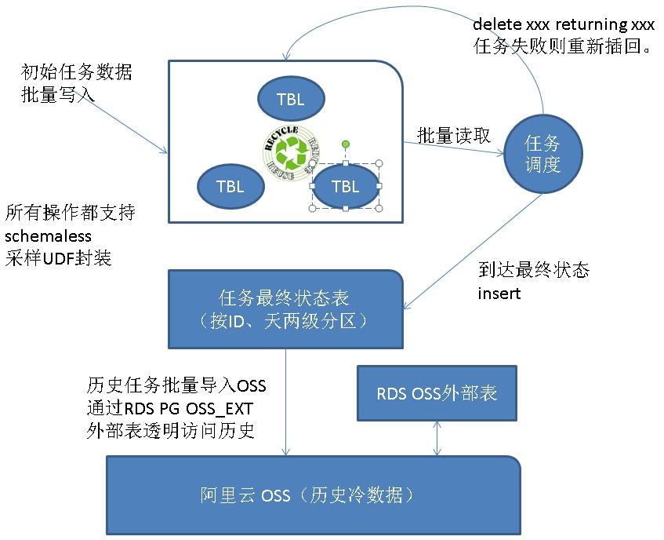

## 云端海量任务调度数据库最佳实践 - 阿里云RDS PostgreSQL案例  
                       
### 作者                        
digoal                       
                         
### 日期                         
2017-07-20                   
                                  
### 标签                  
PostgreSQL , 任务调度系统 , 数据库设计 , schemaless     
        
----      
         
## 背景  
任务调度系统中的任务状态管理，通常会用到数据库来存储任务调度的过程状态，控制任务的锁等。  
  
[《advisory lock 实现高并发非堵塞式 业务锁》](../201707/20170720_01.md)    
  
如果是小量任务，是挺好实现的，但是每小时处理几十亿或者几亿的任务，如何设计这样的任务状态管理数据库呢？  
  
## 挑战  
对于一个面向多个用户的任务调度平台（例如云端的任务调度平台，将面向所有租户使用）。  
  
较大的挑战是任务数据的写入（海量），另一个是任务状态的更新（海量，每个任务至少被更新一次）。  
  
## 云端海量任务调度数据库设计  
  
  
云端任务调度存在一些特性：  
  
1、用户和用户之间的任务是没有关系的，单个用户的任务在调度时可能有依赖关系。  
  
2、数据量庞大。  
  
3、任务通常都有最终稳定状态，稳定后，对应的任务记录就不会变化了。  
  
针对以上几个特点，采样PostgreSQL设计：  
  
1、任务数据生成后写入任务处理表  
  
2、任务处理表使用rotate设计（例如每小时一个rotate表），处理完的数据直接清除，不需要VACUUM。  
  
3、分区方面，任务处理表采样用户级分区，在获取需要处理的任务时更加的精炼（减少冗余扫描）。  
  
4、当任务达到最终状态时，从任务运行表删除，写入历史表。  
  
5、早期的历史表，从RDS PG中删除，写入阿里云OSS，使用RDS PG OSS外部表接口可以访问到这些历史数据。  
  
## DEMO设计  
1、初始任务表，用于存储用户生成的任务。  
  
```  
create table task_init (    -- 任务初始表  
  uid  int,        -- 用户id  
  ptid serial8,    -- 父任务id  
  tid serial,      -- 子任务ID    
  state int default 1,    -- 任务状态，1表示初始状态，-1表示正在处理, 0表示处理结束    
  retry int default -1,   -- 重试次数    
  info text,              -- 其他信息    
  ts timestamp            -- 时间     
);     
```  
  
2、任务历史表，用于存储任务的最终状态。  
  
```  
create table task_hist (    -- 任务历史表  
  uid  int,   -- 用户id  
  ptid int8,  -- 父任务id  
  tid int,    -- 子任务ID    
  state int default 1,    -- 任务状态，1表示初始状态，-1表示正在处理, 0表示处理结束    
  retry int default -1,   -- 重试次数    
  info text,              -- 其他信息    
  ts timestamp      -- 时间      
);     
```  
  
3、为了简化测试，按用户ID进行分区。（前面提到的rotate设计，多级分区设计，请参考本文末尾的文章）  
  
```  
do language plpgsql $$  
declare  
begin  
  for i in 1..1000 loop  
    execute 'create table task_init_'||i||' ( like task_init including all)';  
    execute 'create table task_hist_'||i||' ( like task_hist including all)';  
  end loop;  
end;  
$$;  
```  
  
4、为了测试方便，使用schemaless的设计，将用户任务的初始数据生成写入放在PLPGSQL逻辑中。  
  
```  
create or replace function ins_task_init(  
  uid int,  
  info text,  
  ts timestamp  
)  returns void as $$  
declare  
  target name;  
begin  
  target := format('%I', 'task_init_'||uid);  
  execute format('insert into %I (uid,info,ts) values (%L,%L,%L)', target, uid,info,ts);  
end;  
$$ language plpgsql strict;  
```  
  
5、运行任务，分为几个步骤。  
  
5\.1、从任务表读取任务。  
  
5\.2、用户执行任务。  
  
5\.3、反馈执行的结果，不成功的任务更新task_init表，对于执行成功（并结束）的任务，数据从task_init迁移到task_hist。  
  
为了测试数据库的性能，我讲这三步的逻辑写到plpgsql里面。同时使用delete limit的特性，一次批量取出若干条任务。  
  
这里使用CTID行号定位，达到最佳的性能。不仅免去了索引的使用，而且性能更佳。  
  
这里使用了advisory lock，使得单个用户不会出现并行任务。（实际业务中，可以并行。）  
  
这里没有测试更新状态，task_init还有少量更新(相比insert和delete，比例很少，可以忽略)，比如任务失败的情况。  
  
关闭task_init表的autovacuum，采用rotate的形式进行处理。  
  
```  
create or replace function run_task(  
  uid int,  
  batch int  
) returns void as $$  
declare  
  target1 name;  
  target2 name;  
begin  
  target1 := format('%I', 'task_init_'||uid);  
  target2 := format('%I', 'task_hist_'||uid);  
  execute format('with t1 as (select ctid from %I where pg_try_advisory_xact_lock(%L) limit %s) , t2 as (delete from %I where ctid = any (array(select ctid from t1)) returning *)  insert into %I select * from t2;', target1, uid, batch, target1, target2);  
end;  
$$ language plpgsql strict;  
```  
  
6、测试分解动作。  
  
```  
写入初始任务  
  
postgres=# select ins_task_init(1,'test',now()::timestamp);  
 ins_task_init   
---------------  
   
(1 row)  
  
postgres=# select ins_task_init(1,'test',now()::timestamp);  
 ins_task_init   
---------------  
   
(1 row)  
  
运行任务  
  
postgres=# select run_task(1,100);  
 run_task   
----------  
   
(1 row)  
  
查看任务是否结束并迁移到历史表  
  
postgres=# select * from task_init_1;  
 uid | ptid | tid | state | retry | info | ts   
-----+------+-----+-------+-------+------+----  
(0 rows)  
  
postgres=# select * from task_hist_1;  
 uid | ptid | tid | state | retry | info |             ts               
-----+------+-----+-------+-------+------+----------------------------  
   1 |    1 |   1 |     1 |    -1 | test | 2017-07-20 15:26:32.739766  
   1 |    2 |   2 |     1 |    -1 | test | 2017-07-20 15:26:33.233469  
(2 rows)  
```  
  
## 性能压测  
1、生成任务的性能  
  
```  
vi ins.sql  
\set uid random(1,1000)  
select ins_task_init(:uid,'test',now()::timestamp);   
  
pgbench -M prepared -n -r -P 1 -f ./ins.sql -c 32 -j 32 -T 120  
query mode: prepared  
number of clients: 64  
number of threads: 64  
duration: 360 s  
number of transactions actually processed: 86074880  
latency average = 0.268 ms  
latency stddev = 0.295 ms  
tps = 239079.558174 (including connections establishing)  
tps = 239088.708200 (excluding connections establishing)  
script statistics:  
 - statement latencies in milliseconds:  
         0.001  \set uid random(1,1000)  
         0.267  select ins_task_init(:uid,'test',now()::timestamp);  
  
postgres=# select count(*) from task_init_1;  
 count   
-------  
 88861  
(1 row)  
  
postgres=# select count(*) from task_init_2;  
 count   
-------  
 88196  
(1 row)  
  
....  
  
postgres=# select count(*) from task_init_1000;  
 count   
-------  
 88468  
(1 row)  
```  
  
2、运行任务的性能(一次批量取10000条任务)  
  
```  
vi run.sql  
\set uid random(1,1000)  
select run_task(:uid,10000);  
  
pgbench -M prepared -n -r -P 1 -f ./run.sql -c 32 -j 32 -T 120  
  
query mode: prepared  
number of clients: 32  
number of threads: 32  
duration: 120 s  
number of transactions actually processed: 3294  
latency average = 1171.228 ms  
latency stddev = 361.056 ms  
tps = 27.245606 (including connections establishing)  
tps = 27.247560 (excluding connections establishing)  
script statistics:  
 - statement latencies in milliseconds:  
         0.003  \set uid random(1,1000)  
      1171.225  select run_task(:uid,10000);  
  
postgres=# select count(*) from task_init_1000;  
 count   
-------  
 18468  
(1 row)  
  
postgres=# select count(*) from task_hist_1000;  
 count    
--------  
 224207  
(1 row)  
```  
  
### 单独的测试数据  
  
1、生成任务，23.9万条/s  
  
2、消耗任务，27.2万条/s  
  
### 生成与消耗任务同时运行的测试数据  
  
1、生成任务，16.8万条/s  
  
2、消耗任务，大于16.8万条/s  
  
没有任何任务堆积。  
  
## 小结  
PostgreSQL在云端海量任务调度系统中，发挥了重要的作用。  
  
单个PostgreSQL实例，已经可以处理每个小时  的任务生成，以及  的任务消耗。  
  
任务调度系统比MQ更加复杂，类似MQ的超集，所以用户如果有MQ的需求，实际上使用RDS PostgreSQL也是可以的。性能指标比上面的测试更好。  
  
## 参考  
[《advisory lock 实现高并发非堵塞式 业务锁》](../201707/20170720_01.md)    
  
[《PostgreSQL schemaless 的实现(类mongodb collection)》](../201705/20170511_01.md)    
  
[《行为、审计日志 (实时索引/实时搜索)建模 - 最佳实践 2》](../201705/20170522_01.md)    
  
[《在PostgreSQL中实现update | delete limit》](../201608/20160827_01.md)    
  
[《块级(ctid)扫描在IoT(物联网)极限写和消费读并存场景的应用》](../201706/20170607_01.md)    
  
[《PostgreSQL 10.0 preview 功能增强 - 内置分区表》](../201612/20161215_01.md)    
  
[《PostgreSQL 9.5+ 高效分区表实现 - pg_pathman》](../201610/20161024_01.md)    
  
[《PostgreSQL 数据rotate用法介绍 - 按时间覆盖历史数据》](../201703/20170321_02.md)    
  
欢迎使用[阿里云RDS PostgreSQL](https://www.aliyun.com/product/rds/postgresql)。  
  
<a rel="nofollow" href="http://info.flagcounter.com/h9V1"  ></a>  
  
  
  
  
  
  
## [digoal's 大量PostgreSQL文章入口](https://github.com/digoal/blog/blob/master/README.md "22709685feb7cab07d30f30387f0a9ae")
  
