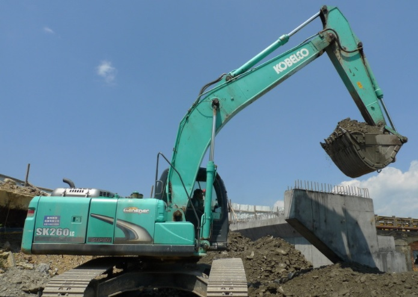
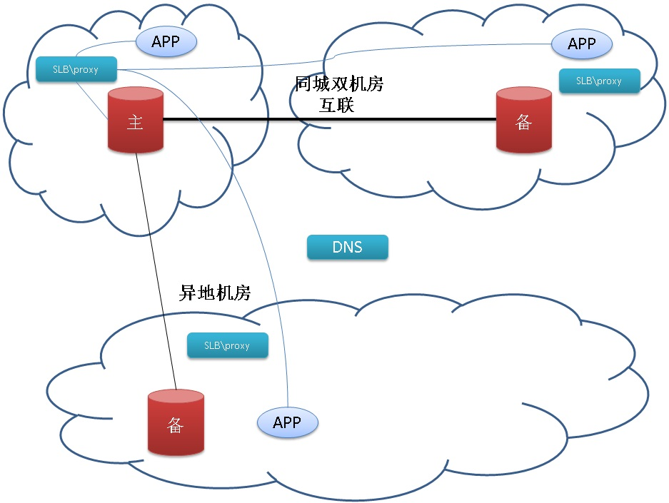
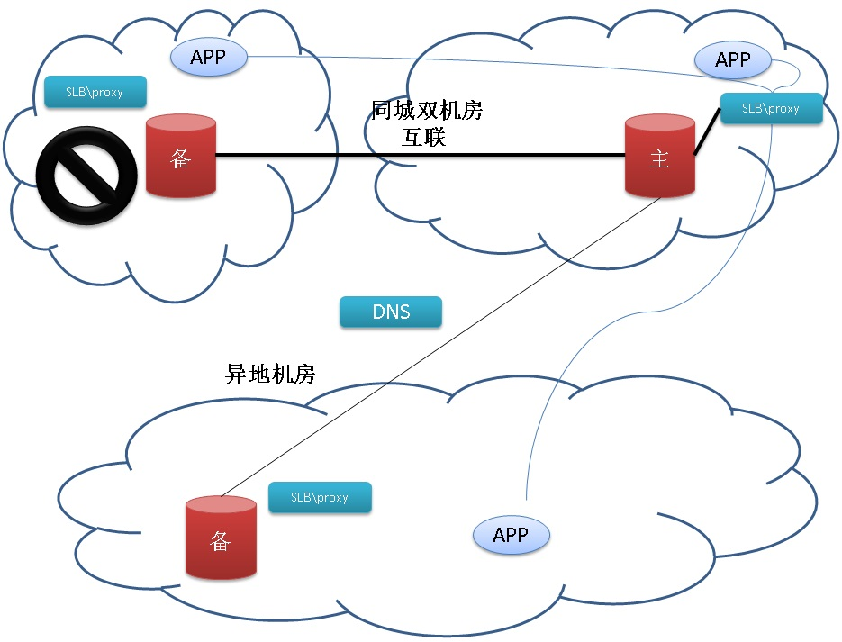

## 阿里云RDS金融数据库(三节点版) - 案例篇        
                 
### 作者                  
digoal                 
                   
### 日期                   
2017-07-23               
                            
### 标签            
PostgreSQL , MySQL , 三节点版 , 金融数据库 , Raft , 分布式共享存储版             
            
----            
             
## 背景     
土豆哪里去挖？  
  
土豆郊区去挖。  
  
一挖一麻袋？  
  
一挖一麻袋。  
  
挖掘机不仅是城市建设的必备法宝，居然也是挖土豆利器。  
  
  
  
但是科技行业一定不喜欢挖掘机，经常会听说**xx互联网软件故障提到“光纤被挖断”，导致XX机房故障几数时。**     
  
这和数据库有什么关系呢？当然有，一些企业在业务层面可能做到了多机房，多活的架构，但数据库并没有做到0丢失的多机房或多活部署，如果数据库所在机房网络故障，那么对于这些业务来说照样是灾难性的。  
  
作为阿里云RDS金融数据库(三节点版)系列文章 - 案例篇，接下来将介绍一些用户的案例，用户如何利用阿里云RDS金融数据库(三节点版)，获得最佳业务体验。  
  
## 异地容灾场景  
有了异地容灾，“光纤被挖断”再也不可能成为故障借口了。  
  
对于可用性、可靠性都非常敏感的业务，两节点的高可用架构显然无法满足需求，在追求可靠性（0丢失）时，可用性和性能一定会下降（比如备库故障、主备之间的复制链路问题，都会导致用户事务无法提交）。  
  
两地三中心，或者三地三中心的三节点架构，可以同时满足用户的可用性、可靠性需求。  
  
当任意一个机房遭遇“光纤被挖断”的窘境时，其他机房可以顶上，而且确保0丢失。  
  
  
  
养兵千日用兵一时，容灾演练也是企业IT的日常工作之一，对于无状态的业务，相对来说多机房、多活比较好部署，但是数据库是有状态应用，多机房部署难度和成本都高了很多。例如网络带宽、延迟，数据同步机制，切换机制，switchover机制，数据补偿机制等，没有哪个是好做的，没有做好的话可能是灾难性的。有了“阿里云RDS金融数据库(三节点版)”，用户不需要再关心数据库的容灾演练问题，因为内置了这个功能。  
  
## 金融级核心业务  
  
金融核心库，用户关注的是数据库的 可靠性->可用性->稳定性->安全性->性能 。在这方面相信老百姓更有体会，因为我们的钱都存在银行呀。  
  
拿转账来打个比方，A有10万余额，B有1万余额，A转给B 1万元，最终变成：A有9万余额，B有2万余额。  
  
任何一个步骤出错都不能出现类似这样的问题：A有9万余额，B有1万余额。A有10万余额，B有2万余额。  
   
数据库是如何保证不会出现以上问题的呢？   
  
1、如果是单事务、单库操作，涉及到数据库的ACID中的事务原子性、一致性的原理，所以宣称支持ACID的数据库，任何时候都不会出现以上问题。**三节点同样遵循了数据库的ACID原则。**  
  
2、如果操作不是单个事务，或者涉及到多库操作，那么业务系统可以使用数据库的两阶段事务来保证全局一致性。**三节点同样支持数据库的两阶段事务。**  
  
3、如果是跨业务系统的转账，那么需要通过业务层的协议结合两阶段事务来保证全局的一致性。**三节点同样支持数据库的两阶段事务。**  
  
对业务系统来说，三节点具备单节点的所有功能，同时提升了数据库的可靠性，可用性。**任何一个节点故障，不影响业务的正常运行，也不会丢任何数据。**  
  
  
    
  
    
除此之外，阿里云RDS也非常关注细节，为了让用户体验更好，阿里云的proxy也做了极大的用户体验工作，包括数据库切换时的零感知。  
  
阿里云RDS数据库团队是专业的国际化数据库内核团队，将多年以来对数据库的深刻理解转换为产品，为用户提供更好的服务。如果你有兴趣了解数据库切换时的要素，可以参考阅读这篇文档（文章以PostgreSQL数据库为出发点，讲解了数据库平滑切换的要素）：  
  
[《数据库平滑switchover的要素》](../201706/20170619_01.md)    
  
企业的核心数据库，比如用户认证系统、用户账户系统、企业ERP系统等。对数据库的要求与金融核心类似，它们同样有容灾的需求，有容灾演练的需求，有多机房部署的需求，有SOX审计的需求。  
  
阿里云RDS金融数据库(三节点版)为金融业务、企业核心数据库保驾护航。  
  
## 小结    
阿里云RDS金融数据库(三节点版)，围绕“可靠性、可用性”为核心设计，为金融业务、企业核心数据库保驾护航。  
    
多年一来双十一的历练，阿里云RDS内核团队积累了丰富经验和代码的沉淀，因此除了“可靠性、可用性”，阿里云RDS金融数据库(三节点版)相比社区版本，有着性能、功能方面的诸多优势。同时阿里云RDS团队也是开源数据库社区的积极贡献者，是开源生态的源泉。    
    
欢迎金融业务、企业核心数据库选用。  
    
## 系列文章          
[《阿里云RDS金融数据库(三节点版) - 背景篇》](../201707/20170709_02.md)    
         
[《阿里云RDS金融数据库(三节点版) - 理论篇》](../201707/20170710_01.md)    
          
[《阿里云RDS金融数据库(三节点版) - 性能篇》](../201707/20170713_01.md)    
          
[《阿里云RDS金融数据库(三节点版) - 案例篇》](../201707/20170723_01.md)    
           
## 阿里云RDS金融数据库(三节点版)        
[阿里云RDS金融数据库 - MySQL三节点版](https://help.aliyun.com/document_detail/51701.htm)            
            
阿里云RDS金融数据库 - PostgreSQL三节点版(敬请期待)            
            
  
  
  
  
  
  
  
  
## [digoal's 大量PostgreSQL文章入口](https://github.com/digoal/blog/blob/master/README.md "22709685feb7cab07d30f30387f0a9ae")
  
