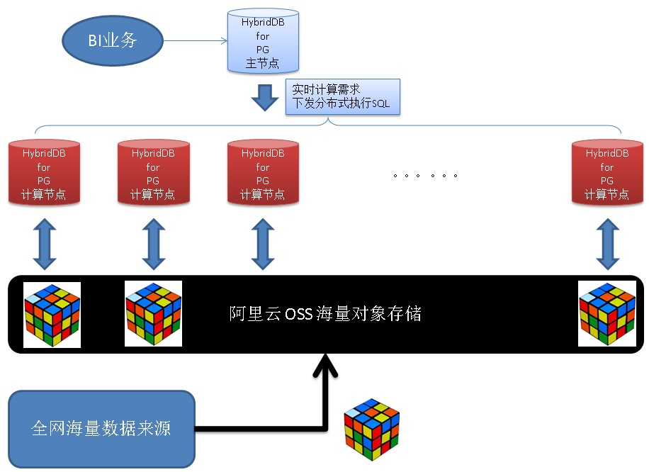

## 日增量万亿+级 实时分析、数据规整 - 阿里云HybridDB for PostgreSQL最佳实践  
     
### 作者     
digoal     
       
### 日期                       
2017-07-26     
          
### 标签                
PostgreSQL , Greenplum , HybridDB for PostgreSQL , 强制重分布 , oss导出 , 数据规整       
                
----                
                 
## 背景      
横看成岭侧成峰，  
  
远近高低各不同。  
  
不识庐山真面目，  
  
只缘身在此山中。  
  
不同的视角我们所看到的物体是不一样的，  
  
http://t.m.china.com.cn/convert/c_ovWL9w.html  
  
  
  
图为墨西哥城放射状的街区广场。  
  
  
  
图为西班牙迷宫般的果树漩涡。  
  
地心说和日心说也是视角不同所呈现的。  
  
  
  
  
  
实际上数据也有这样，我们每天产生海量的数据，有各种属性，以每个属性为视角（分组、归类、聚合），看到的是对应属性为中心的数据。  
  
对应的业务场景也非常多，例如：  
  
1、物联网，  
  
每个传感器有很多属性：ID，地理位置，传感器归属，各类指标等。  
  
以传感器的角度进行观察，观察某个传感器ID在流金岁月中的值。  
  
以归属角度（例如归属于公安、城管、某家公司、。。。）进行观察，  
  
以地理位置为视角进行观察，。。。。  
  
2、车联网、站长网。。。。  
  
按车辆、按客户、按访问者。。。多重视角进行观察  
  
观察在数据库中可以触发两种行为，一种是实时计算的行为，另一种是数据规整的行为。  
  
数据规整指将数据按视角重新归类存放。（例如在云端汇聚了各个网站的被访问记录，站长只关注他自己的网站的被访问记录，当需要向站长提供数据时，可以按网站进行数据规整）。  
  
那么如何在云端实现实时分析、准实时数据归类的需求呢？  
  
## 1 架构  
HybridDB for PostgreSQL是阿里云的一款分析型MPP数据库产品(基于Greenplum开源版本而来，新增了插件功能、云端特性以及内核代码优化)，提供了水平扩展的能力以及强大的分析SQL兼容性，同时与云端海量存储OSS进行了深度整合，可以并行读写OSS，将OSS作为数据存储来使用。  
  
### 实时计算架构  
  
  
  
海量数据源，写入OSS，通过HybridDB for PostgreSQL的oss_ext插件，实时分析写入的数据。  
  
**OSS带宽指标**：目前每个计算节点每个会话约30MB/s的读写速率。  
  
对于列式存储格式，数值类型。1亿记录约381MB，压缩比5:1的话，约76.3MB。  
  
**按行换算的性能指标**：2048个计算节点，读写吞吐约 805亿行/s。每天处理6900万亿行(当然，按多列进出打个折扣，万亿级别也是没有问题的)。     
  
### 准实时数据规整架构  
  
  
  
实时数据规整的目的是按视角将数据规整，数据进入OSS时，是打乱的。由HybridDB for PostgreSQL对接重分布分组规整后，再写出到OSS，形成规整的数据。  
  
为什么需要重分布？  
  
前面谈到了视角问题，我们可能有多重视角来观察数据，而在数据库中只能选择一种固定的分布键，当视角与之不同时，就需要重分布。  
  
准实时导出的优化：  
  
对于一个视角，可能有少量或多种属性，例如用户实际，假设有100万个用户，如果每个计算节点分别导出100万用户，每个用户对应到OSS的一个规整文件，那么由于文件数过多，导出会较慢。  
  
那么可以对用户重分布，例如1000个节点，每个节点分配到1000个用户的数据，这样的话，并行写出到OSS时，一下子就降低到了每个节点写1000个文件的规模。  
  
如何强制重分布呢？后面讲到。  
  
## 2 实时计算  
HybridDB for PostgreSQL与OSS对接的详细文档请参考：  
  
https://help.aliyun.com/document_detail/35457.html  
  
简略步骤如下：  
  
1、创建OSS用户  
  
2、创建OSS BUCKET，例如每个小时一个BUCKET  
  
3、写入数据（最好写入小文件，数量为HybridDB for PostgreSQL的倍数）  
  
4、在HybridDB for PostgreSQL中创建OSS外部表，例如每个小时一个  
  
5、直接读取OSS外表进行分析  
  
## 3 准实时数据规整  
  
### 1、需求  
  
按不同的视觉维度，进行分组，每个视觉属性规整到一个OSS文件。也就是说一个OSS文件不能存在多个对象。  
  
### 2、查询  
  
比如需要按视角分组，按时间排序输出。  
  
```  
select 聚合函数(t order by 时间) from tbl t group by 视角字段;  
```  
  
以上SQL，数据库可能不会按视角字段重分布，而是使用两阶段提交的方式。例如  
  
```  
postgres=# create table tbl(uid int, info text, c1 int);  
NOTICE:  Table doesn't have 'DISTRIBUTED BY' clause -- Using column named 'uid' as the Greenplum Database data distribution key for this table.  
HINT:  The 'DISTRIBUTED BY' clause determines the distribution of data. Make sure column(s) chosen are the optimal data distribution key to minimize skew.  
CREATE TABLE  
表按UID分布  
  
但是查询不按它，看看会不会重分布  
  
postgres=# explain select string_agg(textin(record_out(t)), chr(10)) from tbl t group by c1;  
                                               QUERY PLAN                                                 
--------------------------------------------------------------------------------------------------------  
 Gather Motion 48:1  (slice2; segments: 48)  (cost=0.03..0.06 rows=1 width=36)  
   ->  GroupAggregate  (cost=0.03..0.06 rows=1 width=36)  
         Group By: c1  
         ->  Sort  (cost=0.03..0.04 rows=1 width=36)  
               Sort Key: c1  
	       -- 按c1重分布  
               ->  Redistribute Motion 48:48  (slice1; segments: 48)  (cost=0.00..0.02 rows=1 width=36)  
                     Hash Key: c1  
                     ->  Seq Scan on tbl t  (cost=0.00..0.00 rows=1 width=36)  
 Settings:  optimizer=off  
 Optimizer status: legacy query optimizer  
(10 rows)  
  
这条是不被期望的，因为发生了两次聚合。  
我们在将数据写入OSS时，不希望两次聚合。  
  
postgres=# explain select max(c1) from tbl group by info;  
                                            QUERY PLAN                                              
--------------------------------------------------------------------------------------------------  
 Gather Motion 48:1  (slice2; segments: 48)  (cost=0.04..0.05 rows=1 width=36)  
   -- 第二次聚合  
   ->  HashAggregate  (cost=0.04..0.05 rows=1 width=36)  
         Group By: tbl.info  
         -- 重分布  
	 ->  Redistribute Motion 48:48  (slice1; segments: 48)  (cost=0.01..0.03 rows=1 width=36)  
               Hash Key: tbl.info  
               -- 第一次聚合  
	       ->  HashAggregate  (cost=0.01..0.01 rows=1 width=36)  
                     Group By: tbl.info  
                     ->  Seq Scan on tbl  (cost=0.00..0.00 rows=1 width=36)  
 Settings:  optimizer=off  
 Optimizer status: legacy query optimizer  
(10 rows)  
```  
  
**强制按指定键重分布**  
  
```  
postgres=# explain select row_number() over (partition by c1 order by info), * from tbl;  
                                               QUERY PLAN                                                 
--------------------------------------------------------------------------------------------------------  
 Gather Motion 48:1  (slice2; segments: 48)  (cost=0.03..0.04 rows=1 width=40)  
   ->  Window  (cost=0.03..0.04 rows=1 width=40)  
         Partition By: c1  
         Order By: info  
         ->  Sort  (cost=0.03..0.04 rows=1 width=40)  
               Sort Key: c1, info  
               ->  Redistribute Motion 48:48  (slice1; segments: 48)  (cost=0.00..0.02 rows=1 width=40)  
                     Hash Key: c1  
                     ->  Seq Scan on tbl  (cost=0.00..0.00 rows=1 width=40)  
 Settings:  optimizer=off  
 Optimizer status: legacy query optimizer  
(11 rows)  
```  
  
**按强制重分布, 改写SQL**  
  
使用窗口查询，将数据强制重分布，然后再进行计算节点的原地聚合。  
  
```  
postgres=# explain select string_agg(textin(record_out(t)), chr(10)) from (select row_number() over (partition by c1 order by info), * from tbl) t group by c1;  
                                                     QUERY PLAN                                                       
--------------------------------------------------------------------------------------------------------------------  
 Gather Motion 48:1  (slice2; segments: 48)  (cost=0.03..0.07 rows=1 width=36)  
   -- 计算节点原地聚合  
   ->  GroupAggregate  (cost=0.03..0.07 rows=1 width=36)  
         Group By: t.c1  
         ->  Subquery Scan t  (cost=0.03..0.05 rows=1 width=36)  
               ->  Window  (cost=0.03..0.04 rows=1 width=40)  
                     Partition By: tbl.c1  
                     Order By: tbl.info  
                     -- 按指定要求的顺序排序，例如按时间  
		     ->  Sort  (cost=0.03..0.04 rows=1 width=40)  
                           Sort Key: tbl.c1, tbl.info  
                           -- 按C1重分布  
			   ->  Redistribute Motion 48:48  (slice1; segments: 48)  (cost=0.00..0.02 rows=1 width=40)  
                                 Hash Key: tbl.c1  
                                 ->  Seq Scan on tbl  (cost=0.00..0.00 rows=1 width=40)  
 Settings:  optimizer=off  
 Optimizer status: legacy query optimizer  
(14 rows)  
```  
  
### 3、自定义聚合函数  
Greenplum的自定义聚合与单节点聚合不同，一种为单阶段模式，另一种为两阶段聚合模式。  
  
单阶段模式，将数据收到MASTER后进行聚合。流水：  
  
初始值INITCOND，MASTER过程函数SFUNC，MASTER FINAL函数FINALFUNC。  
  
两阶段模式先在数据节点并行执行，然后在MASTER执行第二阶段。流水：  
  
初始值INITCOND，数据节点过程函数SFUNC（数据节点并行执行），MASTER聚合函数PREFUNC，MASTER FINAL函数FINALFUNC。  
  
SFUNC操作流水如下  
  
1、每个节点调用sfunc聚合，输入参数为(input_type数据 , 临时结果stype)，输出为stype。处理第一条记录时，临时结果stype为 NULL 或 初始值INITCOND。    
  
```  
postgres=# \h create aggre  
Command:     CREATE AGGREGATE  
Description: define a new aggregate function  
Syntax:  
CREATE AGGREGATE name ( input_data_type [ , ... ] ) (  
    SFUNC = sfunc,  
    STYPE = state_data_type  
    [ , PREFUNC = prefunc ]  
    [ , FINALFUNC = ffunc ]  
    [ , INITCOND = initial_condition ]  
    [ , SORTOP = sort_operator ]  
)  
  
or the old syntax  
  
CREATE AGGREGATE name (  
    BASETYPE = base_type,  
    SFUNC = sfunc,  
    STYPE = state_data_type  
    [ , FINALFUNC = ffunc ]  
    [ , INITCOND = initial_condition ]  
    [ , SORTOP = sort_operator ]  
)  
```  
  
**两阶段聚合优化方法如下**    
    
在节点调用sfunc聚合，输入参数为(input_type数据 , 临时结果stype)，输出为stype    
  
```  
sfunc( internal-state, next-data-values ) ---> next-internal-state    
```  
    
segment第一阶段收集结果传输到master调用prefunc，输入(stype , stype)，得到的结果为stype    
  
```  
prefunc( internal-state, internal-state ) ---> next-internal-state    
```  
    
最后再将stype转换为聚合的输出类型即可(可选使用finalfunc)。      
    
hll_union_agg 优化例子  
  
```  
CREATE AGGREGATE gp_hll_union_agg (hll) (   
  SFUNC = hll_union,   
  prefunc = hll_union, -- 第二阶段函数  
  STYPE = hll   
);   
```  
    
hll_add_agg 优化例子  
  
```  
# select hll_empty();  
  hll_empty     
--------------  
 \021\213\177  
(1 row)  
  
CREATE AGGREGATE gp_hll_add_agg (hll_hashval) (  
  SFUNC = hll_add,   
  STYPE = hll,   
  prefunc = hll_union, -- 第二阶段函数  
  initcond='\021\213\177'  -- 初始值  
);   
```  
  
但是请注意，由于在segment节点sfunc执行完没有断点接口，所以我们无法在SEGMENT节点直接将一阶段聚合的数据写入到OSS。（除非改GPDB代码，加入一个断点接口。）  
  
怎么办呢？  
  
通过UDF函数来实现，并要求它在每个数据节点单独执行。  
  
```  
create or replace function f(gid int, v anyarray) returns void as $$  
declare  
  oss_ext_tbl name;  
begin  
  oss_ext_tbl := 'ext_tbl_'||gid;  
  execute format ('insert into %I select unnest(%L)', oss_ext_tbl, v);  
end;  
$$ language plpgsql strict;  
```  
  
虽然这是一种方法，但是这种方式依旧不是最高效的，因为还有一次聚合的过程。  
  
更高效率的方法是首先对数据重分布和排序，同时在导出到文件时自动根据上下文的VALUE变化，切换文件，根据新的VALUE命名并写入新文件。  
  
这部分工作需要修改数据库的导出代码来实现。  
  
### 4、并行写出到OSS  
实现了在导出到文件时自动根据上下文的VALUE变化，切换文件，根据新的VALUE命名并写入新文件这部分工作后，规整数据变得异常简单。  
  
1、非规整外部表(来源表)  
  
例子  
  
```  
create external table origin (c1 int, c2 int, c3 int, c4 text, info text, uid int, crt_time timestamp)  
.........  -- 外部表OSS位置  
;  
```  
  
同样需要使用这种方法进行强制重分布  
  
按UID规整，按crt_time排序  
  
```  
postgres=# explain select (t.tbl).* from (select row_number() over (partition by uid order by crt_time) as rn, tbl from origin tbl) t;  
                                                  QUERY PLAN                                                    
--------------------------------------------------------------------------------------------------------------  
 Gather Motion 48:1  (slice2; segments: 48)  (cost=0.03..0.05 rows=1 width=32)  
   ->  Subquery Scan t  (cost=0.03..0.05 rows=1 width=32)  
         ->  Window  (cost=0.03..0.04 rows=1 width=44)  
               Partition By: tbl.uid  
               Order By: tbl.crt_time  
               ->  Sort  (cost=0.03..0.04 rows=1 width=44)  
                     Sort Key: tbl.uid, tbl.crt_time  
                     ->  Redistribute Motion 48:48  (slice1; segments: 48)  (cost=0.00..0.02 rows=1 width=44)  
                           Hash Key: tbl.uid  
                           ->  Seq Scan on origin tbl  (cost=0.00..0.00 rows=1 width=44)  
 Settings:  optimizer=off  
 Optimizer status: legacy query optimizer  
(12 rows)  
```  
  
2、创建规整后OSS外部表  
  
参考 [阿里云HybridDB for PostgreSQL OSS存储用法](https://help.aliyun.com/document_detail/35457.html)   
  
```  
create external table dest (c1 int, c2 int, c3 int, c4 text, info text, uid int, crt_time timestamp)  
.........  -- 外部表OSS位置  
;  
```  
  
3、将数据写入规整后OSS外部表  
  
```  
postgres=# explain insert into dest select (t.tbl).* from (select row_number() over (partition by uid order by crt_time) as rn, tbl from origin tbl) t;  
                                                     QUERY PLAN                                                       
--------------------------------------------------------------------------------------------------------------------  
 Insert (slice0; segments: 48)  (rows=1 width=32)  
         ->  Subquery Scan t  (cost=0.03..0.05 rows=1 width=32)  
               ->  Window  (cost=0.03..0.04 rows=1 width=44)  
                     Partition By: tbl.uid  
                     Order By: tbl.crt_time  
                     ->  Sort  (cost=0.03..0.04 rows=1 width=44)  
                           Sort Key: tbl.uid, tbl.crt_time  
                           ->  Redistribute Motion 48:48  (slice1; segments: 48)  (cost=0.00..0.02 rows=1 width=44)  
                                 Hash Key: tbl.uid  
                                 ->  Seq Scan on origin tbl  (cost=0.00..0.00 rows=1 width=44)  
 Settings:  optimizer=off  
 Optimizer status: legacy query optimizer  
(14 rows)  
```  
  
## 小结  
使用HybridDB for PostgreSQL，同时实现了实时分析，准实时数据规整两个需求。  
  
OSS作为海量数据入口，HDB作为OSS的计算引擎，实现海量数据实时分析。  
  
同时HDB作为数据规整引擎，被规整的数据不需要在数据库本地落地，直接从OSS到OSS，只是用到了HDB的规整能力。  
  
性能可以通过扩展HDB的计算节点线性扩展：  
  
海量数据源，写入OSS，通过HybridDB for PostgreSQL的oss_ext插件，实时分析写入的数据。  
  
**OSS带宽指标**：目前每个计算节点每个会话约30MB/s的读写速率。  
  
对于列式存储格式，数值类型。1亿记录约381MB，压缩比5:1的话，约76.3MB。  
  
**按行换算的性能指标**：2048个计算节点，读写吞吐约 805亿行/s。每天处理6900万亿行(当然，按多列进出打个折扣，万亿级别也是没有问题的)。     
  
## 参考  
[阿里云HybridDB for PostgreSQL](https://www.aliyun.com/product/gpdb)  
  
[阿里云HybridDB for PostgreSQL OSS存储用法](https://help.aliyun.com/document_detail/35457.html)  
  
[《Greenplum 性能评估公式 - 阿里云HybridDB for PostgreSQL最佳实践》](../201707/20170725_01.md)    
    
[《Greenplum 最佳实践 - 估值插件hll的使用(以及hll分式聚合函数优化)》](../201608/20160825_02.md)    
  
[《Postgres-XC customized aggregate introduction》](../201305/20130502_01.md)    
  
[《PostgreSQL aggregate function customize》](../201212/20121218_02.md)    
  
<a rel="nofollow" href="http://info.flagcounter.com/h9V1"  ></a>  
  
  
  
  
  
  
## [digoal's 大量PostgreSQL文章入口](https://github.com/digoal/blog/blob/master/README.md "22709685feb7cab07d30f30387f0a9ae")
  
