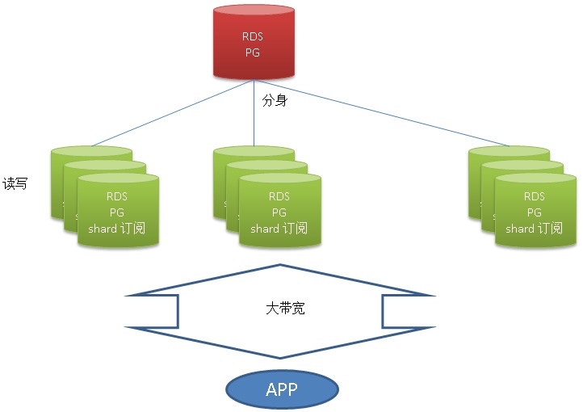
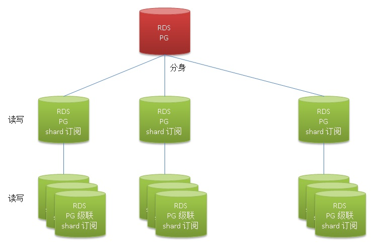
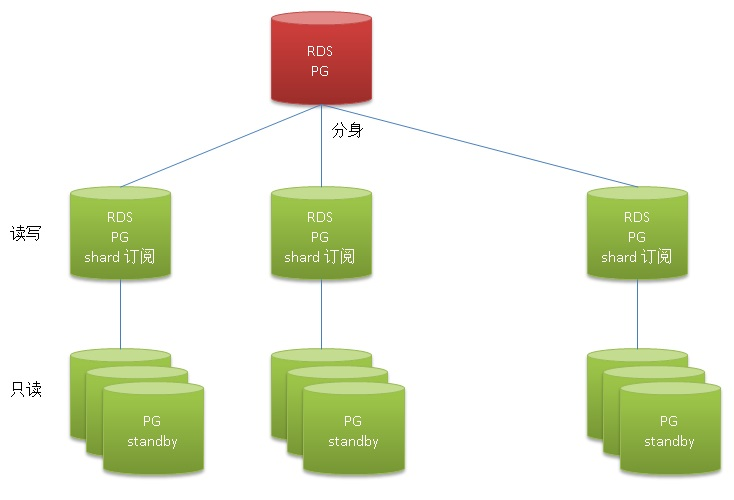
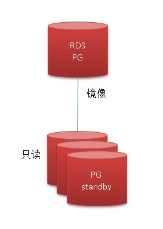
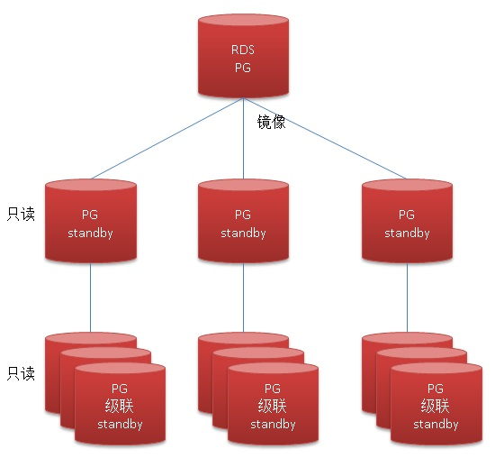
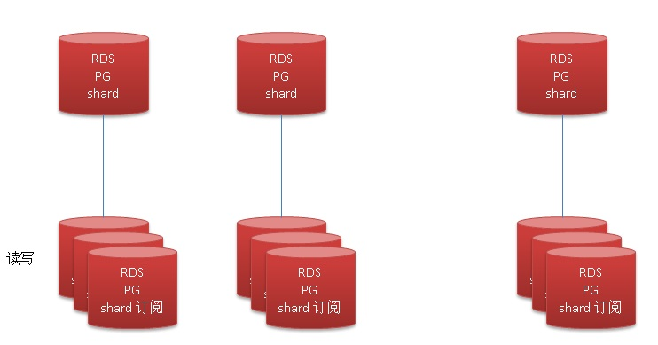
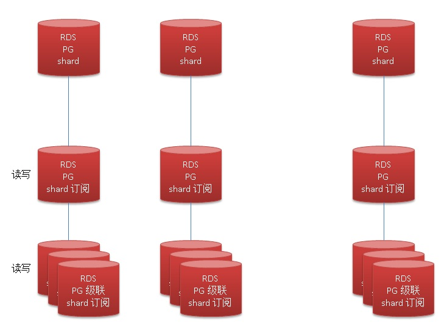
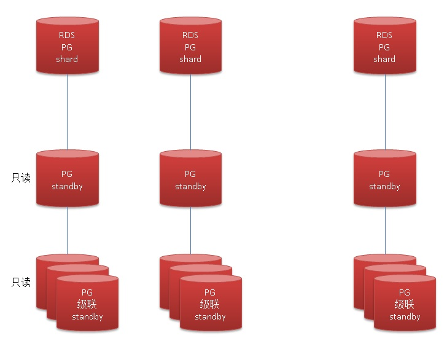
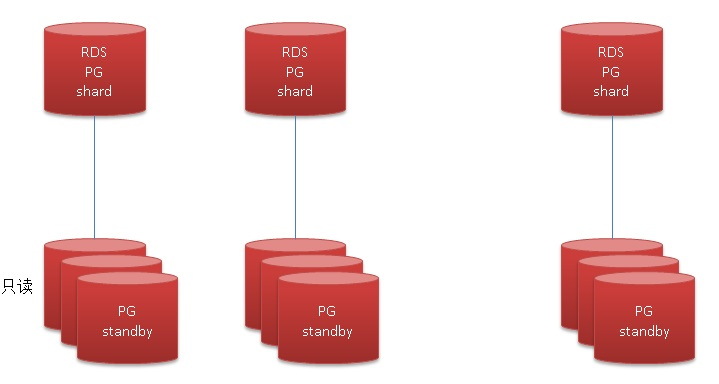

## 机票业务性能优化案例 - 阿里云RDS PostgreSQL最佳实践    
                                        
### 作者                                           
digoal                                   
                                    
### 日期                                                                                                       
2017-07-27                                 
                                       
### 标签                                    
PostgreSQL , 机票业务 , 聚集 , jsonb , hstore , array , text             
                                                                                                          
----                                                                                                    
                                                                                                             
## 背景      
机票业务的某个模块，数据量10亿+，写、更新、删除量较低。根据KEY查询一些数据，每次查询返回1万条左右的记录。    
    
就是这样简单的需求，业务方发现读成为了巨大的瓶颈，每次返回1万条，100个并发请求，每秒就是100万条（500MB左右），主要的瓶颈：    
    
1、网络是个较大的开销。    
    
2、不同KEY的数据可能是分散存放的，存在查询时的IO放大，可能有一定的性能影响。    
    
3、每次请求的返回记录数较多，数据库search buffer调用可能开销会上升。    
    
就这几个问题，我们来看看如何优化或解决业务方的问题。    
    
## 建模    
1、建表    
    
```    
create table test(    
  id int,       
  info text,    -- 一些属性，我这里用一个字段代表它     
  typeid int,   -- 类别，也是用户的查询过滤条件，约10万个类别，每个类别1万条记录，总共10亿记录。    
  crt_time timestamp,  -- 创建时间    
  mod_time timestamp  -- 修改时间    
);    
```    
    
2、灌入测试数据    
    
```    
insert into test select generate_series(1,1000000000), 'test', random()*99999, now();    
```    
    
3、创建索引    
    
```    
create index idx_test_typeid on test (typeid);    
```    
    
4、原始SQL请求    
    
```    
select * from test where typeid=?;    
    
约返回1万记录。    
```    
    
## 了解数据分布    
    
```    
postgres=# select schemaname, tablename, attname, correlation from pg_stats where tablename='test';    
 schemaname | tablename | attname  | correlation     
------------+-----------+----------+-------------    
 postgres   | test      | id       |           1    
 postgres   | test      | info     |           1    
 postgres   | test      | typeid   |   0.0122783    
 postgres   | test      | crt_time |           1    
 postgres   | test      | mod_time |                
(5 rows)    
```    
    
通过pg_stats可以看到typeid和物理存储的线性相关性才0.012，非常分散。    
    
按TYPEID访问时，IO放大很严重，也就是说1万条记录可能分散在1万个数据块中。    
    
```    
postgres=# explain (analyze,verbose,timing,costs,buffers) select * from test where typeid =1;    
                                                                 QUERY PLAN                                                                     
--------------------------------------------------------------------------------------------------------------------------------------------    
 Index Scan using idx_test_typeid on postgres.test  (cost=0.57..13343.21 rows=10109 width=29) (actual time=0.029..14.283 rows=9935 loops=1)    
   Output: id, info, typeid, crt_time, mod_time    
   Index Cond: (test.typeid = 1)    
   Buffers: shared hit=9959   -- typeid=1的记录分散在9959个数据块中    
 Planning time: 0.085 ms    
 Execution time: 14.798 ms    
(6 rows)    
```    
    
## 原始SQL性能评估、瓶颈分析    
1、压测    
    
```    
vi test.sql    
    
\set typeid random(0,99999)    
select * from test where typeid=:typeid;    
```    
    
压测结果，TPS 1653。    
    
```    
pgbench -M prepared -n -r -P 1 -f ./test.sql -c 64 -j 64 -T 120    
    
transaction type: ./test.sql    
scaling factor: 1    
query mode: prepared    
number of clients: 64    
number of threads: 64    
duration: 120 s    
number of transactions actually processed: 198445    
latency average = 38.699 ms    
latency stddev = 7.898 ms    
tps = 1653.239177 (including connections establishing)    
tps = 1653.525600 (excluding connections establishing)    
script statistics:    
 - statement latencies in milliseconds:    
         0.002  \set typeid random(0,99999)    
        38.697  select * from test where typeid=:typeid;    
```    
    
2、perf 观察瓶颈    
    
```    
perf top -ag    
    
  Children      Self  Shared Object              Symbol                             
+   15.31%    15.19%  postgres                   [.] hash_search_with_hash_value    
+   14.48%     8.78%  postgres                   [.] heap_hot_search_buffer         
+    9.95%     2.26%  [kernel]                   [k] page_fault                     
+    9.44%     8.24%  postgres                   [.] heap_page_prune_opt            
+    7.67%     0.02%  [kernel]                   [k] do_page_fault                  
+    7.62%     0.21%  [kernel]                   [k] __do_page_fault                
+    6.89%     0.41%  [kernel]                   [k] handle_mm_fault                
+    6.87%     6.80%  postgres                   [.] PinBuffer                      
+    4.32%     0.18%  [kernel]                   [k] __do_fault                     
+    4.03%     4.00%  postgres                   [.] LWLockAcquire                  
+    3.83%     0.00%  [kernel]                   [k] system_call_fastpath           
+    3.17%     3.15%  libc-2.17.so               [.] __memcpy_ssse3_back            
+    3.01%     0.16%  [kernel]                   [k] shmem_fault                    
+    2.85%     0.13%  [kernel]                   [k] shmem_getpage_gfp    
```    
    
## 优化手段1，cluster化    
1、PostgreSQL提供了一个cluster的功能，可以将表按索引进行CLUSTER，即重排。    
    
效果是这个索引对应列（或多列）与物理顺序的线性相关性变成1或-1，也就是线性完全一致，那么在按这个字段或这些字段进行条件过滤时，扫描的堆表数据块大幅度降低。    
    
```    
postgres=# cluster test using idx_test_typeid;    
    
postgres=# \d test    
                          Table "postgres.test"    
  Column  |            Type             | Collation | Nullable | Default     
----------+-----------------------------+-----------+----------+---------    
 id       | integer                     |           |          |     
 info     | text                        |           |          |     
 typeid   | integer                     |           |          |     
 crt_time | timestamp without time zone |           |          |     
 mod_time | timestamp without time zone |           |          |     
Indexes:    
    "idx_test_typeid" btree (typeid) CLUSTER    
```    
    
2、测试cluster后，按typeid过滤数据，只需要扫描96个数据块了。SQL的响应时间也从14.8毫秒降到了1.9毫秒。    
    
```    
postgres=# explain (analyze,verbose,timing,costs,buffers) select * from test where typeid =1;    
                                                                QUERY PLAN                                                                     
-------------------------------------------------------------------------------------------------------------------------------------------    
 Index Scan using idx_test_typeid on postgres.test  (cost=0.57..13343.21 rows=10109 width=29) (actual time=0.011..1.413 rows=9935 loops=1)    
   Output: id, info, typeid, crt_time, mod_time    
   Index Cond: (test.typeid = 1)    
   Buffers: shared hit=96    
 Planning time: 0.039 ms    
 Execution time: 1.887 ms    
(6 rows)    
```    
    
3、压测，TPS 2715。相比原始性能提升了 64%。      
    
```    
pgbench -M prepared -n -r -P 1 -f ./test.sql -c 64 -j 64 -T 120    
    
transaction type: ./test.sql    
scaling factor: 1    
query mode: prepared    
number of clients: 64    
number of threads: 64    
duration: 120 s    
number of transactions actually processed: 326188    
latency average = 23.546 ms    
latency stddev = 7.793 ms    
tps = 2715.409760 (including connections establishing)    
tps = 2715.677062 (excluding connections establishing)    
script statistics:    
 - statement latencies in milliseconds:    
         0.002  \set typeid random(0,99999)    
        23.543  select * from test where typeid=:typeid;    
```    
    
4、perf 观察瓶颈    
    
```    
用户态的调用不在TOP里面。    
    
+   14.30%     0.00%  [kernel]                      [k] system_call_fastpath       
+    9.62%     1.26%  [kernel]                      [k] page_fault                 
+    8.35%     0.01%  [kernel]                      [k] do_page_fault              
+    8.27%     0.14%  [kernel]                      [k] __do_page_fault            
+    6.81%     0.37%  libc-2.17.so                  [.] sysmalloc                  
+    6.48%     0.10%  [kernel]                      [k] __alloc_pages_nodemask     
+    5.84%     0.40%  [kernel]                      [k] handle_mm_fault            
+    5.84%     0.05%  libpthread-2.17.so            [.] __libc_send                
+    5.83%     5.79%  libc-2.17.so                  [.] __memcpy_ssse3_back        
+    5.74%     0.03%  libpthread-2.17.so            [.] __libc_recv               
```    
    
### 优化1小结    
1、优化手段1没有涉及到降低网络开销的优化。    
    
2、使用cluster后，完全规避了IO放大的问题。    
    
3、但是每次请求返回的记录数与原来一样，对数据库search buffer没有起到效果。    
    
4、聚集操作是静态操作，数据库并不会一直维持这个状态。    
    
不过PG可以设置fillfactor，使得更新后的版本尽量在当前数据块。这种方法对于更新很有效，只要对应的搜索KEY不变更，那么线性相关性可以一直被维持。对于新增数据无效。所以cluster特别适合相对静态的数据，或者时间维度上，旧的数据基本不变更的场景，可以使用时间分区表，对旧数据实施CLUSTER，保证就数据的线性相关性。    
    
```    
alter table test set (fillfactor=80);      
```    
    
## 优化手段2，聚集化    
优化2的目标和1类似，但是将数据聚集为单条，同时提升数据的压缩比，不过是数据库端压缩，所以对网络需求的降低并没有效果。    
    
1、聚集，因为更新少，所以我们可以将多条记录聚集为一条记录。    
    
```    
create table test_agg (typeid int, content jsonb);    
    
insert into test_agg select typeid, jsonb_agg(jsonb_build_object('id',id,'info',info,'crt_time',crt_time,'mod_time',mod_time)) from test group by typeid;    
    
create index idx_test_agg_1 on test_agg(typeid);    
```    
    
2、查询请求    
    
```    
select * from test_agg where typeid=?    
```    
    
3、增、删、改    
    
JSON类型的操作函数如下：    
    
https://www.postgresql.org/docs/10/static/functions-json.html    
    
4、优化后的性能指标    
    
压测，性能并没有提升    
    
```    
vi test1.sql    
    
\set typeid random(0,99999)    
select * from test_agg where typeid=:typeid;    
    
pgbench -M prepared -n -r -P 1 -f ./test1.sql -c 64 -j 64 -T 120    
    
transaction type: ./test1.sql    
scaling factor: 1    
query mode: prepared    
number of clients: 64    
number of threads: 64    
duration: 120 s    
number of transactions actually processed: 151156    
latency average = 50.803 ms    
latency stddev = 2.913 ms    
tps = 1258.934362 (including connections establishing)    
tps = 1259.301582 (excluding connections establishing)    
script statistics:    
 - statement latencies in milliseconds:    
         0.002  \set typeid random(0,99999)    
        50.801  select * from test_agg where typeid=:typeid;    
```    
    
### 优化2小结    
    
性能并没有提升，转换为JSONB类型后，每个ELEMETE都增加了头部信息，所以网络传输的空间实际变大了。    
    
```    
......    
{"id": 172264479, "info": "test", "crt_time": "2017-07-27T20:41:32.365209", "mod_time": null},     
{"id": 172304687, "info": "test", "crt_time": "2017-07-27T20:41:32.365209", "mod_time": null},    
......    
```    
    
这个优化方法并没有赚到。    
    
## 优化手段3，网络传输压缩优化    
    
PostgreSQL支持SSL链接，通过SSL支持压缩和加密传输。    
    
如果传输带宽有限，使用这种链路是非常不错的选择，但是会消耗一部分客户端和数据库端的CPU资源。    
    
有一些例子：    
    
[《PostgreSQL SSL链路压缩例子》](../201508/20150818_01.md)      
    
[《PostgreSQL ssl ciphers performance 比较》](../201305/20130522_02.md)      
    
## 优化手段4，只读节点    
    
这个优化方法简单有效，但是需要投入一些资源，PostgreSQL支持两种备库，物理、逻辑备库。    
    
物理备库只读，延迟低，不管事务多大，延迟都在毫秒级。但是物理备库只能全库复制。    
    
逻辑备库可写，同时可以订阅部分数据，但是延迟较高（通常一个订阅通道的速率在3万行/s，一个实例可以支持多个订阅通道，比如每个表一个订阅通道）。    
    
同时建议数据库节点与APPLICATION节点的网络尽量靠近，甚至将备库部署在业务服务器都是赞许的。    
    
参考文档：    
    
[《PostgreSQL 10 流式物理、逻辑主从 最佳实践》](../201707/20170711_01.md)      
    
## 优化手段5，按用户切分，sharding。    
    
按用户切分，将数据切分到多个数据库实例。    
    
按照优化手段1的指标，每个节点可以提供1.3GB/s的输出流量，如果切分到16个节点，可以支持21GB/s的输出流量。完全不用考虑备库。    
    
中间层可以考虑使用plproxy，中间件等方法。    
    
[《PostgreSQL 最佳实践 - 水平分库(基于plproxy)》](../201608/20160824_02.md)      
    
https://github.com/go-pg/sharding    
    
参考文档    
    
[《PostgreSQL 9.6 sharding based on FDW & pg_pathman》](../201610/20161027_01.md)      
    
## 小结    
1、原来单条的存储，用户每次请求，返回1万条记录，所以主机的网络带宽，数据库的数据访问离散IO的放大都是较大的性能阻碍因素。    
    
使用cluster的方法，将数据按KEY存放，完全消除IO放大的问题，性能提升非常明显。    
    
使用FILLFACTOR，可以让数据的更新尽量在当前数据块完成，从而不破坏cluster的顺序。解决UPDATE引入的破坏线性相关性问题。    
    
2、通过聚集(cluster)的方法，将用户需要访问的数据合并成单行(或者按顺序存放)，减少扫描的数据块。查询效率有大幅提升。    
    
通过扩展带宽或者加入少量的备库就可以满足业务方的需求。    
    
3、PostgreSQL支持多种聚合方法，数组、KV、JSON。    
    
但是聚合的方法带来另一个问题，数据的DML变得很麻烦。    
    
4、通过聚集，被查询的数据靠在一起了，使得数据压缩比更高，同时消除了原来的IO放大的问题，还可以减少多条记录引入的代码跳转额外开销。    
    
5、聚集后，数据的增、删、改可以通过UDF来实现。PostgreSQL的plpgsql功能很强大，类似Oracle的PL/SQL。同时PostgreSQL还支持pljava, plpython等UDF语言，方便更多的开发者使用。    
    
最后，推荐的优化方法：    
    
1、cluster    
    
2、网络压缩（客户端使用ssl连接数据库）    
    
3、读写分离    
    
4、sharding    
    
建议的优化组合1+4，或者1+3。    
  
一些可供选择的架构：  
      
1、一个数据库存储全量数据，提供读写。使用逻辑订阅，将数据分身，拆成多份，提供读写。    
     
     
  
2、一个数据库存储全量数据，提供读写。使用逻辑订阅，将数据分身，拆成多份，提供读写。采用级联逻辑订阅方式，创建更多读写逻辑订阅库。       
      
     
    
3、一个数据库存储全量数据，提供读写。使用逻辑订阅，将数据分身，拆成多份，提供读写。采用级联物理流复制方式，创建更多镜像只读备库。       
     
     
  
4、一个数据库存储全量数据，提供读写。采用物理流复制方式，创建一堆镜像只读备库。       
     
     
  
5、一个数据库存储全量数据，提供读写。采用物理流复制方式，创建一堆镜像只读备库。采用级联物理流复制方式，创建更多镜像只读备库。       
    
     
  
6、前端shard，多个数据库存储全量数据，提供读写。使用逻辑订阅，完全镜像，提供读写。  
    
     
  
7、前端shard，多个数据库存储全量数据，提供读写。使用逻辑订阅，完全镜像，提供读写。采用级联逻辑订阅方式，创建更多读写逻辑订阅库。       
    
     
  
8、前端shard，多个数据库存储全量数据，提供读写。采用物理流复制方式，创建只读备库。采用级联物理流复制方式，创建更多镜像只读备库。       
    
     
  
9、前端shard，多个数据库存储全量数据，提供读写。采用物理流复制方式，创建一堆只读备库。      
  
     
    
10、逻辑订阅、物理流复制都支持SSL加密和压缩链接。或者你还有一种方法来支持链路加密和压缩，使用ECS建立反向隧道：   
  
[《PostgreSQL SSL链路压缩例子》](../201508/20150818_01.md)  
  
[《PostgreSQL 如何实现网络压缩传输或加密传输(openssl)》](../201305/20130522_01.md)  
  
[《使用 ssh -R 建立反向/远程TCP端口转发代理》](../201406/20140614_01.md)  
  
[《单网卡绑多个IP时如何指定IP出口(VIP出口绑定) - use ip modify route table use vip as src trans in multi-IP bonded env》](../201406/20140618_01.md)  
  
## 参考    
[《PostgreSQL 聚集存储 与 BRIN索引 - 高并发行为、轨迹类大吞吐数据查询场景解说》](../201702/20170219_01.md)        
    
[《PostgreSQL 10 流式物理、逻辑主从 最佳实践》](../201707/20170711_01.md)     
     
sharding 中间件    
    
https://github.com/dangdangdotcom/sharding-jdbc     
     
https://github.com/go-pg/sharding/     
  
[《PostgreSQL 最佳实践 - 水平分库(基于plproxy)》](../201608/20160824_02.md)    
        
  
<a rel="nofollow" href="http://info.flagcounter.com/h9V1"  ></a>  
  
  
  
  
  
  
## [digoal's 大量PostgreSQL文章入口](https://github.com/digoal/blog/blob/master/README.md "22709685feb7cab07d30f30387f0a9ae")
  
