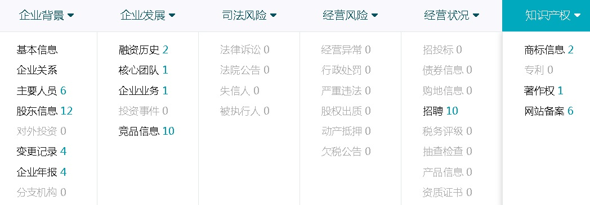

## 小微贷款、天使投资(风控助手)业务数据库设计(图式搜索\图谱分析) - 阿里云RDS PostgreSQL, HybridDB for PostgreSQL最佳实践  
     
### 作者     
digoal    
    
### 日期    
2017-08-01    
    
### 标签    
PostgreSQL , HybridDB for PostgreSQL , 小微贷款 , 金融风控 , 企业图谱 , 图式搜索 , 舆情分析 , 自动贷款 , 贷款审查 , 审查神器    
    
----    
    
## 背景    
贷款是银行的主营业务之一，但是并不是只有银行能提供贷款，实际上资金雄厚的公司都有能力提供贷款（比如保险行业、资源垄断型企业等）。  
  
  
  
除了放贷，我们常说的天使投资、A轮B轮啥的，也是类似的场景，凭什么投你，背后如何决策也需要决策系统的支撑。  
  
  
  
与贷款相反的是吸金类业务，比如我们现在发现越来越多的理财产品、股市、甚至是游戏充值，只要是让你存钱，把你的钱留住，而且你还不舍得吧钱取出来的业务，都是吸金类业务。  
  
所以，一些本来就资金雄厚，或者是靠吸金类业务起来的公司，只要吸到足够的金之后，就有放贷款的能力。  
  
放贷本身是一件体力活，来申请贷款的人或企业鱼龙混杂。什么样的人，什么样的企业能获得贷款，需要经过层层审查。审查需谨慎，否则就容易成为放贷公司的烂账。  
  
本文涉及的项目和放贷、审查、风控、舆情系统有关。  
  
## 一、需求分析  
展示企业的图谱信息，例如股权结构、舆情事件、管理层、知识产权，经营状况等。方便审查员查看。  
  
  
  
数据的来源，例如爬虫得到的信息、来自合作伙伴（例如招聘网站、税务）的信息等，组成了企业相关的信息网络。  
  
### 类比社交业务  
这类数据和互联网的社交类业务的数据非常类似，A企业投资了B企业（类似微博的LIKE），A企业发布了财报（类似发微博），A企业获得了某个专利。。。。  
  
相关的性能指标：  
  
1、用户数量级1亿（相当于1亿企业名录），好友数量级1~1万（相当于平均每个企业与之相关联的企业1到1万家），单个对象的Like数量1-100万（相当于单个事件被关注的平均次数1到100万次）。  
  
1\.1\. 关注微博（文章）      
      
17.7万/s，预计可以优化到30万。      
      
1\.2\. 查询文章被谁like？    
      
101.6万/s      
    
1\.3\. 查询文章被like了多少次？     
      
104.1万/s      
      
1\.4\. 查询LIKE某文章的用户中，哪些是我的好友？      
      
64.8万/s      
      
      
        
1\.5\. 机器:      
      
（10W左右价位的X86，12*8TB SATA盘，1块SSD作为BCACHE）    
  
案例详见：  
  
[《三体高可用PCC大赛 - facebook\微博 like场景 - 数据库设计与性能压测》](../201705/20170512_02.md)    
  
[《facebook linkbench 测试PostgreSQL社交关系图谱场景性能》](../201609/20160911_01.md)    
  
### 类比图式搜索业务  
企业图谱系统与互联网社交类业务截然不同的地方：  
  
企业数据相对来说是比较静态的数据，所以我们更关注的是查询的性能，按一个企业顺藤摸瓜找出相关企业的数据的性能。与之对应的是下面这个案例，图式搜索的应用。  
  
案例详见：  
  
[《金融风控、公安刑侦、社会关系、人脉分析等需求分析与数据库实现 - PostgreSQL图数据库场景应用》](../201612/20161213_01.md)    
  
相关的性能指标：  
  
1、1亿企业名录，每5万作为一个有牵连的企业群体，每个企业牵连1000个其他企业，形成1000亿的超大规模关系网。  
  
以某个企业为中心，检索3层关系的企业网络：响应时间15毫秒。  
  
### 数据量预估  
企业：百万。  
  
每个企业相关的关系、舆情事件、财报等，平均预计1000条。  
  
平均每个企业的直接相关企业有50家。  
  
个人（法人、股东、监理、。。。）：百万。  
  
每个人有若干家相关企业。  
  
总数据量约10亿级。  
  
## 二、数据库架构设计  
  
  
1、相对静态的数据(例如人、企业基本信息、主要成员、股东。。。)  
  
量级：百万。  
  
有些一对多的数据，可以使用数组类型（例如企业主要成员ID、股东ID，存为数组）来存储，从而提升查询效率。  
  
```  
create table corp_info (...);       --  企业相对静态信息  
  
create table people_info (...);     --  个人相对静态信息  
```  
  
建议将这类静态数据设计为多张表，使用PK关联起来，减少查询少量字段时的数据扫描量（因为PG是行存储格式，查询少量字段时，可以提高命中率减少IO放大）。  
  
2、舆情、流水数据  
  
量级：十亿。  
  
```  
create table corp_feed (corp_id pk, typ int, event);    
```  
  
3、关系数据  
  
量级：千万 ~ 亿级别。  
  
这个量级基本上不需要考虑存储冗余的正向关系，反向关系，（方便sharding(FDW, hybriddb)）。  
  
```  
create table corp_rel (...);  
```  
  
4、线上线下一体化  
  
阿里云线上的数据，通过逻辑订阅、物理流式复制，可以将数据复制到线下数据库中。  
  
其中逻辑订阅支持表级订阅（每张表的订阅速度约3万行/s，指表在独立订阅通道时）。逻辑订阅还可以通过规则或触发器支持订阅表中的部分数据，甚至实现格式转换等工作。逻辑订阅的备库支持可读可写。（逻辑订阅的大事务延迟比物理复制高）  
  
物理流式复制，支持全库复制，物理复制的好处是延迟低，备库支持只读。  
  
  
  
用户建立RDS备库的需求的起因  
  
有些企业因为SOX审计的需求，必须要在自己的机房放一个备节点。  
  
有些企业可能期望通过这种方法建立日常开发或测试环境。  
  
有些架构的需求，例如云端存储所有数据，线下存储部分关心的加速数据。或者云端所有数据拆分成了多个库，分析场景需要将数据合并起来进行分析，那么就有多对一的复制需求，使用PostgreSQL逻辑订阅可以支持。  
  
5、sharding  
  
虽然本文涉及的场景和数据量并不需要sharding(根据后面的测试，实际上RDS PostgreSQL单库支持1000亿数据量，在稳定性、性能各方面应该是没有问题的。)，但是考虑到案例的通用性，还是提一下。  
  
可以根据被查询的ID进行切分，如有正反向关系的，可以采用冗余存储的方式达到切片的目的。  
  
PostgreSQL sharding的案例很多：  
  
1、内核层面支持的sharding  
  
[《PostgreSQL 9.6 sharding based on FDW & pg_pathman》](../201610/20161027_01.md)    
  
2、通过plproxy代理支持的sharding  
  
[《PostgreSQL 最佳实践 - 水平分库(基于plproxy)》](../201608/20160824_02.md)    
  
3、通过citus插件支持的sharding和mpp  
  
https://github.com/citusdata/citus  
  
4、通过客户端代理支持的sharding  
  
https://github.com/dangdangdotcom/sharding-jdbc       
  
https://github.com/go-pg/sharding/    
  
## 三、DEMO性能  
### 建表  
  
```  
create table corp_info (  -- 企业信息  
  id int primary key,  -- 企业ID，主键   
  info text,           -- 企业信息  
  core_team int[]      -- 核心团队成员ID  
  -- 忽略其他字段  
);  
  
create table people_info (  -- 人信息  
  id int primary key,  -- 人ID，主键   
  info text,           -- 信息  
  rel_corp int[],      -- 和哪些公司相关  
  rel_type int[]       -- 分别是什么关系(法人、建立、董事长，。。。。)  
  -- 忽略其他字段  
);  
  
create table corp_rel1 (  -- 企业正向关系  
  corp_id1 int,  -- 企业ID  
  corp_id2 int,  -- 企业ID  
  reltypid int   -- 关系类型  
);  
create index idx_corp_rel1 on corp_rel1 (corp_id1);  
  
create table corp_rel2 (  -- 企业反向关系  
  corp_id1 int,  -- 企业ID  
  corp_id2 int,  -- 企业ID  
  reltypid int   -- 关系类型  
);  
create index idx_corp_rel2 on corp_rel2 (corp_id1);  
  
create table corp_event ( -- 企业舆情  
  corp_id int,  -- 企业ID  
  event text,   -- 事件内容  
  crt_time timestamp  -- 时间  
  -- 其他字段略  
);  
create index idx_corp_event_1 on corp_event(corp_id, crt_time desc);  
```  
  
### 生成测试数据  
生成10.42亿测试数据，数据组成和生成方法如下：  
  
```  
-- 100万 企业数据  
insert into corp_info select generate_series(1,1000000), 'test', array(select (random()*1000000)::int from generate_series(1,20));  
  
-- 100万 人数据  
insert into people_info select generate_series(1,1000000), 'test', array(select (random()*1000000)::int from generate_series(1,20)), array(select (random()*50)::int from generate_series(1,20));  
  
-- 2000万 企业正向关系  
insert into corp_rel1 select random()*1000000, random()*1000000, random()*100 from generate_series(1,20000000);  
  
-- 2000万 企业反向关系  
insert into corp_rel2 select random()*1000000, random()*1000000, random()*100 from generate_series(1,20000000);  
  
-- 10亿 企业舆情  
insert into corp_event select random()*1000000, 'test', now()+(id||' second')::interval from generate_series(1,1000000000) t(id);  
```  
  
由于数据相对静止，所以我们可以对数据进行cluster话，提高查询效率。（不这么做，实际上也是毫秒级的响应时间，这么做之后可以降低到0.0X 毫秒）  
  
相关案例：  
  
[《机票业务性能优化案例 - 阿里云RDS PostgreSQL最佳实践》](../201707/20170727_03.md)    
  
```  
cluster corp_rel1 using idx_corp_rel1;  
cluster corp_rel2 using idx_corp_rel2;  
cluster corp_event using idx_corp_event_1;  
```  
  
### 压测  
  
1、企业静态数据查询  
  
```  
vi test.sql  
  
\set id random(1,1000000)  
select * from corp_info where id=:id;  
select * from people_info where id = any (array(select core_team from corp_info where id=:id));  
```  
  
```  
pgbench -M prepared -n -r -P 1 -f ./test.sql -c 64 -j 64 -T 120  
  
transaction type: ./test.sql
scaling factor: 1
query mode: prepared
number of clients: 64
number of threads: 64
duration: 120 s
number of transactions actually processed: 15175162
latency average = 0.506 ms
latency stddev = 0.080 ms
tps = 126454.038435 (including connections establishing)
tps = 126468.912494 (excluding connections establishing)
script statistics:
 - statement latencies in milliseconds:
         0.001  \set id random(1,1000000)
         0.068  select * from corp_info where id=:id;
         0.444  select * from people_info where id = any (array(select core_team from corp_info where id=:id));
```  
  
2、企业关系数据查询，查询正向和反向关系。  
  
```  
vi test1.sql  
  
\set id random(1,1000000)  
select * from corp_rel1 where corp_id1=:id;  
select * from corp_rel2 where corp_id1=:id;  
```  
  
```  
pgbench -M prepared -n -r -P 1 -f ./test1.sql -c 64 -j 64 -T 120  
  
transaction type: ./test1.sql
scaling factor: 1
query mode: prepared
number of clients: 64
number of threads: 64
duration: 120 s
number of transactions actually processed: 49723004
latency average = 0.154 ms
latency stddev = 0.032 ms
tps = 414351.413094 (including connections establishing)
tps = 414396.709915 (excluding connections establishing)
script statistics:
 - statement latencies in milliseconds:
         0.001  \set id random(1,1000000)
         0.077  select * from corp_rel1 where corp_id1=:id;
         0.077  select * from corp_rel2 where corp_id1=:id;
```  
  
3、企业最近10条舆情数据查询  
  
```  
vi test2.sql  
  
\set id random(1,1000000)  
select * from corp_event where corp_id=:id order by crt_time desc limit 10;  
```  
  
```  
pgbench -M prepared -n -r -P 1 -f ./test2.sql -c 64 -j 64 -T 120  
  
transaction type: ./test2.sql
scaling factor: 1
query mode: prepared
number of clients: 64
number of threads: 64
duration: 120 s
number of transactions actually processed: 94303135
latency average = 0.081 ms
latency stddev = 0.020 ms
tps = 785845.099057 (including connections establishing)
tps = 785941.120081 (excluding connections establishing)
script statistics:
 - statement latencies in milliseconds:
         0.001  \set id random(1,1000000)
         0.081  select * from corp_event where corp_id=:id order by crt_time desc limit 10;
```  
  
## 四、达到的效果  
1、性能  
  
1\.1、企业静态数据查询。  
  
TPS：12.6万     
  
平均响应时间：0.5毫秒    
  
1\.2、企业关系数据查询，输出正向和反向关系。   
  
TPS：41.4万    
  
平均响应时间：0.15毫秒    
  
1\.3、企业最近10条舆情数据查询。  
  
TPS：78.5万    
  
平均响应时间：0.08毫秒  
  
  
  
  
  
2、使用阿里云RDS PostgreSQL，用户不需要关心数据库的运维，容灾，备份恢复，扩容，缩容，HA等基本问题，可以更加专注于业务。  
  
3、分析需求，使用PostgreSQL 10提供的多核并行、JIT、算子复用等特性，处理10亿级的数据分析完全不在话下。  
  
[《分析加速引擎黑科技 - LLVM、列存、多核并行、算子复用 大联姻 - 一起来开启PostgreSQL的百宝箱》](../201612/20161216_01.md)    
  
[《TPC-H测试 - PostgreSQL 10 vs Deepgreen(Greenplum)》](../201707/20170714_01.md)    
  
4、机器学习需求  
  
阿里云RDS PostgreSQL提供了机器学习插件MADlib，支持Classification, Regression, Clustering, Topic Modeling, Association Rule Mining, Descriptive Statistics, Validation等众多挖掘模型。  
  
  
  
http://madlib.incubator.apache.org/product.html  
  
[madlib手册](http://madlib.incubator.apache.org/docs/latest/index.html)  
  
5、线上线下一体化，通过RDS PostgreSQL提供的流复制、逻辑订阅接口，用户可以将数据复制到远端或多个RDS，与业务灵活的组合，实现较灵活的架构（包括多MASTER的支持）。  
  
[《使用PostgreSQL逻辑订阅实现multi-master》](../201706/20170624_01.md)    
  
[《PostgreSQL 10 流式物理、逻辑主从 最佳实践》](../201707/20170711_01.md)    
  
6、阿里云云端产品组合拳  
  
使用云端的OSS，HybridDB for PostgreSQL, RDS PostgreSQL，可以支持用户从 流计算、在线业务、数据分析的业务数据闭环。    
  
[《打造云端流计算、在线业务、数据分析的业务数据闭环 - 阿里云RDS、HybridDB for PostgreSQL最佳实践》](../201707/20170728_01.md)    
  
[《ApsaraDB的左右互搏(PgSQL+HybridDB+OSS) - 解决OLTP+OLAP混合需求》](../201701/20170101_02.md)    
  
[阿里云 RDS PostgreSQL](https://www.aliyun.com/product/rds/postgresql)    
  
[阿里云 HybridDB for PostgreSQL](https://www.aliyun.com/product/gpdb)    
  
## 五、技术点回顾  
本方案用到了哪些技术点：  
  
1、MADlib，支持多种机器学习算法，通过SQL接口调用，实现了数据库的机器学习功能。  
  
2、逻辑订阅，通过逻辑订阅，用户可以复制出多个数据库（可以按表级、行级进行复制），复制出来的SLAVE节点支持读写。  
  
3、物理流式复制，通过物理流式复制，用户可以复制出多个备库，支持只读。  
  
用户建立RDS备库的需求的起因：  
  
有些企业因为SOX审计的需求，必须要在自己的机房放一个备节点。  
  
有些企业可能期望通过这种方法建立日常开发或测试环境。  
  
有些架构的需求，例如云端存储所有数据，线下存储部分关心的加速数据。或者云端所有数据拆分成了多个库，分析场景需要将数据合并起来进行分析，那么就有多对一的复制需求，使用PostgreSQL逻辑订阅可以支持。  
  
4、数组类型，数组类型用于存储一对多的关系，PostgreSQL支持数组的索引检索，效率非常高。  
  
5、SQL 流计算，通过SQL流计算，可以实时的进行数据预警，聚合，转换等操作。在三体高可用PCC大赛中见证了它的卓越效果。  
  
## 六、云端产品回顾  
  
[阿里云 RDS PostgreSQL](https://www.aliyun.com/product/rds/postgresql)    
  
[阿里云 HybridDB for PostgreSQL](https://www.aliyun.com/product/gpdb)    
  
[阿里云 OSS](https://www.aliyun.com/product/oss)  
  
## 七、类似场景、案例  
1、社交类场景业务。  
  
[《三体高可用PCC大赛 - facebook\微博 like场景 - 数据库设计与性能压测》](../201705/20170512_02.md)    
  
[《facebook linkbench 测试PostgreSQL社交关系图谱场景性能》](../201609/20160911_01.md)    
  
2、图式搜索相关的金融风控、公安刑侦、社会关系、人脉分析等需求分析类业务。  
  
[《金融风控、公安刑侦、社会关系、人脉分析等需求分析与数据库实现 - PostgreSQL图数据库场景应用》](../201612/20161213_01.md)    
  
## 八、小结  
贷款这项业务已经不是银行的专利业务，越来越多的企业都开通了类似（贷款、投资）业务。  
  
放贷本身是一件体力活，来申请贷款的人或企业鱼龙混杂。什么样的人可以获得贷款，什么样的企业值得投资，需要经过层层审查。审查需谨慎，否则就容易成为放贷公司的烂账。  
  
通过爬虫、合作伙伴渠道可以获得个人、企业的信息、舆情信息等，通过这些信息的有效组织，可以帮助放贷人、投资人快速的做出决策，选择是否需要放贷或投资。  
  
业务方使用阿里云的RDS PostgreSQL, HybridDB for PostgreSQL, OSS等组合产品，减轻了业务方的数据库维护、HA、容灾、扩容、缩容等负担。业务方可以专注于应用开发，提高效率。  
    
性能方面，远远超出业务预期（如果每秒几十万笔查询还不够，你的贷款业务得多红火呀 ^_^）。   
    
## 九、参考  
[《三体高可用PCC大赛 - facebook\微博 like场景 - 数据库设计与性能压测》](../201705/20170512_02.md)    
  
[《facebook linkbench 测试PostgreSQL社交关系图谱场景性能》](../201609/20160911_01.md)    
  
[《金融风控、公安刑侦、社会关系、人脉分析等需求分析与数据库实现 - PostgreSQL图数据库场景应用》](../201612/20161213_01.md)    
  
[《机票业务性能优化案例 - 阿里云RDS PostgreSQL最佳实践》](../201707/20170727_03.md)    
  
[《分析加速引擎黑科技 - LLVM、列存、多核并行、算子复用 大联姻 - 一起来开启PostgreSQL的百宝箱》](../201612/20161216_01.md)    
  
[《TPC-H测试 - PostgreSQL 10 vs Deepgreen(Greenplum)》](../201707/20170714_01.md)    
  
[《使用PostgreSQL逻辑订阅实现multi-master》](../201706/20170624_01.md)    
  
[《PostgreSQL 10 流式物理、逻辑主从 最佳实践》](../201707/20170711_01.md)    
  
[《打造云端流计算、在线业务、数据分析的业务数据闭环 - 阿里云RDS、HybridDB for PostgreSQL最佳实践》](../201707/20170728_01.md)    
  
[《ApsaraDB的左右互搏(PgSQL+HybridDB+OSS) - 解决OLTP+OLAP混合需求》](../201701/20170101_02.md)    
    
  
<a rel="nofollow" href="http://info.flagcounter.com/h9V1"  ></a>  
  
  
  
  
  
  
## [digoal's 大量PostgreSQL文章入口](https://github.com/digoal/blog/blob/master/README.md "22709685feb7cab07d30f30387f0a9ae")
  
