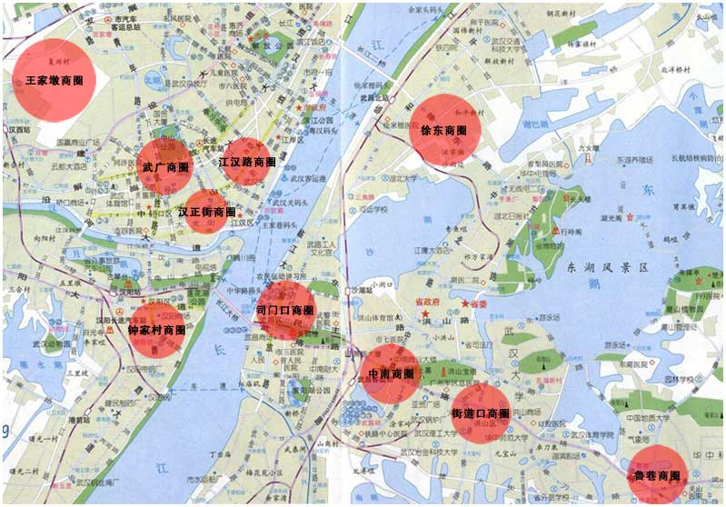
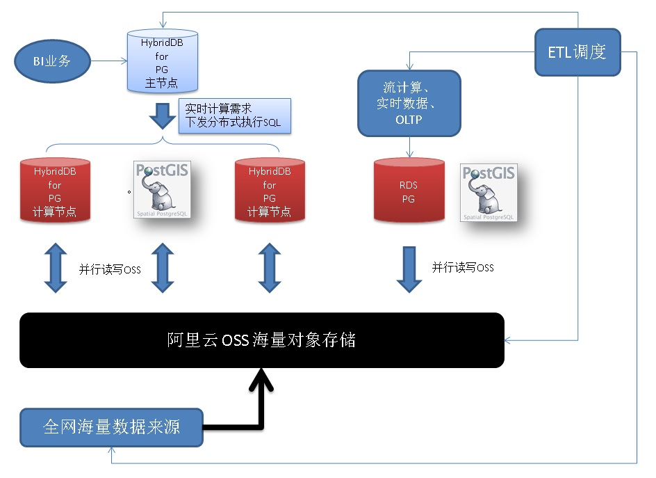
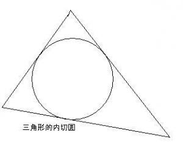
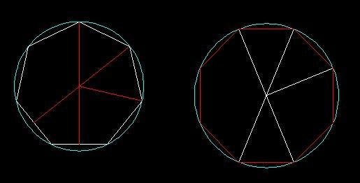

## (新零售)商户网格化(基于位置GIS)运营 - 阿里云RDS PostgreSQL、HybridDB for PostgreSQL最佳实践    
                         
### 作者                          
digoal                         
                           
### 日期                           
2017-08-02                     
                                    
### 标签                    
PostgreSQL , PostGIS , 地理位置 , KNN , 近邻检索 , 网格检索 , polygon中心点 , 半径搜索        
                    
----                    
                     
## 背景          
伟大的马老师说：    
    
“纯电商时代很快会结束，未来的十年、二十年，没有电子商务这一说，只有新零售这一说，也就是说线上线下和物流必须结合在一起，才能诞生真正的新零售”    
    
线上是指云平台，线下是指销售门店或生产商，新物流消灭库存，减少囤货量。    
    
电子商务平台消失是指，现有的电商平台分散，每个人都有自己的电商平台，不再入驻天猫、京东、亚马逊大型电子商务平台。举例：每个人在电商平台都有自己的店铺，集中在平台下进行销售，只能在一块水池里生活，这是很局限性的。    
    
要打通线上线下、消灭库存，需要发挥数据的价值，比如通过数据预测销量。同时线上线下对接，也对数据运营产生了新的挑战，比如基于地理位置的网格化运营由来而生。    
    
    
    
## 一、需求    
1、支持基于地理位置（GIS）的快速数据检索。    
    
2、支持海量销售数据的分析、挖掘。    
    
## 二、架构设计    
    
    
1、海量的销量数据通过OSS并行进入到阿里云HybridDB for PostgreSQL数据库。    
    
2、RDS PostgreSQL负责在线事务处理，网格化运营的任意多边形圈选商户。    
    
3、ETL程序，负责数据调度。    
    
4、BI应用对接HDB for PG和PG，驱动和语法与PostgreSQL兼容。    
    
5、HybridDB for PostgreSQL提供高可用、备份的基本功能，同时提供了一键扩容的功能。用户不需要担心未来数据增长的性能压力。    
    
6、HDB PG和RDS PG可以通过OSS_EXT外部表插件，透明访问（读写）OSS的数据。OSS提供海量共享存储，RDS PG和HDB PG之间通过OSS可共享数据，同时OSS还可以作为外部海量数据来源并行导入到HDB PG的高速通道。OSS还可以作为RDS PG和HDB PG的冷数据存储。    
    
## 三、DEMO与性能    
### 1 商户网格搜索    
#### 1 内置几何类型 商户网格搜索 测试  
用到内置的polygon, box, circle, point类型，GiST空间索引，<->近邻排序操作符，@>操作符。    
    
1、构造1亿商户地理位置数据    
    
```    
postgres=# create table pos(id int, pos point);    
CREATE TABLE    
postgres=# insert into pos select generate_series(1,100000000), point(5000-random()*10000, 5000-random()*10000);    
INSERT 0 10000000    
postgres=# select * from pos limit 10;    
 id |                  pos                      
----+---------------------------------------    
  1 | (603.396683000028,3740.25050085038)    
  2 | (4177.6926163584,4295.85348349065)    
  3 | (-2897.50102907419,4393.90230923891)    
  4 | (-2756.50105439126,2930.08491862565)    
  5 | (-1679.21951506287,-2329.10942286253)    
  6 | (2323.99420812726,-4727.32939757407)    
  7 | (-1572.33712729067,-3614.81220461428)    
  8 | (-1383.57343617827,312.93470878154)    
  9 | (-2942.08695180714,4876.54477357864)    
 10 | (-2387.8013016656,-141.320424154401)    
(10 rows)    
```    
    
2、创建空间索引    
    
```    
postgres=# create index idx_pos on pos using gist(pos);    
```    
    
3、创建查询优化函数    
    
输入任意多边形，返回落在多边形中的商户。    
    
```    
select * from pos where polygon('((10,2),(-10,-100),(0,10))') @> pos;    
```    
    
如果需要带其他条件的空间查询，可以使用空间复合分区索引（PARTIAL INDEX），例如    
    
```    
create index idx_pos on pos using gist(pos) where 分区条件1;    
...    
create index idx_pos on pos using gist(pos) where 分区条件n;    
```    
    
详见    
    
[《分区索引的应用和实践 - 阿里云RDS PostgreSQL最佳实践》](../201707/20170721_01.md)      
    
4、空间索引性能验证，一亿数据网格查询约 0.8 毫秒。     
    
```    
postgres=# explain (analyze,verbose,timing,costs,buffers)     
    
select * from pos where polygon('((10,2),(-10,-100),(0,10))') @> pos;    
    
                                                            QUERY PLAN                                                                 
-----------------------------------------------------------------------------------------------------------------------------------    
 Index Scan using idx_pos on postgres.pos  (cost=0.42..123470.72 rows=100000 width=20) (actual time=0.099..0.737 rows=618 loops=1)    
   Output: id, pos    
   Index Cond: ('((10,2),(-10,-100),(0,10))'::polygon @> pos.pos)    
   Buffers: shared hit=660    
 Planning time: 0.031 ms    
 Execution time: 0.778 ms    
(6 rows)    
    
postgres=# select * from pos where polygon('((10,2),(-10,-100),(0,10))') @> pos;    
    id    |                   pos                        
----------+------------------------------------------    
 14028137 | (-9.47874505072832,-94.8515953496099)    
 43891480 | (-9.1992225497961,-92.9797394201159)    
  1247175 | (-0.888188369572163,-28.0744722113013)    
  4631961 | (-0.548232346773148,-31.1226723715663)    
  5458615 | (-1.67813152074814,-29.4832326471806)    
  6057261 | (-0.965241342782974,-24.8730508610606)    
  ......    
 72818882 | (-0.214213505387306,-38.5544309392571)    
 84374336 | (-0.350810587406158,-38.3379962295294)    
 93014418 | (1.69238075613976,-38.5063700377941)    
 94375565 | (-0.0325776636600494,-43.1329058483243)    
(618 rows)    
```    
    
#### 2 PostGIS空间数据库 商户网格搜索 测试  
实际生产上存储的是经纬度，用得更多的是PostGIS空间数据库。前面使用内置几何类型是为了测试方便。  
  
我们需要用到PostGIS的 商户网格搜索 的函数有两个  
  
http://postgis.net/docs/manual-2.3/ST_Within.html  
  
1、ST_within  
  
ST_Within — Returns true if the geometry A is completely inside geometry B  
  
boolean ST_Within(geometry A, geometry B);  
  
Returns TRUE if geometry A is completely inside geometry B. For this function to make sense, the source geometries must both be of the same coordinate projection, having the same SRID. It is a given that if ST_Within(A,B) is true and ST_Within(B,A) is true, then the two geometries are considered spatially equal.  
  
This function call will automatically include a bounding box comparison that will make use of any indexes that are available on the geometries. To avoid index use, use the function _ST_Within.  
  
```  
-- a circle within a circle  
SELECT ST_Within(smallc,smallc) As smallinsmall,  
	ST_Within(smallc, bigc) As smallinbig,  
	ST_Within(bigc,smallc) As biginsmall,  
	ST_Within(ST_Union(smallc, bigc), bigc) as unioninbig,  
	ST_Within(bigc, ST_Union(smallc, bigc)) as biginunion,  
	ST_Equals(bigc, ST_Union(smallc, bigc)) as bigisunion  
FROM  
(  
SELECT ST_Buffer(ST_GeomFromText('POINT(50 50)'), 20) As smallc,  
	ST_Buffer(ST_GeomFromText('POINT(50 50)'), 40) As bigc) As foo;  
-- Result  
 smallinsmall | smallinbig | biginsmall | unioninbig | biginunion | bigisunion  
--------------+------------+------------+------------+------------+------------  
 t            | t          | f          | t          | t          | t  
(1 row)  
```  
  
2、ST_Contains  
  
ST_Contains — Returns true if and only if no points of B lie in the exterior of A, and at least one point of the interior of B lies in the interior of A.  
  
boolean ST_Contains(geometry geomA, geometry geomB);  
  
Returns TRUE if geometry B is completely inside geometry A. For this function to make sense, the source geometries must both be of the same coordinate projection, having the same SRID. ST_Contains is the inverse of ST_Within. So ST_Contains(A,B) implies ST_Within(B,A) except in the case of invalid geometries where the result is always false regardless or not defined.  
  
This function call will automatically include a bounding box comparison that will make use of any indexes that are available on the geometries. To avoid index use, use the function _ST_Contains.  
  
```  
-- A circle within a circle  
SELECT ST_Contains(smallc, bigc) As smallcontainsbig,  
	   ST_Contains(bigc,smallc) As bigcontainssmall,  
	   ST_Contains(bigc, ST_Union(smallc, bigc)) as bigcontainsunion,  
	   ST_Equals(bigc, ST_Union(smallc, bigc)) as bigisunion,  
	   ST_Covers(bigc, ST_ExteriorRing(bigc)) As bigcoversexterior,  
	   ST_Contains(bigc, ST_ExteriorRing(bigc)) As bigcontainsexterior  
FROM (SELECT ST_Buffer(ST_GeomFromText('POINT(1 2)'), 10) As smallc,  
			 ST_Buffer(ST_GeomFromText('POINT(1 2)'), 20) As bigc) As foo;  
  
-- Result  
  smallcontainsbig | bigcontainssmall | bigcontainsunion | bigisunion | bigcoversexterior | bigcontainsexterior  
------------------+------------------+------------------+------------+-------------------+---------------------  
 f                | t                | t                | t          | t        | f  
  
-- Example demonstrating difference between contains and contains properly  
SELECT ST_GeometryType(geomA) As geomtype, ST_Contains(geomA,geomA) AS acontainsa, ST_ContainsProperly(geomA, geomA) AS acontainspropa,  
   ST_Contains(geomA, ST_Boundary(geomA)) As acontainsba, ST_ContainsProperly(geomA, ST_Boundary(geomA)) As acontainspropba  
FROM (VALUES ( ST_Buffer(ST_Point(1,1), 5,1) ),  
			 ( ST_MakeLine(ST_Point(1,1), ST_Point(-1,-1) ) ),  
			 ( ST_Point(1,1) )  
	  ) As foo(geomA);  
  
  geomtype    | acontainsa | acontainspropa | acontainsba | acontainspropba  
--------------+------------+----------------+-------------+-----------------  
ST_Polygon    | t          | f              | f           | f  
ST_LineString | t          | f              | f           | f  
ST_Point      | t          | t              | f           | f  
```  
  
  
  
  
  
同时还需要用到GiST空间索引，可能用到<->KNN排序操作符，外切圆，圆心等函数，数据构造函数ST_PointFromText等。详见postgis手册  
  
http://postgis.net/docs/manual-2.3/reference.html  
  
1、建表、创建空间索引  
  
```  
postgres=# create table pos(id int, pos geometry);  
CREATE TABLE  
postgres=# create index idx_pos on pos using gist(pos);  
```  
  
2、构造1亿测试数据  
  
```  
postgres=# insert into pos select generate_series(1,100000000), ST_PointFromText('POINT('||180-random()*180||' '||90-random()*90||')', 4326);  
INSERT 0 100000000  
  
postgres=# select id,st_astext(pos) from pos limit 10;  
 id |                 st_astext                   
----+-------------------------------------------  
  1 | POINT(33.1504055019468 0.432478752918541)  
  2 | POINT(21.6662147920579 76.3528884295374)  
  3 | POINT(23.3734973240644 72.9692681785673)  
  4 | POINT(24.6665199659765 8.37537375278771)  
  5 | POINT(42.0769318845123 56.6206424776465)  
  6 | POINT(151.37722584419 81.2602719990537)  
  7 | POINT(137.438789913431 52.9424488730729)  
  8 | POINT(36.6096187848598 87.09903978277)  
  9 | POINT(3.17187242209911 50.9399658115581)  
 10 | POINT(177.163629597053 49.6609620703384)  
(10 rows)  
```  
  
3、商户网格搜索 查询  
  
```  
select id,st_astext(pos) from pos where st_within(  
  pos,   
  ST_PolygonFromText('POLYGON((10 10, 20 10, 15 15, 10 10))', 4326)   
);  
  
   id   |                st_astext                   
--------+------------------------------------------  
 117850 | POINT(19.6388734783977 10.0914861587808)  
 447534 | POINT(19.6453922521323 10.0930827856064)  
 735712 | POINT(19.5879830047488 10.1306327059865)  
 828120 | POINT(19.6418435219675 10.054949526675)  
 965836 | POINT(19.5668494608253 10.052738590166)  
  45480 | POINT(18.0746335722506 10.0232297228649)  
  65043 | POINT(19.3460685387254 10.1494021341205)  
......  
 981674 | POINT(16.9359557982534 10.033694235608)  
 998555 | POINT(15.9493325371295 10.1035685883835)  
 999472 | POINT(14.3828116636723 10.001640371047)  
(1536 rows)  
Time: 11.678 ms  
```  
  
执行计划，使用了空间索引，同时包含了部分过滤（做法应该和我后面提到的类似，外切圆，按距离输出，过滤不在POLYGON内的点）。  
  
```  
postgres=# explain (analyze,verbose,timing,costs,buffers) select id,st_astext(pos) from pos where st_within(  
pos,   
ST_PolygonFromText('POLYGON((10 10, 20 10, 15 15, 10 10))', 4326)   
);  
                                                                                                   QUERY PLAN                                                                                                      
-----------------------------------------------------------------------------------------------------------------------------------------------------------------------------------------------------------------  
 Index Scan using idx_pos on public.pos  (cost=0.29..1219.62 rows=333 width=36) (actual time=0.143..12.563 rows=1536 loops=1)  
   Output: id, st_astext(pos)  
   Index Cond: ('0103000020E6100000010000000400000000000000000024400000000000002440000000000000344000000000000024400000000000002E400000000000002E4000000000000024400000000000002440'::geometry ~ pos.pos)  
   Filter: _st_contains('0103000020E6100000010000000400000000000000000024400000000000002440000000000000344000000000000024400000000000002E400000000000002E4000000000000024400000000000002440'::geometry, pos.pos)  
   Rows Removed by Filter: 1611  
   Buffers: shared hit=3151  
 Planning time: 0.394 ms  
 Execution time: 12.688 ms  
(8 rows)  
```  
  
4、查询分解  
  
4\.1 求包含POLYGON的最小圆(实际上是个多段polygon)  
  
```  
select st_astext(ST_MinimumBoundingCircle('POLYGON((10 10, 20 10, 15 15, 10 10))'::text));  
  
POLYGON((20 10,19.9973229373818 9.83640458589112,19.989294616193 9.67298435384929,19.975923633361 9.5099142983522,19.9572243068691 9.34736903889974,19.9332166604244 9.18552263302706,19.9039264020162 9.02454838991936,19.8693848963867 8.8  
6461868482814,19.8296291314453 8.7059047744874,19.784701678661 8.54857661372769,19.7346506474755 8.39280267348419,19.6795296337866 8.23874976039383,19.6193976625564 8.08658283817455,19.5543191246059 7.93646485097803,19.4843637076634 7.78  
8556548905,19.4096063217418 7.64301631587001,19.3301270189222 7.5,19.2460109076329 7.35966074674816,19.1573480615127 7.22214883490199,19.0642334229581 7.08761151566099,18.9667667014562 6.9561928549564,18.8650522668137 6.82803357918178,18  
.7591990373949 6.70327092449966,18.6493203634892 6.58203848988565,18.5355339059327 6.46446609406727,18.4179615101144 6.35067963651082,18.2967290755003 6.24080096260512,18.1719664208182 6.13494773318632,18.0438071450436 6.03323329854383,1  
7.912388484339 5.93576657704193,17.777851165098 5.84265193848728,17.6403392532518 5.75398909236711,17.5 5.66987298107781,17.35698368413 5.59039367825823,17.211443451095 5.51563629233656,17.063535149022 5.44568087539412,16.9134171618255 5  
.38060233744357,16.7612502396062 5.32047036621337,16.6071973265158 5.26534935252447,16.4514233862723 5.21529832133896,16.2940952255126 5.17037086855466,16.1353813151719 5.13061510361333,15.9754516100806 5.09607359798385,15.814477366973 5  
.06678333957561,15.6526309611003 5.04277569313095,15.4900857016478 5.02407636663902,15.3270156461507 5.01070538380698,15.1635954141089 5.00267706261817,15 5,14.8364045858911 5.00267706261817,14.6729843538493 5.01070538380698,14.509914298  
3522 5.02407636663902,14.3473690388998 5.04277569313095,14.1855226330271 5.0667833395756,14.0245483899194 5.09607359798385,13.8646186848281 5.13061510361333,13.7059047744874 5.17037086855466,13.5485766137277 5.21529832133895,13.392802673  
4842 5.26534935252447,13.2387497603938 5.32047036621337,13.0865828381746 5.38060233744356,12.936464850978 5.44568087539412,12.788556548905 5.51563629233655,12.64301631587 5.59039367825822,12.5 5.6698729810778,12.3596607467482 5.753989092  
3671,12.222148834902 5.84265193848727,12.087611515661 5.93576657704192,11.9561928549564 6.03323329854382,11.8280335791818 6.13494773318631,11.7032709244997 6.24080096260511,11.5820384898856 6.35067963651082,11.4644660940673 6.46446609406  
726,11.3506796365108 6.58203848988564,11.2408009626051 6.70327092449966,11.1349477331863 6.82803357918177,11.0332332985438 6.9561928549564,10.9357665770419 7.08761151566099,10.8426519384873 7.22214883490199,10.7539890923671 7.35966074674  
817,10.6698729810778 7.50000000000001,10.5903936782582 7.64301631587002,10.5156362923366 7.788556548905,10.4456808753941 7.93646485097804,10.3806023374436 8.08658283817456,10.3204703662134 8.23874976039384,10.2653493525245 8.392802673484  
2,10.215298321339 8.5485766137277,10.1703708685547 8.70590477448741,10.1306151036133 8.86461868482815,10.0960735979838 9.02454838991937,10.0667833395756 9.18552263302707,10.0427756931309 9.34736903889976,10.024076366639 9.50991429835222,  
10.010705383807 9.6729843538493,10.0026770626182 9.83640458589114,10 10,10.0026770626182 10.1635954141089,10.010705383807 10.3270156461507,10.024076366639 10.4900857016478,10.042775693131 10.6526309611003,10.0667833395756 10.814477366973  
,10.0960735979839 10.9754516100807,10.1306151036133 11.1353813151719,10.1703708685547 11.2940952255126,10.215298321339 11.4514233862723,10.2653493525245 11.6071973265158,10.3204703662134 11.7612502396062,10.3806023374436 11.9134171618255  
,10.4456808753941 12.063535149022,10.5156362923366 12.211443451095,10.5903936782582 12.35698368413,10.6698729810778 12.5,10.7539890923671 12.6403392532519,10.8426519384873 12.777851165098,10.9357665770419 12.912388484339,11.0332332985438  
 13.0438071450436,11.1349477331863 13.1719664208183,11.2408009626051 13.2967290755004,11.3506796365109 13.4179615101144,11.4644660940673 13.5355339059328,11.5820384898857 13.6493203634892,11.7032709244997 13.7591990373949,11.828033579181  
8 13.8650522668137,11.9561928549564 13.9667667014562,12.087611515661 14.0642334229581,12.222148834902 14.1573480615128,12.3596607467482 14.2460109076329,12.5 14.3301270189222,12.6430163158701 14.4096063217418,12.788556548905 14.484363707  
6635,12.9364648509781 14.5543191246059,13.0865828381746 14.6193976625565,13.2387497603939 14.6795296337866,13.3928026734842 14.7346506474755,13.5485766137277 14.7847016786611,13.7059047744875 14.8296291314454,13.8646186848282 14.86938489  
63867,14.0245483899194 14.9039264020162,14.1855226330271 14.9332166604244,14.3473690388998 14.9572243068691,14.5099142983523 14.975923633361,14.6729843538493 14.989294616193,14.8364045858912 14.9973229373818,15.0000000000001 15,15.163595  
4141089 14.9973229373818,15.3270156461508 14.989294616193,15.4900857016479 14.975923633361,15.6526309611003 14.957224306869,15.814477366973 14.9332166604244,15.9754516100807 14.9039264020161,16.1353813151719 14.8693848963867,16.294095225  
5127 14.8296291314453,16.4514233862724 14.784701678661,16.6071973265159 14.7346506474755,16.7612502396062 14.6795296337866,16.9134171618255 14.6193976625564,17.063535149022 14.5543191246058,17.2114434510951 14.4843637076634,17.3569836841  
301 14.4096063217417,17.5000000000001 14.3301270189222,17.6403392532519 14.2460109076329,17.7778511650981 14.1573480615127,17.9123884843391 14.064233422958,18.0438071450437 13.9667667014561,18.1719664208183 13.8650522668136,18.2967290755  
004 13.7591990373948,18.4179615101144 13.6493203634891,18.5355339059328 13.5355339059327,18.6493203634892 13.4179615101143,18.7591990373949 13.2967290755003,18.8650522668137 13.1719664208182,18.9667667014562 13.0438071450435,19.064233422  
9581 12.9123884843389,19.1573480615128 12.7778511650979,19.2460109076329 12.6403392532518,19.3301270189222 12.4999999999999,19.4096063217418 12.3569836841299,19.4843637076635 12.2114434510949,19.5543191246059 12.0635351490219,19.61939766  
25565 11.9134171618254,19.6795296337867 11.7612502396061,19.7346506474756 11.6071973265157,19.7847016786611 11.4514233862722,19.8296291314454 11.2940952255125,19.8693848963867 11.1353813151718,19.9039264020162 10.9754516100805,19.9332166  
604244 10.8144773669728,19.9572243068691 10.6526309611002,19.975923633361 10.4900857016477,19.989294616193 10.3270156461506,19.9973229373818 10.1635954141088,20 10))  
```  
  
4\.2 求包含POLYGON的最小圆的圆心  
  
```  
select st_astext(ST_Centroid('POLYGON((10 10, 20 10, 15 15, 10 10))'::text));  
  
         st_astext            
----------------------------  
 POINT(15 11.6666666666667)  
(1 row)  
```  
  
4\.3 求包含POLYGON的最小圆的圆心、半径（PostGIS 2.3引入的功能）  
  
```  
SELECT ST_AsText(center), radius FROM ST_MinimumBoundingRadius('POLYGON((26426 65078,26531 65242,26075 65136,26096 65427,26426 65078))');  
  
                st_astext                 |      radius  
------------------------------------------+------------------  
 POINT(26284.8418027133 65267.1145090825) | 247.436045591407  
```  
  
2\.3以前的版本可以这样来求半径，分解步骤如下  
  
```  
1. 外切圆  
  
ST_MinimumBoundingCircle('POLYGON((10 10, 20 10, 15 15, 10 10))'::text)  
  
2. 外切圆的轮廓  
  
ST_Boundary(ST_MinimumBoundingCircle('POLYGON((10 10, 20 10, 15 15, 10 10))'::text))  
  
3. 圆心  
  
ST_Centroid('POLYGON((10 10, 20 10, 15 15, 10 10))'::text)  
  
4. 外切圆轮廓离圆心最近的点  
  
ST_ClosestPoint(ST_Boundary(ST_MinimumBoundingCircle('POLYGON((10 10, 20 10, 15 15, 10 10))'::text)), ST_Centroid('POLYGON((10 10, 20 10, 15 15, 10 10))'::text))  
  
5. 外切圆轮廓离圆心最近的点<->圆心的距离(即半径)  
  
ST_Distance(  
  ST_ClosestPoint(ST_Boundary(ST_MinimumBoundingCircle('POLYGON((10 10, 20 10, 15 15, 10 10))'::text)), ST_Centroid('POLYGON((10 10, 20 10, 15 15, 10 10))'::text))  
  ,  
  ST_Centroid('POLYGON((10 10, 20 10, 15 15, 10 10))'::text)  
)  
```  
  
4\.4 距离排序，截止半径大小，同时过滤不在polygon内的点  
  
```  
postgres=# select id,st_astext(pos),pos<->ST_Centroid('POLYGON((10 10, 20 10, 15 15, 10 10))'::text) as dis from pos order by pos <-> ST_Centroid('POLYGON((10 10, 20 10, 15 15, 10 10))'::text) limit 10;  
   id   |                st_astext                 |        dis           
--------+------------------------------------------+--------------------  
 690722 | POINT(15.0562715157866 11.711938586086)  | 0.0722219442478186  
  65270 | POINT(15.1074255164713 11.6899066697806) |  0.109910986215585  
 731760 | POINT(14.8607909493148 11.6321958834305) |  0.143413762872333  
 312402 | POINT(15.1385483611375 11.7407551081851) |  0.157113676140352  
 498870 | POINT(14.8981332499534 11.7865430982783) |   0.15731333481142  
 508068 | POINT(14.9112858809531 11.5105070360005) |  0.179598833059301  
 357440 | POINT(15.1979697681963 11.6899668937549) |  0.199335886908595  
 802618 | POINT(14.7933903057128 11.6609365912154) |  0.206689158005409  
 857485 | POINT(15.0578639935702 11.4632821781561) |  0.211455356859305  
 395057 | POINT(15.2343154605478 11.6581913502887) |  0.234469065270423  
(10 rows)  
Time: 0.750 ms  
  
postgres=# explain select id,st_astext(pos),pos<->ST_Centroid('POLYGON((10 10, 20 10, 15 15, 10 10))'::text) as dis from pos order by pos <-> ST_Centroid('POLYGON((10 10, 20 10, 15 15, 10 10))'::text) limit 10;  
                                     QUERY PLAN                                       
------------------------------------------------------------------------------------  
 Limit  (cost=0.29..0.66 rows=10 width=36)  
   ->  Index Scan using idx_pos on pos  (cost=0.29..37485.29 rows=1000000 width=36)  
         Order By: (pos <-> '01010000000000000000002E405655555555552740'::geometry)  
(3 rows)  
  
Time: 0.663 ms  
  
select id, st_astext(pos), pos<->ST_Centroid('POLYGON((10 10, 20 10, 15 15, 10 10))'::text) as dis   
from pos   
where   
pos<->ST_Centroid('POLYGON((10 10, 20 10, 15 15, 10 10))'::text)   
<=   
ST_Distance(  
  ST_ClosestPoint(ST_Boundary(ST_MinimumBoundingCircle('POLYGON((10 10, 20 10, 15 15, 10 10))'::text)), ST_Centroid('POLYGON((10 10, 20 10, 15 15, 10 10))'::text))  
  ,  
  ST_Centroid('POLYGON((10 10, 20 10, 15 15, 10 10))'::text)  
)  
and  
st_within(  
  pos,   
  ST_PolygonFromText('POLYGON((10 10, 20 10, 15 15, 10 10))', 4326)   
)  
order by pos <-> ST_Centroid('POLYGON((10 10, 20 10, 15 15, 10 10))'::text)   
;  
  
   id   |                st_astext                 |        dis           
--------+------------------------------------------+--------------------  
 690722 | POINT(15.0562715157866 11.711938586086)  | 0.0722219442478186  
  65270 | POINT(15.1074255164713 11.6899066697806) |  0.109910986215585  
 731760 | POINT(14.8607909493148 11.6321958834305) |  0.143413762872333  
 ......  
 307780 | POINT(18.1456628255546 10.7256762916222) |   3.28339251039349  
 220569 | POINT(18.2607466075569 11.2290304061025) |   3.28998316913906  
 651843 | POINT(18.1355669908226 10.6703097978607) |   3.29006167141813  
 333919 | POINT(11.7259097937495 11.2818037485704) |   3.29663215368952  
 653102 | POINT(18.2955473475158 11.3890661671758) |    3.3072185623031  
 143163 | POINT(18.2968946546316 11.3691051676869) |   3.31029507214487  
 128755 | POINT(12.0493835303932 10.1579119032249) |   3.31398258174282  
 803774 | POINT(11.9626270607114 10.3377026785165) |   3.31538507246702  
 477386 | POINT(18.3217689581215 11.5706447605044) |   3.32315726274045  
 636124 | POINT(18.2356625888497 10.8860507654026) |   3.32849567354729  
 800873 | POINT(18.2074238732457 10.7637690240517) |   3.33208531471695  
 443193 | POINT(18.3322164136916 11.6595554212108) |   3.33222575678116  
(1360 rows)  
  
Time: 16.899 ms  
  
对比原始方法   
postgres=# select id,st_astext(pos),pos <-> ST_Centroid('POLYGON((10 10, 20 10, 15 15, 10 10))'::text) as dist  from pos where st_within(  
  pos,   
  ST_PolygonFromText('POLYGON((10 10, 20 10, 15 15, 10 10))', 4326)   
) order by pos <-> ST_Centroid('POLYGON((10 10, 20 10, 15 15, 10 10))'::text) ;  
   id   |                st_astext                 |        dist          
--------+------------------------------------------+--------------------  
 690722 | POINT(15.0562715157866 11.711938586086)  | 0.0722219442478186  
  65270 | POINT(15.1074255164713 11.6899066697806) |  0.109910986215585  
 731760 | POINT(14.8607909493148 11.6321958834305) |  0.143413762872333  
 312402 | POINT(15.1385483611375 11.7407551081851) |  0.157113676140352  
 498870 | POINT(14.8981332499534 11.7865430982783) |   0.15731333481142  
。。。。。。  
 874126 | POINT(19.5105647295713 10.1697491202503) |   4.75246676154538  
 205780 | POINT(19.5122638251632 10.1721187261865) |   4.75333557456583  
 470466 | POINT(10.4844846390188 10.0222505908459) |   4.80562042343902  
  46089 | POINT(10.3699134103954 10.2971605863422) |   4.82837948383337  
 368116 | POINT(10.3925226721913 10.206622495316)  |   4.83327750755081  
 735712 | POINT(19.5879830047488 10.1306327059865) |   4.83828273014706  
 965836 | POINT(19.5668494608253 10.052738590166)  |   4.84364228928311  
 890979 | POINT(19.6381107252091 10.1740973582491) |   4.87235434260042  
 117850 | POINT(19.6388734783977 10.0914861587808) |   4.89901466522263  
 447534 | POINT(19.6453922521323 10.0930827856064) |    4.9046758233415  
 223530 | POINT(10.3186767641455 10.1891682296991) |   4.90895020589323  
 828120 | POINT(19.6418435219675 10.054949526675)  |   4.91368787446771  
 500541 | POINT(19.6874961443245 10.17231578473)   |   4.91992923779193  
(1536 rows)  
Time: 14.855 ms  
  
记录数有一定的差异，原因是前面转换为圆时，实际上是48段的polygon，有一些失真。详见ST_MinimumBoundingCircle函数  
```  
  
#### 3 HybridDB for PostgreSQL的PostGIS测试  
  
```  
postgres=# create table pos(id int, pos geometry);  
postgres=# insert into pos select id, ST_PointFromText('POINT('||180-random()*180||' '||90-random()*90||')', 4326) from generate_series(1,1000000) t(id);  
postgres=# create index idx_pos on pos using gist(pos);  
```  
  
GPDB暂时不支持GIST索引的KNN SORT，以及KNN MERGE SORT。  
  
所以我们看到多了一个外排的节点。  
  
不过没关系只要输出的结果不多，排序不是瓶颈。因为st_within还是能用上空间索引的。  
  
```  
postgres=# explain analyze select id,st_astext(pos),pos <-> ST_Centroid('POLYGON((10 10, 20 10, 15 15, 10 10))'::text) as dist  from pos where st_within(  
  pos,   
  ST_PolygonFromText('POLYGON((10 10, 20 10, 15 15, 10 10))', 4326)   
) order by pos <-> ST_Centroid('POLYGON((10 10, 20 10, 15 15, 10 10))'::text) ;  
                                                                                                       QUERY PLAN                                                                                                          
-------------------------------------------------------------------------------------------------------------------------------------------------------------------------------------------------------------------------  
 Gather Motion 2:1  (slice1; segments: 2)  (cost=600.91..600.92 rows=3 width=36)  
   Merge Key: dist  
   Rows out:  1563 rows at destination with 9.586 ms to first row, 10 ms to end, start offset by 0.223 ms.  
   ->  Sort  (cost=600.91..600.92 rows=2 width=36)  
         Sort Key: dist  
         Rows out:  Avg 781.5 rows x 2 workers.  Max 814 rows (seg0) with 7.203 ms to first row, 7.271 ms to end, start offset by 1.709 ms.  
         Executor memory:  145K bytes avg, 145K bytes max (seg0).  
         Work_mem used:  145K bytes avg, 145K bytes max (seg0). Workfile: (0 spilling, 0 reused)  
         ->  Index Scan using idx_pos on pos  (cost=0.00..600.89 rows=2 width=36)  
               Index Cond: pos && '0103000020E6100000010000000400000000000000000024400000000000002440000000000000344000000000000024400000000000002E400000000000002E4000000000000024400000000000002440'::geometry  
               Filter: _st_contains('0103000020E6100000010000000400000000000000000024400000000000002440000000000000344000000000000024400000000000002E400000000000002E4000000000000024400000000000002440'::geometry, pos)  
               Rows out:  Avg 781.5 rows x 2 workers.  Max 814 rows (seg0) with 0.144 ms to first row, 6.741 ms to end, start offset by 1.721 ms.  
 Slice statistics:  
   (slice0)    Executor memory: 203K bytes.  
   (slice1)    Executor memory: 442K bytes avg x 2 workers, 442K bytes max (seg0).  Work_mem: 145K bytes max.  
 Statement statistics:  
   Memory used: 2047000K bytes  
 Settings:  effective_cache_size=8GB; enable_bitmapscan=off; enable_seqscan=off; gp_statistics_use_fkeys=on  
 Optimizer status: legacy query optimizer  
 Total runtime: 10.533 ms  
(20 rows)  
```  
  
### 2 数据分析性能    
数据分析能力如何呢？    
    
这里有一组单机1TB的TPC-H测试数据，HybridDB for PostgreSQL是MPP分布式数据库，可以通过增加节点线性提升性能。    
    
      
    
另外还有一些测试数据可以参考如下：    
    
[《TPC-H测试 - PostgreSQL 10 vs Deepgreen(Greenplum)》](../201707/20170714_01.md)     
    
[《100TB级, 日增量1TB(100亿)的OLTP OLAP混合场景数据库设计方向》](../201707/20170703_01.md)      
    
## 四、技术点    
1、空间索引，GiST索引是PostgreSQL独有的空间索引，支持精准的距离索引搜索，同时支持按举例远近排序返回结果。性能杠杠的，也是很多科研机构、空间业务的首选。    
    
2、KNN查询，按距离由近到远输出记录。    
    
3、OSS外部表，阿里云RDS PG和HDB PG增加的功能，与云端海量对象存储OSS打通，在数据库中以外部表的形式透明的读写OSS中的文件。可以达到每个线程约30MB/s的读写带宽，增加并发即可提高整体的吞吐。    
    
4、ETL，云端或用户的ETL程序，只要支持OSS对象连接、PG的连接协议即可。    
    
5、MADlib，是一个开源的机器学习库，支持大多数的学习库，通过RDS PG，HDB PG的SQL接口实现机器学习。    
    
MADlib支持Classification, Regression, Clustering, Topic Modeling, Association Rule Mining, Descriptive Statistics, Validation等众多挖掘模型。      
      
      
      
http://madlib.incubator.apache.org/product.html      
      
[madlib手册](http://madlib.incubator.apache.org/docs/latest/index.html)      
    
6、几何知识    
    
多边形的内切圆，circle(polygon)    
     
    
    
多边形BOX和外圆，circle(box(polygon))    
    
    
    
PG的几何函数如下    
    
https://www.postgresql.org/docs/9.6/static/functions-geometry.html    
    
PostGIS的几何函数如下    
    
http://postgis.net/docs/manual-2.3/reference.html    
    
7、以上性能测试涉及到的多边形搜索是PG 10的测试，如果你发现老版本存在空间索引的性能问题，可以用以下这个方法进行优化。    
    
首先将多边形转换为BOX，再求BOX的外圆，通过KNN索引顺序返回记录，同时过滤多边形包含的数据。    
    
```    
create or replace function ff(polygon) returns setof record as $$                                                            
declare    
  v_rec record;    
  cir circle := circle(box($1));            -- 扩散边界    
  dist float8 := radius(circle(box($1)));   -- 求多边形外圆的半径    
  centrid point := point(circle(box($1)));  -- 求多边形外圆的中心点    
begin    
  set local enable_seqscan=off;             -- 强制空间索引, KNN搜索    
  for v_rec in     
    select * from pos order by pos <-> centrid     
  loop    
    if not cir @> v_rec.pos then    
      return;    
    elsif ($1 @> v_rec.pos) then    
      return next v_rec;    
    end if;    
  end loop;    
  return;    
end;    
$$ language plpgsql strict volatile;    
```    
    
```    
postgres=# select * from ff(polygon('((10,2),(-10,-100),(0,10))')) as t(id int, pos point);    
    id    |                   pos                        
----------+------------------------------------------    
 36646218 | (-0.0167591497302055,-45.0508715584874)    
 42498944 | (0.139414332807064,-44.4842409342527)    
 83455402 | (-0.350065529346466,-44.2021945491433)    
 ......    
 10828319 | (2.18123663216829,7.54482112824917)    
 70772435 | (2.13983003050089,8.06822907179594)    
 79346114 | (2.12917104363441,8.25083814561367)    
(618 rows)    
```    
    
## 五、云端产品    
    
[阿里云 RDS PostgreSQL](https://www.aliyun.com/product/rds/postgresql)        
      
[阿里云 HybridDB for PostgreSQL](https://www.aliyun.com/product/gpdb)        
      
[阿里云 OSS](https://www.aliyun.com/product/oss)      
    
## 六、类似场景、案例    
    
[《(AR虚拟现实)红包 技术思考 - GIS与图像识别的完美结合》](../201701/20170113_01.md)      
    
[《从难缠的模糊查询聊开 - PostgreSQL独门绝招之一 GIN , GiST , SP-GiST , RUM 索引原理与技术背景》](../201612/20161231_01.md)      
    
[《时间、空间、对象多维属性 海量数据任意多维 高效检索 - 阿里云RDS PostgreSQL最佳实践》](../201707/20170722_01.md)      
    
[《空间复合索引加速空间搜索》](../201706/20170620_01.md)      
    
[《奔跑吧，大屏 - 时间+空间 实时四维数据透视》](../201704/20170413_02.md)      
    
[《视觉挖掘与PostGIS空间数据库的完美邂逅 - 广告营销\圈人》](../201703/20170328_04.md)      
    
[《PostgreSQL\GPDB 毫秒级海量时空数据透视 典型案例分享》](../201706/20170629_01.md)      
    
## 七、小结    
新零售行业，通过打通线上线下、消灭库存，需要发挥数据的价值，比如通过数据预测销量。同时线上线下对接，也对数据运营产生了新的挑战，比如基于地理位置的网格化运营由来而生。    
    
要求数据库具备：    
    
1、支持基于地理位置（GIS）的快速数据检索的能力。    
    
2、支持海量销售数据的分析、挖掘的能力。    
    
    
    
通过阿里云的RDS PostgreSQL、HybridDB for PostgreSQL、OSS，实现了亿级地理位置数据一毫秒内响应，同时支持分析、挖掘需求的全链路需求。    
    
1、海量的销量数据通过OSS并行进入到阿里云HybridDB for PostgreSQL数据库。    
    
2、RDS PostgreSQL负责在线事务处理，网格化运营的任意多边形圈选商户。    
    
3、ETL程序，负责数据调度。    
    
4、BI应用对接HDB for PG和PG，驱动和语法与PostgreSQL兼容。    
    
5、HybridDB for PostgreSQL提供高可用、备份的基本功能，同时提供了一键扩容的功能。用户不需要担心未来数据增长的性能压力。    
    
6、HDB PG和RDS PG可以通过OSS_EXT外部表插件，透明访问（读写）OSS的数据。OSS提供海量共享存储，RDS PG和HDB PG之间通过OSS可共享数据，同时OSS还可以作为外部海量数据来源并行导入到HDB PG的高速通道。OSS还可以作为RDS PG和HDB PG的冷数据存储。    
   
7、对于空间数据，除了使用GiST索引，我们还有一个更省成本的索引BRIN索引，按st_geohash规整数据后，过滤性非常棒。建议一定要看一下，你会开阔更多的优化思路的：
  
[《PostGIS空间索引(GiST、BRIN、R-Tree)选择、优化 - 阿里云RDS PostgreSQL最佳实践》](../201708/20170820_01.md) 
  
[《PostgreSQL BRIN索引的pages_per_range选项优化与内核代码优化思考》](../201708/20170824_01.md)
  
[《Greenplum 空间(GIS)数据检索 b-tree & GiST 索引实践 - 阿里云HybridDB for PostgreSQL最佳实践》](../201708/20170824_02.md)
  
[《通过空间思想理解GiST索引的构造》](../201708/20170825_01.md)  
    
## 参考    
[《GIS附近查找性能优化 - PostGIS long lat geometry distance search tuning using gist knn function》](../201308/20130806_01.md)     
    
https://www.postgresql.org/docs/9.6/static/functions-geometry.html    
    
http://postgis.net/docs/manual-2.3/reference.html    
  
<a rel="nofollow" href="http://info.flagcounter.com/h9V1"  ></a>  
  
  
  
  
  
  
## [digoal's 大量PostgreSQL文章入口](https://github.com/digoal/blog/blob/master/README.md "22709685feb7cab07d30f30387f0a9ae")
  
