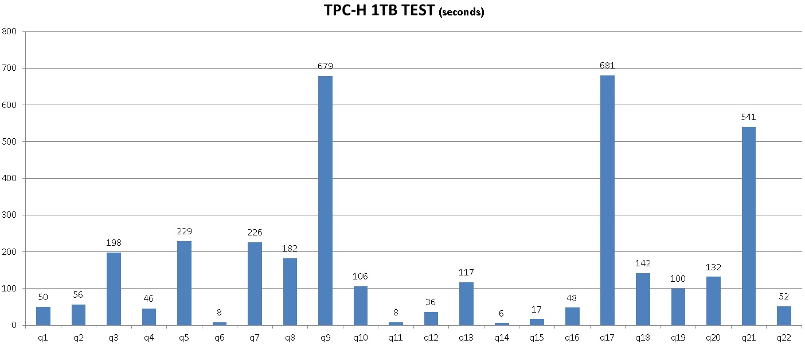

## (新零售)商户网格化运营 - 阿里云RDS PostgreSQL最佳实践  
                       
### 作者                        
digoal                       
                         
### 日期                         
2017-08-02                   
                                  
### 标签                  
PostgreSQL , PostGIS , 地理位置 , KNN , 近邻检索 , 网格检索 , polygon中心点 , 半径搜索      
                  
----                  
                   
## 背景        
伟大的马老师说：  
  
“纯电商时代很快会结束，未来的十年、二十年，没有电子商务这一说，只有新零售这一说，也就是说线上线下和物流必须结合在一起，才能诞生真正的新零售”  
  
线上是指云平台，线下是指销售门店或生产商，新物流消灭库存，减少囤货量。  
  
电子商务平台消失是指，现有的电商平台分散，每个人都有自己的电商平台，不再入驻天猫、京东、亚马逊大型电子商务平台。举例：每个人在电商平台都有自己的店铺，集中在平台下进行销售，只能在一块水池里生活，这是很局限性的。  
  
要打通线上线下、消灭库存，需要发挥数据的价值，比如通过数据预测销量。同时线上线下对接，也对数据运营产生了新的挑战，比如基于地理位置的网格化运营由来而生。  
  
  
  
## 一、需求  
1、支持基于地理位置（GIS）的快速数据检索。  
  
2、支持海量销售数据的分析、挖掘。  
  
## 二、架构设计  
  
  
1、海量的销量数据通过OSS并行进入到阿里云HybridDB for PostgreSQL数据库。  
  
2、RDS PostgreSQL负责在线事务处理，网格化运营的任意多边形圈选商户。  
  
3、ETL程序，负责数据调度。  
  
4、BI应用对接HDB for PG和PG，驱动和语法与PostgreSQL兼容。  
  
5、HybridDB for PostgreSQL提供高可用、备份的基本功能，同时提供了一键扩容的功能。用户不需要担心未来数据增长的性能压力。  
  
6、HDB PG和RDS PG可以通过OSS_EXT外部表插件，透明访问（读写）OSS的数据。OSS提供海量共享存储，RDS PG和HDB PG之间通过OSS可共享数据，同时OSS还可以作为外部海量数据来源并行导入到HDB PG的高速通道。OSS还可以作为RDS PG和HDB PG的冷数据存储。  
  
## 三、DEMO与性能  
### 1 商户网格搜索  
1、构造1亿商户地理位置数据  
  
```  
postgres=# create table pos(id int, pos point);  
CREATE TABLE  
postgres=# insert into pos select generate_series(1,100000000), point(5000-random()*10000, 5000-random()*10000);  
INSERT 0 10000000  
postgres=# select * from pos limit 10;  
 id |                  pos                    
----+---------------------------------------  
  1 | (603.396683000028,3740.25050085038)  
  2 | (4177.6926163584,4295.85348349065)  
  3 | (-2897.50102907419,4393.90230923891)  
  4 | (-2756.50105439126,2930.08491862565)  
  5 | (-1679.21951506287,-2329.10942286253)  
  6 | (2323.99420812726,-4727.32939757407)  
  7 | (-1572.33712729067,-3614.81220461428)  
  8 | (-1383.57343617827,312.93470878154)  
  9 | (-2942.08695180714,4876.54477357864)  
 10 | (-2387.8013016656,-141.320424154401)  
(10 rows)  
```  
  
2、创建空间索引  
  
```  
postgres=# create index idx_pos on pos using gist(pos);  
```  
  
3、创建查询优化函数  
  
输入任意多边形，返回落在多边形中的商户。  
  
```  
select * from pos where polygon('((10,2),(-10,-100),(0,10))') @> pos;  
```  
  
如果需要带其他条件的空间查询，可以使用空间复合分区索引（PARTIAL INDEX），例如  
  
```  
create index idx_pos on pos using gist(pos) where 分区条件1;  
...  
create index idx_pos on pos using gist(pos) where 分区条件n;  
```  
  
详见  
  
[《分区索引的应用和实践 - 阿里云RDS PostgreSQL最佳实践》](../201707/20170721_01.md)    
  
4、空间索引性能验证，一亿数据网格查询约 0.8 毫秒。   
  
```  
postgres=# explain (analyze,verbose,timing,costs,buffers)   
  
select * from pos where polygon('((10,2),(-10,-100),(0,10))') @> pos;  
  
                                                            QUERY PLAN                                                               
-----------------------------------------------------------------------------------------------------------------------------------  
 Index Scan using idx_pos on postgres.pos  (cost=0.42..123470.72 rows=100000 width=20) (actual time=0.099..0.737 rows=618 loops=1)  
   Output: id, pos  
   Index Cond: ('((10,2),(-10,-100),(0,10))'::polygon @> pos.pos)  
   Buffers: shared hit=660  
 Planning time: 0.031 ms  
 Execution time: 0.778 ms  
(6 rows)  
  
postgres=# select * from pos where polygon('((10,2),(-10,-100),(0,10))') @> pos;  
    id    |                   pos                      
----------+------------------------------------------  
 14028137 | (-9.47874505072832,-94.8515953496099)  
 43891480 | (-9.1992225497961,-92.9797394201159)  
  1247175 | (-0.888188369572163,-28.0744722113013)  
  4631961 | (-0.548232346773148,-31.1226723715663)  
  5458615 | (-1.67813152074814,-29.4832326471806)  
  6057261 | (-0.965241342782974,-24.8730508610606)  
  ......  
 72818882 | (-0.214213505387306,-38.5544309392571)  
 84374336 | (-0.350810587406158,-38.3379962295294)  
 93014418 | (1.69238075613976,-38.5063700377941)  
 94375565 | (-0.0325776636600494,-43.1329058483243)  
(618 rows)  
```  
  
### 2 数据分析性能  
数据分析能力如何呢？  
  
这里有一组单机1TB的TPC-H测试数据，HybridDB for PostgreSQL是MPP分布式数据库，可以通过增加节点线性提升性能。  
  
    
  
另外还有一些测试数据可以参考如下：  
  
[《TPC-H测试 - PostgreSQL 10 vs Deepgreen(Greenplum)》](../201707/20170714_01.md)   
  
[《100TB级, 日增量1TB(100亿)的OLTP OLAP混合场景数据库设计方向》](../201707/20170703_01.md)    
  
## 四、技术点  
1、空间索引，GiST索引是PostgreSQL独有的空间索引，支持精准的距离索引搜索，同时支持按举例远近排序返回结果。性能杠杠的，也是很多科研机构、空间业务的首选。  
  
2、KNN查询，按距离由近到远输出记录。  
  
3、OSS外部表，阿里云RDS PG和HDB PG增加的功能，与云端海量对象存储OSS打通，在数据库中以外部表的形式透明的读写OSS中的文件。可以达到每个线程约30MB/s的读写带宽，增加并发即可提高整体的吞吐。  
  
4、ETL，云端或用户的ETL程序，只要支持OSS对象连接、PG的连接协议即可。  
  
5、MADlib，是一个开源的机器学习库，支持大多数的学习库，通过RDS PG，HDB PG的SQL接口实现机器学习。  
  
MADlib支持Classification, Regression, Clustering, Topic Modeling, Association Rule Mining, Descriptive Statistics, Validation等众多挖掘模型。    
    
    
    
http://madlib.incubator.apache.org/product.html    
    
[madlib手册](http://madlib.incubator.apache.org/docs/latest/index.html)    
  
6、几何知识  
  
多边形的内切圆，circle(polygon)  
   
  
  
多边形BOX和外圆，circle(box(polygon))  
  
  
  
PG的几何函数如下  
  
https://www.postgresql.org/docs/9.6/static/functions-geometry.html  
  
PostGIS的几何函数如下  
  
http://postgis.net/docs/manual-2.3/reference.html  
  
7、以上性能测试涉及到的多边形搜索是PG 10的测试，如果你发现老版本存在空间索引的性能问题，可以用以下这个方法进行优化。  
  
首先将多边形转换为BOX，再求BOX的外圆，通过KNN索引顺序返回记录，同时过滤多边形包含的数据。  
  
```  
create or replace function ff(polygon) returns setof record as $$                                                          
declare  
  v_rec record;  
  cir circle := circle(box($1));            -- 扩散边界  
  dist float8 := radius(circle(box($1)));   -- 求多边形外圆的半径  
  centrid point := point(circle(box($1)));  -- 求多边形外圆的中心点  
begin  
  set local enable_seqscan=off;             -- 强制空间索引, KNN搜索  
  for v_rec in   
    select * from pos order by pos <-> centrid   
  loop  
    if not cir @> v_rec.pos then  
      return;  
    elsif ($1 @> v_rec.pos) then  
      return next v_rec;  
    end if;  
  end loop;  
  return;  
end;  
$$ language plpgsql strict volatile;  
```  
  
```  
postgres=# select * from ff(polygon('((10,2),(-10,-100),(0,10))')) as t(id int, pos point);  
    id    |                   pos                      
----------+------------------------------------------  
 36646218 | (-0.0167591497302055,-45.0508715584874)  
 42498944 | (0.139414332807064,-44.4842409342527)  
 83455402 | (-0.350065529346466,-44.2021945491433)  
 ......  
 10828319 | (2.18123663216829,7.54482112824917)  
 70772435 | (2.13983003050089,8.06822907179594)  
 79346114 | (2.12917104363441,8.25083814561367)  
(618 rows)  
```  
  
## 五、云端产品  
  
[阿里云 RDS PostgreSQL](https://www.aliyun.com/product/rds/postgresql)      
    
[阿里云 HybridDB for PostgreSQL](https://www.aliyun.com/product/gpdb)      
    
[阿里云 OSS](https://www.aliyun.com/product/oss)    
  
## 六、类似场景、案例  
  
[《(AR虚拟现实)红包 技术思考 - GIS与图像识别的完美结合》](../201701/20170113_01.md)    
  
[《从难缠的模糊查询聊开 - PostgreSQL独门绝招之一 GIN , GiST , SP-GiST , RUM 索引原理与技术背景》](../201612/20161231_01.md)    
  
[《时间、空间、对象多维属性 海量数据任意多维 高效检索 - 阿里云RDS PostgreSQL最佳实践》](../201707/20170722_01.md)    
  
[《空间复合索引加速空间搜索》](../201706/20170620_01.md)    
  
[《奔跑吧，大屏 - 时间+空间 实时四维数据透视》](../201704/20170413_02.md)    
  
[《视觉挖掘与PostGIS空间数据库的完美邂逅 - 广告营销\圈人》](../201703/20170328_04.md)    
  
[《PostgreSQL\GPDB 毫秒级海量时空数据透视 典型案例分享》](../201706/20170629_01.md)    
  
## 七、小结  
新零售行业，通过打通线上线下、消灭库存，需要发挥数据的价值，比如通过数据预测销量。同时线上线下对接，也对数据运营产生了新的挑战，比如基于地理位置的网格化运营由来而生。  
  
要求数据库具备：  
  
1、支持基于地理位置（GIS）的快速数据检索的能力。  
  
2、支持海量销售数据的分析、挖掘的能力。  
  
  
  
通过阿里云的RDS PostgreSQL、HybridDB for PostgreSQL、OSS，实现了亿级地理位置数据一毫秒内响应，同时支持分析、挖掘需求的全链路需求。  
  
1、海量的销量数据通过OSS并行进入到阿里云HybridDB for PostgreSQL数据库。  
  
2、RDS PostgreSQL负责在线事务处理，网格化运营的任意多边形圈选商户。  
  
3、ETL程序，负责数据调度。  
  
4、BI应用对接HDB for PG和PG，驱动和语法与PostgreSQL兼容。  
  
5、HybridDB for PostgreSQL提供高可用、备份的基本功能，同时提供了一键扩容的功能。用户不需要担心未来数据增长的性能压力。  
  
6、HDB PG和RDS PG可以通过OSS_EXT外部表插件，透明访问（读写）OSS的数据。OSS提供海量共享存储，RDS PG和HDB PG之间通过OSS可共享数据，同时OSS还可以作为外部海量数据来源并行导入到HDB PG的高速通道。OSS还可以作为RDS PG和HDB PG的冷数据存储。  
  
## 参考  
[《GIS附近查找性能优化 - PostGIS long lat geometry distance search tuning using gist knn function》](../201308/20130806_01.md)   
  
https://www.postgresql.org/docs/9.6/static/functions-geometry.html  
  
http://postgis.net/docs/manual-2.3/reference.html  
