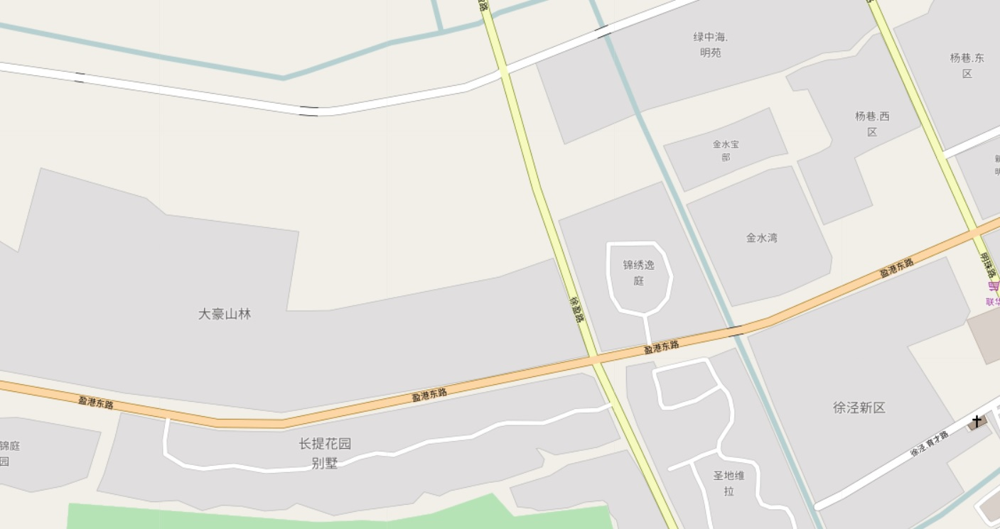
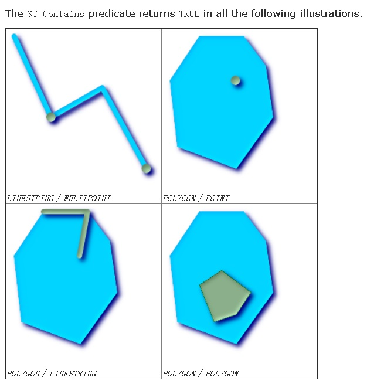
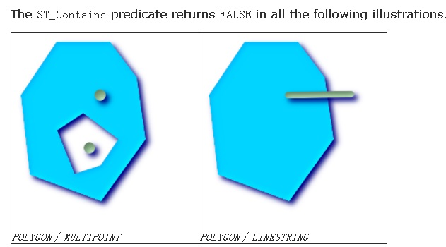

## 菜鸟末端轨迹 - 电子围栏(解密支撑每天251亿个包裹的数据库) - 阿里云RDS PostgreSQL最佳实践  
                             
### 作者                              
digoal                             
                               
### 日期                               
2017-08-03                         
                                        
### 标签                        
PostgreSQL , PostGIS , 多边形 , 面 , 点 , 面点判断 , 菜鸟         
                        
----                        
                         
## 背景     
菜鸟末端轨迹项目中涉及的一个关键需求，面面判断。    
    
在数据库中存储了一些多边形记录，约几百万到千万条记录，例如一个小区，在地图上是一个多边形。    
    
不同的快递公司，会有各自不同的多边形划分方法（每个网点负责的片区(多边形)，每个快递员负责的片区(多边形)）。    
    
用户在寄件时，根据用户的位置，查找对应快递公司负责这个片区的网点、或者负责该片区的快递员。    
    
    
    
## 一、需求    
1、在数据库中存储了一些静态的面信息，代表小区、园区、写字楼等等。所有的面不相交。    
    
2、为了支持不同的业务类型，对一个地图，可能划分为不同的多边形组成。    
    
例如不同的快递公司，会有各自不同的多边形划分方法（网点负责的片区(多边形)，某个快递员负责的片区(多边形)）。    
    
因此在一张地图上，有多个图层，每个图层的多边形划分方法可能不一样。    
    
3、快速的根据快递公司、客户的位置，求包含这个点的多边形（即得到对应快递公司负责这个片区的网点、或者负责该片区的快递员）。    
    
## 二、架构设计    
用到阿里云的RDS PostgreSQL，以及PG提供的PostGIS插件。    
    
我们需要用到PostGIS的函数有两个      
      
http://postgis.net/docs/manual-2.3/ST_Within.html      
      
1、ST_within      
      
ST_Within — Returns true if the geometry A is completely inside geometry B      
      
boolean ST_Within(geometry A, geometry B);      
      
Returns TRUE if geometry A is completely inside geometry B. For this function to make sense, the source geometries must both be of the same coordinate projection, having the same SRID. It is a given that if ST_Within(A,B) is true and ST_Within(B,A) is true, then the two geometries are considered spatially equal.      
      
This function call will automatically include a bounding box comparison that will make use of any indexes that are available on the geometries. To avoid index use, use the function _ST_Within.      
      
```      
-- a circle within a circle      
SELECT ST_Within(smallc,smallc) As smallinsmall,      
        ST_Within(smallc, bigc) As smallinbig,      
        ST_Within(bigc,smallc) As biginsmall,      
        ST_Within(ST_Union(smallc, bigc), bigc) as unioninbig,      
        ST_Within(bigc, ST_Union(smallc, bigc)) as biginunion,      
        ST_Equals(bigc, ST_Union(smallc, bigc)) as bigisunion      
FROM      
(      
SELECT ST_Buffer(ST_GeomFromText('POINT(50 50)'), 20) As smallc,      
        ST_Buffer(ST_GeomFromText('POINT(50 50)'), 40) As bigc) As foo;      
-- Result      
 smallinsmall | smallinbig | biginsmall | unioninbig | biginunion | bigisunion      
--------------+------------+------------+------------+------------+------------      
 t            | t          | f          | t          | t          | t      
(1 row)      
```      
      
2、ST_Contains      
      
ST_Contains — Returns true if and only if no points of B lie in the exterior of A, and at least one point of the interior of B lies in the interior of A.      
      
boolean ST_Contains(geometry geomA, geometry geomB);      
      
Returns TRUE if geometry B is completely inside geometry A. For this function to make sense, the source geometries must both be of the same coordinate projection, having the same SRID. ST_Contains is the inverse of ST_Within. So ST_Contains(A,B) implies ST_Within(B,A) except in the case of invalid geometries where the result is always false regardless or not defined.      
      
This function call will automatically include a bounding box comparison that will make use of any indexes that are available on the geometries. To avoid index use, use the function _ST_Contains.      
      
```      
-- A circle within a circle      
SELECT ST_Contains(smallc, bigc) As smallcontainsbig,      
           ST_Contains(bigc,smallc) As bigcontainssmall,      
           ST_Contains(bigc, ST_Union(smallc, bigc)) as bigcontainsunion,      
           ST_Equals(bigc, ST_Union(smallc, bigc)) as bigisunion,      
           ST_Covers(bigc, ST_ExteriorRing(bigc)) As bigcoversexterior,      
           ST_Contains(bigc, ST_ExteriorRing(bigc)) As bigcontainsexterior      
FROM (SELECT ST_Buffer(ST_GeomFromText('POINT(1 2)'), 10) As smallc,      
                         ST_Buffer(ST_GeomFromText('POINT(1 2)'), 20) As bigc) As foo;      
      
-- Result      
  smallcontainsbig | bigcontainssmall | bigcontainsunion | bigisunion | bigcoversexterior | bigcontainsexterior      
------------------+------------------+------------------+------------+-------------------+---------------------      
 f                | t                | t                | t          | t        | f      
      
-- Example demonstrating difference between contains and contains properly      
SELECT ST_GeometryType(geomA) As geomtype, ST_Contains(geomA,geomA) AS acontainsa, ST_ContainsProperly(geomA, geomA) AS acontainspropa,      
   ST_Contains(geomA, ST_Boundary(geomA)) As acontainsba, ST_ContainsProperly(geomA, ST_Boundary(geomA)) As acontainspropba      
FROM (VALUES ( ST_Buffer(ST_Point(1,1), 5,1) ),      
                         ( ST_MakeLine(ST_Point(1,1), ST_Point(-1,-1) ) ),      
                         ( ST_Point(1,1) )      
          ) As foo(geomA);      
      
  geomtype    | acontainsa | acontainspropa | acontainsba | acontainspropba      
--------------+------------+----------------+-------------+-----------------      
ST_Polygon    | t          | f              | f           | f      
ST_LineString | t          | f              | f           | f      
ST_Point      | t          | t              | f           | f      
```      
      
      
      
      
    
## 三、DEMO与性能    
### 1 PG内置几何类型 面点搜索 压测  
为了简化测试，采样PG内置的几何类型进行测试，用法与PostGIS是类似的。    
    
1、创建测试表    
    
```    
postgres=# create table po(id int, typid int, po polygon);    
CREATE TABLE    
```    
    
2、创建分区表或分区索引    
    
```    
create extension btree_gist;    
create index idx_po_1 on po using gist(typid, po);    
```    
    
3、创建空间排他约束，可选    
    
如果要求单个typid内的po不重叠，可以创建空间排他约束    
    
```    
create table tbl_po(id int, typid int, po polygon)    
PARTITION BY LIST (typid);    
    
CREATE TABLE tbl_po_1    
    PARTITION OF tbl_po (    
    EXCLUDE USING gist (po WITH &&)    
) FOR VALUES IN (1);    
    
...    
    
CREATE TABLE tbl_po_20    
    PARTITION OF tbl_po (    
    EXCLUDE USING gist (po WITH &&)    
) FOR VALUES IN (20);    
    
查看某分区表的空间排他约束如下    
    
postgres=# \d tbl_po_1    
             Table "postgres.tbl_po_1"    
 Column |  Type   | Collation | Nullable | Default     
--------+---------+-----------+----------+---------    
 id     | integer |           |          |     
 typid  | integer |           |          |     
 po     | polygon |           |          |     
Partition of: tbl_po FOR VALUES IN (1)    
Indexes:    
    "tbl_po_1_po_excl" EXCLUDE USING gist (po WITH &&)    
```    
    
4、写入1000万多边形测试数据    
    
```    
insert into po select id, random()*20, polygon('(('||x1||','||y1||'),('||x2||','||y2||'),('||x3||','||y3||'))') from (select id, 180-random()*180 x1, 180-random()*180 x2, 180-random()*180 x3, 90-random()*90 y1, 90-random()*90 y2, 90-random()*90 y3 from generate_series(1,10000000) t(id)) t;    
```    
    
5、测试面点判断性能    
    
查询包含point(1,1)的多边形，响应时间0.57毫秒。    
    
```    
postgres=# explain (analyze,verbose,timing,costs,buffers) select * from po where typid=1 and po @> polygon('((1,1),(1,1),(1,1))') limit 1;    
                                                           QUERY PLAN                                                              
---------------------------------------------------------------------------------------------------------------------------------  
 Limit  (cost=0.42..1.76 rows=1 width=93) (actual time=0.551..0.551 rows=1 loops=1)  
   Output: id, typid, po  
   Buffers: shared hit=74  
   ->  Index Scan using idx_po_1 on postgres.po  (cost=0.42..673.48 rows=503 width=93) (actual time=0.550..0.550 rows=1 loops=1)  
         Output: id, typid, po  
         Index Cond: ((po.typid = 1) AND (po.po @> '((1,1),(1,1),(1,1))'::polygon))  
         Rows Removed by Index Recheck: 17  
         Buffers: shared hit=74  
 Planning time: 0.090 ms  
 Execution time: 0.572 ms  
(10 rows)  
```    
    
6、压测    
    
```    
vi test.sql    
\set x random(-180,180)  
\set y random(-90,90)  
\set typid random(1,20)  
select * from po where typid=:typid and po @> polygon('((:x,:y),(:x,:y),(:x,:y))') limit 1;   
    
pgbench -M simple -n -r -P 1 -f ./test.sql -c 64 -j 64 -T 100    
transaction type: ./test.sql  
scaling factor: 1  
query mode: simple  
number of clients: 64  
number of threads: 64  
duration: 100 s  
number of transactions actually processed: 29150531  
latency average = 0.220 ms  
latency stddev = 0.140 ms  
tps = 291487.813205 (including connections establishing)  
tps = 291528.228634 (excluding connections establishing)  
script statistics:  
 - statement latencies in milliseconds:  
         0.002  \set x random(-180,180)  
         0.001  \set y random(-90,90)  
         0.000  \set typid random(1,20)  
         0.223  select * from po where typid=:typid and po @> polygon('((:x,:y),(:x,:y),(:x,:y))') limit 1;   
```    
    
**惊不惊喜、意不意外**  
  
**TPS：29万 ，平均响应时间：0.2毫秒**    
    
### 2 PostGIS空间数据库 面点搜索 压测  
阿里云 RDS PostgreSQL，HybridDB for PostgreSQL 已经内置了PostGIS空间数据库插件，使用前创建插件即可。    
    
```  
create extension postgis;  
```  
    
1、建表  
  
```  
postgres=# create table po(id int, typid int, po geometry);    
CREATE TABLE  
```  
  
2、创建空间索引  
  
```  
postgres=# create extension btree_gist;    
postgres=# create index idx_po_1 on po using gist(typid, po);    
```  
  
3、写入1000万多边形测试数据  
  
```  
postgres=# insert into po   
select   
  id, random()*20,   
  ST_PolygonFromText('POLYGON(('||x1||' '||y1||','||x2||' '||y2||','||x3||' '||y3||','||x1||' '||y1||'))')   
from   
(  
  select id, 180-random()*180 x1, 180-random()*180 x2, 180-random()*180 x3, 90-random()*90 y1, 90-random()*90 y2, 90-random()*90 y3 from generate_series(1,10000000) t(id)  
) t;  
```  
  
4、测试面点判断性能  
  
```  
postgres=# explain (analyze,verbose,timing,costs,buffers) select * from po where typid=1 and st_within(ST_PointFromText('POINT(1 1)'), po) limit 1;    
                                                         QUERY PLAN                                                            
-----------------------------------------------------------------------------------------------------------------------------  
 Limit  (cost=0.42..4.21 rows=1 width=40) (actual time=0.365..0.366 rows=1 loops=1)  
   Output: id, typid, po  
   Buffers: shared hit=14  
   ->  Index Scan using idx_po_1 on public.po  (cost=0.42..64.92 rows=17 width=40) (actual time=0.364..0.364 rows=1 loops=1)  
         Output: id, typid, po  
         Index Cond: ((po.typid = 1) AND (po.po ~ '0101000000000000000000F03F000000000000F03F'::geometry))  
         Filter: _st_contains(po.po, '0101000000000000000000F03F000000000000F03F'::geometry)  
         Rows Removed by Filter: 1  
         Buffers: shared hit=14  
 Planning time: 0.201 ms  
 Execution time: 0.389 ms  
(11 rows)  

postgres=# select id,typid,st_astext(po) from po where typid=1 and st_within(ST_PointFromText('POINT(1 1)'), po) limit 5;  
   id    | typid |                                                                       st_astext                                                                        
---------+-------+--------------------------------------------------------------------------------------------------------------------------------------------------------
 9781228 |     1 | POLYGON((0.295946141704917 0.155529817566276,16.4715472329408 56.1022255802527,172.374844718724 15.4784881789237,0.295946141704917 0.155529817566276))
  704428 |     1 | POLYGON((173.849076312035 77.8871315997094,167.085936572403 23.9897218951955,0.514283403754234 0.844541620463133,173.849076312035 77.8871315997094))
 5881120 |     1 | POLYGON((104.326644698158 44.4173073163256,3.76680867746472 76.8664212757722,0.798425730317831 0.138536808080971,104.326644698158 44.4173073163256))
 1940693 |     1 | POLYGON((0.774057107046247 0.253543308936059,126.49553722702 22.7823389600962,8.62134614959359 56.176855028607,0.774057107046247 0.253543308936059))
 3026739 |     1 | POLYGON((0.266327261924744 0.406031627207994,101.713274326175 38.6256391229108,2.88589236326516 15.3229149011895,0.266327261924744 0.406031627207994))
(5 rows)
```  
  
5、压测  
  
```  
vi test.sql  
\setrandom x -180 180  
\setrandom y -90 90  
\setrandom typid 1 20  
select * from po where typid=:typid and st_within(ST_PointFromText('POINT(:x :y)'), po) limit 1;    
  
pgbench -M simple -n -r -P 1 -f ./test.sql -c 64 -j 64 -T 120  
transaction type: Custom query  
scaling factor: 1  
query mode: simple  
number of clients: 64  
number of threads: 64  
duration: 120 s  
number of transactions actually processed: 23779817  
latency average: 0.321 ms  
latency stddev: 0.255 ms  
tps = 198145.452614 (including connections establishing)  
tps = 198160.891580 (excluding connections establishing)  
statement latencies in milliseconds:  
        0.002615        \setrandom x -180 180  
        0.000802        \setrandom y -90 90  
        0.000649        \setrandom typid 1 20  
        0.316816        select * from po where typid=:typid and st_within(ST_PointFromText('POINT(:x :y)'), po) limit 1;    
```  
    
**惊不惊喜、意不意外**    
  
**TPS：19.8万 ，平均响应时间：0.32毫秒**    
    
## 四、技术点    
    
1、空间排他约束    
    
这个约束可以用于强制记录中的多边形不相交。例如地图这类严谨数据，绝对不可能出现两个多边形相交的，否则就有领土纷争了。    
    
PostgreSQL就是这么严谨，意不意外。    
  
```
-- 例子

CREATE TABLE tbl_po_1    
    PARTITION OF tbl_po (    
    EXCLUDE USING gist (po WITH &&)    
) FOR VALUES IN (1);    
```
    
2、分区表    
    
本例中不同的快递公司，对应不同的图层，每个快递公司根据网点、快递员负责的片区(多边形)划分为多个多边形。    
    
使用LIST分区，每个分区对应一家快递公司。    
    
3、空间索引    
    
GiST空间索引，支持KNN、包含、相交、上下左右等空间搜索。    
    
效率极高。    
    
4、空间分区索引    
    
[《分区索引的应用和实践 - 阿里云RDS PostgreSQL最佳实践》](../201707/20170721_01.md)      
    
5、面面、点判断    
    
面面判断或面点判断是本例的主要需求，用户在寄包裹时，根据用户位置在数据库的一千万多边形中找出覆盖这个点的多边形。    
    
## 五、云端产品    
    
[阿里云 RDS PostgreSQL](https://www.aliyun.com/product/rds/postgresql)       
    
## 六、类似场景、案例    
    
[《PostgreSQL 物流轨迹系统数据库需求分析与设计 - 包裹侠实时跟踪与召回》](../201704/20170418_01.md)      
    
## 七、小结    
菜鸟末端轨迹项目中涉及的一个关键需求，面面判断。    
    
在数据库中存储了一些多边形记录，约几百万到千万条记录，例如一个小区，在地图上是一个多边形。    
    
不同的快递公司，会有各自不同的多边形划分方法（网点负责的片区(多边形)，某个快递员负责的片区(多边形)）。    
    
用户在寄件时，根据用户的位置，查找对应快递公司负责这个片区的网点、或者负责该片区的快递员。    
    
**使用阿里云RDS PostgreSQL，用户存放约1千万的多边形数据，单库实现了每秒29万的处理请求，单次请求平均响应时间约0.2毫秒。**    
    
惊不惊喜、意不意外。    
    
## 八、参考    
    
http://postgis.net/docs/manual-2.3/ST_Within.html      
    
[《分区索引的应用和实践 - 阿里云RDS PostgreSQL最佳实践》](../201707/20170721_01.md)   
     
  
<a rel="nofollow" href="http://info.flagcounter.com/h9V1"  ></a>  
  
  
  
  
  
  
## [digoal's 大量PostgreSQL文章入口](https://github.com/digoal/blog/blob/master/README.md "22709685feb7cab07d30f30387f0a9ae")
  
