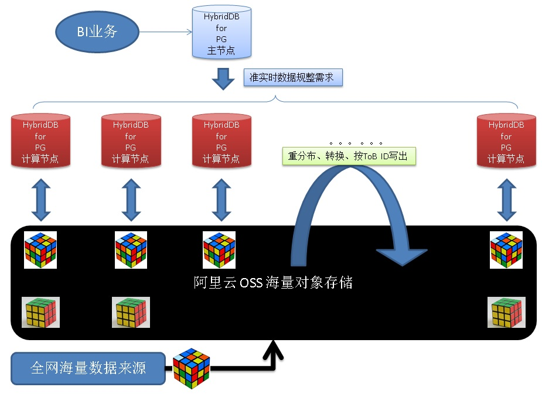

## 记录动态格式化输出(ToB日志转换业务) - 阿里云RDS PostgreSQL, HybridDB for PostgreSQL最佳实践      
                         
### 作者                          
digoal                         
                           
### 日期                           
2017-08-03                     
                                    
### 标签                    
PostgreSQL , UDF , 动态格式 , format , JOIN , OSS外部表      
                    
----                    
                     
## 背景         
有一些业务需要将数据归类动态的输出，比如一些公共日志服务，所有用户的日志都被统一的按格式记录到一起，但是每个最终用户关心的字段都不一样，甚至每个用户对数据转换的需求都不一样。      
      
      
      
比如这个业务：      
      
[《日增量万亿+级 实时分析、数据规整 - 阿里云HybridDB for PostgreSQL最佳实践》](../201707/20170726_01.md)        
      
## 一、需求      
1、可以根据ToB的用户的定义，输出不同的格式。      
      
2、每个ToB的用户，写入到一个文件或多个文件。      
      
3、一个文件不能出现两个用户的内容。      
      
其他需求见：      
      
[《日增量万亿+级 实时分析、数据规整 - 阿里云HybridDB for PostgreSQL最佳实践》](../201707/20170726_01.md)        
      
## 二、架构设计      
      
1、采用OSS存储实时载入的海量公共日志。      
      
2、采用[HybridDB for PostgreSQL](https://www.aliyun.com/product/gpdb)或[RDS PostgreSQL](https://www.aliyun.com/product/rds/postgresql)的OSS外部表接口，直接并行读取OSS的文件。      
    
3、为了防止ToB ID的数据倾斜问题，引入一个时间字段进行截断，采用 "ToB ID+截断时间" 两个字段进行重分布。    
    
为了实现自动生成截断格式，需要起一个任务，自动计算截断格式。并将格式写入一张表。    
      
4、通过HDB PG的窗口函数，按 "ToB ID+截断时间" 强制重分布。      
      
5、通过UDF，将公共日志的格式，按ToB ID对应的UDF转换为对应的格式。      
    
为了实现动态的格式需求，采用UDF，并将ToB ID对应的UDF写入一张表。    
      
6、将转换后的数据，写入OSS。自动按ToB ID切换，绝对保证每个ToB的用户，写入到一个文件或多个文件。一个文件不出现两个用户的内容。      
      
以上功能是阿里云HybridDB for PostgreSQL或RDS PostgreSQL的独有功能。      
      
## 三、DEMO与性能      
这里介绍如何动态的转换数据，其他内容请详见案例：      
      
[《日增量万亿+级 实时分析、数据规整 - 阿里云HybridDB for PostgreSQL最佳实践》](../201707/20170726_01.md)        
      
1、创建公共日志OSS外部表 - 数据来源    
    
根据domain字段的值，动态格式输出，每个domain写一个或多个文件。不同的domain绝对不能出现在同一个文件中。    
    
```    
create external table demo_source (    
UnixTime text,  -- 这个字段为unixtime,需要使用to_timestamp进行格式输出    
domain  text,    
c1 text,    
c2 text,    
c3 text,    
c4 text,    
c5 text,    
c6 int,    
c7 text,    
c8 text,    
c9 text    
)     
location('oss://xxxxx     
        dir=xxxx/xxx/xxx/xxx id=xxx    
        key=xxx bucket=xxx') FORMAT 'csv' (QUOTE '''' ESCAPE ''''   DELIMITER ',')    
LOG ERRORS SEGMENT REJECT LIMIT 10000    
;    
```    
    
2、写入一批测试数据，根据对应的CSV格式，将文件写入OSS对应的dir/bucket中。      
    
3、创建公共日志OSS外部表 - 动态格式输出    
    
```    
create WRITABLE external table demo_output (    
rn int8,   -- 输出到OSS时，忽略该字段  
domain_and_key  text,   -- 输出到OSS时，忽略该字段  
Data  text    
)     
location('oss://xxxxx    
        dir=xxxx/xxx/xxx/xxx id=xxx id=xxx    
        key=xxx bucket=xxx distributed_column=domain_and_key') FORMAT 'csv'     
DISTRIBUTED BY (domain_and_key)    
;    
```    
    
将按domain_and_key字段值的不同，自动将Data字段的数据写入对应的OSS文件。实现数据的重规整。（domain_and_key字段不写入OSS文件。）    
    
这是阿里云HybridDB for PG的定制功能。    
    
4、创建domain的时间格式化表。    
    
```    
create table domain_tsfmt(    
  domain text,    
  tsfmt text    
);    
```    
    
根据domain的count(*)，即数据量的多少，决定使用的时间截断格式，（yyyy, yyyymm, yyyymmdd, yyyymmddhh24, yyyymmddhh24miss）    
    
越大的domain，需要越长(yyyymmhh24miss)的截断。    
    
业务方可以来维护这个表，例如一天生成一次。    
    
对于很小的domain，不需要写入这张表，可以采用统一格式，例如0000。    
    
```    
insert into domain_tsfmt values ('domain_a', 'yyyymmhh24');    
insert into domain_tsfmt values ('domain_b', 'yyyymmhh24mi');    
```    
    
5、创建UDF元信息表，存储每个ToB ID对应的UDF名字      
      
```      
create table domain_udf(domain text, udf name);      
```      
      
6、创建UDF，需要定制格式的ToB ID，创建对应的UDF      
      
PostgreSQL 例子    
    
建议用format。    
    
```      
create or replace function f1(demo_source) returns text as $$      
  select format('domain: %L , c2: %L , c4: %L', $1.domain, $1.c2, $1.c4);      
$$ language sql strict;      
      
create or replace function f2(demo_source) returns text as $$      
declare      
  res text := format('%L , %L, %L', upper($1.c2), $1.c4, $1.c3);      
begin      
  return res;      
end;      
$$ language plpgsql strict;      
```      
    
HybridDB for PostgreSQL 例子    
    
```    
create or replace function f1(demo_source) returns text as $$      
  select 'domain: '||$1.domain||' , c2: '||$1.c2||' , c4: '||$1.c4;      
$$ language sql strict;      
      
create or replace function f2(demo_source) returns text as $$      
  select upper($1.c2)||' , '||$1.c4||' , '||$1.c3;      
$$ language sql strict;     
    
create or replace function f3(demo_source) returns text as $$      
  select upper($1.c2)||' , '||$1.c4||' , '||$1.c9;      
$$ language sql strict;     
```    
      
7、创建动态UDF，根据输入，动态调用对应的UDF      
      
```      
create or replace function ff(domain_source, name) returns text as $$      
declare      
  sql text := 'select '||quote_ident($2)||'('||quote_literal($1)||')';      
  res text;      
begin      
  execute sql into res;      
  return res;      
end;      
$$ language plpgsql strict;      
    
-- 由于hdb版本太老，不支持format，不支持record和text互转，不支持quote_literal(record)。    
-- 调整如下    
    
create or replace function ff(domain_source, name) returns text as $$      
declare      
  sql text := 'select '||quote_ident($2)||'($abc_abc_abc$'||textin(record_out($1))||'$abc_abc_abc$)';      
  res text;      
begin      
  execute sql into res;      
  return res;      
end;      
$$ language plpgsql strict;      
```      
      
8、写入UDF映射，例如1-100的domain，使用F1进行转换，0的ID使用F2进行转换。      
      
```      
insert into domain_udf select 'domain_'||generate_series(1,100), 'f1';      
insert into domain_udf values ('domain_0', 'f2');      
```      
    
不在这里的DOMAIN，采用默认UDF转换格式，例如f3。    
      
9、根据 "domain + 时间截断" 重分发，根据UDF动态转换查询如下：      
      
```      
select domain_and_key, data from   
(  
select row_number() over (partition by domain||key order by domain,key) as RN, domain||key as domain_and_key, data from    
-- partition by的窗口与第二个字段domain||key（目标表的分布键）保持一致，确保只需要重分发一次  
(    
  select     
    t1.domain,   
    (case when t2.* is null then '0000' else to_char(to_timestamp(t1.UnixTime::text::float8), t2.tsfmt) end) as key,     
    ff(t1, (case when t3.* is null then 'f3' else t3.udf end)) as data  
  from domain_source t1     
    left join domain_tsfmt t2 using (domain)     
    left join domain_udf t3 using (domain)    
) t    
) t  
;    
```    
  
阿里云HDB FOR PG将自动根据OSS目标外部表中定义的distributed_column参数，当VALUE发生变化时，自动写新文件，从而实现不同的DOMAIN VALUE，写到不同的文件中。  
      
10、将规整后的数据输出到OSS    
      
```    
insert into domain_output    
select domain_and_key, data from   
(  
select row_number() over (partition by domain||key order by domain,key) as RN, domain||key as domain_and_key, data from    
-- partition by的窗口与第二个字段domain||key（目标表的分布键）保持一致，确保只需要重分发一次  
(    
  select     
    t1.domain,   
    (case when t2.* is null then '0000' else to_char(to_timestamp(t1.UnixTime::text::float8), t2.tsfmt) end) as key,     
    ff(t1, (case when t3.* is null then 'f3' else t3.udf end)) as data  
  from domain_source t1     
    left join domain_tsfmt t2 using (domain)     
    left join domain_udf t3 using (domain)    
) t    
) t  
;    
  
执行计划  
只需要重分布一次  
  
                                                               QUERY PLAN                                                                  
-----------------------------------------------------------------------------------------------------------------------------------------  
 Insert (slice0; segments: 3)  (rows=333334 width=64)  
   ->  Subquery Scan t  (cost=375072.68..395072.68 rows=333334 width=64)  
         ->  Window  (cost=375072.68..385072.68 rows=333334 width=96)  
               Partition By: domain_and_key  
               Order By: domain_and_key      
	       -- 有按目标列排序，所以OSS切换文件没有问题  
	       -- 注意同一个domain的不同时间的数据，可能会切成多个文件  
	       -- 如果想让同一个domain的数据，切到一个文件中，那么请使用domain, key作为窗口分组，同时OSS外表的实现上需要修改一下，忽略两个列。  
               ->  Sort  (cost=375072.68..377572.68 rows=333334 width=96)  
                     Sort Key: domain_and_key  
                     ->  Redistribute Motion 3:3  (slice3; segments: 3)  (cost=12.84..86770.34 rows=333334 width=96)  
		     -- 重分布一次。采用窗口函数，强制了重分布  
                           Hash Key: domain_and_key  
                           ->  Subquery Scan t  (cost=12.84..66770.34 rows=333334 width=96)  
                                 ->  Hash Left Join  (cost=12.84..54270.34 rows=333334 width=237)  
                                       Hash Cond: t1.domain = t2.domain  
                                       ->  Hash Left Join  (cost=11.75..24261.75 rows=333334 width=192)  
                                             Hash Cond: t1.domain = t3.domain  
                                             ->  External Scan on domain_source t1  (cost=0.00..11000.00 rows=333334 width=96)  
                                             ->  Hash  (cost=8.00..8.00 rows=100 width=105)  
                                                   ->  Broadcast Motion 3:3  (slice1; segments: 3)  (cost=0.00..8.00 rows=100 width=105)  
                                                         ->  Seq Scan on domain_udf t3  (cost=0.00..4.00 rows=34 width=105)  
                                       ->  Hash  (cost=1.05..1.05 rows=1 width=61)  
                                             ->  Broadcast Motion 3:3  (slice2; segments: 3)  (cost=0.00..1.05 rows=1 width=61)  
                                                   ->  Seq Scan on domain_tsfmt t2  (cost=0.00..1.01 rows=1 width=61)  
(21 rows)  
```    
    
### 简化DEMO （不依赖OSS，仅仅演示）    
1、创建公共日志表      
      
```      
create table t1 (tid int, c1 text, c2 text, c3 int, c4 timestamp, c5 numeric);      
```      
      
2、写入一批测试数据      
      
```      
insert into t1 select random()*100, md5(random()::text), 'test', random()*10000, clock_timestamp(), random() from generate_series(1,1000000);      
```      
    
3、创建目标表    
    
```    
create table t1_output (rn int8, fmt text, data text);    
```    
      
4、创建UDF元信息表，存储每个ToB ID对应的UDF名字      
      
```      
create table t2(tid int, udf name);      
```      
      
5、创建UDF，需要定制格式的ToB ID，创建对应的UDF      
      
```      
create or replace function f1(t1) returns text as $$      
  select 'tid: '||$1.tid||' , c2: '||$1.c2||' , c4: '||$1.c4;      
$$ language sql strict;      
      
create or replace function f2(t1) returns text as $$       
  select $1.tid||' , '||upper($1.c2)||' , '||$1.c4||' , '||$1.c3;      
$$ language sql strict;      
    
create or replace function f3(t1) returns text as $$       
  select $1.tid||' , '||upper($1.c2)||' , '||$1.c3||' , '||$1.c3;      
$$ language sql strict;      
```      
    
默认采用f3()函数。    
      
6、创建动态UDF，根据输入，动态调用对应的UDF      
      
```      
create or replace function ff(t1, name) returns text as $$      
declare      
  sql text := 'select '||quote_ident($2)||'($abc_abc_abc$'||textin(record_out($1))||'$abc_abc_abc$)';      
  res text;      
begin      
  execute sql into res;      
  return res;      
end;      
$$ language plpgsql strict;      
```      
      
7、写入UDF映射，例如1-10的ID，使用F1进行转换，0的ID使用F2进行转换。      
      
```      
insert into t2 select generate_series(1,10), 'f1';      
insert into t2 values (0, 'f2');      
```      
      
8、创建格式表    
    
```    
create table t1_fmt (tid int, fmt text);    
    
insert into t1_fmt values (1, 'yyyymm');    
insert into t1_fmt values (2, 'yyyy');    
```    
    
默认采样'0000'的格式。    
    
9、动态转换查询如下：      
      
```      
select tid_key, data from  
(  
select row_number() over (partition by tid||key order by key) as RN, tid||key as tid_key, data from    
(    
  select     
    t1.tid,     
    (case when t2.* is null then '0000' else to_char(t1.c4, t2.fmt) end) as key,   
    ff(t1, (case when t3.* is null then 'f3' else t3.udf end)) as data  
  from t1     
    left join t1_fmt t2 using (tid)     
    left join t2 t3 using (tid)    
) t    
) t  
;    
```      
      
10、将规整后的数据输出到目标表    
    
```    
insert into t1_output    
select tid_key, data from  
(  
select row_number() over (partition by tid||key order by key) as RN, tid||key as tid_key, data from    
(    
  select     
    t1.tid,     
    (case when t2.* is null then '0000' else to_char(t1.c4, t2.fmt) end) as key,   
    ff(t1, (case when t3.* is null then 'f3' else t3.udf end)) as data  
  from t1     
    left join t1_fmt t2 using (tid)     
    left join t2 t3 using (tid)    
) t    
) t    
;    
    
INSERT 0 1000000    
  
  
postgres=# select * from t1_output  limit 100;    
   fmt   |                        data                           
---------+-----------------------------------------------------  
 870000  | 87 , TEST , 7108 , 7108  
 870000  | 87 , TEST , 787 , 787  
 870000  | 87 , TEST , 6748 , 6748  
 870000  | 87 , TEST , 6385 , 6385  
 870000  | 87 , TEST , 5278 , 5278  
 870000  | 87 , TEST , 8132 , 8132  
 870000  | 87 , TEST , 7513 , 7513  
 870000  | 87 , TEST , 2025 , 2025  
 870000  | 87 , TEST , 7322 , 7322  
 870000  | 87 , TEST , 2019 , 2019  
 870000  | 87 , TEST , 6416 , 6416  
 870000  | 87 , TEST , 9959 , 9959  
 870000  | 87 , TEST , 7876 , 7876  
 870000  | 87 , TEST , 5022 , 5022  
.....  
  
写OSS外部表时，根据fmt列的VALUE进行识别，当遇到不同的VALUE就切换文件名，不同FMT VALUE的数据写入不同的文件。  
```    
    
## 四、技术点      
这里只谈本文涉及的技术点。      
      
1、UDF      
      
PostgreSQL支持多种UDF语言（例如C，plpgsql, sql, plpython, pljava, plv8, ......），用户通过UDF定义需要转换的格式。      
      
2、动态调用      
      
用户通过动态调用，可以动态的调用对应的UDF，在一个请求中生成不同的格式。      
      
## 五、云端产品      
      
[阿里云 RDS PostgreSQL](https://www.aliyun.com/product/rds/postgresql)          
        
[阿里云 HybridDB for PostgreSQL](https://www.aliyun.com/product/gpdb)          
        
[阿里云 OSS](https://www.aliyun.com/product/oss)        
      
## 六、类似场景、案例      
[《日增量万亿+级 实时分析、数据规整 - 阿里云HybridDB for PostgreSQL最佳实践》](../201707/20170726_01.md)        
      
## 七、小结      
一些公共日志服务，所有用户的日志都被统一的按格式记录到一起，但是每个最终用户关心的字段都不一样，甚至每个用户对数据转换的需求都不一样。      
      
PostgreSQL支持多种UDF语言（例如C，plpgsql, sql, plpython, pljava, plv8, ......），用户通过UDF定义需要转换的格式。      
      
用户通过动态调用，可以动态的调用对应的UDF，在一个请求中生成不同的格式。      
         
## 八、参考      
[《日增量万亿+级 实时分析、数据规整 - 阿里云HybridDB for PostgreSQL最佳实践》](../201707/20170726_01.md)     
  
<a rel="nofollow" href="http://info.flagcounter.com/h9V1"  ></a>  
  
  
  
  
  
  
## [digoal's 大量PostgreSQL文章入口](https://github.com/digoal/blog/blob/master/README.md "22709685feb7cab07d30f30387f0a9ae")
  
