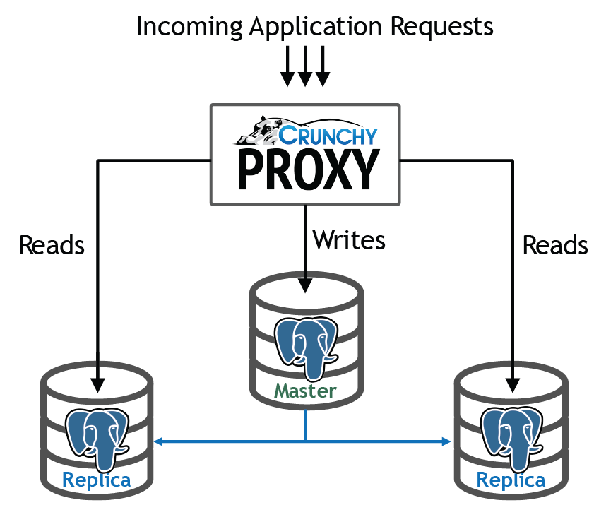

## PostgreSQL 读写分离代理 - Crunchy Proxy(base on golang)  
    
### 作者    
digoal      
     
### 日期    
2017-08-07    
    
### 标签     
PostgreSQL , 读写分离 , proxy , 高效 , golang    
     
----     
      
## 背景   
数据库管理员有几个非常常见的问题需要解决：连接池、HA、容灾、读写分离、sharding、MPP、备份、恢复。  
  
1、虽然很多框架都支持本地连接池，但是别忘了APP大多数是无状态的，通常在搞活动前还可能扩容，增加APP的组数，为了防止雪崩或者连接不足，建议中间还可以加一层连接池。例如pgpool, pgbouncer，都是非常成熟的PG连接池。  
  
https://pgbouncer.github.io/  
  
http://www.pgpool.net/  
  
2、HA，有基于共享存储的解决方案，有基于流复制的解决方案。  
  
互联网行业，基于流复制的解决方案很常见，要做到0数据丢失，建议使用同步流复制模式，使用至少2个备节点。  
  
[《PostgreSQL 10 流式物理、逻辑主从 最佳实践》](../201707/20170711_01.md)    
  
3、容灾是为了解决机房级故障、地域级故障的问题，除了数据库，应用也需要具备容灾的能力。  
  
PostgreSQL使用流式复制，很容易实现异地容灾。案例如下  
  
[《PostgreSQL 最佳实践 - 块级增量备份(ZFS篇)方案与实战》](../201608/20160823_05.md)    
  
[《PostgreSQL 最佳实践 - 块级增量备份(ZFS篇)备份集自动校验》](../201608/20160823_06.md)    
  
[《PostgreSQL 最佳实践 - 块级增量备份(ZFS篇)单个数据库采用多个zfs卷(如表空间)时如何一致性备份》](../201608/20160823_07.md)    
  
[《PostgreSQL 最佳实践 - 块级增量备份(ZFS篇)双机HA与块级备份部署》](../201608/20160823_08.md)    
  
[《PostgreSQL 最佳实践 - 块级增量备份(ZFS篇)验证 - recovery test script for zfs snapshot clone + postgresql stream replication + archive》](../201608/20160823_09.md)    
  
4、备份与恢复，PostgreSQL支持块级增量备份、任意时间点恢复。  
  
[《PostgreSQL 最佳实践 - 任意时间点恢复源码分析》](../201608/20160823_04.md)    
  
[《PostgreSQL 最佳实践 - 在线增量备份与任意时间点恢复》](../201608/20160823_03.md)    
  
[《PostgreSQL 最佳实践 - 块级别增量备份(pg_rman baseon LSN)源码浅析与使用》](../201608/20160826_01.md)    
  
[《PostgreSQL 最佳实践 - pg_rman 以standby为源的备份浅析》](../201608/20160829_02.md)    
  
[《PostgreSQL 最佳实践 - pg_rman 数据库恢复示例 与 软件限制解说》](../201608/20160829_03.md)    
  
5、sharding、MPP  
  
sharding 和MPP是在你的数据库达到一定的规模和瓶颈后可能需要面临的问题（建议大多数时候还是远离sharding。看看ORACLE单机支撑了这么大的市场就知道，OLTP场景大多数时候单机够了。OLAP才需要MPP）  
  
5\.1 纯OLTP场景  
  
有两种sharding方法，plproxy(函数式SQL代理) 和 postgres_fdw (外部表方式sharding)。  
  
[《PostgreSQL 最佳实践 - 水平分库(基于plproxy)》](../201608/20160824_02.md)    
  
[《A Smart PostgreSQL extension plproxy 2.2 practices》](../201110/20111025_01.md)    
  
[《使用Plproxy设计PostgreSQL分布式数据库》](../201005/20100511_01.md)    
  
[《阿里云ApsaraDB RDS for PostgreSQL 最佳实践 - 2 教你RDS PG的水平分库》](../201512/20151220_02.md)    
  
[《阿里云ApsaraDB RDS for PostgreSQL 最佳实践 - 3 水平分库 vs 单机 性能》](../201512/20151220_03.md)    
  
[《阿里云ApsaraDB RDS for PostgreSQL 最佳实践 - 4 水平分库 之 节点扩展》](../201512/20151220_04.md)    
  
[《PostgreSQL 9.6 sharding + 单元化 (based on postgres_fdw) 最佳实践 - 通用水平分库场景设计与实践》](../201610/20161005_01.md)    
  
5\.2 客户端级sharding   
  
目前java和go的客户端sharding包如下  
  
https://github.com/dangdangdotcom/sharding-jdbc  
  
https://github.com/go-pg/sharding  
  
5\.2 OLTP+OLAP混合场景  
  
混合场景是应用最广泛的，TP和AP需求比较均衡时建议考虑。有两个产品实现了TP+AP的融合。  
  
https://github.com/citusdata/citus  
  
https://git.postgresql.org/gitweb/?p=postgres-xl.git;a=summary  
  
5\.3 纯OLAP场景  
  
Greenplum 开源版本 GPDB  
  
https://github.com/greenplum-db/gpdb  
  
5\.4 类RAC架构  
  
存储层sharding，上层读写分离。代表产品是AWS Aurora for PostgreSQL。  
  
https://aws.amazon.com/cn/rds/aurora/?nc2=h_m1  
  
6、读写分离  
  
目前读写分离实际上也分两种解决方案，一种是客户端级读写分离，一种是中间件级。  
  
客户端级解决方案例如libqp, jdbc驱动，都支持配置多个连接地址，支持loadbalance。  
  
[《PostgreSQL 10.0 preview 功能增强 - libpq支持多主机连接(failover,LB)让数据库HA和应用配合更紧密》](../201704/20170420_01.md)    
  
中间件级，对客户端透明，但是多一跳，效率有所下降。  
  
中间件也分两种，一种是带sql parser功能的，另一种是不带sql parser功能的。  
  
pgpool-ii是带sql parser功能的读写分离中间件，同时它还支持HA等功能。功能很齐备。  
  
[《PostgreSQL 最佳实践 - 读写分离》](../201608/20160824_03.md)    
  
本文即将介绍的是不带sql parser功能的读写分离中间件Crunchy Proxy，好处是RT损耗更小，具备基本的读写分离功能。  
  
Test	|Proxy	|No-Proxy	|Overhead  
---|---|---|---  
Single SQL Statement | 2.240026ms | 2.085424ms | +0.154602ms  
  
## PostgreSQL 协议介绍  
作为一款中间件产品，虽然没有做SQL Parser，但是要做到与客户端的正常对接，基本的客户端认证，包转发还是需要的。所以有必要了解一下PG的通信协议。  
  
[Postgres on the wire - A look at the PostgreSQL wire protocol](20170806_01_pdf_001.pdf)    
  
注意，目前Crunchy Proxy并不支持libpq,jdbc的所有API。  
  
## Crunchy Proxy架构  
    
  
Crunchy Proxy在客户端和数据库的中间，接收客户端请求，将写请求转发给主库，将读请求随机的发给备库。  
  
记录做sql parser，怎么知道读请求和写请求呢？Crunchy Proxy通过HINT来判断读写请求。  
  
读请求：  
  
```  
/* read */ select now();  
```  
  
凡是没有带这个HINT的都是写请求，统一发给主库。  
  
## Crunchy Proxy安装  
请参考  
  
https://github.com/CrunchyData/crunchy-proxy/blob/master/docs/crunchy-proxy-user-guide.asciidoc  
  
简单步骤如下  
  
1、安装golang (例子 for el6)  
  
https://www.rpmfind.net/linux/rpm2html/search.php?query=golang-src&submit=Search+...&system=&arch=  
  
```  
#rpm -ivh golang-1.7.6-1.el6.x86_64.rpm golang-bin-1.7.6-1.el6.x86_64.rpm golang-src-1.7.6-1.el6.noarch.rpm   
```  
  
2、GOROOT and GOPATH  
  
```  
export GOPATH=/home/digoal/go  
export GOPATH=/home/digoal/go  
  
$go env  
GOARCH="amd64"  
GOBIN=""  
GOEXE=""  
GOHOSTARCH="amd64"  
GOHOSTOS="linux"  
GOOS="linux"  
GOPATH="/home/digoal/go"  
GORACE=""  
GOROOT="/usr/lib/golang"  
GOTOOLDIR="/usr/lib/golang/pkg/tool/linux_amd64"  
CC="gcc"  
GOGCCFLAGS="-fPIC -m64 -pthread -fmessage-length=0 -fdebug-prefix-map=/tmp/go-build598595709=/tmp/go-build"  
CXX="g++"  
CGO_ENABLED="1"  
```  
  
3、获取源码，国内访问可能有点问题  
  
```  
go get -d -u github.com/crunchydata/crunchy-proxy  
```  
  
4、安装go打包软件：glide  
  
https://github.com/Masterminds/glide  
  
https://github.com/Masterminds/glide#install  
  
```  
mkdir $GOPATH/bin  
curl https://glide.sh/get | sh  
  
  
  
100 3344k  100 3344k    0     0   433k      0  0:00:07  0:00:07 --:--:--  806k  
glide version v0.12.3 installed successfully  
```  
  
5、编译安装crunchy-proxy  
  
```  
cd $GOPATH/src/github.com/crunchydata/crunchy-proxy  
  
make  
```  
  
6、编译crunchy-proxy文档  
  
```  
make docs  
```  
     
## Crunchy Proxy用法  
### crunchy-proxy命令用法  
1、启动，启动后会监听两个端口，一个端口接收来自PG客户端的请求，另一个接收管理Crunchy Proxy的请求。  
  
Start an instance of the proxy.  
  
```  
1. The proxy is a golang binary, you execute it as follows:  
  
$> crunchy-proxy start --config=config.yaml  
  
  
2. To run the proxy at different logging output levels:  
  
$> crunchy-proxy start --config=config.yaml --log-level=<level>  
  
Where <level> is one of the following:  
  
debug  
  
info  
  
error  
  
fatal  
```  
  
Options:  
  
| Option | Default | Description   
---|---|---
| --config | /etc/crunchy-proxy/config.yaml | the path to the proxy's configuration file  
| --background | false | run the proxy in the background  
| --log-level | info | the logging level  
  
2、停止，向管理端口发请求  
  
Stop an instance of the proxy. This command can take optional parameters to  
specify the host and port of the target proxy to stop.   
  
```  
$> crunchy-proxy stop  
```  
  
Options:  
  
| Option | Default | Description  
---|---|---
| --host | localhost | the host address of the proxy's admin server  
| --port | 8000 | the host port of the proxy's admin server  
  
3、健康检查，向管理端口发请求  
  
Show the health of the nodes configured for an instance of the proxy. The  
command can take optional paramters to specify the host and port of the target  
proxy.  
  
```
$> crunchy-proxy health  
```
  
Options:  
  
| Option | Default | Description  
---|---|---
| --host | localhost | the host address of the proxy's admin server  
| --port | 8000 | the host port of the proxy's admin server  
| --format | plain | the format of the results of the command. Valid formats are 'plain' and 'json'  
  
4、节点信息，向管理端口发请求  
  
Show information about the nodes that are configured for an instance of the  
proxy. This command can take optional parameters to specify the host and port  
of the target proxy.  
  
```
$> crunchy-proxy node  
```
  
| Option | Default | Description  
---|---|---
| --host | localhost | the host address of the proxy's admin server  
| --port | 8000 | the host port of the proxy's admin server  
| --format | plain | the format of the results. Valid formats are 'plain' and  'json'  
  
5、状态，向管理端口发请求  
  
Show statistics information about the proxy. This command can take optional  
parameters to specify the host and port of the target proxy.  
  
```
$> crunchy-proxy stats  
```
  
|  Option | Default | Description  
---|---|---
| --host | localhost | the host address of the proxy's admin server  
| --port | 8000 | the host port of the proxy's admin server  
| --format | plain | the format of the results. Valid formats are 'plain' and  'json'  
  
6、版本，向管理端口发请求  
  
Show version information about the proxy. This command can take optional parameters to specify the host and port of the target proxy.  
  
```
$> crunchy-proxy version  
```
  
|  Option | Default | Description  
---|---|---
| --host | localhost | the host address of the proxy's admin server  
| --port | 8000 | the host port of the proxy's admin server  
  
### 配置文件  
  
The proxy configuration is controlled by a single configuration file which  
is written in YAML format.  
  
The YAML file is read at startup and is currently not reloaded after  
execution starts.  
  
Configuration sections:  
  
1、proxy的管理端口和PG代理端口的配置  
  
| Parameter | Description  
---|---
| proxy:hostport | the host:port that the proxy server will listen to  
| admin:hostport | the host:port that the proxy admin server will listen to  
  
Example  
  
```
server:  
  proxy:  
    hostport: localhost:5432  
  admin:  
    hostport: localhost:8000  
```
  
2、后端数据库配置  
  
| Parameter | Description  
---|---
| _<node>_:hostport | the host:port of the <node>  
| _<node>_:role | the role of the _<node>_, valid values are 'master' and 'replica'  
| _<node>_:metadata | _not implemented_  
  
Where _<node>_ is the name given to the node.  
  
```
nodes:  
  master:  
    hostport: 192.168.0.100:5432  
    role: master  
    metadata: {}  
  replica1:  
    hostport: 192.168.0.101:5432  
    role: replica  
    metadata: {}  
```
  
3、认证配置  
   
| Parameter | Description  
---|---
| username | the username for the pool connections  
| database | the database for the pool connections  
| password | the password for the pool connections  
| options | connection string options other than those listed above   
| ssl:enable | enable SSL connections  
| ssl:sslmode | the SSL mode for establishing pool connections  
  
4、连接池，每个后端数据库几个链接。  
  
| Parameter | Description  
---|---
| capacity | the number of pool connections to create for each node configured  
  
Example  
  
```
pool:  
  capacity: 2  
```
  
5、健康检查配置  
  
| Parameter | Description  
---|---
| delay | seconds to delay between health checks  
| query | SQL to user for the health check  
  
```
healthcheck:  
   delay: 60  
   query: select now();  
```
  
### SQL转发  
目前crunchy-proxy支持3个HINT。  
  
1、读请求  
  
```  
/* read */ select from foo.....  
```  
  
实际上不管SQL是读还是写，只判断有没有``` /* read */ ```这个HINT。因此写请求也可以均衡的分发给slave节点。  
  
2、写请求  
  
没有HINT时，所有的请求都发给主节点。  
  
3、事务  
  
将start, finish两个HINT之间的所有请求发给同一个节点。  
  
发给主节点  
  
```  
/* start */ begin;  
select .....;  
/* finish */ commit;  
```  
  
发给同一个备节点  
  
```  
/* start,read */ begin;  
select .....;  
/* finish */ commit;  
```  
  
### 管理Proxy  
通过REST API，向管理端口发送请求，管理PROXY.  
  
1、事件  
  
Events like a healthcheck status are published to any subscribers using a streaming REST API, you can access the admin events as follows:  
  
```  
curl -i http://localhost:10000/api/stream  
```  
  
As the proxy publishes events, your REST client (e.g. curl) will receive the events.  
  
2、当前配置  
  
You can get the current configuration of the proxy as follows:  
  
```  
curl http://localhost:10000/api/config  
```  
  
3、统计信息  
  
You can get the current statistics of the proxy as follows:  
  
```  
curl http://localhost:10000/api/stats  
```  
  
## Crunchy Proxy应用场景  
  
## 小结  
Crunchy Proxy目前的版本支持如下功能：  
  
1、通过HINT，支持将写请求发给主节点，读请求均衡的发给备节点。  
  
2、通过JSON文件配置PROXY。  
  
3、支持PG的健康检查，配置文件支持检查间隔，检查的SQL语句。  
  
4、请求只会发给健康的PG节点。  
  
5、支持REST管理接口。  
  
6、支持连接池，目前连接池为固定个数，启动时指定。为语句级连接池。  
  
7、支持SSL认证和连接。  
  
8、目前一个PROXY仅支持一对user+db。如果要支持多对，需要启动多个PROXY。  
  
## 参考  
  
https://github.com/CrunchyData/crunchy-proxy  
  
https://github.com/CrunchyData/crunchy-proxy/blob/master/docs/crunchy-proxy-user-guide.asciidoc  
  
https://github.com/dangdangdotcom/sharding-jdbc  
  
https://github.com/go-pg/sharding  
  
http://www.pgpool.net/mediawiki/index.php/Main_Page  
    
  
<a rel="nofollow" href="http://info.flagcounter.com/h9V1"  ></a>  
  
  
  
  
  
  
## [digoal's 大量PostgreSQL文章入口](https://github.com/digoal/blog/blob/master/README.md "22709685feb7cab07d30f30387f0a9ae")
  
