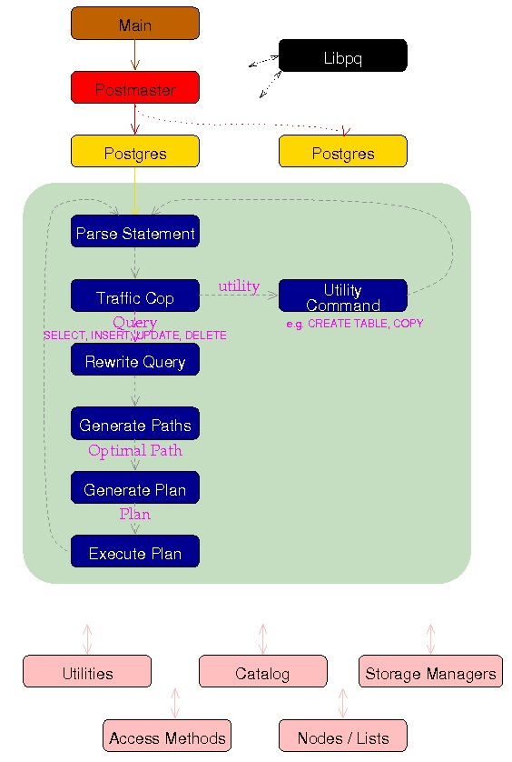

## PostgreSQL SQL防火墙  
      
### 作者      
digoal        
       
### 日期      
2017-08-07      
      
### 标签       
PostgreSQL , SQL防火墙 , 注入 , HOOK      
       
----       
        
## 背景     
SQL注入通常是业务层做的事情，例如使用绑定变量，使用关键字过滤等手段，避免被SQL注入。  
  
另一方面，数据库也有类似的功能，例如SQL防火墙。  
  
PostgreSQL内置了很多的HOOK，这些HOOK可以方便开发者加入一些功能，例如在SQL parser阶段的HOOK，可以加入一些SQL统计，SQL篡改，SQL REWRITE的功能。  
  
在SQL执行阶段的HOOK，可以用来拒绝执行等。  
  
共享内存分配阶段的HOOK，可以用来分配用户自定义进程的共享内存等。  
  
SQL_FIREWALL是PostgreSQL的一个SQL防火墙插件，利用了一些HOOK，实现了SQL防火墙的功能。  
  
```  
/* Saved hook values in case of unload */  
static shmem_startup_hook_type prev_shmem_startup_hook = NULL;  
static post_parse_analyze_hook_type prev_post_parse_analyze_hook = NULL;  
static ExecutorStart_hook_type prev_ExecutorStart = NULL;  
static ExecutorRun_hook_type prev_ExecutorRun = NULL;  
static ExecutorFinish_hook_type prev_ExecutorFinish = NULL;  
static ExecutorEnd_hook_type prev_ExecutorEnd = NULL;  
static ProcessUtility_hook_type prev_ProcessUtility = NULL;  
```  
  
1、shmem_startup_hook_type 内部进程通信  
  
src/backend/storage/ipc/ipci.c  
  
```  
/*  
 * CreateSharedMemoryAndSemaphores  
 *              Creates and initializes shared memory and semaphores.  
 *  
 * This is called by the postmaster or by a standalone backend.  
 * It is also called by a backend forked from the postmaster in the  
 * EXEC_BACKEND case.  In the latter case, the shared memory segment  
 * already exists and has been physically attached to, but we have to  
 * initialize pointers in local memory that reference the shared structures,  
 * because we didn't inherit the correct pointer values from the postmaster  
 * as we do in the fork() scenario.  The easiest way to do that is to run  
 * through the same code as before.  (Note that the called routines mostly  
 * check IsUnderPostmaster, rather than EXEC_BACKEND, to detect this case.  
 * This is a bit code-wasteful and could be cleaned up.)  
 *  
 * If "makePrivate" is true then we only need private memory, not shared  
 * memory.  This is true for a standalone backend, false for a postmaster.  
 */  
void  
CreateSharedMemoryAndSemaphores(bool makePrivate, int port)  
{  
...  
  
        /*  
         * Now give loadable modules a chance to set up their shmem allocations  
         */  
        if (shmem_startup_hook)  
                shmem_startup_hook();  
}  
```  
  
2、parser hook  
  
src/backend/parser/analyze.c  
  
```  
/* Hook for plugins to get control at end of parse analysis */  
post_parse_analyze_hook_type post_parse_analyze_hook = NULL;  
  
  
/*  
 * parse_analyze  
 *              Analyze a raw parse tree and transform it to Query form.  
 *  
 * Optionally, information about $n parameter types can be supplied.  
 * References to $n indexes not defined by paramTypes[] are disallowed.  
 *  
 * The result is a Query node.  Optimizable statements require considerable  
 * transformation, while utility-type statements are simply hung off  
 * a dummy CMD_UTILITY Query node.  
 */  
Query *  
parse_analyze(RawStmt *parseTree, const char *sourceText,  
                          Oid *paramTypes, int numParams,  
                          QueryEnvironment *queryEnv)  
{  
        ParseState *pstate = make_parsestate(NULL);  
        Query      *query;  
  
        Assert(sourceText != NULL); /* required as of 8.4 */  
  
        pstate->p_sourcetext = sourceText;  
  
        if (numParams > 0)  
                parse_fixed_parameters(pstate, paramTypes, numParams);  
  
        pstate->p_queryEnv = queryEnv;  
  
        query = transformTopLevelStmt(pstate, parseTree);  
  
        if (post_parse_analyze_hook)  
                (*post_parse_analyze_hook) (pstate, query);  
  
        free_parsestate(pstate);  
  
        return query;  
}  
```  
  
其他的HOOK不再赘述，简单来说，SQL 防火墙的功能是：  
  
学习数据库中被调用的SQL，记录被调用的SQL到规则库，根据规则库的内容，防止调用不在规则库的SQL（根据配置）。  
    
## sql firewall的功能介绍  
  
  
1、学习模式，将SQL PARSER后的值保存起来。保存在规则表中。（因此支持绑定变量）  
  
2、从外部CSV文件导入到规则中。  
  
3、当不在规则中的SQL被执行时，根据配置 返回错误（不允许执行），或返回警告（允许执行）。  
  
4、记录警告、错误的次数。  
  
## sql firewall的用法  
1、配置postgresql.conf  
  
```  
* shared_preload_libraries  
  
  sql_firewall module needs to be loaded in the  
  shared_preload_libraries parameter as following:  
  
     shared_preload_libraries = 'sql_firewall'  
  
   Note for developers  
   -------------------  
  
   pg_stat_statements built with `--enable-cassert' causes assert when  
   queryId already has non-zero value.  
  
   So, to use both pg_stat_statements and sql_firewall at the same  
   time, pg_stat_statements needs to be loaded prior to sql_firewall  
   in the shared_preload_libraries parameter as following.  
  
     shared_preload_libraries = 'pg_stat_statements,sql_firewall'  
  
   Then, sql_firewall can skip queryId calculation if queryId is  
   already set by pg_stat_statements, and avoid the assert.  
  
* sql_firewall.firewall  
  
  sql_firewall.firewall is able to take one of the following values:  
  'disabled', 'learning', 'permissive' and 'enforcing'.  
  The default value is 'disabled'.  
  
* sql_firewall.max  
最多能存多少条规则。  
  
  Number of queries the SQL Firewall can learn.  
  It can take an int value between 100 and INT_MAX.  
  The default value is 5000.  
  The queries which exceed this value in the "learning" mode would never  
  be learned.  
```  
  
2、如果用户一开始并不知道数据库中会执行哪些SQL，通常可以设置为学习模式，学习一个月，基本上能跑的SQL都能学到。  
  
```  
* sql_firewall.firewall = learning  
```  
  
3、当然，如果用户知道这个数据库会执行哪些SQL，那么可以将SQL导入。  
  
必须为disabled模式，才能导入。  
  
```  
* sql_firewall_import_rule('/path/to/rule.txt')  
  
  sql_firewall_import_rule() reads the firewall rules from the  
  specified CSV file.  
  
  This function is available only under the disabled mode with  
  superuser privilege.  
```  
  
4、规则固定下来后，sql_firewall.firewall设置为enforcing模式，不允许执行不在规则中的SQL。  
  
5、或者sql_firewall.firewall设置为permissive模式，允许执行，但是发出告警。  
  
## sql firewall函数接口  
  
```  
  
* sql_firewall_reset()  
  
  sql_firewall_reset() clears the firewall rules.  
  
  This function is available only under the disabled mode with  
  superuser privilege.  
  
* sql_firewall_stat_reset()  
  
  sql_firewall_reset() clears the counters of warning and error. Only  
  available with superuser privilege.  
  
* sql_firewall_export_rule('/path/to/rule.txt')  
  
  sql_firewall_export_rule() writes the firewall rules in the  
  specified CSV file.  
  
  This function is available only under the disabled mode with  
  superuser privilege.  
  
* sql_firewall_import_rule('/path/to/rule.txt')  
  
  sql_firewall_import_rule() reads the firewall rules from the  
  specified CSV file.  
  
  This function is available only under the disabled mode with  
  superuser privilege.  
```  
  
## sql firewall管理视图  
  
```  
  
* sql_firewall.sql_firewall_statements  
  
  sql_firewall_statements view shows the firewall rules and execution  
  counter for each query.  
  
    postgres=# select * from sql_firewall.sql_firewall_statements;  
     userid |  queryid   |              query              | calls  
    --------+------------+---------------------------------+-------  
         10 | 3294787656 | select * from k1 where uid = ?; |     4  
    (1 row)  
      
    postgres=#  
  
* sql_firewall.sql_firewall_stat  
  
  sql_firewall_stat view has two counters: "sql_warning" and  
  "sql_error".  
  
  "sql_warning" shows number of executed queries with warnings in the  
  "permissive" mode.  
  
  "sql_error" shows number of prevented queries in the "enforcing"  
  mode.  
  
    postgres=# select * from sql_firewall.sql_firewall_stat;  
     sql_warning | sql_error  
    -------------+-----------  
               2 |         1  
    (1 row)  
      
    postgres=#   
```  
  
## 例子  
  
```  
* Permissive mode  
  
    postgres=# select * from sql_firewall.sql_firewall_statements;  
    WARNING:  Prohibited SQL statement  
     userid |  queryid   |              query              | calls  
    --------+------------+---------------------------------+-------  
         10 | 3294787656 | select * from k1 where uid = 1; |     1  
    (1 row)  
      
    postgres=# select * from k1 where uid = 1;  
     uid |    uname  
    -----+-------------  
       1 | Park Gyu-ri  
    (1 row)  
      
    postgres=# select * from k1 where uid = 3;  
     uid |   uname  
    -----+-----------  
       3 | Goo Ha-ra  
    (1 row)  
      
    postgres=# select * from k1 where uid = 3 or 1 = 1;  
    WARNING:  Prohibited SQL statement  
     uid |     uname  
    -----+----------------  
       1 | Park Gyu-ri  
       2 | Nicole Jung  
       3 | Goo Ha-ra  
       4 | Han Seung-yeon  
       5 | Kang Ji-young  
    (5 rows)  
    
    postgres=#   
  
* Enforcing mode  
  
    postgres=# select * from k1 where uid = 3;  
     uid |   uname  
    -----+-----------  
       3 | Goo Ha-ra  
    (1 row)  
      
    postgres=# select * from k1 where uid = 3 or 1 = 1;  
    ERROR:  Prohibited SQL statement  
    postgres=#   
```  
  
## 参考  
https://github.com/uptimejp/sql_firewall  
  
  
  
  
  
  
  
  
  
  
  
  
  
  
  
  
  
  
  
  
  
  
  
  
  
  
  
  
  
  
  
  
  
  
  
  
  
  
  
  
  
  
  
  
  
  
  
  
  
  
  
  
  
  
  
  
  
  
  
  
  
  
  
  
  
  
  
  
  
  
  
  
  
  
#### [PostgreSQL 许愿链接](https://github.com/digoal/blog/issues/76 "269ac3d1c492e938c0191101c7238216")
您的愿望将传达给PG kernel hacker、数据库厂商等, 帮助提高数据库产品质量和功能, 说不定下一个PG版本就有您提出的功能点. 针对非常好的提议，奖励限量版PG文化衫、纪念品、贴纸、PG热门书籍等，奖品丰富，快来许愿。[开不开森](https://github.com/digoal/blog/issues/76 "269ac3d1c492e938c0191101c7238216").  
  
  
#### [9.9元购买3个月阿里云RDS PostgreSQL实例](https://www.aliyun.com/database/postgresqlactivity "57258f76c37864c6e6d23383d05714ea")
  
  
#### [PostgreSQL 解决方案集合](https://yq.aliyun.com/topic/118 "40cff096e9ed7122c512b35d8561d9c8")
  
  
#### [德哥 / digoal's github - 公益是一辈子的事.](https://github.com/digoal/blog/blob/master/README.md "22709685feb7cab07d30f30387f0a9ae")
  
  

  
  
#### [PolarDB 学习图谱: 训练营、培训认证、在线互动实验、解决方案、生态合作、写心得拿奖品](https://www.aliyun.com/database/openpolardb/activity "8642f60e04ed0c814bf9cb9677976bd4")
  
  
#### [购买PolarDB云服务折扣活动进行中, 55元起](https://www.aliyun.com/activity/new/polardb-yunparter?userCode=bsb3t4al "e0495c413bedacabb75ff1e880be465a")
  
  
#### [About 德哥](https://github.com/digoal/blog/blob/master/me/readme.md "a37735981e7704886ffd590565582dd0")
  
