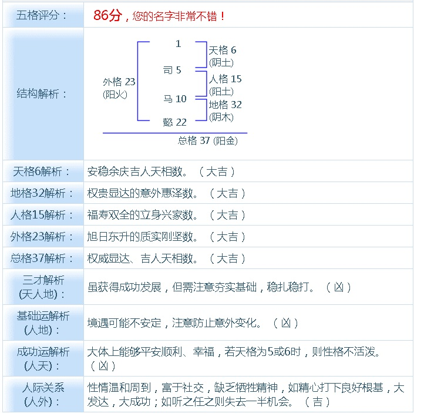

## 解密上帝之手 - 阿里云HDB for PostgreSQL数据库metascan特性(存储级、块级、batch级过滤与数据编排)
                         
### 作者                          
digoal                         
                           
### 日期                           
2017-08-09                     
                                    
### 标签                    
PostgreSQL , metascan , 块级过滤 , 块级统计信息 , BATCH级统计信息 , brin , 区间索引 , 块级索引 , batch级索引 , 数据编排 , 存储计算分离 , 混合编排 , 分段编排             
                    
----                    
                     
## 背景      
数据也有生辰八字，你信吗？列与列之间，行与行之间，元素与元素之间如何相生相克？查询慢？不要信什么这都是上天注定的，如何给数据改运？看完本文，你也可以做到。    
    
  
    
一份天赋，九份努力。缘分天注定。命由天定。又有说我命由我不由天的。看样子中国古人对先天注定的东西研究还挺透彻，看的还挺开，但是也有通过后天努力，或者后天改运等等手段来弥补先天不足的。    
    
    
    
实际上在准备写本文时，我发现数据库的数据编排，数据存放和中国的命理相关的传统文化还很相似，也存在先天因素和后天补救的说法。    
    
怎么回事呢？且听我细细道来。    
      
为了加速数据的检索效率，我们通常需要对数据创建索引，提高数据定位的精准性。例如查询某人某个月的通话流水数据，没有索引的话，我们需要搜索所有的数据，逐条匹配。通过索引，可以直接定位到需要查询的记录。      
      
特别是在存储和计算分离时，如果搜索量越大，网络中传输的数据量就越大。瓶颈很明显。      
      
另外，在OLAP领域，需要对大量的数据进行处理，如果都建索引，索引引入的开销还是蛮大的。      
      
那么有没有其他方法，不建索引降低扫描量呢？      
      
## 存储层统计和过滤下推      
相信大家一定已经想到了，统计信息，没错我们可以对存储的数据，按块进行数据统计，例如每个块内的数据范围。      
      
有几个非常常见的技术实现：      
      
1、PostgreSQL BRIN索引。      
      
[《PostgreSQL 物联网黑科技 - 瘦身几百倍的索引(BRIN index)》](../201604/20160414_01.md)        
      
https://www.postgresql.org/docs/10/static/brin-intro.html      
      
PostgreSQL brin索引就是块级索引，记录的是每个块、或者每一批连续的块的统计信息。      
      
在按这个列搜索时，通过元数据，过滤不相干的块。      
      
2、cstore_fdw列存储插件。实际上它也是按BATCH编排的列存储，每个BATCH的元数据（最大值、最小值）可以用于扫描时的过滤。      
      
https://github.com/citusdata/cstore_fdw      
      
Skip indexes: Stores min/max statistics for row groups, and uses them to skip over unrelated rows.      
      
**Using Skip Indexes**      
      
cstore_fdw partitions each column into multiple blocks. Skip indexes store minimum and maximum values for each of these blocks. While scanning the table, if min/max values of the block contradict the WHERE clause, then the block is completely skipped. This way, the query processes less data and hence finishes faster.      
      
To use skip indexes more efficiently, you should load the data after sorting it on a column that is commonly used in the WHERE clause. This ensures that there is a minimum overlap between blocks and the chance of them being skipped is higher.      
      
In practice, the data generally has an inherent dimension (for example a time field) on which it is naturally sorted. Usually, the queries also have a filter clause on that column (for example you want to query only the last week's data), and hence you don't need to sort the data in such cases.      
      
在按这个列搜索时，通过元数据，过滤不相干的块。      
      
例子      
      
```      
某个300GB的外部表，采样skip index扫描，加速扫描。  
耗时103毫秒。      
      
explain (analyze,verbose,timing,costs,buffers) select c400,sum(c2) from ft_tbl1 where c400=1 group by c400;      
      
         Filter: (ft_tbl1.c400 = 1)      
         Rows Removed by Filter: 89996        
         CStore File: /data01/digoal/pg_root1921/cstore_fdw/13146/41038      
         CStore File Size: 325166400400      
         Buffers: shared hit=8004      
 Planning time: 52.524 ms      
 Execution time: 103.555 ms      
(13 rows)      
      
不使用where c400=1，  
耗时89秒      
explain (analyze,verbose,timing,costs,buffers) select c400,sum(c2) from ft_tbl1  group by c400;      
      
         CStore File: /data01/digoal/pg_root1921/cstore_fdw/13146/41038      
         CStore File Size: 325166400400      
         Buffers: shared hit=8004      
 Planning time: 52.691 ms      
 Execution time: 89428.721 ms      
```      
      
需要提一下，目前cstore_fdw这个插件没有支持并行计算，而实际上PostgreSQL的fdw接口已经支持了并行计算，cstore_fdw只需要改造一下，即可支持并行计算。      
      
如下      
      
https://www.postgresql.org/docs/10/static/fdw-callbacks.html#fdw-callbacks-parallel      
      
## 过滤效率与线性相关性      
注意，由于数据存储的关系，并不是所有列的统计信息过滤性都很好。举个例子：      
      
某列的写入很随机，导致值的分布很随机，那么在一个数据块里面包含的数据范围可能比较大，这种列的存储元信息过滤性就很差。      
      
```      
create table a(id int, c1 int);      
insert into a select generate_series(1,1000000), random()*1000000;      
```      
      
数据的分布如下      
      
```      
postgres=# select substring(ctid::text, '(\d+),')::int8 blkid, min(c1) min_c1, max(c1) max_c1, min(id) min_id, max(id) max_id from a group by 1 order by 1;      
 blkid | min_c1 | max_c1 | min_id | max_id        
-------+--------+--------+--------+---------      
     0 |   2697 | 998322 |      1 |     909      
     1 |   1065 | 998817 |    910 |    1818      
     2 |    250 | 998025 |   1819 |    2727      
     3 |     62 | 997316 |   2728 |    3636      
     4 |   1556 | 998640 |   3637 |    4545      
     5 |    999 | 999536 |   4546 |    5454      
     6 |   1385 | 999196 |   5455 |    6363      
     7 |   1809 | 999042 |   6364 |    7272      
     8 |   3044 | 999606 |   7273 |    8181      
     9 |   1719 | 999186 |   8182 |    9090      
    10 |    618 | 997031 |   9091 |    9999      
    11 |     80 | 997581 |  10000 |   10908      
    12 |    781 | 997710 |  10909 |   11817      
    13 |   1539 | 998857 |  11818 |   12726      
    14 |   2097 | 999932 |  12727 |   13635      
    15 |    114 | 999913 |  13636 |   14544      
    16 |    136 | 999746 |  14545 |   15453      
    17 |   2047 | 997439 |  15454 |   16362      
    18 |   1955 | 996937 |  16363 |   17271      
    19 |   1487 | 999705 |  17272 |   18180      
    20 |     97 | 999549 |  18181 |   19089      
    21 |    375 | 999161 |  19090 |   19998      
    22 |    645 | 994457 |  19999 |   20907      
    23 |   4468 | 998612 |  20908 |   21816      
    24 |    865 | 996342 |  21817 |   22725      
    25 |    402 | 998151 |  22726 |   23634      
    26 |    429 | 998823 |  23635 |   24543      
    27 |   1305 | 999521 |  24544 |   25452      
    28 |    974 | 998874 |  25453 |   26361      
    29 |   1056 | 999271 |  26362 |   27270      
。。。。。。      
```      
      
对于ID列，分布非常清晰（线性相关性好），存储元数据的过滤性好。而C1列，分布非常散，存储元数据的过滤性差。      
      
例如我要查id=10000的数据，直接查11号数据块，跳过其他数据块的扫描。      
      
而如果我要查c1=10000的数据，那么要查很多个数据块，因为能跳过的数据块很少。      
      
## 如何提升每一列的过滤性 - 存储编排      
对于单列来说，提升过滤性的方法非常简单，按顺序存储即可。      
      
例如前面的测试表，我们要提高C1的过滤性，按C1重排一下即可实现。      
      
重排后，C1列与物理存储（行号）的相关性会变成1或-1，即线性相关，因此过滤性就特别好。      
      
```      
postgres=# create temp table tmp_a (like a);      
CREATE TABLE      
postgres=# insert into tmp_a select * from a order by c1;      
INSERT 0 1000000      
postgres=# truncate a;      
TRUNCATE TABLE      
postgres=# insert into a select * from tmp_a;      
INSERT 0 1000000      
postgres=# end;      
COMMIT      
postgres=# select substring(ctid::text, '(\d+),')::int8 blkid, min(c1) min_c1, max(c1) max_c1, min(id) min_id, max(id) max_id from a group by 1 order by 1;      
 blkid | min_c1 | max_c1 | min_id | max_id        
-------+--------+--------+--------+---------      
     0 |      0 |    923 |   2462 |  999519      
     1 |    923 |   1846 |   1487 |  997619      
     2 |   1847 |   2739 |    710 |  999912      
     3 |   2741 |   3657 |   1930 |  999053      
     4 |   3658 |   4577 |   1635 |  999579      
     5 |   4577 |   5449 |    852 |  999335      
     6 |   5450 |   6410 |    737 |  998277      
     7 |   6414 |   7310 |   3262 |  999024      
     8 |   7310 |   8245 |    927 |  997907      
     9 |   8246 |   9146 |    441 |  999209      
    10 |   9146 |  10015 |    617 |  999828      
    11 |  10016 |  10920 |   1226 |  998264      
    12 |  10923 |  11859 |   1512 |  997404      
    13 |  11862 |  12846 |    151 |  998737      
    14 |  12847 |  13737 |   1007 |  999250      
。。。。。。      
      
c1列和物理存储（行号）的线性相关性      
postgres=# select correlation from pg_stats where tablename='a' and attname='c1';      
 correlation       
-------------      
           1      
(1 row)      
```      
      
糟糕的是，这么编排后，ID这个字段的过滤性就变差了。      
      
这是为什么呢？      
      
### 全局/全表 两列相对线性相关性      
实际上是ID和C1列的相关性，它控制了按C1排序后ID列变离散的问题。      
      
ID和C1的相关性如何呢？      
      
```      
postgres=# select corr(c1,id) from (select row_number() over(order by c1) c1, row_number() over(order by id) id from a) t;      
         corr                
-----------------------      
 -0.000695987373950136      
(1 row)      
```      
      
c1和id的全局（全表）相关性极差，导致了这个问题。      
    
（可以理解为这两个字段的八字不合）  
  
  
      
### 局部/部分记录 两列相对线性相关性      
如果全表按C1或ID排序，那么另一列的离散度就会变得很高。      
      
但是，某些情况下，可能存在这样的情况，某些记录A和B字段的相关性很好，而其他记录他们的相关性不好。      
      
例子      
      
在之前的记录基础上，再插入一批记录。      
      
```      
postgres=# insert into a select id, id*2 from generate_series(1,100000) t(id);      
INSERT 0 100000      
```      
      
这部分数据id, c1字段的相关性为1。(局部相关性)      
      
```      
postgres=# select ctid from a offset 1000000 limit 1;      
    ctid          
------------      
 (1113,877)      
(1 row)      
      
postgres=# select corr(c1,id) from (select row_number() over(order by c1) c1, row_number() over(order by id) id from a where ctid >'(1113,877)') t;      
 corr       
------      
    1      
(1 row)      
```      
      
全局相关性一下也提升了不少      
      
```      
postgres=# select corr(c1,id) from (select row_number() over(order by c1) c1, row_number() over(order by id) id from a) t;      
       corr              
-------------------      
 0.182542794451908      
(1 row)      
```      
     
### 局部按需改命法  
数据散落存储，带来的问题：即使访问少量数据，也会造成大量的IO读取，原理如下：  
  
[《索引顺序扫描引发的堆扫描IO放大背后的统计学原理与解决办法》](../201404/20140426_01.md)    
  
数据存储是上天注定的（写入时就决定了），但是我们可以按需改命，例如有个业务是运营商的通话流水，查询需求通常是按某个手机号码查询一个月的流水。而实际上数据是产生时即时写入数据库的，所以存放散乱。查询时耗费大量IO。  
  
例子  
  
用户通话数据即时写入，用户数据呈现布朗分布。  
  
```  
create table phone_list(phone_from char(11), phone_to char(11), crt_time timestamp, duration interval);  
create index idx_phone_list on phone_list(phone_from, crt_time);  
  
insert into phone_list   
select   
  lpad((random()*1000)::int8::text, 11, '1'),   
  lpad((random()*1000)::int8::text, 11, '1'),   
  now()+(id||' second')::interval,  
  ((random()*1000)::int||' second')::interval  
from generate_series(1,10000000) t(id);  
  
postgres=# select * from phone_list limit 10;  
 phone_from  |  phone_to   |          crt_time          | duration   
-------------+-------------+----------------------------+----------  
 14588832692 | 11739044013 | 2017-08-11 10:17:04.752157 | 00:03:25  
 15612918106 | 11808103578 | 2017-08-11 10:17:05.752157 | 00:11:33  
 14215811756 | 15983559210 | 2017-08-11 10:17:06.752157 | 00:08:05  
 13735246090 | 15398474974 | 2017-08-11 10:17:07.752157 | 00:13:18  
 19445131039 | 17771201972 | 2017-08-11 10:17:08.752157 | 00:00:10  
 11636458384 | 16356298444 | 2017-08-11 10:17:09.752157 | 00:06:30  
 15771059012 | 14717265381 | 2017-08-11 10:17:10.752157 | 00:13:45  
 19361008150 | 14468133189 | 2017-08-11 10:17:11.752157 | 00:05:58  
 13424293799 | 16589177297 | 2017-08-11 10:17:12.752157 | 00:16:29  
 12243665890 | 13538149386 | 2017-08-11 10:17:13.752157 | 00:16:03  
(10 rows)  
```  
  
查询效率低下，按手机查询通话记录，返回29937条记录需要26毫秒。  
  
```  
postgres=# explain (analyze,verbose,timing,costs,buffers) select * from phone_list where phone_from='11111111111' order by crt_time;  
                                                                   QUERY PLAN                                                                     
------------------------------------------------------------------------------------------------------------------------------------------------  
 Index Scan using idx_phone_list on public.phone_list  (cost=0.56..31443.03 rows=36667 width=48) (actual time=0.016..24.348 rows=29937 loops=1)  
   Output: phone_from, phone_to, crt_time, duration  
   Index Cond: (phone_list.phone_from = '11111111111'::bpchar)  
   Buffers: shared hit=25843  
 Planning time: 0.082 ms  
 Execution time: 25.821 ms  
(6 rows)  
```  
  
改命方法，局部按需调整。  
  
需求是高效的按手机和月查询通话详单，所以我们需要将用户一个月的数据（通常是按月分区）进行重排即可。  
  
分区表用法见：[《PostgreSQL 10.0 preview 功能增强 - 内置分区表》](../201612/20161215_01.md)    
  
```  
postgres=# cluster phone_list using idx_phone_list ;  
```  
  
查询效率骤然提升，改命成功。  
  
```  
postgres=# explain (analyze,verbose,timing,costs,buffers) select * from phone_list where phone_from='11111111111' order by crt_time;  
                                                                  QUERY PLAN                                                                     
-----------------------------------------------------------------------------------------------------------------------------------------------  
 Index Scan using idx_phone_list on public.phone_list  (cost=0.56..31443.03 rows=36667 width=48) (actual time=0.012..4.590 rows=29937 loops=1)  
   Output: phone_from, phone_to, crt_time, duration  
   Index Cond: (phone_list.phone_from = '11111111111'::bpchar)  
   Buffers: shared hit=432  
 Planning time: 0.038 ms  
 Execution time: 5.968 ms  
(6 rows)  
```  
  
你就是上帝之手，数据的命运掌握在你的手中。  
  
### 如何提升每一列的过滤性 - 存储编排      
      
为了获得最好的过滤性（每个列都能很好的过滤），采用全局排序满足不了需求。      
      
实际上需要局部排序，例如前面的例子，前面100万行，按C1排序，后面10万行再按ID排序。      
      
这样的话有10万记录的ID的过滤性很好，有110万记录的C1的过滤性也很好。      
       
但是数都是有命理的，就好像人的姓名也分为五格。       
      
        
      
通过后天的补救，可以改运。道理和数据编排一样，数据重排，可以影响全局过滤性，局部过滤性，是不是很有意思呢？       
      
**根据你的查询目标需求，重排数据，一起来改运吧。**      
      
### 复合排序 多列相对线性相关性      
多列如何做到每列都具备良好的聚集性呢？   
  
1、最土的方法，多列排序，但是效果其实并不一定好。为了达到更好的效果，需要调整列的顺序，算法如下：   
  
我记得以前写过一篇这样的文档：      
      
[《一个简单算法可以帮助物联网,金融 用户 节约98%的数据存储成本 (PostgreSQL,Greenplum帮你做到)》](../201604/20160404_01.md)        
      
这里讲的实际上也是存储编排的精髓，通过排列组合，计算每两列的线性相关性，根据这个找出最佳的多列排序组合，从而提高整体相关性（提高压缩比）。      
      
同样适用于本文提到的提高所有列的过滤性。      
    
2、k-means算法，针对多列进行聚集计算，完成最佳的局部分布，这样做就能达到每个列的过滤性都很赞了。    
    
[《K-Means 数据聚集算法》](../201508/20150817_01.md)  
      
## 精髓      
1、局部、全局 两列相对相关性。决定了按某列排序后，另一列的离散度。      
      
2、编排的目的是，可以尽可能的让更多的列有序的存储，从而可以过滤最多的行。      
      
3、全局相关性，决定了按某一列排序时，另一列的离散度。      
      
4、局部相关性，决定了在某些记录中，两列的线性相关性。      
      
5、按局部相关性编排，可以尽可能的让更多的列有序的存储，从而可以过滤最多的行。但是算法较复杂，需要算出什么样的行在一起，按什么排序存放才能获得最佳过滤性。         
      
6、关于多列（或数组）的数据编排，方法1，通过排列组合，计算每两列（元素）的线性相关性，根据这个找出最佳的多列排序组合，从而提高整体相关性（提高压缩比）。      
  
7、编排后，与存储（行号）线性相关性差的列，如果选择性较好（DISTINCT VALUE较多）时，并且业务有过滤数据的需求，建议还是需要建索引。      
  
8、关于多列（或数组）的数据编排，方法2，通过kmean，算出数据归为哪类，每类聚合存放，从而提高数据的局部聚集性，过滤性。这个方法是最优雅的。      
  
9、经过编排，结合PG的BRIN索引，就可以实现任意列的高效过滤。  
    
## 给数据改命的案例  
1、多列改命  
  
低级方法，[《一个简单算法可以帮助物联网,金融 用户 节约98%的数据存储成本 (PostgreSQL,Greenplum帮你做到)》](../201604/20160404_01.md)        
   
高级方法，[《K-Means 数据聚集算法》](../201508/20150817_01.md)  
    
  
  
  
  
  
  
高级方法举例  
  
```
-- 写入 1亿 记录
-- 天命，各列散落，五行紊乱，查询效率低下。 
postgres=# create table tab(c1 int, c2 int, c3 int, c4 int, c5 int);
CREATE TABLE
postgres=# insert into tab select * from (select id,100000000-id,50000000-id, sqrt(id*2), sqrt(id) from generate_series(1,100000000) t(id)) t order by random();
INSERT 0 100000000
postgres=# select ctid,* from tab limit 10;
  ctid  |    c1    |    c2    |    c3     |  c4   |  c5  
--------+----------+----------+-----------+-------+------
 (0,1)  | 76120710 | 23879290 | -26120710 | 12339 | 8725
 (0,2)  | 98295593 |  1704407 | -48295593 | 14021 | 9914
 (0,3)  | 56133647 | 43866353 |  -6133647 | 10596 | 7492
 (0,4)  |   787639 | 99212361 |  49212361 |  1255 |  887
 (0,5)  | 89844299 | 10155701 | -39844299 | 13405 | 9479
 (0,6)  | 92618459 |  7381541 | -42618459 | 13610 | 9624
 (0,7)  | 93340303 |  6659697 | -43340303 | 13663 | 9661
 (0,8)  | 17164665 | 82835335 |  32835335 |  5859 | 4143
 (0,9)  |  2694394 | 97305606 |  47305606 |  2321 | 1641
 (0,10) | 41736122 | 58263878 |   8263878 |  9136 | 6460
(10 rows)
  
-- 改命，按K-MEAN聚集调整五行，采用BRIN索引实现任意列高效率过滤。
-- 让每列在各个方向上保持一致，例如(a,b) (1,100)(2,101), (100,9)(105,15)，如果归为两类，在过滤A字段时选择性很好，过滤B字段时选择性也很好。  
postgres=# create table tbl1(like tab);
CREATE TABLE

-- 由于数据按块存储，BRIN索引最小粒度为块，所以我们的聚类数最多可以为表的块数即可。例如636943个数据块，那么我们可以归类为636943类。
-- 归为超过636943类就没有意义了，归类为更少是可以的，例如BRIN索引每10个连续的数据块存储一个元信息，那么我们可以选择归为63694类。  
postgres=# select relpages from pg_class where relname='tab';
 relpages 
----------
    636943
(1 row)
postgres=# insert into tbl1 select c1,c2,c3,c4,c5 from (select kmeans(array[c1,c2,c3,c4,c5],63694) over() km, * from tab) t order by km;
  
-- 创建任意列BRIN索引
create index idx_tab_1 on tab using brin(c1,c2,c3) with (pages_per_range=1);
create index idx_tbl1_1 on tbl1 using brin(c1,c2,c3) with (pages_per_range=1);
```
  
使用BRIN索引，在给数据改命后，任意列范围搜索，提升高效，赞   
  
```
postgres=# explain (analyze,verbose,timing,costs,buffers) select * from tab where c1 between 1 and 100000;
                                                             QUERY PLAN                                                              
-------------------------------------------------------------------------------------------------------------------------------------
 Bitmap Heap Scan on public.tab  (cost=4184.33..906532.40 rows=83439 width=20) (actual time=165.626..1582.402 rows=100000 loops=1)
   Output: c1, c2, c3, c4, c5
   Recheck Cond: ((tab.c1 >= 1) AND (tab.c1 <= 100000))
   Rows Removed by Index Recheck: 14427159
   Heap Blocks: lossy=92530
   Buffers: shared hit=96745
   ->  Bitmap Index Scan on idx_tab_1  (cost=0.00..4163.47 rows=17693671 width=0) (actual time=165.307..165.307 rows=925300 loops=1)
         Index Cond: ((tab.c1 >= 1) AND (tab.c1 <= 100000))
         Buffers: shared hit=4215
 Planning time: 0.088 ms
 Execution time: 1588.852 ms
(11 rows)

postgres=# explain (analyze,verbose,timing,costs,buffers) select * from tbl1 where c1 between 1 and 100000;
                                                            QUERY PLAN                                                             
-----------------------------------------------------------------------------------------------------------------------------------
 Bitmap Heap Scan on public.tbl1  (cost=4159.34..111242.78 rows=95550 width=20) (actual time=157.084..169.314 rows=100000 loops=1)
   Output: c1, c2, c3, c4, c5
   Recheck Cond: ((tbl1.c1 >= 1) AND (tbl1.c1 <= 100000))
   Rows Removed by Index Recheck: 9
   Heap Blocks: lossy=637
   Buffers: shared hit=4852
   ->  Bitmap Index Scan on idx_tbl1_1  (cost=0.00..4135.45 rows=95613 width=0) (actual time=157.074..157.074 rows=6370 loops=1)
         Index Cond: ((tbl1.c1 >= 1) AND (tbl1.c1 <= 100000))
         Buffers: shared hit=4215
 Planning time: 0.083 ms
 Execution time: 174.069 ms
(11 rows)

postgres=# explain (analyze,verbose,timing,costs,buffers) select * from tab where c2 between 1 and 100000;
                                                             QUERY PLAN                                                              
-------------------------------------------------------------------------------------------------------------------------------------
 Bitmap Heap Scan on public.tab  (cost=4183.50..902041.63 rows=82011 width=20) (actual time=165.901..1636.587 rows=100000 loops=1)
   Output: c1, c2, c3, c4, c5
   Recheck Cond: ((tab.c2 >= 1) AND (tab.c2 <= 100000))
   Rows Removed by Index Recheck: 14446835
   Heap Blocks: lossy=92655
   Buffers: shared hit=96870
   ->  Bitmap Index Scan on idx_tab_1  (cost=0.00..4163.00 rows=17394342 width=0) (actual time=165.574..165.574 rows=926550 loops=1)
         Index Cond: ((tab.c2 >= 1) AND (tab.c2 <= 100000))
         Buffers: shared hit=4215
 Planning time: 0.087 ms
 Execution time: 1643.089 ms
(11 rows)

postgres=# explain (analyze,verbose,timing,costs,buffers) select * from tbl1 where c2 between 1 and 100000;
                                                            QUERY PLAN                                                             
-----------------------------------------------------------------------------------------------------------------------------------
 Bitmap Heap Scan on public.tbl1  (cost=4156.97..101777.70 rows=86127 width=20) (actual time=157.245..169.934 rows=100000 loops=1)
   Output: c1, c2, c3, c4, c5
   Recheck Cond: ((tbl1.c2 >= 1) AND (tbl1.c2 <= 100000))
   Rows Removed by Index Recheck: 115
   Heap Blocks: lossy=638
   Buffers: shared hit=4853
   ->  Bitmap Index Scan on idx_tbl1_1  (cost=0.00..4135.44 rows=86193 width=0) (actual time=157.227..157.227 rows=6380 loops=1)
         Index Cond: ((tbl1.c2 >= 1) AND (tbl1.c2 <= 100000))
         Buffers: shared hit=4215
 Planning time: 0.084 ms
 Execution time: 174.692 ms
(11 rows)

postgres=# explain (analyze,verbose,timing,costs,buffers) select * from tab where c3 between 1 and 10000;
                                                             QUERY PLAN                                                              
-------------------------------------------------------------------------------------------------------------------------------------
 Bitmap Heap Scan on public.tab  (cost=4141.01..672014.67 rows=9697 width=20) (actual time=191.075..10765.038 rows=10000 loops=1)
   Output: c1, c2, c3, c4, c5
   Recheck Cond: ((tab.c3 >= 1) AND (tab.c3 <= 10000))
   Rows Removed by Index Recheck: 99990000
   Heap Blocks: lossy=636943
   Buffers: shared hit=641158
   ->  Bitmap Index Scan on idx_tab_1  (cost=0.00..4138.58 rows=2062044 width=0) (actual time=190.292..190.292 rows=6369430 loops=1)
         Index Cond: ((tab.c3 >= 1) AND (tab.c3 <= 10000))
         Buffers: shared hit=4215
 Planning time: 0.086 ms
 Execution time: 10766.036 ms
(11 rows)

postgres=# explain (analyze,verbose,timing,costs,buffers) select * from tbl1 where c3 between 1 and 10000;
                                                           QUERY PLAN                                                            
---------------------------------------------------------------------------------------------------------------------------------
 Bitmap Heap Scan on public.tbl1  (cost=4137.85..17069.21 rows=10133 width=20) (actual time=150.710..152.040 rows=10000 loops=1)
   Output: c1, c2, c3, c4, c5
   Recheck Cond: ((tbl1.c3 >= 1) AND (tbl1.c3 <= 10000))
   Rows Removed by Index Recheck: 205
   Heap Blocks: lossy=65
   Buffers: shared hit=4280
   ->  Bitmap Index Scan on idx_tbl1_1  (cost=0.00..4135.32 rows=10205 width=0) (actual time=150.692..150.692 rows=650 loops=1)
         Index Cond: ((tbl1.c3 >= 1) AND (tbl1.c3 <= 10000))
         Buffers: shared hit=4215
 Planning time: 0.083 ms
 Execution time: 152.546 ms
(11 rows)
```
  
2、数组改命  
  
[《索引扫描优化之 - GIN数据重组优化(按元素聚合) 想象在玩多阶魔方》](../201706/20170612_05.md)    
  
[《从一维编排到多维编排，从平面存储到3D存储 - 数据存储优化之路》](../201706/20170614_01.md)    
  
[《K-Means 数据聚集算法》](../201508/20150817_01.md)  
  
3、时空数据改命  
  
[《时间、空间、对象多维属性 海量数据任意多维 高效检索 - 阿里云RDS PostgreSQL最佳实践》](../201707/20170722_01.md)    
  
4、证券系统改命  
  
[《PostgreSQL 时序最佳实践 - 证券交易系统数据库设计 - 阿里云RDS PostgreSQL最佳实践》](../201704/20170417_01.md)    
    
## 相关技术      
1、列存储插件 cstore      
      
https://github.com/citusdata/cstore_fdw      
      
https://www.postgresql.org/docs/10/static/fdw-callbacks.html#fdw-callbacks-parallel      
      
2、[《一个简单算法可以帮助物联网,金融 用户 节约98%的数据存储成本 (PostgreSQL,Greenplum帮你做到)》](../201604/20160404_01.md)        
      
3、[《PostgreSQL 物联网黑科技 - 瘦身几百倍的索引(BRIN index)》](../201604/20160414_01.md)        
      
https://www.postgresql.org/docs/10/static/brin-intro.html      
      
4、metascan是阿里云PostgreSQL内核团队研发的一个数据库功能，已用于[RDS PostgreSQL](https://www.aliyun.com/product/rds/postgresql)和[HybridDB for PostgreSQL](https://www.aliyun.com/product/gpdb)，将来亦可整合到存储引擎层面，将数据的FILTER下推到存储层，根据用户提供的查询条件，在不建索引的情况下可以减少数据的扫描量，提高效率。       
       
我们已测试，查询性能有3到5倍的提升（相比不建索引）。同时写入性能有至少1倍的提升（相比建立索引）。       
         
## 云端产品        
[阿里云 RDS PostgreSQL](https://www.aliyun.com/product/rds/postgresql)              
            
[阿里云 HybridDB for PostgreSQL](https://www.aliyun.com/product/gpdb)              
      
       
  
<a rel="nofollow" href="http://info.flagcounter.com/h9V1"  ></a>  
  
  
  
  
  
  
## [digoal's 大量PostgreSQL文章入口](https://github.com/digoal/blog/blob/master/README.md "22709685feb7cab07d30f30387f0a9ae")
  
