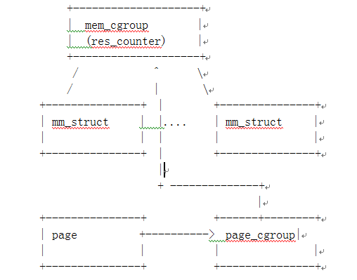

## 手工清理 cgroup中的page cache  
                       
### 作者      
digoal      
      
### 日期       
2017-08-17     
        
### 标签      
PostgreSQL , Linux , cgroup , limit , page cache , touch         
                  
----                  
                   
## 背景    
  
## 原文  
http://blogs.360.cn/360xitong/2013/05/02/mem-cgroup%E7%9B%AE%E5%BD%95%E6%97%A0%E6%B3%95%E6%B8%85%E7%90%86%E9%97%AE%E9%A2%98%E5%88%86%E6%9E%90/  
  
Cgroup(Control Group)是内核提供的资源隔离的技术,用于对Linux 系统中用户态进程使用的资源进行隔离，核心思想是：把进程分组，然后为进程组分配资源（包括内存、CPU、IO等）。其中Mem Cgroup用来隔离进程组使用的内存资源。  
  
在Hadoop集群中，我们使用了Mem Cgroup对MapReduce任务使用的内存资源进行隔离控制,以保证单个任务不能占用太大的内存，进而保证整个系统的稳定性。同时我们配置了release_agent，用于在mem cgroup中的所有进程退出后清理相关的资源。  
  
但Mem Cgroup在Hadoop集群上线后，经常会出现某个Mem Cgroup中的进程已经全部退出，但对应的Cgroup目录清理不掉的现象。查看Cgroup的状态，有如下现象：  
  
```  
[root@]# cat /cgroup/memory/test/tasks  
  
[root@]# cat /cgroup/memory/test/memory.usage_in_bytes  
  
90112  
```  
  
该cgroup的所有进程确实都已经退出了，但还是存在部分内存处于被使用状态，这是神马情况，下意识地想到，难道是Page Cache，果断验证下：  
  
```  
echo 3 > /proc/sys/vm/drop_caches  
  
实际上可以直接对CGROUP内的drop_caches进行操作  
  
echo 3 > /cgroup/memory/test/memory.drop_caches  
```  
  
刷掉Page Cache之后，残留的cgroup目录竟然成功被清理了， 那基本断定是Page Cache的影响了，后面就得分析下代码，研究下其中的原理了。  
  
经过几天的分析，终于把Mem Cgroup的基本原理搞明白了。  
  
在Linux内核中，每个Mem Cgroup都对应一个mem_cgroup结构，该结构的的核心是res_counter，记录了资源使用情况和资源限制，每个mem cgroup对象都包含一个与之关联的res_counter。  
  
Linux内核管理内核的基本单位是页面，采用page结构管理，一个物理页框对应着一个page结构，与此同时，新增了一个page_cgroup结构，用来关联page和mem_cgroup，这样给定任何一个页面，都可以找到对应的mem_cgroup。另外，每个进程都有一个mm_struct结构来管理进程的内存信息。每个mm_struct知道自己属于的进程，进而可以知道进程所属的mem_cgroup。  
  
  
  
用户进程物理内存的分配基本都是通过page_fault来实现，现在来看下这个过程中是如何实现mem cgroup相关功能的，page_fault的大体流程如下：  
  
1、根据current进程找到对应的mm_struct结构  
  
2、分配需要的page页面  
  
3、调用mem_cgroup_newpage_charge：该函数根据mm struct查找到对应的mem_cgroup，然后判断下当前mem_cgroup是否已经超过限制，如果没有，则把新分配page对应page_cgroup指向该mem_cgroup，并更新资源使用计数。如果已经超过了限制，则进行oom相关的处理。  
  
现在来考虑下Page cache，这些内存是系统级的，可以被所有进程使用，那这些内存的使用算在哪个进程的头上呢？mem cgroup采用的是first touch的原则，就是说哪个进程把page cache页面“带进”内存，这个页面就算在谁的头上。  
  
大致了解了Mem cgroup的原理，回到一开始的问题，虽然mem cgroup中的进程都已经退出了，但是这些进程使用的page cache仍然计算在这个mem cgroup中，导致mem cgroup一直被引用，因此mem cgroup清理不掉，刷掉page cache后，mem cgroup就没有被引用了，也就可以清理了。  
  
针对该问题，我们在内核新增加了一个page cache的使用计算选择：把page cache全部算入默认的根mem cgroup。这样做的另外一个好处是，mem cgroup只记录进程本身利用的物理内存，更直观可控。同时page cache是可回收的，如果某个mem cgroup中的进程产生大量的page cache时，其他mem cgroup进程的内存基本不受影响，可能的坏处是影响其他mem cgroup内存分配的效率。  
  
cgroup内的page cache并不会影响用户申请内存，当用户申请的内存超过cgroup剩余内存时，内核会自动释放cgroup内的page cache，腾出内存空间给用户使用。注意RSS的部分是无法被释放的。  
  
```  
#cat memory.stat   
  
cache 4194889728  
rss 0  
mapped_file 0  
pgpgin 1280316  
pgpgout 256173  
swap 0  
inactive_anon 0  
active_anon 0  
inactive_file 4194332672  
active_file 483328  
unevictable 0  
hierarchical_memory_limit 4294967296  
hierarchical_memsw_limit 9223372036854775807  
total_cache 4194889728  
total_rss 0  
total_mapped_file 0  
total_pgpgin 1280316  
total_pgpgout 256173  
total_swap 0  
total_inactive_anon 0  
total_active_anon 0  
total_inactive_file 4194332672  
total_active_file 483328  
total_unevictable 0  
```  
  
## 参考    
http://blogs.360.cn/360xitong/2013/05/02/mem-cgroup%E7%9B%AE%E5%BD%95%E6%97%A0%E6%B3%95%E6%B8%85%E7%90%86%E9%97%AE%E9%A2%98%E5%88%86%E6%9E%90/  
  
http://lwn.net/Articles/432224/  
  
<a rel="nofollow" href="http://info.flagcounter.com/h9V1"  ></a>  
  
  
  
  
  
  
## [digoal's 大量PostgreSQL文章入口](https://github.com/digoal/blog/blob/master/README.md "22709685feb7cab07d30f30387f0a9ae")
  
