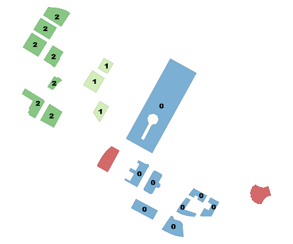
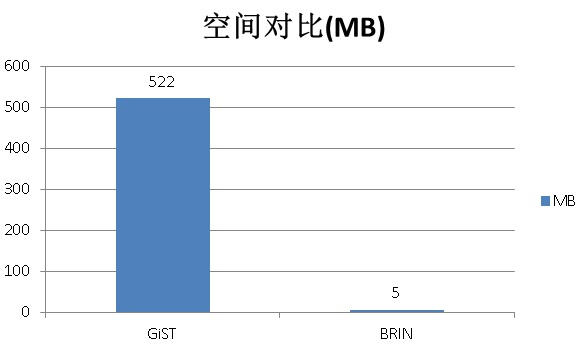
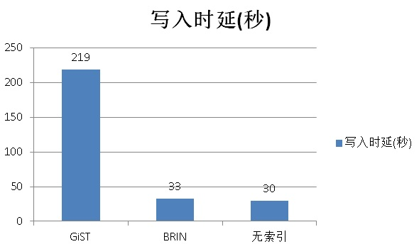
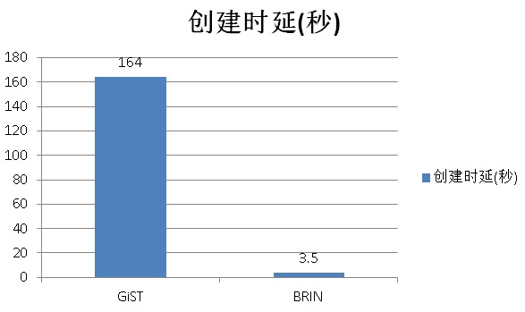
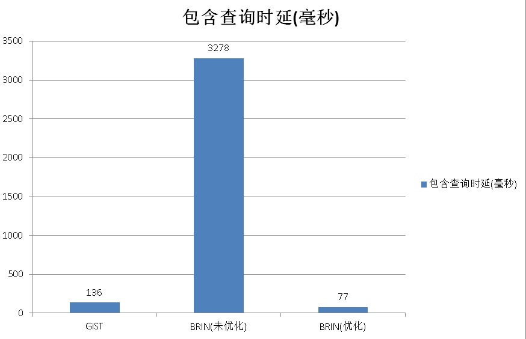
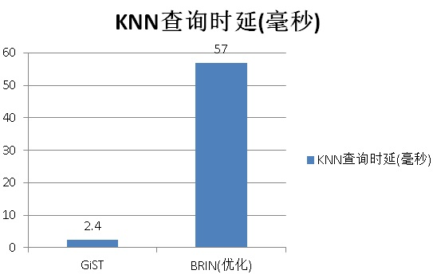

## PostGIS空间索引(GiST、BRIN、R-Tree)选择、优化 - 阿里云RDS PostgreSQL最佳实践    
                       
### 作者      
digoal      
      
### 日期       
2017-08-20      
        
### 标签      
PostgreSQL , Greenplum , PostGIS , GiST , R-Tree , BRIN , 相关性 , 网格 , BOX , K-Mean         
                  
----                  
                   
## 背景    
空间数据的搜索需求通常包括：  
  
1、平面、三维、多维对象 几何相交、不相交、相邻。  
  
2、平面、三维、多维对象的方位判断（相交或严格在左边、右边、上边、下边），类似数值的大于、小于、大于等于、小于等于。  
  
3、平面、三维、多维对象 包含 另一个对象  
  
4、平面、三维、多维对象 等于 另一个对象  
  
5、平面、三维、多维对象 与另一个对象的（边、最近、中心点的）距离，按距离排序输出满足条件的行，输出距离在XX以内的行。  
  
操作符如下  
  
http://postgis.net/docs/manual-2.3/reference.html#Operators  
  
```  
&& — Returns TRUE if A's 2D bounding box intersects B's 2D bounding box.  
&&(geometry,box2df) — Returns TRUE if a geometry's (cached) 2D bounding box intersects a 2D float precision bounding box (BOX2DF).  
&&(box2df,geometry) — Returns TRUE if a 2D float precision bounding box (BOX2DF) intersects a geometry's (cached) 2D bounding box.  
&&(box2df,box2df) — Returns TRUE if two 2D float precision bounding boxes (BOX2DF) intersect each other.  
&&& — Returns TRUE if A's n-D bounding box intersects B's n-D bounding box.  
&&&(geometry,gidx) — Returns TRUE if a geometry's (cached) n-D bounding box intersects a n-D float precision bounding box (GIDX).  
&&&(gidx,geometry) — Returns TRUE if a n-D float precision bounding box (GIDX) intersects a geometry's (cached) n-D bounding box.  
&&&(gidx,gidx) — Returns TRUE if two n-D float precision bounding boxes (GIDX) intersect each other.  
&< — Returns TRUE if A's bounding box overlaps or is to the left of B's.  
&<| — Returns TRUE if A's bounding box overlaps or is below B's.  
&> — Returns TRUE if A' bounding box overlaps or is to the right of B's.  
<< — Returns TRUE if A's bounding box is strictly to the left of B's.  
<<| — Returns TRUE if A's bounding box is strictly below B's.  
= — Returns TRUE if A's bounding box is the same as B's. Uses double precision bounding box.  
>> — Returns TRUE if A's bounding box is strictly to the right of B's.  
@ — Returns TRUE if A's bounding box is contained by B's.  
@(geometry,box2df) — Returns TRUE if a geometry's 2D bounding box is contained into a 2D float precision bounding box (BOX2DF).  
@(box2df,geometry) — Returns TRUE if a 2D float precision bounding box (BOX2DF) is contained into a geometry's 2D bounding box.  
@(box2df,box2df) — Returns TRUE if a 2D float precision bounding box (BOX2DF) is contained into another 2D float precision bounding box.  
|&> — Returns TRUE if A's bounding box overlaps or is above B's.  
|>> — Returns TRUE if A's bounding box is strictly above B's.  
~ — Returns TRUE if A's bounding box contains B's.  
~(geometry,box2df) — Returns TRUE if a geometry's 2D bonding box contains a 2D float precision bounding box (GIDX).  
~(box2df,geometry) — Returns TRUE if a 2D float precision bounding box (BOX2DF) contains a geometry's 2D bonding box.  
~(box2df,box2df) — Returns TRUE if a 2D float precision bounding box (BOX2DF) contains another 2D float precision bounding box (BOX2DF).  
~= — Returns TRUE if A's bounding box is the same as B's.  
<-> — Returns the 2D distance between A and B.  
|=| — Returns the distance between A and B trajectories at their closest point of approach.  
<#> — Returns the 2D distance between A and B bounding boxes.  
<<->> — Returns the n-D distance between the centroids of A and B bounding boxes.  
<<#>> — Returns the n-D distance between A and B bounding boxes.  
```  
  
这些操作符是否支持索引，支持哪些索引接口，索引是如何做到这些操作符的高效率减少的，各种索引的效率如何，数据编排上有什么优化手段？  
  
## PostgreSQL 支持的索引种类  
关于PostgreSQL支持的9种索引接口（实际上还可以继续扩展更多接口），我以前写过文档，详细的描述。这里不再赘述。  
  
[《PostgreSQL 9种索引的原理和应用场景》](../201706/20170627_01.md)    
  
### B-Tree  
B-Tree毫无疑问是最简单，最容易理解的索引，按顺序将KEY分成几个层次（根、分支、叶子）组织起来，在VALUE中存储数据的实际行号。  
  
这种索引结构在排序、范围查询(大于、小于、大于等于、小于等于)、精确查询（等于）的场景中非常有效。  
  
但是它没有办法支持空间搜索中提到的几何对象的搜索需求（相交，包含，距离等）。  
  
### R-Tree  
将空间数据按长方形组织，大的长方形套小的长方形。顶层是最大的长方形，接下来是很多小的长方形，再接下来更小，不停的切成多个层次。类似B-Tree的根、分支、叶子结构。  
  
很早以前PostgreSQL中支持R-Tree，但是后来被更好的GiST接口取代了。  
  
### GiST  
GiST是一个通用的索引接口，全称Generalized Search Trees。不仅仅适合空间数据类型的检索，同样适合其他数据类型。  
  
在GIS数据的GiST索引实现中，将空间数据按“在另一边(上、下、左、右)”，“相交”，“包含”使用R-Tree结构组织。  
  
同时，GIS索引能够支持在一个索引结构中，存储平面、三维、多维的数据。这是很了不起的功能。  
  
### BRIN  
BRIN是块级索引(9.5以上版本)，存储每个（或每连续几个）块的边界值，例如：  
  
数值类型：存储每个BLOCK（或每连续若干BLOCK）包含的记录中，最大值和最小值。（理论上还可以扩展BRIN索引的功能，例如包含记录数、平均值、SUM等信息，但是索引会更重）  
  
几何类型：存储每个BLOCK（或每连续若干BLOCK）包含的记录中，能够包含下这些几何对象的最小的BOX。例如这些记录中（最左下的点、最右上的点 造成的BOX）。  
  
[《PostgreSQL 物联网黑科技 - 瘦身几百倍的索引(BRIN index)》](../201604/20160414_01.md)    
  
## GiST和BRIN 如何选择  
### GiST和BRIN索引分别支持什么空间搜索需求？  
1、GiST索引支持什么查询需求？  
  
除了前面提到的哪些几何操作符（相交、包含、方位、距离、距离排序等），还有大量的函数支持索引的使用。  
  
详见  
  
http://postgis.net/docs/manual-2.3/reference.html  
  
2、BRIN索引支持什么查询需求？  
  
BRIN索引中存储的信息量比较有限，实际上就是包含每个（每连续几个）BLOCK中所有几何数据的最小BOX（或多维BOX）。  
  
现在能使用BRIN来优化 包含、相交、不相交 的几何搜索。  
  
```  
&&, ~ and @ operators can be used for the 2D cases (both for "geometry" and for "geography"),   
  
&&& operator can be used for the 3D geometries.  
```  
  
### GiST和BRIN索引的overhead  
索引都会引入Overhead，那么哪个引入的OVERHEAD比较大呢？  
  
GiST索引引入的overhead比较大，它需要存储的信息量较大，支持更多的搜索需求。  
  
举例  
  
创建PostGIS扩展。  
  
```  
create extension postgis;  
```  
  
创建测试表。  
  
```  
postgres=# create table gis_idx_test(id int, info text, pos geometry) with (autovacuum_enabled=off,toast.autovacuum_enabled=off);  
CREATE TABLE  
```  
    
1、写入速度对比，（写入1000万随机POINT）：  
  
GiST，219秒。  
  
```  
postgres=# \timing  
Timing is on.  
  
create index idx_gis_idx_test on gis_idx_test using gist (pos);  
insert into gis_idx_test select id, md5(random()::text), ST_SetSRID(ST_Point(180-random()*360, 90-random()*180),4326) from generate_series(1,10000000) t(id);  
  
INSERT 0 10000000  
Time: 219213.503 ms  
```  
  
BRIN（每个BLOCK统计一个BOX），33秒。  
  
```  
drop index idx_gis_idx_test;  
truncate gis_idx_test;  
create index idx_gis_idx_test on gis_idx_test using brin (pos) with (pages_per_range =1);  
insert into gis_idx_test select id, md5(random()::text), ST_SetSRID(ST_Point(180-random()*360, 90-random()*180),4326) from generate_series(1,10000000) t(id);  
  
INSERT 0 10000000  
Time: 32621.684 ms  
```  
  
2、无索引插入速度，30秒。BRIN索引对插入几乎没有影响。  
  
```  
drop index idx_gis_idx_test;  
truncate gis_idx_test;  
insert into gis_idx_test select id, md5(random()::text), ST_SetSRID(ST_Point(180-random()*360, 90-random()*180),4326) from generate_series(1,10000000) t(id);  
  
INSERT 0 10000000  
Time: 29696.020 ms  
```  
  
3、创建速度对比（1000万随机POINT）：  
  
GiST，164秒。  
  
```  
drop index idx_gis_idx_test;  
create index idx_gis_idx_test on gis_idx_test using gist (pos);  
  
CREATE INDEX  
Time: 163988.002 ms  
```  
  
BRIN，3.5秒。  
  
```  
drop index idx_gis_idx_test;  
create index idx_gis_idx_test on gis_idx_test using brin (pos) with (pages_per_range =1);  
  
CREATE INDEX  
Time: 3491.662 ms  
```  
  
4、空间对比（1000万随机POINT）：  
  
GiST，522MB。  
  
```  
postgres=# \di+ idx_gis_idx_test   
                                 List of relations  
 Schema |       Name       | Type  |  Owner   |    Table     |  Size  | Description   
--------+------------------+-------+----------+--------------+--------+-------------  
 public | idx_gis_idx_test | index | postgres | gis_idx_test | 522 MB |   
(1 row)  
```  
  
BRIN，5MB。  
  
```  
                                     List of relations  
 Schema |         Name         | Type  |  Owner   |      Table      |  Size   | Description   
--------+----------------------+-------+----------+-----------------+---------+-------------  
 public | idx_gis_idx_test     | index | postgres | gis_idx_test    | 5136 kB |   
```  
  
5、检索速度对比：  
  
5\.1 包含查询，查询在某个多边形中的所有POINT。  
  
GiST，136毫秒。  
  
```  
postgres=# explain (analyze,verbose,timing,costs,buffers) select * from gis_idx_test where st_within (pos, ST_SetSRID(ST_MakePolygon(st_setsrid(ST_GeomFromText('LINESTRING(0 0, 15 0, 7.5 10, 0 0)'),4326)),4326));  
                                                                                                        QUERY PLAN                        
-------------------------------------------------------------------------------------------------------------------------------------------------------------------  
 Bitmap Heap Scan on public.gis_idx_test  (cost=344.25..33368.43 rows=3333 width=68) (actual time=9.180..135.562 rows=11392 loops=1)  
   Output: id, info, pos  
   Recheck Cond: ('0103000020E61000000100000004000000000000000000000000000000000000000000000000002E4000000000000000000000000000001E40000000000000244000000000000000000000000000000000'::geometry ~ gis_idx_test.pos)  
   Filter: _st_contains('0103000020E61000000100000004000000000000000000000000000000000000000000000000002E4000000000000000000000000000001E40000000000000244000000000000000000000000000000000'::geometry, gis_idx_test.pos)  
   Rows Removed by Filter: 11495  
   Heap Blocks: exact=20944  
   Buffers: shared hit=6 read=21117 written=2  
   ->  Bitmap Index Scan on idx_gis_idx_test  (cost=0.00..343.42 rows=10000 width=0) (actual time=5.550..5.550 rows=22887 loops=1)  
         Index Cond: ('0103000020E61000000100000004000000000000000000000000000000000000000000000000002E4000000000000000000000000000001E40000000000000244000000000000000000000000000000000'::geometry ~ gis_idx_test.pos)  
         Buffers: shared hit=6 read=173  
 Planning time: 0.187 ms  
 Execution time: 136.564 ms  
(12 rows)  
```  
  
BRIN，3.2秒。  
  
注意到，recheck阶段移除了9977113行，也就是说数据的空间线性不好。后面讲优化。  
  
```  
postgres=# explain (analyze,verbose,timing,costs,buffers) select * from gis_idx_test where st_within (pos, ST_SetSRID(ST_MakePolygon(st_setsrid(ST_GeomFromText('LINESTRING(0 0, 15 0, 7.5 10, 0 0)'),4326)),4326));  
                                                                                                        QUERY PLAN                    
---------------------------------------------------------------------------------------------------------------------------------------------------  
 Bitmap Heap Scan on public.gis_idx_test  (cost=2631.83..35656.01 rows=3333 width=68) (actual time=67.964..3277.244 rows=11392 loops=1)  
   Output: id, info, pos  
   Recheck Cond: ('0103000020E61000000100000004000000000000000000000000000000000000000000000000002E4000000000000000000000000000001E40000000000000244000000000000000000000000000000000'::geometry ~ gis_idx_test.pos)  
   Rows Removed by Index Recheck: 9977113  
   Filter: _st_contains('0103000020E61000000100000004000000000000000000000000000000000000000000000000002E4000000000000000000000000000001E40000000000000244000000000000000000000000000000000'::geometry, gis_idx_test.pos)  
   Rows Removed by Filter: 11495  
   Heap Blocks: lossy=123457  
   Buffers: shared hit=819 read=123465 written=238  
   ->  Bitmap Index Scan on idx_gis_idx_test  (cost=0.00..2631.00 rows=10000 width=0) (actual time=67.473..67.473 rows=1234570 loops=1)  
         Index Cond: ('0103000020E61000000100000004000000000000000000000000000000000000000000000000002E4000000000000000000000000000001E40000000000000244000000000000000000000000000000000'::geometry ~ gis_idx_test.pos)  
         Buffers: shared hit=819 read=8  
 Planning time: 0.250 ms  
 Execution time: 3278.503 ms  
(13 rows)  
```  
  
注意为了让BRIN索引得到好的查询效率，需要在数据编排上面优化。比如标量数据需要时序化（即提高物理存储和逻辑值的线性相关性）。而空间数据则需要网格化，因为BRIN的空间数据存储的是范围的BOX。  
  
下面再来看如何优化。  
  
5\.2 KNN检索，查询某个点方圆100（单位与SRID有关）以内的点，并按由近到远的顺序输出。  
  
[《PostGIS 空间数据学习建议》](../201708/20170809_01.md)    
  
GiST 支持距离索引，距离排序。BRIN暂时不支持（但是它支持包含，因此我们可以构造一个圆形来实现同等效果，过滤后的数据再排序输出）。  
  
GiST  
  
```  
postgres=# set enable_bitmapscan=off;  
SET  
postgres=# explain (analyze,verbose,timing,costs,buffers) select * from gis_idx_test where ST_DWithin (pos, ST_SetSRID(ST_Point(70,10),4326), 1) order by pos <-> ST_SetSRID(ST_Point(70,10),4326);  
                                                                   QUERY PLAN       
------------------------------------------------------------------------------------------------------------------------------------------------------------------------------  
 Index Scan using idx_gis_idx_test on public.gis_idx_test  (cost=0.42..1097597.75 rows=133333 width=76) (actual time=0.139..2.362 rows=476 loops=1)  
   Output: id, info, pos, (pos <-> '0101000020E610000000000000008051400000000000002440'::geometry)  
   Index Cond: (gis_idx_test.pos && '0103000020E6100000010000000500000000000000004051400000000000002240000000000040514000000000000026400000000000C0514000000000000026400000000000C05140000000000000224000000000004051400000000000002240'::geometry)  
   Order By: (gis_idx_test.pos <-> '0101000020E610000000000000008051400000000000002440'::geometry)  
   Filter: (('0101000020E610000000000000008051400000000000002440'::geometry && st_expand(gis_idx_test.pos, '1'::double precision)) AND _st_dwithin(gis_idx_test.pos, '0101000020E610000000000000008051400000000000002440'::geometry, '1'::double precision))  
   Rows Removed by Filter: 130  
   Buffers: shared hit=617  
 Planning time: 0.181 ms  
 Execution time: 2.445 ms  
(9 rows)  
```  
  
BRIN，（根据后面的章节，对数据重排后的性能）  
  
```  
postgres=# explain (analyze,verbose,timing,costs,buffers) select * from gis_idx_test_brin where ST_DWithin (pos, ST_SetSRID(ST_Point(70,10),4326), 1) order by pos <-> ST_SetSRID(ST_Point(70,10),4326);  
                                                                            QUERY PLAN     
-------------------------------------------------------------------------------------------------------------------------------------------------  
 Sort  (cost=4818.33..4818.42 rows=37 width=77) (actual time=57.087..57.144 rows=476 loops=1)  
   Output: id, info, pos, ((pos <-> '0101000020E610000000000000008051400000000000002440'::geometry))  
   Sort Key: ((gis_idx_test_brin.pos <-> '0101000020E610000000000000008051400000000000002440'::geometry))  
   Sort Method: quicksort  Memory: 91kB  
   Buffers: shared hit=836  
   ->  Bitmap Heap Scan on public.gis_idx_test_brin  (cost=2560.18..4817.37 rows=37 width=77) (actual time=55.785..56.898 rows=476 loops=1)  
         Output: id, info, pos, (pos <-> '0101000020E610000000000000008051400000000000002440'::geometry)  
         Recheck Cond: (gis_idx_test_brin.pos && '0103000020E6100000010000000500000000000000004051400000000000002240000000000040514000000000000026400000000000C0514000000000000026400000000000C05140000000000000224000000000004051400000000000002240'::geometry)  
         Rows Removed by Index Recheck: 852  
         Filter: (('0101000020E610000000000000008051400000000000002440'::geometry && st_expand(gis_idx_test_brin.pos, '1'::double precision)) AND _st_dwithin(gis_idx_test_brin.pos, '0101000020E610000000000000008051400000000000002440'::geometry, '1'::double precision))  
         Rows Removed by Filter: 130  
         Heap Blocks: lossy=18  
         Buffers: shared hit=836  
         ->  Bitmap Index Scan on idx_gis_idx_test_brin  (cost=0.00..2560.17 rows=556 width=0) (actual time=55.700..55.700 rows=180 loops=1)  
               Index Cond: (gis_idx_test_brin.pos && '0103000020E6100000010000000500000000000000004051400000000000002240000000000040514000000000000026400000000000C0514000000000000026400000000000C05140000000000000224000000000004051400000000000002240'::geometry)  
               Buffers: shared hit=818  
 Planning time: 0.313 ms  
 Execution time: 57.232 ms  
(18 rows)  
```  
  
## BRIN 数据优化数据规划  
  
为了让BRIN索引得到好的查询效率，需要在数据编排上面优化。比如标量数据需要时序化（即提高物理存储和逻辑值的线性相关性）。而空间数据则需要网格化，因为BRIN的空间数据存储的是范围的BOX。  
  
PostGIS提供了几种数据聚集的窗口函数，可以将数据按网格聚集起来。按照这种方法重排数据，可以让BRIN索引得到很好的查询效率。  
  
我之前写过一篇文档，讲空间数据的聚集。[《蜂巢的艺术与技术价值 - PostgreSQL PostGIS's hex-grid》](../201701/20170124_01.md)，如果数据按GRID组织，是不是BRIN索引就很好了呢。  
  
数据重排，方法很多：  
  
1、可以用到的数据空间聚集函数如下：  
  
  
  
  
  
http://postgis.net/docs/manual-dev/ST_ClusterKMeans.html  
  
http://postgis.net/docs/manual-dev/ST_ClusterDBSCAN.html  
  
2、可以用geohash的VALUE进行重排。  
  
geohash重排举例。  
  
```  
postgres=# create table gis_idx_test_brin(like gis_idx_test);  
CREATE TABLE  
postgres=# insert into gis_idx_test_brin select * from gis_idx_test order by st_geohash(pos);  
INSERT 0 10000000  
postgres=# create index idx_gis_idx_test_brin on gis_idx_test_brin using brin (pos) with (pages_per_range =1);  
CREATE INDEX  
postgres=# explain (analyze,verbose,timing,costs,buffers) select * from gis_idx_test_brin where st_within (pos, ST_SetSRID(ST_MakePolygon(st_setsrid(ST_GeomFromText('LINESTRING(0 0, 15 0, 7.5 10, 0 0)'),4326)),4326));  
                                    QUERY PLAN           
----------------------------------------------------------------------------------------------------------------------------------------------  
 Bitmap Heap Scan on public.gis_idx_test_brin  (cost=2631.83..35656.01 rows=3333 width=68) (actual time=56.683..76.280 rows=11392 loops=1)  
   Output: id, info, pos  
   Recheck Cond: ('0103000020E61000000100000004000000000000000000000000000000000000000000000000002E4000000000000000000000000000001E40000000000000244000000000000000000000000000000000'::geometry ~ gis_idx_test_brin.pos)  
   Rows Removed by Index Recheck: 2952  
   Filter: _st_contains('0103000020E61000000100000004000000000000000000000000000000000000000000000000002E4000000000000000000000000000001E40000000000000244000000000000000000000000000000000'::geometry, gis_idx_test_brin.pos)  
   Rows Removed by Filter: 11495  
   Heap Blocks: lossy=319  
   Buffers: shared hit=825 read=321  
   ->  Bitmap Index Scan on idx_gis_idx_test_brin  (cost=0.00..2631.00 rows=10000 width=0) (actual time=56.550..56.550 rows=3190 loops=1)  
         Index Cond: ('0103000020E61000000100000004000000000000000000000000000000000000000000000000002E4000000000000000000000000000001E40000000000000244000000000000000000000000000000000'::geometry ~ gis_idx_test_brin.pos)  
         Buffers: shared hit=825 read=2  
 Planning time: 0.402 ms  
 Execution time: 77.244 ms  
(13 rows)  
```  
  
重排后，响应时间从3278毫秒缩短到了77毫秒。  
  
给力。  
  
## 索引创建方法举例  
  
1、GiST  
  
The syntax for building a GiST index on a "geometry" column is as follows:  
  
```  
CREATE INDEX [indexname] ON [tablename] USING GIST ( [geometryfield] );   
```  
  
The above syntax will always build a 2D-index. To get the an n-dimensional index supported in PostGIS 2.0+ for the geometry type, you can create one using this syntax  
  
```  
CREATE INDEX [indexname] ON [tablename] USING GIST ([geometryfield] gist_geometry_ops_nd);  
```  
  
2、BRIN  
  
The syntax for building a BRIN index on a "geometry" column is as follows:  
  
```  
CREATE INDEX [indexname] ON [tablename] USING BRIN ( [geometryfield] );   
```  
  
The above syntax will always build a 2D-index. To get a 3d-dimensional index, you can create one using this syntax  
  
```  
CREATE INDEX [indexname] ON [tablename] USING BRIN ([geometryfield] brin_geometry_inclusion_ops_3d);  
```  
  
You can also get a 4d-dimensional index using the 4d operator class  
  
```  
CREATE INDEX [indexname] ON [tablename] USING BRIN ([geometryfield] brin_geometry_inclusion_ops_4d);  
```  
  
These above syntaxes will use the default number or block in a range, which is 128. To specify the number of blocks you want to summarise in a range, you can create one using this syntax  
  
```  
CREATE INDEX [indexname] ON [tablename] USING BRIN ( [geometryfield] ) WITH (pages_per_range = [number]);   
```  
  
Also, keep in mind that a BRIN index will only store one index value for a large number of rows. If your table stores geometries with a mixed number of dimensions, it's likely that the resulting index will have poor performance. You can avoid this drop of performance by choosing the operator class whith the least number of dimensions of the stored geometries  
  
Also the "geography" datatype is supported for BRIN indexing. The syntax for building a BRIN index on a "geography" column is as follows:  
  
```  
CREATE INDEX [indexname] ON [tablename] USING BRIN ( [geographyfield] );   
```  
  
## 如何选择GiST和BRIN索引  
从搜索需求、搜索速度两个方面来考虑。  
  
1、如果有kNN或者距离排序的查询需求。你只能使用 GiST索引。  
  
2、如果有几何特性（包含、在左边、右边、上、下等查询）可以使用GiST也可以使用BRIN。  
  
但是请注意BRIN要得到好的过滤效果，请对数据按BOX进行重排。这样得到的效果比GIST还要好。  
  
3、如果你很在意空间，或者在意数据写入的OVERHEAD，建议BRIN（考虑到空间相关性的前提下）。  
  
## 阿里云相关数据库产品  
[阿里云 RDS PostgreSQL](https://www.aliyun.com/product/rds/postgresql)          
        
[阿里云 HybridDB for PostgreSQL](https://www.aliyun.com/product/gpdb)          
  
## 小结  
PostgreSQL 1000万空间数据的GiST, BRIN索引对比：  
  
1、空间对比，BRIN存储的是块级BOX边界，非常节省空间。    
  
   
  
2、写入时延对比，BRIN对写入几乎没有影响。    
  
  
  
3、创建索引时延对比，创建BRIN索引特别快。    
  
  
  
4、包含查询响应时间对比，BRIN索引，在数据物理存储空间线性的情况下，包含查询、KNN检索性能都特别好。    
  
  
  
5、KNN检索性能对比，BRIN的KNN检索，通过包含以及SORT来实现。比GIST略差。      
  
  
    
总之BRIN特别适合空间数据连续分布的数据，适合高速范围搜索（即使点查也至少返回一个数据块）。建议用户的GIS轨迹数据（历史静态数据），可以按时间分区，按GEOHASH重排，使用BRIN索引。      
    
而GIST适合任意分布的数据，支持更多的空间检索需求，并且在点查方面效果很好，但是空间占用大，给写入带来的overhead更大。适合更新频繁的当前状态数据的高效率检索。       
    
## 参考  
http://postgis.net/docs/manual-dev/using_postgis_dbmanagement.html#brin_indexes  
  
http://postgis.net/docs/manual-dev/ST_ClusterKMeans.html  
  
http://postgis.net/docs/manual-dev/ST_ClusterDBSCAN.html  
  
https://en.wikipedia.org/wiki/K-means_clustering  
  
[《蜂巢的艺术与技术价值 - PostgreSQL PostGIS's hex-grid》](../201701/20170124_01.md)    
  
[《PostgreSQL 物联网黑科技 - 瘦身几百倍的索引(BRIN index)》](../201604/20160414_01.md)    
  
<a rel="nofollow" href="http://info.flagcounter.com/h9V1"  ></a>  
  
  
  
  
  
  
## [digoal's 大量PostgreSQL文章入口](https://github.com/digoal/blog/blob/master/README.md "22709685feb7cab07d30f30387f0a9ae")
  
