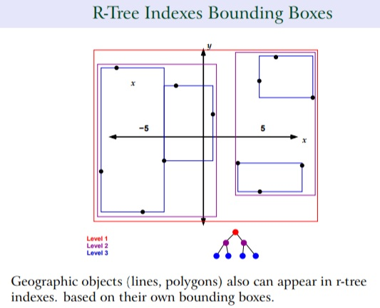
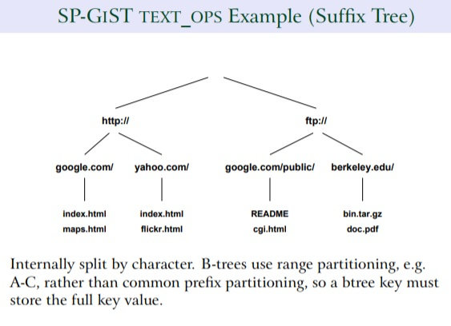

## 通过空间思想理解GiST索引的构造  
                           
### 作者          
digoal          
          
### 日期           
2017-08-25        
            
### 标签          
PostgreSQL , GIS , PostGIS , Greenplum , 空间检索 , GiST , B-Tree , geohash         
     
----     
     
## 背景    
可以支持空间检索的GiST索引的数据结果到底是什么样的呢？  
  
本文为以下两篇文档的增补：  
  
[《Greenplum 空间(GIS)数据检索 B-Tree & GiST 索引实践 - 阿里云HybridDB for PostgreSQL最佳实践》](../201708/20170824_02.md)    
  
[《PostGIS空间索引(GiST、BRIN、R-Tree)选择、优化 - 阿里云RDS PostgreSQL最佳实践》](../201708/20170820_01.md)    
  
## GiST索引的构造  
我们可以用空间的思想来理解它，比如我在这篇文档中讲解了为什么我们需要通过数据规整来提高geohash b-tree的检索效率。  
  
[《Greenplum 空间(GIS)数据检索 B-Tree & GiST 索引实践 - 阿里云HybridDB for PostgreSQL最佳实践》](../201708/20170824_02.md)    
  
因为这样可以让每个heap block的bound box(包含这个HEAP BLOCK中所有空间的最小BOX, 平面对象。如果是多维对象，使用多维对象的立体BOX或者多维BOX表示。)尽量的缩小，同时让不同heap block之间的边界更加的清晰，重叠少。从而提高空间数据检索的过滤性。  
  
实际上GiST索引思想与之类似，只不过它不是通过编排HEAP BLOCK来实现这一的划清边界的，而是通过R-Tree结构来表示的。这一的话，用户在写入数据时，对应的空间对象写到哪个GiST索引分支就非常的明朗。（当然，GiST索引和其他索引一样，随着数据的写入会出现SPLIT的需求。）  
  
  
  
## GiST索引对写入性能的影响(时间越小越好)  
  
```  
postgres=# create unlogged table test_gist (pos geometry);  
CREATE TABLE  
  
postgres=# create index idx_test_gist_1 on test_gist using gist (pos);  
CREATE INDEX  
  
postgres=# insert into test_gist select st_setsrid(st_makepoint(random()*360-180, random()*180-90), 4326) from generate_series(1,5000000);  
INSERT 0 5000000  
Time: 67127.758 ms  
  
postgres=# drop index idx_test_gist_1 ;  
DROP INDEX  
Time: 1056.465 ms  
  
postgres=# create index idx_test_gist_1 on test_gist using gist (pos);  
CREATE INDEX  
Time: 58945.677 ms  
```  
  
## B-Tree索引对写入的性能影响(时间越小越好)  
  
```  
postgres=# create unlogged table test_btree (pos geometry);  
CREATE TABLE  
  
postgres=# create index idx_test_btree_1 on test_btree using btree(st_geohash(pos,11));  
CREATE INDEX  
  
postgres=# insert into test_btree select st_setsrid(st_makepoint(random()*360-180, random()*180-90), 4326) from generate_series(1,5000000);  
INSERT 0 5000000  
Time: 30199.098 ms  
  
postgres=# drop index idx_test_btree_1 ;  
DROP INDEX  
Time: 50.565 ms  
  
postgres=# create index idx_test_btree_1 on test_btree using btree(st_geohash(pos,11));  
CREATE INDEX  
Time: 7746.942 ms  
```  
  
## BRIN索引对写入性能的影响(时间越小越好)  
  
```  
postgres=# create unlogged table test_brin (pos geometry);  
CREATE TABLE  
  
postgres=# create index idx_test_brin_1 on test_brin using brin(pos);  
CREATE INDEX  
  
postgres=# insert into test_brin select st_setsrid(st_makepoint(random()*360-180, random()*180-90), 4326) from generate_series(1,5000000);  
INSERT 0 5000000  
Time: 7476.996 ms  
  
postgres=# drop index idx_test_brin_1 ;  
DROP INDEX  
Time: 1.604 ms  
  
postgres=# create index idx_test_brin_1 on test_brin using brin(pos);  
CREATE INDEX  
Time: 1697.741 ms  
```  
  
## GiST实际上是一个通用的索引框架，支持多种数据类型  
  
不仅仅空间类型，更多复杂的类型GiST或者SP-GiST索引也支持。  
  
  
  
## 小结
GiST直接构建在空间列上，对性能影响最大。  
  
Btree直接构建在空间列上，使用表达式(st_geohash)构建btree索引，对性能影响较小。  
  
BRIN直接构建在空间列上，对性能影响最小。   
  
## 参考  
  
[《Greenplum 空间(GIS)数据检索 B-Tree & GiST 索引实践 - 阿里云HybridDB for PostgreSQL最佳实践》](../201708/20170824_02.md)    
  
[《PostGIS空间索引(GiST、BRIN、R-Tree)选择、优化 - 阿里云RDS PostgreSQL最佳实践》](../201708/20170820_01.md)    
  
[Flexible Indexing with Postgres](20170825_01_pdf_001.pdf)  
  
  
  
<a rel="nofollow" href="http://info.flagcounter.com/h9V1"  ></a>  
  
  
  
  
  
  
## [digoal's 大量PostgreSQL文章入口](https://github.com/digoal/blog/blob/master/README.md "22709685feb7cab07d30f30387f0a9ae")
  
