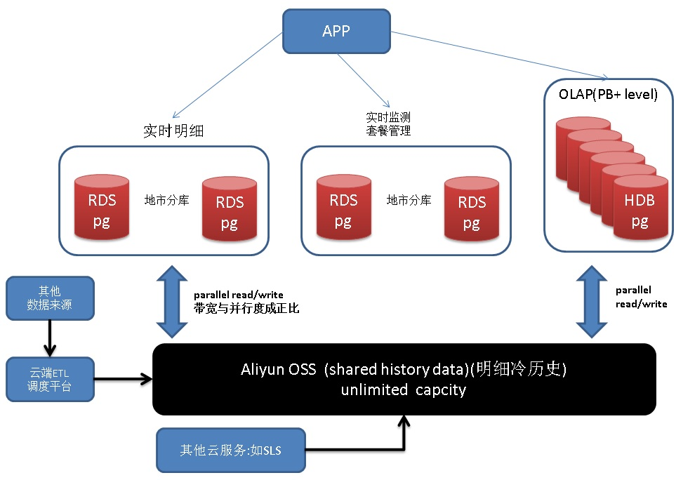
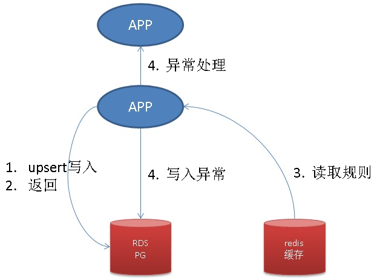

## 泛电网系统 海量实时计算+OLTP+OLAP DB设计 - 阿里云(RDS、HybridDB) for PostgreSQL最佳实践  
                               
### 作者              
digoal              
              
### 日期               
2017-08-26            
                
### 标签              
PostgreSQL , 国家电网 , 电表 , 余额 , 流式计算 , 状态监测 , 上下文相关       
         
----         
         
## 背景        
电网系统是一个关系民生，又非常典型的传统系统，虽然传统，量可不小。在互联网化（物联网化）的今天，有很多值得借鉴和思考的点供给其他相关系统参考。   
  
每个省份大概有亿级户电表，最大的地市可能有千万户级别。  
  
以往我们电费是怎么交的呢？我们小区是两个月交一次，也就是说先消费，再付款的方式。这么说起来电网真的是很仁义啊，现在哪有这么多先消费再付款的呀。移动话费、家庭宽带、天然气等等，都是充值后使用的，欠费就给你停机停网。  
  
不过还好，社会主义国民素质都是很不错的，没有那么多用霸王电的，不交的话国家电网指定拉闸。  
  
但是电费如果改成充值形式的，你会不会不习惯呢？操表员的岗位会逐渐淡出（估计很多地方已经没有抄表员了）。  
  
即使不改充值形式，实际上电力系统也还有很多事情是可做的，例如已家庭、小区、片区、行政区为分组的用电量实时监测、加速度监测、数据大盘、数据预测、应急响应 等等。  
  
系统又该如何来设计呢？  
  
下面以电表实时监测为例，讲解这个系统的设计，以及压测。  
  
## 业务需求分析  
  
每个电表，每隔5分钟采集一次电表数据。  
  
记录用电明细（用于将来的大盘分析），同时更新用户的最后用电数据（提供也应用判断用户是否超量用电、是否盗电等）。  
  
可能涉及到几张表：  
  
1、用电明细（每次上传的读数、用于对账、分析等）  
  
电表ID，时间，读数  
  
2、用户实时用电量（实时状态、规则预警、响应）  
  
电表ID，上次时间，当前时间，日初读数，月初读数，年初读数，上次读数，当前读数  
  
3、预警规则表  
  
比如5分钟增量大于多少  
  
比如5分钟内用电为负数  
  
4、异常用电明细（异常预警明细）  
  
5、用户账户（余额、套餐等）  
  
电表ID，余额，套餐ID，创建时间，更新时间  
  
6、元数据（套餐信息）  
  
套餐ID，是否峰谷电，计价等信息  
  
7、用户充值记录  
  
## G点分析  
1、分析需求  
  
全国我们估计10亿级电表数，每5分钟一个点，一天2880亿数据，一年105万亿记录。量还是蛮大的。  
  
当然，通常明细统计不会这么大的范围，通常是地级市级别（千万级户数），一天28.8亿，一年1万亿左右。  
  
阿里云HybridDB for PostgreSQL是一个分布式MPP数据库，面向PB级数据分析型业务。具备非常强大的计算能力、存储能力、OLAP功能（GIS、JSON、分析函数、多维分析、窗口、列存储、分区、横向扩展等）。  
  
2、实时预警需求  
  
对单个地市，每5分钟的数据流量约千万级别。每天28.8亿流量。  
  
阿里云RDS PostgreSQL支持处理每天千亿级别的数据流量。28.8亿非常轻松。  
  
PostgreSQL 在全球有非常多的应用，从军工、科研、商业到民用，无所不在（天文、新零售、时序、菜鸟、高德、流计算、时空搜索、任意维度挖掘、JSON、图式搜索、文本搜索、图像相似搜索、金融风控等）。  
  
[《PostgreSQL 应用案例》](../201706/20170601_02.md)  
  
3、套餐管理  
  
套餐管理属于典型的OLTP系统，阿里云RDS PostgreSQL可以非常好的支持。  
  
## 架构设计  
  
  
设计以及性能指标参考：  
  
1、明细数据，实时写入RDS PostgreSQL，单台RDS PG写入量可以做到每秒约200万行，每天写入约1700亿左右。  
  
建立小时级分区表。  
  
RDS PG支持读写OSS外部表，支持并行将数据写出到OSS对象存储。  
  
2、分析需求，使用HybridDB for PostgreSQL。  
  
HDB for PG支持PG级海量数据分析，同时支持并行读写OSS对象存储。支持并行计算、列存、压缩、分析特性等。  
  
阿里内部有大量的HDB for PG应用案例，百TB 以上级别比比皆是。  
  
3、调度系统，将明细数据从RDS PG，经OSS，导入HDB for PostgreSQL。整个过程数据都是并行处理的，不存在瓶颈。  
  
4、实时监测、预警，采用RDS PG。单台RDS PG支持每秒30万左右的单步更新(批量性能可以更好)，每天更新量260亿左右。直辖市级地市完全不是问题。  
  
5、其他套餐相关OLTP需求，采用RDS PG。  
  
6、历史明细，例如1年前的明细。使用OSS存储。  
  
使用OSS存储后，RDS PG， HDB PG可以使用OSS外部表，透明访问这些历史。即便需要分析，或者查询明细也没有问题。  
  
## 扩容设计  
1、明细业务扩容  
  
按地市分库，对于超级庞大地市，可以按电表HASH再分。（RDS PG单机已经有非常庞大的计算能力，后面会有性能指标数据。水平扩容的可能性极低）  
  
2、分析业务扩容。  
  
HybridDB for PG，本身就是一个MPP数据库，支持PB级体量的运算，通过OSS对象存储与计算分离，支持几乎无限容量的存储。  
  
3、实时监测业务扩容。  
  
按地市分库，对于超级庞大地市，可以按电表HASH再分。（RDS PG单机已经有非常庞大的计算能力，后面会有性能指标数据。水平扩容的可能性极低）  
  
4、其他套餐相关OLTP业务扩容。  
  
业务量很小，不需要考虑扩容。  
  
## 明细业务 DEMO  
明细业务很简单，就是单纯的写入。我有写过很多类似的案例，可以参考如下案例中的数据。  
  
1、运营商网关数据，金融行业数据，产生量大，并且要求快速插入大数据库中持久化保存。     
  
506万行/s，1.78 GB/s，全天插入4372亿，154TB数据。       
  
[《PostgreSQL 如何潇洒的处理每天上百TB的数据增量》](../201603/20160320_01.md)    
  
2、[《PostgreSQL on ECS + 云盘》](../201708/20170812_01.md)    
  
173万行/s，全天插入1500亿。  
  
## 分析 + 调度业务 DEMO  
数据从OLTP系统，通过调度系统写入OLAP系统，OLAP实现数据分析。整个流程如何实现的？请参考如下文章：  
  
[《打造云端流计算、在线业务、数据分析的业务数据闭环 - 阿里云RDS、HybridDB for PostgreSQL最佳实践》](../201707/20170728_01.md)    
  
## 实时监测 DEMO  
即将发布的PG 10将包含流计算插件，实时监测除了使用传统的手段，也可以使用PostgreSQL流计算插件来实现，流计算性能指标参考如下：  
  
[《"物联网"流式处理应用 - 用PostgreSQL实时处理(万亿每天)》](../201512/20151215_01.md)    
  
[《流计算风云再起 - PostgreSQL携PipelineDB力挺IoT》](../201612/20161220_01.md)    
  
另外，本文将介绍实时监测的传统详细用法如下，毕竟大多数用户还是很传统的。  
  
### 表结构设计  
demo涉及到三张表：  
  
1、用户实时用电量（实时状态、规则预警、响应）  
  
电表ID，上次时间，当前时间，日初读数，月初读数，年初读数，上次读数，当前读数  
  
insert returning  
  
2、预警规则表  
  
比如5分钟增量大于多少  
  
比如5分钟内用电为负数  
  
select ，CACHE  
  
3、异常用电明细（异常预警明细）  
  
insert  
  
流程如下：  
  
  
  
### 建表和QUERY  
我们这里只需要测试压力最大的，实时电表数据更新和返回。  
  
```  
create table tbl_real_data (  
  uid int primary key,   -- 电表ID  
  last_time timestamp,   -- 上次更新时间  
  curr_time timestamp,   -- 当前时间  
  d1 float4,   -- 日初读数，业务提供  
  d2 float4,   -- 月初读数，业务提供  
  d3 float4,   -- 年初读数，业务提供  
  d4 float4,   -- 上次读数  
  d5 float4    -- 当前读数，业务提供  
);  
```  
  
QUERY设计，更新，并返回更新后的数据  
  
```  
insert into tbl_real_data values ($1,$2,$3,$4,$5,$6,$7,$8)   
  on conflict (uid) do   
  update set   
    last_time=tbl_real_data.curr_time,  
    curr_time=excluded.curr_time,  
    d1=coalesce(excluded.d1,tbl_real_data.d1),  
    d2=coalesce(excluded.d2,tbl_real_data.d2),  
    d3=coalesce(excluded.d3,tbl_real_data.d3),  
    d4=tbl_real_data.d5,  
    d5=excluded.d5  
  returning *;  
```  
  
例子，插入实时电表数据，并返回更新前、更新后的状态。业务根据返回的数据、规则实时预警、响应。  
  
```  
insert into tbl_real_data values (  
  1,      -- 电表ID  
  null,   -- 上次的更新时间  
  now(),  -- 当前时间  
  2,      -- 日初读数，业务提供，翻转时提供  
  3,      -- 月初读数，业务提供，翻转时提供  
  4,      -- 年初读数，业务提供，翻转时提供  
  null,   -- 上次读数  
  6       -- 当前读数  
)   
  on conflict (uid) do   
  update set   
    last_time=tbl_real_data.curr_time,  
    curr_time=excluded.curr_time,  
    d1=coalesce(excluded.d1,tbl_real_data.d1),  
    d2=coalesce(excluded.d2,tbl_real_data.d2),  
    d3=coalesce(excluded.d3,tbl_real_data.d3),  
    d4=tbl_real_data.d5,  
    d5=excluded.d5  
  returning *;  
  
 uid | last_time |         curr_time          | d1 | d2 | d3 | d4 | d5   
-----+-----------+----------------------------+----+----+----+----+----  
   1 |           | 2017-08-26 12:19:54.486801 |  2 |  3 |  4 |    |  6  
(1 row)  
  
insert into tbl_real_data values (  
  1,      -- 电表ID  
  null,   -- 上次的更新时间  
  now(),  -- 当前时间  
  null,   -- 日初读数，业务提供，翻转时提供  
  null,   -- 月初读数，业务提供，翻转时提供  
  null,   -- 年初读数，业务提供，翻转时提供  
  null,   -- 上次读数  
  8       -- 当前读数  
)   
  on conflict (uid) do   
  update set   
    last_time=tbl_real_data.curr_time,  
    curr_time=excluded.curr_time,  
    d1=coalesce(excluded.d1,tbl_real_data.d1),  
    d2=coalesce(excluded.d2,tbl_real_data.d2),  
    d3=coalesce(excluded.d3,tbl_real_data.d3),  
    d4=tbl_real_data.d5,  
    d5=excluded.d5  
  returning *;  
  
 uid |         last_time          |         curr_time          | d1 | d2 | d3 | d4 | d5   
-----+----------------------------+----------------------------+----+----+----+----+----  
   1 | 2017-08-26 12:19:54.486801 | 2017-08-26 12:20:01.452364 |  2 |  3 |  4 |  6 |  8  
(1 row)  
  
返回了上一个状态，业务根据这些信息、以及配置的规则，进行实时预警。  
```  
  
### 压测  
  
压测脚本如下，1000户，随机upsert，返回最终状态和上一个状态。  
  
```  
vi test.sql  
  
\set uid random(1,10000000)  
\set d5 random(1,100000)  
insert into tbl_real_data (uid,curr_time,d5) values (:uid, now(), :d5)   on conflict (uid) do   update set     last_time=tbl_real_data.curr_time,    curr_time=excluded.curr_time,    d1=coalesce(excluded.d1,tbl_real_data.d1),    d2=coalesce(excluded.d2,tbl_real_data.d2),    d3=coalesce(excluded.d3,tbl_real_data.d3),    d4=tbl_real_data.d5,    d5=excluded.d5  returning *;  
```  
  
结果  
  
```  
pgbench -M prepared -n -r -P 1 -f ./test.sql -c 64 -j 64 -T 120  
  
tps = 291094.784574 (including connections establishing)  
tps = 291123.921221 (excluding connections establishing)  
```  
  
## 性能指标  
  
1、明细业务（单库性能指标）  
  
173万行/s，全天插入1500亿明细。可以满足4.7亿户的大地市需求。   
  
（5分钟上传一次电表读数，需要防止风暴，例如采用随机开始时间。）    
  
2、分析业务  
  
PB级。  
  
3、实时监测业务（单库性能指标）  
  
29万行/s，全天监测次数250亿次。可以满足8000万户的大地市需求。    
  
（5分钟上传一次电表读数，需要防止风暴，例如采用随机开始时间。）    
   
城市人口规模统计数据（截取自互联网）：   
  
重庆3000万规模，北京2300万规模，东京3700万规模。电表户数按3:1算，也在1000万出头。PostgreSQL单机能力远超全球最大人口城市的需求。        
  
## 云端产品  
[阿里云 RDS PostgreSQL](https://www.aliyun.com/product/rds/postgresql)    
    
[阿里云 HybridDB for PostgreSQL](https://www.aliyun.com/product/gpdb)    
  
[阿里云 海量对象存储OSS](https://www.aliyun.com/product/oss)  
  
[阿里云 RDS redis](https://www.aliyun.com/product/kvstore)  
  
## 小结  
电网系统是关系到民生的系统，以往我们电费基本上都是按月结算，将来水电都有可能会像手机话费、天然气一样套餐的形式。  
  
计费实际上也不是特别简单，涉及到峰谷电、阶梯价、商业、工业电等，将来如果有套餐出现，会更加复杂。  
  
不过不用担心，阿里云RDS PG, HDB PG, OSS, redis等云端产品，从“用电明细、实时监测、全网海量OLAP分析、套餐类OLTP管理”等方面着手，可以很好的解决电网系统的需求。  
  
## 参考  
  
[《PostgreSQL物理"备库"的哪些操作或配置，可能影响"主库"的性能、垃圾回收、IO波动》](../201704/20170410_03.md)    
  
[《PostgreSQL 老湿机图解平安科技遇到的垃圾回收"坑"》](../201607/20160715_01.md)    
  
[《PostgreSQL 9.6 快照过旧 - 源码浅析》](../201610/20161005_02.md)    
  
[《PostgreSQL on Linux 最佳部署手册》](../201611/20161121_01.md)    
  
[《PostgreSQL on ECS多云盘的部署、快照备份和恢复》](../201708/20170812_01.md)    
  
实时监测业务注意，垃圾回收相关参数设置：  
  
[《垃圾回收设置避免IO波动》](../201704/20170410_03.md)    
  
  
<a rel="nofollow" href="http://info.flagcounter.com/h9V1"  ></a>  
  
  
  
  
  
  
## [digoal's 大量PostgreSQL文章入口](https://github.com/digoal/blog/blob/master/README.md "22709685feb7cab07d30f30387f0a9ae")
  
