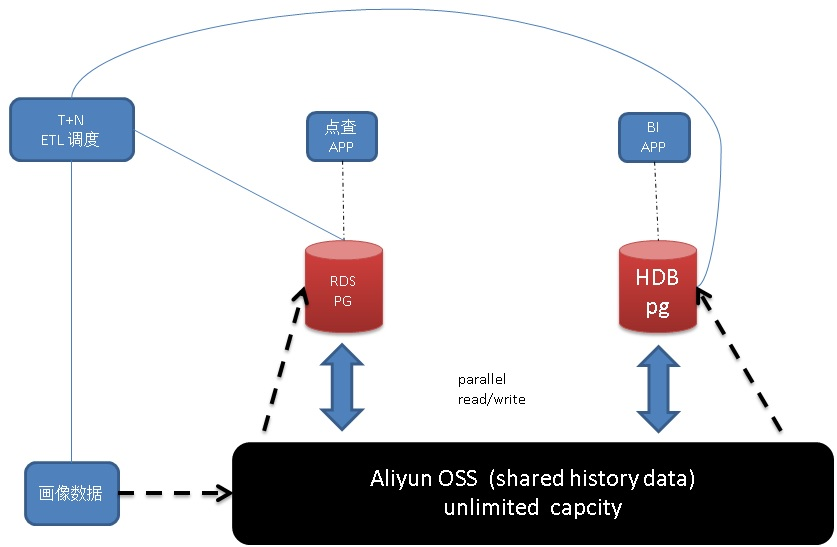
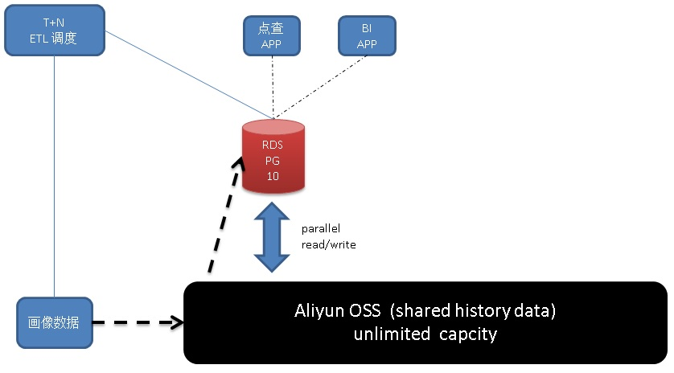

## 音视图(泛内容)网站透视分析 DB设计 - 阿里云(RDS、HybridDB) for PostgreSQL最佳实践     
                                 
### 作者                
digoal                
                
### 日期                 
2017-08-27              
                  
### 标签                
PostgreSQL , 用户透视 , 设备透视 , 圈人 , 标签 , 视频网站 , 优酷 , 土豆 , 喜马拉雅      
           
----           
           
## 背景   
日常生活中，人们使用最多的除了社交类网站、购物网站，估计就是音频、视频、图文信息类内容网站了。  
  
视频网站，已经渗透到各种终端，除了喜闻乐见的手机，还包括移动终端、电脑、盒子、电视、投影仪等。有设备属性、会员属性、渠道属性等。  
  
内容运营是非常重要的环节，而透视则是运营的重要武器。  
  
## 业务需求  
  
1、生成设备、会员画像  
  
ID、各个维度的标签、其中包括一些多值列标签（例如最近7天、一个月看过的导演、演员主演的片子，。。。。。。）  
  
通常多值列的值可能是几十万的量（几十万演员，几十万片源，。。。）。通常一个设备、人有几十上百个属性列。通常一个设备单个多值列内可能有几十个VALUE。  
  
2、画像透视  
  
2\.1、根据任意标签条件组合查询满足条件的数目（圈中设备、会员的数目，count）  
  
2\.2、根据任意标签条件组合圈选出人群，统计该人群某些列中各种的分别数目比例（count, group by, 分位数, 多维透视）    
  
并发要求较低。  
  
多维透视和分位数统计详见：  
  
[《PostgreSQL 9.5 new feature - Support GROUPING SETS, CUBE and ROLLUP.》](../201505/20150526_02.md)    
  
[《PostgreSQL aggregate function 2 : Aggregate Functions for Statistics》](../201503/20150303_03.md)    
  
3、圈选目标设备、会员  
  
根据任意标签条件组合分页查询满足条件的id列表（圈出满足条件的设备或会员）  
  
并发要求较低。  
  
4、点查（键值查询）需求（根据任意标签条件组合和用户id查询这个用户是否满足该圈人规则）。  
  
点查的并发需求较高，可能达到几万次请求每秒。  
  
小结，量级估算：  
  
作为一个音频视频网站，内容数目通常不会超过百万（当然，引入了小视频、自媒体后，也许有可能达到亿甚至百亿级别）。  
  
用户数+设备数顶到天也就百亿（地球人口才多少呀）。而且设备是会老化的，活跃设备数，估计顶天也就十亿级别。  
  
标签列数，这个看抽象能力，就以百来计吧。多值列（例如喜欢的演员、影片、导演等）的占比可能较多，预计一半一半吧。  
  
多值列的VALUE范围（例如演员、影片、导演等），预计在百万级别。（A用户喜爱综艺明星标签：汪涵,张宇,刘维）  
  
多值列标签，预计在几十个的级别，通常对运营有效的是最近看过的影片。除了鉴黄师，一般也不会一天到晚的看电影对吧。  
  
## G点分析  
  
1、多值列的存储和透视。  
  
1\.1 多值列的存储：  
  
PostgreSQL支持数组类型，可以作为多值标签列的数据类型。同时由于它是一个数据类型，所以内置了数组常见的包含、相交、不相交、叠加、UNNEST、类型转换的操作符和函数。使用起来非常方便。  
  
https://www.postgresql.org/docs/9.6/static/functions-array.html  
  
1\.2 多值列的透视：  
  
例如用户喜爱的演员是个多值列，求浙江省的用户最喜爱的演员TOP 10。  
  
表级统计，可以直接使用统计信息进行估计：  
  
[《PostgreSQL pg_stats used to estimate top N freps values and explain rows》](../201308/20130811_01.md)    
  
如果是带条件的TOP N，需要实际的运算，unnest(array)即可，例如  
  
```  
select unnest(c2) as c2, count(*) from   -- 使用unnest将数组元素解开进行统计  
  tbl  
group by 1  
order by 2 desc   
limit 10;       -- 求c2多值列，在某个条件下的TOP 10元素  
```  
  
2、时间、空间（地理位置）维度分析  
  
会员、设备实际上是有地理位置属性的，我们可以加入GIS透视。PostgreSQL支持geometry类型、索引、操作符、聚合函数、窗口函数、聚类分析函数等。在GIS方面的处理能力特别强悍。  
  
有许多案例可以参考：  
  
[《通过空间思想理解GiST索引的构造》](../201708/20170825_01.md)    
  
[《Greenplum 空间(GIS)数据检索 b-tree & GiST 索引实践 - 阿里云HybridDB for PostgreSQL最佳实践》](../201708/20170824_02.md)    
  
[《数据寻龙点穴（空间聚集分析） - 阿里云RDS PostgreSQL最佳实践》](../201708/20170820_02.md)    
  
[《PostGIS空间索引(GiST、BRIN、R-Tree)选择、优化 - 阿里云RDS PostgreSQL最佳实践》](../201708/20170820_01.md)    
  
[《PostGIS 空间数据学习建议》](../201708/20170809_01.md)    
  
[《(新零售)商户网格化(基于位置GIS)运营 - 阿里云RDS PostgreSQL、HybridDB for PostgreSQL最佳实践》](../201708/20170802_02.md)    
  
[《时间、空间、对象多维属性 海量数据任意多维 高效检索 - 阿里云RDS PostgreSQL最佳实践》](../201707/20170722_01.md)    
  
[《SRID (空间引用识别号, 坐标系)》](../201707/20170718_01.md)    
  
[《PostgreSQL\GPDB 毫秒级海量时空数据透视 典型案例分享》](../201706/20170629_01.md)    
  
[《PostgreSQL\GPDB 毫秒级海量多维数据透视 案例分享》](../201706/20170625_01.md)    
  
[《空间复合索引加速空间搜索》](../201706/20170620_01.md)    
  
[《自动选择正确索引访问接口(btree,hash,gin,gist,sp-gist,brin,bitmap...)的方法》](../201706/20170617_01.md)    
  
[《无人驾驶背后的技术 - PostGIS点云(pointcloud)应用 - 2》](../201705/20170523_01.md)    
  
[《无人驾驶背后的技术 - PostGIS点云(pointcloud)应用 - 1》](../201705/20170519_02.md)    
  
[《geohash vs PostGIS》](../201704/20170422_01.md)    
  
[《奔跑吧，大屏 - 时间+空间 实时四维数据透视》](../201704/20170413_02.md)    
  
[《视觉挖掘与PostGIS空间数据库的完美邂逅 - 广告营销\圈人》](../201703/20170328_04.md)    
  
[《PostGIS 多点几何类型 空字符构造异常CASE》](../201703/20170328_03.md)    
  
[《开放地图OpenStreetMap与PostGIS的三生三世十里桃花》](../201703/20170327_01.md)    
  
[《基于PostgreSQL和地理位置信息打造的洞察平台 - CARTO》](../201703/20170315_02.md)    
  
[《PostGIS 地理信息、栅格数据 多核并行处理(st_memunion, st_union)》](../201703/20170307_03.md)    
  
[《蜂巢的艺术与技术价值 - PostgreSQL PostGIS's hex-grid》](../201701/20170124_01.md)    
  
[《(AR虚拟现实)红包 技术思考 - GIS与图像识别的完美结合》](../201701/20170113_01.md)    
  
[《如何建立GIS测试环境 - 将openstreetmap的样本数据导入PostgreSQL PostGIS库》](../201609/20160906_01.md)    
  
[《PostgreSQL 最佳实践 - 块级增量备份(ZFS篇)单个数据库采用多个zfs卷(如表空间)时如何一致性备份》](../201608/20160823_07.md)    
  
[《PostgreSQL 百亿地理位置数据 近邻查询性能》](../201601/20160119_01.md)    
  
[《GIS附近查找性能优化 - PostGIS long lat geometry distance search tuning using gist knn function》](../201308/20130806_01.md)    
  
[《PostgreSQL 9.1 nearest-neighbor search use gist index》](../201110/20111018_01.md)    
  
3、运算量  
  
透视需求，需要较大运算能力。PostgreSQL 9.6开始支持多核并行，以目前的10万左右的硬件，单机每秒可以处理的吞吐约10GB/s，已经达到了HTAP的水准。  
  
如果要寻求更好的分析计算能力，可以采用阿里云HybridDB for PostgreSQL，属于PostgreSQL的多机并行(OLAP)版本。支持列存储、行存储、压缩、多机并行等特性。  
  
4、数据导入  
  
通常视频系统的用户画像实时性要求并不高，每天都会生成新的用户画像，每天将生成的画像写入阿里云RDS PostgreSQL或HybridDB for PostgreSQL，提供透视即可。  
  
## 架构设计  
为了同时满足透视、高并发点查的需求。有两套方案可以实现。  
  
### 方案1：阿里云 RDS PG 9.4 + HDB PG  
  
  
通过ETL调度系统，画像数据经过OSS导入RDS PG和HDB PG。  
  
点查需求交给RDS PG 9.4。  
  
透视需求交给HDB PG。  
  
### 方案2：阿里云 RDS PG 10  
  
  
RDS PG 10，支持多核并行，64核的机器每秒处理的数据约10GB（硬盘的带宽视情况，通常单块NVME卡可以达到约1.6GB/s）。很容易估算透视的时间。  
  
如果业务的透视需求时间允许，可以考虑只使用RDS PG 10来实现业务的目标。  
  
另一方面，RDS PG 10支持多个索引BITMAP SCAN合并扫描，实际上不需要扫描全表。效率非常高。  
  
[《PostgreSQL bitmapAnd, bitmapOr, bitmap index scan, bitmap heap scan》](../201702/20170221_02.md)    
  
[《多字段，任意组合条件查询(无需建模) - 毫秒级实时圈人 最佳实践》](../201706/20170607_02.md)    
  
## DEMO 1（方案1 验证与性能）  
  
### 产生随机多值列的函数  
创建一个函数，方便产生我们需要的多值列。  
  
```  
create or replace function gen_rand_int(  
  int,  -- 类别数量：影片、演员、分类(喜剧、恐怖...)、年份、种类(电影、电视剧...).... 。  
  int,  -- 热门类别数量，类似大V数。必须小于$1  
  int   -- 标签数  
) returns int[] as $$  
  select array(  
    select (ceil(random()*$1))::int+$2 from generate_series(1,$3/2)  -- 一半普通  
    union all   
    select (ceil(random()*$2))::int from generate_series(1,$3/2)     -- 一半热门  
  ) ;  
$$ language sql strict;  
  
postgres=# select gen_rand_int(10000,100,30);  
                                                      gen_rand_int                                                         
-------------------------------------------------------------------------------------------------------------------------  
 {5946,6877,7287,9091,1761,4870,2100,573,8388,2079,1400,9744,703,4834,6843,18,13,32,97,53,68,43,72,32,62,85,47,15,79,70}  
(1 row)  
  
postgres=# select gen_rand_int(10000,100,30);  
                                                       gen_rand_int                                                         
--------------------------------------------------------------------------------------------------------------------------  
 {4558,3818,3836,1744,2808,5496,6513,4808,5969,4801,6786,7268,4444,7388,2002,11,91,32,43,88,85,11,30,56,43,92,40,90,7,19}  
(1 row)  
  
postgres=# select gen_rand_int(10000,100,30) from generate_series(1,10);  
                                                       gen_rand_int                                                          
---------------------------------------------------------------------------------------------------------------------------  
 {5950,6793,6047,7559,4635,1463,8022,1337,9059,8822,1641,6099,116,6626,5311,77,89,62,30,72,48,56,29,72,72,61,29,64,60,38}  
 {9932,1943,579,5878,9401,5113,7241,7322,6349,6200,6043,7889,2199,6059,4415,74,37,32,35,66,3,83,22,31,54,93,91,83,56,51}  
 {2109,5528,7033,2587,1306,6333,7600,8446,3555,3848,4546,9498,1636,6644,5456,59,39,90,90,74,56,93,56,77,24,10,70,15,92,26}  
 {6594,1261,8079,3526,3748,9284,9759,1247,7630,3213,4995,2075,2610,6531,8619,79,23,24,69,13,97,24,5,53,1,28,62,70,42,54}  
 {9646,769,6562,7625,4195,210,6808,3853,1356,4337,6966,6251,6312,9476,2681,48,73,49,72,41,62,68,65,66,21,65,94,82,35,36}  
 {3558,3132,4296,10019,657,8391,128,7364,2143,1384,1601,9008,7534,7813,8383,1,25,56,49,96,97,10,64,61,76,84,26,70,65,61}  
 {543,10050,9165,4739,9969,9721,3029,9997,6985,5071,1280,8486,3979,8714,6198,22,87,86,77,36,81,73,45,45,34,21,28,59,90,93}  
 {2024,9511,9292,1089,4149,9160,710,7078,9056,7595,2048,236,5980,5927,8850,20,80,74,6,57,9,87,30,54,31,64,75,58,22,64}  
 {5106,4223,5900,4297,5211,9949,3357,5821,6926,2313,3315,8874,2449,9195,4701,11,11,26,85,16,83,94,2,13,48,33,76,22,90,98}  
 {8637,4072,3953,4436,8268,9064,4285,1525,4784,1110,3737,7999,9884,6086,7093,44,71,81,70,56,97,53,50,99,65,97,31,40,18,21}  
(10 rows)  
```  
  
### 画像表  
  
1、阿里云 RDS PostgreSQL  
  
```  
-- 70个字段  
-- 40个INT字段，10000,1000,100取值范围。  
-- 30个数组字段，使用上述随机数组生成函数（总标签数10万，热门标签150，关注标签数20）  
  
-- PostgreSQL 10  
do language plpgsql $$  
declare  
  sql text := '';  
begin  
  for i in 1..10 loop  
    sql := sql||'c'||i||' int default random()*10000,';  
  end loop;  
  for i in 11..20 loop  
    sql := sql||'c'||i||' int default random()*1000,';  
  end loop;  
  for i in 21..40 loop  
    sql := sql||'c'||i||' int default random()*100,';  
  end loop;  
  for i in 41..70 loop  
    sql := sql||'c'||i||' int[] default gen_rand_int(100000,150,20),';  
  end loop;  
  sql := rtrim(sql, ',');  
  sql := 'create table test ('||sql||') with (autovacuum_enabled=off, toast.autovacuum_enabled=off, parallel_workers=32)';  
  execute sql;  
end;  
$$;  
  
/*   
  
-- 建立分区表  
  
-- PostgreSQL 10  
do language plpgsql $$  
declare  
begin  
  for i in 1..64 loop  
    execute 'create unlogged table test'||i||'(like test including all) inherits(test) with (autovacuum_enabled=off, toast.autovacuum_enabled=off, parallel_workers=32)';  
  end loop;  
end;  
$$;  
  
*/  
```  
  
2、阿里云HybridDB for PostgreSQL  
  
```  
-- Greenplum  
  
create or replace function cb() returns void as   
$$  
declare  
  sql text := '';  
begin  
  for i in 1..10 loop  
    sql := sql||'c'||i||' int default random()*10000,';  
  end loop;  
  for i in 11..20 loop  
    sql := sql||'c'||i||' int default random()*1000,';  
  end loop;  
  for i in 21..40 loop  
    sql := sql||'c'||i||' int default random()*100,';  
  end loop;  
  for i in 41..70 loop  
    sql := sql||'c'||i||' int[] default gen_rand_int(100000,150,20),';  
  end loop;  
  sql := rtrim(sql, ',');  
  sql := 'create table test ('||sql||') with (APPENDONLY=true, ORIENTATION=column, COMPRESSTYPE=zlib, CHECKSUM=false, COMPRESSLEVEL=5) distributed randomly';  
  execute sql;  
end;  
$$ language plpgsql strict;  
  
select cb();  
```  
  
### 数据导入  
  
1、写入示例  
  
```  
insert into test values (1);  
  
postgres=# select * from test;  
-[ RECORD 1 ]-------------------------------------------------------------------------------------------  
c1  | 1  
c2  | 4880  
c3  | 6058  
c4  | 1080  
c5  | 9862  
c6  | 7605  
c7  | 9139  
c8  | 2541  
c9  | 5599  
c10 | 9818  
c11 | 658  
c12 | 882  
c13 | 249  
c14 | 514  
c15 | 504  
c16 | 390  
c17 | 97  
c18 | 422  
c19 | 906  
c20 | 374  
c21 | 25  
c22 | 4  
c23 | 74  
c24 | 87  
c25 | 52  
c26 | 56  
c27 | 83  
c28 | 47  
c29 | 36  
c30 | 18  
c31 | 40  
c32 | 29  
c33 | 67  
c34 | 1  
c35 | 40  
c36 | 66  
c37 | 77  
c38 | 31  
c39 | 91  
c40 | 33  
c41 | {29495,57121,21227,54417,8477,71587,93375,18150,13788,84006,84,58,133,45,38,62,128,12,133,32}  
c42 | {26442,28622,50446,93545,29479,90221,59274,6384,21385,50413,59,76,11,91,8,24,48,148,51,68}  
c43 | {82075,89069,83949,70379,18540,9073,11113,3676,17058,99304,38,65,42,113,55,86,98,144,95,130}  
c44 | {46129,2464,37175,53362,62667,42021,68922,94306,40090,2482,60,33,137,35,139,15,49,5,20,74}  
c45 | {2359,38160,92410,29984,13302,29003,86937,78513,24719,50124,98,106,79,3,36,23,66,139,14,126}  
c46 | {95012,48541,5658,86261,71773,97751,95901,3926,806,9065,80,5,71,68,50,91,111,30,58,148}  
c47 | {69608,3397,69214,21894,5231,92972,36696,48935,85503,45654,49,121,141,57,100,99,54,94,104,55}  
c48 | {71140,22280,39205,18064,67376,71903,78140,41324,91387,16578,60,92,30,14,124,38,3,29,111,131}  
c49 | {64638,6116,67292,58532,44051,33617,24049,79587,95692,93341,24,100,23,83,127,124,40,94,36,27}  
c50 | {79012,63559,78516,98686,72313,60953,23440,73888,79936,96978,91,67,5,42,4,71,92,40,40,86}  
c51 | {19894,41908,23496,35213,96590,7941,17758,23024,70375,41477,61,74,8,29,72,116,120,107,76,90}  
c52 | {67889,11450,3921,70683,39257,6576,17377,530,33128,43508,86,80,128,121,132,123,133,9,7,88}  
c53 | {46869,45123,7791,51604,64032,55412,28502,43744,26323,79136,5,141,136,11,97,45,20,123,45,70}  
c54 | {25178,87116,99137,10293,67656,86921,91847,55986,92314,96275,22,59,62,34,136,8,116,29,73,6}  
c55 | {97823,51814,97527,88109,58677,61970,17501,71964,43640,47272,28,103,52,26,118,3,6,106,87,145}  
c56 | {66630,71970,35032,7726,94002,25368,12705,71295,44055,61277,112,63,20,108,45,107,51,71,65,116}  
c57 | {94158,61360,45962,28245,78426,24621,29838,82264,94976,87266,118,92,89,20,104,80,58,123,36,124}  
c58 | {42712,98691,23844,55502,70678,53379,26818,4484,265,69948,123,142,47,42,34,14,78,78,138,71}  
c59 | {39169,69661,8193,98104,82656,77075,50890,20869,58510,74821,5,2,110,40,85,66,120,125,73,120}  
c60 | {52889,29852,74145,83896,57293,96361,93179,9204,48264,84576,84,131,81,96,128,55,62,54,86,149}  
c61 | {10646,60146,190,83857,86676,56463,27596,66435,39404,75669,70,138,8,31,114,94,25,104,108,97}  
c62 | {53342,27357,51760,7277,91190,36845,43718,31948,72670,878,47,125,92,47,101,71,131,142,21,40}  
c63 | {69836,59842,18662,75056,79995,94400,37418,96359,63166,8834,92,25,54,19,36,41,74,101,89,33}  
c64 | {67779,89791,4675,28502,20745,71397,75751,8011,65565,89284,52,53,74,80,16,44,71,71,38,16}  
c65 | {56107,85714,26515,91997,98009,49849,18926,46998,16751,77652,103,127,101,110,19,132,67,133,144,15}  
c66 | {77465,30127,44793,26290,83019,54798,54960,30160,2072,79839,61,87,98,100,75,95,25,103,15,50}  
c67 | {46151,78465,17210,13293,51346,29791,1029,95475,17972,96626,8,143,40,75,32,14,7,115,59,10}  
c68 | {55925,79647,64106,21177,46179,13831,84287,62410,82330,94244,143,43,109,19,62,36,63,64,29,90}  
c69 | {38828,23945,54898,65279,73454,76174,74600,77610,52260,13930,126,12,140,72,44,59,92,20,3,66}  
c70 | {7291,96804,71685,79699,8954,13008,3303,50744,55210,22232,16,141,69,98,89,29,62,50,145,140}  
```  
  
2、动态写入对应分区的方法  
  
PostgreSQL 10   
  
```  
create or replace function ff(  
  int,  -- 分区号  
  int   -- 写入记录数  
) returns void as $$  
declare  
begin  
  execute 'insert into test'||$1||' select random()*100 from generate_series(1,'||$2||')';  
end;  
$$ language plpgsql strict;  
```  
  
3、直接写入单表的方法  
  
PostgreSQL 10     
  
```  
vi test.sql  
insert into test select random()*100 from generate_series(1,100);  
  
nohup pgbench -M prepared -n -r -P 5 -f ./test.sql -c 64 -j 64 -t 50000 >/tmp/log 2>&1 &  
```  
  
约6.2万行每秒，性能取决于单行的大小。  
  
我这边的测试3.2亿数据占用977GB，如果单行变小，性能会随之提升。  
  
```  
transaction type: ./test.sql  
scaling factor: 1  
query mode: prepared  
number of clients: 64  
number of threads: 64  
number of transactions per client: 50000  
number of transactions actually processed: 3200000/3200000  
latency average = 102.605 ms  
latency stddev = 29.016 ms  
tps = 622.235371 (including connections establishing)  
tps = 622.236656 (excluding connections establishing)  
script statistics:  
 - statement latencies in milliseconds:  
       102.611  insert into test select random()*100 from generate_series(1,100);  
  
  
postgres=# \dt+ test  
                    List of relations  
 Schema | Name | Type  |  Owner   |  Size  | Description   
--------+------+-------+----------+--------+-------------  
 public | test | table | postgres | 977 GB |   
(1 row)  
```  
  
4、写入阿里云HybridDB for PostgreSQL  
  
```  
-- Greenplum  
  
vi test.sql  
  
\timing  
insert into test select random()*100 from generate_series(1,320000000);  
  
nohup psql -f ./test.sql >/tmp/log_gpdb 2>&1 &  
```  
  
GPDB 列存，压缩后458GB。    
  
```  
postgres=# select pg_size_pretty(pg_total_relation_size('test'));  
 pg_size_pretty   
----------------  
 458 GB  
(1 row)  
```  
  
6、也可以从PG导出到HDB，例子  
  
```  
date  
  psql -c "copy test to stdout"|psql -U dege.zzz -p 15432 -d postgres -c "copy test from stdin"   
date  
```  
  
7、大多数时候，生产环境使用的是 从OSS导入HDB或RDS PG的方法。  
  
手册如下  
  
https://help.aliyun.com/document_detail/44461.html  
  
https://help.aliyun.com/document_detail/35457.html  
  
### 透视测试(阿里云HybridDB for PostgreSQL)  
  
1、符合条件的设备、会员计数  
  
1\.1 HybridDB for PostgreSQL (列存储) 硬算  
  
等值查询：  
  
```  
postgres=# select count(*) from test where c2=1;  
 count   
-------  
 32233  
(1 row)  
Time: 581.304 ms  
```  
  
数组（多值类型）相交（包含任意）查询：  
  
```  
postgres=# select count(*) from test where c41 && array [1,2,1000];  
  count     
----------  
 40227896  
(1 row)  
Time: 10227.078 ms  
```  
  
等值 以及 数组（多值类型）相交（包含任意）查询：  
  
```  
postgres=# select count(*) from test where c40=1 and c41 && array [1,2,1000];  
 count    
--------  
 401802  
(1 row)  
Time: 6011.031 ms  
```  
  
等值 或 数组（多值类型）相交（包含任意）查询：  
  
```  
postgres=# select count(*) from test where c40=1 or c41 && array [1,2,1000];  
  count     
----------  
 43025528  
(1 row)  
Time: 9945.750 ms  
```  
  
数组（多值类型）包含（包含所有）查询：  
  
```  
postgres=# select count(*) from test where c41 @> array [1,2,1000];  
 count   
-------  
   123  
(1 row)  
Time: 10934.176 ms  
```  
  
1\.2 采用统计信息进行估算  
  
[《论count与offset使用不当的罪名 和 分页的优化》](../201605/20160506_01.md)    
  
1\.3 采用估值类型hll进行估算  
  
[《Greenplum 最佳实践 - 估值插件hll的使用(以及hll分式聚合函数优化)》](../201608/20160825_02.md)    
  
2、符合条件的数据多值列、普通列透视（TOP N）  
  
2\.1 透视多值列：  
  
```  
postgres=# select unnest(c41) c41, count(*) from test where c2=1 group by 1 order by 2 desc limit 100;  
 c41 | count   
-----+-------  
  72 |  2276  
 132 |  2255  
  65 |  2250  
 130 |  2244  
  84 |  2241  
......  
  41 |  2137  
  31 |  2137  
 137 |  2135  
(100 rows)  
  
Time: 8058.408 ms  
```  
  
2\.2 透视标量列：  
  
```  
postgres=# select c40, count(*) from test where c2=1 group by 1 order by 2 desc limit 100;  
 c40 | count   
-----+-------  
  40 |   363  
   5 |   358  
   2 |   356  
  93 |   355  
  67 |   353  
  18 |   351  
  99 |   350  
......  
  86 |   288  
  71 |   287  
  84 |   277  
   0 |   160  
(100 rows)  
  
Time: 1328.181 ms  
```  
  
### 圈选测试(阿里云HybridDB for PostgreSQL)  
  
3、圈选符合条件的设备ID、用户ID。  
  
采用游标圈选目标人群，每一页都丝般柔滑。  
  
```  
postgres=# begin;  
BEGIN  
Time: 0.764 ms  
  
postgres=# declare cur1 cursor for select c1 from test where c2=1;  
DECLARE CURSOR  
Time: 215.695 ms  
  
postgres=# fetch 10 from cur1;  
 c1   
----  
 44  
 50  
 86  
 48  
 27  
 71  
 10  
 83  
 24  
 96  
(10 rows)  
  
Time: 0.288 ms  
postgres=# fetch 10 from cur1;  
 c1   
----  
 39  
 16  
 24  
 90  
 25  
  1  
 41  
 33  
 76  
  0  
(10 rows)  
  
Time: 0.087 ms  
```  
  
圈选3万人群：  
  
```  
postgres=# explain analyze select c1 from test where c2=1 ;  
                                       QUERY PLAN                                          
-----------------------------------------------------------------------------------------  
 Gather Motion 48:1  (slice1; segments: 48)  (cost=0.00..35186640.00 rows=31953 width=4)  
   Rows out:  32233 rows at destination with 877 ms to end, start offset by 1.299 ms.  
   ->  Append-only Columnar Scan on test  (cost=0.00..35186640.00 rows=666 width=4)  
         Filter: c2 = 1  
         Rows out:  0 rows (seg0) with 10 ms to end, start offset by 62 ms.  
 Slice statistics:  
   (slice0)    Executor memory: 347K bytes.  
   (slice1)    Executor memory: 478K bytes avg x 48 workers, 494K bytes max (seg2).  
 Statement statistics:  
   Memory used: 128000K bytes  
 Settings:  optimizer=off  
 Optimizer status: legacy query optimizer  
 Total runtime: 878.970 ms  
(13 rows)  
  
Time: 880.017 ms  
```  
  
圈选5800万人群：  
  
```  
postgres=# explain analyze select c1 from test where c41 && array[1,2,100];  
                                        QUERY PLAN                                           
-------------------------------------------------------------------------------------------  
 Gather Motion 48:1  (slice1; segments: 48)  (cost=0.00..35186640.00 rows=1600000 width=4)  
   Rows out:  58538502 rows at destination with 23842 ms to end, start offset by 1.282 ms.  
   ->  Append-only Columnar Scan on test  (cost=0.00..35186640.00 rows=33334 width=4)  
         Filter: c41 && '{1,2,100}'::integer[]  
         Rows out:  0 rows (seg0) with 7.488 ms to end, start offset by 35 ms.  
 Slice statistics:  
   (slice0)    Executor memory: 347K bytes.  
   (slice1)    Executor memory: 494K bytes avg x 48 workers, 494K bytes max (seg0).  
 Statement statistics:  
   Memory used: 128000K bytes  
 Settings:  optimizer=off  
 Optimizer status: legacy query optimizer  
 Total runtime: 23843.827 ms  
(13 rows)  
  
Time: 23845.061 ms  
```  
  
圈选6万人群：  
  
```  
postgres=# explain analyze select c1 from test where c41 @> array[1,2,100];  
                                        QUERY PLAN                                          
------------------------------------------------------------------------------------------  
 Gather Motion 48:1  (slice1; segments: 48)  (cost=0.00..35186640.00 rows=320000 width=4)  
   Rows out:  63866 rows at destination with 8920 ms to end, start offset by 1.375 ms.  
   ->  Append-only Columnar Scan on test  (cost=0.00..35186640.00 rows=6667 width=4)  
         Filter: c41 @> '{1,2,100}'::integer[]  
         Rows out:  0 rows (seg0) with 28 ms to end, start offset by 13 ms.  
 Slice statistics:  
   (slice0)    Executor memory: 347K bytes.  
   (slice1)    Executor memory: 490K bytes avg x 48 workers, 494K bytes max (seg0).  
 Statement statistics:  
   Memory used: 128000K bytes  
 Settings:  optimizer=off  
 Optimizer status: legacy query optimizer  
 Total runtime: 8921.803 ms  
(13 rows)  
  
Time: 8922.994 ms  
```  
  
### 键值查询测试(阿里云RDS for PostgreSQL)  
  
4、根据设备ID、用户ID 点查  
  
(建立ID索引，本例使用BLOCK NUM进行测试，实际效果一样)  
  
```  
postgres=# select c1 from test where ctid='(1,1)';  
 c1   
----  
 49  
(1 row)  
  
Time: 0.408 ms  
```  
  
压测准备  
  
```  
postgres=# show block_size;  
 block_size   
------------  
 32768  
(1 row)  
postgres=# analyze test;  
ANALYZE  
postgres=# select relpages from pg_class where relname='test';  
 relpages   
----------  
 32000002  
(1 row)  
postgres=# select c1 from test where ctid='(1,10)';  
 c1   
----  
 28  
(1 row)  
postgres=# select c1 from test where ctid='(1,11)';  
 c1   
----  
(0 rows)  
```  
  
压测  
  
```  
vi test.sql  
  
\set x random(1,32000002)  
\set y random(1,10)  
select * from test where ctid=('('||:x||','||:y||')')::tid;  
```  
  
单次响应1.1毫秒  
  
```  
transaction type: ./test.sql  
scaling factor: 1  
query mode: extended  
number of clients: 64  
number of threads: 64  
duration: 120 s  
number of transactions actually processed: 6762499  
latency average = 1.136 ms  
latency stddev = 6.042 ms  
tps = 56349.372585 (including connections establishing)  
tps = 56353.497075 (excluding connections establishing)  
script statistics:  
 - statement latencies in milliseconds:  
         0.001  \set x random(1,32000002)  
         0.000  \set y random(1,10)  
         1.135  select * from test where ctid=('('||:x||','||:y||')')::tid;  
```  
  
由于数据977GB，超过了内存大小，如果全网数据都是热数据，磁盘读取速率达到11GB/s。  
  
```  
  1   1  98   0   0   0|  90M   33M|   0     0 |   0     0 |9775    18k  
 36  21   8  34   0   1|  11G    0 | 239B  446B|   0     0 | 426k  369k  
 37  21   8  33   0   1|  11G 4096B| 120B  334B|   0     0 | 430k  374k  
 37  22   7  32   0   2|  11G  660k| 239B  727B|   0     0 | 433k  383k  
 26  44   5  23   0   1|8313M    0 | 120B  753B|   0     0 | 307k  260k  
 35  28   7  29   0   1|  11G  172k| 477B 1183B|   0     0 | 390k  328k  
 36  17   9  37   0   2|  11G    0 | 344B 2385B|   0     0 | 441k  381k  
 33  26   8  32   0   1|  10G    0 |1449B 1093B|   0     0 | 396k  333k  
 31  34   7  26   0   1|9585M    0 | 120B  588B|   0     0 | 347k  303k  
```  
  
## 性能指标  
### 环境规格  
HybridDB for PostgreSQL规格：48C SSD。  
  
RDS PostgreSQL规格：60核。  
  
### 性能数据  
1、符合条件的设备、会员计数  
  
1\.1 等值查询：  
  
0.5 秒  
  
1\.2 数组（多值类型）相交（包含任意）查询：  
  
10 秒  
  
1\.3 等值 以及 数组（多值类型）相交（包含任意）查询：  
  
6 秒  
  
1\.4 等值 或 数组（多值类型）相交（包含任意）查询：  
  
10 秒  
  
1\.5 数组（多值类型）包含（包含所有）查询：  
  
10 秒  
  
2、符合条件的数据多值列、普通列透视（TOP N）  
  
2\.1 透视多值列：  
  
8 秒  
  
2\.2 透视标量列：  
  
1.3 秒  
  
3、圈选符合条件的设备ID、用户ID。  
  
采用游标，每一页效率一致  
  
3\.1 标量条件，圈选3万人群：  
  
总耗时 0.9 秒  
  
3\.2 多值条件，圈选5850万人群：  
  
总耗时 24 秒  
  
3\.3 多值条件，圈选6万人群：  
  
总耗时 9 秒  
  
4、根据设备ID、用户ID 点查  
  
1.1 毫秒  
  
## 云端产品  
[阿里云 RDS PostgreSQL](https://www.aliyun.com/product/rds/postgresql)      
      
[阿里云 HybridDB for PostgreSQL](https://www.aliyun.com/product/gpdb)      
    
[阿里云 海量对象存储OSS](https://www.aliyun.com/product/oss)    
  
## 小结  
视频网站，已经渗透到各种终端，除了喜闻乐见的手机，还包括移动终端、电脑、盒子、电视、投影仪等。有设备属性、会员属性、渠道属性等。  
  
内容运营是非常重要的环节，而透视则是运营的重要武器。  
  
通过阿里云RDS PostgreSQL, HybridDB for PostgreSQL，可以高效的满足（时间、空间(GIS)、多值列、单值列）的多维数据透视、人群圈选、点查等需求。  
        
  
<a rel="nofollow" href="http://info.flagcounter.com/h9V1"  ></a>  
  
  
  
  
  
  
## [digoal's 大量PostgreSQL文章入口](https://github.com/digoal/blog/blob/master/README.md "22709685feb7cab07d30f30387f0a9ae")
  
