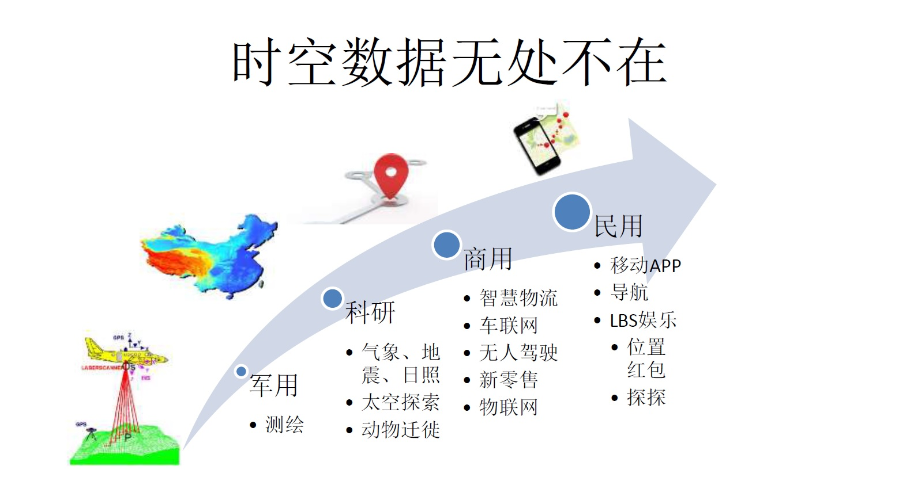
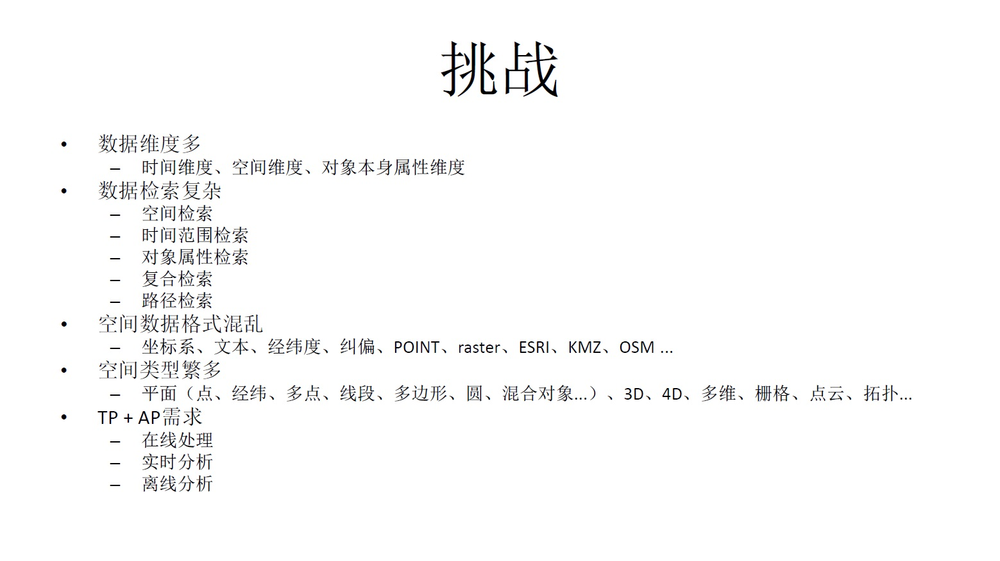
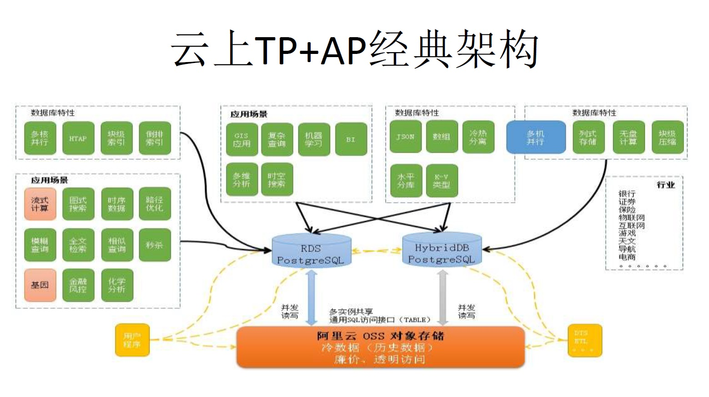
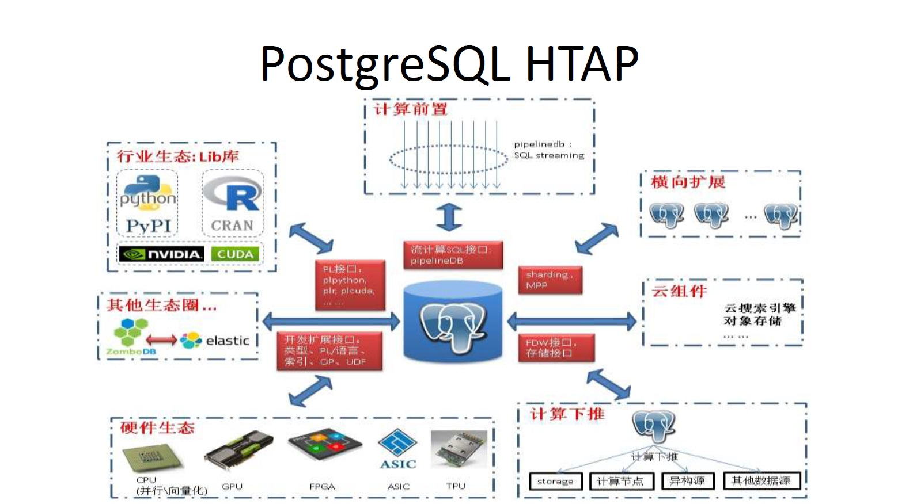
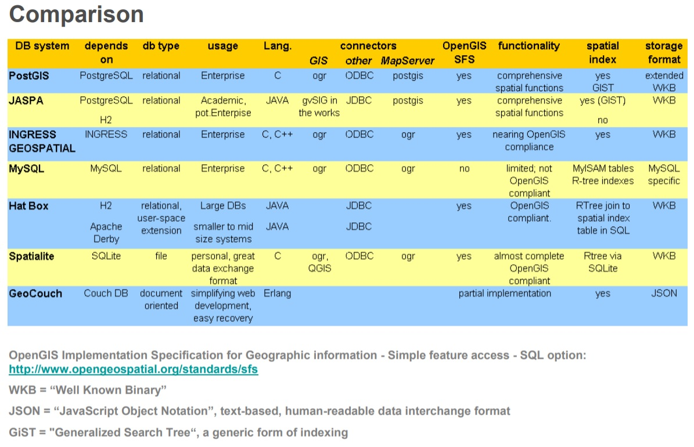

## PostgreSQL 助力企业打开时空之门 - 阿里云(RDS、HybridDB) for PostgreSQL最佳实践     
                                 
### 作者                
digoal                
                
### 日期                 
2017-08-27              
                  
### 标签                
PostgreSQL , Greenplum , 时间 , 空间 , 对象 , 多维透视 , 多维分析     
           
----           
           
## 背景   
时空数据无处不在，未来空间数据的占比会越来越高，在TP与AP场景的需求也会越来越旺盛。    
  
- 选址、网格运营
  
  空间数据自动聚集分析；时间+多边形圈人；驻留时间分析；舆情分析；...
  
- 室内定位
  
  3D坐标；相对坐标系；+以上；运营活动效果分析报表；
  
- 科研
  
  太空探索、测绘、气象、地震预测、溯源
  
- 无人驾驶
  
  点云；动态路径规划；
  
- 空间调度（菜鸟、饿了么、滴滴、高德、快递。。。）
  
  实时位置更新；多边形圈人；一到多、多到多、多到一的商旅问题；KNN搜索；。。。
  
- LBS
  
  实时位置更新；基于GIS+其他条件的推荐(探探)；附近+其他属性圈数（地图附加业务，找餐馆、加油站）；车联网；打车；。。。
  
- 导航
  
  定位、动态路径规划
  
- 时空透视
  
  滑动窗口；流式计算；多维分析；...
  
- 视觉搜索
  
  文本搜索转换为视觉搜索；(店铺id,浏览次数)，搜索浏览了某些店铺若干次到若干次或xxx的对象。
  
  
  
  
  
  
  
  
  
  
  
  
  
  
  
[《PostgreSQL 助力企业打开时空之门》](20170827_02_pdf_001.pdf)  
  
## 时空数据管理案例  
  
##### 201708/20170825_01.md   [《通过空间思想理解GiST索引的构造》](../201708/20170825_01.md)    
  
##### 201708/20170824_02.md   [《Greenplum 空间(GIS)数据检索 b-tree & GiST 索引实践 - 阿里云HybridDB for PostgreSQL最佳实践》](../201708/20170824_02.md)    
  
##### 201708/20170820_02.md   [《数据寻龙点穴（空间聚集分析） - 阿里云RDS PostgreSQL最佳实践》](../201708/20170820_02.md)    
  
##### 201708/20170820_01.md   [《PostGIS空间索引(GiST、BRIN、R-Tree)选择、优化 - 阿里云RDS PostgreSQL最佳实践》](../201708/20170820_01.md)    
  
##### 201708/20170809_01.md   [《PostGIS 空间数据学习建议》](../201708/20170809_01.md)    
  
##### 201708/20170802_02.md   [《(新零售)商户网格化(基于位置GIS)运营 - 阿里云RDS PostgreSQL、HybridDB for PostgreSQL最佳实践》](../201708/20170802_02.md)    
  
##### 201707/20170722_01.md   [《时间、空间、对象多维属性 海量数据任意多维 高效检索 - 阿里云RDS PostgreSQL最佳实践》](../201707/20170722_01.md)    
  
##### 201707/20170718_01.md   [《SRID (空间引用识别号, 坐标系)》](../201707/20170718_01.md)    
  
##### 201706/20170629_01.md   [《PostgreSQL\GPDB 毫秒级海量时空数据透视 典型案例分享》](../201706/20170629_01.md)    
  
##### 201706/20170625_01.md   [《PostgreSQL\GPDB 毫秒级海量多维数据透视 案例分享》](../201706/20170625_01.md)    
  
##### 201706/20170622_01.md   [《PostGIS 坐标转换(SRID)的边界问题 - ST_Transform》](../201706/20170622_01.md)    
  
##### 201706/20170620_01.md   [《空间复合索引加速空间搜索》](../201706/20170620_01.md)    
  
##### 201706/20170617_01.md   [《自动选择正确索引访问接口(btree,hash,gin,gist,sp-gist,brin,bitmap...)的方法》](../201706/20170617_01.md)    
  
##### 201705/20170523_01.md   [《无人驾驶背后的技术 - PostGIS点云(pointcloud)应用 - 2》](../201705/20170523_01.md)    
  
##### 201705/20170519_02.md   [《无人驾驶背后的技术 - PostGIS点云(pointcloud)应用 - 1》](../201705/20170519_02.md)    
  
##### 201704/20170422_01.md   [《geohash vs PostGIS》](../201704/20170422_01.md)    
  
##### 201704/20170413_02.md   [《奔跑吧，大屏 - 时间+空间 实时四维数据透视》](../201704/20170413_02.md)    
  
##### 201703/20170328_04.md   [《视觉挖掘与PostGIS空间数据库的完美邂逅 - 广告营销\圈人》](../201703/20170328_04.md)    
  
##### 201703/20170328_03.md   [《PostGIS 多点几何类型 空字符构造异常CASE》](../201703/20170328_03.md)    
  
##### 201703/20170327_01.md   [《开放地图OpenStreetMap与PostGIS的三生三世十里桃花》](../201703/20170327_01.md)    
  
##### 201703/20170315_02.md   [《基于PostgreSQL和地理位置信息打造的洞察平台 - CARTO》](../201703/20170315_02.md)    
  
##### 201703/20170307_03.md   [《PostGIS 地理信息、栅格数据 多核并行处理(st_memunion, st_union)》](../201703/20170307_03.md)    
  
##### 201701/20170124_01.md   [《蜂巢的艺术与技术价值 - PostgreSQL PostGIS's hex-grid》](../201701/20170124_01.md)    
  
##### 201701/20170113_01.md   [《(AR虚拟现实)红包 技术思考 - GIS与图像识别的完美结合》](../201701/20170113_01.md)    
  
##### 201612/20161231_01.md   [《从难缠的模糊查询聊开 - PostgreSQL独门绝招之一 GIN , GiST , SP-GiST , RUM 索引原理与技术背景》](../201612/20161231_01.md)    
  
##### 201609/20160906_01.md   [《如何建立GIS测试环境 - 将openstreetmap的样本数据导入PostgreSQL PostGIS库》](../201609/20160906_01.md)    
  
##### 201612/20161228_01.md   [《从天津滨海新区大爆炸、危化品监管聊聊 IT人背负的社会责任感》](201612/20161228_01.md)    
  
##### 201612/20161227_01.md   [《从真假美猴王谈起 - 让套牌车、克隆x 无处遁形的技术手段思考》](201612/20161227_01.md)    
  
##### 201612/20161222_01.md   [《一场IT民工 与 人贩子 之间的战争 - 只要人人都献出一点爱》](201612/20161222_01.md)    
  
##### 201612/20161213_01.md   [《金融风控、公安刑侦、社会关系、人脉分析等需求分析与数据库实现 - PostgreSQL图数据库场景应用》](201612/20161213_01.md)    
  
##### 201601/20160119_01.md   [《PostgreSQL 百亿地理位置数据 近邻查询性能》](../201601/20160119_01.md)    
  
##### 201308/20130806_01.md   [《GIS附近查找性能优化 - PostGIS long lat geometry distance search tuning using gist knn function》](../201308/20130806_01.md)    
  
##### 201206/20120601_01.md   [《PostGIS 2.0 Install》](../201206/20120601_01.md)    
  
##### 201110/20111018_01.md   [《PostgreSQL 9.1 nearest-neighbor search use gist index》](../201110/20111018_01.md)    
  
## PostGIS案例整理
[智慧物流PostGIS应用](20170827_02_pdf_002.pdf)  
    
http://www.postgis.us/presentations  
    
https://boundlessgeo.com/2015/10/scaling-your-gis-with-pivotal-greenplum/   
  
http://www.waurisa.org/conferences/2010/presentations/316_Karsten_Vennemann_Beyond_PostGIS.pdf   
  
  
  
https://www.pgcon.org/  
  
https://www.pgconf.us/  
  
https://pgconf.ru/en  
  
https://wiki.postgresql.org/wiki/Events  
  
## 空间数据库、开源组织
http://postgis.net/  
    
http://www.osgeo.org/  
  
  
  
  
  
  
  
  
## [digoal's 大量PostgreSQL文章入口](https://github.com/digoal/blog/blob/master/README.md "22709685feb7cab07d30f30387f0a9ae")
  
