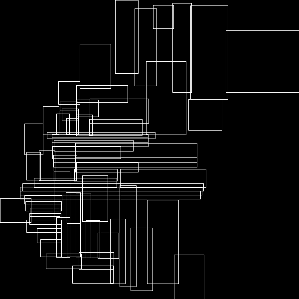
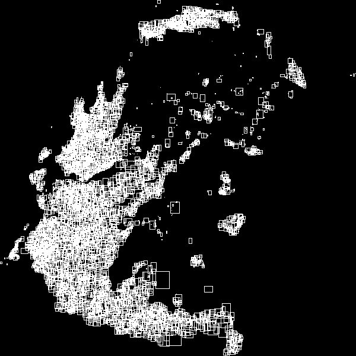

## PostgreSQL 黑科技 - 空间聚集存储, 内窥GIN, GiST, SP-GiST索引    
                
### 作者                         
digoal                       
                                  
### 日期                                                                                                                                         
2017-09-05                                                                    
                                                                         
### 标签                                                                      
PostgreSQL , 空间数据 , R-Tree , 聚集存储       
                                                                                                                                            
----                                                                                                                                      
                                                                                                                                               
## 背景        
单身汉的房间可能是这样的，凌乱得很。  
    
    
    
    
  
可能会有人表示不服，不是应该这样的吗？  
  
  
    
实际上大多数情况下数据库存储也可能是这样的，数据凌乱。索引的目的是在凌乱的数据中找到目标数据，但是从凌乱的数据中按索引顺序扫描一批数据，会有什么后果呢：    
    
没错，IO放大，我在以前的文章中有详细介绍过其原理。    
    
[《索引顺序扫描引发的堆扫描IO放大背后的统计学原理与解决办法 - PostgreSQL index scan enlarge heap page scans when index and column correlation small.》](../201404/20140426_01.md)      
    
对于乱序存放的数据，如果按索引顺序来调整存储，聚集后，可以减少IO放大。    
    
对于空间数据，应该如何存放呢？    
    
## 内窥BLOCK - pageinspect    
PostgreSQL 插件有一个插件pageinspect，可以解析BLOCK查看索引、堆表的内容。    
    
但是一直没有支持gist, sp-gist的内窥，不过马上就会支持了，看这个patch。    
    
https://www.postgresql.org/message-id/flat/accae316-5e4d-8963-0c3d-277ef13c396c%40postgrespro.ru#accae316-5e4d-8963-0c3d-277ef13c396c@postgrespro.ru    
    
```    
Hi all,    
    
the following patch transfers functionality from gevel module    
(http://www.sai.msu.su/~megera/wiki/Gevel) which provides functions for    
analyzing GIN and GiST indexes to pageinspect. Gevel was originally    
designed by Oleg Bartunov, and Teodor Sigaev for developers of GiST and    
GIN indexes.    
    
Functions added:    
  - gist_stat(text) - shows statistics on GiST Tree    
  - gist_tree(text) - shows GiST tree    
  - gist_tree(text, int4) - shows GiST tree up to MAXLEVEL    
  - gist_print(text) - prints objects stored in GiST tree    
  - spgist_stat(text) - shows statistics on SP-GiST    
  - spgist_print(text) - prints objects stored in index    
  - gin_value_count() - originally gin_stat(text) - prints estimated counts    
for index values    
  - gin_stats() - originally gin_statpage(text) - shows statistics    
  - gin_count_estimate(text, tsquery) - shows number of indexed rows matched query    
    
Tests also transferred, docs for new functions are added.     
I run pgindent over the code,     
but the result is different from those I expected,     
so I leave pgindented one.    
The patch is applicable to the commit     
866f4a7c210857aa342bf901558d170325094dde.    
    
--     
Alexey Chernyshov    
Postgres Professional: http://www.postgrespro.com    
The Russian Postgres Company    
```    
    
## 内窥GiST, SP-GiST索引    
1、打补丁    
    
```    
patch -p1 < ../0001-gevel_to_pageinspect-v1.patch     
patching file contrib/pageinspect/Makefile    
patching file contrib/pageinspect/brinfuncs.c    
patching file contrib/pageinspect/data/rect.data    
patching file contrib/pageinspect/data/test__int.data    
patching file contrib/pageinspect/expected/gin.out    
patching file contrib/pageinspect/expected/gist.out    
patching file contrib/pageinspect/expected/spgist.out    
patching file contrib/pageinspect/ginfuncs.c    
patching file contrib/pageinspect/gistfuncs.c    
patching file contrib/pageinspect/hashfuncs.c    
patching file contrib/pageinspect/pageinspect--1.6--1.7.sql    
patching file contrib/pageinspect/pageinspect.control    
patching file contrib/pageinspect/spgistfuncs.c    
patching file contrib/pageinspect/sql/gin.sql    
patching file contrib/pageinspect/sql/gist.sql    
patching file contrib/pageinspect/sql/spgist.sql    
patching file doc/src/sgml/pageinspect.sgml    
Hunk #2 succeeded at 830 (offset 5 lines).    
    
    
cd contrib/pageinspect/    
make    
make install    
```    
    
2、加载pageinspect插件    
    
```    
postgres=# create extension pageinspect;    
CREATE EXTENSION    
```    
    
3、几个函数接口的讲解    
    
3\.1 查看GiST索引概貌，比如层级，占用多少个PAGE，多少叶子节点，多少TUPLE等。    
    
gist_stat(INDEXNAME) - show some statistics about GiST tree    
    
```    
regression=# select gist_stat('pix');    
 Number of levels:          2    
Number of pages:           30    
Number of leaf pages:      29    
Number of tuples:          3129    
Number of leaf tuples:     3100    
Total size of tuples:      137676 bytes    
Total size of leaf tuples: 136400 bytes    
Total size of index:       245760 bytes    
```    
    
3\.2 列出GiST索引的每个层级的概貌，直到某个层级的节点。    
    
gist_tree(INDEXNAME,MAXLEVEL) - show GiST tree up to MAXLEVEL    
    
```    
regression=# select gist_tree('pix',0);    
 0(l:0) blk: 0 numTuple: 29 free: 6888b(15.63%)    
Designation (from left to right):    
    
0 - page number    
(l:0) - tree level    
blk: 0 - block number    
numTuple: 29 - the number of tuples    
free: 6888b - free space in bytes    
(15.63%) - occupied space in percents    
gist_tree(INDEXNAME) - show full GiST tree    
regression=# select gist_tree('pix');    
 0(l:0) blk: 0 numTuple: 29 free: 6888b(15.63%)    
    1(l:1) blk: 13 numTuple: 180 free: 244b(97.01%)    
    2(l:1) blk: 11 numTuple: 175 free: 464b(94.32%)    
    3(l:1) blk: 2 numTuple: 101 free: 3720b(54.43%)    
    4(l:1) blk: 17 numTuple: 111 free: 3280b(59.82%)    
    5(l:1) blk: 18 numTuple: 101 free: 3720b(54.43%)    
    6(l:1) blk: 10 numTuple: 98 free: 3852b(52.82%)    
    7(l:1) blk: 19 numTuple: 111 free: 3280b(59.82%)    
    8(l:1) blk: 9 numTuple: 97 free: 3896b(52.28%)    
    9(l:1) blk: 20 numTuple: 104 free: 3588b(56.05%)    
    10(l:1) blk: 14 numTuple: 96 free: 3940b(51.74%)    
    11(l:1) blk: 21 numTuple: 106 free: 3500b(57.13%)    
    12(l:1) blk: 7 numTuple: 103 free: 3632b(55.51%)    
    13(l:1) blk: 1 numTuple: 101 free: 3720b(54.43%)    
    14(l:1) blk: 16 numTuple: 97 free: 3896b(52.28%)    
    15(l:1) blk: 24 numTuple: 103 free: 3632b(55.51%)    
    16(l:1) blk: 4 numTuple: 98 free: 3852b(52.82%)    
    17(l:1) blk: 25 numTuple: 98 free: 3852b(52.82%)    
    18(l:1) blk: 3 numTuple: 97 free: 3896b(52.28%)    
    19(l:1) blk: 26 numTuple: 96 free: 3940b(51.74%)    
    20(l:1) blk: 6 numTuple: 103 free: 3632b(55.51%)    
    21(l:1) blk: 8 numTuple: 162 free: 1036b(87.31%)    
    22(l:1) blk: 23 numTuple: 94 free: 4028b(50.66%)    
    23(l:1) blk: 12 numTuple: 82 free: 4556b(44.19%)    
    24(l:1) blk: 27 numTuple: 105 free: 3544b(56.59%)    
    25(l:1) blk: 5 numTuple: 90 free: 4204b(48.51%)    
    26(l:1) blk: 28 numTuple: 100 free: 3764b(53.90%)    
    27(l:1) blk: 22 numTuple: 101 free: 3720b(54.43%)    
    28(l:1) blk: 15 numTuple: 95 free: 3984b(51.20%)    
    29(l:1) blk: 29 numTuple: 95 free: 3984b(51.20%)    
```    
    
3\.3 打印GiST索引的详细内容，这里包含了每一个索引的区间，例如国家、省、市。。。BOX边界。    
    
gist_print(INDEXNAME) - prints objects stored in GiST tree, works only if objects in index have textual representation (type_out functions should be implemented for given object type).     
    
It's known to work with R-tree GiST based index (contrib/rtree_gist).     
    
Note, in example below, objects are of type box.    
    
```    
for 8.1 and later this query should looks like    
    
# select * from gist_print('pix') as t(level int, valid bool, a box) where level =1;    
 level | valid |              a    
-------+-------+-----------------------------    
     1 | t     | (37357,50073),(34242,357)  -- 一个BOX的左下，右上POINT，R-Tree的下一级节点的数据都在这个box内。    
     1 | t     | (43499,49770),(40358,43)    
     1 | t     | (31193,24679),(25047,12410)    
     1 | t     | (31018,12142),(25083,6)    
     1 | t     | (49944,25174),(43471,12802)    
     1 | t     | (12577,49757),(6302,37534)    
     1 | t     | (12528,37333),(6171,24861)    
     1 | t     | (50027,49751),(46817,25462)    
     1 | t     | (46870,49912),(43664,25722)    
     1 | t     | (24855,25574),(12447,19263)    
     1 | t     | (25054,19126),(12403,12796)    
     1 | t     | (32737,49923),(31178,1038)      
     1 | t     | (3184,24465),(15,81)    
     1 | t     | (24951,49983),(12740,44000)    
     1 | t     | (24919,43956),(12617,37901)    
     1 | t     | (40387,49852),(37338,25217)    
     1 | t     | (40325,24963),(37375,491)      
     1 | t     | (24919,12698),(12654,6518)    
     1 | t     | (25002,6338),(12350,51)       
     1 | t     | (49985,12554),(43447,222)      
     1 | t     | (25003,37769),(12552,25573)    
     1 | t     | (34270,49382),(32763,594)      
     1 | t     | (6205,50012),(3,37527)    
     1 | t     | (6163,37358),(120,25034)      
     1 | t     | (12343,24542),(9295,294)    
     1 | t     | (9308,24151),(6234,620)    
     1 | t     | (6230,24629),(3169,108)    
     1 | t     | (31179,50040),(28113,25556)    
     1 | t     | (28048,49694),(25000,25000)    
(29 rows)    
    
Using Gevel module it's possible to visualize index tree, see for example Rtree Index.    
```    
    
## GiST索引图像    
我们可以把GIST索引的内容，按层级绘制出图像来。    
    
例如一级长这样，就是大BOX。    
    
    
    
下一级（叶子节点），长这样，就是大BOX下的一个个小BOX。    
    
    
    
## 聚集存储对性能的提升分析    
    
如果我们按照GiST索引的层级排序，聚集存储，那么在基于空间扫描数据的时候，扫描的块就更少。    
    
假设落在杭州地区有100万条数据，按照单身汉的乱序存储，杭州的数据可能散落分布在很多个PAGE中，我们扫描时也许扫描的是全量数据，而且是离散扫，性能损耗比较大。如果按照GiST聚集存储，那么会有极大的性能提升。    
    
## 空间聚集后的性能验证    
    
1、创建测试表    
    
```    
postgres=# create table test(id int, pos point);    
CREATE TABLE    
```    
    
2、写入1000万测试记录，随机点位    
    
```    
postgres=# insert into test select id, point(round(random()*1000), round(random()*1000)) from generate_series(1,10000000) t(id);    
INSERT 0 10000000    
    
postgres=# select * from test limit 10;    
 id |    pos        
----+-----------    
  1 | (335,286)    
  2 | (948,616)    
  3 | (591,851)    
  4 | (695,158)    
  5 | (728,801)    
  6 | (544,191)    
  7 | (851,940)    
  8 | (720,487)    
  9 | (790,344)    
 10 | (50,956)    
(10 rows)    
```    
    
3、创建空间索引    
    
```    
postgres=# create index idx_test_pos on test using gist(pos);    
CREATE INDEX    
```    
    
4、内窥空间索引    
    
```    
postgres=# select * from gist_stats('idx_test_pos');    
                 gist_stats                     
--------------------------------------------    
 Number of levels:          4              +    
 Number of pages:           87396          +    
 Number of leaf pages:      86626          +    
 Number of tuples:          10087395       +    
 Number of invalid tuples:  0              +    
 Number of leaf tuples:     10000000       +    
 Total size of tuples:      444894132 bytes+    
 Total size of leaf tuples: 441039512 bytes+    
 Total size of index:       715948032 bytes+    
     
(1 row)    
    
postgres=# select * from gist_tree('idx_test_pos',1);    
                                             gist_tree                                                 
---------------------------------------------------------------------------------------------------    
 0(l:0) blk: 0 numTuple: 7 free: 7840b(3.92%) rightlink:4294967295 (InvalidBlockNumber)           +    
     1(l:1) blk: 46732 numTuple: 108 free: 3396b(58.38%) rightlink:28877 (OK)                     +    
     2(l:1) blk: 18831 numTuple: 107 free: 3440b(57.84%) rightlink:56294 (OK)                     +    
     3(l:1) blk: 56294 numTuple: 159 free: 1152b(85.88%) rightlink:4294967295 (InvalidBlockNumber)+    
     4(l:1) blk: 18830 numTuple: 109 free: 3352b(58.92%) rightlink:71045 (OK)                     +    
     5(l:1) blk: 71045 numTuple: 90 free: 4188b(48.68%) rightlink:46732 (OK)                      +    
     6(l:1) blk: 28877 numTuple: 72 free: 4980b(38.97%) rightlink:78677 (OK)                      +    
     7(l:1) blk: 78677 numTuple: 117 free: 3000b(63.24%) rightlink:18831 (OK)                     +    
     
(1 row)    
    
postgres=# select * from gist_print('idx_test_pos') as t(level int, valid bool, a box) where level =1;    
 level | valid |           a               
-------+-------+-----------------------    
     1 | t     | (655,626),(422,0)    
     1 | t     | (1000,411),(647,0)    
     1 | t     | (1000,1000),(647,411)    
     1 | t     | (425,337),(0,0)    
     1 | t     | (425,626),(0,331)    
     1 | t     | (248,1000),(0,617)    
     1 | t     | (655,1000),(245,617)    
(7 rows)    
```    
    
4\.1、末端（叶子）节点的BOX如下。    
    
```    
postgres=# select * from (select * from gist_print('idx_test_pos') as t(level int, valid bool, a box) where level =4) t limit 10;    
 level | valid |          a              
-------+-------+---------------------    
     4 | t     | (630,107),(630,107)    
     4 | t     | (631,105),(631,105)    
     4 | t     | (629,107),(629,107)    
     4 | t     | (629,105),(629,105)    
     4 | t     | (631,109),(631,109)    
     4 | t     | (629,105),(629,105)    
     4 | t     | (631,105),(631,105)    
     4 | t     | (630,106),(630,106)    
     4 | t     | (629,105),(629,105)    
     4 | t     | (630,108),(630,108)    
(10 rows)    
```    
    
5、空间聚集前，也就是从单身汉的凌络卧室空间扫描落在某一个BOX内的数据。    
    
返回101518条记录，扫描了50914个HEAP数据块。    
    
```    
postgres=# explain (analyze,verbose,timing,costs) select * from test where box('(100,100),(200,200)') @> pos;    
                                                            QUERY PLAN                                                                
----------------------------------------------------------------------------------------------------------------------------------    
 Bitmap Heap Scan on public.test  (cost=183.52..10728.49 rows=10000 width=20) (actual time=22.710..96.798 rows=101518 loops=1)    
   Output: id, pos    
   Recheck Cond: ('(200,200),(100,100)'::box @> test.pos)    
   Heap Blocks: exact=50914    
   ->  Bitmap Index Scan on idx_test_pos  (cost=0.00..181.02 rows=10000 width=0) (actual time=15.422..15.422 rows=101518 loops=1)    
         Index Cond: ('(200,200),(100,100)'::box @> test.pos)    
 Planning time: 0.044 ms    
 Execution time: 104.395 ms    
(8 rows)    
```    
    
6、按GiST空间聚集，整理数据。    
    
PostgreSQL提供了一个聚集语法：  
  
```  
Command:     CLUSTER  
Description: cluster a table according to an index  
Syntax:  
CLUSTER [VERBOSE] table_name [ USING index_name ]  
CLUSTER [VERBOSE]  
```  
  
使用GiST索引对数据进行聚集：  
  
```  
postgres=# cluster test USING idx_test_pos ;  
CLUSTER  
```  
    
验证聚集后的块扫描性能。    
    
返回101518条记录，扫描了691个HEAP数据块。    
    
```    
explain (analyze,verbose,timing,costs,buffers) select * from test where box('(100,100),(200,200)') @> pos;    
    
                                                          QUERY PLAN                                                               
-------------------------------------------------------------------------------------------------------------------------------    
 Bitmap Heap Scan on public.test  (cost=193.12..10549.51 rows=10000 width=16) (actual time=8.092..21.497 rows=101518 loops=1)    
   Output: pos    
   Recheck Cond: ('(200,200),(100,100)'::box @> test.pos)    
   Heap Blocks: exact=691    
   Buffers: shared hit=1727    
   ->  Bitmap Index Scan on idx_test_pos  (cost=0.00..190.62 rows=10000 width=0) (actual time=7.997..7.997 rows=101518 loops=1)    
         Index Cond: ('(200,200),(100,100)'::box @> test.pos)    
         Buffers: shared hit=1036    
 Planning time: 0.137 ms    
 Execution time: 29.650 ms    
(10 rows)    
```    
    
**使用空间聚集，按某个空间条件查询并返回101518记录，对比聚集前后，扫描的HEAP数据块数目从50914降到了691。**    
    
## 参考    
    
http://www.sai.msu.su/~megera/wiki/Gevel    
    
http://www.sai.msu.su/~megera/wiki/Rtree_Index    
  
https://www.pgcon.org/2016/schedule/attachments/434_Index-internals-PGCon2016.pdf  
    
  
<a rel="nofollow" href="http://info.flagcounter.com/h9V1"  ></a>  
  
  
  
  
  
  
## [digoal's 大量PostgreSQL文章入口](https://github.com/digoal/blog/blob/master/README.md "22709685feb7cab07d30f30387f0a9ae")
  
  
## [免费领取阿里云RDS PostgreSQL实例、ECS虚拟机](https://free.aliyun.com/ "57258f76c37864c6e6d23383d05714ea")
  
