## A Look at How PostgreSQL Executes a Tiny Join (HashJoin)  
                
### 作者                         
digoal                       
                                  
### 日期                                                                                                                                         
2017-09-06                                                                   
                                                                         
### 标签                                                                      
PostgreSQL , HashJoin        
                                                                                                                                            
----                                                                                                                                      
                                                                                                                                               
## 背景    
原文:  
  
http://patshaughnessy.net/2015/11/24/a-look-at-how-postgres-executes-a-tiny-join  
  
Aside from saving and retrieving data, the primary feature of a relational database is the ability to execute join queries, to relate data in one table with data from another. While many developers are turning to NoSQL solutions, joining one set of data values with another remains one of our most common and important use cases while writing server code.  
  
But what does the word “join” actually mean? And what really happens when I execute a join query? Too often we take our tools for granted, without really understanding what they are doing. This month I decided to look at the source code for PostgreSQL, a popular open source database server, to see how it implements join queries.  
  
Reading and experimenting with the Postgres source code turned out to be a great learning experience. Today I’d like to report my observations; I’ll show you exactly how Postgres executed a tiny join consisting of just a few records, using the hash join algorithm. In future articles I’ll show you some interesting optimizations Postgres uses for larger joins, and other computer science algorithms at work inside of Postgres.  
  
## What is a Join?  
But before we get to the Postgres source code, let’s start by reviewing what join queries are. Here’s an introduction from the excellent [Postgres documentation](http://www.postgresql.org/docs/current/static/tutorial-join.html):  
  
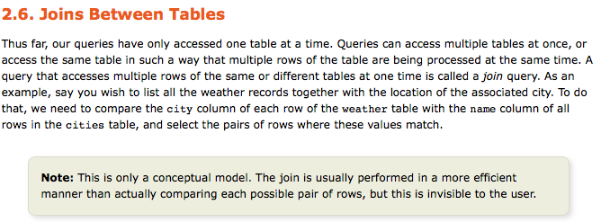  
  
The Postgres docs then explain how to use joins: inner vs. outer joins, joining a table with itself, etc. But I’m intrigued by the highlighted disclaimer. What is that “more efficient manner?” And how could Postgres possibly get away with not “actually comparing each possible pair of rows?”  
  
## A Tiny Join  
As an example today let’s work with two tables: publications, which contains three ground breaking computer science journal articles I never read in college, and authors, which records where each author worked.  
  
```  
> select * from publications;  
  
                         title                          |   author   | year   
--------------------------------------------------------+------------+------  
 A Relational Model of Data for Large Shared Data Banks | Edgar Codd | 1970  
 Relational Completeness of Data Base Sublanguages      | Edgar Codd | 1972  
 The Transaction Concept: Virtues and Limitations       | Jim Gray   | 1981  
(3 rows)  
  
> select * from authors;  
  
    name    |         company           
------------+-------------------------  
 Edgar Codd | IBM Research Laboratory  
 Jim Gray   | Tandem Computers  
(2 rows)  
```  
  
Today’s goal is to understand exactly what happens when Postgres joins one table with the other:  
  
```  
> select title, company from publications, authors where author = name;  
  
                         title                          |         company           
--------------------------------------------------------+-------------------------  
 Relational Completeness of Data Base Sublanguages      | IBM Research Laboratory  
 A Relational Model of Data for Large Shared Data Banks | IBM Research Laboratory  
 The Transaction Concept: Virtues and Limitations       | Tandem Computers  
(3 rows)  
```  
  
## A Conceptual Model for Joining Two Tables  
Before we look at the algorithm Postgres actually uses, let’s review what join queries do conceptually. Above the documentation stated that Postgres implements joins by “comparing each possible pair of rows,” and then selecting “the pairs of rows where these values match.”  
  
Reading this I imagine Postgres takes each publication and loops over all of the authors, looking for that publication’s author:  
  
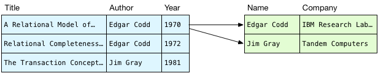  
  
In blue on the left are the publications, and I show the author records on the right in green. This process of iterating over the rows in the authors table is known as a scan in the Postgres source code. We are scanning over all of the authors for the first publication, trying to find matching names.  
  
What do we do with each publication-author pair? We have to evaluate the WHERE clause from my example SQL statement:  
  
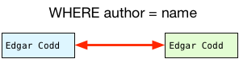  
  
Do the names match? Yes. This pair should be included in the result set. What about the second pair?  
  
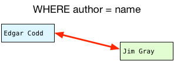  
  
Do these names match? This time they don’t – this pair of rows should be filtered out.  
  
Once we have a matching pair of rows, we copy just the selected columns into a new, joined record and return that to the client:  
  
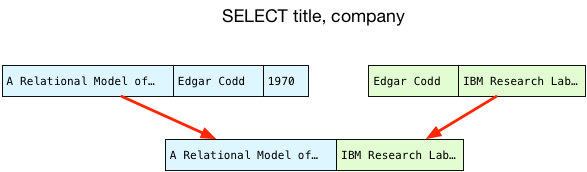  
  
## A Nested Loop  
What’s wrong with this conceptual model? It seems like a very simple, straightforward way of obtaining the values we need. If we proceed to scan through the rest of the publications, it produces the same result that Postgres does, although in a different order. (We’ll see why the order changes later.)  
  
The problem is that it’s very inefficient. First we scan over all of the authors for the first row in the publications table:  
  
  
  
And then we repeat the same scan of the authors table for the second publication:  
  
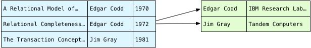  
  
And again for the third row. To find all of the matching pairs, in fact, we need to loop over all the authors for each publication:  
  
  
  
For my tiny query this isn’t a problem. There are 3*2 or 6 combinations of rows; comparing names 6 times would only take a few microseconds on a modern computer. However, as the number of rows increases in either table, the total number of comparisons will explode. If we have 1000 publications and 1000 authors, suddenly we would have to compare name strings 1000*1000 or 1 million times! Computer scientists describe this algorithm as O(n2).  
  
But do we really need to search the entire authors table for each publication? “Edgar Codd” appears in the publications table twice – why do we need to scan the authors table for the same name more than once? After we find Edgar the first time, there should be some way of recording where he was so we can find him again. And even if there were no repeated author names in publications, it still seems wasteful to loop over the authors table over and over again. There must be some way of avoiding all of these repeated scans.  
  
And there is; we can use a hash table.  
## Avoiding Repeated Scans  
  
The problem with our naive algorithm, the conceptual model from the Postgres documentation, is that we loop over the authors table over and over again. To avoid those repeated loops, imagine if we scanned the authors only once and then saved them in some kind of data structure:  
  
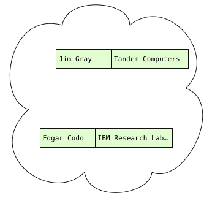  
  
Now that we have the author records, what do we need to do with them? Well, we have to scan the publications, obtain each publication’s author, and find the matching author records, if any. In other words, we need to be able to quickly and easily find the author record with a given name:  
  
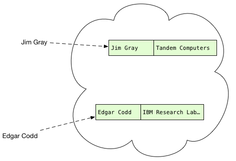  
  
You’ve probably seen this data structure before; in fact, it might be something you use everyday in your own code. If you’re a Rubyist like me, you call this a hash. If you prefer Python it’s a dictionary, or in Clojure it’s hash map.  
  
With all the authors organized by their names, we can scan over the publications and quickly find out if there’s a matching author record:  
  
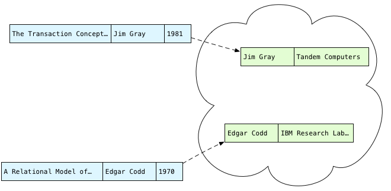  
  
But what are hash tables, exactly? And how do they work? If only we could go back in time and sneak back into our college Computer Science classroom again. But if you installed Postgres from source, using Homebrew or with some Linux package manager, you already have an open source, world class implementation of the hash table algorithm right on your computer! To learn more about it all we have to do is read the Postgres source code.  
  
## Calculating Hashes  
It turns out that for this query Postgres actually hashes the publications and then iterates over the authors. Before starting to execute a query, Postgres first parses the SQL we give it and generates a “query plan.” Probably because the publications table is larger (I’m not sure), Postgres’s query planner decides to save the publications, not the authors, in the hash table.  
  
To do this, Postgres has to scan the publications just as we did above:  
  
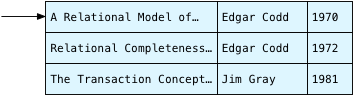  
  
And for each publication, Postgres selects just two of the three columns: author and title. Postgres refers to the query plan and finds out it will need the author for the WHERE join condition, and the title for the final SELECT returning the result set. It leaves the year values behind.  
  
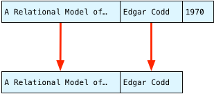  
  
This process of selecting the desired attributes from the matching pair is known in the Postgres C source code as a projection. We “project” a few values from one set of columns to another. (The term project is actually much older even than Postgres; Edgar Codd first used it in this context in [A Relational Model of Data for Large Shared Data Banks](https://www.seas.upenn.edu/~zives/03f/cis550/codd.pdf) back in 1970.)  
  
Next Postgres calculates a hash based on the author string. A hash is some integer value that can be calculated quickly in a repeatable, reproducible way. For the same author string, e.g. “Edgar Codd,” Postgres always calculates the same hash number. As we’ll see in a moment, Postgres uses the hash value to decide where to save the author name in the hash table.  
  
You can find Postgres’s hash algorithm in a C file called hashfunc.c. Even if you’re not a C developer, there are extensive code comments explaining what’s going on, along with a link to [an article written by Bob Jenkins](http://burtleburtle.net/bob/hash/doobs.html), who developed the algorithm in 1997.  
  
## hash_any  
view on [postgresql.org](http://doxygen.postgresql.org/hashfunc_8c.html#a364b7d134ec3c770a3b40abf15b05d37)  
  
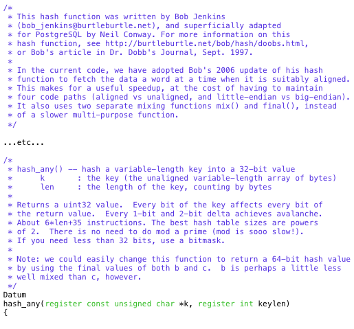  
  
In my example, Postgres passes “Edgar Codd,” the string value in the author column in the first publication record, to hash_any. The complex bitwise calculations in hash_any step over the characters in Edgar’s name and return this hash value:  
  
  
  
## Using a Bitmask to Choose a Hash Bucket  
  
Now that it has a hash, what does Postgres do with it? You can see a clue above in the C comments:  
  
```  
The best hash table sizes are powers of 2. There is no need to do mod a prime (mod is sooo slow!). If you need less than 32 bits, use a bitmask.  
```  
  
A hash table consists of an array of “buckets,” which are a series of pointers to linked lists. Initially Postgres creates an empty array of bucket pointers just before starting to scan the publications:  
  
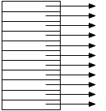  
  
As you can guess, Postgres saves each publication in one of the buckets in the hash table, based on the calculated hash value. Later when it scans over the authors, it will be able to find the publications again quickly by recalculating the same hash values. Instead of scanning over all of the publications again, Postgres can just look up each publication’s author using the hash. The hash is a record of where each publication is saved in the hash table.  
  
However, if two publications turn out to have the same author, as we have in our example, then Postgres will have to save them both in the same bucket. This is why each bucket is a linked list; each bucket has to save more than one publication.  
  
Because our example has three publications, does Postgres use a hash table with three buckets? Or with two buckets, because of the repeated author value? No. It actually uses 1024 buckets! Why 1024? For two reasons: First, Postgres was designed to query large amounts of data. Its hash join algorithm was optimized to handle extremely large data sets, containing millions of records or even more. A table containing three records is truly tiny! Postgres doesn’t bother with small hash tables and uses a minimum size of 1024.  
  
And why a power of two? This makes it easier to decide which bucket to use for a given hash. Instead of trying to return hash values that match the number of buckets, it’s easier and faster to always returns very large values. What Postgres does instead is distribute the large hash values evenly over the number of buckets it does have. By choosing a power of two for the bucket array size, Postgres can use a fast bitwise operation to decide which bucket to save each publication in, like this:  
  
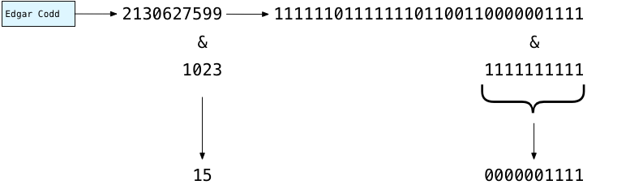  
  
Above you can see how Postgres decides where to put “Edgar Codd” in the hash table: It subtracts one from the number of buckets: 1024-1 = 1023. Written in binary this is 1111111111. Then using your microprocessor’s binary computing circuits, Postgres quickly masks out the left bits, and keeps just the 10 least significant or rightmost bits. This yields 0000001111 binary, or the number 15. Using this fast calculation, Postgres decides to save Edgar in bucket #15:  
  
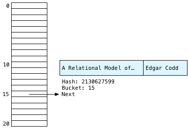  
  
Postgres also saves the title string, because it will need it later to produce the final result set. Along with the two strings, Postgres saves the hash value and a “next” pointer that will form the linked list.  
  
## Building the Rest of the Hash Table  
  
Postgres now continues to scan over the publications, arriving at the second publication.  
  
  
  
We have Edgar again! Clearly he was a central figure behind database theory. Calculating the hash again for the same string will always return the same value: 2130627599, yielding bucket #15 a second time. We know the Edgar Codd records will always appear in bucket 15.  
  
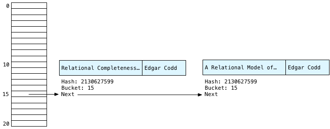  
  
Also notice that Postgres saves each new publication at the head of the linked list – this means we have the second Edgar publication first on the left, and Edgar’s first publication second on the right. As we’ll see next, this yields the reverse order of Edgar’s records we saw above in the conceptual algorithm.  
  
Finally Postgres continues scanning and saves the third publication in the hash table; this time Postgres calculates a hash for “Jim Gray:”  
  
  
  
You can see this time the 10 rightmost bits of 3344886182 evaluate to 422. So Postgres saves Jim in bucket #422. Drawing the bucket array more to scale it might look something like this:  
  
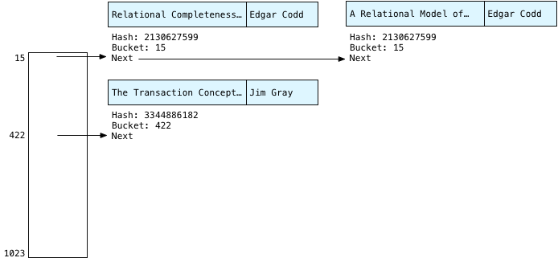  
  
## Scanning Buckets  
  
After saving all the publications in the hash table, Postgres can now scan over the authors table:  
  
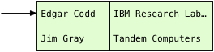  
  
Now finding the matching publication is simple. Instead of scanning over all the publications, Postgres simply calls the hash function again on the name string from the authors table, and repeats the bitmask operation. Because the first author record is Edgar, Postgres knows the matching publications will be in bucket #15.  
  
In our tiny example, the only records in bucket 15 will be for Edgar Codd. But remember in a large SQL query there might be millions of publications. It’s possible that publications with different authors might appear in this bucket. This would happen because either:  
  
- The hash function returned the same hash number for two different author strings. This is possible but unlikely. In Computer Science this would be known as a hash collision.  
  
- The 10 least significant bits of the hash were the same. For millions of publications this would happen frequently. However, as the number of records in the join increases Postgres uses more and more bits in the bitmask. 1024 (10 bits) was the minimum number it uses for our tiny query. Still, hash table buckets in practice will contain multiple key values.  
  
Therefore, Postgres has to check each author in the matching bucket to be sure that it’s a match. This process is known as scanning the bucket. To do this, Postgres first checks the hash values:  
  
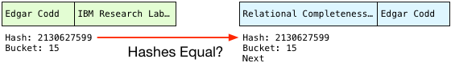  
  
This is a simple numerical comparison and so is quite fast. And if the hashes are the same, Postgres checks the actual strings just in case the hash function did return the same hash for different strings:  
  
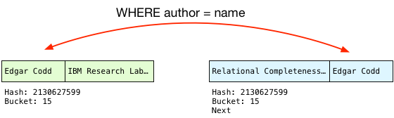  
  
Because the author names match, Postgres can finally perform the join! To do this, it projects the columns that our query selects into a single joined record, in the desired order:  
  
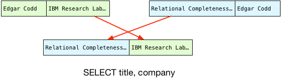  
  
This becomes the first record in our result set.  
  
## Returning Multiple Records: The Hash Join State Machine  
  
One of the most beautiful and important aspects of the Postgres implementation is the way it orchestrates building up and searching the hash table in the midst of a larger enclosing SQL expression. To see this for yourself, take a look at the hash join implementation, in nodeHashJoin.c.  
  
## ExecHashJoin  
  
view on [postgresql.org](http://doxygen.postgresql.org/nodeHashjoin_8c.html#a538698b031186193de7da58537820e61)  
  
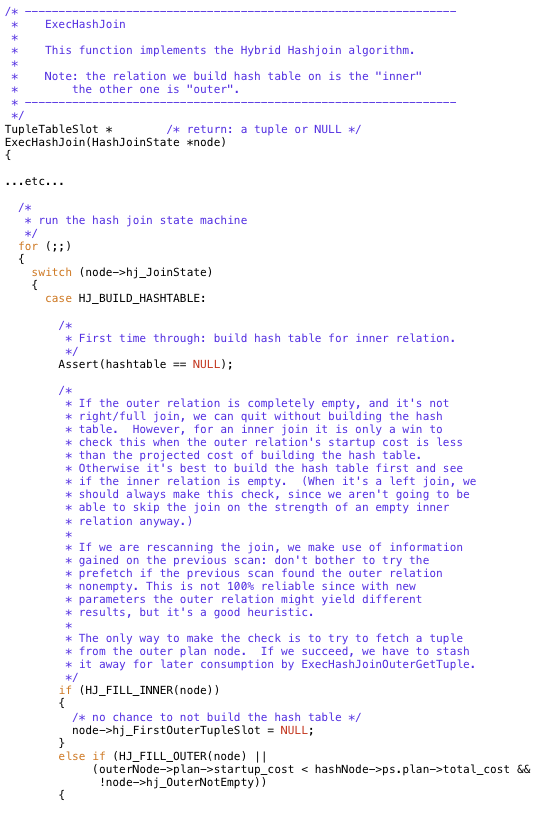  
  
Postgres calls ExecHashJoin once for each record in the join result set. For our example with 3 result records Postgres calls ExecHashJoin three times. ExecHashJoin keeps track of how many times it has been called, and what it needs to do next, using a state machine.  
  
The best way to understand how this state machine works, and how it fits into the larger structure of Postgres’s architecture, is to imagine that we asked for one record at a time. For example, imagine that we select just a single record from the join:  
  
```  
select title, company from publications, authors where author = name limit 1  
```  
  
By appending limit 1 we tell Postgres to stop after 1 record. For this query, to return just one record, ExecHashJoin will use the following states in its state machine:  
  
  
  
Here’s what ExecHashJoin does to obtain the first joined record:  
  
- HJ_BUILD_HASHTABLE: This code builds the hash table by scanning over all the publications records, as we saw above. Postgres calls publications the “inner relation.”  
  
- HJ_NEED_NEW_OUTER: This code starts scanning the “outer relation” or the authors table in this example, and returns a single record.  
  
HJ_SCAN_BUCKET: This code takes one outer relation record (an author) and looks for the matching inner relation records in the hash table (publications).  
  
Now imagine that I ask Postgres for two records, by using limit 2:  
  
```  
select title, company from publications, authors where author = name limit 2  
```  
  
The second time Postgres calls ExecHashJoin, it only executes HJ_NEED_NEW_OUTER and HJ_SCAN_BUCKET – it already created the hash table the first time it was called:  
  
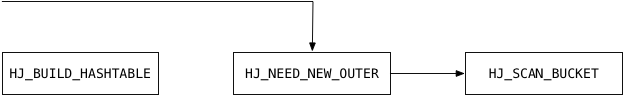  
  
Postgres pays the large price of scanning the entire inner relation and building the hash table as soon as you ask for one record. Returning the second and all subsequent records is much faster because Postgres already has the hash table.  
  
If you read the C code you’ll see some interesting optimizations. For example, Postgres actually scans the outer relation first to get a single record, just in case it might be empty. (This is what the C comment above refers to.) There’s no need to build a hash table if we’re not going to look up any values! Also, the HJ_FILL_INNER and HJ_FILL_OUTER states handle executing right or left outer joins respectively. ExecHashJoin implements these as well.  
  
By using a state machine like this Postgres can execute this join inside the context of a large, complex SQL statement. It could be that we are joining together result sets from complex inner SQL clauses, or that the result set from this join becomes part of a larger expression. The state inside of ExecHashJoin allows Postgres to keep track of what is was doing – and of what it needs to do next – in the appropriate place on the execution stack.  
  
## What’s Next?  
  
The last state value handled by ExecHashJoin, HJ_NEED_NEW_BATCH, handles the case where the hash table doesn’t fit into the server’s memory. In this case, Postgres will create a series of hash tables and save some of them out to disk in “batch files.” This algorithm is what the term [Hybrid Hashjoin](https://en.wikipedia.org/wiki/Hash_join) refers to.  
  
When I have time, I’d love to write about how Postgres handles a large join instead of a tiny one: How do batch files work? What configuration settings have an effect on batch files and join performance? And there’s also an interesting optimization Postgres uses for frequently occurring join key values.  
  
Postgres does some amazing things internally to speed up your queries; it’s time to shed some light on the great work the Postgres open source community has done over the years!  
    
  
<a rel="nofollow" href="http://info.flagcounter.com/h9V1"  ></a>  
  
  
  
  
  
  
## [digoal's 大量PostgreSQL文章入口](https://github.com/digoal/blog/blob/master/README.md "22709685feb7cab07d30f30387f0a9ae")
  
