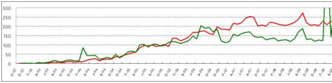
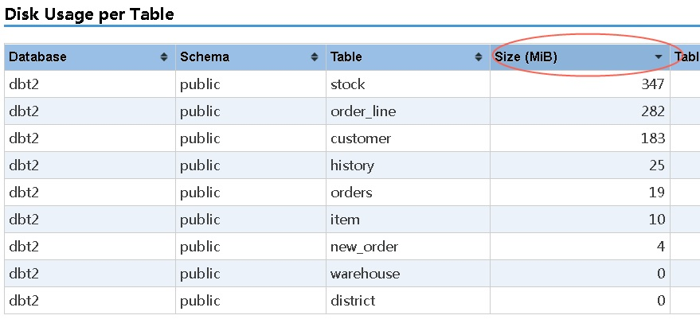
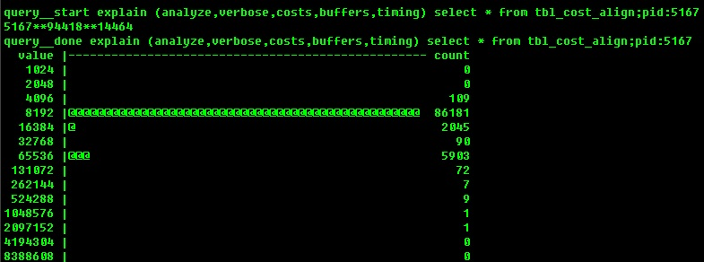

## PostgreSQL、Greenplum 日常监控 和 维护任务 - 最佳实践     
                  
### 作者                 
digoal                  
                  
### 日期                
2017-09-13                    
                  
### 标签                
PostgreSQL , Greenplum , Recommended Monitoring and Maintenance Tasks , 监控 , 维护    
                  
----                
                  
## 背景   
Greenplum的日常监控点、评判标准，日常维护任务。  
    
## 展示图层  
由于一台主机可能跑多个实例，建议分层展示。  
  
另外，即使是ON ECS虚拟机（一个虚拟机一个实例一对一的形态）的产品形态，实际上也建议分层展示，以示通用性。  
  
### 主机级图层  
  
1、全局  
  
2、以集群分组  
  
#### 展示图形  
1、饼图（正常、警告、严重错误、不可用，占比，数量）  
  
2、热力图（每台主机一个点，颜色描绘正常、警告、严重错误、不可用）  
  
3、列表（正常、警告、严重错误、不可用倒排，TOP 主机）  
  
### 实例级图层  
  
1、全局  
  
2、以集群分组  
  
#### 展示图形  
1、饼图（正常、警告、严重错误、不可用，占比，数量）  
  
2、热力图（每实例一个点，颜色描绘正常、警告、严重错误、不可用）  
  
3、列表（正常、警告、严重错误、不可用倒排，TOP 实例）  
  
### 明细图层  
全局、分组 -> 主机、实例 -> 主机、数据库实例明细监控指标  
  
全局、分组 -> 主机 -> 实例 -> 数据库实例明细监控指标  
  
## 数据库状态监控    
监控集群的健康状态。    
    
### 1、列出当前down的segment节点。    
    
#### 检查方法：    
连接到postgres数据库，执行：    
    
```    
SELECT * FROM gp_segment_configuration    
WHERE status <> 'u';    
```    
    
#### 判断方法：    
    
有返回，表示该segment已经down了。    
    
#### 事件级别：    
    
warning。    
    
如果有mirror节点，不影响使用。    
    
#### 重要程度：    
    
重要。    
    
#### 监控频率：    
    
5-10分钟。    
    
#### 处理方法：    
    
1、检查DOWN segment主机是否正常。    
    
2、检查DOWN segment的primary, mirror节点的pg_log日志。找出原因。    
    
3、如果没有异常，使用gprecoverseg把DOWN的节点拉起来。    
    
### 2、列出当前处于change tracking的segment节点。    
    
#### 检查方法：    
连接到postgres数据库，执行：    
    
```    
SELECT * FROM gp_segment_configuration    
WHERE mode = 'c';    
```    
    
#### 判断方法：    
    
如果有记录返回，表示有处于change tracking的segment。    
    
#### 事件级别：    
    
warning。    
    
#### 重要程度：    
    
重要    
    
#### 监控频率：    
    
5-10分钟。    
    
#### 处理方法：    
    
1、检查DOWN segment主机是否正常。    
    
2、检查DOWN segment的primary, mirror节点的pg_log日志。找出原因。    
    
3、如果没有异常，使用gprecoverseg把DOWN的节点拉起来。    
    
### 3、列出当前处于re-syncing状态的segment节点。    
    
#### 检查方法：    
连接到postgres数据库，执行：    
    
```    
SELECT * FROM gp_segment_configuration    
WHERE mode = 'r';    
```    
    
需要加入时间条件。判断是否长时间处于r状态。    
    
#### 判断方法：    
    
如果有记录返回，表示有处于re-syncing的segment。    
    
#### 事件级别：    
    
warning。    
    
#### 重要程度：    
    
重要    
    
#### 监控频率：    
    
5-10分钟。    
    
#### 处理方法：    
    
如果节点很长时间处于re-synched状态。检查SEGMENT的primary, mirror节点的pg_log，排查错误。    
    
### 4、列出当前角色未处于优先角色的节点的segment节点。    
    
#### 检查方法：    
连接到postgres数据库，执行：    
    
```    
SELECT * FROM gp_segment_configuration    
WHERE preferred_role <> role;    
```    
    
#### 判断方法：    
    
如果有记录返回，表示当前集群可能处于not balanced状态。    
    
#### 事件级别：    
    
warning。    
    
#### 重要程度：    
    
重要    
    
#### 监控频率：    
    
5-10分钟。    
    
#### 处理方法：    
    
如果当前集群处于not balanced状态，某个主机的primary节点可能更多，负担较重，影响性能。    
    
建议找到维护窗口，重启数据库集群。    
    
### 5、检测所有节点是否可达，确保QD(query dispatching)正常。    
    
#### 检查方法：    
连接到postgres数据库，执行：    
    
```    
SELECT gp_segment_id, count(*)    
FROM gp_dist_random('pg_class')    
GROUP BY 1;    
```    
    
#### 判断方法：    
    
正常情况下，每个节点返回一条记录，如果执行失败，表示有不可达的segment，执行SQL是QD阶段会失败。    
    
#### 事件级别：    
    
critical。    
    
#### 重要程度：    
    
严重    
    
#### 监控频率：    
    
5-10分钟。    
    
#### 处理方法：    
    
如果查询失败，表示某些segment节点的QD异常，这是一个罕见错误。需要检查异常节点(不能触及的segments)的硬件、网络是否正常。    
    
### 6、列出当前异常的master standby节点。    
    
#### 检查方法：    
连接到postgres数据库，执行：    
    
```    
SELECT summary_state    
FROM gp_master_mirroring;    
```    
    
#### 判断方法：    
    
返回Not Synchronized时，表示master standby异常。    
    
#### 事件级别：    
    
warning。    
    
#### 重要程度：    
    
重要。    
    
#### 监控频率：    
    
5-10分钟。    
    
#### 处理方法：    
    
检查master, standby的pg_log，是否有错误日志，针对性修复。    
    
如果没有unexpected错误，并且机器正常。那么使用gpinitstandby修复standby。    
    
GPDB 4.2以及以前的版本，需要重启GPDB集群。    
    
### 7、列出当前down的master standby节点。    
    
#### 检查方法：    
连接到postgres数据库，执行：    
    
```    
SELECT procpid, state FROM pg_stat_replication;    
```    
    
#### 判断方法：    
    
如果state不是'STREAMING'，或者没有记录返回，那么说明master standby节点异常。    
    
#### 事件级别：    
    
warning。    
    
#### 重要程度：    
    
重要    
    
#### 监控频率：    
    
5-10分钟。    
    
#### 处理方法：    
    
检查master, master standby节点的pg_log是否有异常日志。    
    
如果没有unexpected错误，并且机器正常。那么使用gpinitstandby修复standby。    
    
GPDB 4.2以及以前的版本，需要重启GPDB集群。    
    
### 8、检查master节点是否up并正常提供服务。    
    
#### 检查方法：    
连接到postgres数据库，执行：    
    
```    
SELECT count(*) FROM gp_segment_configuration;    
```    
    
#### 判断方法：    
    
QUERY正常返回，表示master节点正常。    
    
#### 事件级别：    
    
critical。    
    
#### 重要程度：    
    
严重    
    
#### 监控频率：    
    
5-10分钟。    
    
#### 处理方法：    
    
如果这个QUERY不能正常执行，说明active master节点可能DOWN了。    
    
重试若干次，如果都异常，关闭active master（一定要确保关闭无误），切换到standby master。    
    
### 列出master, segment, standby, mirror状态的其他方法   
使用命令查询master, segment, standby, mirror状态  
  
1、master和segment状态  
  
```  
gpstate  
  
或  
  
gpstate -s  
```  
  
2、segment mirror状态  
  
```  
gpstate -m   
```  
  
3、primary和mirror mapping状态  
  
```  
gpstate -c  
```  
  
4、master standby状态  
  
```  
gpstate -f  
```  
  
## 数据库告警日志监控    
    
### 1、列出FATAL and ERROR级别的错误日志。    
    
#### 检查方法：    
    
方法1，在安装了gpperfmon组件的情况下    
    
连接到gpperfmon数据库，执行：    
    
```    
SELECT * FROM log_alert_history    
WHERE logseverity in ('FATAL', 'ERROR')    
   AND logtime > (now() - interval '15 minutes');    
```    
    
方法2，查看所有节点(master, standby master, primary, mirror segments)的pg_log。过滤FATAL and ERROR级别的错误日志。    
    
方法3，查看这些系统视图    
    
```    
                        List of relations    
   Schema   |          Name          | Type |  Owner   | Storage     
------------+------------------------+------+----------+---------    
 gp_toolkit | gp_log_command_timings | view | digoal   | none  -- 统计    
 gp_toolkit | gp_log_database        | view | digoal   | none  -- 这个包含当前数据库日志    
 gp_toolkit | gp_log_master_concise  | view | digoal   | none  -- 统计    
 gp_toolkit | gp_log_system          | view | digoal   | none  -- 这个包含所有日志    
(4 rows)    
```    
    
实际上gp_log_system是一个command外部表，列出了所有segment, master的csvlog的内容。    
    
```    
View definition:    
 SELECT __gp_log_segment_ext.logtime, __gp_log_segment_ext.loguser, __gp_log_segment_ext.logdatabase, __gp_log_segment_ext.logpid, __gp_log_segment_ext.logthread, __gp_log_segment_ext.loghost, __gp_log_segment_ext.logport, __gp_log_segme    
nt_ext.logsessiontime, __gp_log_segment_ext.logtransaction, __gp_log_segment_ext.logsession, __gp_log_segment_ext.logcmdcount, __gp_log_segment_ext.logsegment, __gp_log_segment_ext.logslice, __gp_log_segment_ext.logdistxact, __gp_log_seg    
ment_ext.loglocalxact, __gp_log_segment_ext.logsubxact, __gp_log_segment_ext.logseverity, __gp_log_segment_ext.logstate, __gp_log_segment_ext.logmessage, __gp_log_segment_ext.logdetail, __gp_log_segment_ext.loghint, __gp_log_segment_ext.    
logquery, __gp_log_segment_ext.logquerypos, __gp_log_segment_ext.logcontext, __gp_log_segment_ext.logdebug, __gp_log_segment_ext.logcursorpos, __gp_log_segment_ext.logfunction, __gp_log_segment_ext.logfile, __gp_log_segment_ext.logline,     
__gp_log_segment_ext.logstack    
   FROM ONLY gp_toolkit.__gp_log_segment_ext    
UNION ALL     
 SELECT __gp_log_master_ext.logtime, __gp_log_master_ext.loguser, __gp_log_master_ext.logdatabase, __gp_log_master_ext.logpid, __gp_log_master_ext.logthread, __gp_log_master_ext.loghost, __gp_log_master_ext.logport, __gp_log_master_ext.l    
ogsessiontime, __gp_log_master_ext.logtransaction, __gp_log_master_ext.logsession, __gp_log_master_ext.logcmdcount, __gp_log_master_ext.logsegment, __gp_log_master_ext.logslice, __gp_log_master_ext.logdistxact, __gp_log_master_ext.logloc    
alxact, __gp_log_master_ext.logsubxact, __gp_log_master_ext.logseverity, __gp_log_master_ext.logstate, __gp_log_master_ext.logmessage, __gp_log_master_ext.logdetail, __gp_log_master_ext.loghint, __gp_log_master_ext.logquery, __gp_log_mas    
ter_ext.logquerypos, __gp_log_master_ext.logcontext, __gp_log_master_ext.logdebug, __gp_log_master_ext.logcursorpos, __gp_log_master_ext.logfunction, __gp_log_master_ext.logfile, __gp_log_master_ext.logline, __gp_log_master_ext.logstack    
   FROM ONLY gp_toolkit.__gp_log_master_ext    
  ORDER BY 1;    
```    
    
```    
postgres=# \d+ gp_toolkit.__gp_log_segment_ext    
                External table "gp_toolkit.__gp_log_segment_ext"    
     Column     |           Type           | Modifiers | Storage  | Description     
----------------+--------------------------+-----------+----------+-------------    
 logtime        | timestamp with time zone |           | plain    |     
 loguser        | text                     |           | extended |     
 logdatabase    | text                     |           | extended |     
 logpid         | text                     |           | extended |     
 logthread      | text                     |           | extended |     
 loghost        | text                     |           | extended |     
 logport        | text                     |           | extended |     
 logsessiontime | timestamp with time zone |           | plain    |     
 logtransaction | integer                  |           | plain    |     
 logsession     | text                     |           | extended |     
 logcmdcount    | text                     |           | extended |     
 logsegment     | text                     |           | extended |     
 logslice       | text                     |           | extended |     
 logdistxact    | text                     |           | extended |     
 loglocalxact   | text                     |           | extended |     
 logsubxact     | text                     |           | extended |     
 logseverity    | text                     |           | extended |     
 logstate       | text                     |           | extended |     
 logmessage     | text                     |           | extended |     
 logdetail      | text                     |           | extended |     
 loghint        | text                     |           | extended |     
 logquery       | text                     |           | extended |     
 logquerypos    | integer                  |           | plain    |     
 logcontext     | text                     |           | extended |     
 logdebug       | text                     |           | extended |     
 logcursorpos   | integer                  |           | plain    |     
 logfunction    | text                     |           | extended |     
 logfile        | text                     |           | extended |     
 logline        | integer                  |           | plain    |     
 logstack       | text                     |           | extended |     
Type: readable    
Encoding: UTF8    
Format type: csv    
Format options: delimiter ',' null '' escape '"' quote '"'    
Command: cat $GP_SEG_DATADIR/pg_log/*.csv    
Execute on: all segments    
```    
    
```    
postgres=# \d+ gp_toolkit.__gp_log_master_ext    
                External table "gp_toolkit.__gp_log_master_ext"    
     Column     |           Type           | Modifiers | Storage  | Description     
----------------+--------------------------+-----------+----------+-------------    
 logtime        | timestamp with time zone |           | plain    |     
 loguser        | text                     |           | extended |     
 logdatabase    | text                     |           | extended |     
 logpid         | text                     |           | extended |     
 logthread      | text                     |           | extended |     
 loghost        | text                     |           | extended |     
 logport        | text                     |           | extended |     
 logsessiontime | timestamp with time zone |           | plain    |     
 logtransaction | integer                  |           | plain    |     
 logsession     | text                     |           | extended |     
 logcmdcount    | text                     |           | extended |     
 logsegment     | text                     |           | extended |     
 logslice       | text                     |           | extended |     
 logdistxact    | text                     |           | extended |     
 loglocalxact   | text                     |           | extended |     
 logsubxact     | text                     |           | extended |     
 logseverity    | text                     |           | extended |     
 logstate       | text                     |           | extended |     
 logmessage     | text                     |           | extended |     
 logdetail      | text                     |           | extended |     
 loghint        | text                     |           | extended |     
 logquery       | text                     |           | extended |     
 logquerypos    | integer                  |           | plain    |     
 logcontext     | text                     |           | extended |     
 logdebug       | text                     |           | extended |     
 logcursorpos   | integer                  |           | plain    |     
 logfunction    | text                     |           | extended |     
 logfile        | text                     |           | extended |     
 logline        | integer                  |           | plain    |     
 logstack       | text                     |           | extended |     
Type: readable    
Encoding: UTF8    
Format type: csv    
Format options: delimiter ',' null '' escape '"' quote '"'    
Command: cat $GP_SEG_DATADIR/pg_log/*.csv    
Execute on: master segment    
```    
  
字段解释  
  
Field Name|	Data Type|	Description  
---|---|---  
event_time|	timestamp with time zone|	Time that the log entry was written to the log  
user_name|	varchar(100)|	The database user name  
database_name|	varchar(100)|	The database name  
process_id|	varchar(10)|	The system process ID (prefixed with "p")  
thread_id|	varchar(50)|	The thread count (prefixed with "th")  
remote_host|	varchar(100)|	On the master, the hostname/address of the client machine. On the segment, the hostname/address of the master.  
remote_port|	varchar(10)|	The segment or master port number  
session_start_time|	timestamp with time zone|	Time session connection was opened  
transaction_id|	int|	Top-level transaction ID on the master. This ID is the parent of any subtransactions.  
gp_session_id|	text|	Session identifier number (prefixed with "con")  
gp_command_count|	text|	The command number within a session (prefixed with "cmd")  
gp_segment|	text|	The segment content identifier (prefixed with "seg" for primaries or "mir" for mirrors). The master always has a content ID of -1.  
slice_id|	text|	The slice ID (portion of the query plan being executed)  
distr_tranx_id|	text|	Distributed transaction ID  
local_tranx_id|	text|	Local transaction ID  
sub_tranx_id|	text|	Subtransaction ID  
event_severity|	varchar(10)|	Values include: LOG, ERROR, FATAL, PANIC, DEBUG1, DEBUG2  
sql_state_code|	varchar(10)|	SQL state code associated with the log message  
event_message|	text|	Log or error message text  
event_detail|	text|	Detail message text associated with an error or warning message  
event_hint|	text|	Hint message text associated with an error or warning message  
internal_query|	text|	The internally-generated query text  
internal_query_pos|	int|	The cursor index into the internally-generated query text  
event_context|	text|	The context in which this message gets generated  
debug_query_string|	text|	User-supplied query string with full detail for debugging. This string can be modified for internal use.  
error_cursor_pos|	int|	The cursor index into the query string  
func_name|	text|	The function in which this message is generated  
file_name|	text|	The internal code file where the message originated  
file_line|	int|	The line of the code file where the message originated  
stack_trace|	text|	Stack trace text associated with this message  
    
#### 判断方法：    
    
1、排查业务逻辑错误、资源限制错误、数据库内核层面的严重错误。    
    
2、对于业务逻辑错误，建议在QUERY时过滤，避免日志过多。    
    
3、关注资源限制、内核错误。    
  
4、错误代码和解释参考  
  
http://gpdb.docs.pivotal.io/43160/admin_guide/managing/monitor.html  
  
SQL Standard Error Codes  
  
Table 4\. SQL Codes  
    
#### 事件级别：    
    
warning。    
    
#### 重要程度：    
    
重要    
    
#### 监控频率：    
    
15分钟。    
    
#### 处理方法：    
    
建立每种严重错误的处理方法。    
    
### 2、SNMP设置，事件自动通知设置。    
    
相关参数    
    
```    
gp_email_smtp_server    
gp_email_smtp_userid    
gp_email_smtp_password or gp_snmp_monitor_address    
gp_snmp_community    
gp_snmp_use_inform_or_trap    
```    
    
## 硬件和操作系统监控    
    
### 1、检查异常的主机、操作系统。    
    
#### 检查方法：    
    
Set up SNMP or other system check for hardware and OS errors.    
    
监控硬件错误：    
    
检查/var/log/mcelog日志文件的内容，如果有信息，说明该机器出现过硬件错误。    
    
监控dmesg异常，例如Out of memory。    
    
检查/var/log/dmesg日志文件的内容.    
    
#### 判断方法：    
    
判断被检查文件的内容，是否出现过异常。    
    
```    
/var/log/mcelog    
    
/var/log/dmesg    
```    
    
#### 事件级别：    
    
critical    
    
#### 重要程度：    
    
严重    
    
#### 监控频率：    
    
15分钟。    
    
#### 处理方法：    
    
如果有硬件错误或者不可修复的软件错误，建议更换机器。    
    
添加新机器到集群，使用gprecoverseg重建segment，或者使用gpinitstandby修复standby master。    
    
### 2、列出磁盘使用率。    
    
#### 检查方法：    
    
```    
du -sh $dir    
```    
  
或  
  
```  
SELECT * FROM gp_toolkit.gp_disk_free ;  
```  
    
#### 判断方法：    
    
数据盘：建议达到80%时warning，90%时critical。    
    
日志、临时文件盘：建议达到60%时warning，80%时critical。    
    
#### 事件级别：    
    
critical    
    
#### 重要程度：    
    
严重    
    
#### 监控频率：    
    
5-30分钟    
    
#### 处理方法：    
    
扩容、清数据、清WAL或临时文件。    
    
### 3、网络监测。    
    
#### 检查方法：    
    
```    
ifconfig    
```    
    
#### 判断方法：    
    
```    
ethx: flags=5187<UP,BROADCAST,RUNNING,MASTER,MULTICAST>  mtu 1500    
        inet xxx.xxx.xxx.xxx  netmask xxx.xxx.xxx.xxx  broadcast xxx.xxx.xxx.xxx    
        ether xxxxxxxxxxx  txqueuelen 0  (Ethernet)    
        RX packets 611100787  bytes 184118991357 (171.4 GiB)    
        RX errors 0  dropped 489309  overruns 0  frame 0    
        TX packets 580090906  bytes 71626153522 (66.7 GiB)    
        TX errors 0  dropped 0 overruns 0  carrier 0  collisions 0    
```    
    
检查droped, errors的数量，如果除以packets比例超过某个阈值，说明丢包或者错误严重。告警。    
    
#### 事件级别：    
    
warning。    
    
#### 重要程度：    
    
重要    
    
#### 监控频率：    
    
小时    
    
#### 处理方法：    
    
Work with network and OS teams to resolve errors.    
    
### 4、存储硬件错误。    
    
#### 检查方法：    
    
根据RAID卡厂商、SSD厂商提供的检测工具。    
    
smartclt命令。    
    
如果是btrfs, zfs, lvm, md类管理的存储，这些工具也可以检测软raid的健康状态。    
    
检测是否异常。    
    
注意，某些检测可能会导致IO堵塞（虽然很短暂），但是也许会比较严重。建议和厂商确认监测命令的堵塞性。    
    
#### 判断方法：    
    
根据厂商提供的方法。    
    
#### 事件级别：    
    
critical。    
    
#### 重要程度：    
    
严重    
    
#### 监控频率：    
    
5分钟。    
    
#### 处理方法：    
    
对于RAID存储，替换坏盘。    
    
对于非RAID或R10存储，替换主机。    
    
### 5、列出硬件、操作系统内核的不正确配置。    
    
#### 检查方法：    
    
```    
gpcheck    
```    
    
#### 判断方法：    
    
根据gpcheck的输出进行判断。    
    
#### 事件级别：    
    
critical    
    
#### 重要程度：    
    
严重    
    
#### 监控频率：    
    
安装集群时测试一次即可。    
    
#### 处理方法：    
    
根据gpdb的推荐，设置正确的配置。    
    
### 6、检测集群的硬件性能极限。    
    
#### 检查方法：    
    
```    
gpcheckperf    
```    
    
#### 判断方法：    
    
检查集群的io, 网络的性能，判断是否有性能倾斜。    
    
#### 事件级别：    
    
critical    
    
#### 重要程度：    
    
严重    
    
#### 监控频率：    
    
安装集群时测试一次即可。    
    
#### 处理方法：    
    
建议单机的磁盘读写总带宽、网络带宽匹配。    
    
例如有8块盘，每块盘125MB/s的读写带宽，网卡为10GiB。    
    
磁盘总带宽约1 GB/s，与网卡带宽1.25GB/s匹配。    
    
The cluster may be under-specified if data transfer rates are not similar to the following:    
    
```    
2 GB per second disk read    
1 GB per second disk write    
10 Gigabit per second network read and write    
```    
    
If transfer rates are lower than expected, consult with your data architect regarding performance expectations.    
    
If the machines on the cluster display an uneven performance profile, work with the system administration team to fix faulty machines.    
    
## 系统表监控    
    
### 1、检查master, segment的catalog一致性。    
    
#### 检查方法：    
对每一个数据库执行：    
    
```    
gpcheckcat -O    
```    
    
#### 判断方法：    
    
如果有输出，说明有不一致的catalog。    
    
#### 事件级别：    
    
warning    
    
#### 重要程度：    
    
重要    
    
#### 监控频率：    
    
周    
    
#### 处理方法：    
    
如果gpcheckcat产生异常，会将修复脚本写入对应的文件，例如    
    
```    
repair scripts generated in directory gpcheckcat.repair.YYYY-MM-DD.hh.mm.ss    
```    
    
执行对应的脚本，连接到对应数据库，修复catalog异常。    
    
### 2、检查持久化表的catalog一致性。    
    
#### 检查方法：    
    
断开所有用户的连接，对每一个数据库执行：    
    
```    
gpcheckcat -R persistent    
```    
    
#### 判断方法：    
    
如果有输出，说明有不一致的持久化表的catalog。    
    
#### 事件级别：    
    
critical    
    
#### 重要程度：    
    
严重    
    
#### 监控频率：    
    
月    
    
#### 处理方法：    
    
如果gpcheckcat产生异常，会将修复脚本写入对应的文件，例如    
    
```    
repair scripts generated in directory gpcheckcat.repair.YYYY-MM-DD.hh.mm.ss    
```    
    
执行对应的脚本，连接到对应数据库，修复catalog异常。    
    
### 3、检查pg_class与pg_attribute是否不一致。    
    
#### 检查方法：    
    
断开所有用户的连接，对每一个数据库执行：    
    
```    
gpcheckcat -R pgclass    
```    
    
#### 判断方法：    
    
如果有输出，说明pg_class与pg_attribute不一致。    
    
#### 事件级别：    
    
warning。    
    
#### 重要程度：    
    
重要    
    
#### 监控频率：    
    
月    
    
#### 处理方法：    
    
如果gpcheckcat产生异常，会将修复脚本写入对应的文件，例如    
    
```    
repair scripts generated in directory gpcheckcat.repair.YYYY-MM-DD.hh.mm.ss    
```    
    
执行对应的脚本，连接到对应数据库，修复catalog异常。    
    
### 4、检查是否有类似"内存泄露"的临时schema，或者missing的schema定义。    
    
#### 检查方法：    
    
断开所有用户的连接，对每一个数据库执行：    
    
```    
gpcheckcat -R namespace    
```    
    
#### 判断方法：    
    
如果有输出，说明有类似"内存泄露"的临时schema，或者missing的schema定义。    
    
#### 事件级别：    
    
warning。    
    
#### 重要程度：    
    
重要    
    
#### 监控频率：    
    
月    
    
#### 处理方法：    
    
如果gpcheckcat产生异常，会将修复脚本写入对应的文件，例如    
    
```    
repair scripts generated in directory gpcheckcat.repair.YYYY-MM-DD.hh.mm.ss    
```    
    
执行对应的脚本，连接到对应数据库，修复catalog异常。    
    
### 5、检查随机分布策略的表的约束是否正常。    
    
#### 检查方法：    
    
断开所有用户的连接，对每一个数据库执行：    
    
```    
gpcheckcat -R distribution_policy    
```    
    
#### 判断方法：    
    
如果有输出，说明有随机分布策略的表的约束是否正常。    
    
#### 事件级别：    
    
warning。    
    
#### 重要程度：    
    
重要    
    
#### 监控频率：    
    
月    
    
#### 处理方法：    
    
如果gpcheckcat产生异常，会将修复脚本写入对应的文件，例如    
    
```    
repair scripts generated in directory gpcheckcat.repair.YYYY-MM-DD.hh.mm.ss    
```    
    
执行对应的脚本，连接到对应数据库，修复。    
    
### 6、检查是否有对象依赖不存在对象。    
    
#### 检查方法：    
    
断开所有用户的连接，对每一个数据库执行：    
    
```    
gpcheckcat -R dependency    
```    
    
#### 判断方法：    
    
如果有输出，说明有对象依赖不存在对象。    
    
#### 事件级别：    
    
warning。    
    
#### 重要程度：    
    
重要    
    
#### 监控频率：    
    
月    
    
#### 处理方法：    
    
如果gpcheckcat产生异常，会将修复脚本写入对应的文件，例如    
    
```    
repair scripts generated in directory gpcheckcat.repair.YYYY-MM-DD.hh.mm.ss    
```    
    
执行对应的脚本，连接到对应数据库，修复。    
    
## 数据维护任务    
    
### 1、检查丢失统计信息的表。    
    
#### 检查方法：    
    
连接到每个数据库，执行    
    
```    
SELECT * FROM gp_toolkit.gp_stats_missing;    
```    
    
#### 判断方法：    
    
如果有返回，表示对应的表没有收集统计信息。    
    
#### 事件级别：    
    
warning    
    
#### 重要程度：    
    
重要    
    
#### 监控频率：    
    
天    
    
#### 处理方法：    
    
```    
analyze table;    
```    
    
### 2、检查表、索引膨胀、deadtuple比例。    
    
#### 检查方法：    
    
连接到每个数据库，执行    
    
```    
analyze;      
```      
    
然后执行    
    
```    
SELECT * FROM gp_toolkit.gp_bloat_diag;    
```    
    
以上操作查询的是膨胀比较厉害的表，下面这个查询是膨胀明细    
    
```    
select * from gp_toolkit.gp_bloat_expected_pages ;      
```    
    
详见(注意AO表与HEAP表的垃圾检测方法不一样)      
    
[《Greenplum 清理垃圾、修改存储模式（行列变换） 平滑方法 - 交换数据、交互分区》](../201712/20171208_04.md)   
  
[《如何检测、清理Greenplum膨胀、垃圾 - 阿里云HybridDB for PG最佳实践》](../201708/20170817_01.md)  
  
[《Greenplum 列存表(AO表)的膨胀、垃圾检查与空间收缩》](../201708/20170817_03.md)  
  
PostgreSQL的膨胀检查方法参考：   
  
[《PostgreSQL 如何精确计算表膨胀(fsm,数据块layout讲解) - PostgreSQL table exactly bloat monitor use freespace map data》](../201306/20130628_01.md)    
  
https://wiki.postgresql.org/wiki/Show_database_bloat  
    
#### 判断方法：    
    
如果gp_bloat_diag有返回，表示某些表膨胀很严重。    
    
#### 事件级别：    
    
warning    
    
#### 重要程度：    
    
重要    
    
#### 监控频率：    
    
周或月    
    
#### 处理方法：    
在DOWNTIME（维护窗口）执行以下SQL之一，回收空间。    
    
以下SQL会申请排它锁，堵塞增删改查。谨慎选择时间操作。    
    
```    
-- 不重建索引    
    
vacuum full table;    
    
或使用原分布方法redistribute table    
    
-- 会重建索引    
    
alter table <table_name> set with (reorganize=true) distributed randomly;      
      
或      
      
alter table <table_name> set with (reorganize=true) distributed by (<column_names1>,<column_names2>....)      
```    
    
为了防止膨胀，应该定期执行VACUUM（VACUUM不申请排他锁），不影响DML和查询。    
    
## 业务层监测    
1、最新状态，列表、饼图、柱状图。  
  
2、历史状态，列表、趋势图。  
  
3、图例  
  
3\.1、饼图，空间占比  
  
  
  
3\.2、趋势图，IOPS  
  
  
  
3\.3、列表，明细  
  
  
  
3\.4、柱状图，表大小、IO、命中率等占比分布。  
  
  
  
3\.5、热力图，表大小、IO、命中率等占比分布。  
  
  
  
  
  
### 1、数据倾斜    
   
#### 检查方法：    
1、主机级/per segment，输出每台主机的已使用空间（所有空间、数据空间、临时空间、REDO空间 分别展示），剩余空间（所有空间、数据空间、临时空间、REDO空间 分别展示）。    
  
通过操作系统命令获得，或通过Greenplum plpythonu UDF获得。  
  
（Greenplum通过 gp_dist_random('gp_id') 可以在所有节点调用某个函数，并返回所有SEGMENT调用的结果。）  
  
2、库级/per segment，以库为单位，输出每个库在每个segment的使用空间。    
  
集群倾斜，返回采样标准方差（单位为MB）。  
  
```  
create or replace function f1() returns setof text as $$  
  select pg_size_pretty((sum(pg_database_size(datname)))::int8) from pg_database ;  
$$ language sql strict;  
  
select gp_execution_dbid(),f1() from gp_dist_random('gp_id') order by 2 desc,1;  
```  
  
```  
create or replace function ff1() returns int8 as $$  -- 返回MB  
  select sum(pg_database_size(datname))::int8/1024/1024 from pg_database ;   
$$ language sql strict;  
  
create or replace function fff1() returns setof int8 as $$  -- 返回MB  
  select ff1() from gp_dist_random('gp_id') ;  
$$ language sql strict;  
  
-- 求采样标准方差 ， MB  
  
select stddev_pop(fff1) from fff1() ;  
```  
  
单库倾斜，返回采样标准方差（单位为MB）。  
  
```  
create or replace function f() returns setof text as $$  
  select datname||': '||pg_size_pretty(pg_database_size(datname)) from pg_database ;  
$$ language sql strict;  
  
select gp_execution_dbid(),f() from gp_dist_random('gp_id') order by 1,2;  
```  
  
```  
-- 单位 MB  
create or replace function ff(name) returns int8 as $$  -- 返回MB  
  select pg_database_size($1)/1024/1024 ;  
$$ language sql strict;  
  
create or replace function fff(name) returns setof int8 as $$  -- 返回MB  
  select ff($1) from gp_dist_random('gp_id') ;  
$$ language sql strict;  
  
-- 求采样标准方差 ， MB  
  
select stddev_pop(fff) from fff('postgres');  
  
postgres=# select stddev_pop(fff) from fff('postgres');  
    stddev_pop      
------------------  
 262.642897613217  
(1 row)  
```  
    
3、表级/per segment，以表为单位，返回采样标准方差（单位为MB）。  
    
```  
create or replace function f2(oid) returns setof int8 as $$  
  select pg_relation_size($1)/1024/1024 from gp_dist_random('gp_id');  
$$ language sql strict;  
  
-- 表中方差：MB  单位  
  
postgres=# select stddev_pop(f2) from f2('tbl'::text::regclass);  
    stddev_pop      
------------------  
 261.800310052815  
(1 row)  
  
postgres=# select stddev_pop(f2) from f2('t_ao_column_2m_0'::text::regclass);  
       stddev_pop         
------------------------  
 0.19982631347136331424  
(1 row)  
```  
    
#### 判断方法：    
  
同上  
    
#### 事件级别：    
  
警告  
    
#### 重要程度：    
  
重要  
    
#### 监控频率：    
  
天  
    
#### 处理方法：   
  
修改分布键，或者使用随机分布。  
  
[《分布式DB(Greenplum)中数据倾斜的原因和解法 - 阿里云HybridDB for PostgreSQL最佳实践》](../201708/20170821_02.md)    
  
#### 查询(QUERY)倾斜  
除了数据分布倾斜，另一种倾斜是查询倾斜，通常更加查询计划可以发现查询倾斜，例如" 窗口查询 over (partition by) " 会强制重分布，如果这个分组有倾斜，那么就可能出现查询倾斜。  
  
通过SQL本身，以及通过观察segment节点大小，可以发现查询倾斜。  
    
### 2、锁等待事件    
    
```  
gp_toolkit.gp_locks_on_relation    gp_toolkit.gp_locks_on_resqueue    
```  
    
#### 检查方法：    
    
```  
select usename, datname, query_start, current_query from pg_stat_activity where waiting;  
```  
    
#### 判断方法：    
  
是否有等待时间超过N分钟的QUERY。  
    
#### 事件级别：    
   
警告  
  
#### 重要程度：    
  
重要  
    
#### 监控频率：   
  
10分钟  
    
#### 处理方法：    
  
[《PostgreSQL 锁等待监控 珍藏级SQL - 谁堵塞了谁》](../201705/20170521_01.md)    
  
与业务方沟通解决，杀死或继续等待。  
    
### 3、业务层资源负载    
    
1、资源队列  
  
```  
postgres=# select * from pg_resqueue;    
  rsqname   | rsqcountlimit | rsqcostlimit | rsqovercommit | rsqignorecostlimit     
------------+---------------+--------------+---------------+--------------------    
 pg_default |            20 |           -1 | f             |                  0    
(1 row)    
    
postgres=# select * from pg_resqueue_status ;    
  rsqname   | rsqcountlimit | rsqcountvalue | rsqcostlimit | rsqcostvalue | rsqwaiters | rsqholders     
------------+---------------+---------------+--------------+--------------+------------+------------    
 pg_default |            20 |             0 |           -1 |              |          0 |          0    
(1 row)    
```  
  
```  
gp_toolkit.gp_resq_activity     
  
gp_toolkit.gp_resq_activity_by_queue      
  
gp_toolkit.gp_resq_priority_backend       
  
gp_toolkit.gp_resq_priority_statement       
  
gp_toolkit.gp_resq_role       
                                    
gp_toolkit.gp_resqueue_status     
```  
  
#### 检查方法：    
    
```  
select * from pg_resqueue_status where rsqwaiters > N;  
```  
    
#### 判断方法：    
  
有记录返回，说明有等待的QUERY。  
    
#### 事件级别：    
   
警告  
  
#### 重要程度：    
  
重要  
    
#### 监控频率：   
  
10分钟  
    
#### 处理方法：    
  
修改限制，或扩容。  
  
[《Greenplum 内存与负载管理(resource queue)最佳实践》](../201708/20170821_01.md)    
  
2、会话内存开销  
  
```  
psql -d testdb -f $GPHOME/share/postgresql/contrib/gp_session_state.sql  
psql -d testdb -f $GPHOME/share/postgresql/contrib/uninstall_gp_session_state.sql  
  
查询 session_level_memory_consumption  
```  
  
#### 检查方法：    
    
```  
查询 session_level_memory_consumption  
```  
    
#### 判断方法：    
  
会话内存超过N（根据segment内存规格 百分比来确定。）  
    
#### 事件级别：    
   
警告  
  
#### 重要程度：    
  
重要  
    
#### 监控频率：   
  
30分钟  
    
#### 处理方法：    
  
考虑是否需要加资源、扩容。或者调优SQL。  
    
### 4、节点资源负载    
   
#### 检查方法：    
    
##### 单机单租户、ECS单租户型  
  
从虚拟机或主机检查。  
  
```  
dstat  
  
iotop  
  
iostat  
  
sar  
```  
  
指标  
  
```  
cpu ：建议正常值低于核数   
    
iops ： 建议正常值低于硬件能力   
    
bw  ： 建议正常值低于硬件能力  
    
network  ： 建议正常值低于带宽  
    
memory  ：建议rss低于内存大小-系统留存-os内核配置保留段  
```  
  
##### 单机多租户型  
  
通过 cgroup stats 观察   
  
```   
cpu ：建议正常值低于 分配数   
    
iops ： 建议正常值低于 分配数  
    
bw  ： 建议正常值低于 分配数  
    
network  ：建议正常值低于 分配数  
    
memory  ：建议rss低于 分配数  
```  
    
#### 判断方法：    
  
超过阈值。  
    
#### 事件级别：    
   
警告  
  
#### 重要程度：    
  
重要  
    
#### 监控频率：   
  
10分钟  
    
#### 处理方法：    
  
体现在实例状态报告，建议扩容。  
    
### 5、workfile使用监控    
  
```  
gp_toolkit.gp_workfile_usage_per_query    
    
gp_toolkit.gp_workfile_usage_per_segment    
    
gp_toolkit.gp_workfile_entries    
```  
  
#### 检查方法：    
    
```  
select * from gp_toolkit.gp_workfile_usage_per_segment  where size > N;  
```  
    
#### 判断方法：    
  
检查使用WORK FILE SIZE大于N的segment。  
    
#### 事件级别：    
   
警告  
  
#### 重要程度：    
  
重要  
    
#### 监控频率：   
  
30分钟  
    
#### 处理方法：    
查询是哪个QUERY使用了大量WORK FILE，优化QUERY，或增加资源，扩大max_statement_mem。  
  
```  
selece * from gp_toolkit.gp_workfile_usage_per_query  ;  
```  
  
#### 绘图  
趋势图（全局、SEGMENT级、QUERY级）。  
  
### 6、连接数    
  
#### 检查方法：    
    
```  
select count(*) from pg_stat_activity;  
```  
  
#### 判断方法：    
  
超过阈值：  
  
```  
N% * (max_connections - superuser_reserved_connections)  
```  
  
#### 事件级别：    
   
警告  
  
#### 重要程度：    
  
重要  
    
#### 监控频率：   
  
10分钟  
    
#### 处理方法：    
    
与业务方确认：客户端使用连接池、使用资源队列、限制用户、库级连接数、扩容、加连接。  
    
### 7、活跃连接数    
    
#### 检查方法：    
    
```  
select count(*) from pg_stat_activity where current_query !~ 'IDLE';   
```  
    
#### 判断方法：    
  
超过阈值  
    
#### 事件级别：    
   
警告  
  
#### 重要程度：    
  
重要  
    
#### 监控频率：   
  
10分钟  
    
#### 处理方法：    
  
如果资源也遇到瓶颈，则需要扩容、使用连接池、使用资源队列。  
  
#### 绘图  
趋势图  
    
### 8、剩余连接    
  
#### 检查方法：    
    
```  
max_connections - superuser_reserved_connections - select count(*) from pg_stat_activity;   
```  
    
#### 判断方法：    
  
低于阈值  
    
#### 事件级别：    
   
警告  
  
#### 重要程度：    
  
重要  
    
#### 监控频率：   
  
10分钟  
    
#### 处理方法：    
  
如果资源也遇到瓶颈，则需要扩容、使用连接池、使用资源队列。  
  
#### 绘图  
趋势图  
  
### 9、用户级连接和剩余连接    
  
#### 检查方法：    
    
```  
select rolname, rolconnlimit from pg_stat_activity;  
  
select usename, count(*) from pg_stat_activity group by 1;  
```  
    
#### 判断方法：    
  
超过阈值  
    
#### 事件级别：    
   
警告  
  
#### 重要程度：    
  
重要  
    
#### 监控频率：   
  
10分钟  
    
#### 处理方法：    
  
如果资源也遇到瓶颈，则需要扩容、使用连接池、使用资源队列。  
  
如果没有瓶颈，修改用户级连接限制。  
  
#### 绘图  
趋势图  
    
### 10、库级连接和剩余连接    
    
#### 检查方法：    
    
```  
select datname, datconnlimit from pg_database;  
  
select datname, count(*) from pg_stat_activity group by 1;  
```  
    
#### 判断方法：    
  
超过阈值  
    
#### 事件级别：    
   
警告  
  
#### 重要程度：    
  
重要  
    
#### 监控频率：   
  
10分钟  
    
#### 处理方法：    
  
如果资源也遇到瓶颈，则需要扩容、使用连接池、使用资源队列。  
  
如果没有瓶颈，修改库级连接限制。  
  
#### 绘图  
趋势图  
    
### 11、等待中会话  
  
#### 检查方法：    
    
```  
select count(*) from pg_stat_activity where waiting;  
```  
    
#### 判断方法：    
  
超过阈值  
    
#### 事件级别：    
   
警告  
  
#### 重要程度：    
  
重要  
    
#### 监控频率：   
  
10分钟  
    
#### 处理方法：    
  
排查等待原因。  
  
#### 绘图  
趋势图  
  
### 12、运行中长事务    
  
#### 检查方法：    
    
```  
select * from pg_stat_activity where now()-xact_start > interval 'N second';  
```  
    
#### 判断方法：    
  
超过阈值  
    
#### 事件级别：    
   
警告  
  
#### 重要程度：    
  
重要  
    
#### 监控频率：   
  
10分钟  
    
#### 处理方法：    
  
检查长事务原因，体现在健康报告中。  
  
#### 绘图  
趋势图  
  
### 13、IDLE in transaction 长事务    
  
#### 检查方法：    
    
```  
select * from pg_stat_activity where current_query ~ 'IDLE in transaction' and now()-xact_start > interval 'N second';  
```  
    
#### 判断方法：    
  
超过阈值  
    
#### 事件级别：    
   
警告  
  
#### 重要程度：    
  
重要  
    
#### 监控频率：   
  
10分钟  
    
#### 处理方法：    
  
检查业务，为什么事务会处于空闲状态。  
  
#### 绘图  
趋势图  
    
### 14、2PC事务    
    
#### 检查方法：    
    
```  
select * from pg_prepared_xacts where now()-prepared > interval 'N second';  
```  
    
#### 判断方法：    
  
超过阈值  
    
#### 事件级别：    
   
警告  
  
#### 重要程度：    
  
重要  
    
#### 监控频率：   
  
10分钟  
    
#### 处理方法：    
  
检查业务，为什么会长时间不提交2PC事务。  
  
#### 绘图  
趋势图  
    
### 15、慢查询    
  
#### 检查方法：    
    
```  
select * from pg_stat_activity where query_start > interval 'N second';  
```  
    
#### 判断方法：    
  
超过阈值  
    
#### 事件级别：    
   
警告  
  
#### 重要程度：    
  
重要  
    
#### 监控频率：   
  
10分钟  
    
#### 处理方法：    
  
优化、扩容。  
  
#### 绘图  
趋势图  
    
### 16、泄露大对象(PG)  
  
#### 检查方法：    
    
```  
vacuumlo -n $db -w  
```  
    
#### 判断方法：    
  
如果大对象没有被引用时, 建议删除, 否则就类似于内存泄露, 使用vacuumlo可以删除未被引用的大对象, 例如: vacuumlo -l 1000 $db -w .   
  
应用开发时, 注意及时删除不需要使用的大对象, 使用lo_unlink 或 驱动对应的API .   
  
参考 http://www.postgresql.org/docs/9.4/static/largeobjects.html   
    
#### 事件级别：    
   
警告  
  
#### 重要程度：    
  
重要  
    
#### 监控频率：   
  
天  
  
#### 处理方法：    
  
如果大对象没有被引用时, 建议删除, 否则就类似于内存泄露, 使用vacuumlo可以删除未被引用的大对象, 例如: vacuumlo -l 1000 $db -w .   
  
应用开发时, 注意及时删除不需要使用的大对象, 使用lo_unlink 或 驱动对应的API .   
  
参考 http://www.postgresql.org/docs/9.4/static/largeobjects.html   
  
#### 绘图  
趋势图  
  
### 17、数据库空间分布柱状图    
    
1、柱状图  
  
```  
select current_database(), buk this_buk_no, cnt rels_in_this_buk, pg_size_pretty(min) buk_min, pg_size_pretty(max) buk_max   
from  
  (   
   select row_number() over (partition by buk order by tsize),tsize,buk,min(tsize) over (partition by buk),max(tsize) over (partition by buk),count(*) over (partition by buk) cnt   
   from   
     (   
       select pg_relation_size(a.oid) tsize, width_bucket(pg_relation_size(a.oid),tmin-1,tmax+1,10) buk   
       from   
         (  
	  select min(pg_relation_size(a.oid)) tmin,max(pg_relation_size(a.oid)) tmax   
          from pg_class a,pg_namespace c where a.relnamespace=c.oid and nspname !~ $$^pg_$$ and nspname<>$$information_schema$$  
         ) t,   
         pg_class a,  
         pg_namespace c   
         where a.relnamespace=c.oid and nspname !~ $$^pg_$$ and nspname<>$$information_schema$$   
      ) t  
  )t where row_number=1;  
```  
  
区分：  
  
```  
库级    
    
表空间级    
    
schema级    
    
用户级    
    
表级    
    
索引级    
```  
  
2、列表（SIZE TOP N）  
  
```  
select datname, pg_size_pretty(pg_database_size(datname)) from pg_database order by pg_database_size(datname) desc limit N;  
  
select datname, pg_size_pretty(pg_relation_size(oid)) from pg_class where relkind='r' order by pg_relation_size(oid) desc limit N;  
  
select datname, pg_size_pretty(pg_relation_size(oid)) from pg_class where relkind='i' order by pg_relation_size(oid) desc limit N;  
```  
  
区分  
  
```  
库级    
    
表空间级    
    
schema级    
    
用户级    
    
表级    
    
索引级    
```  
    
### 18、耗尽序列    
  
剩余可使用次数不足1000万次的序列检查:   
  
```  
for db in `psql --pset=pager=off -t -A -q -c 'select datname from pg_database where datname not in ($$template0$$, $$template1$$)'`  
do  
psql -d $db --pset=pager=off <<EOF  
create or replace function f(OUT v_datname name, OUT v_role name, OUT v_nspname name, OUT v_relname name, OUT v_times_remain int8) returns setof record as \$\$  
declare  
begin  
  v_datname := current_database();  
  for v_role,v_nspname,v_relname in select rolname,nspname,relname from pg_authid t1 , pg_class t2 , pg_namespace t3 where t1.oid=t2.relowner and t2.relnamespace=t3.oid and t2.relkind='S'   
  LOOP  
    execute 'select (max_value-last_value)/increment_by from "'||v_nspname||'"."'||v_relname||'" where not is_cycled' into v_times_remain;  
    return next;  
  end loop;  
end;  
\$\$ language plpgsql;  
  
select * from f() where v_times_remain is not null and v_times_remain < 10240000 order by v_times_remain limit 10;  
EOF  
done  
```  
  
序列剩余使用次数到了之后, 将无法使用, 报错, 请开发人员关注.   
    
### 19、索引活跃度监控  
[《PostgreSQL pg_stat_ pg_statio_ 统计信息(scan,read,fetch,hit)源码解读》](../201610/20161018_03.md)    
  
绘图：趋势、当前状态饼图  
  
正排、倒排  
  
1、IO活跃度  
  
使用较少、较多的索引（idx_blks_read + idx_blks_hit）    
  
消耗物理IO较多、较少的索引（idx_blks_read）  
  
```  
pg_statio_all_indexes  
  
View "pg_catalog.pg_statio_all_indexes"  
    Column     |  Type  | Modifiers   
---------------+--------+-----------  
 relid         | oid    |   
 indexrelid    | oid    |   
 schemaname    | name   |   
 relname       | name   |   
 indexrelname  | name   |   
 idx_blks_read | bigint |     --  pg_stat_get_blocks_fetched(i.oid) - pg_stat_get_blocks_hit(i.oid)   
 idx_blks_hit  | bigint |     --  pg_stat_get_blocks_hit(i.oid)   
```  
  
2、访问活跃度  
  
使用较少、较多的索引（idx_scan）    
  
扫描较少、较多index item的索引（idx_tup_read）  
  
从索引读取HEAP TUPLE较多、较少的索引（idx_tup_fetch）  
  
```  
postgres=# \d+ pg_stat_all_indexes       
           View "pg_catalog.pg_stat_all_indexes"      
    Column     |  Type  | Modifiers | Storage | Description       
---------------+--------+-----------+---------+-------------      
 relid         | oid    |           | plain   |       
 indexrelid    | oid    |           | plain   |       
 schemaname    | name   |           | plain   |       
 relname       | name   |           | plain   |       
 indexrelname  | name   |           | plain   |       
 idx_scan      | bigint |           | plain   | --     pg_stat_get_numscans(i.oid)      
 idx_tup_read  | bigint |           | plain   | --     pg_stat_get_tuples_returned(i.oid)      
 idx_tup_fetch | bigint |           | plain   | --     pg_stat_get_tuples_fetched(i.oid)      
```  
  
### 20、表活跃度监控  
绘图：趋势、当前状态饼图  
  
正排、倒排  
  
1、IO活跃度  
  
```  
pg_statio_all_tables  
  
View "pg_catalog.pg_statio_all_tables"  
     Column      |  Type  | Modifiers   
-----------------+--------+-----------  
 relid           | oid    |   
 schemaname      | name   |   
 relname         | name   |   
 heap_blks_read  | bigint |    --  pg_stat_get_blocks_fetched(c.oid) - pg_stat_get_blocks_hit(c.oid)      
 heap_blks_hit   | bigint |    --  pg_stat_get_blocks_hit(c.oid)      
 idx_blks_read   | bigint |    --  sum(pg_stat_get_blocks_fetched(i.indexrelid) - pg_stat_get_blocks_hit(i.indexrelid))      
 idx_blks_hit    | bigint |    --  sum(pg_stat_get_blocks_hit(i.indexrelid))      
 toast_blks_read | bigint |    --  pg_stat_get_blocks_fetched(t.oid) - pg_stat_get_blocks_hit(t.oid)      
 toast_blks_hit  | bigint |    --  pg_stat_get_blocks_hit(t.oid)      
 tidx_blks_read  | bigint |    --  sum(pg_stat_get_blocks_fetched(x.indexrelid) - pg_stat_get_blocks_hit(x.indexrelid))      
 tidx_blks_hit   | bigint |    --  sum(pg_stat_get_blocks_hit(x.indexrelid))      
```  
  
使用(索引+表)较少、较多的表（heap_blks_read+heap_blks_hit+toast_blks_read+toast_blks_hit+idx_blks_read+idx_blks_hit+tidx_blks_read+tidx_blks_hit）    
   
消耗IO较多的(索引+表)表（heap_blks_read+toast_blks_read+idx_blks_read+tidx_blks_read）    
  
使用(索引)较少、较多的表（idx_blks_read+idx_blks_hit+tidx_blks_read+tidx_blks_hit）    
  
消耗IO较多的(索引)表（idx_blks_read+tidx_blks_read）    
  
使用(表)较少、较多的表（heap_blks_read+heap_blks_hit+toast_blks_read+toast_blks_hit）    
  
消耗IO较多的(表)表（heap_blks_read+toast_blks_read）    
  
2、访问活跃度  
  
```  
postgres=# \d pg_stat_all_tables   
                      View "pg_catalog.pg_stat_all_tables"  
       Column        |           Type           | Collation | Nullable | Default   
---------------------+--------------------------+-----------+----------+---------  
 relid               | oid                      |           |          |   
 schemaname          | name                     |           |          |   
 relname             | name                     |           |          |   
 seq_scan            | bigint                   |           |          | -- 全表扫描次数  
 seq_tup_read        | bigint                   |           |          | -- 使用全表扫描方法扫过的tuple条数  
 idx_scan            | bigint                   |           |          | -- 该表的所有索引扫描次数总和    
 idx_tup_fetch       | bigint                   |           |          | -- 该表的所有 从索引的tid获取HEAP tuple的条数    
 n_tup_ins           | bigint                   |           |          | -- 插入条数  
 n_tup_upd           | bigint                   |           |          | -- 更新条数  
 n_tup_del           | bigint                   |           |          | -- 删除条数  
 n_tup_hot_upd       | bigint                   |           |          | -- 同页面更新条数  
 n_live_tup          | bigint                   |           |          | -- 有效记录  
 n_dead_tup          | bigint                   |           |          | -- 已删除记录  
 n_mod_since_analyze | bigint                   |           |          |   
 last_vacuum         | timestamp with time zone |           |          |   
 last_autovacuum     | timestamp with time zone |           |          |   
 last_analyze        | timestamp with time zone |           |          |   
 last_autoanalyze    | timestamp with time zone |           |          |   
 vacuum_count        | bigint                   |           |          |   
 autovacuum_count    | bigint                   |           |          |   
 analyze_count       | bigint                   |           |          |   
 autoanalyze_count   | bigint                   |           |          |   
```  
  
注释部分的正排、倒排 TOP N。  
    
### 21、数据库年龄    
  
#### 检查方法：    
    
年龄大于N的对象  
  
```  
select datname, age(datfrozenxid) from pg_database where age(datfrozenxid) > N  
```  
  
年龄大于N的对象总空间，用于预警需要扫描多少数据、产生多少WAL才能将年龄降下来。预测FREEZE风暴。         
   
```
select sum(pg_relation_size(oid)) from pg_class where age(datfrozenxid) > N 
```  
    
#### 判断方法：    
  
超过阈值  
    
#### 事件级别：    
   
警告  
  
#### 重要程度：    
  
重要  
    
#### 监控频率：   
  
10分钟  
    
#### 处理方法：   
如果超过15亿，建议用户在业务空闲时间段，执行：  
  
```  
postgres=# set vacuum_freeze_min_age = 0;  
postgres=# vacuum freeze;  
```  
  
详见  
  
[《PostgreSQL的"天气预报" - 如何预测Freeze IO风暴》](../201606/20160612_01.md)    
  
[《PostgreSQL 大表自动 freeze 优化思路》](../201605/20160520_01.md)    
  
#### 绘图  
趋势图  
    
### 22、表年龄    
  
#### 检查方法：    
    
```  
select relname, age(relfrozenxid) from pg_class where relkind='r' where age(relfrozenxid) >N order by 2 desc;  
```  
    
#### 判断方法：    
  
超过阈值  
    
#### 事件级别：    
   
警告  
  
#### 重要程度：    
  
重要  
    
#### 监控频率：   
  
10分钟  
    
#### 处理方法：    
  
```  
postgres=# set vacuum_freeze_min_age = 0;  
postgres=# vacuum freeze table_name;  
```  
  
#### 绘图  
趋势图  
  
### 23、WAL目录    
  
#### 检查方法：    
    
```  
$PGDATA/pg_xlog, $PGDATA/pg_wal  
  
空间占用  
```  
    
#### 判断方法：    
  
超过阈值  
    
#### 事件级别：    
   
警告  
  
#### 重要程度：    
  
重要  
    
#### 监控频率：   
  
10分钟  
    
#### 处理方法：    
  
[《PostgreSQL 清理redo(xlog,wal,归档)的机制 及 如何手工清理》](../201702/20170216_01.md)    
  
#### 绘图  
趋势图  
    
### 24、未归档日志    
  
#### 检查方法：    
    
```  
$PGDATA/ pg_wal|pg_xlog /archive_status  
  
*.ready  表示未归档  
```  
    
#### 判断方法：    
  
未归档文件数超过阈值  
    
#### 事件级别：    
   
警告  
  
#### 重要程度：    
  
重要  
    
#### 监控频率：   
  
10分钟  
    
#### 处理方法：   
检查pg_log中的错误，是否有归档异常。  
  
检查归档机制、归档命令配置，是否正常。  
  
检查IO、网络、CPU是否存在瓶颈。  
  
必要时进行清理，记得清理时同时清理.ready文件。  
  
[《PostgreSQL 清理redo(xlog,wal,归档)的机制 及 如何手工清理》](../201702/20170216_01.md)    
  
#### 绘图  
趋势图  
    
### 25、临时空间    
  
#### 检查方法：    
    
```  
show temp_tablespaces;  -- 参数  
  
如果没有单独临时目录，则在表空间目录的pgsql_tmp目录下。  
  
检查空间占用  
```  
    
#### 判断方法：    
  
超过阈值  
    
#### 事件级别：    
   
警告  
  
#### 重要程度：    
  
重要  
    
#### 监控频率：   
  
10分钟  
    
#### 处理方法：    
  
检查SQL，是否有优化空间。  
  
例如提高work_mem减少某些情况下的临时空间使用。  
  
#### 绘图  
趋势图  
  
### 26、数据库IO、事务活跃情况    
  
#### 检查方法：    
    
```  
pg_stat_database  
  
 View "pg_catalog.pg_stat_database"  
    Column     |  Type   | Modifiers   
---------------+---------+-----------  
 datid         | oid     |   
 datname       | name    |   
 numbackends   | integer |   
 xact_commit   | bigint  | -- 提交  
 xact_rollback | bigint  | -- 回滚  
 blks_read     | bigint  | -- 未在数据库shared buffer中命中的读  
 blks_hit      | bigint  | -- 在数据库shared buffer中命中的读  
```  
  
单位时间已提交事务数  
  
单位时间回滚事务数  
  
单位时间事务回滚比率  
  
单位时间物理读  
  
单位时间命中读  
  
单位时间未命中读比例  
  
以下指标需要修改内核：  
  
单位时间 qps  
  
单位时间 insert qps  
  
单位时间 select qps  
  
单位时间 update qps  
    
#### 判断方法：    
  
超过阈值  
    
#### 事件级别：    
   
警告  
  
#### 重要程度：    
  
重要  
    
#### 监控频率：   
  
10分钟  
    
#### 处理方法：    
  
未命中读过多，建议添加内存。  
  
回滚率过高，建议业务方排查业务。  
  
#### 绘图  
趋势图  
  
### 27、数据库集群概貌  
  
主机数  
  
segment数  
  
规格  
  
集群配置  
  
```  
Table "pg_catalog.gp_segment_configuration"  
      Column      |    Type    | Modifiers   
------------------+------------+-----------  
 dbid             | smallint   | not null  
 content          | smallint   | not null  
 role             | "char"     | not null  
 preferred_role   | "char"     | not null  
 mode             | "char"     | not null  
 status           | "char"     | not null  
 port             | integer    | not null  
 hostname         | text       |   
 address          | text       |   
 replication_port | integer    |   
 san_mounts       | int2vector |   
```  
  
集群历史事件  
  
```  
  Table "pg_catalog.gp_configuration_history"  
 Column |           Type           | Modifiers   
--------+--------------------------+-----------  
 time   | timestamp with time zone | not null  
 dbid   | smallint                 | not null  
 desc   | text                     |   
```  
  
已使用容量  
  
```  
select pg_size_pretty((sum(pg_database_size(datname)))::int8) from pg_database ;  
```  
  
### 28、吞吐  
  
单位时间吞吐（每N小时、天、。。。）  
  
#### 检查方法：    
    
1、写入、删除、更新记录数（集群级、库级、schema级、owner级、表级）。  
  
```  
                     View "pg_catalog.pg_stat_database"  
     Column     |           Type           | Collation | Nullable | Default   
----------------+--------------------------+-----------+----------+---------  
 datid          | oid                      |           |          |   
 datname        | name                     |           |          |   
 numbackends    | integer                  |           |          |   
 xact_commit    | bigint                   |           |          |   
 xact_rollback  | bigint                   |           |          |   
 blks_read      | bigint                   |           |          |   
 blks_hit       | bigint                   |           |          |   
 tup_returned   | bigint                   |           |          |   
 tup_fetched    | bigint                   |           |          |   
 tup_inserted   | bigint                   |           |          |   
 tup_updated    | bigint                   |           |          |   
 tup_deleted    | bigint                   |           |          |   
 conflicts      | bigint                   |           |          |   
 temp_files     | bigint                   |           |          |   
 temp_bytes     | bigint                   |           |          |   
 deadlocks      | bigint                   |           |          |   
 blk_read_time  | double precision         |           |          |   
 blk_write_time | double precision         |           |          |   
 stats_reset    | timestamp with time zone |           |          |   
```  
  
2、容量变化趋势 (实例级、表、索引、SCHEMA、OWERN、DB级）。  
  
```  
                                   List of functions  
   Schema   |          Name          | Result data type | Argument data types |  Type    
------------+------------------------+------------------+---------------------+--------  
 pg_catalog | pg_database_size       | bigint           | name                | normal  
 pg_catalog | pg_database_size       | bigint           | oid                 | normal  
 pg_catalog | pg_indexes_size        | bigint           | regclass            | normal  
 pg_catalog | pg_relation_size       | bigint           | regclass            | normal  
 pg_catalog | pg_relation_size       | bigint           | regclass, text      | normal  
 pg_catalog | pg_table_size          | bigint           | regclass            | normal  
 pg_catalog | pg_tablespace_size     | bigint           | name                | normal  
 pg_catalog | pg_tablespace_size     | bigint           | oid                 | normal  
 pg_catalog | pg_total_relation_size | bigint           | regclass            | normal  
```  
  
3、WAL产生速度  
  
```  
pg_current_wal_lsn()  -- 快照，记录位点  
  
pg_size_pretty(pg_wal_lsn_diff(lsn1, lsn2))   -- 计算两个位点的WAL差异  
```  
  
4、临时文件产生速度 (从审计日志生成)    
    
#### 判断方法：    
  
超过阈值  
    
#### 事件级别：    
   
警告  
  
#### 重要程度：    
  
重要  
    
#### 监控频率：   
  
10分钟  
    
#### 处理方法：    
  
无  
  
#### 绘图  
趋势图  
  
### 29、执行计划翻转  
  
[《执行计划维度统计\判断执行计划翻转\统计每种执行计划的统计信息 use pg_stat_plans in PostgreSQL 9.0, 9.1 and 9.2》](../201210/20121022_01.md)    
  
执行计划变化，不做告警，只做诊断参考。  
  
### 30、安全，认证错误  
  
日志文件中的密码错误类错误，达到一定阈值，报警。  
  
```  
Class 28 — Invalid Authorization Specification  
28000	invalid_authorization_specification  
28P01	invalid_password  
```  
  
### 31、备库延迟(PG)  
  
1、物理备库  
  
```  
                    View "pg_catalog.pg_stat_replication"  
      Column      |           Type           | Collation | Nullable | Default   
------------------+--------------------------+-----------+----------+---------  
 pid              | integer                  |           |          |   
 usesysid         | oid                      |           |          |   
 usename          | name                     |           |          |   
 application_name | text                     |           |          |   
 client_addr      | inet                     |           |          |   
 client_hostname  | text                     |           |          |   
 client_port      | integer                  |           |          |   
 backend_start    | timestamp with time zone |           |          |   
 backend_xmin     | xid                      |           |          |   
 state            | text                     |           |          |   
 sent_lsn         | pg_lsn                   |           |          |   
 write_lsn        | pg_lsn                   |           |          |   
 flush_lsn        | pg_lsn                   |           |          |   
 replay_lsn       | pg_lsn                   |           |          |   
 write_lag        | interval                 |           |          |   
 flush_lag        | interval                 |           |          |   
 replay_lag       | interval                 |           |          |   
 sync_priority    | integer                  |           |          |   
 sync_state       | text                     |           |          |   
```  
  
```  
select pg_xlog_location_diff(pg_current_xlog_location(),flush_location), * from pg_stat_replication;  
  
select pg_xlog_location_diff(pg_current_xlog_location(),restart_lsn), * from pg_replication_slots;  
```  
  
```  
查询闪断的逻辑备库,   
  
select * from pg_stat_replication where application_name = ?;  
  
如果没有记录返回，说明出现了闪断  
```  
  
根据主库WAL产生速度，备库WAL APPLY速度，主备WAL差异，评估备库还有多久能赶上主库。（这是在学校时最常见的解追赶问题。）     
  
2、逻辑备库  
  
[《PostgreSQL 10 流式物理、逻辑主从 最佳实践》](../201707/20170711_01.md)    
  
[《PostgreSQL 10.0 preview 逻辑复制 - 原理与最佳实践》](../201702/20170227_01.md)    
  
### 32、TOP SQL(PG)  
  
```  
pg_stat_statements  
  
          View "public.pg_stat_statements"  
       Column        |       Type       | Modifiers   
---------------------+------------------+-----------  
 userid              | oid              |   
 dbid                | oid              |   
 queryid             | bigint           |   
 query               | text             |   
 calls               | bigint           |   
 total_time          | double precision |   
 rows                | bigint           |   
 shared_blks_hit     | bigint           |   
 shared_blks_read    | bigint           |   
 shared_blks_dirtied | bigint           |   
 shared_blks_written | bigint           |   
 local_blks_hit      | bigint           |   
 local_blks_read     | bigint           |   
 local_blks_dirtied  | bigint           |   
 local_blks_written  | bigint           |   
 temp_blks_read      | bigint           |   
 temp_blks_written   | bigint           |   
 blk_read_time       | double precision |   
 blk_write_time      | double precision |   
```  
  
TOP SQL：  
  
```  
ORDER BY total cpu  
  
ORDER BY total io  
  
ORDER BY per cpu  
  
ORDER BY per io  
  
ORDER BY 产生临时文件top  
```  
  
抖动TOP  
  
```  
ORDER BY 标准方差(SQL抖动)  
```  
  
## 数据库维护任务    
### 1、回收垃圾    
    
#### 处理方法：    
    
1、确保如下参数打开，注意很多地方都需要依赖这两个参数，比如pg_stat_xxx, pg_statio_xxx。    
    
```    
track_counts = on    
track_activities = on    
```    
    
连接到所有数据库，执行如下步骤    
    
2、查询需要回收垃圾的对象（例如超过20%的垃圾）    
    
```    
select schemaname, relname from pg_stat_all_tables where  (n_tup_upd+n_tup_del)::float8/(n_tup_upd+n_tup_del+n_tup_ins+1) > 0.2;    
```    
    
3、回收垃圾    
    
```    
VACUUM schemaname.relname;    
```    
    
4、保留统计信息    
    
```    
insert into tbl select now(),* from pg_stat_all_tables;    
```    
    
5、清空统计信息    
    
```    
计数器清零。包括pg_stat_xxx, pg_statio_xxx等。  
  
select pg_stat_reset();    
```    
    
#### 重要程度：    
    
重要    
    
#### 执行频率：    
    
天    
    
### 2、生成统计信息。    
    
#### 处理方法：    
    
连接到所有数据库，执行如下步骤    
    
```    
analyze;    
```    
    
#### 重要程度：    
    
重要    
    
#### 执行频率：    
    
在导入大量数据、更新大量数据、删除大量数据后，都建议执行。    
    
### 3、备份。    
    
#### 处理方法：    
    
gpcrondump    
    
#### 重要程度：    
    
非常重要    
    
#### 执行频率：    
    
根据数据变更频率执行。    
    
如果底层存储支持快照备份，建议快照备份。    
    
### 4、元数据维护。    
    
#### 处理方法：    
    
每个节点都要缓存元数据，用于QUERY一些阶段使用（例如优化器，生成最优执行计划）。    
    
如果你发现执行计划时间比以前久，也许是系统表需要维护了。    
    
1、回收垃圾    
    
同回收垃圾章节    
    
检查膨胀，并回收垃圾，此处可省略。    
    
```    
vacuum 系统表;    
```    
    
2、重建系统表索引    
    
连接到所有数据库，分别执行    
    
```    
reindex SYSTEM 库名;    
```    
    
3、生成系统表统计信息    
    
```    
ANALYZE pg_catalog.系统表;    
```    
    
#### 重要程度：    
    
重要    
    
#### 执行频率：    
    
视情况，例如频繁创建表，删除表，创建删除视图、索引、函数等等。则系统表垃圾产生很快。    
    
周    
    
## 补丁和升级    
    
评估并升级OS补丁、GPDB补丁。    
    
## 参考    
    
http://gpdb.docs.pivotal.io/43160/admin_guide/monitoring/monitoring.html    
    
http://greenplum.org/docs/admin_guide/monitoring/monitoring.html    
    
https://github.com/digoal/pgsql_admin_script/blob/master/generate_report.sh    
  
[《Use PostgreSQL collect and analyze Operation System statistics》](../201202/20120214_01.md)    
  
http://pgstatsinfo.sourceforge.net/documents/reporter3.2/html/files/report_sample.html#alerts  
  
[《PostgreSQL AWR报告(for 阿里云ApsaraDB PgSQL)》](../201611/20161123_01.md)    
  
[《如何生成和阅读EnterpriseDB (PPAS)诊断报告》](../201606/20160628_01.md)    
  
http://docs.oracle.com/cd/E11882_01/server.112/e41573/autostat.htm#PFGRF94162  
  
https://bucardo.org/check_postgres/  
  
[《PostgreSQL pg_stat_ pg_statio_ 统计信息(scan,read,fetch,hit)源码解读》](../201610/20161018_03.md)    
  
https://github.com/dalibo/pgbadger  
   
深挖一下，我们可以基于这些数据实现更详细的诊断报告，包括自动推荐索引，自动SQL重写优化，预测业务高峰，防雪崩等。   
   
  
<a rel="nofollow" href="http://info.flagcounter.com/h9V1"  ></a>  
  
  
  
  
  
  
## [digoal's 大量PostgreSQL文章入口](https://github.com/digoal/blog/blob/master/README.md "22709685feb7cab07d30f30387f0a9ae")
  
