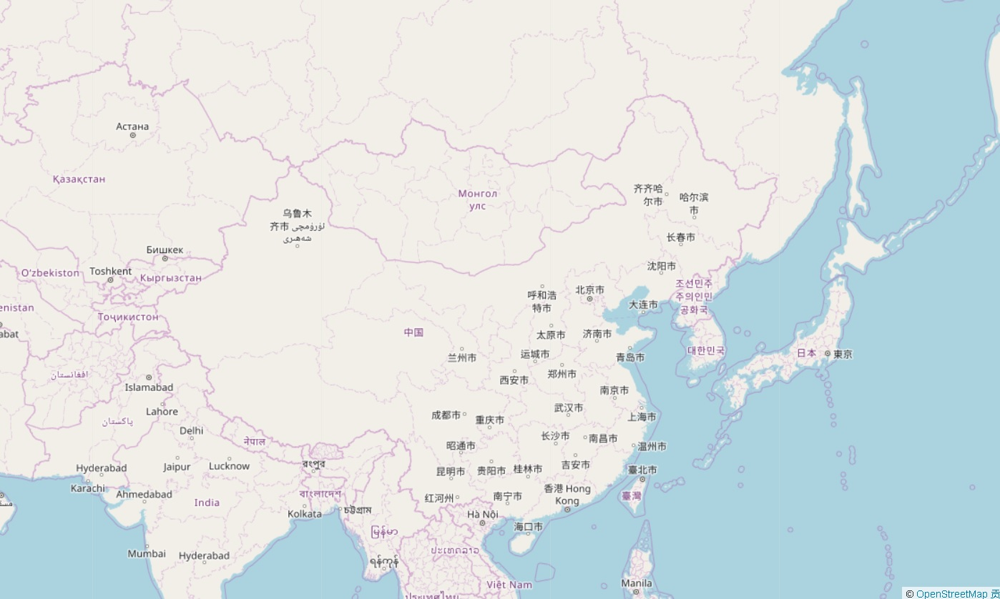
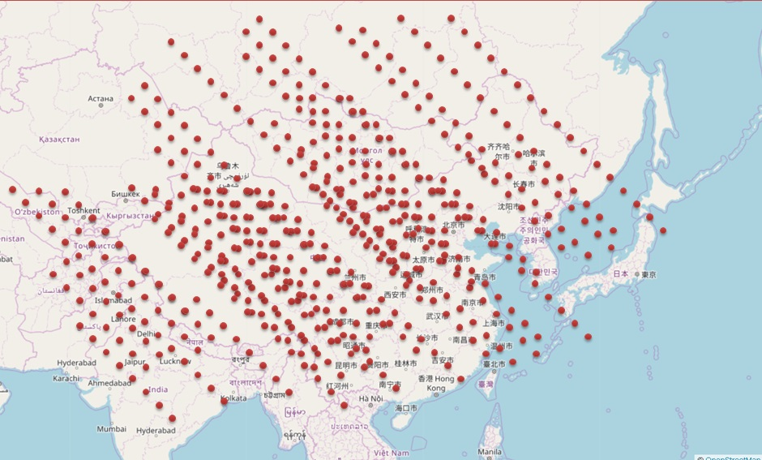

## PostGIS 点面叠加视觉判断输出  
                  
### 作者                 
digoal                  
                  
### 日期                
2017-09-14                    
                  
### 标签                
PostgreSQL , 点面视觉输出 , subquery , nestloop join , 空间索引 , gist     
                  
----                
                  
## 背景     
在新零售、快递等行业，有大量的点数据（例如包裹位置、快递员位置、仓库位置等），同时有大量的面数据（如小区，商圈，写字楼等）。  
  
如何判断实时的正在配送的包裹落在哪个面呢？并且将之联系起来。  
  
这个从视觉角度来思考，非常简单。  
  
例如有一个地图，将其划分为若干个面（例如前面提到的小区）。  
  
  
  
然后有一些小点，这些是POINT数据。  
  
  
  
我们从图上一眼就能看出每个点落在哪个小区（面）里面。  
  
在数据库中，这可能是两份数据（一份为点，一份为面）。输出的实际上是点+面(ID)的数据。  
  
怎么做到高效的输出呢？  
  
## DEMO  
搜索某些订单，当前处于哪个面。这是非常典型的点面判断需求。  
  
接下来的例子，有25万个面，查询若干笔订单属于哪个面。  
  
1、创建、生成静态的面数据（通常面的数据是静态的，例如小区，商圈，大楼，仓库覆盖范围等）  
  
```  
postgres=# create table t2(id int, pos box);  
CREATE TABLE  
  
-- 在(0,0)到(500,500)的平面上，划分成251001个正方形的小面。  
  
postgres=# do language plpgsql $$    
declare  
x int;  
y int;  
begin  
for x in 0..500 loop  
for y in 0..500 loop   
  insert into t2 values (x+y, box(point(x,y),point(x+1,y+1)));  
end loop;  
end loop;  
end;  
$$;  
DO  
  
postgres=# select count(*) from t2;  
 count    
--------  
 251001  
(1 row)  
```  
  
创建空间索引  
  
postgres=# create index idx_t2 on t2 using gist(pos);  
CREATE INDEX  
  
2、创建、生成点的数据。  
  
```  
postgres=# create table t1(id int, pos point);  
CREATE TABLE  
```  
  
```  
-- 在(0,0),(500,500)的平面上，生成10000个随机的点  
  
postgres=# insert into t1 select id, point(random()*500, random()*500) from generate_series(1,10000) t(id);  
INSERT 0 10000  
```  
  
3、查询每个点，属于哪个面。  
  
方法1，JOIN  
  
```  
postgres=# explain analyze select t1.*,t2.* from t1 join t2 on (t2.pos @> box(t1.pos, t1.pos));  
                                                       QUERY PLAN                                                         
------------------------------------------------------------------------------------------------------------------------  
 Nested Loop  (cost=0.29..73322.20 rows=2510010 width=56) (actual time=0.094..1191.076 rows=10000 loops=1)  
   ->  Seq Scan on t1  (cost=0.00..116.00 rows=10000 width=20) (actual time=0.020..1.047 rows=10000 loops=1)  
   ->  Index Scan using idx_t2 on t2  (cost=0.29..4.81 rows=251 width=36) (actual time=0.039..0.118 rows=1 loops=10000)  
         Index Cond: (pos @> box(t1.pos, t1.pos))  
 Planning time: 0.102 ms  
 Execution time: 1191.619 ms  
(6 rows)  
```  
  
方法2，SUBQUERY  
  
```  
postgres=# explain analyze select t1.*, (select t2 from t2 where t2.pos @> box(t1.pos,t1.pos) limit 1) from t1;  
                                                            QUERY PLAN                                                              
----------------------------------------------------------------------------------------------------------------------------------  
 Seq Scan on t1  (cost=0.00..13706.74 rows=10000 width=52) (actual time=0.077..427.466 rows=10000 loops=1)  
   SubPlan 1  
     ->  Limit  (cost=0.29..1.36 rows=1 width=60) (actual time=0.042..0.042 rows=1 loops=10000)  
           ->  Index Scan using idx_t2 on t2  (cost=0.29..269.88 rows=251 width=60) (actual time=0.042..0.042 rows=1 loops=10000)  
                 Index Cond: (pos @> box(t1.pos, t1.pos))  
 Planning time: 0.080 ms  
 Execution time: 427.942 ms  
(7 rows)  
```  
  
如果是1000笔订单，返回差不多40毫秒  
  
```
postgres=# explain (analyze,verbose,timing,costs,buffers) select t1.*, (select t2 from t2 where t2.pos @> box(t1.pos,t1.pos) limit 1) from t1 limit 1000;
                                                                  QUERY PLAN                                                                  
----------------------------------------------------------------------------------------------------------------------------------------------
 Limit  (cost=0.00..1370.67 rows=1000 width=52) (actual time=0.069..39.754 rows=1000 loops=1)
   Output: t1.id, t1.pos, ((SubPlan 1))
   Buffers: shared hit=3002
   ->  Seq Scan on public.t1  (cost=0.00..13706.74 rows=10000 width=52) (actual time=0.069..39.658 rows=1000 loops=1)
         Output: t1.id, t1.pos, (SubPlan 1)
         Buffers: shared hit=3002
         SubPlan 1
           ->  Limit  (cost=0.29..1.36 rows=1 width=60) (actual time=0.039..0.039 rows=1 loops=1000)
                 Output: t2.*
                 Buffers: shared hit=3000
                 ->  Index Scan using idx_t2 on public.t2  (cost=0.29..269.88 rows=251 width=60) (actual time=0.039..0.039 rows=1 loops=1000)
                       Output: t2.*
                       Index Cond: (t2.pos @> box(t1.pos, t1.pos))
                       Buffers: shared hit=3000
 Planning time: 0.066 ms
 Execution time: 39.830 ms
(16 rows)
```
  
因为```@>```暂时不支持hash join，因此subquery更优一些。  
  
本文没有用到PostGIS空间数据库插件，而是使用了内置的平面几何类型，用于演示。  
  
真实场景请使用PostGIS。  
  
http://postgis.net/  
  
例如  
  
```
select  t1.*, (select t2 from t2 where ST_Within(t1.geom, t2.geom) limit 1) from t1;
```
  
## 小结  
点面判断在GIS信息崛起的今天，在越来越多的企业中成为了非常常见的需求，比如文中提到的。  
  
PostgreSQL在空间数据库领域有非常丰富的应用，从科研、军工、商业到民用，无处不在。  
  
结合空间索引，BRIN索引实现空间数据的高效率检索是很轻松的事情。  
  
  
<a rel="nofollow" href="http://info.flagcounter.com/h9V1"  ></a>  
  
  
  
  
  
  
## [digoal's 大量PostgreSQL文章入口](https://github.com/digoal/blog/blob/master/README.md "22709685feb7cab07d30f30387f0a9ae")
  
