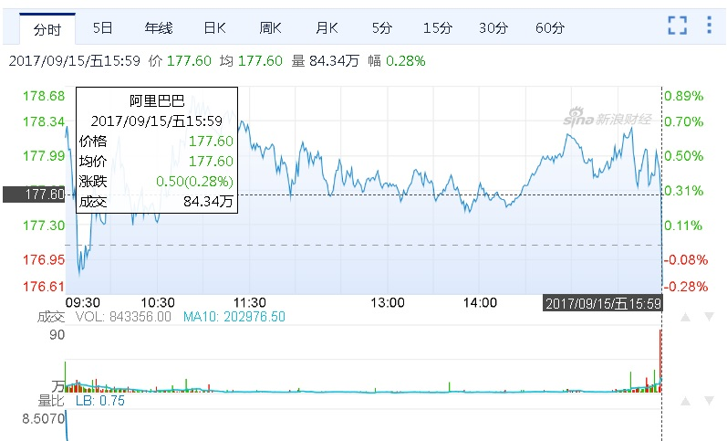

## 如何用一个回形针换一栋别墅 - openBarter (古人的物物交换市场) 类撮合交易系统    
                          
### 作者                         
digoal                          
                          
### 日期                        
2017-09-16                           
                          
### 标签                        
PostgreSQL , 物物交换 , 无货币时代 , openBarter , 交易系统 , 撮合交易 , 证券 , limit order , market order , central limit order book (CLOB)       
                          
----                        
                          
## 背景        
很久以前有一则这样的新闻：一个男孩用一个回形针，换回了一套别墅，他是怎么做到的呢？    
    
    
    
先不管他是怎么做到的，这让我联想到了古人物物交换的场景，没错古人还没有发明货币之前，都是通过物物交换的方式来得到其他人的东西的。（但是这样效率实在太低了）。另外，现在的证券交易也与之类似，只是更加的简化了的交换系统。    
    
撮合交易是证券交易系统最频繁，也是非常复杂的一个业务。撮合交易是咋回事呢：    
    
https://baike.baidu.com/item/%E6%92%AE%E5%90%88%E6%88%90%E4%BA%A4%E4%BB%B7    
    
### 概述    
什么是撮合成交价？    
    
当买入价等于卖出价时，成交价就是买入价或卖出价，这一点大家是不会有疑义的。问题是当买入价大于卖出价时成交价应该如何确定？    
    
### 举例说明    
计算机在撮合时实际上是依据前一笔成交价而定出最新成交价的。如果前一笔成交价低于或等于卖出价，则最新成交价就是卖出价；如果前一笔成交价高于或等于买入价，则最新成交价就是买入价；如果前一笔成交价在卖出价与买入价之间，则最新成交价就是前一笔的成交价。下面不妨以例明之。    
    
买方出价1399点，卖方出价是1397点。如果前一笔成交价为1397或1397点以下，最新成交价就是1397点；如果前一笔成交价为1399或1399点以上，则最新成交价就是1399点；如果前一笔成交价是1398点，则最新成交价就是1398点。    
    
这种撮合方法的好处是既显示了公平性，又使成交价格具有相对连续性，避免了不必要的无规律跳跃。    
    
（也就是说：用户可能卖到比委托价更高的价格，而买家则可能买到比委托价更低的价格。 关键看上一次交易的价格，以及用户委托的卖出和买入价。）    
    
### 撮合成交原则    
中金所计算机交易系统在撮合成交时，基本原则按价格优先、时间优先的原则进行（有的情况下为了控制风险的需要，会采取在价格相同情况下，平仓单优先）。    
    
该原则的完整解释是：买家出价高的优先，卖家出价低的优先，如果出价相同则挂单时间最早的优先。    
    
举例说明：    
    
例如，某交易者卖出3月沪深300指数期货10手，挂出价格为1400点，交易者甲挂出10手买单，报价为1398点；随后，交易者乙也想买10手，挂价为1399点，由于乙的价格比甲高，按照价格优先原则，乙的单子排在甲的前面；后来，丙也挂出10手买单，价格同样为1399点，由于挂价与乙相同，按照时间优先原则，只能排在乙的后面，但仍在甲之前。假如这时有一个交易者以1397点卖出10手，买方优先成交者就是乙。    
    
### 回到古代 - 没有货币的物物交换    
    
相对撮合交易系统，还有一个更古老、更复杂的系统，物物交换系统，因为在古代还没有货币的时候，人们要像得到其他人生产的东西，必须以交换的形式进行。    
    
例如：    
    
A生产棉花，B生产玉米，C生产小麦。    
    
A需要小麦，B需要棉花，C需要玉米。    
    
怎么交易呢？    
    
A和B更换，然后A和C换，然后B和C换。    
    
商品越多，换法可能会更加复杂。    
    
## openBarter    
openBarter是一个物物交换系统插件，撮合物物交换的交易。    
    
原理详见：    
    
http://olivierch.github.io/openBarter/    
    
https://api.pgxn.org/src/openbarter/openbarter-0.8.2/doc/doc-ob.pdf    
    
https://api.pgxn.org/src/openbarter/openbarter-0.7.0/doc/barterUtopia.pdf    
     
1、openBarter用到了4张表 (torder, tstack, tmvt, towner)：    
    
The order book stored in a table torder    
    
a stack accepting orders as input tstack    
    
a stack tmvt storing movements to be consumed.     
    
A table towner is used to store names of owners of the orders of the order book。    
    
2、通过UDF实现的接口：    
    
报价：    
    
Interactions with the order book can be submissions of orders to be executed or administrative tasks.     
    
Orders submitted are recorded in a table tstack representing a stack.     
    
The stack is consumed to execute orders.    
    
撮合交易：    
    
Results of interactions are recorded in the table tmvt.     
    
Records of this table represent movements for barter orders, a barter order producing several movements.     
    
A record of this table can also represent the result of other interactions.     
    
## 小结    
1、证券交易，由于存在委托买卖价格不一致的情况，实际上需要根据上一比交易的价格，以及委托价来定，所以并不是绝对只接受委托价。为了撮合交易，满足买低不买高，卖高不卖低的原则，需要记录每个股票上一比交易的成交价（撮合价）。同时还需要满足时间优先、价格优先的原则。    
    
2、快速匹配，消除订单是物物交换系统、证券交易撮合委托交易的核心诉求。    
    
3、几个股票交易相关的术语    
    
https://www.zhihu.com/question/24118706    
    
作者：放开那个猕猴桃    
    
链接：https://www.zhihu.com/question/24118706/answer/30372783    
    
来源：知乎    
    
著作权归作者所有。商业转载请联系作者获得授权，非商业转载请注明出处。    
    
Market Order: 市价订单。就是如果你下单后，基本上会马上执行的，该订单价格就是下单后的市场价格。    
    
Limit order: 限价订单。这个也容易理解，就是限定一个价格买入和卖出。比如某股票市价可能是15，你希望大跌后买入，你想设定10刀，这时候就用limit order，买入价格就是10刀。偶尔可能有一点点的不同，比如9.99这样。如果你是买入，实际买入价格应该和你设定的limit price一样或略低，如果你是卖出，实际卖出价格应该和你设定的limit price一样或略高，    
    
Stop order（stop-loss order）: 通常用来止损或者锁定利润。和limit order最大的差别是, Limit order在你下单后你的券商是马上将这个订单推送到市场。但是stop order不是，提交stop order后，这个订单在券商这里，拿下跌止损来说，比如当前股价是15，你希望如果股价下跌，最多损失5刀每股，你设定stop order price是10，只有当股票大跌的时候并且跌穿10刀的时候，这时候券商会将订单推向市场，成为一个market order, 以低于10刀的价格尽快卖出。但是券商无法保证卖出价格是多少。    
    
stop limit order: 可以这么理解stop order是一个trigger,触发条件， limit order是你严格限制的价格，券商只能按照你设置的limit price来买卖（可能会有微小差异，可以忽略）。所以stop limit order就是给你更多的控制权，你设定2个价格stop price和limit price，当达到stop price的时候，这时候这个stop limit order 就成为了一个limit order，接下来的行为和limit order一样了.比如你15买入一只股票，股票在下跌途中，你想在10刀止损，但是不想股票跌到10刀就马上止损，因为股票下跌过程中也是波动的，如果跌到10刀马上反弹了呢，止损止在最低点怎么办？你可以设定stop price，比如9.5刀，只有跌穿9.5刀后，然后才执行limit order。    
    
PS：stop order不是在券商手里，而是在market maker手里，券商已经将stop order route到市场中了，给了做市商。    
    
4、撮合系统和交易系统不同，买卖双方是需要撮合的，撮合系统类似红娘，牵线搭桥。    
    
一个简单的设计如下：    
    
买方报价，为了提高并发度，每个股票代码一张表：    
    
```    
create table buy_000001 (  -- 每个股票代码一个表    
  uid int,          -- 用户ID    
  bucket int,       -- 报价数量    
  price numeric,    -- 报价    
  ts timestamp,     -- 时间    
  order_type int2   -- 报价类别(限价、市价等)    
);    
```    
    
卖方报价，为了提高并发度，每个股票代码一张表：    
    
```    
create table sell_000001 (  -- 每个股票代码一个表    
  uid int,          -- 用户ID    
  bucket int,       -- 报价数量    
  price numeric,    -- 报价    
  ts timestamp,     -- 时间    
  order_type int2   -- 报价类别(限价、市价等)    
);    
```    
    
撮合：    
    
```    
do language plpgsql $$    
declare    
  声明 游标1 buy order by ts    
  声明 游标2 sell order by ts    
begin    
  loop 游标1    
    loop 游标2    
      逻辑    
      更新、删除 复合条件的 游标1、游标2 的current tuple.    
      符合条件后退出loop游标2（例如该笔BUY已撮合完成）    
    end loop;    
    符合条件后退出loop游标1（例如sell游标已没有数据）    
  end loop;    
end;    
$$;    
```    
  
每只股票的交易量也是惊人的，每分钟交易百万笔是很常见的，要做好撮合系统，还需要继续探索和良好的设计，加油PostgreSQL，你一定能搞定的，有空闲时间会继续思考这个场景，非常有意思。  
  
    
    
## 参考    
https://baike.baidu.com/item/%E6%92%AE%E5%90%88%E6%88%90%E4%BA%A4%E4%BB%B7    
    
https://www.zhihu.com/question/24118706    
    
http://olivierch.github.io/openBarter/    
    
https://api.pgxn.org/src/openbarter/openbarter-0.8.2/doc/doc-ob.pdf    
    
https://api.pgxn.org/src/openbarter/openbarter-0.7.0/doc/barterUtopia.pdf    
  
图式搜索算法亦可应用在此，你需要有一个系统存储了对象与对象之间的交换差价，用图式搜索找到两个对象的最低成本路径：   
   
http://pgrouting.org/   
  
<a rel="nofollow" href="http://info.flagcounter.com/h9V1"  ></a>  
  
  
  
  
  
  
## [digoal's 大量PostgreSQL文章入口](https://github.com/digoal/blog/blob/master/README.md "22709685feb7cab07d30f30387f0a9ae")
  
