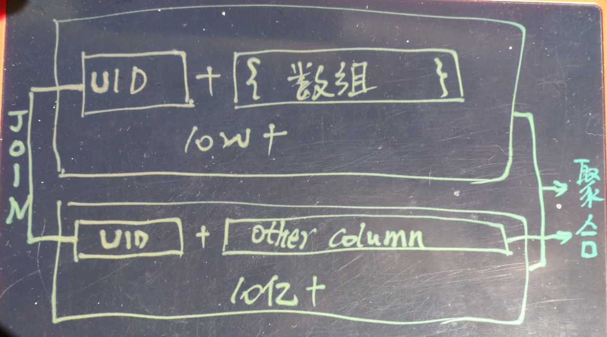

## 画像圈人 + 人群行为透视  
                     
### 作者    
digoal    
    
### 日期     
2017-09-18     
      
### 标签    
PostgreSQL , Greenplum , HybridDB for PostgreSQL    
                
----                
                 
## 背景          
本文讲的是这样的场景：画像圈人和人群行为透视的结合。  
  
  
  
数据量  
  
```  
标签数 5W+   
  
用户数 10W+   
  
用户行为数据 10亿+   
```  
  
业务目标：根据标签圈出用户群体，对这些用户的行为进行透视分析。   
  
### 第一步，圈人  
  
第一步是圈出用户群体，如果这一步的数据量非常庞大，则可以参考如下文章：  
  
1、[《多字段，任意组合(0建模) - 毫秒级实时圈人》](../201706/20170607_02.md)          
    
2、[《万亿级营销(圈人)迈入毫秒时代 - 实时推荐系统数据库设计》](../201612/20161225_01.md)          
    
3、用阿里云RDS varbitx支持万亿user_tags级实时圈人        
        
[《阿里云RDS for PostgreSQL varbitx插件与实时画像应用场景介绍》](../201705/20170502_01.md)          
       
[《基于 阿里云RDS PostgreSQL 打造实时用户画像推荐系统》](../201610/20161021_01.md)        
    
4、[《音视图(泛内容)网站透视分析 DB设计 - 阿里云(RDS、HybridDB) for PostgreSQL最佳实践》](../201708/20170827_01.md)    
  
第一步加速的核心是高速定位到人群，前面的案例中用到的技术点：  
  
GIN倒排索引、倒置BITMAP、BITMAP SCAN、metascan、BRIN索引等，目标是降低扫描，聚集等。  
  
但是，本案例的第一步数据量并不大，而是10几万，即使直接裸算也是很快的（并行）。  
  
### 第二步，人群行为透视  
第二步根据第一步得到的UID，在行为日志中搜索对应人群的行为，并进行透视。涉及的数据量较大，但依旧有优化方法。  
  
优化点，人群行为数据聚集存储，例如按UID聚集，通过METASCAN、BRIN索引等方法降低行为数据表的IO扫描量。因为行为数据通常是APPEND ONLY的，因此按时间分区，按UID整理过去分区数据是可行的。  
  
### 对比HybridDB 和 RDS PostgreSQL  
在不涉及前面提到的优化手段的前提下，对比一下HybridDB和RDS PostgreSQL的性能。让用户更加了解这两个产品的差异和适应场景。  
  
## HybridDB for PostgreSQL  
1、规格：  
  
HDB PG 48个计算单元  
  
2、建表、生成测试数据（画像表10万，行为表10亿）  
  
```  
create table a(id int, tag int[]) with (APPENDONLY=true, ORIENTATION=column, COMPRESSTYPE=zlib, CHECKSUM=off);  
  
create table a_log (id int, c1 int, c2 int, c3 int, c4 int, c5 int, c6 int, c7 int, c8 int, c9 int, c10 int) with (APPENDONLY=true, ORIENTATION=column, COMPRESSTYPE=zlib, CHECKSUM=off);  
  
create or replace function gen_rand_ints(int, int, int) returns int[] as $$    
  select array(select (random()*($2-$1))::int+$1 from generate_series(1,$3));    
$$ language sql strict;    
  
insert into a select id, gen_rand_ints(1,50000,300) from generate_series(1,100000) t(id);  
  
insert into a_log select random()*100000, random()*500, random()*500, random()*500, random()*500, random()*500, random()*500, random()*500, random()*500, random()*500, random()*500 from generate_series(1,1000000000);  
```  
  
3、空间占用  
  
```  
postgres=# select pg_size_pretty(pg_relation_size('a'));  
 pg_size_pretty   
----------------  
 76 MB  
(1 row)  
  
postgres=# select pg_size_pretty(pg_relation_size('a_log'));  
 pg_size_pretty   
----------------  
 19 GB  
(1 row)  
```  
  
4、透视查询语句，执行计划  
  
```  
select sum(c1), avg(c2), min(c3), max(c4) from a_log join a on (a_log.id=a.id and a.tag @> array[1]);  
  
postgres=# explain select sum(c1), avg(c2), min(c3), max(c4) from a_log join a on (a_log.id=a.id and a.tag @> array[1]);  
                                                 QUERY PLAN                                                    
-------------------------------------------------------------------------------------------------------------  
 Aggregate  (cost=13869664.73..13869664.74 rows=1 width=48)  
   ->  Gather Motion 48:1  (slice1; segments: 48)  (cost=13869664.20..13869664.70 rows=1 width=48)  
         ->  Aggregate  (cost=13869664.20..13869664.21 rows=1 width=48)  
               ->  Hash Join  (cost=5031.25..13860616.22 rows=18850 width=16)  
                     Hash Cond: a_log.id = a.id  
                     ->  Append-only Columnar Scan on a_log  (cost=0.00..11344275.00 rows=20833334 width=20)  
                     ->  Hash  (cost=5030.00..5030.00 rows=3 width=4)  
                           ->  Append-only Columnar Scan on a  (cost=0.00..5030.00 rows=3 width=4)  
                                 Filter: tag @> '{1}'::integer[]  
 Settings:  optimizer=off  
 Optimizer status: legacy query optimizer  
(11 rows)  
```
  
5、透视查询耗时，约6秒。  
  
```  
postgres=# select sum(c1), avg(c2), min(c3), max(c4) from a_log join a on (a_log.id=a.id and a.tag @> array[1]);  
    sum    |       avg        | min | max   
-----------+------------------+-----+-----  
 754891765 | 250.136526278975 |   0 | 500  
(1 row)  
Time: 5983.161 ms  
```  
  
## RDS for PostgreSQL 多核并行  
1、规格：  
  
RDS PG 10 独占物理机  
  
2、建表、生成测试数据（画像表10万，行为表10亿）  
  
```  
create table a(id int, tag int[]) ;  
  
create table a_log (id int, c1 int, c2 int, c3 int, c4 int, c5 int, c6 int, c7 int, c8 int, c9 int, c10 int) ;  
  
create or replace function gen_rand_ints(int, int, int) returns int[] as $$    
  select array(select (random()*($2-$1))::int+$1 from generate_series(1,$3));    
$$ language sql strict;    
  
insert into a select id, gen_rand_ints(1,50000,300) from generate_series(1,100000) t(id);  
  
insert into a_log select random()*100000, random()*500, random()*500, random()*500, random()*500, random()*500, random()*500, random()*500, random()*500, random()*500, random()*500 from generate_series(1,1000000000);  
```  
  
3、空间占用  
  
```  
postgres=# select pg_size_pretty(pg_relation_size('a'));  
 pg_size_pretty   
----------------  
 125 MB  
(1 row)  
  
postgres=# select pg_size_pretty(pg_relation_size('a_log'));  
 pg_size_pretty   
----------------  
 71 GB  
(1 row)  
```  
  
4、并行透视查询语句，执行计划  
  
```  
alter table a set (parallel_workers =4);  
alter table a_log set (parallel_workers =32);  
set max_parallel_workers_per_gather =32;  
  
select sum(c1), avg(c2), min(c3), max(c4) from a_log join a on (a_log.id=a.id and a.tag @> array[1]);  
  
postgres=# explain select sum(c1), avg(c2), min(c3), max(c4) from a_log join a on (a_log.id=a.id and a.tag @> array[1]);  
                                             QUERY PLAN                                               
----------------------------------------------------------------------------------------------------  
 Finalize Aggregate  (cost=2763595.31..2763595.32 rows=1 width=48)  
   ->  Gather  (cost=2763594.98..2763594.99 rows=32 width=48)  
         Workers Planned: 32  
         ->  Partial Aggregate  (cost=2763594.98..2763594.99 rows=1 width=48)  
               ->  Hash Join  (cost=5256.25..2762060.42 rows=153456 width=16)  
                     Hash Cond: (a_log.id = a.id)  
                     ->  Parallel Seq Scan on a_log  (cost=0.00..2638082.08 rows=31250008 width=20)  
                     ->  Hash  (cost=5250.00..5250.00 rows=500 width=4)  
                           ->  Seq Scan on a  (cost=0.00..5250.00 rows=500 width=4)  
                                 Filter: (tag @> '{1}'::integer[])  
(10 rows)  
```  
  
5、并行透视查询耗时，约4.5秒。  
  
```  
postgres=# select sum(c1), avg(c2), min(c3), max(c4) from a_log join a on (a_log.id=a.id and a.tag @> array[1]);  
    sum    |         avg          | min | max   
-----------+----------------------+-----+-----  
 787224592 | 249.9961077211050058 |   0 | 500  
(1 row)  
  
Time: 4550.672 ms (00:04.551)  
```  
  
## RDS for PostgreSQL 非并行  
1、非并行透视查询语句，执行计划  
  
```  
set max_parallel_workers_per_gather =0;  
  
select sum(c1), avg(c2), min(c3), max(c4) from a_log join a on (a_log.id=a.id and a.tag @> array[1]);  
  
postgres=# explain select sum(c1), avg(c2), min(c3), max(c4) from a_log join a on (a_log.id=a.id and a.tag @> array[1]);  
                                    QUERY PLAN                                      
----------------------------------------------------------------------------------  
 Aggregate  (cost=16179053.37..16179053.38 rows=1 width=48)  
   ->  Hash Join  (cost=5256.25..16129947.57 rows=4910580 width=16)  
         Hash Cond: (a_log.id = a.id)  
         ->  Seq Scan on a_log  (cost=0.00..12325584.56 rows=1000000256 width=20)  
         ->  Hash  (cost=5250.00..5250.00 rows=500 width=4)  
               ->  Seq Scan on a  (cost=0.00..5250.00 rows=500 width=4)  
                     Filter: (tag @> '{1}'::integer[])  
(7 rows)  
```  
  
2、非并行透视查询耗时，约115秒。  
  
```  
postgres=# select sum(c1), avg(c2), min(c3), max(c4) from a_log join a on (a_log.id=a.id and a.tag @> array[1]);  
    sum    |         avg          | min | max   
-----------+----------------------+-----+-----  
 787224592 | 249.9961077211050058 |   0 | 500  
(1 row)  
  
Time: 115492.869 ms (01:55.493)  
```  
  
## 小结  
  
产品 | 记录数 | 空间占用  
---|---|---  
HDB PG 列存+压缩 | 10亿(11列) | 19 GB  
PG 10 堆表 | 10亿(11列) | 71 GB  
  
  
产品 | 并行度、计算节点数 | JOIN+数组过滤+透视 耗时  
---|---|---  
HDB PG | 48 | 6秒  
PG 10 | 32 | 4.5秒  
PG 10 | 1 | 115秒  
  
### Greenplum和PostgreSQL两个产品的特色
  
1、PostgreSQL 10 适合以10TB ~ 100TB，OLTP为主，OLAP为辅的场景。与Oracle覆盖的场景非常类似。  
  
兼容SQL:2011，百万+级tpmC。  
  
支持多核并行计算。  
  
支持可读写的OSS对象存储外部表。  
  
支持常用类型、扩展数据类型：JSON(B)、Hstore(KV), PostGIS空间数据库、pgrouting(路由,图式搜索)、数组、ltree树类型、HLL估值类型, smlar, imgsmlr等。  
  
支持SQL流计算插件  
  
支持时序插件  
  
支持btree, hash, gin, gist, sp-gist, bloom, brin等索引。  
  
支持plpgsql, sql服务端编程。  
  
支持分析型语法（多维计算、窗口查询）、递归查询(树形查询、图式搜索、等场景)。支持文本全文检索、模糊查询、相似查询、正则查询。支持数组相似查询，图像相似查询。  
  
1\.1 适合业务场景：  
  
```  
 TB+级OLTP(在线事务处理)+OLAP(实时分析)。  

 模糊查询、相似搜索、正则搜索  

 全文检索  

 物联网  

 流式数据处理  

 社交  

 图式搜索  

 独立事件分析  

 冷热分离  

 异步消息  

 多值类型、图像特征值 相似搜索  

 实时数据清洗  

 GIS应用  

 任意字段实时搜索  

 ... ...
```  
  
1\.2 主打：功能、稳定性、性能、高可用、可靠性、Oracle兼容性、HTAP。  
  
2、HybridDB for PostgreSQL(Greenplum开源版GPDB改进而来) 适合PB级实时OLAP，非常典型的海量数仓。  
  
兼容SQL:2008，兼容TPC-H，TPC-DS。有数十年的商业化历练经验。  
  
支持可读写的OSS对象存储外部表  
  
支持常用类型、扩展数据类型：JSON、PostGIS空间数据库、数组、HLL估值类型。  
  
支持bitmap, hash, btree索引。  
  
支持pljava服务端编程。  
  
支持分析型语法（多维计算、窗口查询、MADlib机器学习）、支持全文检索语法。  
  
支持列存储、行存储、压缩、混合存储。  
  
支持4阶段聚合，支持节点间自动重分布。  
  
支持水平扩容。  
  
2\.1 适合业务场景：  
  
PB+级实时分析。（传统统计；时间、空间、属性多维属性透视、圈人；任意表、任意维度JOIN；）  
  
2\.2 主打：分析型SQL兼容性、功能、稳定性、性能、高可用、扩展性。  
  
  
<a rel="nofollow" href="http://info.flagcounter.com/h9V1"  ></a>  
  
  
  
  
  
  
## [digoal's 大量PostgreSQL文章入口](https://github.com/digoal/blog/blob/master/README.md "22709685feb7cab07d30f30387f0a9ae")
  
