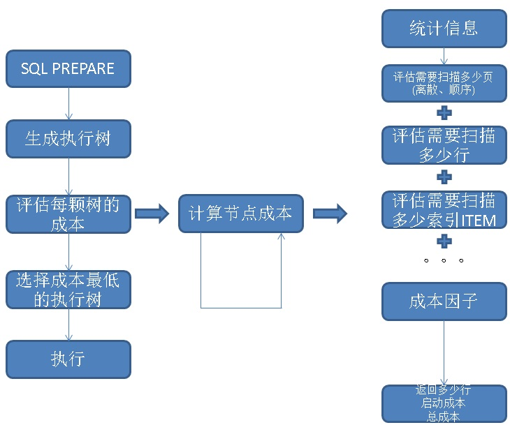

## PostgreSQL 规格评估 - 微观、宏观、精准 多视角估算数据库性能(选型、做预算不求人)  
                       
### 作者      
digoal      
      
### 日期       
2017-09-21      
        
### 标签      
PostgreSQL , PPAS , Greenplum , HybridDB for PostgreSQL , 性能 , 估算 , pgbench , 统计细信息 , explain算法 , 统计信息导入导出         
                  
----                  
                   
## 背景    
在提预算时必不可少的环境是评估需要多少硬件。  
  
通常会要求业务方提供一些数据，例如用户数、PV、UV等。但是这种评估纯靠经验，方法非常的粗糙也不准确。  
  
那么到底如何评估需要多少硬件、或者说需要什么样规格的硬件来支撑你未来的业务呢？  
  
对于PostgreSQL这个数据库产品来说，我介绍一下三种评估方法：  
  
1、微观评估（相对来说比较准确）  
  
2、宏观评估（对选型有帮助，对规格帮助不大，略显粗糙）  
  
3、精准评估（最为准确，但是要求对业务非常熟悉，对未来的瓶颈把握准确）  
  
## 一、微观估算法  
我们在通过SQL与数据库交互时，数据库是如何执行SQL的呢？  
  
首先要PARSE SQL，然后生成执行路径，选择最优执行路径，执行SQL，最关键的是选择最优执行路径。PostgreSQL是CBO的优化器，根据成本选择。  
  
这里提到了成本，成本是怎么算出来的呢？成本是结合扫描方法、统计信息、估算需要扫描多少个数据块，扫描多少条记录，最后通过对应扫描方法的成本估算算法算出来的。  
  
### 一个 QUERY 有哪些成本  
1、成本包括：  
  
IO成本，CPU成本。  
  
2、IO成本包括：  
  
连续IO成本，离散IO层板。  
  
3、CPU成本包括：  
  
获取索引、TOAST索引、堆表、TOAST表的tuple或ITEM的成本；  
  
操作符、函数处理行的成本；  
  
处理JOIN的成本等等。  
  
### 一个 QUERY 如何执行和传递成本  
生成好执行计划后，QUERY的执行就会按执行树来执行  
  
  
  
执行树由若干个节点组成，从一个节点，跳到下一个节点，就好像接力赛一样。  
  
  
  
节点跟节点之间传递的是什么呢？  
  
Path数据结构，主要包含（rows, startup_cost, total_cost）。一个数据节点  
  
rows，表示这个节点有多少满足条件的行，输出到下一个节点。  
  
startup_cost，表示这个节点得到第一条符合条件的记录，需要多少成本。  
  
total_cost，表示这个节点得到所有符合条件的记录，需要多少成本。  
  
### 执行节点有哪些种类  
执行节点的种类很多，可以从成本计算的代码中得到：  
  
src/backend/optimizer/path/costsize.c  
  
```  
/*  
 * cost_seqscan  
 *        Determines and returns the cost of scanning a relation sequentially.  
 *  
 * 'baserel' is the relation to be scanned  
 * 'param_info' is the ParamPathInfo if this is a parameterized path, else NULL  
 */  
cost_seqscan(Path *path, PlannerInfo *root, RelOptInfo *baserel, ParamPathInfo *param_info)  
  
/*  
 * cost_samplescan  
 *        Determines and returns the cost of scanning a relation using sampling.  
 *  
 * 'baserel' is the relation to be scanned  
 * 'param_info' is the ParamPathInfo if this is a parameterized path, else NULL  
 */  
cost_samplescan(Path *path, PlannerInfo *root, RelOptInfo *baserel, ParamPathInfo *param_info)  
  
/*  
 * cost_gather  
 *        Determines and returns the cost of gather path.  
 *  
 * 'rel' is the relation to be operated upon  
 * 'param_info' is the ParamPathInfo if this is a parameterized path, else NULL  
 * 'rows' may be used to point to a row estimate; if non-NULL, it overrides  
 * both 'rel' and 'param_info'.  This is useful when the path doesn't exactly  
 * correspond to any particular RelOptInfo.  
 */  
cost_gather(GatherPath *path, PlannerInfo *root, RelOptInfo *rel,   
ParamPathInfo *param_info, double *rows)  
  
/*  
 * cost_gather_merge  
 *        Determines and returns the cost of gather merge path.  
 *  
 * GatherMerge merges several pre-sorted input streams, using a heap that at  
 * any given instant holds the next tuple from each stream. If there are N  
 * streams, we need about N*log2(N) tuple comparisons to construct the heap at  
 * startup, and then for each output tuple, about log2(N) comparisons to  
 * replace the top heap entry with the next tuple from the same stream.  
 */  
cost_gather_merge(GatherMergePath *path, PlannerInfo *root, RelOptInfo *rel,   
ParamPathInfo *param_info, Cost input_startup_cost, Cost input_total_cost, double *rows)  
  
  
/*  
 * cost_index  
 *        Determines and returns the cost of scanning a relation using an index.  
 *  
 * 'path' describes the indexscan under consideration, and is complete  
 *              except for the fields to be set by this routine  
 * 'loop_count' is the number of repetitions of the indexscan to factor into  
 *              estimates of caching behavior  
 *  
 * In addition to rows, startup_cost and total_cost, cost_index() sets the  
 * path's indextotalcost and indexselectivity fields.  These values will be  
 * needed if the IndexPath is used in a BitmapIndexScan.  
 *  
 * NOTE: path->indexquals must contain only clauses usable as index  
 * restrictions.  Any additional quals evaluated as qpquals may reduce the  
 * number of returned tuples, but they won't reduce the number of tuples  
 * we have to fetch from the table, so they don't reduce the scan cost.  
 */  
cost_index(IndexPath *path, PlannerInfo *root, double loop_count, bool partial_path)  
  
/*  
 * cost_bitmap_heap_scan  
 *        Determines and returns the cost of scanning a relation using a bitmap  
 *        index-then-heap plan.  
 *  
 * 'baserel' is the relation to be scanned  
 * 'param_info' is the ParamPathInfo if this is a parameterized path, else NULL  
 * 'bitmapqual' is a tree of IndexPaths, BitmapAndPaths, and BitmapOrPaths  
 * 'loop_count' is the number of repetitions of the indexscan to factor into  
 *              estimates of caching behavior  
 *  
 * Note: the component IndexPaths in bitmapqual should have been costed  
 * using the same loop_count.  
 */  
cost_bitmap_heap_scan(Path *path, PlannerInfo *root, RelOptInfo *baserel,   
ParamPathInfo *param_info, Path *bitmapqual, double loop_count)  
  
/*  
 * cost_bitmap_tree_node  
 *              Extract cost and selectivity from a bitmap tree node (index/and/or)  
 */  
cost_bitmap_tree_node(Path *path, Cost *cost, Selectivity *selec)  
  
  
/*  
 * cost_bitmap_and_node  
 *              Estimate the cost of a BitmapAnd node  
 *  
 * Note that this considers only the costs of index scanning and bitmap  
 * creation, not the eventual heap access.  In that sense the object isn't  
 * truly a Path, but it has enough path-like properties (costs in particular)  
 * to warrant treating it as one.  We don't bother to set the path rows field,  
 * however.  
 */  
cost_bitmap_and_node(BitmapAndPath *path, PlannerInfo *root)  
  
  
/*  
 * cost_bitmap_or_node  
 *              Estimate the cost of a BitmapOr node  
 *  
 * See comments for cost_bitmap_and_node.  
 */  
cost_bitmap_or_node(BitmapOrPath *path, PlannerInfo *root)  
  
  
/*  
 * cost_tidscan  
 *        Determines and returns the cost of scanning a relation using TIDs.  
 *  
 * 'baserel' is the relation to be scanned  
 * 'tidquals' is the list of TID-checkable quals  
 * 'param_info' is the ParamPathInfo if this is a parameterized path, else NULL  
 */  
cost_tidscan(Path *path, PlannerInfo *root, RelOptInfo *baserel,   
List *tidquals, ParamPathInfo *param_info)  
  
  
/*  
 * cost_subqueryscan  
 *        Determines and returns the cost of scanning a subquery RTE.  
 *  
 * 'baserel' is the relation to be scanned  
 * 'param_info' is the ParamPathInfo if this is a parameterized path, else NULL  
 */  
cost_subqueryscan(SubqueryScanPath *path, PlannerInfo *root,   
RelOptInfo *baserel, ParamPathInfo *param_info)  
  
  
/*  
 * cost_functionscan  
 *        Determines and returns the cost of scanning a function RTE.  
 *  
 * 'baserel' is the relation to be scanned  
 * 'param_info' is the ParamPathInfo if this is a parameterized path, else NULL  
 */  
cost_functionscan(Path *path, PlannerInfo *root, RelOptInfo *baserel, ParamPathInfo *param_info)  
  
  
/*  
 * cost_tablefuncscan  
 *        Determines and returns the cost of scanning a table function.  
 *  
 * 'baserel' is the relation to be scanned  
 * 'param_info' is the ParamPathInfo if this is a parameterized path, else NULL  
 */  
cost_tablefuncscan(Path *path, PlannerInfo *root, RelOptInfo *baserel, ParamPathInfo *param_info)  
  
  
/*  
 * cost_valuesscan  
 *        Determines and returns the cost of scanning a VALUES RTE.  
 *  
 * 'baserel' is the relation to be scanned  
 * 'param_info' is the ParamPathInfo if this is a parameterized path, else NULL  
 */  
cost_valuesscan(Path *path, PlannerInfo *root, RelOptInfo *baserel, ParamPathInfo *param_info)  
  
  
/*  
 * cost_ctescan  
 *        Determines and returns the cost of scanning a CTE RTE.  
 *  
 * Note: this is used for both self-reference and regular CTEs; the  
 * possible cost differences are below the threshold of what we could  
 * estimate accurately anyway.  Note that the costs of evaluating the  
 * referenced CTE query are added into the final plan as initplan costs,  
 * and should NOT be counted here.  
 */  
cost_ctescan(Path *path, PlannerInfo *root, RelOptInfo *baserel, ParamPathInfo *param_info)  
cost_namedtuplestorescan(Path *path, PlannerInfo *root,   
RelOptInfo *baserel, ParamPathInfo *param_info)  
  
  
/*  
 * cost_recursive_union  
 *        Determines and returns the cost of performing a recursive union,  
 *        and also the estimated output size.  
 *  
 * We are given Paths for the nonrecursive and recursive terms.  
 */  
cost_recursive_union(Path *runion, Path *nrterm, Path *rterm)  
  
  
/*  
 * cost_sort  
 *        Determines and returns the cost of sorting a relation, including  
 *        the cost of reading the input data.  
 *  
 * If the total volume of data to sort is less than sort_mem, we will do  
 * an in-memory sort, which requires no I/O and about t*log2(t) tuple  
 * comparisons for t tuples.  
 *  
 * If the total volume exceeds sort_mem, we switch to a tape-style merge  
 * algorithm.  There will still be about t*log2(t) tuple comparisons in  
 * total, but we will also need to write and read each tuple once per  
 * merge pass.  We expect about ceil(logM(r)) merge passes where r is the  
 * number of initial runs formed and M is the merge order used by tuplesort.c.  
 * Since the average initial run should be about sort_mem, we have  
 *              disk traffic = 2 * relsize * ceil(logM(p / sort_mem))  
 *              cpu = comparison_cost * t * log2(t)  
 *  
 * If the sort is bounded (i.e., only the first k result tuples are needed)  
 * and k tuples can fit into sort_mem, we use a heap method that keeps only  
 * k tuples in the heap; this will require about t*log2(k) tuple comparisons.  
 *  
 * The disk traffic is assumed to be 3/4ths sequential and 1/4th random  
 * accesses (XXX can't we refine that guess?)  
 *  
 * By default, we charge two operator evals per tuple comparison, which should  
 * be in the right ballpark in most cases.  The caller can tweak this by  
 * specifying nonzero comparison_cost; typically that's used for any extra  
 * work that has to be done to prepare the inputs to the comparison operators.  
 *  
 * 'pathkeys' is a list of sort keys  
 * 'input_cost' is the total cost for reading the input data  
 * 'tuples' is the number of tuples in the relation  
 * 'width' is the average tuple width in bytes  
 * 'comparison_cost' is the extra cost per comparison, if any  
 * 'sort_mem' is the number of kilobytes of work memory allowed for the sort  
 * 'limit_tuples' is the bound on the number of output tuples; -1 if no bound  
 *  
 * NOTE: some callers currently pass NIL for pathkeys because they  
 * can't conveniently supply the sort keys.  Since this routine doesn't  
 * currently do anything with pathkeys anyway, that doesn't matter...  
 * but if it ever does, it should react gracefully to lack of key data.  
 * (Actually, the thing we'd most likely be interested in is just the number  
 * of sort keys, which all callers *could* supply.)  
 */  
cost_sort(Path *path, PlannerInfo *root, List *pathkeys,   
Cost input_cost, double tuples, int width, Cost comparison_cost, int sort_mem, double limit_tuples)  
  
  
/*  
 * cost_append  
 *        Determines and returns the cost of an Append node.  
 *  
 * We charge nothing extra for the Append itself, which perhaps is too  
 * optimistic, but since it doesn't do any selection or projection, it is a  
 * pretty cheap node.  
 */  
cost_append(Path *path, List *subpaths, int num_nonpartial_subpaths)  
  
/*  
 * cost_merge_append  
 *        Determines and returns the cost of a MergeAppend node.  
 *  
 * MergeAppend merges several pre-sorted input streams, using a heap that  
 * at any given instant holds the next tuple from each stream.  If there  
 * are N streams, we need about N*log2(N) tuple comparisons to construct  
 * the heap at startup, and then for each output tuple, about log2(N)  
 * comparisons to replace the top entry.  
 *  
 * (The effective value of N will drop once some of the input streams are  
 * exhausted, but it seems unlikely to be worth trying to account for that.)  
 *  
 * The heap is never spilled to disk, since we assume N is not very large.  
 * So this is much simpler than cost_sort.  
 *  
 * As in cost_sort, we charge two operator evals per tuple comparison.  
 *  
 * 'pathkeys' is a list of sort keys  
 * 'n_streams' is the number of input streams  
 * 'input_startup_cost' is the sum of the input streams' startup costs  
 * 'input_total_cost' is the sum of the input streams' total costs  
 * 'tuples' is the number of tuples in all the streams  
 */  
cost_merge_append(Path *path, PlannerInfo *root, List *pathkeys,   
int n_streams, Cost input_startup_cost, Cost input_total_cost, double tuples)  
  
  
/*  
 * cost_material  
 *        Determines and returns the cost of materializing a relation, including  
 *        the cost of reading the input data.  
 *  
 * If the total volume of data to materialize exceeds work_mem, we will need  
 * to write it to disk, so the cost is much higher in that case.  
 *  
 * Note that here we are estimating the costs for the first scan of the  
 * relation, so the materialization is all overhead --- any savings will  
 * occur only on rescan, which is estimated in cost_rescan.  
 */  
cost_material(Path *path, Cost input_startup_cost,   
Cost input_total_cost, double tuples, int width)  
  
/*  
 * cost_agg  
 *              Determines and returns the cost of performing an Agg plan node,  
 *              including the cost of its input.  
 *  
 * aggcosts can be NULL when there are no actual aggregate functions (i.e.,  
 * we are using a hashed Agg node just to do grouping).  
 *  
 * Note: when aggstrategy == AGG_SORTED, caller must ensure that input costs  
 * are for appropriately-sorted input.  
 */  
cost_agg(Path *path, PlannerInfo *root, AggStrategy aggstrategy,   
const AggClauseCosts *aggcosts, int numGroupCols, double numGroups, Cost input_startup_cost, Cost input_total_cost, double input_tuples)  
  
  
/*  
 * cost_windowagg  
 *              Determines and returns the cost of performing a WindowAgg plan node,  
 *              including the cost of its input.  
 *  
 * Input is assumed already properly sorted.  
 */  
cost_windowagg(Path *path, PlannerInfo *root, List *windowFuncs,   
int numPartCols, int numOrderCols, Cost input_startup_cost, Cost input_total_cost, double input_tuples)  
  
  
/*  
 * cost_group  
 *              Determines and returns the cost of performing a Group plan node,  
 *              including the cost of its input.  
 *  
 * Note: caller must ensure that input costs are for appropriately-sorted  
 * input.  
 */  
cost_group(Path *path, PlannerInfo *root, int numGroupCols, double numGroups,  
                   Cost input_startup_cost, Cost input_total_cost,  
                   double input_tuples)  
  
  
/*  
 * cost_subplan  
 *              Figure the costs for a SubPlan (or initplan).  
 *  
 * Note: we could dig the subplan's Plan out of the root list, but in practice  
 * all callers have it handy already, so we make them pass it.  
 */  
cost_subplan(PlannerInfo *root, SubPlan *subplan, Plan *plan)  
  
  
/*  
 * cost_rescan  
 *              Given a finished Path, estimate the costs of rescanning it after  
 *              having done so the first time.  For some Path types a rescan is  
 *              cheaper than an original scan (if no parameters change), and this  
 *              function embodies knowledge about that.  The default is to return  
 *              the same costs stored in the Path.  (Note that the cost estimates  
 *              actually stored in Paths are always for first scans.)  
 *  
 * This function is not currently intended to model effects such as rescans  
 * being cheaper due to disk block caching; what we are concerned with is  
 * plan types wherein the executor caches results explicitly, or doesn't  
 * redo startup calculations, etc.  
 */  
cost_rescan(PlannerInfo *root, Path *path, Cost *rescan_startup_cost,      /* output parameters */  
                        Cost *rescan_total_cost)  
  
  
/*  
 * cost_qual_eval  
 *              Estimate the CPU costs of evaluating a WHERE clause.  
 *              The input can be either an implicitly-ANDed list of boolean  
 *              expressions, or a list of RestrictInfo nodes.  (The latter is  
 *              preferred since it allows caching of the results.)  
 *              The result includes both a one-time (startup) component,  
 *              and a per-evaluation component.  
 */  
cost_qual_eval(QualCost *cost, List *quals, PlannerInfo *root)  
  
  
/*  
 * cost_qual_eval_node  
 *              As above, for a single RestrictInfo or expression.  
 */  
cost_qual_eval_node(QualCost *cost, Node *qual, PlannerInfo *root)  
  
  
  
cost_qual_eval_walker(Node *node, cost_qual_eval_context *context)  
```  
  
  
### 如何估算每个节点的成本  
记得前面提到的接力棒吗？接力棒里面包含了rows，这个非常关键。  
  
rows是告诉下一个节点，你可能要处理这么多行。  
  
而有rows是不够的，还有成本因子，因为每行还可能涉及到操作符的计算、并行worker的成本等。  
  
这些因子的设置如下：  
  
src/backend/optimizer/path/costsize.c  
  
```  
 *      seq_page_cost           Cost of a sequential page fetch  
 *      random_page_cost        Cost of a non-sequential page fetch  
 *      cpu_tuple_cost          Cost of typical CPU time to process a tuple  
 *      cpu_index_tuple_cost    Cost of typical CPU time to process an index tuple  
 *      cpu_operator_cost       Cost of CPU time to execute an operator or function  
 *      parallel_tuple_cost     Cost of CPU time to pass a tuple from worker to master backend  
 *      parallel_setup_cost     Cost of setting up shared memory for parallelism  
```  
  
### 成本计算图  
  
  
一些优化器的成本估算例子，可以参考文档：  
  
https://www.postgresql.org/docs/10/static/planner-stats-details.html  
  
src/backend/optimizer/path/costsize.c  
  
### 从成本如何得到执行时间  
注意成本是虚化的东西，和时间是不挂钩的，但是我们可以让他们挂钩起来。  
  
这就需要做校准，把成本因子调教成输出的cost等于执行时间的值。  
  
我在之前发表的文章中提到了如何校准，请参考。  
  
[《优化器成本因子校对 - PostgreSQL explain cost constants alignment to timestamp》](../201311/20131126_03.md)    
  
[《PostgreSQL 10 黑科技 - 自定义统计信息》](../201709/20170902_02.md)    
  
### 如何在用户没有数据的情况下，估算性能  
实际上方法很简单，我们需要业务方提供几个东西即可：  
  
1、表定义  
  
2、被评估的SQL  
  
3、统计信息，需要提供我用中文注释的部分。  
  
```  
                     View "pg_catalog.pg_stats"  
         Column         |   Type   | Collation | Nullable | Default   
------------------------+----------+-----------+----------+---------  
 schemaname             | name     |           |          |   
 tablename              | name     |           |          |   
 attname                | name     |           |          |   
 inherited              | boolean  |           |          |   
 null_frac              | real     |           |          | 空值比例  
 avg_width              | integer  |           |          | 平均行长度  
 n_distinct             | real     |           |          | 多少唯一值，或唯一值比例，-1表示唯一  
 most_common_vals       | anyarray |           |          | 高频词  
 most_common_freqs      | real[]   |           |          | 高频词的出现频率  
 histogram_bounds       | anyarray |           |          | 按记录数均分为若干BUCKET的 分位数（列值）  
 correlation            | real     |           |          | 存储和实际值的线性相关性  
 most_common_elems      | anyarray |           |          | 对于多值类型（数组），元素的高频词  
 most_common_elem_freqs | real[]   |           |          | 元素高频词出现的频率  
 elem_count_histogram   | real[]   |           |          | 元素按记录数均分为若干BUCKET的 分位数（元素值）  
```  
  
因为pg_stats支持导出导入，所以不需要实际数据即可完成，postgrespro版本就提供了这样的功能。  
  
https://postgrespro.com/docs/postgresproee/9.6/dump-stat.html    
  
4、已调教好的成本因子  
  
```  
 *      seq_page_cost           Cost of a sequential page fetch  
 *      random_page_cost        Cost of a non-sequential page fetch  
 *      cpu_tuple_cost          Cost of typical CPU time to process a tuple  
 *      cpu_index_tuple_cost    Cost of typical CPU time to process an index tuple  
 *      cpu_operator_cost       Cost of CPU time to execute an operator or function  
 *      parallel_tuple_cost     Cost of CPU time to pass a tuple from worker to master backend  
 *      parallel_setup_cost     Cost of setting up shared memory for parallelism  
int                     effective_cache_size = DEFAULT_EFFECTIVE_CACHE_SIZE;  
```  
  
有以上要素，我们就能通过explain SQL得到估算出来的SQL执行时间。  
  
就可以得到TPS等等。  
  
### 从执行时间如何得到TPS  
分为几种情况  
  
1、CPU是瓶颈时，TPS = 核数*(1秒/执行时间)。  
  
2、IO是瓶颈时，TPS = (磁盘带宽或IO能力) / (每个query的读写吞吐或IO)  
  
## 二、宏观估算法  
宏观估算，通过产品本身的特色来估算。  
    
## Greenplum和PostgreSQL两个产品的特色  
    
1、RDS PostgreSQL 10 适合以10TB ~ 100TB，OLTP为主，OLAP为辅的场景。与Oracle覆盖的场景非常类似。    
    
兼容SQL:2011，百万+级tpmC。    
    
支持多核并行计算。    
    
支持可读写的OSS对象存储外部表。    
    
支持常用类型、扩展数据类型：JSON(B)、Hstore(KV), PostGIS空间数据库、pgrouting(路由,图式搜索)、数组、ltree树类型、HLL估值类型, smlar, imgsmlr等。    
    
支持SQL流计算插件    
    
支持时序插件    
    
支持btree, hash, gin, gist, sp-gist, bloom, brin等索引。    
    
支持plpgsql, sql服务端编程。    
    
支持分析型语法（多维计算、窗口查询）、递归查询(树形查询、图式搜索、等场景)。支持文本全文检索、模糊查询、相似查询、正则查询。支持数组相似查询，图像相似查询。    
    
1\.1 适合业务场景：    
    
```    
 TB+级OLTP(在线事务处理)+OLAP(实时分析)。    
  
 模糊查询、相似搜索、正则搜索    
  
 全文检索    
  
 物联网    
  
 流式数据处理    
  
 社交    
  
 图式搜索    
  
 独立事件分析    
  
 冷热分离    
  
 异步消息    
  
 多值类型、图像特征值 相似搜索    
  
 实时数据清洗    
  
 GIS应用    
  
 任意字段实时搜索    
  
 ... ...  
```    
    
1\.2 主打：功能、稳定性、性能、高可用、可靠性、Oracle兼容性、HTAP。    
    
2、HybridDB for PostgreSQL(Greenplum开源版GPDB改进而来) 适合PB级实时OLAP，非常典型的海量数仓。    
    
兼容SQL:2008，兼容TPC-H，TPC-DS。有数十年的商业化历练经验。    
    
支持可读写的OSS对象存储外部表    
    
支持常用类型、扩展数据类型：JSON、PostGIS空间数据库、数组、HLL估值类型。    
    
支持bitmap, hash, btree索引。    
    
支持pljava服务端编程。    
    
支持分析型语法（多维计算、窗口查询、MADlib机器学习）、支持全文检索语法。    
    
支持列存储、行存储、压缩、混合存储。    
    
支持4阶段聚合，支持节点间自动重分布。    
    
支持水平扩容。    
    
2\.1 适合业务场景：    
    
PB+级实时分析。（传统统计；时间、空间、属性多维属性透视、圈人；任意表、任意维度JOIN；）    
    
2\.2 主打：分析型SQL兼容性、功能、稳定性、性能、高可用、扩展性。    
  
3、RDS PPAS 9.6  
  
PostgreSQL商业版本PPAS，TB+级OLTP+OLAP数据库，兼容SQL:2011，兼容Oracle(SQL语法、函数、PLSQL存储过程)，支持单机多核并行计算，百万+级tpmC。  
  
适合业务场景：  
  
最小化业务改动量，低成本去O。  
  
TB+级OLTP(在线事务处理)+OLAP(实时分析)。  
  
主打 功能、稳定性、性能、高可用、Oracle兼容性、HTAP。  
  
## 三、精准实测法  
精准实测，需要清楚的了解业务。了解业务的数据结构，业务逻辑，模拟事务请求。  
  
### 压测方法  
根据实际业务，设计测试模型，模拟事务请求，压测得到benchmark。  
  
### 例子  
[《PostgreSQL性能优化综合案例讲解 - 1》](../201203/20120313_01.md)    
  
[《PostgreSQL性能优化综合案例讲解 - 2》](../201203/20120313_02.md)    
  
上面的两篇文档中，设计了一个场景，里面就涉及到如何设计场景，如何设计结构、QUERY、以及测试脚本，压测。  
  
下面再列举一个例子。  
  
1、设计表结构  
  
```  
create table a(id int8 primary key, info text, crt_time timestamp);  
```  
  
2、设计SQL  
  
```  
insert into a values (:id, md5(random()::text), now()) on conflict (id) do update set info=excluded.info, crt_time=excluded.crt_time;  
```  
  
3、设计测试脚本  
  
pgbench里面支持多种随机数生成方法，支持sleep来模拟客户端业务逻辑的处理，支持多线程。具体详见pgbench文档。  
  
```  
vi test.sql  
  
\set id random(1,100000000)  
insert into a values (:id, md5(random()::text), now()) on conflict (id) do update set info=excluded.info, crt_time=excluded.crt_time;  
```  
  
4、压测（连接数、压测时长）  
  
```  
pgbench -M prepared -n -r -P 1 -f ./test.sql -c 32 -j 32 -T 120  
  
transaction type: ./test.sql  
scaling factor: 1  
query mode: prepared  
number of clients: 32  
number of threads: 32  
duration: 120 s  
number of transactions actually processed: 37100343  
latency average = 0.103 ms  
latency stddev = 0.282 ms  
tps = 309166.975398 (including connections establishing)  
tps = 309180.511436 (excluding connections establishing)  
script statistics:  
 - statement latencies in milliseconds:  
         0.001  \set id random(1,100000000)  
         0.103  insert into a values (:id, md5(random()::text), now()) on conflict (id) do update set info=excluded.info, crt_time=excluded.crt_time;  
```  
  
  
PostgreSQL测试客户端pgbench文档：  
  
https://www.postgresql.org/docs/9.6/static/pgbench.html  
  
### 工业标准测试  
1、tpc-b  
  
PostgreSQL pgbench客户端自带的测试模型，就是tpc-b。具体请参考pgbench的帮助文档，很简单。  
  
https://www.postgresql.org/docs/9.6/static/pgbench.html  
  
2、pgbench for sysbench  
  
这个测试的是一些mysql流行的场景  
  
[《PostgreSQL 使用 pgbench 测试 sysbench 相关case》](../201610/20161031_02.md)    
  
3、tpc-c  
  
TPC-C是工业标准的OLTP测试，涉及较多复杂查询。  
  
[《数据库界的华山论剑 tpc.org》](../201701/20170125_01.md)    
  
4、linkbenchmark  
  
linkbench是facebook的一个测试模型，用于测试一些图论相关的写入和查询  
  
[《facebook linkbench 测试PostgreSQL社交关系图谱场景性能》](../201609/20160911_01.md)    
  
## 四、一些常见性能指标  
  
  
  
  
  
  
  
  
  
  
  
  
  
  
  
  
https://github.com/digoal/blog/blob/master/201711/readme.md  
  
## 小结  
根据业务的发展，估算数据库性能，估算需要投入多少硬件，本文提供了三种方法。  
  
1、微观评估（相对来说比较准确）  
  
当业务开发好后，表结构、QUERY都已经固定了，唯一不固定的是数据。数据可以通过业务方来估算，多少条记录，有多少唯一值，相关性如何，高频词情况如何等等。  
  
结合 成本因子的调教、统计信息、结构、query，得到每一种QUERY的执行时间。评估达到这样的TPS需要多少硬件。  
  
2、宏观评估（对选型有帮助，对规格帮助不大，略显粗糙）  
  
宏观评估，适合选型，因为它只是多各种产品的特性的总结。  
  
3、精准评估（最为准确，但是要求对业务非常熟悉，对未来的瓶颈把握准确）  
  
这个可以在业务开发初期就进行评估，而且相对来说比较准确。  
  
根据表结构，业务逻辑，设计测试脚本，根据实际的测试结果，结合业务的发展期望进行评估。  
  
最后，本文还提供了若干种工业标准测试的方法，以及若干种已有的测试数据仅供参考。   
   
  
<a rel="nofollow" href="http://info.flagcounter.com/h9V1"  ></a>  
  
  
  
  
  
  
## [digoal's 大量PostgreSQL文章入口](https://github.com/digoal/blog/blob/master/README.md "22709685feb7cab07d30f30387f0a9ae")
  
