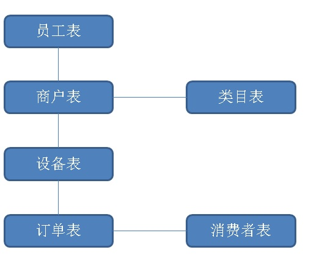
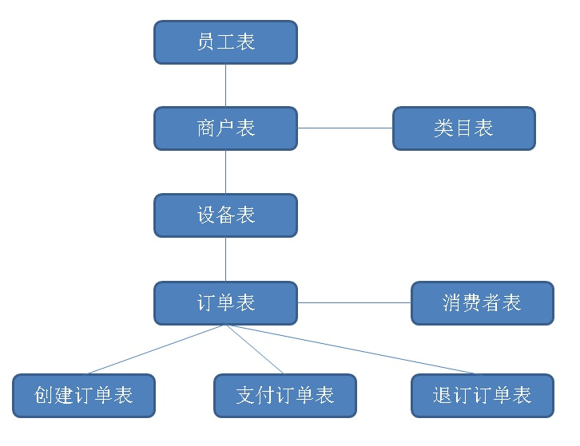

## 经营、销售分析系统DB设计之PostgreSQL, Greenplum - 共享充电宝 案例实践    
                                                                                   
### 作者                                                                  
digoal                                                                  
                                                                  
### 日期                                                                   
2017-09-23                                                          
                                                                    
### 标签                                                                  
PostgreSQL , 物联网、共享充电宝 , 经营分析系统 , 多表关联 , 明细补齐 , 取缔关联 , ltree树类型 , 并行计算 , PostgreSQL 10黑科技 , 销售管理         
                                                                              
----                                                                              
                                                                               
## 背景       
共享充电宝、共享单车、共享雨伞，共享女朋友^|^，共享汽车，。。。 共享经济最近几年发展确实非常迅猛。    
    
共享必定涉及被共享对象的管理、会员的管理等，实际上也属于一种物联网系统。    
    
本文以共享充电宝的场景为例，分享一下共享充电宝的经营分析、销售管理系统的后台数据库的设计。（老板关心的是整体销售的业绩，以及各个渠道的透视等。销售经理关心的是他管辖片区的销售业绩，运维人员关心的是设备的状态。）    
    
## 一、数据结构和数据量    
业务模式是什么样的？    
    
在饭店、商场、火车站、足浴店等各种场所，都能看到充电宝的身影。每个充电宝会有相对固定的位置（比如放在外婆家餐馆），每个固定的位置都有相对固定的销售（就好像古惑仔受保护费一样），每个销售都有固定的上级。    
    
用户借充电宝操作很简答，用户扫码，下单，借走；有些是不能借走的，那就扫码，下单，充电。    
    
（这里除了充电业务，实际上还可以与商户合作，搞一些用户画像和广告推送、商家促销的业务。当然，前提是有用户画像。）    
    
### 数据结构抽象    
    
    
1、人员表（BOSS，销售总监，门店经理）。    
      
数据量预估：3000+，极少更新。    
    
2、类目表（足浴店、酒店、火车站、饭店。。。）    
    
数据量预估：100+ ， 极少更新    
    
3、门店表     
    
数据量预估：百万级以内 ， 极少更新    
    
4、设备表     
    
数据量预估：百万级 ， 每个设备 每隔N分钟上报一次心跳    
    
5、订单表     
    
数据量预估：百万级/天 ，插入、并且每个订单至少更新一次（创建订单、支付订单、退单等），订单有最终状态。    
    
## 二、分析需求    
    
1、实时分析需求：    
    
以日、月、年时间维度；再加上以全局、员工、员工一级下属、员工所有下属、类目、门店、设备等维度进行透视。    
    
2、聚合指标：    
    
新增设备数、在线设备数、离线设备数、新建订单量、成交订单量、退订量、账务流水等等。    
    
3、时间需求：    
    
有查询当天订单统计需求、有查询当天、前一天统一时间点统计需求，算同比。同样的也有月、年需求。    
    
4、查询并发：    
    
分析系统的查询并发通常不会太高，因为都是自己人使用的。一分钟可能不会超过3000。    
    
5、查询时效性：    
    
月、年统计 每天离线生成。（建议这么做，因为业务上月指标没必要实时看。）    
    
日维度的统计，实时产生。（日数据量并不大，实时产生，实时查询，可以满足并发、响应时间的需求。同时也满足业务的需求。）    
    
响应时间要求：几十毫秒级。    
    
并发要求：100以内。    
    
## 三、数据库选型    
PostgreSQL 10：HTAP数据库，支持10TB级OLTP和OLAP混合需求。TP性能强劲，功能丰富。支持多核并行计算，HASH JOIN等一系列强大的功能，AP性能亦适中。    
    
HybridDB for PostgreSQL：PB级，纯分析型数据库，支持多机并行计算。AP性能强劲，但是TP性能非常弱。    
    
如果想了解更多的详情，请参考：    
    
[《空间|时间|对象 圈人 + 透视 - 暨PostgreSQL 10与Greenplum的对比和选择》](../201709/20170918_02.md)      
    
本场景到底选哪个呢？干脆两个都来做个DEMO设计，对比一下。    
    
## 四、PostgreSQL 10 方案1    
### 设计表结构    
    
```    
create table a (          -- 员工层级信息    
  id int primary key,     -- 编号 ID    
  nick name,              -- 名字    
  pid int                 -- 上级 ID    
);    
    
create table c (          -- 类目    
  id int primary key,     -- 类目ID    
  comment text            -- 类目名称    
);    
    
create table b (          -- 终端门店    
  id int primary key,     -- 编号    
  nick text,              -- 名称    
  cid int,                -- 类目    
  aid int                 -- 门店经理ID    
);    
    
create table d (          -- 设备    
  id int primary key,     -- 设备编号    
  bid int,                -- 门店编号    
  alive_ts timestamp      -- 设备心跳时间    
);    
    
create table log (        -- 订单日志    
  did int,                -- 设备ID    
  state int2,             -- 订单最终状态    
  crt_time timestamp,     -- 订单创建时间    
  mod_time timestamp      -- 订单修改时间    
) partition by range (crt_time);    
    
create table log_201701 partition of log for values from ('2017-01-01') to ('2017-02-01') with (parallel_workers =32);     
create table log_201702 partition of log for values from ('2017-02-01') to ('2017-03-01') with (parallel_workers =32);      
create table log_201703 partition of log for values from ('2017-03-01') to ('2017-04-01') with (parallel_workers =32);      
create table log_201704 partition of log for values from ('2017-04-01') to ('2017-05-01') with (parallel_workers =32);      
create table log_201705 partition of log for values from ('2017-05-01') to ('2017-06-01') with (parallel_workers =32);      
create table log_201706 partition of log for values from ('2017-06-01') to ('2017-07-01') with (parallel_workers =32);      
create table log_201707 partition of log for values from ('2017-07-01') to ('2017-08-01') with (parallel_workers =32);      
create table log_201708 partition of log for values from ('2017-08-01') to ('2017-09-01') with (parallel_workers =32);      
create table log_201709 partition of log for values from ('2017-09-01') to ('2017-10-01') with (parallel_workers =32);      
create table log_201710 partition of log for values from ('2017-10-01') to ('2017-11-01') with (parallel_workers =32);      
create table log_201711 partition of log for values from ('2017-11-01') to ('2017-12-01') with (parallel_workers =32);      
create table log_201712 partition of log for values from ('2017-12-01') to ('2018-01-01') with (parallel_workers =32);      
create table log_201801 partition of log for values from ('2018-01-01') to ('2018-02-01') with (parallel_workers =32);    
    
create index idx_log_201701_1 on log_201701 using btree (crt_time) ;    
create index idx_log_201702_1 on log_201702 using btree (crt_time) ;    
create index idx_log_201703_1 on log_201703 using btree (crt_time) ;    
create index idx_log_201704_1 on log_201704 using btree (crt_time) ;    
create index idx_log_201705_1 on log_201705 using btree (crt_time) ;    
create index idx_log_201706_1 on log_201706 using btree (crt_time) ;    
create index idx_log_201707_1 on log_201707 using btree (crt_time) ;    
create index idx_log_201708_1 on log_201708 using btree (crt_time) ;    
create index idx_log_201709_1 on log_201709 using btree (crt_time) ;    
create index idx_log_201710_1 on log_201710 using btree (crt_time) ;    
create index idx_log_201711_1 on log_201711 using btree (crt_time) ;    
create index idx_log_201712_1 on log_201712 using btree (crt_time) ;    
create index idx_log_201801_1 on log_201801 using btree (crt_time) ;    
```    
    
### 初始化数据    
    
1、初始化员工层级 (0为老板，1-30为销售总监，31-3000为门店经理。)    
    
```    
do language plpgsql $$    
declare     
begin    
  truncate a;    
  insert into a select generate_series(0,3000);    
  update a set pid=0 where id between 1 and 30;    
  for i in 1..30 loop    
    update a set pid=i where id between 31+100*(i-1) and 31+100*i-1;    
  end loop;    
end;    
$$;    
```    
    
2、初始化类目    
    
```    
insert into c select generate_series(1,100);    
```    
    
3、初始化门店    
    
```    
insert into b select generate_series(1,500000), '', ceil(random()*100), 30+ceil(random()*(3000-30));    
```    
    
4、初始化设备    
    
```    
insert into d select generate_series(1,1000000), ceil(random()*500000);    
```    
    
5、生成1年订单，约3.65亿，实际写入3.78亿（每天100万比订单，90%支付，10%退款）     
    
```    
do language plpgsql $$    
declare    
  s date := '2017-01-01';    
  e date := '2017-12-31';    
begin    
  for x in 0..(e-s) loop    
    insert into log     
      select ceil(random()*1000000), case when random()<0.1 then 0 else 1 end, s + x + (i||' second')::interval     
      from generate_series(0,86399) t(i),     
           generate_series(1,12);      -- 12是100万一天除以86400得到的，主要是方便写入测试数据。      
  end loop;    
end;    
$$;    
  
  
  
postgres=# select count(*) from log;  
   count     
-----------  
 378432001  
(1 row)  
```    
    
6、索引（可选操作，优化项）    
    
（建议实时数据使用btree索引，静态数据使用BRIN块级索引，静态数据删除BTREE索引。）。    
    
例子    
    
当订单数据成为静态历史数据时，删除静态表旧btree索引，增加如下brin索引。    
    
```    
create index idx_log_201701_1 on log_201701 using brin (crt_time) ;    
create index idx_log_201702_1 on log_201702 using brin (crt_time) ;    
create index idx_log_201703_1 on log_201703 using brin (crt_time) ;    
create index idx_log_201704_1 on log_201704 using brin (crt_time) ;    
create index idx_log_201705_1 on log_201705 using brin (crt_time) ;    
create index idx_log_201706_1 on log_201706 using brin (crt_time) ;    
create index idx_log_201707_1 on log_201707 using brin (crt_time) ;    
create index idx_log_201708_1 on log_201708 using brin (crt_time) ;    
create index idx_log_201709_1 on log_201709 using brin (crt_time) ;    
create index idx_log_201710_1 on log_201710 using brin (crt_time) ;    
create index idx_log_201711_1 on log_201711 using brin (crt_time) ;    
create index idx_log_201712_1 on log_201712 using brin (crt_time) ;    
create index idx_log_201801_1 on log_201801 using brin (crt_time) ;    
```    
    
### 创建必要的UDF函数    
1、创建immutable函数，获取当前时间，前天，前年时间。(使用immutable函数，优化器将过滤不必查询的分区。)，如果要支持并行，设置为parallel safe.    
    
```    
create or replace function cdate() returns date as $$    
  select current_date;    
$$ language sql strict immutable PARALLEL safe;    
    
    
create or replace function cts(interval default '0') returns timestamp as $$        
  select (now() - $1)::timestamp;    
$$ language sql strict immutable PARALLEL safe;    
```    
    
### 透视SQL设计    
    
按人，查询下级所有层级，关联门店，关联设备，关联订单。    
    
输出统计信息：    
    
1、聚合项：    
    
今日截止总订单，今日截止支付订单，同比昨日截止总订单，同比昨日截止支付订单    
    
当月截止总订单，当月截止支付订单，同比上月截止总订单，同比上月截止支付订单    
    
当年截止总订单，当年截止支付订单，同比上年截止总订单，同比上年截止支付订单    
    
2、聚合维度：    
    
全量，TOP    
    
类目，TOP    
    
门店，TOP    
    
所有下属，TOP    
    
所有下属，类目，TOP    
    
所有下属，门店，TOP    
    
门店经理，TOP    
    
门店经理，类目，TOP    
    
门店经理，门店，TOP    
    
### 透视SQL性能指标举例    
    
1、全量透视，32个并发，77毫秒。    
    
```    
select t1.cnt, t1.succ_cnt, t2.cnt, t2.succ_cnt from    
(    
  select count(*) cnt, sum(state) succ_cnt from log where crt_time between cdate() and cts()    
) t1,    
(    
  select count(*) cnt, sum(state) succ_cnt from log where crt_time between cdate()-1 and cts(interval '1 day')    
) t2;    
  cnt   | succ_cnt |  cnt   | succ_cnt     
--------+----------+--------+----------    
 796621 |   716974 | 796620 |   716930    
(1 row)    
    
Time: 76.697 ms    
```    
    
2、类目 TOP，32个并发，446毫秒。    
    
```    
select c.id, count(*) cnt, sum(state) succ_cnt from c     
    join b on (c.id=b.cid)     
    join d on (b.id=d.bid)     
    join log on (d.id=log.did)     
  where crt_time between cdate() and cts()    
  group by c.id    
  order by cnt desc limit 10;    
    
 id | cnt  | succ_cnt     
----+------+----------    
 39 | 8369 |     7543    
 70 | 8346 |     7517    
 64 | 8281 |     7488    
 13 | 8249 |     7412    
 29 | 8222 |     7427    
  3 | 8217 |     7370    
 90 | 8200 |     7387    
 79 | 8199 |     7346    
 71 | 8175 |     7348    
 75 | 8169 |     7373    
(10 rows)    
    
Time: 446.977 ms    
```    
    
3、我的总销量（包括所有下属），464毫秒。    
    
这里用到了with recursive递归语法，根据当前登录用户的ID，树形查询所有下属。     
    
```    
with recursive tmp as (    
  select * from a where id=31                -- 输入我的USER ID    
  union all     
  select a.* from a join tmp on (a.pid=tmp.id)     
)    
select count(*) cnt, sum(state) succ_cnt from tmp     
  join b on (tmp.id=b.aid)    
  join d on (b.id=d.bid)    
  join log on (d.id=log.did)    
  where crt_time between cdate() and cts()    
  ;    
 cnt | succ_cnt     
-----+----------    
 296 |      268    
(1 row)    
    
Time: 463.970 ms    
```    
    
4、我的直接下属，TOP，2.6秒。    
     
这里用到了with recursive递归语法，根据当前登录用户的ID，树形查询所有下属。     
    
这里还用到了正则表达式，用于对直接下属进行分组聚合。得到他们的销量。     
     
```    
with recursive tmp as (               
  select id::text from a where id=0   -- 输入我的USER ID      
  union all     
  select tmp.id||'.'||a.id as id from a join tmp on (a.pid=substring(tmp.id, '([\d]+)$')::int)     
)    
select substring(tmp.id, '^[\d]*\.?([\d]+)'), count(*) cnt, sum(state) succ_cnt from tmp     
  join b on (substring(tmp.id, '([\d]+)$')::int=b.aid)    
  join d on (b.id=d.bid)    
  join log on (d.id=log.did)    
  where crt_time between cdate() and cts()    
  group by 1    
  order by cnt desc limit 10    
  ;    
    
   substring |  cnt  | succ_cnt     
-----------+-------+----------    
 15        | 27341 |    24615    
 19        | 27242 |    24500    
 17        | 27190 |    24481    
 26        | 27184 |    24481    
 9         | 27179 |    24466    
 3         | 27157 |    24323    
 6         | 27149 |    24481    
 1         | 27149 |    24402    
 21        | 27141 |    24473    
 12        | 27140 |    24439    
(10 rows)    
    
Time: 2661.556 ms (00:02.662)    
```    
    
5、我的所有下属(递归)，TOP，642毫秒。    
    
这里用到了with recursive递归语法，根据当前登录用户的ID，树形查询所有下属。      
    
```    
with recursive tmp as (     
  select * from a where id=30   -- 输入我的USER ID     
  union all     
  select a.* from a join tmp on (a.pid=tmp.id)     
)    
select tmp.id, count(*) cnt, sum(state) succ_cnt from tmp     
  join b on (tmp.id=b.aid)    
  join d on (b.id=d.bid)    
  join log on (d.id=log.did)    
  where crt_time between cdate() and cts()    
  group by tmp.id     
  order by cnt desc limit 10    
  ;    
  id  | cnt | succ_cnt     
------+-----+----------    
 2996 | 385 |      353    
 2969 | 339 |      301    
 2935 | 335 |      312    
 2936 | 332 |      304    
 2988 | 326 |      290    
 2986 | 321 |      295    
 2960 | 319 |      293    
 2964 | 313 |      276    
 2994 | 309 |      268    
 2975 | 308 |      276    
(10 rows)    
    
Time: 641.719 ms    
```    
    
    
## 五、PostgreSQL 10 方案设计2 - 极限优化    
### 方案1的优化点分析    
前面看到，虽然用了并行，实际上部分透视查询的效率并没有达到100毫秒内的响应。    
    
主要的消耗在JOIN层面，虽然已经并行哈希JOIN了，接下来的优化方法很奇妙，可以在订单写入时，自动补齐确实的上游信息（订单所对应设备的 销售的员工ID(ltree)，类目、门店等）。    
    
补齐信息后，就可以实现不需要JOIN的透视。    
    
### 如何补齐呢？    
补齐时，销售员工必须是包含所有层级关系的，因此我们选择了PostgreSQL ltree树类型来存储这个关系。    
    
写入订单时，通过触发器，自动根据设备号补齐（用户ID(ltree)，类目、门店）    
    
1、创建树类型    
    
```    
create extension ltree;     
```    
    
2、创建复合类型，包含树、类目、门店信息。    
    
```    
create type ntyp as (lt ltree, cid int, bid int);    
```    
    
对订单表新增补齐字段     
    
```  
alter table log add column addinfo ntyp;  
```  
    
3、创建物化视图1，存储实时员工结构。物化后，不需要再通过递归进行查询。      
    
```    
CREATE MATERIALIZED VIEW mv1 as     
select id, (    
  with recursive tmp as (    
  select id::text as path from a where id=t.id    
  union all     
  select a.pid||'.'||tmp.path as path from a join tmp on (a.id=substring(tmp.path, '^([\d]+)')::int)     
  )    
  select * from tmp order by length(path) desc nulls last limit 1    
) from a as t;    
```    
    
3\.1、创建UK    
    
```    
create unique index mv1_uk1 on mv1 (id);    
```    
    
3\.2、刷新方法，当有员工结构变化时，刷一下即可。刷新速度很快。        
    
```    
refresh materialized view CONCURRENTLY mv1;    
```    
    
4、创建物化视图2，实时设备补齐值（类目和门店ID）。物化后，通过设备号，可以直接取出类目、门店。       
    
```    
CREATE MATERIALIZED VIEW mv2 as     
select a.id as aid, c.id as cid, b.id as bid, d.id as did from     
  a join b on (a.id=b.aid)     
    join c on (c.id=b.cid)     
    join d on (d.bid=b.id)    
;    
```    
    
4\.1、创建UK    
    
```    
create unique index mv2_uk1 on mv2(did);    
```    
    
4\.2、增量刷新物化视图，当设备与门店、类目关系发生变化时，刷新一下即可。刷新速度很快。      
    
```    
refresh materialized view CONCURRENTLY mv2;    
```    
    
5、创建函数，通过设备号得到设备号补齐信息：（用户ID(ltree)，类目、门店）    
    
```    
create or replace function gen_res (vdid int) returns ntyp as $$    
  select (mv1.path, mv2.cid, mv2.bid)::ntyp from     
  mv1 join mv2 on (mv1.id=mv2.aid) where mv2.did=vdid;    
$$ language sql strict;    
```    
    
7、对订单表创建触发器，自动补齐关系(设备->门店->类目 和 销售->层级关系)      
    
```    
create or replace function tg() returns trigger as $$    
declare    
begin    
  NEW.addinfo := gen_res(NEW.did);    
  return NEW;    
end;    
$$ language plpgsql strict;    
    
create trigger tg before insert on log_201701 for each row execute procedure tg();    
create trigger tg before insert on log_201702 for each row execute procedure tg();    
create trigger tg before insert on log_201703 for each row execute procedure tg();    
create trigger tg before insert on log_201704 for each row execute procedure tg();    
create trigger tg before insert on log_201705 for each row execute procedure tg();    
create trigger tg before insert on log_201706 for each row execute procedure tg();    
create trigger tg before insert on log_201707 for each row execute procedure tg();    
create trigger tg before insert on log_201708 for each row execute procedure tg();    
create trigger tg before insert on log_201709 for each row execute procedure tg();    
create trigger tg before insert on log_201710 for each row execute procedure tg();    
create trigger tg before insert on log_201711 for each row execute procedure tg();    
create trigger tg before insert on log_201712 for each row execute procedure tg();    
create trigger tg before insert on log_201801 for each row execute procedure tg();    
```    
    
8、效果    
    
```    
postgres=# insert into log values (1,1,now());    
INSERT 0 1    
    
    
postgres=# select * from log_201709 where did=1;    
 did | state |          crt_time          | mod_time |        addinfo            
-----+-------+----------------------------+----------+-----------------------    
   1 |     1 | 2017-09-23 16:58:47.736402 |          | (0.17.1702,60,417943)    
```    
    
9、老数据订正，补齐设备号补齐（用户ID(ltree)，类目、门店）为空的记录（例如某些时刻，设备号新上的，还没有刷新到MV1，MV2中）。    
    
```    
update log set addinfo=gen_res(did) where addinfo is null;    
```    
    
### 补齐后的数据透视（完全规避JOIN），开启并行，贼快    
    
1、全量（不变，性能杠杠的），74毫秒。    
    
```    
select t1.cnt, t1.succ_cnt, t2.cnt, t2.succ_cnt from    
(    
  select count(*) cnt, sum(state) succ_cnt from log where crt_time between cdate() and cts()    
) t1,    
(    
  select count(*) cnt, sum(state) succ_cnt from log where crt_time between cdate()-1 and cts(interval '1 day')    
) t2;    
    
  cnt   | succ_cnt |  cnt   | succ_cnt     
--------+----------+--------+----------    
 836965 |   753286 | 836964 |   753178    
(1 row)    
    
Time: 74.205 ms    
```    
    
2、类目 TOP，41毫秒。    
    
```    
postgres=# select (log.addinfo).cid, count(*) cnt, sum(state) succ_cnt from log    
  where crt_time between cdate() and cts()     
  group by (log.addinfo).cid    
  order by cnt desc limit 10;     
    
 cid | cnt  | succ_cnt     
-----+------+----------    
  70 | 8796 |     7919    
  39 | 8793 |     7930    
  64 | 8700 |     7863    
  13 | 8659 |     7777    
  29 | 8621 |     7787    
  71 | 8613 |     7739    
  79 | 8613 |     7719    
   3 | 8597 |     7714    
  75 | 8590 |     7747    
  90 | 8579 |     7725    
(10 rows)    
    
Time: 41.221 ms    
```    
    
3、我的总销量（包括所有下属），41毫秒    
    
```    
select count(*) cnt, sum(state) succ_cnt from log     
  where crt_time between cdate() and cts()    
  and (log.addinfo).lt ~ '*.1.*'    -- 求USER ID = 1 的总销量（包括所有下属）    
  ;    
    
  cnt  | succ_cnt     
-------+----------    
 28502 |    25627    
(1 row)    
    
Time: 41.065 ms    
```    
    
4、我的直接下属，TOP    
    
BOSS 视角查看，111毫秒。    
    
```    
select substring(((log.addinfo).lt)::text, '\.?(0\.?[\d]*)'),   -- USER ID = 0 的直接下属，请使用输入的用户ID替换    
  count(*) cnt, sum(state) succ_cnt from log     
  where crt_time between cdate() and cts()    
  and (log.addinfo).lt ~ '*.0.*'                                -- USER ID = 0，请使用输入的用户ID替换。    
  group by 1                                                    -- 第一个字段为分组    
  order by cnt desc limit 10    
;    
    
 substring |  cnt  | succ_cnt     
-----------+-------+----------    
 0.19      | 28656 |    25756    
 0.15      | 28655 |    25792    
 0.26      | 28560 |    25721    
 0.1       | 28548 |    25668    
 0.9       | 28545 |    25701    
 0.6       | 28506 |    25706    
 0.12      | 28488 |    25646    
 0.17      | 28485 |    25652    
 0.21      | 28469 |    25665    
 0.3       | 28459 |    25486    
(10 rows)    
    
Time: 111.221 ms    
```    
    
一级销售经理视角，41毫秒    
    
```    
select substring(((log.addinfo).lt)::text, '\.?(1\.?[\d]*)'),   -- USER ID = 1 的直接下属，请使用输入的用户ID替换    
  count(*) cnt, sum(state) succ_cnt from log     
  where crt_time between cdate() and cts()    
  and (log.addinfo).lt ~ '*.1.*'                                -- USER ID = 1，请使用输入的用户ID替换。    
  group by 1                                                    -- 第一个字段为分组    
  order by cnt desc limit 10    
;    
    
 substring | cnt | succ_cnt     
-----------+-----+----------    
 1.120     | 368 |      320    
 1.59      | 367 |      331    
 1.54      | 357 |      316    
 1.93      | 344 |      313    
 1.80      | 342 |      306    
 1.37      | 338 |      305    
 1.64      | 334 |      298    
 1.90      | 329 |      299    
 1.66      | 327 |      296    
 1.109     | 326 |      293    
(10 rows)    
    
Time: 41.276 ms    
```    
    
5、我的所有下属(递归)，TOP    
    
BOSS 视角（全体末端销售TOP），231毫秒。    
    
```    
select (log.addinfo).lt,                                        -- 所有下属(递归)    
  count(*) cnt, sum(state) succ_cnt from log     
  where crt_time between cdate() and cts()    
  and (log.addinfo).lt ~ '*.0.*'                                -- USER ID = 0，请使用输入的用户ID替换。    
  group by 1                                                    -- 第一个字段为分组    
  order by cnt desc limit 10    
;    
    
    lt     | cnt | succ_cnt     
-----------+-----+----------    
 0.30.2996 | 405 |      371    
 0.28.2796 | 402 |      350    
 0.21.2093 | 393 |      347    
 0.3.234   | 391 |      356    
 0.14.1332 | 381 |      347    
 0.13.1283 | 381 |      344    
 0.19.1860 | 380 |      347    
 0.16.1553 | 380 |      341    
 0.28.2784 | 377 |      346    
 0.7.672   | 377 |      347    
(10 rows)    
    
Time: 230.630 ms    
```    
    
一级销售经理视角，41毫秒    
    
```    
select (log.addinfo).lt,                                        -- 所有下属(递归)    
  count(*) cnt, sum(state) succ_cnt from log     
  where crt_time between cdate() and cts()    
  and (log.addinfo).lt ~ '*.1.*'                                -- USER ID = 1，请使用输入的用户ID替换。    
  group by 1                                                    -- 第一个字段为分组    
  order by cnt desc limit 10    
;    
    
   lt    | cnt | succ_cnt     
---------+-----+----------    
 0.1.59  | 367 |      331    
 0.1.120 | 367 |      320    
 0.1.54  | 355 |      315    
 0.1.93  | 344 |      313    
 0.1.80  | 341 |      305    
 0.1.37  | 338 |      305    
 0.1.64  | 334 |      298    
 0.1.90  | 328 |      298    
 0.1.66  | 327 |      296    
 0.1.109 | 325 |      293    
(10 rows)    
    
Time: 41.558 ms    
```    
    
### 补齐订单addinfo信息的好处    
1、当人员结构、类目、门店发生变化时，是否需要订正订单中的（用户ID(ltree)，类目、门店）数据，请业务方决定。    
    
2、实际上，原来的方法是有问题的，例如A经理铺设的设备，一个月后，负责人发生了变化，统计时，如果实时JOIN，那么涉及上月的订单则会挂到新的负责人头上，但是显然出现了误差。    
    
3、感觉还是补齐后的方法更加精确，是谁的就是谁的，不会搞错（把销量搞错问题可严重了，影响人家的绩效呢。）。    
    
## 六、PostgreSQL 10 小结    
用到了哪些PostgreSQL数据库特性？    
    
1、递归查询    
    
2、并行查询    
    
3、JOIN方法    
    
4、继承（分区表）    
    
5、触发器    
    
6、复合类型    
    
7、ltree树类型    
    
https://www.postgresql.org/docs/9.6/static/ltree.html     
    
## 七、Greenplum    
### Greenplum 方案1  
注意前面已经提到了Greenplum的TP能力很弱，如果设备心跳实时更新、订单实时写入、实时更新，可能会扛不住压力。（目前greenplum update, delete都是锁全表的，很大的锁。）    
    
因此在设计时需要注意，把设备更新心跳做成批量操作（例如从TP数据库，每隔几分钟导出全量到Greenplum中）。把订单的更新做成插入（通过RULE实现）。    
    
    
    
#### 表结构设计    
    
```    
create table a (          -- 员工层级信息    
  id int primary key,     -- 编号 ID    
  nick name,              -- 名字    
  pid int                 -- 上级 ID    
) DISTRIBUTED BY(id);    
    
create table c (          -- 类目    
  id int primary key,     -- 类目ID    
  comment text            -- 类目名称    
) DISTRIBUTED BY(id);    
    
create table b (          -- 终端门店    
  id int primary key,     -- 编号    
  nick text,              -- 名称    
  cid int,                -- 类目    
  aid int                 -- 门店经理ID    
) DISTRIBUTED BY(id);    
    
create table d (          -- 设备    
  id int primary key,     -- 设备编号    
  bid int,                -- 门店编号    
  alive_ts timestamp      -- 设备心跳时间    
) DISTRIBUTED BY(id);    
    
create table log1 (        -- 订单日志，创建订单    
  did int,                -- 设备ID    
  state int2,             -- 订单最终状态    
  crt_time timestamp,     -- 订单创建时间    
  mod_time timestamp      -- 订单修改时间    
) DISTRIBUTED BY(did)     
PARTITION BY range (crt_time)    
(start (date '2017-01-01') inclusive end (date '2018-01-01') exclusive every (interval '1 month'));     
    
create table log2 (        -- 订单日志，最终状态    
  did int,                -- 设备ID    
  state int2,             -- 订单最终状态    
  crt_time timestamp,     -- 订单创建时间    
  mod_time timestamp      -- 订单修改时间    
) DISTRIBUTED BY(did)     
PARTITION BY range (crt_time)    
(start (date '2017-01-01') inclusive end (date '2018-01-01') exclusive every (interval '1 month'));     
    
-- 创建规则，更新改成插入    
create rule r1 as on update to log1 do instead insert into log2 values (NEW.*);    
```    
    
#### 测试心跳表导入速度    
导入100万设备数据，耗时约1秒。    
    
```    
date +%F%T;psql -c "copy d to stdout"|psql -h 127.0.0.1 -p 15432 -U digoal postgres -c "copy d from stdin"; date +%F%T;    
    
2017-09-2319:42:22    
COPY 1000000    
2017-09-2319:42:23    
```    
    
#### 测试订单写入速度    
注意所有写入操作建议改成批量操作。    
    
批量写入约87万行/s。    
    
```    
date +%F%T; psql -c "copy (select did,state,crt_time,mod_time from log) to stdout"|psql -h 127.0.0.1 -p 15432 -U digoal postgres -c "copy log1 from stdin"; date +%F%T;    
    
2017-09-2320:04:44    
COPY 378432001    
2017-09-2320:12:03    
```    
    
#### 数据导入    
    
```    
psql -c "copy a to stdout"|psql -h 127.0.0.1 -p 15432 -U digoal postgres -c "copy a from stdin"    
psql -c "copy b to stdout"|psql -h 127.0.0.1 -p 15432 -U digoal postgres -c "copy b from stdin"    
psql -c "copy c to stdout"|psql -h 127.0.0.1 -p 15432 -U digoal postgres -c "copy c from stdin"    
# psql -c "copy d to stdout"|psql -h 127.0.0.1 -p 15432 -U digoal postgres -c "copy d from stdin"    
# psql -c "copy (select * from log) to stdout"|psql -h 127.0.0.1 -p 15432 -U digoal postgres -c "copy log1 from stdin"    
```    
    
#### 透视SQL测试    
    
1、全量透视，610毫秒。    
    
```    
select t1.cnt, t1.succ_cnt, t2.cnt, t2.succ_cnt from    
(    
  select count(*) cnt, sum(state) succ_cnt from log1 where crt_time between cdate() and cts(interval '0')    
) t1,    
(    
  select count(*) cnt, sum(state) succ_cnt from log1 where crt_time between cdate()-1 and cts(interval '1 day')    
) t2;    
    
  cnt   | succ_cnt |  cnt   | succ_cnt     
--------+----------+--------+----------    
 876301 |   788787 | 876300 |   788564    
(1 row)    
    
Time: 609.801 ms    
```    
    
2、类目 TOP，219毫秒。    
    
```    
select c.id, count(*) cnt, sum(state) succ_cnt from c     
    join b on (c.id=b.cid)     
    join d on (b.id=d.bid)     
    join log1 on (d.id=log1.did)     
  where crt_time between cdate() and cts(interval '0')    
  group by c.id    
  order by cnt desc limit 10;    
    
 id | cnt  | succ_cnt     
----+------+----------    
 70 | 9220 |     8311    
 39 | 9197 |     8303    
 64 | 9096 |     8220    
 79 | 9034 |     8095    
 13 | 9033 |     8114    
 29 | 9033 |     8151    
 75 | 9033 |     8148    
  3 | 9005 |     8084    
 71 | 9002 |     8098    
 90 | 8974 |     8079    
(10 rows)    
    
Time: 218.695 ms    
```    
    
3、我的总销量（包括所有下属），208毫秒。    
    
返回所有下属以及当前用户ID。    
    
```    
create or replace function find_low(int) returns int[] as $$    
declare    
  res int[] := array[$1];    
  tmp int[] := res;    
begin    
  loop    
    select array_agg(id) into tmp from a where pid = any (tmp);    
    res := array_cat(res,tmp);    
    if tmp is null then    
      exit;    
    end if;    
  end loop;    
  return res;    
end;    
$$ language plpgsql strict;    
```    
    
```    
select count(*) cnt, sum(state) succ_cnt from     
(select unnest(find_low(31)) as id) as tmp     
  join b on (tmp.id=b.aid)    
  join d on (b.id=d.bid)    
  join log1 on (d.id=log1.did)    
  where crt_time between cdate() and cts(interval '0')    
  ;    
 cnt | succ_cnt     
-----+----------    
 342 |      312    
(1 row)    
    
Time: 208.585 ms    
```    
    
4、我的直接下属，TOP。    
    
Greenplum 暂不支持递归语法，需要自定义UDF实现。    
    
5、我的所有下属(递归)，TOP。    
    
Greenplum 暂不支持递归语法，需要自定义UDF实现。    
    
### Greenplum 方案2  
与PostgreSQL 方案2一样，将“设备对应门店、类目、销售、销售以及他的所有上级”的数据物化。     
  
准备工作：  
  
1、新增字段  
  
```  
alter table log1 add column aid int;  
alter table log1 add column path text;  
alter table log1 add column cid int;  
alter table log1 add column bid int;  
  
alter table log2 add column aid int;  
alter table log2 add column path text;  
alter table log2 add column cid int;  
alter table log2 add column bid int;  
```  
  
2、修改之前定义的rule，业务的更新转换为INSERT，批量订单补齐的更新操作不转换。  
  
```  
drop rule r1 on log1;  
  
create rule r1 as on update to log1 where (NEW.aid is null) do instead insert into log2 values (NEW.*);    
```  
    
#### 物化  
1、物化视图1：设备 -> 门店 -> 类目 -> 销售  
  
创建物化视图mv1：  
  
```  
create table mv1 (did int, bid int, cid int, aid int) distributed by (did);  
create index idx_mv1_did on mv1(did);  
```  
  
初始化物化视图mv1：  
  
```  
insert into mv1   
  select d.id as did, b.id as bid, c.id as cid, a.id as aid from d join b on (d.bid=b.id) join c on (b.cid=c.id) join a on (a.id=b.aid);  
```  
  
刷新物化视图mv1：  
  
```  
begin;  
update mv1 set bid=t1.bid , cid=t1.cid , aid=t1.aid  
  from   
  (  
    select d.id as did, b.id as bid, c.id as cid, a.id as aid from d join b on (d.bid=b.id) join c on (b.cid=c.id) join a on (a.id=b.aid)  
  ) t1  
where mv1.did=t1.did and (t1.bid<>mv1.bid or t1.cid<>mv1.cid or t1.aid<>mv1.aid);  
  
insert into mv1   
  select t1.* from  
  (  
    select d.id as did, b.id as bid, c.id as cid, a.id as aid from d join b on (d.bid=b.id) join c on (b.cid=c.id) join a on (a.id=b.aid)  
  ) t1  
  left join mv1 on (t1.did=mv1.did) where mv1.* is null;  
end;  
vacuum mv1;  
```  
  
2、物化视图2：销售 -> 销售以及他的所有上级  
  
创建返回 销售以及他的所有上级 的函数  
  
```  
create or replace function find_high(int) returns text as $$    
declare    
  res text := $1;    
  tmp text := res;    
begin    
  loop    
    select pid into tmp from a where id = tmp::int;    
    if tmp is null then    
      exit;    
    end if;    
    res := tmp||'.'||res;   
  end loop;    
  return res;    
end;    
$$ language plpgsql strict;    
```  
  
没有递归语法，Greenplum的函数调用效率并不高：  
  
```  
postgres=# select find_high(id) from generate_series(100,110) t(id);  
 find_high   
-----------  
 0.1.100  
 0.1.101  
 0.1.102  
 0.1.103  
 0.1.104  
 0.1.105  
 0.1.106  
 0.1.107  
 0.1.108  
 0.1.109  
 0.1.110  
(11 rows)  
Time: 1472.435 ms  
  
同样的操作，在PostgreSQL里面只需要0.5毫秒：  
  
postgres=# select find_high(id) from generate_series(100,110) t(id);  
 find_high   
-----------  
 0.1.100  
 0.1.101  
 0.1.102  
 0.1.103  
 0.1.104  
 0.1.105  
 0.1.106  
 0.1.107  
 0.1.108  
 0.1.109  
 0.1.110  
(11 rows)  
Time: 0.524 ms  
```  
  
验证  
  
```  
postgres=# select find_high(1);  
 find_high   
-----------  
 0.1  
(1 row)  
  
postgres=# select find_high(0);  
 find_high   
-----------  
 0  
(1 row)  
  
postgres=# select find_high(100);  
 find_high   
-----------  
 0.1.100  
(1 row)  
```  
  
创建物化视图mv2  
  
```  
create table mv2 (aid int, path text) distributed by (aid);  
create index idx_mv2_did on mv2(aid);  
```  
  
初始化、刷新物化视图mv2  
  
```  
-- GP不支持这样的操作，本来就简单了：insert into mv2 select id, find_high(id) from a;  
  
postgres=# select id, find_high(id) from a;  
ERROR:  function cannot execute on segment because it accesses relation "postgres.a" (functions.c:155)  (seg1 slice1 tb2a07543.sqa.tbc:25433 pid=106586) (cdbdisp.c:1328)  
DETAIL:    
SQL statement "select pid from a where id =  $1 "  
PL/pgSQL function "find_high" line 7 at SQL statement  
```  
  
创建函数  
  
```  
create or replace function refresh_mv2() returns void as $$  
declare  
  aid int[];  
begin  
  select array_agg(id) into aid from a;  
  delete from mv2;  
  insert into mv2 select id, find_high(id) from unnest(aid) t(id);  
end;  
$$ language plpgsql strict;  
```  
  
调用函数刷新mv2，时间基本无法接受。  
  
```  
select refresh_mv2();  
```  
  
PS：建议程序生成这部分员工树型结构数据。再插入到GPDB中。因为总共才3001条。或者你可以在PostgreSQL中生成，PG实在太方便了。  
  
#### 修正订单  
  
调度任务，批量更新：  
  
```  
update log1 set aid=t1.aid, path=t1.path, cid=t1.cid, bid=t1.bid  
from  
(  
select did, bid, cid, mv1.aid, mv2.path from mv1 join mv2 on (mv1.aid=mv2.aid)  
) t1  
where log1.did=t1.did and log1.aid is null;  
  
UPDATE 378432001  
  
  
update log2 set aid=t1.aid, path=t1.path, cid=t1.cid, bid=t1.bid  
from  
(  
select did, bid, cid, mv1.aid, mv2.path from mv1 join mv2 on (mv1.aid=mv2.aid)  
) t1  
where log2.did=t1.did and log2.aid is null;  
  
UPDATE 378432001  
```  
  
#### 透视查询  
1、全量透视，205毫秒。    
  
```  
select t1.cnt, t1.succ_cnt, t2.cnt, t2.succ_cnt from    
(    
  select count(*) cnt, sum(state) succ_cnt from log1 where crt_time between cdate() and cts(interval '0')    
) t1,    
(    
  select count(*) cnt, sum(state) succ_cnt from log1 where crt_time between cdate()-1 and cts(interval '1 day')    
) t2;   
  
  cnt   | succ_cnt |  cnt   | succ_cnt   
--------+----------+--------+----------  
 480228 |   432151 | 480228 |   432205  
(1 row)  
  
Time: 205.436 ms  
```  
  
2、类目 TOP，254毫秒。    
  
```  
select c.id, count(*) cnt, sum(state) succ_cnt from c     
    join b on (c.id=b.cid)     
    join d on (b.id=d.bid)     
    join log1 on (d.id=log1.did)     
  where crt_time between cdate() and cts(interval '0')    
  group by c.id    
  order by cnt desc limit 10;    
 id | cnt  | succ_cnt   
----+------+----------  
 64 | 5052 |     4555  
 29 | 4986 |     4483  
 34 | 4982 |     4509  
 70 | 4968 |     4466  
 71 | 4964 |     4491  
  5 | 4953 |     4474  
 79 | 4937 |     4454  
 63 | 4936 |     4420  
 66 | 4934 |     4436  
 18 | 4922 |     4417  
(10 rows)  
  
Time: 254.007 ms  
```  
  
3、我的总销量（包括所有下属），110毫秒。    
  
  
```  
select count(*) cnt, sum(state) succ_cnt from log1     
  where crt_time between cdate() and cts(interval '0')    
  and (path like '1.%' or path like '%.1' or path like '%.1.%')    -- 求USER ID = 1 的总销量（包括所有下属）        
  ;   
  cnt  | succ_cnt   
-------+----------  
 16605 |    14964  
(1 row)  
  
Time: 110.396 ms  
```  
  
4、我的直接下属，TOP。    
    
BOSS 视角查看，180毫秒。   
  
```  
set escape_string_warning TO off;  
  
select substring(path, '\.?(0\.?[0-9]*)'),                       -- USER ID = 0 的直接下属，请使用输入的用户ID替换    
  count(*) cnt, sum(state) succ_cnt from log1     
  where crt_time between cdate() and cts(interval '0')    
  and (path like '0.%' or path like '%.0' or path like '%.0.%')  -- USER ID = 0，请使用输入的用户ID替换。    
  group by 1                                                     -- 第一个字段为分组    
  order by cnt desc limit 10    
;    
  
 substring |  cnt  | succ_cnt   
-----------+-------+----------  
 0.3       | 17014 |    15214  
 0.15      | 17006 |    15285  
 0.11      | 16958 |    15285  
 0.22      | 16901 |    15231  
 0.19      | 16887 |    15217  
 0.21      | 16861 |    15160  
 0.6       | 16841 |    15075  
 0.9       | 16831 |    15123  
 0.26      | 16787 |    15060  
 0.14      | 16777 |    15048  
(10 rows)  
  
Time: 179.950 ms  
```  
  
一级销售经理视角，176毫秒    
  
```  
select substring(path, '\.?(1\.?[0-9]*)'),                       -- USER ID = 1 的直接下属，请使用输入的用户ID替换    
  count(*) cnt, sum(state) succ_cnt from log1     
  where crt_time between cdate() and cts(interval '0')    
  and (path like '1.%' or path like '%.1' or path like '%.1.%')  -- USER ID = 1，请使用输入的用户ID替换。    
  group by 1                                                     -- 第一个字段为分组    
  order by cnt desc limit 10    
;    
  
 substring | cnt | succ_cnt   
-----------+-----+----------  
 1.120     | 222 |      202  
 1.54      | 218 |      193  
 1.92      | 217 |      192  
 1.51      | 209 |      187  
 1.93      | 206 |      181  
 1.53      | 203 |      182  
 1.59      | 203 |      187  
 1.37      | 202 |      188  
 1.82      | 197 |      177  
 1.66      | 196 |      180  
(10 rows)  
  
Time: 176.298 ms  
```  
  
5、我的所有下属(递归)，TOP。    
  
BOSS 视角（全体末端销售TOP），155毫秒。    
    
```    
select path,                                                      -- 所有下属(递归)    
  count(*) cnt, sum(state) succ_cnt from log1     
  where crt_time between cdate() and cts(interval '0')    
  and (path like '0.%' or path like '%.0' or path like '%.0.%')   -- USER ID = 0，请使用输入的用户ID替换。    
  group by 1                                                      -- 第一个字段为分组    
  order by cnt desc limit 10    
;    
    
   path    | cnt | succ_cnt   
-----------+-----+----------  
 0.5.482   | 261 |      229  
 0.28.2796 | 248 |      229  
 0.24.2348 | 242 |      225  
 0.13.1318 | 240 |      213  
 0.21.2093 | 237 |      211  
 0.26.2557 | 235 |      210  
 0.4.346   | 233 |      205  
 0.30.2935 | 231 |      214  
 0.14.1332 | 229 |      205  
 0.26.2620 | 229 |      204  
(10 rows)  
  
Time: 155.268 ms    
```    
    
一级销售经理视角，151毫秒    
    
```    
select path,                                                      -- 所有下属(递归)    
  count(*) cnt, sum(state) succ_cnt from log1     
  where crt_time between cdate() and cts(interval '0')    
  and (path like '1.%' or path like '%.1' or path like '%.1.%')   -- USER ID = 1，请使用输入的用户ID替换。    
  group by 1                                                      -- 第一个字段为分组    
  order by cnt desc limit 10    
;    
    
  path   | cnt | succ_cnt   
---------+-----+----------  
 0.1.120 | 222 |      202  
 0.1.92  | 218 |      193  
 0.1.54  | 218 |      193  
 0.1.51  | 209 |      187  
 0.1.93  | 207 |      182  
 0.1.59  | 204 |      187  
 0.1.53  | 203 |      182  
 0.1.37  | 202 |      188  
 0.1.82  | 198 |      178  
 0.1.66  | 196 |      180  
(10 rows)  
  
Time: 150.883 ms  
```    
  
  
    
## 八、Greenplum 小结    
1、使用Greenplum需要注意数据倾斜的问题，所以在分布键的选择上请参考:      
      
[《分布式DB(Greenplum)中数据倾斜的原因和解法 - 阿里云HybridDB for PostgreSQL最佳实践》](../201708/20170821_02.md)      
    
2、Greenplum暂时还没有支持递归语法，因此需要使用UDF来实现类似求所有下级、或者补齐所有上级等操作的功能。     
    
3、Greenplum的方案二。重点是物化视图、补齐（实际上不在订单中补齐也没关系，只要生成一张 （设备号->门店->类目和员工层级关系） 的表即可，查询起来就会方便很多。    
     
4、Greenplum的delete和update操作会锁全表，堵塞其他该表的insert、delete、update操作。不堵塞查询。需要特别注意。  
     
5、订单补齐采用批量更新的方式。  
    
## 九、小结    
对于本例，建议还是使用PostgreSQL 10（特别是将来量要往100 TB这个量级发展的时候，迁移到PolarDB for PostgreSQL会特别方便，完全兼容。）。性能方面，TP和AP都满足需求。功能方面也完全满足需求，而且有很多可以利用的特性来提升用户体验：     
    
如果要使用Greenplum(HybridDB for PostgreSQL)的方案，那么建议依旧使用类似PostgreSQL 10方案2的设计方法（订单补齐使用规则实现、或者批量更新实现）。    
    
1、递归查询，用于检索树形结构的数据，例如员工层级，图式搜索等。       
    
2、并行查询，可以有效利用多个CPU的能力，类似游戏中的放大招，加速查询。       
    
3、JOIN方法，有hash, merge, nestloop等多种JOIN方法，可以处理任意复杂的JOIN。      
    
4、继承（分区表），订单按时间分区。     
    
5、触发器，用于实现订单自动补齐。      
    
6、复合类型，补齐 “设备->门店->类目和员工层级”的信息。      
     
7、ltree树类型，存储完成的员工上下级关系。          
     
https://www.postgresql.org/docs/9.6/static/ltree.html     
    
8、物化视图，用在将员工等级进行了补齐。一键刷新，不需要业务处理复杂的人事变动逻辑。同时也便于透视分析语句的实现。           
    
9、正则表达式，用在了ltree的正则匹配上，例如按直接下属分组聚合，按当前登录用户组分组聚合等。     
     
10、以及本方案中没有用到的诸多特性（例如SQL流计算，oss_ext对象存储外部表 等）。    
    
接下来阿里云会推出PolarDB for PostgreSQL，100TB 级，共享存储，一写多读架构。对标AWSAurora与Oracle RAC。        
    
11、本例三种方案(同等硬件资源, 32C)的实时透视QUERY性能对比：    
    
方案 | 用例 | 响应时间    
---|---|---    
PostgreSQL 10 方案1 | 全量透视 | 77 毫秒    
PostgreSQL 10 方案1 | 类目 TOP | 446 毫秒    
PostgreSQL 10 方案1 | 我的总销量（包括所有下属） | 464 毫秒    
PostgreSQL 10 方案1 | 我的直接下属，TOP | 2.6 秒    
PostgreSQL 10 方案1 | 我的所有下属(递归)，TOP | 642 毫秒    
-|-|-  
PostgreSQL 10 方案2 | 全量透视 | 74 毫秒    
PostgreSQL 10 方案2 | 类目 TOP | 41 毫秒    
PostgreSQL 10 方案2 | 我的总销量（包括所有下属） | 41 毫秒    
PostgreSQL 10 方案2 | 我的直接下属，TOP | 41 毫秒    
PostgreSQL 10 方案2 | 我的所有下属(递归)，TOP | 41 毫秒    
-|-|-  
Greenplum 方案1 | 全量透视 | 610 毫秒    
Greenplum 方案1 | 类目 TOP | 219 毫秒    
Greenplum 方案1 | 我的总销量（包括所有下属） | 208 毫秒    
Greenplum 方案1 | 我的直接下属，TOP | 不支持递归、未测试    
Greenplum 方案1 | 我的所有下属(递归)，TOP | 不支持递归、未测试    
-|-|-  
Greenplum 方案2 | 全量透视 | 205 毫秒    
Greenplum 方案2 | 类目 TOP | 254 毫秒    
Greenplum 方案2 | 我的总销量（包括所有下属） | 110 毫秒    
Greenplum 方案2 | 我的直接下属，TOP | 176 毫秒     
Greenplum 方案2 | 我的所有下属(递归)，TOP | 151 毫秒     
      
12、Greenplum和PostgreSQL两个产品的差异、如何选型可以参考：     
      
[《空间|时间|对象 圈人 + 透视 - 暨PostgreSQL 10与Greenplum的对比和选择》](../201709/20170918_02.md)    
    
章节：Greenplum和PostgreSQL两个产品的特色和选择指导。    
  
13、月与年的数据，由于时效性没有日的高，所以可以按天为单位进行统计并存放结果，不需要实时查询。需要查询时查询统计结果即可。  
      
  
<a rel="nofollow" href="http://info.flagcounter.com/h9V1"  ></a>  
  
  
  
  
  
  
## [digoal's 大量PostgreSQL文章入口](https://github.com/digoal/blog/blob/master/README.md "22709685feb7cab07d30f30387f0a9ae")
  
