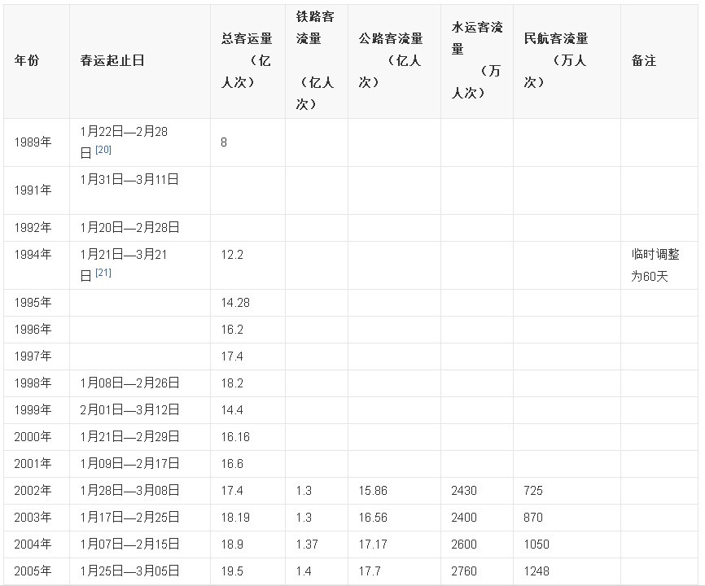
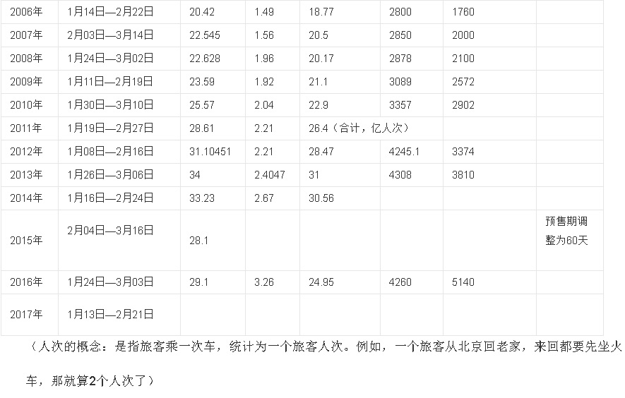

## PostgreSQL 在铁老大订单系统中的schemaless设计和性能压测  
         
### 作者      
digoal      
      
### 日期       
2017-09-27       
        
### 标签      
PostgreSQL , UDF , schemaless , 自动建表 , 自动分区 , 订单查询 , 用户订单查询 , 席别订单查询     
        
----       
        
## 背景      
数据的流动孕育数据生态，在很多大型系统中，业务系统之间的数据流动是很常见的事情。  
  
例如铁大哥的订单数据的流动，可能带动很多围绕订单的业务需求。比如说订单查询：  
  
1、按用户查询，返回用户30天内的所有订单。  
  
2、按坐席和乘车日期查询，返回这个坐席的售出记录，看看有没有退票、有没有中途票可以加塞等。  
  
以预售30天为例，  
  
假设有20000趟车，20节车厢，200个座位，平均每个座位卖10张票（算上中途票）。 每天的订单约8000万笔。  
  
30天约24亿订单记录数据量。  
  
用PostgreSQL来满足这类场景，如何设计呢？性能又如何呢？我们关注三个性能指标：  
  
1、生成订单速度  
  
2、按用户查询，返回用户的所有订单，平均返回2.4条。(30天，24亿记录，假设有10亿用户，平均每个用户2.4笔订单)  
  
3、按坐席和乘车日期查询，平均返回10条记录。（每个座位平均每天卖出10张票）  
   
PS：春运数据，2016年春运20天运送旅客3.26亿人次。实际上本例的PostgreSQL设计在这个业务中已经完全满足全年的最高峰需求。    
  
https://baike.baidu.com/item/%E6%98%A5%E8%BF%90  
  
   
  
  
  
## schemaless设计  
这个场景是典型的读多写少的业务。写体现在下单、修改订单。读体现在查询。  
  
几个需要关注的点：  
  
1、订单数据保留30天。使用时间分区，清数据最方便。同时满足时间维度的查询性能要求。  
  
2、高速写入，高速读取。  
  
3、按用户查询，按坐席和乘车日期查询。按坐席和乘车日期查询，不需要特别设计，按时间分区即可。按用户查询要达到最好的性能，我们可以来一份冗余数据，按用户哈希。  
  
采用schemaless的设计，解决自动建分区表，自动读写分区表的问题。  
  
### 设计表结构  
1、建表1，按get_on上车时间分区。  
  
```  
-- 序列，假设为订单号  
create sequence seq cache 1000;  
  
create table train_order (  
  id int8,         -- 订单号  
  train_id int,    -- 车次  
  box_id int2,     -- 车厢  
  site_id int2,    -- 座位号  
  station_1 int2,  -- 上车站  
  station_2 int2,  -- 下车站  
  get_on date,     -- 乘车日期  
  uid int8,        -- 用户ID  
  pay_stat int2 default 1,   -- 付款状态  
  charge float8,             -- 金额  
  weight int2 default 0,     -- 排队号  
  window_id int2 default 1,  -- 购买渠道  
  crt_time timestamp default now(),  -- 订单创建时间  
  mod_time timestamp                 -- 订单修改时间  
);  
  
-- 索引，提高按坐席查询的效率  
create index idx_train_order_1 on train_order (train_id, box_id, site_id);  
```  
  
冗余一份数据，按用户哈希分区，提高按用户查询的效率。  
  
2、建表2，按uid用户ID哈希分区。  
  
```  
create table train_order_u (  
  id int8,         -- 订单号  
  train_id int,    -- 车次  
  box_id int2,     -- 车厢  
  site_id int2,    -- 座位号  
  station_1 int2,  -- 上车站  
  station_2 int2,  -- 下车站  
  get_on date,     -- 乘车日期  
  uid int8,        -- 用户ID  
  pay_stat int2 ,   -- 付款状态  
  charge float8,    -- 金额  
  weight int2 ,     -- 排队号  
  window_id int2 ,  -- 购买渠道  
  crt_time timestamp ,  -- 订单创建时间  
  mod_time timestamp    -- 订单修改时间  
) ;  
  
-- 索引，提高按用户查询的效率  
create index idx_train_order_u on train_order_u (uid);  
```  
  
3、预先建分区表，按用户哈希。   
  
```  
do language plpgsql $$  
declare  
begin  
  for i in 0..31   
  loop  
    execute 'create table train_order_u'||i||' (like train_order_u including all , check (mod(uid,32)='||i||')) inherits (train_order_u)';   
  end loop;  
end;  
$$;  
```  
  
4、schemaless设计来了，创建订单函数  
  
```  
create or replace function create_order (  
  v_id int8,         -- 订单号  
  v_train_id int,    -- 车次  
  v_box_id int2,     -- 车厢  
  v_site_id int2,    -- 座位号  
  v_station_1 int2,  -- 上车站  
  v_station_2 int2,  -- 下车站  
  v_get_on date,     -- 乘车日期  
  v_uid int8,        -- 用户ID  
  v_pay_stat int2,   -- 付款状态  
  v_charge float8,   -- 金额  
  v_weight int2,     -- 排队号  
  v_window_id int2,  -- 购买渠道  
  v_crt_time timestamp  
) returns void as $$  
declare  
  sql1 text := '';  
  sql2 text := '';  
  tbl1 name := 'train_order_'||to_char(v_get_on,'yyyymmdd');  -- 自动写入分区表  
  tbl2 name := 'train_order_u'||mod(v_uid,32);  
begin  
  -- 数据冗余，一条订单数据，同时写入用户分区表，以及日期分区表。  
  sql1 := format (  
            'insert into %I (id, train_id, box_id, site_id, station_1, station_2, get_on, uid, pay_stat, charge, weight, window_id, crt_time) values   
            (%L, %L, %L, %L, %L, %L, %L, %L, %L, %L, %L, %L, %L)' ,   
            tbl1, v_id, v_train_id, v_box_id, v_site_id, v_station_1, v_station_2, v_get_on, v_uid, v_pay_stat, v_charge, v_weight, v_window_id, v_crt_time  
          );  
  sql2 := format (  
            'insert into %I (id, train_id, box_id, site_id, station_1, station_2, get_on, uid, pay_stat, charge, weight, window_id, crt_time) values   
            (%L, %L, %L, %L, %L, %L, %L, %L, %L, %L, %L, %L, %L)' ,   
            tbl2, v_id, v_train_id, v_box_id, v_site_id, v_station_1, v_station_2, v_get_on, v_uid, v_pay_stat, v_charge, v_weight, v_window_id, v_crt_time  
          );  
  
  execute sql1;  
  execute sql2;  
  
  exception when SQLSTATE '42P01' then  
    execute format('create table %I (like train_order including all) inherits(train_order)', tbl1);  -- 自动建表  
    execute sql1;  
    execute sql2;  
end;  
$$ language plpgsql strict ;  
```  
  
5、schemaless设计来了，修改订单函数  
  
略，同上写法。  
  
6、schemaless设计来了，按用户查询，返回用户的所有订单，平均返回2.4条。  
  
```  
create or replace function get_user_order(v_uid int8) returns setof train_order_u as $$  
declare  
  tbl name := 'train_order_u'||mod(v_uid,32);  
begin  
  return query execute format('select * from %I where uid=%L', tbl, v_uid);  
end;  
$$ language plpgsql strict;  
```  
  
```  
postgres=# select (get_user_order(100000000)).*;  
     id     | train_id | box_id | site_id | station_1 | station_2 |   get_on   |    uid    | pay_stat |      charge      | weight | window_id |          crt_time          | mod_time   
------------+----------+--------+---------+-----------+-----------+------------+-----------+----------+------------------+--------+-----------+----------------------------+----------  
 1557799015 |      125 |      4 |     189 |        79 |        16 | 2017-10-21 | 100000000 |        1 | 1197.33886221517 |      1 |         1 | 2017-09-27 18:14:19.076026 |   
  811630684 |      997 |     18 |     179 |        41 |        12 | 2017-10-14 | 100000000 |        1 | 453.880406067241 |      1 |         1 | 2017-09-27 15:48:09.125487 |   
  597179567 |      536 |      3 |     177 |         7 |         7 | 2017-10-07 | 100000000 |        1 | 7182.26095053926 |      1 |         1 | 2017-09-27 15:15:02.786637 |   
(3 rows)  
  
Time: 0.367 ms  
```  
  
7、schemaless设计来了，按坐席和乘车日期查询，平均返回10条记录。  
  
```  
create or replace function get_site_order(v_get_on date, v_train_id int, v_box_id int2, v_site_id int2) returns setof train_order as $$  
declare  
  tbl name := 'train_order_'||to_char(v_get_on,'yyyymmdd');  
begin  
  return query execute format('select * from %I where train_id=%L and box_id=%L and site_id=%L', tbl, v_train_id, v_box_id, v_site_id);  
end;  
$$ language plpgsql strict;  
```  
  
```  
postgres=# select (get_site_order('2017-10-09', 1999, 3::int2, 1::int2)).* ;  
     id     | train_id | box_id | site_id | station_1 | station_2 |   get_on   |    uid    | pay_stat |      charge      | weight | window_id |          crt_time          | mod_time 
------------+----------+--------+---------+-----------+-----------+------------+-----------+----------+------------------+--------+-----------+----------------------------+----------
 2300300781 |     1999 |      3 |       1 |        68 |        14 | 2017-10-09 | 419271707 |        1 |  7061.5369010889 |      1 |         1 | 2017-09-27 20:54:56.710393 | 
 2234878940 |     1999 |      3 |       1 |        85 |        45 | 2017-10-09 | 885259649 |        1 |  5214.0475622518 |      1 |         1 | 2017-09-27 20:41:22.906565 | 
 2107427991 |     1999 |      3 |       1 |        35 |        98 | 2017-10-09 | 985856266 |        1 | 8642.02400384098 |      1 |         1 | 2017-09-27 20:12:33.85781  | 
 1794488978 |     1999 |      3 |       1 |        94 |        20 | 2017-10-09 | 351055777 |        1 | 1718.21027540183 |      1 |         1 | 2017-09-27 19:06:43.643281 | 
 1374974043 |     1999 |      3 |       1 |        16 |        26 | 2017-10-09 | 923638283 |        1 | 4711.63916029176 |      1 |         1 | 2017-09-27 17:33:47.147368 | 
 1351805341 |     1999 |      3 |       1 |        85 |        74 | 2017-10-09 | 212355965 |        1 | 4541.93220470985 |      1 |         1 | 2017-09-27 17:28:20.974681 | 
 1182159676 |     1999 |      3 |       1 |        15 |        31 | 2017-10-09 | 567906740 |        1 | 8566.17715372145 |      1 |         1 | 2017-09-27 16:54:26.478221 | 
   35506838 |     1999 |      3 |       1 |         1 |        47 | 2017-10-09 | 884099213 |        1 | 983.503066563047 |      1 |         1 | 2017-09-27 13:55:21.280078 | 
(8 rows)
  
Time: 0.391 ms  
```  
  
8、调度清理数据，由于数据只需要保留30天，所以自动清理。  
  
8\.1 用户哈希表数据清理（清理7天以前的数据）  
  
```  
delete from train_order_u where get_on < current_date - 7;  
vacuum train_order_u;  
```  
  
8\.2 时间分区订单表，清理7天前的分区。  
  
```  
drop table train_order_20170920;  
.....  
```  
  
9、生成订单数据压测。  
  
测试最极端的情况，未来30天的票全部售完。  
  
20000趟车，20节车厢，200个座位，平均每个座位卖10张票。 8000万订单/天。  
  
24亿数据量。  
  
```  
vi test.sql  
  
select create_order(nextval('seq'),(random()*19999)::int,(random()*19)::int2,(random()*199)::int2,(random()*99)::int2,(random()*99)::int2,current_date+(random()*30)::int,(random()*1000000000)::int8,1::int2,(random()*9999)::float8,1::int2,1::int2,now()::timestamp);  
  
  
nohup pgbench -M prepared -n -r -P 1 -f ./test.sql -c 64 -j 64 -t 37500000 >./log.csv 2>&1 &  
```  
  
性能非常平稳。  
  
```  
......  
progress: 5778.0 s, 127956.8 tps, lat 0.500 ms stddev 0.198  
progress: 5779.0 s, 128701.9 tps, lat 0.497 ms stddev 0.208  
progress: 5780.0 s, 127889.8 tps, lat 0.500 ms stddev 0.195  
progress: 5781.0 s, 128157.5 tps, lat 0.499 ms stddev 0.204  
progress: 5782.0 s, 128529.6 tps, lat 0.498 ms stddev 0.207  
progress: 5783.0 s, 128740.1 tps, lat 0.497 ms stddev 0.190  
progress: 5784.0 s, 128211.0 tps, lat 0.499 ms stddev 0.191  
progress: 5785.0 s, 128414.9 tps, lat 0.498 ms stddev 0.197  
progress: 5786.0 s, 127032.1 tps, lat 0.504 ms stddev 0.201  
progress: 5787.0 s, 128371.0 tps, lat 0.499 ms stddev 0.186  
progress: 5788.0 s, 128116.8 tps, lat 0.500 ms stddev 0.202  
progress: 5789.0 s, 127408.5 tps, lat 0.502 ms stddev 0.207  
progress: 5790.0 s, 127691.7 tps, lat 0.501 ms stddev 0.204  
progress: 5791.0 s, 128833.5 tps, lat 0.497 ms stddev 0.195  
progress: 5792.0 s, 128363.8 tps, lat 0.499 ms stddev 0.204  
progress: 5793.0 s, 128307.7 tps, lat 0.499 ms stddev 0.203  
progress: 5794.0 s, 128599.4 tps, lat 0.498 ms stddev 0.186  
......  
```  
  
写入总数据量48亿，占用空间 549 GB。  
  
```  
postgres=# \l+  
                                                               List of databases  
   Name    |  Owner   | Encoding  | Collate | Ctype |   Access privileges   |  Size  | Tablespace |                Description                   
-----------+----------+-----------+---------+-------+-----------------------+--------+------------+--------------------------------------------  
 postgres  | postgres | SQL_ASCII | C       | C     |                       | 549 GB | pg_default | default administrative connection database  
```  
  
10、查询压测  
  
10\.1、按用户查询，返回用户的所有订单，平均返回2.4条。  
  
```  
vi test1.sql  
  
\set uid random(1,1000000000)  
select * from get_user_order((:uid)::int8);  
  
pgbench -M prepared -n -r -P 1 -f ./test1.sql -c 64 -j 64 -T 120  
```  
  
```  
transaction type: ./test1.sql  
scaling factor: 1  
query mode: prepared  
number of clients: 64  
number of threads: 64  
duration: 120 s  
number of transactions actually processed: 25440118  
latency average = 0.302 ms  
latency stddev = 4.141 ms  
tps = 211975.134822 (including connections establishing)  
tps = 212024.097764 (excluding connections establishing)  
script statistics:  
 - statement latencies in milliseconds:  
         0.002  \set uid random(1,1000000000)  
         0.301  select * from get_user_order((:uid)::int8);  
```  
  
10\.2、按坐席和乘车日期查询，平均返回10条记录。  
  
```  
vi test2.sql  
  
\set train_id random(0,19999)  
\set box_id random(0,19)
\set site_id random(0,199)  
select * from get_site_order(current_date+(random()*30)::int, (:train_id)::int, (:box_id)::int2, (:site_id)::int2);  
  
pgbench -M prepared -n -r -P 1 -f ./test2.sql -c 64 -j 64 -T 120  
```  
  
```  
transaction type: ./test2.sql  
scaling factor: 1  
query mode: prepared  
number of clients: 64  
number of threads: 64  
duration: 120 s  
number of transactions actually processed: 25650025  
latency average = 0.299 ms  
latency stddev = 0.047 ms  
tps = 213746.298310 (including connections establishing)  
tps = 213763.615290 (excluding connections establishing)  
script statistics:  
 - statement latencies in milliseconds:  
         0.002  \set train_id random(0,19999)  
         0.000  \set box_id random(0,19)  
         0.000  \set site_id random(0,199)  
         0.302  select * from get_site_order(current_date+(random()*30)::int, (:train_id)::int, (:box_id)::int2, (:site_id)::int2);
```  
  
## 小结  
1、生成订单速度，约 12.8万行/s。  
  
2、按用户查询，返回用户的所有订单，平均返回2.4条。约 21.2万 tps。  
  
3、按坐席和乘车日期查询，平均返回10条记录。约  tps。  
  
4、表格：  
  
订单记录数 | 空间占用 | 表占用 | 索引占用  
---|---|---|---  
48 亿 | 549 GB | 449 GB | 100 GB    
  
CASE | 返回记录数 | TPS | 响应速度  
---|---|---|---  
生成订单 | - | 12.8 万 | 0.5 毫秒  
按用户查询订单 | 3 条 | 21.2 万 | 0.3 毫秒   
按坐席和日期查询订单 | 10 条  | 21.3 万 | 0.3 毫秒  
  
5、目前分区性能最好的还是pg_pathman, 10内置的分区表写入、查询方面的性能不佳。如果要快速写入24亿，建议直接写分区子表，单步写入可以达到 35万条/s 左右。  
  
为了达到均衡的目的，本方案使用了schemaless方案，无需建表，无需维护分区。牺牲一些些性能。  
  
6、其他schemaless设计的案例：  
  
[《PostgreSQL schemaless 的实现(类mongodb collection)》](../201705/20170511_01.md)    
  
[《PostgreSQL 时序最佳实践 - 证券交易系统数据库设计 - 阿里云RDS PostgreSQL最佳实践》](../201704/20170417_01.md)    
  
[《行为、审计日志 (实时索引/实时搜索)建模 - 最佳实践 2》](../201705/20170522_01.md)    
  
7、采用schemaless的方案，表分区可以更加自由，可以更细，因为直击目标表。按时间分区的订单表，可以再按train_id, site_id进行二级分区（例如32*8个分区，当未来30天的票全部售完的情况下，每个分区31万数据，cluster很快很快。）。将单表记录数降到更低，采用train_id+site_id索引进行cluster，使得数据密集存储，查询时可以扫描更少的数据块。  
  
8、采用schemaless的方案，表分区可以更加自由，可以更细，因为直击目标表。按用户ID哈希分区的订单表，模数可以设更大，例如设置为2048，当未来30天的票全部售完的情况下，单表则降到120万记录。cluster很快很快。将单表记录数降到更低，采用uid索引进行cluster，使得数据密集存储，查询时可以扫描更少的数据块。  
  
9、监测pg_stats.correlation，当相关性绝对值低于0.8时，触发cluster。可以使得数据自动维持在一个较高密集度。  
  
<a rel="nofollow" href="http://info.flagcounter.com/h9V1"  ></a>  
  
  
  
  
  
  
## [digoal's 大量PostgreSQL文章入口](https://github.com/digoal/blog/blob/master/README.md "22709685feb7cab07d30f30387f0a9ae")
  
