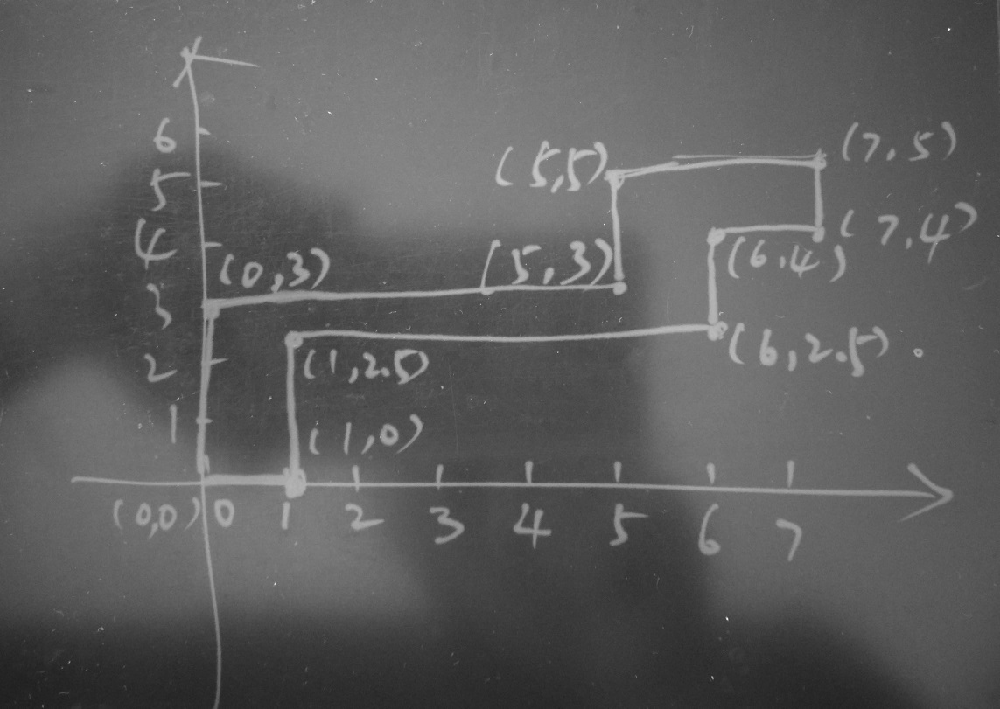
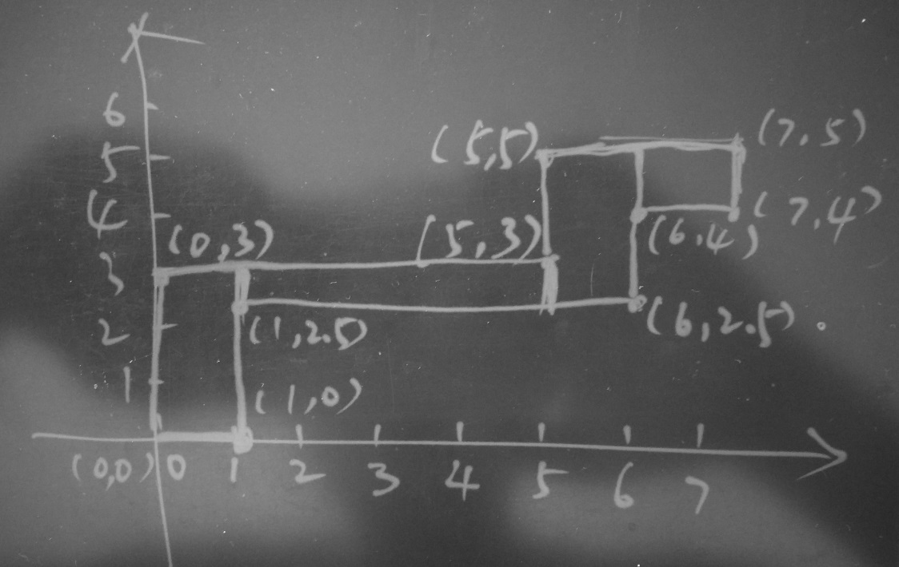
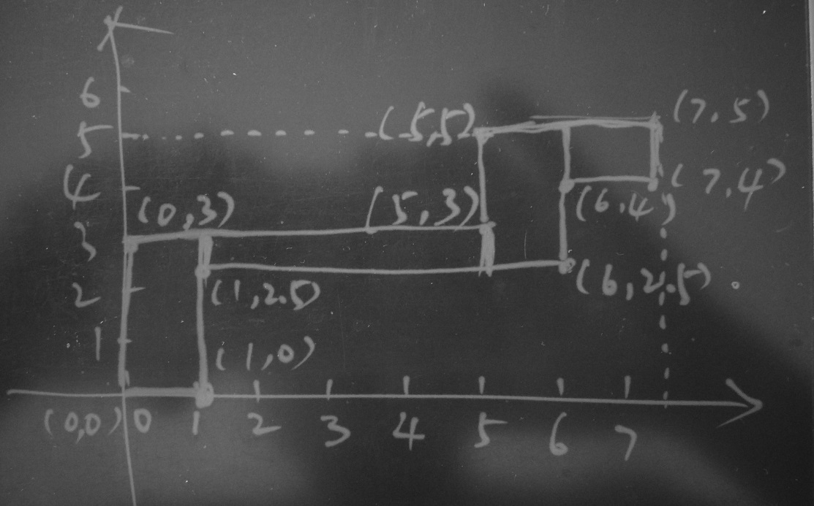
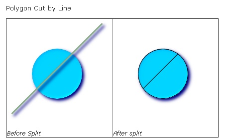
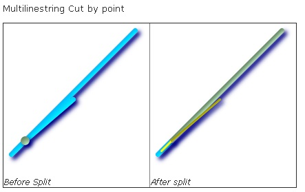

## PostgreSQL 空间st_contains，st_within空间包含搜索优化 - 降IO和降CPU(bound box) (多边形GiST优化)
                     
### 作者    
digoal    
    
### 日期     
2017-10-04     
      
### 标签    
PostgreSQL , st_contains , st_within , 空间包含 , 空间bound box , GiST索引 , 空间索引结构 , IO放大 , BOUND BOX放大      
                
----                
                 
## 背景     
点面判断、按面圈选点或其他对象，是GIS几何应用中非常典型的需求。  
  
在PostgreSQL中通过建立GiST索引可以加速这类判断，然而，建立索引就够了吗？  
  
很多时候建立索引是不够的，性能没有到达巅峰，如果要更低的延迟，更少的CPU开销，还有什么优化手段呢？  
  
实际上我以前写过一篇类似的文章，讲的是BTree索引访问的优化，当数据存放与索引顺序的线性相关性很差时，引入了一个问题，访问时IO放大：  
  
[《索引顺序扫描引发的堆扫描IO放大背后的统计学原理与解决办法 - PostgreSQL index scan enlarge heap page scans when index and column correlation small.》](../201404/20140426_01.md)    
  
原理和解决办法上面的文档已经讲得很清楚了。对于空间索引也有类似的问题和优化方法。但是首先你需要了解空间索引的构造：  
  
[《通过空间思想理解GiST索引的构造》](../201708/20170825_01.md)    
  
然后你可以通过空间聚集，来降低空间扫描的IO。  
  
[《PostgreSQL 黑科技 - 空间聚集存储》](../201709/20170905_01.md)    
  
下面以一个搜索为例，讲解空间包含搜索的优化方法：  
  
在表中有1000万空间对象数据，查询某个多边形覆盖到的空间对象。这个查询有一个特点，这个多边形是一个长条条的多边形，包含这个多边形的BOUND BOX是比较大的。  
  
  
  
构建这个多边形的方法  
  
```  
postgres=# select st_setsrid(st_makepolygon(ST_GeomFromText('LINESTRING(0 0,1 0,1 2.5,6 2.5,6 4,7 4,7 5,5 5,5 3,0 3,0 0)')), 4326);  
    st_setsrid             
----------------------------  
 0103000020E6100000010000000B00000000000000000000000000000000000000000000000000F03F0000000000000000000000000000F03F000000000000044000000000000018400000000000000440000000000000184000000000000010400000000000001C4000000000000010400000000000001C40000000000000144000000000000014400000000000001440000000000000144000000000000008400000000000000000000000000000084000000000000000000000000000000000  
(1 row)  
```  
  
## 优化手段1 - 空间聚集  
1、建表  
  
```  
postgres=# create table e(id int8, pos geometry);  
CREATE TABLE  
```  
  
2、写入空间测试数据（1000万个随机点，覆盖 +-50 的经纬度区间）  
  
```  
postgres=# insert into e select id, st_setsrid(st_makepoint(50-random()*100, 50-random()*100), 4326) from generate_series(1,10000000) t(id);  
INSERT 0 10000000  
```  
  
3、创建空间索引  
  
```  
postgres=# create index idx_e on e using gist(pos);  
CREATE INDEX  
```  
  
4、查询满足这个多边形的BOUND BOX覆盖的对象的BOUND BOX条件的对象。  
  
```  
postgres=# explain (analyze,verbose,timing,costs,buffers) select * from e where pos @ st_setsrid(st_makepolygon(ST_GeomFromText('LINESTRING(0 0,1 0,1 2.5,6 2.5,6 4,7 4,7 5,5 5,5 3,0 3,0 0)')), 4326);  
   QUERY PLAN                                                                                                                                                                                  
-----------------------  
 Index Scan using idx_e on public.e  (cost=0.42..12526.72 rows=10000 width=40) (actual time=0.091..39.449 rows=35081 loops=1)  
   Output: id, pos  
   Index Cond: (e.pos @ '0103000020E6100000010000000B00000000000000000000000000000000000000000000000000F03F0000000000000000000000000000F03F000000000000044000000000000018400000000000000440000000000000184000000000000010400000000000001C4000000000000010400000000000001C40000000000000144000000000000014400000000000001440000000000000144000000000000008400000000000000000000000000000084000000000000000000000000000000000'::geometry)  
   Buffers: shared hit=35323  
 Planning time: 0.108 ms  
 Execution time: 41.222 ms  
(6 rows)  
```  
  
搜索了35323个数据块，返回了35081条记录。  
  
  
5、查询被这个多边形包含的对象。  
  
```  
postgres=# explain (analyze,verbose,timing,costs,buffers) select * from e where st_contains(st_setsrid(st_makepolygon(ST_GeomFromText('LINESTRING(0 0,1 0,1 2.5,6 2.5,6 4,7 4,7 5,5 5,5 3,0 3,0 0)')), 4326), pos);    
   QUERY PLAN                                                                                                                                                                                  
-----------------------  
 Index Scan using idx_e on public.e  (cost=0.42..15026.72 rows=3333 width=40) (actual time=0.077..49.015 rows=8491 loops=1)  
   Output: id, pos  
   Index Cond: ('0103000020E6100000010000000B00000000000000000000000000000000000000000000000000F03F0000000000000000000000000000F03F000000000000044000000000000018400000000000000440000000000000184000000000000010400000000000001C4000000000000010400000000000001C40000000000000144000000000000014400000000000001440000000000000144000000000000008400000000000000000000000000000084000000000000000000000000000000000'::geometry ~ e.pos)  
   Filter: _st_contains('0103000020E6100000010000000B00000000000000000000000000000000000000000000000000F03F0000000000000000000000000000F03F000000000000044000000000000018400000000000000440000000000000184000000000000010400000000000001C4000000000000010400000000000001C40000000000000144000000000000014400000000000001440000000000000144000000000000008400000000000000000000000000000084000000000000000000000000000000000'::geometry, e.pos)  
   Rows Removed by Filter: 26590  
   Buffers: shared hit=35323  
 Planning time: 0.085 ms  
 Execution time: 49.460 ms  
(8 rows)  
```  
  
搜索了35323个数据块，搜索了35081条记录，返回了8491条记录，过滤了26590条不满足条件的记录。  
  
5和4的查询差异是BOUND BOX包含、实际的轮廓包含。索引的基础是bound box。在以下文档中我们也可以学习到这个原理。  
  
[《通过空间思想理解GiST索引的构造》](../201708/20170825_01.md)    
  
我们看到，复合条件的记录并不多，但是搜索了很多数据块，通过空间聚集可以减少数据块的扫描。  
  
6、创建另一张表，按空间聚集，调整数据存储顺序。并建立空间索引。  
  
```  
postgres=# create table f(like e);  
CREATE TABLE  
  
postgres=# insert into f select * from e order by st_geohash(pos,15);  
INSERT 0 10000000  
  
postgres=# create index idx_f on f using gist(pos);  
CREATE INDEX  
```  
  
7、优化后：  
  
查询满足这个多边形的BOUND BOX覆盖的对象的BOUND BOX条件的对象。从扫描35323个数据块降低到了访问1648个数据块。质的飞跃。  
  
```  
postgres=# explain (analyze,verbose,timing,costs,buffers) select * from f where pos @ st_setsrid(st_makepolygon(ST_GeomFromText('LINESTRING(0 0,1 0,1 2.5,6 2.5,6 4,7 4,7 5,5 5,5 3,0 3,0 0)')), 4326);  
   QUERY PLAN                                                                                                                                                                                  
-----------------------  
 Index Scan using idx_f on public.f  (cost=0.42..12526.72 rows=10000 width=40) (actual time=0.081..9.702 rows=35081 loops=1)  
   Output: id, pos  
   Index Cond: (f.pos @ '0103000020E6100000010000000B00000000000000000000000000000000000000000000000000F03F0000000000000000000000000000F03F000000000000044000000000000018400000000000000440000000000000184000000000000010400000000000001C4000000000000010400000000000001C40000000000000144000000000000014400000000000001440000000000000144000000000000008400000000000000000000000000000084000000000000000000000000000000000'::geometry)  
   Buffers: shared hit=1648  
 Planning time: 0.096 ms  
 Execution time: 11.404 ms  
(6 rows)  
```  
  
8、优化后：  
  
查询被这个多边形包含的对象。从扫描35323个数据块降低到了访问1648个数据块。质的飞跃。  
  
```  
postgres=# explain (analyze,verbose,timing,costs,buffers) select * from f where st_contains(st_setsrid(st_makepolygon(ST_GeomFromText('LINESTRING(0 0,1 0,1 2.5,6 2.5,6 4,7 4,7 5,5 5,5 3,0 3,0 0)')), 4326), pos);  
   QUERY PLAN                         
-----------------------  
 Index Scan using idx_f on public.f  (cost=0.42..15026.72 rows=3333 width=40) (actual time=1.216..32.398 rows=8491 loops=1)  
   Output: id, pos  
   Index Cond: ('0103000020E6100000010000000B00000000000000000000000000000000000000000000000000F03F0000000000000000000000000000F03F000000000000044000000000000018400000000000000440000000000000184000000000000010400000000000001C4000000000000010400000000000001C40000000000000144000000000000014400000000000001440000000000000144000000000000008400000000000000000000000000000084000000000000000000000000000000000'::geometry ~ f.pos)  
   Filter: _st_contains('0103000020E6100000010000000B00000000000000000000000000000000000000000000000000F03F0000000000000000000000000000F03F000000000000044000000000000018400000000000000440000000000000184000000000000010400000000000001C4000000000000010400000000000001C40000000000000144000000000000014400000000000001440000000000000144000000000000008400000000000000000000000000000084000000000000000000000000000000000'::geometry, f.pos)  
   Rows Removed by Filter: 26590  
   Buffers: shared hit=1648  
 Planning time: 0.101 ms  
 Execution time: 32.837 ms  
(8 rows)  
```  
  
使用空间聚集，从扫描35323个数据块降低到了访问1648个数据块。质的飞跃。  
  
## 优化手段2 - 空间分裂查询  
  
空间聚集的优化手段，解决了IO放大的问题，另一个优化点和空间索引的结构有关，是BOUND BOX放大的问题。  
  
从本文的例子中，我们也看到了，空间索引实际上是针对bound box的，所以在有效面积占比较低时，可能圈选到多数无效数据，导致IO和CPU同时放大，我们就来解决它。  
  
  
  
下图虚线部分包含的区间就是这个长条条的BOUND BOX。目前数据库在使用GiST索引查询满足这个多边形包含的POS的条件时，会将落在这个BOUND BOX中的对象都弄出来。  
  
  
  
优化思路：  
  
将这个多边形，拆成4个BOX，完全杜绝bound box放大的问题。  
  
```  
explain (analyze,verbose,timing,costs,buffers) select * from f where   
  st_contains(st_setsrid(st_makebox2d(st_makepoint(0,0), st_makepoint(1,3)), 4326), pos)  
  or  
  st_contains(st_setsrid(st_makebox2d(st_makepoint(1,2.5), st_makepoint(5,3)), 4326), pos)  
  or  
  st_contains(st_setsrid(st_makebox2d(st_makepoint(5,2.5), st_makepoint(6,5)), 4326), pos)  
  or  
  st_contains(st_setsrid(st_makebox2d(st_makepoint(6,4), st_makepoint(7,5)), 4326), pos);  
  
explain (analyze,verbose,timing,costs,buffers) select * from f where   
  pos @ st_setsrid(st_makebox2d(st_makepoint(0,0), st_makepoint(1,3)), 4326)  
  or  
  pos @ st_setsrid(st_makebox2d(st_makepoint(1,2.5), st_makepoint(5,3)), 4326)  
  or  
  pos @ st_setsrid(st_makebox2d(st_makepoint(5,2.5), st_makepoint(6,5)), 4326)  
  or  
  pos @ st_setsrid(st_makebox2d(st_makepoint(6,4), st_makepoint(7,5)), 4326);  
```  
  
1、组合1和2的优化手段后：  
  
查询满足这个多边形的BOUND BOX覆盖的对象的BOUND BOX条件的对象。从扫描1648个数据块降低到了访问243个数据块。质的飞跃。  
  
```  
explain (analyze,verbose,timing,costs,buffers) select * from f where   
  pos @ st_setsrid(st_makebox2d(st_makepoint(0,0), st_makepoint(1,3)), 4326)  
  or  
  pos @ st_setsrid(st_makebox2d(st_makepoint(1,2.5), st_makepoint(5,3)), 4326)  
  or  
  pos @ st_setsrid(st_makebox2d(st_makepoint(5,2.5), st_makepoint(6,5)), 4326)  
  or  
  pos @ st_setsrid(st_makebox2d(st_makepoint(6,4), st_makepoint(7,5)), 4326);  
   QUERY PLAN                         
-----------------------  
 Bitmap Heap Scan on public.f  (cost=10000000690.01..10000037405.46 rows=39940 width=40) (actual time=1.502..2.329 rows=8491 loops=1)  
   Output: id, pos  
   Recheck Cond: ((f.pos @ '0103000020E610000001000000050000000000000000000000000000000000000000000000000000000000000000000840000000000000F03F0000000000000840000000000000F03F000000000000000000000000000000000000000000000000'::geometry) OR (f.pos @ '0103000020E61000000100000005000000000000000000F03F0000000000000440000000000000F03F00000000000008400000000000001440000000000000084000000000000014400000000000000440000000000000F03F0000000000000440'::geometry) OR (f.pos @ '0103000020E610000001000000050000000000000000001440000000000000044000000000000014400000000000001440000000000000184000000000000014400000000000001840000000000000044000000000000014400000000000000440'::geometry) OR (f.pos @ '0103000020E6100000010000000500000000000000000018400000000000001040000000000000184000000000000014400000000000001C4000000000000014400000000000001C40000000000000104000000000000018400000000000001040'::geometry))  
   Heap Blocks: exact=119  
   Buffers: shared hit=243  
   ->  BitmapOr  (cost=690.01..690.01 rows=40000 width=0) (actual time=1.483..1.483 rows=0 loops=1)  
         Buffers: shared hit=124  
         ->  Bitmap Index Scan on idx_f  (cost=0.00..162.52 rows=10000 width=0) (actual time=0.461..0.461 rows=3077 loops=1)  
               Index Cond: (f.pos @ '0103000020E610000001000000050000000000000000000000000000000000000000000000000000000000000000000840000000000000F03F0000000000000840000000000000F03F000000000000000000000000000000000000000000000000'::geometry)  
               Buffers: shared hit=37  
         ->  Bitmap Index Scan on idx_f  (cost=0.00..162.52 rows=10000 width=0) (actual time=0.423..0.423 rows=1991 loops=1)  
               Index Cond: (f.pos @ '0103000020E61000000100000005000000000000000000F03F0000000000000440000000000000F03F00000000000008400000000000001440000000000000084000000000000014400000000000000440000000000000F03F0000000000000440'::geometry)  
               Buffers: shared hit=33  
         ->  Bitmap Index Scan on idx_f  (cost=0.00..162.52 rows=10000 width=0) (actual time=0.366..0.366 rows=2435 loops=1)  
               Index Cond: (f.pos @ '0103000020E610000001000000050000000000000000001440000000000000044000000000000014400000000000001440000000000000184000000000000014400000000000001840000000000000044000000000000014400000000000000440'::geometry)  
               Buffers: shared hit=31  
         ->  Bitmap Index Scan on idx_f  (cost=0.00..162.52 rows=10000 width=0) (actual time=0.232..0.232 rows=988 loops=1)  
               Index Cond: (f.pos @ '0103000020E6100000010000000500000000000000000018400000000000001040000000000000184000000000000014400000000000001C4000000000000014400000000000001C40000000000000104000000000000018400000000000001040'::geometry)  
               Buffers: shared hit=23  
 Planning time: 0.104 ms  
 Execution time: 2.751 ms  
(21 rows)  
```  
  
2、组合1和2的优化手段后：  
  
查询被这个多边形包含的对象。从扫描1648个数据块降低到了访问243个数据块。质的飞跃。  
  
```  
postgres=# explain (analyze,verbose,timing,costs,buffers) select * from f where   
  st_contains(st_setsrid(st_makebox2d(st_makepoint(0,0), st_makepoint(1,3)), 4326), pos)  
  or  
  st_contains(st_setsrid(st_makebox2d(st_makepoint(1,2.5), st_makepoint(5,3)), 4326), pos)  
  or  
  st_contains(st_setsrid(st_makebox2d(st_makepoint(5,2.5), st_makepoint(6,5)), 4326), pos)  
  or  
  st_contains(st_setsrid(st_makebox2d(st_makepoint(6,4), st_makepoint(7,5)), 4326), pos);  
  QUERY PLAN                 
--------------------------------------------  
 Bitmap Heap Scan on public.f  (cost=663.40..77378.85 rows=13327 width=40) (actual time=1.496..11.038 rows=8491 loops=1)  
   Output: id, pos  
   Recheck Cond: (('0103000020E610000001000000050000000000000000000000000000000000000000000000000000000000000000000840000000000000F03F0000000000000840000000000000F03F000000000000000000000000000000000000000000000000'::geometry ~ f.pos) OR  
 ('0103000020E61000000100000005000000000000000000F03F0000000000000440000000000000F03F00000000000008400000000000001440000000000000084000000000000014400000000000000440000000000000F03F0000000000000440'::geometry ~ f.pos) OR ('0103000020E610000001000000050000000000000000001440000000000000044000000000000014400000000000001440000000000000184000000000000014400000000000001840000000000000044000000000000014400000000000000440'::geometry ~ f.pos) OR ('0103000020E6100000010000000500000000000000000018400000000000001040000000000000184000000000000014400000000000001C4000000000000014400000000000001C40000000000000104000000000000018400000000000001040'::geometry ~ f.pos))  
   Filter: ((('0103000020E610000001000000050000000000000000000000000000000000000000000000000000000000000000000840000000000000F03F0000000000000840000000000000F03F000000000000000000000000000000000000000000000000'::geometry ~ f.pos) AND _st_contains('0103000020E610000001000000050000000000000000000000000000000000000000000000000000000000000000000840000000000000F03F0000000000000840000000000000F03F000000000000000000000000000000000000000000000000'::geometry, f.pos)) OR (('0103000020E61000000100000005000000000000000000F03F0000000000000440000000000000F03F00000000000008400000000000001440000000000000084000000000000014400000000000000440000000000000F03F0000000000000440'::geometry ~ f.pos) AND _st_contains('0103000020E61000000100000005000000000000000000F03F0000000000000440000000000000F03F00000000000008400000000000001440000000000000084000000000000014400000000000000440000000000000F03F0000000000000440'::geometry, f.pos)) OR (('0103000020E610000001000000050000000000000000001440000000000000044000000000000014400000000000001440000000000000184000000000000014400000000000001840000000000000044000000000000014400000000000000440'::geometry ~ f.pos) AND _st_contains('0103000020E610000001000000050000000000000000001440000000000000044000000000000014400000000000001440000000000000184000000000000014400000000000001840000000000000044000000000000014400000000000000440'::geometry, f.pos)) OR (('0103000020E6100000010000000500000000000000000018400000000000001040000000000000184000000000000014400000000000001C4000000000000014400000000000001C40000000000000104000000000000018400000000000001040'::geometry ~ f.pos) AND _st_contains('0103000020E6100000010000000500000000000000000018400000000000001040000000000000184000000000000014400000000000001C4000000000000014400000000000001C40000000000000104000000000000018400000000000001040'::geometry, f.pos)))  
   Heap Blocks: exact=119  
   Buffers: shared hit=243  
   ->  BitmapOr  (cost=663.40..663.40 rows=40000 width=0) (actual time=1.472..1.472 rows=0 loops=1)  
         Buffers: shared hit=124  
         ->  Bitmap Index Scan on idx_f  (cost=0.00..162.52 rows=10000 width=0) (actual time=0.436..0.436 rows=3077 loops=1)  
               Index Cond: ('0103000020E610000001000000050000000000000000000000000000000000000000000000000000000000000000000840000000000000F03F0000000000000840000000000000F03F000000000000000000000000000000000000000000000000'::geometry ~ f.pos)  
               Buffers: shared hit=37  
         ->  Bitmap Index Scan on idx_f  (cost=0.00..162.52 rows=10000 width=0) (actual time=0.438..0.438 rows=1991 loops=1)  
               Index Cond: ('0103000020E61000000100000005000000000000000000F03F0000000000000440000000000000F03F00000000000008400000000000001440000000000000084000000000000014400000000000000440000000000000F03F0000000000000440'::geometry ~ f.pos)  
               Buffers: shared hit=33  
         ->  Bitmap Index Scan on idx_f  (cost=0.00..162.52 rows=10000 width=0) (actual time=0.365..0.365 rows=2435 loops=1)  
               Index Cond: ('0103000020E610000001000000050000000000000000001440000000000000044000000000000014400000000000001440000000000000184000000000000014400000000000001840000000000000044000000000000014400000000000000440'::geometry ~ f.pos)  
               Buffers: shared hit=31  
         ->  Bitmap Index Scan on idx_f  (cost=0.00..162.52 rows=10000 width=0) (actual time=0.234..0.234 rows=988 loops=1)  
               Index Cond: ('0103000020E6100000010000000500000000000000000018400000000000001040000000000000184000000000000014400000000000001C4000000000000014400000000000001C40000000000000104000000000000018400000000000001040'::geometry ~ f.pos)  
               Buffers: shared hit=23  
 Planning time: 0.163 ms  
 Execution time: 11.497 ms  
(22 rows)  
```  
  
优化手段2，将长条条的polygon拆分成多个小的box，将大的bound box消除，搜索的BLOCK再次降低到243。质的飞跃。  
  
将两个手段合并起来用，起到了双剑合璧的效果。  
  
  
  
## st_split 切分对象  
PostGIS提供了切分对象的方法。  
  
http://postgis.net/docs/manual-2.4/ST_Split.html  
  
  
  
```  
-- this creates a geometry collection consisting of the 2 halves of the polygon  
-- this is similar to the example we demonstrated in ST_BuildArea  
SELECT ST_Split(circle, line)  
FROM (SELECT  
    ST_MakeLine(ST_MakePoint(10, 10),ST_MakePoint(190, 190)) As line,  
    ST_Buffer(ST_GeomFromText('POINT(100 90)'), 50) As circle) As foo;  
  
-- result --  
 GEOMETRYCOLLECTION(POLYGON((150 90,149.039264020162 80.2454838991936,146.193976625564 70.8658283817455,...), POLYGON(...)))  
  
-- To convert to individual polygons, you can use ST_Dump or ST_GeometryN  
SELECT ST_AsText((ST_Dump(ST_Split(circle, line))).geom) As wkt  
FROM (SELECT  
    ST_MakeLine(ST_MakePoint(10, 10),ST_MakePoint(190, 190)) As line,  
    ST_Buffer(ST_GeomFromText('POINT(100 90)'), 50) As circle) As foo;  
  
-- result --  
wkt  
---------------  
POLYGON((150 90,149.039264020162 80.2454838991936,...))  
POLYGON((60.1371179574584 60.1371179574584,58.4265193848728 62.2214883490198,53.8060233744357 ...))  
```  
  
  
  
```  
SELECT ST_AsText(ST_Split(mline, pt)) As wktcut  
        FROM (SELECT  
    ST_GeomFromText('MULTILINESTRING((10 10, 190 190), (15 15, 30 30, 100 90))') As mline,  
    ST_Point(30,30) As pt) As foo;  
  
wktcut  
------  
GEOMETRYCOLLECTION(  
    LINESTRING(10 10,30 30),  
    LINESTRING(30 30,190 190),  
    LINESTRING(15 15,30 30),  
    LINESTRING(30 30,100 90)  
)  
```  
  
我后面写了一篇文档来简化SPLIT：   
  
[《PostgreSQL 空间切割(st_split)功能扩展 - 空间对象网格化》](../201710/20171005_01.md)  
  
### st_snap   
http://postgis.net/docs/manual-2.4/ST_Snap.html  
  
  
## @, ~ 与 ST_Contains, ST_Within的区别  
  
```@, ~ 与 ST_Contains, ST_Within```都是对象包含的操作符或函数，他们有什么区别呢？  
  
### @  
  
```  
A @ B  
```  
  
Returns TRUE if A's bounding box is contained by B's.  
  
### ~  
与 ```@``` 含义相反。  
  
```  
A ~ B  
```  
  
Returns TRUE if A's bounding box contains B's.  
  
### ST_Contains  
  
```  
ST_Contains(A, B)  
```  
  
Returns true if and only if no points of B lie in the exterior of A, and at least one point of the interior of B lies in the interior of A.  
  
### ST_Within  
与 ```ST_Contains``` 含义相反。  
  
```  
ST_Within(A, B)  
```  
  
Returns true if the geometry A is completely inside geometry B  
  
### 区别  
```  
@ 和 ~的操作并不是直接针对几何对象，而是针对A和B的bound box的，也就是说包含对象的左下和右上的点组成的BOX。  
  
ST_Within和ST_Contains是针对几何对象的，但是从GiST索引搜索角度来看，是需要先用BOUND BOX去搜索，再通过CPU进行计算来判断的。  
```  
  
### 例子  
  
  
  
```  
A @ Polygon，返回真  
  
B @ Polygon，返回真  
  
C @ Polygon，返回真  
  
  
ST_Contains(Polygon, A)，返回假  
  
ST_Contains(Polygon, B)，返回真  
  
ST_Contains(Polygon, C)，返回假  
```  
  
## ST_Subdivide
http://postgis.net/docs/manual-2.4/ST_Subdivide.html  
  
ST_Subdivide也是分割函数，可以将一个空间对象，分割成多个空间对象。   
  
## 小结  
空间搜索的两个可以优化的点，原理如下：  
  
1、空间数据在存储时乱序存放，导致搜索一批数据时扫描的数据块很多。（点查感觉不到这个问题。）  
  
2、PostGIS的GiST空间索引，采用了BOUND BOX作为KEY，搜索时也是使用对象的BOUND BOX进行搜索，因此当对象是长条条时，可能造成大量的BOUND BOX空洞，放大了扫描范围（对st_contains, st_within来说），增加了CPU过滤的开销。  
  
优化手段1：空间聚集，解决IO放大问题。  
  
优化手段2：对输入条件（长条条的多边形）进行SPLIT，降低BOUND BOX放大引入的扫描范围（对st_contains, st_within来说）放大的问题。  
  
数据量：1000万。  
  
点面判断（长条形多边形，或者离散多个多边形对象覆盖的空间对象）。   
   
优化前 | 优化1（空间聚集） | 优化1,2(SPLIT多边形)  
---|---|---
访问35323块 | 访问1648块 | 访问243块
过滤26590条 | 过滤26590条 | 过滤0条
    
## 参考  
  
[《通过空间思想理解GiST索引的构造》](../201708/20170825_01.md)    
  
[《PostgreSQL 黑科技 - 空间聚集存储》](../201709/20170905_01.md)    
  
[《Greenplum 空间(GIS)数据检索 b-tree & GiST 索引实践 - 阿里云HybridDB for PostgreSQL最佳实践》](../201708/20170824_02.md)    
  
[《PostGIS空间索引(GiST、BRIN、R-Tree)选择、优化 - 阿里云RDS PostgreSQL最佳实践》](../201708/20170820_01.md)    
  
[《PostGIS 空间数据学习建议》](../201708/20170809_01.md)    
  
[《PostgreSQL 空间切割(st_split)功能扩展 - 空间对象网格化》](../201710/20171005_01.md)   
  
http://postgis.net/docs/manual-2.4/ST_Within.html  
  
http://postgis.net/docs/manual-2.4/ST_Contains.html  
  
http://postgis.net/docs/manual-2.4/ST_Geometry_Contained.html  
  
http://postgis.net/docs/manual-2.4/ST_Geometry_Contain.html  
  
http://postgis.net/docs/manual-2.4/ST_Split.html  
  
http://postgis.net/docs/manual-2.4/ST_Snap.html  
  
  
  
<a rel="nofollow" href="http://info.flagcounter.com/h9V1"  ></a>  
  
  
  
  
  
  
## [digoal's 大量PostgreSQL文章入口](https://github.com/digoal/blog/blob/master/README.md "22709685feb7cab07d30f30387f0a9ae")
  
