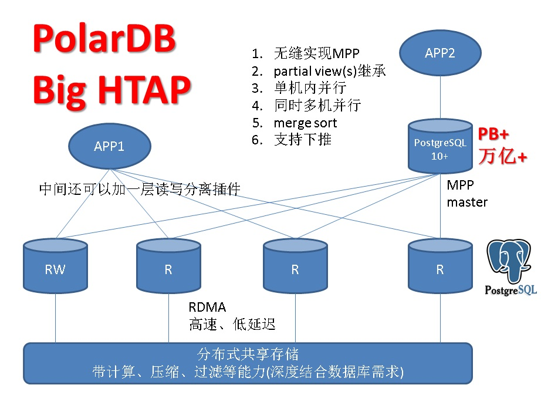
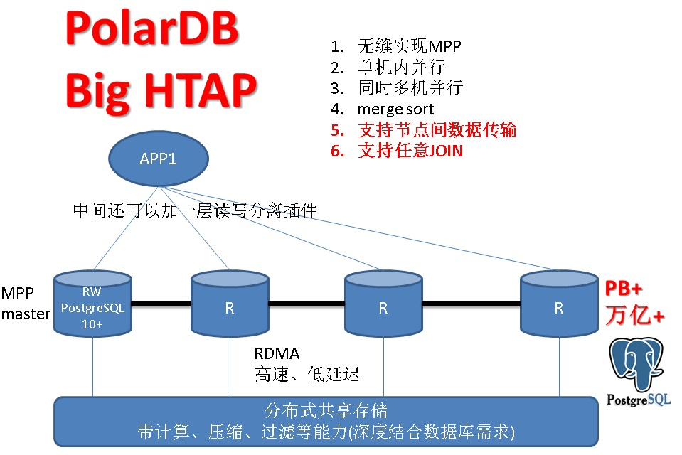

## HTAP数据库(OLTP+OLAP) - sharding 和 共享分布式存储 数据库架构 优缺点  
                                   
### 作者                  
digoal                  
                  
### 日期                   
2017-10-13                  
                    
### 标签                  
PostgreSQL , 共享分布式存储 , 存储计算能力。     
         
----         
           
## 背景   
随着互联网的发展，数据爆炸性的增长，数据库逐渐成为了很多业务的绊脚石，很多业务也哭着喊着要上分布式数据库（个人认为大部分是高估了自己的业务）。  
  
分布式数据库又分很多流派，比如重点要说的sharding和共享分布式存储的架构，它们有着什么样的优缺点呢？  
  
## sharding vs 共享分布式存储 数据库架构  
  
  
  
  
  
如果要在单机并行能力的前提下，再实现多机器并行，可以有两种玩法：  
  
第一种玩法，可以带其他产品一起玩，用PostgreSQL 10+的fdw+append parallel+继承+pushdown(join,agg,where,sort,...)+merge sort，可以实现对任意产品的多机并行（比如后端可以是MySQL）。      
  
  
  
第二种玩法，更加的先进，节点间不仅共享数据，而且能直接通讯，每个节点运算数据的一部分(至少需要改进优化器实现这个功能)，多机并行，任意表任意字段JOIN，多阶段聚合等都能上阵，简单来说就是具备MPP的能力。   
  
  
  
citus有这样的潜质，当然需要适配共享存储架构进行改造。   
  
## 点评  
### 1、作为OLTP业务，使用sharding带来的问题较多，有点得不偿失。  
  
1、1. 扩容不方便（数据重分布）  
  
1、2. 分布键变更很麻烦  
  
1、3. 分布键选择（架构设计）谨慎  
  
1、4. 跨库JOIN性能差，甚至只能按分布键JOIN，其他字段不支持JOIN。（因为这种产品架构数据节点之间是孤岛，数据需要在孤岛之间交互，需要通过上层的中间件节点，而这样的话，如果有跨库JOIN，就需要将数据收到中间件节点再JOIN，性能差是可想而知的。）      
  
1、5. 分布式事务性能差，甚至不支持分布式事务。    
  
1、6. SQL限制多、功能缺失多  
  
1、7. 应用改造成本巨大  
  
1、8. 全局一致性时间点恢复几乎不可实现  
  
### 2、作为OLAP业务，如果使用sharding(MPP)架构，是值得的，可以充分利用多机的计算能力、IO能力，提高处理吞吐，例如阿里云的HybridDB for PG。   
  
而如果使用中间件的sharding形态，则不适合OLAP业务。(原因是节点间不支持互通，在AP中有大量的JOIN需求，节点间不同带来一个问题，JOIN需要将数据汇聚到中间件节点执行，导致非常慢，几乎不可用)    
  
HDB PG是MPP形态的产品，计算节点之间可以相互通讯，任意列的JOIN都不存在问题，同时还支持行列混合，多阶聚合的功能，是专门为OLAP场景打造的一款PB级分布式分析数据库。  
  
  
  
[《阿里云HybridDB for PostgreSQL实践 - 多阶聚合》](../201708/20170821_02.md)    
  
[阿里云的HybridDB for PG](https://www.aliyun.com/product/gpdb)  
  
HDB PG支撑了很多海量分析的业务场景。  
    
    
  
### 3、作为HTAP(oltp+olap)业务，使用共享分布式存储，一写多读的架构，是目前最先进的架构。  
  
3、1. 实例扩容方便（秒级新增只读节点）  
  
3、2. 存储扩容方便（几乎无限扩展IO、带宽）  
  
3、3. 不存在分布键问题  
  
3、4. 不存在跨库JOIN问题  
  
3、5. 不存在分布式事务问题  
  
3、6. SQL没有任何限制  
  
3、7. 应用无需改造  
  
3、8. 支持全局一致性时间点恢复  
  
3、9. 只读节点延迟毫秒内  
  
3、10. 所有节点都支持并行计算  
  
3、11. 分布式存储：存储和引擎分离后，存储可以专心支持多副本，支持跨域容灾，支持高带宽，支持几乎无限的扩容能力。同时与数据库引擎深度结合，支持硬件级计算、加解密、加解压、数据过滤、类型预处理等能力。大幅度降低数据传输和上层处理的压力。         
  
目前阿里云推出的PolarDB正是这种架构，已支持MySQL协议，正在支持PostgreSQL协议(PostgreSQL具备了先天的优势（向量计算、并行计算、JIT、哈希聚合、扩展列存、继承、等一系列特性），势必成为HTAP的顶尖产品)。   
   
  
  
  
  
  
  
  
  
  
  
  
  
  
  
  
  
  
  
  
  
  
  
  
  
  
  
  
  
  
  
  
  
  
  
  
  
  
  
  
  
  
  
  
  
  
  
  
  
  
  
  
  
  
  
  
  
  
  
  
  
  
  
  
  
  
  
  
  
  
  
  
  
  
#### [PostgreSQL 许愿链接](https://github.com/digoal/blog/issues/76 "269ac3d1c492e938c0191101c7238216")
您的愿望将传达给PG kernel hacker、数据库厂商等, 帮助提高数据库产品质量和功能, 说不定下一个PG版本就有您提出的功能点. 针对非常好的提议，奖励限量版PG文化衫、纪念品、贴纸、PG热门书籍等，奖品丰富，快来许愿。[开不开森](https://github.com/digoal/blog/issues/76 "269ac3d1c492e938c0191101c7238216").  
  
  
#### [9.9元购买3个月阿里云RDS PostgreSQL实例](https://www.aliyun.com/database/postgresqlactivity "57258f76c37864c6e6d23383d05714ea")
  
  
#### [PostgreSQL 解决方案集合](https://yq.aliyun.com/topic/118 "40cff096e9ed7122c512b35d8561d9c8")
  
  
#### [德哥 / digoal's github - 公益是一辈子的事.](https://github.com/digoal/blog/blob/master/README.md "22709685feb7cab07d30f30387f0a9ae")
  
  

  
  
#### [PolarDB 学习图谱: 训练营、培训认证、在线互动实验、解决方案、生态合作、写心得拿奖品](https://www.aliyun.com/database/openpolardb/activity "8642f60e04ed0c814bf9cb9677976bd4")
  
  
#### [购买PolarDB云服务折扣活动进行中, 55元起](https://www.aliyun.com/activity/new/polardb-yunparter?userCode=bsb3t4al "e0495c413bedacabb75ff1e880be465a")
  
  
#### [About 德哥](https://github.com/digoal/blog/blob/master/me/readme.md "a37735981e7704886ffd590565582dd0")
  
