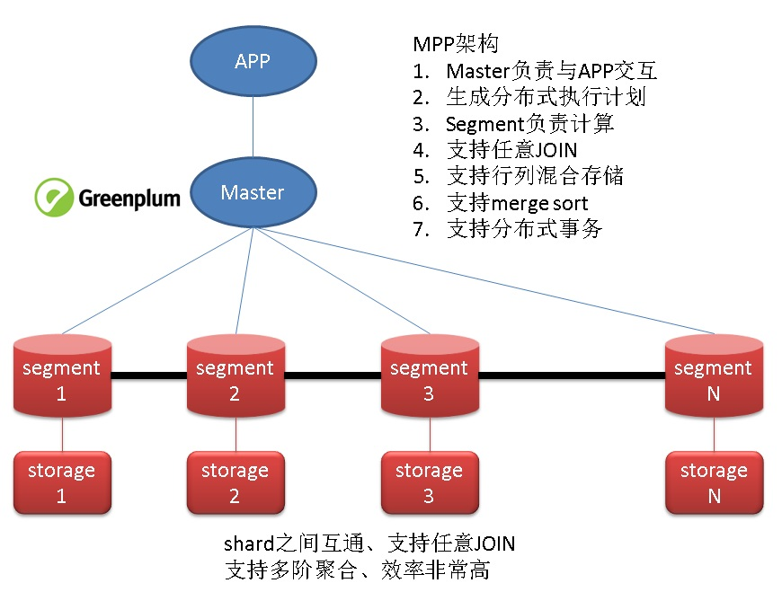
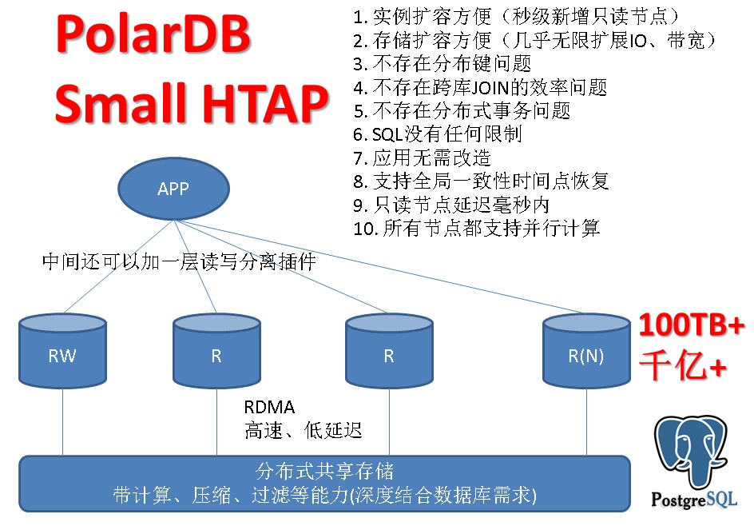

## sharding 和 共享分布式存储 数据库架构 优缺点  
                                   
### 作者                  
digoal                  
                  
### 日期                   
2017-10-13                  
                    
### 标签                  
PostgreSQL , 共享分布式存储 , 存储计算能力。     
         
----         
           
## 背景   
随着互联网的发展，数据爆炸性的增长，数据库逐渐成为了很多业务的绊脚石，很多业务也哭着喊着要上分布式数据库（个人认为大部分是高估了自己的业务）。  
  
分布式数据库又分很多流派，比如重点要说的sharding和共享分布式存储的架构，它们有着什么样的优缺点呢？  
  
## sharding vs 共享分布式存储 数据库架构  
  
  
  
  
  
如果还想再充分利用所有主机的计算能力，还可以这样玩耍：  
  
  
  
## 点评  
### 1、作为OLTP业务，使用sharding带来的问题较多，有点得不偿失。  
  
1、1. 扩容不方便（数据重分布）  
  
1、2. 分布键变更很麻烦  
  
1、3. 分布键选择（架构设计）谨慎  
  
1、4. 跨库JOIN性能差，甚至只能按分布键JOIN，其他字段不支持JOIN。    
  
1、5. 分布式事务性能差，甚至不支持分布式事务。    
  
1、6. SQL限制多、功能缺失多  
  
1、7. 应用改造成本巨大  
  
1、8. 全局一致性时间点恢复几乎不可实现  
  
### 2、作为OLAP业务，使用sharding(MPP)架构，是值得的，可以充分利用多机的计算能力、IO能力，提高处理吞吐，例如阿里云的HybridDB for PG。  
  
[阿里云的HybridDB for PG](https://www.aliyun.com/product/gpdb)  
  
### 3、作为HTAP(oltp+olap)业务，使用共享分布式存储，一写多读的架构，是目前最先进的架构。  
  
3、1. 实例扩容方便（秒级新增只读节点）  
  
3、2. 存储扩容方便（几乎无限扩展IO、带宽）  
  
3、3. 不存在分布键问题  
  
3、4. 不存在跨库JOIN问题  
  
3、5. 不存在分布式事务问题  
  
3、6. SQL没有任何限制  
  
3、7. 应用无需改造  
  
3、8. 支持全局一致性时间点恢复  
  
3、9. 只读节点延迟毫秒内  
  
3、10. 所有节点都支持并行计算  
  
3、11. 分布式存储与数据库引擎深度结合，支持硬件级计算、加解密、加解压、数据过滤、类型预处理等能力。大幅度降低数据传输和上层处理的压力。         
