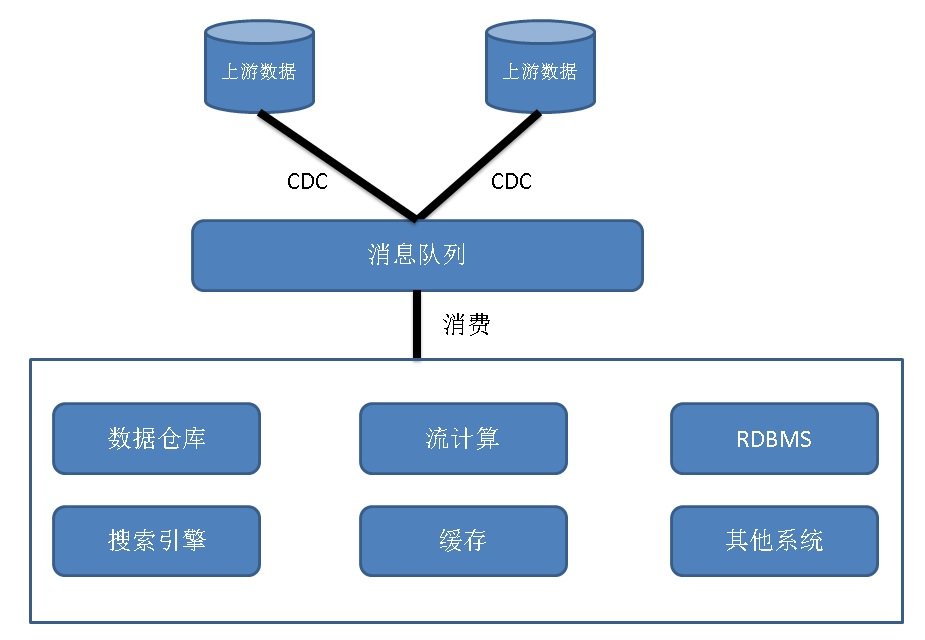

## debezium - 数据实时捕获和传输管道(CDC)  
                                   
### 作者                  
digoal                  
                  
### 日期                   
2017-10-26                  
                    
### 标签                  
PostgreSQL , debezium , kafka , CDC   
                              
----                              
                               
## 背景   
在业务系统中，会涉及到多个数据源的数据流转，例如在线系统的数据流转到分析系统、流计算系统、搜索引擎、缓存系统、事件处理系统等。  
  
为了实现这一目的，CDC系统应运而生，CDC系统用于捕获上游数据的实时变化（已提交的数据），写入消息队列（例如KAFKA）持久化。下游系统，消费消息队列的数据。从而实现实时的数据流转。  
  
  
  
debezium是一个开源的分布式CDC系统，支持对接各种数据源，将上游已持久化的数据变更捕获后写入消息队列。  
  
https://github.com/debezium/debezium  
  
https://debezium.io/docs/connectors/postgresql/   
  
上游是PostgreSQL、MySQL时，支持通过WAL、BINLOG实时捕获已提交事务数据。  
  
https://github.com/debezium/postgres-decoderbufs  
  
通过这种方法，可以将数据从MySQL实时同步到PostgreSQL，或者从其他系统，将数据实时同步到PostgreSQL。  
  
由于PostgreSQL的功能强大，支持并行计算、空间数据处理、文本分析、数据挖掘、机器学习、复杂查询、冷热分离存储、分布式架构(citus, greenplum, xl)等。  
  
PostgreSQL可以用于这些系统的中心数据库（分析、复杂查询、挖掘），搜索引擎（全文检索、模糊检索、相似检索），实时预警（流式事件处理），空间数据库（PostGIS空间数据实时处理）。  
  
  
  
  
  
  
  
  
  
  
  
  
  
  
  
  
  
  
  
  
  
  
  
  
  
  
  
  
  
  
  
  
  
  
  
  
  
  
  
  
  
#### [免费领取阿里云RDS PostgreSQL实例、ECS虚拟机](https://www.aliyun.com/database/postgresqlactivity "57258f76c37864c6e6d23383d05714ea")
  
  
#### [大量阿里云PG解决方案: 任意维度实时圈人; 时序数据实时处理; 时间、空间、业务 多维数据实时透视; 独立事件相关性分析; 海量关系实时图式搜索; 社交业务案例; 流式数据实时处理案例; 物联网; 全文检索; 模糊、正则查询案例; 图像识别; 向量相似检索; 数据清洗、采样、脱敏、批处理、合并; GIS 地理信息空间数据应用; 金融业务; 异步消息应用案例; 海量数据 冷热分离; 倒排索引案例; 海量数据OLAP处理应用;](https://yq.aliyun.com/topic/118 "40cff096e9ed7122c512b35d8561d9c8")
  
  
#### [德哥的 / digoal's PostgreSQL文章入口 - 努力做成PG资源最丰富的个人blog](https://github.com/digoal/blog/blob/master/README.md "22709685feb7cab07d30f30387f0a9ae")
  
  

  
