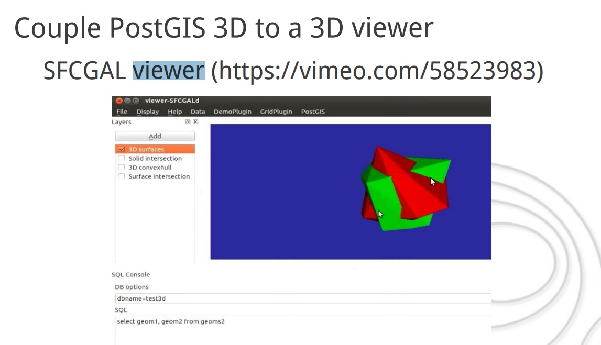
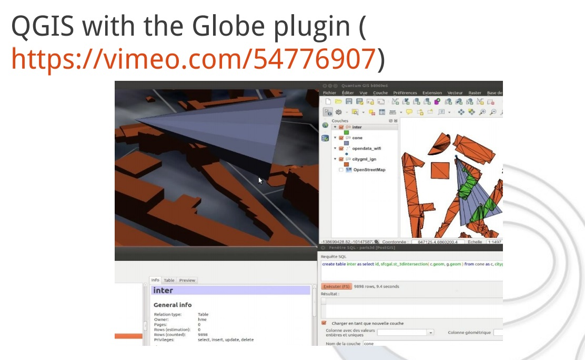
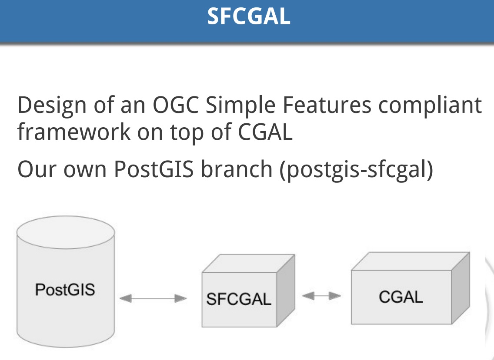
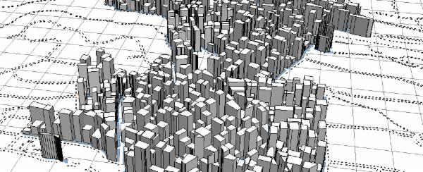
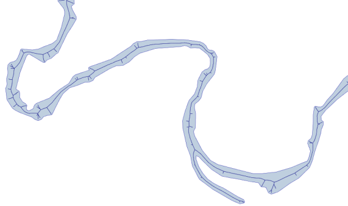

## PostgreSQL + PostGIS + SFCGAL 优雅的处理3D数据  
                             
### 作者            
digoal            
            
### 日期             
2017-10-18            
              
### 标签            
PostgreSQL , SFCGAL , 3D      
                        
----                        
                         
## 背景     
  
PostGIS 整合 SFCGAL，优雅的处理3D空间数据。  
  
  
  
  
  
  
  
## 例子  
[PDF: 3D and exact geometries for PostGIS , FOSDEM PGDay](20171026_02_pdf_001.pdf)  
  
http://www.sfcgal.org/  
  
https://www.tuicool.com/articles/jAjIBn  
  
https://wiki.postgresql.org/images/3/36/Postgis_3d_pgday2013_hm.pdf  
  
http://postgis.net/docs/manual-2.4/reference.html  
  
So, for those of you who haven’t seen it, [SFCGAL](http://www.sfcgal.org/) , “a C++ wrapper library around [CGAL](http://www.cgal.org/) with the aim of supporting ISO 19107:2013 and [OGC Simple Features Access 1.2](http://www.opengeospatial.org/standards/sfa) for 3D operations” is now an optional include in PostGIS (I believe beginning with 2.1, forgive me if I’m wrong).    
  
This was a quiet outcome of the Boston Code Sprint, after Paul Ramsey declared exact rational number representation would not make its way into PostGIS.    
  
(I promise, that’s the only animated gif I’ll ever do, hat tip James Fee who did it for years before it was cool).     
  
What does this mean for a typical PostGIS user? Well, so far it adds a nice suite of new 2D and 3D functions :    
  
http://postgis.net/docs/manual-2.4/reference.html  
  
```  
postgis_sfcgal_version — Returns the version of SFCGAL in use  
  
ST_Extrude — Extrude a surface to a related volume  
  
ST_StraightSkeleton — Compute a straight skeleton from a geometry  
  
ST_ApproximateMedialAxis — Compute the approximate medial axis of an areal geometry.  
  
ST_IsPlanar — Check if a surface is or not planar  
  
ST_Orientation — Determine surface orientation  
  
ST_ForceLHR — Force LHR orientation  
  
ST_MinkowskiSum — Performs Minkowski sum  
  
ST_3DIntersection — Perform 3D intersection  
  
ST_3DDifference — Perform 3D difference  
  
ST_3DUnion — Perform 3D union  
  
ST_3DArea — Computes area of 3D surface geometries. Will return 0 for solids.  
  
ST_Tesselate — Perform surface Tesselation of a polygon or polyhedralsurface and returns as a TIN or collection of TINS  
  
ST_Volume — Computes the volume of a 3D solid. If applied to surface (even closed) geometries will return 0.  
  
ST_MakeSolid — Cast the geometry into a solid. No check is performed. To obtain a valid solid, the input geometry must be a closed Polyhedral Surface or a closed TIN.  
  
ST_IsSolid — Test if the geometry is a solid. No validity check is performed.  
```  
  
ST_Extrude is fun，this is a function for doing things like this:   
  
  
  
Simulated extruded building footprints.  
  
Extruded footprints from (ahem) City Engine. Ssssh. Don’t tell.  
  
ST_StraightSkeleton does in one step the first phase of what I’ve been going on about for a couple years re: Voronoi diagrams (and bypasses Voronoi altogether):  
  
  
  
Approximation of straight skeleton / skeletonization of stream polygon。  
  
Plus more! I’ve just started exploring.  
  
BTW, in advance of there being an SFCGAL install guide for PostGIS, a good source for info on install can be gleaned from the [PostGIS Developers listserve](http://osgeo-org.1560.x6.nabble.com/SFCGAL-trouble-installing-td5083390.html) .     
  
  
  
  
  
  
  
  
  
  
  
  
  
  
  
  
  
  
  
  
  
  
  
  
  
  
  
  
  
  
  
  
  
  
  
  
  
  
  
  
  
  
  
  
  
  
  
  
  
  
  
  
  
  
  
#### [9.9元购买3个月阿里云RDS PostgreSQL实例](https://www.aliyun.com/database/postgresqlactivity "57258f76c37864c6e6d23383d05714ea")
  
  
#### [PostgreSQL 解决方案集合](https://yq.aliyun.com/topic/118 "40cff096e9ed7122c512b35d8561d9c8")
- [1 任意维度实时圈人](https://yq.aliyun.com/topic/118 "40cff096e9ed7122c512b35d8561d9c8")
- [2 时序数据实时处理](https://yq.aliyun.com/topic/118 "40cff096e9ed7122c512b35d8561d9c8")
- [3 时间、空间、业务 多维数据实时透视](https://yq.aliyun.com/topic/118 "40cff096e9ed7122c512b35d8561d9c8")
- [4 独立事件相关性分析](https://yq.aliyun.com/topic/118 "40cff096e9ed7122c512b35d8561d9c8")
- [5 海量关系实时图式搜索](https://yq.aliyun.com/topic/118 "40cff096e9ed7122c512b35d8561d9c8")
- [6 社交业务案例](https://yq.aliyun.com/topic/118 "40cff096e9ed7122c512b35d8561d9c8")
- [7 流式数据实时处理案例](https://yq.aliyun.com/topic/118 "40cff096e9ed7122c512b35d8561d9c8")
- [8 IoT 物联网, 时序](https://yq.aliyun.com/topic/118 "40cff096e9ed7122c512b35d8561d9c8")
- [9 全文检索](https://yq.aliyun.com/topic/118 "40cff096e9ed7122c512b35d8561d9c8")
- [10 模糊、正则 查询案例](https://yq.aliyun.com/topic/118 "40cff096e9ed7122c512b35d8561d9c8")
- [11 图像识别](https://yq.aliyun.com/topic/118 "40cff096e9ed7122c512b35d8561d9c8")
- [12 向量相似检索](https://yq.aliyun.com/topic/118 "40cff096e9ed7122c512b35d8561d9c8")
- [13 数据清洗、采样、脱敏、批处理、合并](https://yq.aliyun.com/topic/118 "40cff096e9ed7122c512b35d8561d9c8")
- [14 GIS 地理信息空间数据应用](https://yq.aliyun.com/topic/118 "40cff096e9ed7122c512b35d8561d9c8")
- [15 金融业务](https://yq.aliyun.com/topic/118 "40cff096e9ed7122c512b35d8561d9c8")
- [16 异步消息应用案例](https://yq.aliyun.com/topic/118 "40cff096e9ed7122c512b35d8561d9c8")
- [17 海量数据 冷热分离](https://yq.aliyun.com/topic/118 "40cff096e9ed7122c512b35d8561d9c8")
- [18 倒排索引案例](https://yq.aliyun.com/topic/118 "40cff096e9ed7122c512b35d8561d9c8")
- [19 海量数据OLAP处理应用](https://yq.aliyun.com/topic/118 "40cff096e9ed7122c512b35d8561d9c8")
  
  
#### [德哥 / digoal's 趣味入口 - 努力成为灯塔, 公益是一辈子的事.](https://github.com/digoal/blog/blob/master/README.md "22709685feb7cab07d30f30387f0a9ae")
  
  

  
