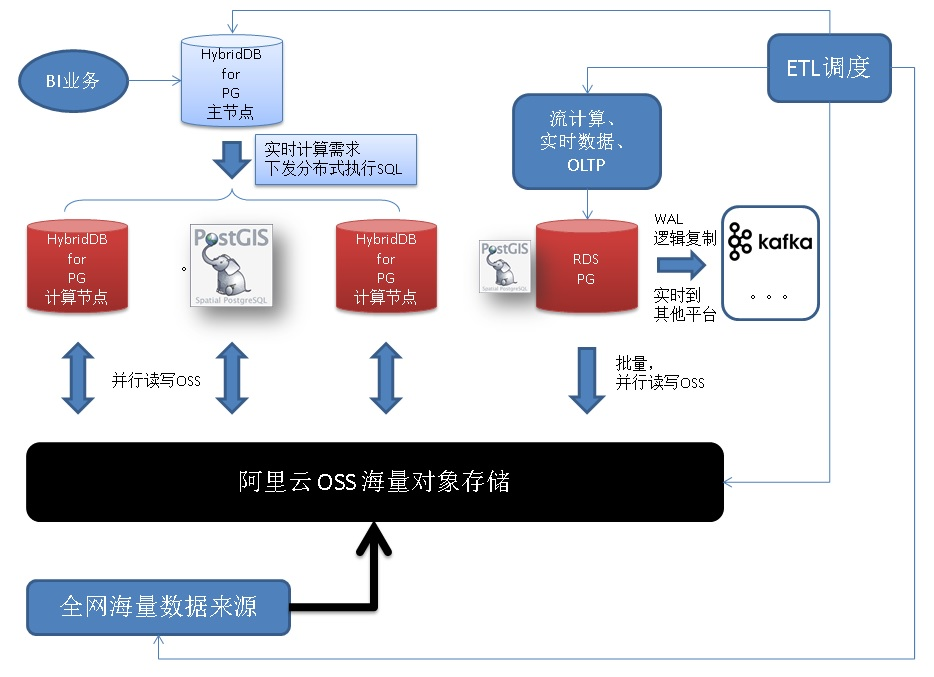

## MySQL,Oracle,SQL Server等准实时同步到PostgreSQL的方案之一 - FDW外部访问接口  
                               
### 作者              
digoal              
              
### 日期               
2017-10-27              
                
### 标签              
PostgreSQL , MySQL , Oracle , SQL Server , DRDS , 数据同步 , FDW , 调度 , 逻辑删除 , 空洞 , 事务时间           
                          
----                          
                           
## 背景       
PostgreSQL历经几十年的发展，厚积薄发，每年一个大版本，每年都有惊喜，2017年10月推出的10版本，包含重大重磅特性(单元化逻辑订阅、并行计算、向量计算等，支持了OLTP+OLAP两种业务合一)。PostgreSQL在逐渐成为企业的核心库。  
  
[《最受开发者欢迎的HTAP数据库PostgreSQL 10特性》](../201710/20171029_01.md)  
  
[《PostgreSQL 10 解读》](../201705/20170509_01.md)  
  
企业数据源可能众多，为了实现数据的同步，方法有很多，较为常见的是这样的方法，将数据变更汇总到消息队列，通过消息订阅的方式，传播数据。消息队列可以承担持久化存储、幂等消费、数据清洗、流式计算等工作。当然，为了提高消息队列的吞吐率，越简单越好。就像路由器和交换机一样，各司其职。  
  
[《debezium - 数据实时捕获和传输管道(CDC)》](../201710/20171026_01.md)    
  
  
  
在阿里云的PostgreSQL生态中，还可以有这样的方法(数据实时写入PG，经过PG的清洗，通过OSS流入HDB PG。实现OLTP和OLAP的数据流动。)：  
  
  
  
除了以上方法，实际上PostgreSQL还有一个杀手级功能，FDW，通过FDW，可以连接各种数据源，目前已有的接口如下（看样子包含了地球上所有的数据源）：  
  
https://wiki.postgresql.org/wiki/Fdw  
  
下面我们来看一下，如何基于FDW构建一个简单的准实时同步方案。  
  
## FDW是什么  
  
  
FDW是PostgreSQL的一个外部数据访问接口规范，用户可以自定义任何数据源的FDW handler，这样就能访问你要访问的数据接口了。  
  
https://www.postgresql.org/docs/10/static/fdwhandler.html  
  
## 上游数据源设计规范  
为了适应使用FDW来实现准实时同步的需求，上游数据源必须要符合一定的规约。  
  
1、被同步的表必须有主键。  
  
2、被同步的表必须有修改时间（非空），修改时间字段的初始值为记录创建时间，每次更新记录，更新为当前时间。  
  
3、被同步的表必须有逻辑删除标记（不要使用delete直接删除数据）  
  
或者DELETE的操作与DDL操作一样，采用调度（业务系统与PG系统同时操作的模式）。  
  
4、被同步的表，修改时间字段，必须有索引。  
  
### 逻辑删除  
简单介绍一下逻辑删除。  
  
```  
create table tbl(  
  id int primary key,            -- 主键  
  info text,   
  state char(1),                 -- 逻辑删除标记  
  crt_time timestamp not null,   -- 写入时间  
  mod_time timestamp not null    -- 记录被修改的时间，记录创建时，设置mod_time为创建时间。  
);  
```  
  
逻辑删除时，并非调用delete，而是更新state这个标记。  
  
```  
update tbl set state='d' , mod_time=now() where id=?;  
```  
   
PostgreSQL支持使用RULE，将DELETE操作转换为UPDATE操作，例子    
  
```
postgres=# create table log(id serial8 primary key, info text, state char(1), crt_time timestamp, mod_time timestamp);
CREATE TABLE

postgres=# create rule r1 as on delete to log do instead update log set state='d',mod_time=now() where id=OLD.id;
CREATE RULE
postgres=# insert into log (info,crt_time,mod_time) values ('abc',now(),now());
INSERT 0 1
postgres=# select * from log;
 id | info | state |          crt_time          |          mod_time          
----+------+-------+----------------------------+----------------------------
  1 | abc  |       | 2017-10-27 15:15:44.577036 | 2017-10-27 15:15:44.577036
(1 row)

postgres=# delete from log where id=1;
DELETE 0
postgres=# select * from log;
 id | info | state |          crt_time          |          mod_time          
----+------+-------+----------------------------+----------------------------
  1 | abc  | d     | 2017-10-27 15:15:44.577036 | 2017-10-27 15:15:54.367215
(1 row)

postgres=# update log set info='test';
UPDATE 1
postgres=# select * from log;
 id | info | state |          crt_time          |          mod_time          
----+------+-------+----------------------------+----------------------------
  1 | test | d     | 2017-10-27 15:15:44.577036 | 2017-10-27 15:15:54.367215
(1 row)
```
  
下游同步时，就可以同步到这样的操作。  
  
如果业务上一定要DELETE，那么不适合本方案。请使用binlog的同步方式。例如rds_dbsync这个工具。    
  
https://github.com/aliyun/rds_dbsync/    
    
[《MySQL准实时同步到PostgreSQL, Greenplum的方案之一 - rds_dbsync》](../201710/20171027_02.md)    
    
## 调度设计与例子  
### 设计  
1、创建外部表  
  
2、创建本地表，结构与外部表一致  
  
3、创建同步函数  
  
4、同步函数逻辑  
  
设置栅栏，对于一张外部表，同一时刻只允许开启一个任务，防止重复拖数据(虽然insert on conflict会幂等处理，但是也浪费资源)。  
  
设置上一次同步的截止时间戳  
  
从上一次截止的时间戳开始同步，直到N分钟前的数据（可调），目的是防止空洞（比如一些老事务未提交，时间戳还是老的，会成为空洞）。  
  
5、使用linux crontab，创建定时任务  
  
### 例子  
  
环境部署，MySQL fdw的使用，详见：  
  
[《PostgreSQL 10 + PostGIS + Sharding(pg_pathman) + MySQL(fdw外部表) on ECS 部署指南(适合新用户)》](../201710/20171018_01.md)    
  
假设mysql_fdw foreign data wrapper, foreign server, user mapping, 权限 都已经配置好了。  
  
1、外部表  
  
```  
CREATE FOREIGN TABLE remote_table1(  
     id int,  
     info text,  
     state char(1),  
     crt_time timestamp,  
     mod_time timestamp  
     )  
SERVER mysql_server1  
     OPTIONS (dbname 'db1', table_name 'remote_table1');  
```  
  
2、本地表(与远程表定义一致)  
  
```  
create table local_table1(  
  id int primary key,            -- 主键  
  info text,   
  state char(1),                 -- 逻辑删除标记  
  crt_time timestamp not null,   -- 写入时间  
  mod_time timestamp not null    -- 记录被修改的时间，记录创建时，设置mod_time为创建时间。  
);  
```  
  
3、同步函数1  
  
```  
create or replace function sync_tbl1(rmt_table name) returns void as $$   -- 每个表配置一个独立的advisory ID，防止单个表有多个任务同时跑。  
declare  
  v_mod_time timestamp;        -- 起始时间  
  v_upper_mod_time timestamp;  -- 截止时间  
begin  
  if not pg_try_advisory_lock(hashtext(rmt_table)) then return; end if;   -- 保护，确保同一个表，只有单个任务在同步。不同的表不会干扰。  
  
  select max(mod_time) into v_mod_time from local_table1 ;  
  if v_mod_time is null then   
    v_mod_time='0001-01-01'::timestamp;   
  end if;  
  
  v_upper_mod_time := now()-interval '5 min';     -- 最多同步到5分钟前，防止空洞（比如一些老事务未提交，时间戳还是老的，会成为空洞）。  
  
  insert into local_table1    
  (  
    select * from remote_table1 where mod_time > v_mod_time and mod_time <= v_upper_mod_time;  
  )   
  on conflict (id) do update set info=excluded.info,state=excluded.state,crt_time=excluded.crt_time,mod_time=excluded.mod_time ;   -- 每个表的主键，以及字段可能不一样，需要修改一下。  
    
  return;  
end;  
$$ language plpgsql strict;  
```  
  
4、调度  
  
假设每分钟调度一次。  
  
```  
crontab -e  
* * * * * psql -c "select sync_tbl1('remote_table1');"  
```  
  
对于很大数据量的数据，PostgreSQL可以使用分区表。  
  
[《PostgreSQL 10.0 preview 功能增强 - 内置分区表》](../201612/20161215_01.md)    
  
## 注意  
空洞问题。  
  
最多同步到5分钟前，防止空洞（比如一些老事务未提交，时间戳还是老的，会成为空洞）。  
  
## 参考  
  
[《debezium - 数据实时捕获和传输管道(CDC)》](../201710/20171026_01.md)    
  
[《PostgreSQL 10 + PostGIS + Sharding(pg_pathman) + MySQL(fdw外部表) on ECS 部署指南(适合新用户)》](../201710/20171018_01.md)    
  
[《PostgreSQL 10.0 preview 功能增强 - 内置分区表》](../201612/20161215_01.md)    
  
<a rel="nofollow" href="http://info.flagcounter.com/h9V1"  ></a>  
  
  
  
  
  
  
## [digoal's 大量PostgreSQL文章入口](https://github.com/digoal/blog/blob/master/README.md "22709685feb7cab07d30f30387f0a9ae")
  
