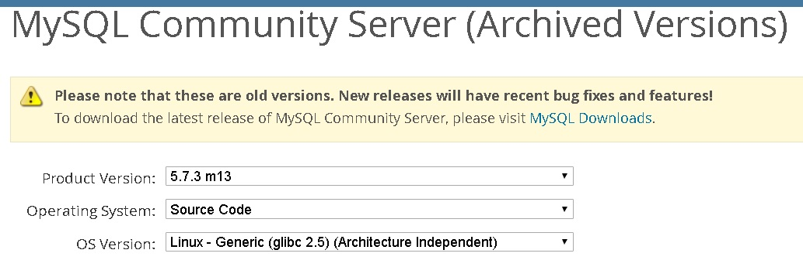

## MySQL准实时同步到PostgreSQL, Greenplum的方案之一 - rds_dbsync   
                               
### 作者              
digoal              
              
### 日期               
2017-10-27             
                
### 标签              
PostgreSQL , Greenplum , rds_dbsync , binlog         
                          
----                          
                           
## 背景       
rds_dbsync是阿里云数据库内核组开源的一个数据实时同步工具。  
  
可以解析MySQL的binlog，或者PostgreSQL的WAL日志，实现增量的实时同步。同时支持全量不落地迁移功能。  
  
## rds_dbsync功能介绍  
  
1、全量不落地迁移(从mysql到pgsql，从pgsql到pgsql，从mysql或pgsql到Greenplum)。  
  
支持并行。  
  
2、DDL转换  
  
3、增量实时同步(从mysql到pgsql，从pgsql到pgsql，从mysql或pgsql到Greenplum)  
  
注意，rds_dbsync增量实时同步功能不支持DDL，仅支持DML。因此如果有DDL操作，建议保持目标端处于源端的超集即可。  
  
例如  
  
1、用户需要将字段改长。  
  
先加目标端，再加源端。  
  
2、用户需要删字段。  
  
先删源端，再删目标端。  
  
3、用户需要加字段。  
  
先加目标端，再加源端。  
  
## rds_dbsync功能模块  
1、mysql2pgsql，全量迁移命令。  
  
2、binlog_miner，解析mysql binlog，并写入临时PG库的命令。  
  
3、binlog_loader，从临时PG库将BINLOG取出，并在目标库回放的命令（会合并多条为一条，提高效率）。  
  
## 下载rds_dbsync  
建议下载二进制，CentOS 6 x64 选择el6，CentOS 7 x64选择el7。  
  
https://github.com/aliyun/rds_dbsync/releases  
  
## 编译rds_dbsync  
1、安装mysql mysql-5.7.3-m13  
  
https://downloads.mysql.com/archives/get/file/MySQL-5.7.3_m13-1.linux_glibc2.5.src.rpm  
  
https://downloads.mysql.com/archives/community/  
  
  
  
2、安装PostgreSQL  
  
参考[《PostgreSQL 10 + PostGIS + Sharding(pg_pathman) + MySQL(fdw外部表) on ECS 部署指南(适合新用户)》](../201710/20171018_01.md)    
  
3、修改makefile  
  
```  
# Minimal requriement: Mysql >= 5.6, Pgsql >= 9.3  
mysql_source_dir=mysql-5.7.3-m13  
mysql_install_dir=/usr/local/mysql  
mysql_include_dir=$(mysql_install_dir)/include  
mysql_lib_dir=$(mysql_install_dir)/lib  
  
pgsql_install_dir=/usr/pgsql-9.4  
```  
  
4、make  
  
5、打包依赖动态库，拷贝到对应目录  
  
[《Linux 批量依赖库拷贝(ldd)》](../201710/20171025_01.md)    
  
6、拷贝mysql share到对应目录  
  
```  
cp -r /usr/local/mysql/share ....  
```  
  
7、最终目录结构  
  
```  
# ls -la mysql2pgsql.bin.el7.20171025/  
  
drwxr-xr-x 2 59147 users 4096 Oct 25 12:49 bin  
drwxr-xr-x 2 59147 users 4096 Oct 25 12:48 lib  
drwxr-xr-x 2 59147 users 4096 Oct 25 12:48 share  
  
  
# cd bin  
[root@izuf64ame76453g49tfw8pz bin]# ll  
total 10612  
-rwxr-xr-x 1 root  root    209352 Oct 25 12:05 binlog_loader  
-rwxr-xr-x 1 root  root  10268656 Oct 25 12:05 binlog_miner  
-rw-r--r-- 1 59147 users        4 Jan 18  2017 loader_table_list.txt  
-rw-r--r-- 1 59147 users      646 Apr 24  2017 my.cfg  
-rwxr-xr-x 1 root  root    135416 Oct 25 12:05 mysql2pgsql  
-rwxr-xr-x 1 root  root    236736 Oct 25 12:05 pgsql2pgsql  
```  
  
## 一、全量迁移说明  
## mysql2pgsql  
  
工具 mysql2pgsql 支持不落地的把 MYSQL 中的表迁移到 HybridDB/Greenplum Database/PostgreSQL/PPAS。  
  
此工具的原理是，同时连接源端 mysql 数据库和目的端数据库，从 mysql 库中通过查询得到要导出的数据，然后通过 COPY 命令导入到目的端。  
  
此工具支持多线程导入（每个工作线程负责导入一部分数据库表）。  
  
## 参数配置  
  
修改配置文件 my.cfg、配置源和目的库连接信息。  
  
- 源库 mysql 的连接信息如下：  
  
	**注意：**源库 mysql 的连接信息中，用户需要有对所有用户表的读权限。  
  
```  
[src.mysql]  
host = "192.168.1.1"  
port = "3306"  
user = "test"  
password = "test"  
db = "test"  
encodingdir = "share"  
encoding = "utf8"  
```  
  
encodingdir，指mysql软件的share目录，例如，建议将/usr/local/mysql/share拷贝到存放mysql2pgsql二进制文件的上一层目录下，与bin平级。  
  
encoding，指目标端pgsql数据库的字符集（即我们从mysql库读取的数据，将转换为这个编码，目的是方便写入目标端的PGSQL）。   
  
  
- 目的库 pgsql （包括 PostgreSQL、PPAS 和 HybridDB for PostgreSQL ）的连接信息如下：  
  
	**注意：**目的库 pgsql 的连接信息，用户需要对目标表有写的权限。  
  
```  
[desc.pgsql]  
connect_string = "host=192.168.1.1 dbname=test port=5888  user=test password=pgsql"  
```  
  
## mysql2pgsql 用法  
  
mysql2pgsql 的用法如下所示：  
  
```  
./mysql2pgsql -l <tables_list_file> -d -n -j <number of threads> -s <schema of target able>   
```  
  
参数说明：  
  
- -l：可选参数，指定一个文本文件，文件中含有需要同步的表；如果不指定此参数，则同步配置文件中指定数据库下的所有表。```<tables_list_file>```为一个文件名，里面含有需要同步的表集合以及表上查询的条件，其内容格式示例如下：  
  
不带任何东西的冒号，会忽略。带有条件的，将使用后面的SQL拖取对应的数据。  
  
```  
table1 : select * from table_big where column1 < '2016-08-05'  
table2 :   
table3  
table4 : select column1, column2 from tableX where column1 != 10  
table5 : select * from table_big where column1 >= '2016-08-05'  
```  
  
- -d：可选参数，表示只生成目的表的建表 DDL 语句，不实际进行数据同步。  
  
- -n：可选参数，需要与-d一起使用，指定在 DDL 语句中不包含表分区定义。  
  
- -j：可选参数，指定使用多少线程进行数据同步；如果不指定此参数，会使用 5 个线程并发。  
  
- -s：可选参数，指定目标表的schema，一次命令只能指定一个schema。如果不指定此参数，则数据会导入到public下的表。  
  
### 典型用法  
  
#### 全库迁移  
  
全库迁移的操作步骤如下所示：  
  
1\. 通过如下命令，获取目的端对应表的 DDL。  
  
```  
./mysql2pgsql -d  
```  
  
2\. 根据这些 DDL，再加入 distribution key 等信息，在目的端创建表。  
  
3\. 执行如下命令，同步所有表：  
  
```  
./mysql2pgsql  
```  
  
此命令会把配置文件中所指定数据库中的所有 mysql 表数据迁移到目的端。过程中使用 5 个线程（即缺省线程数为 5），读取和导入所有涉及的表数据。  
  
#### 部分表迁移  
  
1\. 编辑一个新文件 tab_list.txt，放入如下内容：  
  
```  
t1   
t2 : select * from t2 where c1 > 138888  
```  
  
2\. 执行如下命令，同步指定的 t1 和 t2 表（注意 t2 表只迁移符合 c1 > 138888 条件的数据）：  
  
```  
./mysql2pgsql -l tab_list.txt  
```  
  
## mysql2pgsql 二进制安装包下载  
  
下载地址：单击[这里](https://github.com/aliyun/rds_dbsync/releases)。  
  
## mysql2pgsql 源码编译说明  
  
查看源码编译说明，单击[这里](https://github.com/aliyun/rds_dbsync/blob/master/README.md)。  
  
## 二、增量同步说明  
增量同步前，建议先进行一次全量同步，并记录下全量同步的开始时间点。这个时间点之后的binlog都需要抽取。  
  
rds_dbsync实现了增量的幂等操作，因此我们仅需要一个全量同步开始的大致时间即可（比如10点开始全量同步，10点以前的时间都可以作为增量同步的binlog解析开始时间）。  
  
## mysql2gp(包含了binlog_miner和binlog_loader) 使用和部署说明  
  
## 一 mysql2gp 介绍  
mysql2gp 实现了从 MySQL 中迁移增量数据到 PostgreSQL 或 Greenplum  
  
其中增量数据来自于 MySQL 的 binlog, 结合全量数据迁移工具 mysql2pgsql 可以把 MySQL 中的数据完整的迁移到  PostgreSQL Greenplum 中，且保持准实时同步。  
  
### 1.1 支持特性和限制  
1、 支持拉取 MySQL 5.1 5.5 5.6 5.7 版本的 binlog，需要设置源端mysql数据库的 binlog 相关参数(RDS MYSQL无需设置，已默认开启)  
  
```  
	binlog_format = ROW  
	binlog_row_image = FULL  
```  
  
2、 支持同步指定表的各类数据变化到目标DB中，包括对应行的 insert update delete。  
  
3、 数据同步的表需要有单列主键。  
  
4、 支持对主键进行修改。   
  
5、 暂时不支持异构数据库的 DDL 同步。  
  
6、 支持指定表镜像方式同步到 PostgreSQL 或 Greenplum（配置文件方式）。  
  
7、 支持指定模式的表同步。  
  
### 1.2 mysql2gp 实现架构  
mysql2gp 的实现方式：  
  
1、 在客户端主机（也可以部署在其他主机）上启动一个临时 PG 数据库，用于临时存放从 MySQL 拉去到的 binlog 数据。  
  
2、 binlog_miner 从源 MySQL 的一个 binlog 文件开始，拉取和解析 binlog 并存放到临时 PG 中。  
  
3、 binlog_loader 从临时 PG 中读取增量数据，并做适当的处理(主要是合并单条记录的多次操作，减少目标端的压力，提高性能)，最终批量写入到目标 PostgreSQL 或 Greenplum 中去。  
  
### 1.3 mysql2gp 模块介绍  
  
mysql2gp 分为5个部分  
  
1、 binlog_miner 用于拉取MySQL 目标库中的 binlog, 并保存到临时 PGSQL DB 中。  
  
2、 binlog_loader 用于读取临时 PGSQL DB 中的 binlog 数据并加载到目标库中。  
  
3、 my.cfg 配置文件，设置需要同步数据的源和目标数据库的链接信息和相关参数。  
  
4、 loader_table_list.txt 配置文件，设置需要同步的表名列表，用回车符隔开。  
  
5、 临时 PGSQL DB，用户保存增量数据的临时数据库。这个DB建议和 binlog_miner binlog_loader 部署在同一个主机。  
  
## 二 mysql2gp 部署  
建议临时 PGSQL DB 和客户端二进制部署在同主机  
  
部署步骤：  
  
### 2.1 部署临时 PGSQL DB  
在目标主机部署一个临时 PGSQL DB 用户存放临时数据，主机需要为临时数据预留足够的保存增量数据的空间。部署完成后获得一个连接临时 PG DB 的连接串，如   
  
```  
dbname=test port=5432 user=test password=pgsql  
```  
  
### 2.2 配置文件  
#### 2.2.1 MySQL 相关  
  
my.cnf  
  
```  
[src.mysql]  
host = "192.168.1.1"  
port = "3301"  
user = "test"  
password = "123456"  
db = "test"  
encodingdir = "share"  
encoding = "utf8"  
binlogfile = "mysql-bin.000001"  
```  
  
注意：  
  
1、 连接MySQL 的数据库用户需要有 select 权限和拉取 binlog 的权限。  
  
2、 binlogfile 为读取 binlog 的启始文件，必须设置。该配置和全量数据同步工具配合使用。  
  
通常在开始同步全量 MySQL 数据时记录当前正在写的 binlog 文件名，并配置到增量同步的 my.cnf 中。  
  
下次启动，不需要解析binlogfile，解析到的binlog偏移信息会记录在临时 PGSQL DB中。  
  
如果要删除增量任务，需要清空临时 PGSQL DB库。每个任务，需要一个临时 PGSQL DB库。  
  
#### 2.2.2 临时PGSQL DB数据库  
  
my.cnf  
  
```  
[local.pgsql]  
connect_string = "dbname=test host=127.0.0.1 port=5432 user=test password=pgsql"  
```  
  
注意：  
  
1、 连接本地数据库可以不指定 host 信息(默认使用/tmp下的unix socket连，这个需要在临时PGSQL DB库的postgresql.conf中设置它的unix_socket_directories参数，并选择/tmp目录)，这样的链接模式效率较高。  
  
  
#### 2.2.3 目的数据库  
  
my.cnf  
   
```  
[desc.pgsql]  
connect_string = "host=192.167.1.2 dbname=postgres port=5432 user=test password=pgsql"  
target_schema = "test"  
```  
  
注意:   
  
1、 target_schema 用于指定目标表存在的 schema，也可以不指定，不指时默认 schema 为 public。  
  
  
#### 2.2.4 设置需要同步的表  
  
1、 my.cnf  
  
```  
[binlogloader]  
loader_table_list = "loader_table_list.txt"  
```  
  
2、 loader_table_list.txt  
  
```  
a  
b  
```  
  
### 2.3 启动同步进程  
  
#### 2.3.1 启动 binlog 拉取进程  
  
推荐命令行：  
  
```  
	nohup ./binlog_miner 1>minner.log 2>&1 &  
```  
  
#### 2.3.2 启动 binlog 写入进程  
  
推荐命令行：  
  
```  
	nohup ./binlog_loader 1>loader.log 2>&1 &  
```  
  
#### 定时任务和监控  
  
监控binlog_miner, binlog_loader的进程状态，如果进程异常，自动重启。  
  
```  
crontab -e  
  
* * * * * 包含监控+启动逻辑的shell脚本  
```  
  
  
## 下载
https://downloads.mysql.com/archives/community/  
  
https://github.com/aliyun/rds_dbsync/releases  
  
https://www.postgresql.org/ftp/source/  
   
  
<a rel="nofollow" href="http://info.flagcounter.com/h9V1"  ></a>  
  
  
  
  
  
  
## [digoal's 大量PostgreSQL文章入口](https://github.com/digoal/blog/blob/master/README.md "22709685feb7cab07d30f30387f0a9ae")
  
