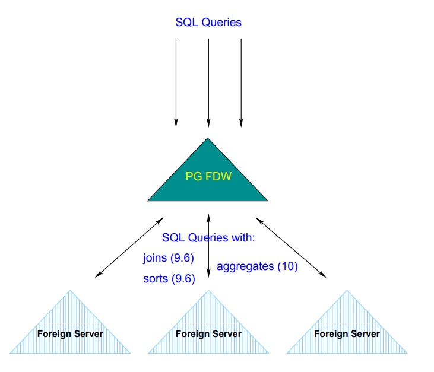
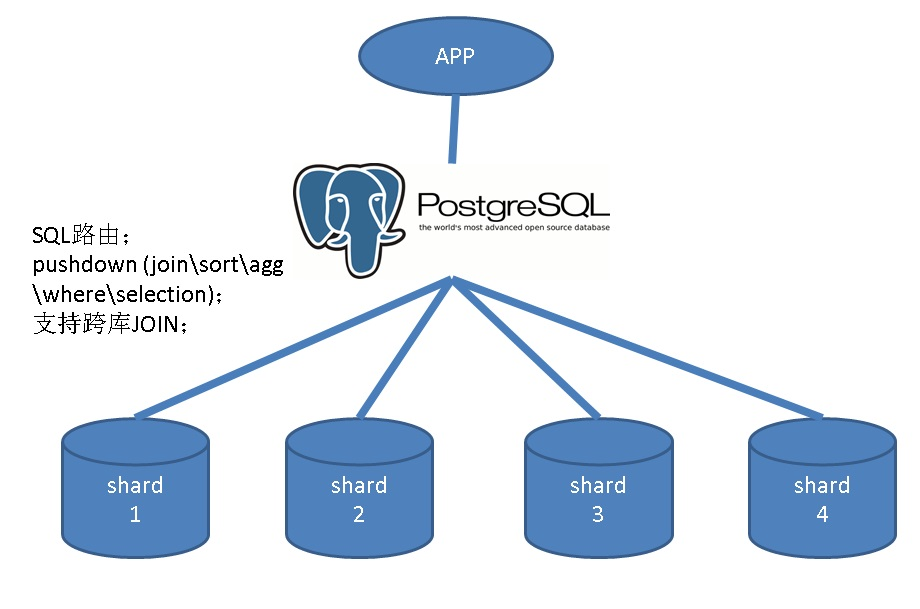
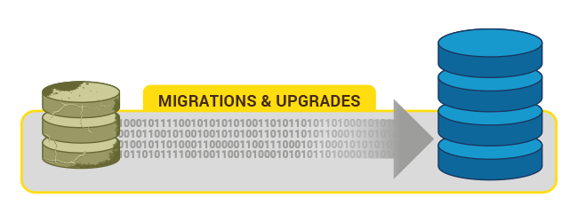
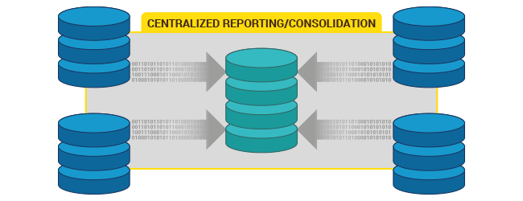
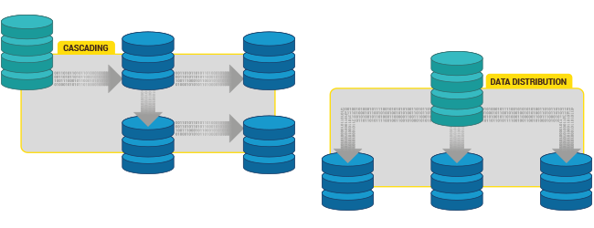
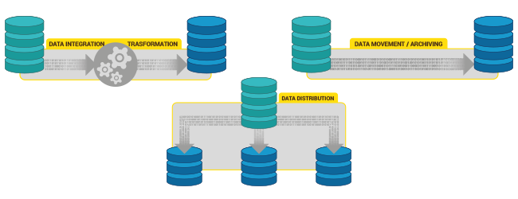

## 最受开发者欢迎的HTAP数据库PostgreSQL 10特性  
                               
### 作者              
digoal              
              
### 日期               
2017-10-29              
                
### 标签              
PostgreSQL , 10 , 特性 , 开发者     
                          
----                          
                           
## 背景   
作为一款HTAP数据库（同时支持 "OLTP高并发在线事务处理" 与 "OLAP在线分析" 业务场景），PostgreSQL 10的哪些特性是开发人员、DBA、架构师都喜欢的呢？  
  
## 多核并行增强  
9.6的版本支持如下并行：  
  
```  
Sequential scans  
Aggregates  
Hash and loop joins  
```  
  
10 并行增强：  
  
```  
1、通过 max_parallel_workers 控制最大并行度，  
  
可以避免分析型SQL把资源全部耗光。从而支持HTAP混合型业务。  
  
2、新增的并行索引扫描  
  
Regular index scans (btree)  
  
Index Only scans (btree)  
  
Bitmap Heap Scan  
  
Index still scanned serially  
  
3、并行的合并JOIN  
  
Merge joins  
  
4、多表扫描(append scan)支持并行排序  
  
Merge Sort  
```  
  
## fdw 聚合下推  
FDW聚合下推，使得PostgreSQL 10可以作为一个任意数据库的sharding管理节点，用于分发路由SQL，支持where, sort, join, select-clause, agg等下推。  
  
  
  
  
  
## 逻辑订阅  
逻辑订阅有很多用途:  
  
1、迁移、大版本升级  
  
  
  
2、数仓聚合  
  
  
  
3、拆库  
  
  
  
4、多个业务系统共享、分发数据  
  
  
  
5、多master架构  
  
## 分区  
内置的分区功能，不需要依赖插件。  
  
[《PostgreSQL 10 内置分区 vs pg_pathman perf profiling》](../201710/20171015_01.md)    
  
[《PostgreSQL 10.0 preview 功能增强 - 内置分区表》](../201612/20161215_01.md)    
  
## libpq支持failover和load balance  
libpq支持配置多个连接地址，同时支持failover和负载均衡。  
  
[《PostgreSQL 10.0 preview 功能增强 - libpq支持多主机连接(failover,LB)让数据库HA和应用配合更紧密》](../201704/20170420_01.md)    
  
## 事务状态可查询  
用户可以根据事务号，查询事务的状态。实现业务层的控制，包括闪回等功能。  
  
[《PostgreSQL flashback(闪回) 功能实现与介绍》](../201710/20171010_01.md)    
  
[《PostgreSQL 10.0 preview 功能增强 - 更强可靠性, 过去式事务状态可查（杜绝unknown事务）》](../201704/20170420_06.md)    
  
## 任意多副本同步 - 金融级可靠性  
用户可以根据事务的重要性，选择需要落几个副本(WAL)，从而实现多副本持久化。  
  
[《PG多节点(quorum based), 0丢失 HA(failover,switchover)方案》](../201706/20170612_02.md)    
  
## 自定义多列混合统计信息  
[《PostgreSQL 10 黑科技 - 自定义统计信息》](../201709/20170902_02.md)    
  
统计信息可以用于评估SQL的执行成本、查看数据分布、估算唯一值、估算记录数、查看数据存储的相关性 等。默认情况下，数据库的柱状图是单列的，当输入多列条件时，使用多列统计信息，可以估算更加精确的成本。实现更精准的执行计划。  
  
## hash index增强(持久化、性能)  
PostgreSQL 10 hash index支持持久化（写WAL），同时在vacuum, 查询性能等方面都有巨大的优化。如果是等值查询，或者超长列，使用hash index可以获得比btree更好的性能。  
  
## 重命名枚举值  
是的，枚举值可以rename了。  
  
## JSON,JSONB全文检索  
JSON, JSONB类型，支持全文检索。  
  
The functions ts_headline() and to_tsvector() can now be used on these data types.  
  
## file_fdw支持命令行返回值作为源  
file_fdw是一个文件外部表接口，用于将文件作为外部表数据源来使用，现在，file_fdw支持command的输出结果作为外部表的输入源了。  
  
```  
CREATE FOREIGN TABLE  
test(a int, b text)  
SERVER csv  
OPTIONS (program 'gunzip -c /tmp/data.csv.gz');  
```  
  
## 不依赖OS层的通用全球化支持 - ICU库  
编译时，使用ICU  
  
--with-icu  
Build with support for the ICU library.   
This requires the ICU4C package to be installed.   
The minimum required version of ICU4C is currently 4.2.  
  
By default, pkg-config will be used to find the required compilation options.   
This is supported for ICU4C version 4.6 and later.   
For older versions, or if pkg-config is not available,   
the variables ICU_CFLAGS and ICU_LIBS can be specified to configure, like in this example:  
  
./configure ... --with-icu ICU_CFLAGS='-I/some/where/include' ICU_LIBS='-L/some/where/lib -licui18n -licuuc -licudata'  
  
(If ICU4C is in the default search path for the compiler,   
then you still need to specify a nonempty string in order to avoid use of pkg-config,   
for example, ICU_CFLAGS=' '.)  
  
例子  
  
```  
SELECT * FROM t ORDER BY a COLLATE "sv-SE-x-icu";  
valle  
vera  
walle  
wera  
  
SELECT * FROM t ORDER BY a COLLATE "sv-SE-u-co-standard-x-icu";  
valle  
walle  
vera  
wera  
```  
  
## scram-sha-256 安全认证  
[《PostgreSQL 10.0 preview 安全增强 - SASL认证方法 之 scram-sha-256 安全认证机制》](../201703/20170309_01.md)    
  
## 监控角色  
新增了一些内置的监控角色，不需要使用SUPERUSER，只要给了这些角色，就可以获得读一些系统表的权限，或者获得杀会话的权限。  
  
便于管理，提高了安全性。  
  
```  
postgres=# select * from pg_roles ;  
       rolname        | rolsuper | rolinherit | rolcreaterole | rolcreatedb | rolcanlogin | rolreplication | rolconnlimit | rolpassword | rolvaliduntil | rolbypassrls | rolconfig |  oid    
----------------------+----------+------------+---------------+-------------+-------------+----------------+--------------+-------------+---------------+--------------+-----------+-------  
 pg_signal_backend    | f        | t          | f             | f           | f           | f              |           -1 | ********    |               | f            |           |  4200  
 pg_read_all_stats    | f        | t          | f             | f           | f           | f              |           -1 | ********    |               | f            |           |  3375  
 pg_monitor           | f        | t          | f             | f           | f           | f              |           -1 | ********    |               | f            |           |  3373  
 pg_read_all_settings | f        | t          | f             | f           | f           | f              |           -1 | ********    |               | f            |           |  3374  
 pg_stat_scan_tables  | f        | t          | f             | f           | f           | f              |           -1 | ********    |               | f            |           |  3377  
```  
  
## 动态视图增强 - 添加系统进程的状态监控  
  
```  
postgres=# select pid,backend_type,wait_event_type,wait_event from pg_stat_activity ;  
  pid  |    backend_type     | wait_event_type |     wait_event        
-------+---------------------+-----------------+---------------------  
  2077 | background worker   | Activity        | LogicalLauncherMain  
  2074 | autovacuum launcher | Activity        | AutoVacuumMain  
 15397 | client backend      |                 |   
  2072 | background writer   | Activity        | BgWriterMain  
  2071 | checkpointer        | Activity        | CheckpointerMain  
  2073 | walwriter           | Activity        | WalWriterMain  
(6 rows)  
```  
  
## 等待事件  
https://www.postgresql.org/docs/10/static/monitoring-stats.html#monitoring-stats-views  
  
新增了一些等待事件。  
  
```  
Latches  
Extensions  
Client/socket  
Timeout  
...  
  
I/O events  
Reads  
Writes  
Individually identified  
```  
  
## IDENTITY列  
实际上就是自增列，兼容SQL Server。PG原有的serial, default sequence都可以实现类似的功能。  
  
[《PostgreSQL 10 新特性 - identity column (serial, 自增)》](../201710/20171029_02.md)    
  
## XMLTABLE  
https://www.postgresql.org/docs/current/static/functions-xml.html#functions-xml-processing-xmltable  
  
xml的支持更加强大了。xmltable可以将XML解析为一张表输出。  
  
  
```  
CREATE TABLE xmldata AS SELECT  
xml $$  
<ROWS>  
  <ROW id="1">  
    <COUNTRY_ID>AU</COUNTRY_ID>  
    <COUNTRY_NAME>Australia</COUNTRY_NAME>  
  </ROW>  
  <ROW id="5">  
    <COUNTRY_ID>JP</COUNTRY_ID>  
    <COUNTRY_NAME>Japan</COUNTRY_NAME>  
    <PREMIER_NAME>Shinzo Abe</PREMIER_NAME>  
    <SIZE unit="sq_mi">145935</SIZE>  
  </ROW>  
  <ROW id="6">  
    <COUNTRY_ID>SG</COUNTRY_ID>  
    <COUNTRY_NAME>Singapore</COUNTRY_NAME>  
    <SIZE unit="sq_km">697</SIZE>  
  </ROW>  
</ROWS>  
$$ AS data;  
  
SELECT xmltable.*  
  FROM xmldata,  
       XMLTABLE('//ROWS/ROW'  
                PASSING data  
                COLUMNS id int PATH '@id',  
                        ordinality FOR ORDINALITY,  
                        "COUNTRY_NAME" text,  
                        country_id text PATH 'COUNTRY_ID',  
                        size_sq_km float PATH 'SIZE[@unit = "sq_km"]',  
                        size_other text PATH  
                             'concat(SIZE[@unit!="sq_km"], " ", SIZE[@unit!="sq_km"]/@unit)',  
                        premier_name text PATH 'PREMIER_NAME' DEFAULT 'not specified') ;  
  
 id | ordinality | COUNTRY_NAME | country_id | size_sq_km |  size_other  | premier_name    
----+------------+--------------+------------+------------+--------------+---------------  
  1 |          1 | Australia    | AU         |            |              | not specified  
  5 |          2 | Japan        | JP         |            | 145935 sq_mi | Shinzo Abe  
  6 |          3 | Singapore    | SG         |        697 |              | not specified  
```  
  
## 流式物理备库支持snapshot  
备库支持快照，意味着可以在备库创建一致性的并行任务，比如pg_dump在备库可以支持并行备份。  
  
  
## 排序性能优化  
  
## 语句级触发器支持transition tables  
支持transition tables，在AFTER语句级触发器中，通过这个transition tables，可以得到语句中触及的所有行。  
  
方便批处理，提高性能。  
  
```  
 AFTER trigger transition tables  
```  
  
[《PostgreSQL 10.0 preview 功能增强 - 触发器函数内置中间表》](../201704/20170401_01.md)    
  
## 参考  
1、PostgreSQL 特性全矩阵  
  
https://www.postgresql.org/about/featurematrix/  
  
2、PostgreSQL 特性矩阵  
  
http://www.cybertec.at/best-of-postgresql-10-for-the-developer/  
  
3、[《PostgreSQL 10 解读》](../201705/20170509_01.md)    
  
4、[Major Features: Postgres 10](20171029_01_pdf_001.pdf)  
  
5、[A look at the Elephants Trunk - PostgreSQL 10](20171029_01_pdf_002.pdf)  
  
6、[PostgreSQL 10 New Features With Examples](20171029_01_pdf_003.pdf)  
  
7、https://www.postgresql.org/about/press/presskit10/  
  
8、https://wiki.postgresql.org/wiki/New_in_postgres_10  
  
<a rel="nofollow" href="http://info.flagcounter.com/h9V1"  ></a>  
  
  
  
  
  
  
## [digoal's 大量PostgreSQL文章入口](https://github.com/digoal/blog/blob/master/README.md "22709685feb7cab07d30f30387f0a9ae")
  
