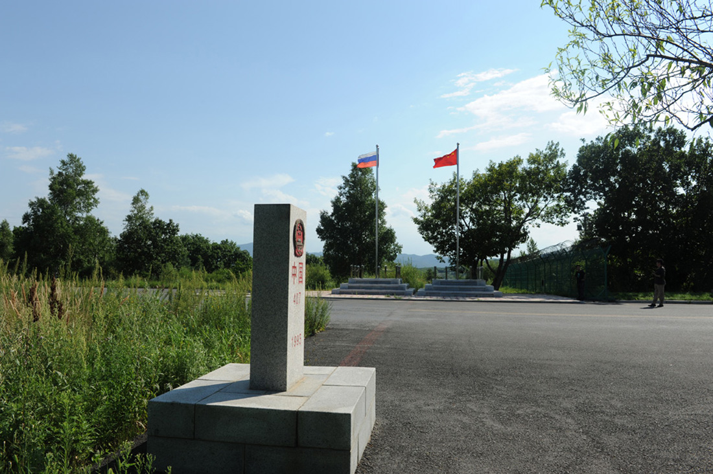

## PostgreSQL 电子围栏的应用场景和性能(大疆、共享设备、菜鸟。。。)    
                           
### 作者          
digoal          
          
### 日期           
2017-10-31          
            
### 标签          
PostgreSQL , 电子围栏 , 共享自行车 , 共享充电宝 , 共享xxx , 菜鸟 , 航空管制 , 无人飞行器 , pipelinedb , 流式计算           
                      
----                      
                       
## 背景          
电子围栏，这个在GIS应用中非常常见的词。在很多业务场景中都可以使用：    
    
电子围栏的常见手段是圈出一块，或者一些多边形。当被监控对象在多边形内或者多边形外时（根据业务模型），作为一个判断条件，触发一些业务规则。    
    
1、禁飞区    
    
玩大疆无人机的话，你一定要知道哪里是禁飞区，否则可能违法被抓，但是你可能并不知道哪里是禁飞区，还有飞行高度的限制。    
    
有了电子围栏，可以在飞行器内置这样的功能，你就可以放心的飞了。比如到达了禁飞区后，飞行器可以发出告警，禁止飞行。    
    
    
    
2、共享单车还车点    
    
共享单车乱摆放是个问题，原因是什么地方都能还车。使用电子围栏，可以约束用户的还车点，只允许用户将自行车停在某个空间内，或不在某个空间内才能还车。    
    
    
    
3、汽车禁行区    
    
例如，某些汽车，在某个时间段不允许出现在某个区域内。    
    
例如限行车辆，例如危化品车辆、黄沙车、货车等的行驶范围。以往，我们只能靠摄像头、或者靠警力来管理。加入电子围栏，一切都变得更简单。    
    
    
    
4、国界线    
    
这个是有非常鲜明的地理属性的，电子围栏，结合流式计算，可以非常实时的发现异常。    
    
    
    
5、山头线    
    
我记得小时候，我们那里的班车线路都是承包的，谁要是敢乱拉客，车子可能是会被砸掉的。实际上这个也是一些商业边界的问题，如果商业边界涉及到地理信息，通过电子围栏，可以更加方便的实现边界控制和管理。    
    
    
6、远程打卡，当你进入了办公区域附近（电子围栏）时，才允许打卡。     
    
7、远程办公管理，公司可以划定一些可以办公的常用地的多边形，当员工出了这个区域时，触发事件。     
    
8、公务用车、商用车辆的行驶区域管理，出了区域，可以触发事件。  
  
9、放牧管理，例如在大草原放养的动物，可以挂上GPS跟踪器，划定电子围栏，出了区域，触发事件。  
  
10、假释人员的管理，不在需要投入大量警力跟踪假释人员。当然人的管理更加复杂，因为跟踪器可能更换。  
  
11、... ...  
    
试想一下，当每个对象都带上空间属性后，还有很多很多很多场景，可以设置电子围栏。    
    
空间数据的处理，将会是一片巨大的蓝海。    
  
围栏除了空间属性，还可以有其他属性，PostgreSQL提供了btree_gist接口，可以对空间、标量字段建立联合索引，提高性能。  
  
https://www.postgresql.org/docs/10/static/btree-gist.html  
  
同时PostgreSQL还支持空间独立排他约束，可以防止围栏重叠。  
  
https://www.postgresql.org/docs/10/static/ddl-constraints.html#ddl-constraints-exclusion  
    
PostgreSQL 深耕空间数据管理数十年，一定能服务好这片业务，一起来为人类发展做出贡献。   
    
## 电子围栏性能    
    
电子围栏中，最常用的手段是点面判断，对于共享单车业务，我们为了防止自行车乱停放，可以圈定可以换车、或者不能换车的点（视业务需求），创建很多的多边形区域，当用户还车时，上报车辆位置，同时判断是不是落在可以换车的点，或者不能换车的点内。决定用户是否可以在当地还车。    
    
可能有千万、甚至更多的多边形面。    
    
这个需求和菜鸟的配送调度类似，也有点面判断的需求，下面是一个设计和性能测试    
    
[《菜鸟末端轨迹 - 电子围栏(解密支撑每天251亿个包裹的数据库) - 阿里云RDS PostgreSQL最佳实践》](../201708/20170803_01.md)      
    
1000万个多边形，根据位置查询这个位置在哪个面里面，或者有没有面包含了这个点。    
    
PostgreSQL单机可以达到```251亿次/天```的点面判断请求的性能。    
    
    
     
  
<a rel="nofollow" href="http://info.flagcounter.com/h9V1"  ></a>  
  
  
  
  
  
  
## [digoal's 大量PostgreSQL文章入口](https://github.com/digoal/blog/blob/master/README.md "22709685feb7cab07d30f30387f0a9ae")
  
