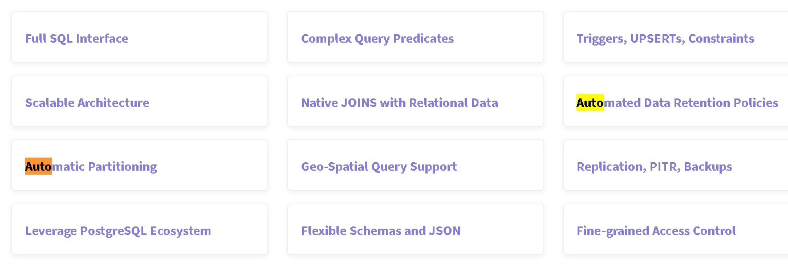
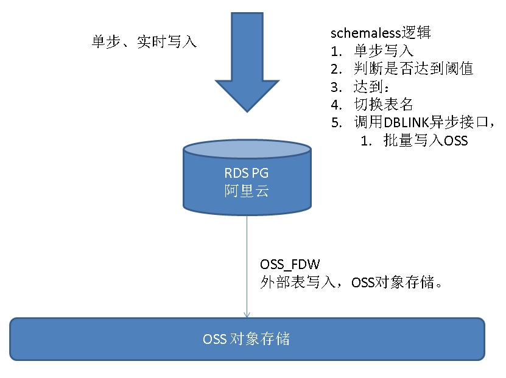

## PostgreSQL 按需切片的实现(TimescaleDB插件自动切片功能的plpgsql schemaless实现)    
                           
### 作者          
digoal          
          
### 日期           
2017-11-02         
            
### 标签          
PostgreSQL , schemaless , 自动切片 , track_count , 计数器 , udf , plpgsql , timescaledb        
                      
----                      
                       
## 背景          
TimescaleDB是PostgreSQL的一款时序数据库插件，其中自动切片是一个非常深入人心的功能。    
    
http://www.timescale.com/    
    
    
    
实际上PostgreSQL plpgsql也可以实现类似的功能，当然，前提是需要使用schemaless的模式。    
    
schemaless的设计思路和应用举例：    
    
[《PostgreSQL 在铁老大订单系统中的schemaless设计和性能压测》](201709/20170927_03.md)      
    
[《PostgreSQL schemaless 的实现(类mongodb collection)》](201705/20170511_01.md)      
    
[《PostgreSQL 时序最佳实践 - 证券交易系统数据库设计 - 阿里云RDS PostgreSQL最佳实践》](201704/20170417_01.md)      
    
下面，就自动切片这个功能，我们看看schemaless的实现例子。    
    
1、首先要监测写入量，通过track_counts参数，可以给数据的写入计数（默认track_counts参数是开启的）。    
    
[《PostgreSQL pg_stat_reset清除track_counts的隐患》](../201711/20171101_01.md)      
    
```    
postgres=# select * from pg_stat_all_tables where relname='test1';    
-[ RECORD 1 ]-------+-------    
relid               | 31129    
schemaname          | public    
relname             | test1    
seq_scan            | 0    
seq_tup_read        | 0    
idx_scan            |     
idx_tup_fetch       |     
n_tup_ins           | 1000    
n_tup_upd           | 0    
n_tup_del           | 0    
n_tup_hot_upd       | 0    
n_live_tup          | 1000    
n_dead_tup          | 0    
n_mod_since_analyze | 1000    
last_vacuum         |     
last_autovacuum     |     
last_analyze        |     
last_autoanalyze    |     
vacuum_count        | 0    
autovacuum_count    | 0    
analyze_count       | 0    
autoanalyze_count   | 0    
```    
    
2、当数据写入到一定量时，自动写下一张表。    
    
## schemaless自动切片例子    
1、设计：    
    
写入时，通过UDF写入，并且实时监控每种数据流的写入速度，并动态做数据分片。    
    
    
2、测试表：    
    
```    
create table log(id int, info text, crt_time timestamp default now());    
create index idx_log_crt_time on log(crt_time);    
create table log_tmp (like log including all) inherits(log);    
```    
    
3、分片规则：    
    
当记录数超过100000时，自动切换分区。    
    
    
4、UDF定义：    
    
```    
create or replace function f(v_id int, v_info text) returns void as $$    
declare    
  suffix int;    
  v_rows int8;    
  min_time timestamp;    
  max_time timestamp;    
begin    
  -- 插入    
  insert into log_tmp(id,info) values (v_id, v_info);    
      
  -- 判断记录数是否达到切换阈值    
  select n_live_tup into v_rows from pg_stat_all_tables where relname='log_tmp' and schemaname='public';    
      
  -- 达到阈值，切换表    
  if v_rows >=100000 then    
    select count(*) into suffix from pg_inherits where inhparent='log'::regclass;    
    select min(crt_time), max(crt_time) into min_time, max_time from log_tmp ;    
    execute 'alter table log_tmp add constraint ck_log_'||suffix||'_1 check (crt_time>='''||min_time||''' and crt_time<='''||max_time||''')';    
    execute 'alter table log_tmp rename to log_'||suffix;    
    create table log_tmp (like log including all) inherits(log);    
  end if;    
      
  return;    
  exception when others then    
    return;    
end;    
$$ language plpgsql strict;    
```    
    
5、压测    
    
```    
vi test.sql    
    
select f(1, 'test');    
```    
    
```    
pgbench -M prepared -n -r -P 1 -f ./test.sql -c 64 -j 64 -T 120    
    
    
NOTICE:  merging column "id" with inherited definition    
NOTICE:  merging column "info" with inherited definition    
NOTICE:  merging column "crt_time" with inherited definition    
progress: 1.0 s, 25350.5 tps, lat 2.487 ms stddev 0.986    
progress: 2.0 s, 26309.0 tps, lat 2.432 ms stddev 0.688    
progress: 3.0 s, 26251.9 tps, lat 2.438 ms stddev 0.741    
progress: 4.0 s, 26451.0 tps, lat 2.420 ms stddev 0.737    
NOTICE:  merging column "id" with inherited definition    
NOTICE:  merging column "info" with inherited definition    
NOTICE:  merging column "crt_time" with inherited definition    
progress: 5.0 s, 29471.0 tps, lat 2.172 ms stddev 0.844    
progress: 6.0 s, 32971.0 tps, lat 1.941 ms stddev 0.670    
progress: 7.0 s, 33028.0 tps, lat 1.938 ms stddev 0.661    
progress: 8.0 s, 33101.0 tps, lat 1.933 ms stddev 0.656    
NOTICE:  merging column "id" with inherited definition    
NOTICE:  merging column "info" with inherited definition    
NOTICE:  merging column "crt_time" with inherited definition    
progress: 9.0 s, 32805.0 tps, lat 1.951 ms stddev 0.752    
    
......    
```    
    
自动切片成功：    
    
```    
postgres=# \d log_1    
                          Table "public.log_1"    
  Column  |            Type             | Collation | Nullable | Default     
----------+-----------------------------+-----------+----------+---------    
 id       | integer                     |           |          |     
 info     | text                        |           |          |     
 crt_time | timestamp without time zone |           |          | now()    
Indexes:    
    "log_tmp_crt_time_idx" btree (crt_time)    
Check constraints:    
    "ck_log_1_1" CHECK (crt_time >= '2017-11-02 23:52:34.264264'::timestamp without time zone AND crt_time <= '2017-11-02 23:54:05.939958'::timestamp without time zone)    
Inherits: log    
    
postgres=# \d log_2    
                          Table "public.log_2"    
  Column  |            Type             | Collation | Nullable | Default     
----------+-----------------------------+-----------+----------+---------    
 id       | integer                     |           |          |     
 info     | text                        |           |          |     
 crt_time | timestamp without time zone |           |          | now()    
Indexes:    
    "log_tmp_crt_time_idx1" btree (crt_time)    
Check constraints:    
    "ck_log_2_1" CHECK (crt_time >= '2017-11-02 23:54:05.948796'::timestamp without time zone AND crt_time <= '2017-11-02 23:54:10.946987'::timestamp without time zone)    
Inherits: log    
```    
      
## 小结  
timescaleDB插件还有很多其他的功能，在使用方便也更加的边界，待TimescaleDB插件成熟，还是推荐使用TimescaleDB。  
  
对于阿里云RDS PG，使用本文提到的方法，还可以实现实时写入RDS PG，同时根据设置的阈值，批量写入OSS外部表（写OSS外部表可以使用DBLINK的异步接口）。   
  
[《阿里云RDS PostgreSQL OSS 外部表 - (dblink异步调用封装)并行写提速案例》](../201709/20170906_01.md)    
  
  
  
  
<a rel="nofollow" href="http://info.flagcounter.com/h9V1"  ></a>  
  
  
  
  
  
  
## [digoal's 大量PostgreSQL文章入口](https://github.com/digoal/blog/blob/master/README.md "22709685feb7cab07d30f30387f0a9ae")
  
