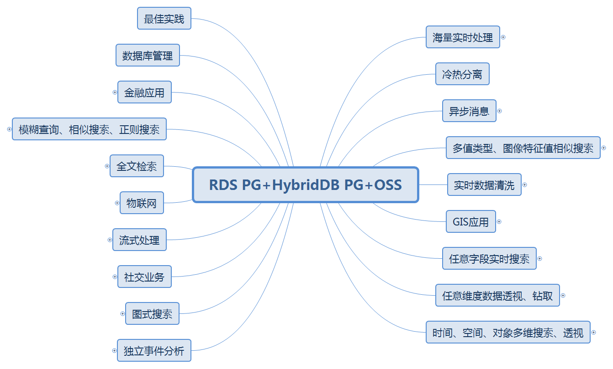

## HTAP数据库 PostgreSQL 场景与性能测试之 5 - (OLTP) 空间应用 - 空间包含查询(表内多边形 包含 输入空间对象)         
                                     
### 作者                    
digoal                    
                    
### 日期                     
2017-11-07                    
                      
### 标签                    
PostgreSQL , HTAP , OLTP , OLAP , 场景与性能测试              
                                
----                                
                                 
## 背景                  
PostgreSQL是一个历史悠久的数据库，历史可以追溯到1973年，最早由2014计算机图灵奖得主，关系数据库的鼻祖[Michael_Stonebraker](https://en.wikipedia.org/wiki/Michael_Stonebraker) 操刀设计，PostgreSQL具备与Oracle类似的功能、性能、架构以及稳定性。            
            
              
            
PostgreSQL社区的贡献者众多，来自全球各个行业，历经数年，PostgreSQL 每年发布一个大版本，以持久的生命力和稳定性著称。            
            
2017年10月，PostgreSQL 推出10 版本，携带诸多惊天特性，目标是胜任OLAP和OLTP的HTAP混合场景的需求：            
            
[《最受开发者欢迎的HTAP数据库PostgreSQL 10特性》](../201710/20171029_01.md)            
            
1、多核并行增强            
            
2、fdw 聚合下推            
            
3、逻辑订阅            
             
4、分区            
            
5、金融级多副本            
            
6、json、jsonb全文检索            
            
7、还有插件化形式存在的特性，如 **向量计算、JIT、SQL图计算、SQL流计算、分布式并行计算、时序处理、基因测序、化学分析、图像分析** 等。            
            
              
            
在各种应用场景中都可以看到PostgreSQL的应用：            
            
              
            
PostgreSQL近年来的发展非常迅猛，从知名数据库评测网站dbranking的数据库评分趋势，可以看到PostgreSQL向上发展的趋势：            
            
            
            
从每年PostgreSQL中国召开的社区会议，也能看到同样的趋势，参与的公司越来越多，分享的公司越来越多，分享的主题越来越丰富，横跨了 **传统企业、互联网、医疗、金融、国企、物流、电商、社交、车联网、共享XX、云、游戏、公共交通、航空、铁路、军工、培训、咨询服务等** 行业。            
            
接下来的一系列文章，将给大家介绍PostgreSQL的各种应用场景以及对应的性能指标。            
            
## 环境            
环境部署方法参考：            
            
[《PostgreSQL 10 + PostGIS + Sharding(pg_pathman) + MySQL(fdw外部表) on ECS 部署指南(适合新用户)》](../201710/20171018_01.md)              
            
阿里云 ECS：```56核，224G，1.5TB*2 SSD云盘```。            
            
操作系统：```CentOS 7.4 x64```            
            
数据库版本：```PostgreSQL 10```            
            
PS：**ECS的CPU和IO性能相比物理机会打一定的折扣，可以按下降1倍性能来估算。跑物理主机可以按这里测试的性能乘以2来估算。**              
            
## 场景 - 空间应用 - 空间包含查询 (OLTP)            
            
### 1、背景            
            
基于空间的应用，空间包含，点面判断等。例如电子围栏、菜鸟AOI（调度）、等业务。    
            
### 2、设计            
            
1张多边形表，1亿个多边形，多边形无相交。    
    
输入一个随机的点，判断这个点被1亿个多边形中的哪些多边形包含。    
            
### 3、准备测试表            
            
```    
create table t_polygon (    
  id int primary key,    
  po box    
);    
```    
            
### 4、准备测试函数(可选)            
            
### 5、准备测试数据            
            
```    
with a as (select id, (random()*10000)::int x, (random()*10000)::int y from generate_series(1,100000000) t(id))     
  insert into t_polygon select id, box(point(x,y), point(x+1,y+1)) from a;    
    
create index idx_t_polygon_po on t_polygon using gist(po);    
```        
            
### 6、准备测试脚本            
            
```    
vi test.sql    
    
\set x random(1,10000)    
\set y random(1,10000)    
select * from t_polygon where po @> box(point(:x-0.5, :y-0.5), point(:x-0.5, :y-0.5));    
```    
            
### 7、测试            
            
```    
CONNECTS=112    
TIMES=300    
export PGHOST=$PGDATA    
export PGPORT=1999    
export PGUSER=postgres    
export PGPASSWORD=postgres    
export PGDATABASE=postgres    
    
pgbench -M prepared -n -r -f ./test.sql -P 5 -c $CONNECTS -j $CONNECTS -T $TIMES    
```         
            
### 8、测试结果            
            
```     
transaction type: ./test.sql    
scaling factor: 1    
query mode: prepared    
number of clients: 112    
number of threads: 112    
duration: 300 s    
number of transactions actually processed: 83609101    
latency average = 0.402 ms    
latency stddev = 0.532 ms    
tps = 278634.745397 (including connections establishing)    
tps = 278708.337831 (excluding connections establishing)    
script statistics:    
 - statement latencies in milliseconds:    
         0.002  \set x random(1,10000)    
         0.001  \set y random(1,10000)    
         0.404  select * from t_polygon where po @> box(point(:x-0.5, :y-0.5), point(:x-0.5, :y-0.5));    
```       
            
#### TPS： 278708     
            
#### 平均响应时间： 0.402 毫秒       
  
## 附加阿里云rds pg 12 ganos时空插件测试  
```  
create extension postgis;  
```  
  
```  
create or replace function gen_rand_polygon(int, numeric) returns geometry as $$  
declare  
  poi text[];  
  centx int := random()*180;  
  centy int := random()*90;  
  lins text := 'LINESTRING(';  
begin  
  for i in 1..$1 loop  
    poi[i] := (centx + $2/2 - $2*random()) || ' ' || (centy + $2/2 - $2*random());  
    lins := lins || poi[i] || ',';  
  end loop;  
  lins := lins || poi[1] || ')';  
  
  return ST_MakePolygon( ST_GeomFromText(lins) )    ;  
end;  
$$ language plpgsql strict;  
```  
  
```  
create table tbl_test(id int, pol geometry);  
  
insert into tbl_test select generate_series(1,1000000), gen_rand_polygon(4,10);  
  
create index idx_tbl_test_1 on tbl_test using gist (pol);  
```  
  
```  
 public     | ~    | geometry      | geometry       | boolean     | geometry_contains  |   
```  
  
```  
postgres=> select id, st_astext(pol) from tbl_test where pol ~ st_makepoint(181,79) ;  
   id   |                                                                                      st_astext                                                                                         
--------+--------------------------------------------------------------------------------------------------------------------------------------------------------------------------------------  
    809 | POLYGON((173.981318756819 76.1433095017048,181.880011477551 79.2965570127631,179.733635598102 79.2344922940235,180.079200532605 79.8128156041273,173.981318756819 76.1433095017048))  
   1596 | POLYGON((177.534500054316 75.2052377411576,173.431976396909 76.4620903894808,178.728541925145 81.0494423557411,181.443036609431 78.5226852596945,177.534500054316 75.2052377411576))  
   2320 | POLYGON((183.585093032641 76.5456841398134,179.424858547545 82.6569004922782,182.824920343329 75.2135975815013,182.457703705119 76.0376985660097,183.585093032641 76.5456841398134))  
   5354 | POLYGON((181.369811367263 72.9634159883867,180.27168961091 77.350339906022,174.635372912278 75.5424392519923,181.795884764303 80.8985258005624,181.369811367263 72.9634159883867))  
   5739 | POLYGON((180.435005252492 78.9855347777907,174.855806009029 81.2523424172056,181.021755206101 72.5342485017059,182.315383706996 76.8943360584275,180.435005252492 78.9855347777907))  
   6958 | POLYGON((182.241418261091 74.2273580135526,181.489052950303 72.2256857252517,178.66045540824 79.2359716372697,180.89246706568 73.2151605190323,182.241418261091 74.2273580135526))  
   7319 | POLYGON((176.020777915039 83.3037490954554,181.783075966202 74.5073379283332,178.372371794282 80.2280471611317,180.480210887277 82.5971720499591,176.020777915039 83.3037490954554))  
......     
```  
  
```  
postgres=> explain (analyze,verbose,timing,costs,buffers) select id, st_astext(pol) from tbl_test where pol ~ st_makepoint(181,79) limit 5;  
                                                                 QUERY PLAN                                                                    
---------------------------------------------------------------------------------------------------------------------------------------------  
 Limit  (cost=0.29..15.16 rows=5 width=36) (actual time=0.115..0.163 rows=5 loops=1)  
   Output: id, (st_astext(pol))  
   Buffers: shared hit=9  
   ->  Index Scan using idx_tbl_test_1 on public.tbl_test  (cost=0.29..2975.19 rows=1000 width=36) (actual time=0.114..0.161 rows=5 loops=1)  
         Output: id, st_astext(pol)  
         Index Cond: (tbl_test.pol ~ '01010000000000000000A066400000000000C05340'::geometry)  
         Buffers: shared hit=9  
 Planning Time: 0.069 ms  
 Execution Time: 0.181 ms  
(9 rows)  
```  
  
  
```  
vi test.sql  
\set x random(1,180)  
\set y random(1,90)  
select id, st_astext(pol) from tbl_test where pol ~ st_makepoint(:x,:y) limit 5;  
```  
  
  
2核 pg 12测试  
  
```  
pgbench -M prepared -n -r -P 1 -f ./test.sql -c 4 -j 4 -T 120  
progress: 1.0 s, 6207.7 tps, lat 0.639 ms stddev 4.859  
progress: 2.0 s, 7941.9 tps, lat 0.503 ms stddev 0.104  
progress: 3.0 s, 7981.4 tps, lat 0.501 ms stddev 0.101  
```  
            
## 参考            
[《PostgreSQL、Greenplum 应用案例宝典《如来神掌》 - 目录》](../201706/20170601_02.md)              
            
[《数据库选型之 - 大象十八摸 - 致 架构师、开发者》](../201702/20170209_01.md)              
            
[《PostgreSQL 使用 pgbench 测试 sysbench 相关case》](../201610/20161031_02.md)              
            
[《数据库界的华山论剑 tpc.org》](../201701/20170125_01.md)              
              
https://www.postgresql.org/docs/10/static/pgbench.html              
              
    
    
    
    
    
    
    
    
    
    
    
    
    
    
    
    
    
    
    
    
    
    
    
    
    
    
  
  
  
  
  
  
  
  
  
  
  
  
  
  
  
  
  
  
  
  
  
  
  
  
  
  
  
  
  
  
  
  
  
  
  
  
  
  
  
  
  
  
  
  
  
  
  
  
  
#### [PostgreSQL 许愿链接](https://github.com/digoal/blog/issues/76 "269ac3d1c492e938c0191101c7238216")
您的愿望将传达给PG kernel hacker、数据库厂商等, 帮助提高数据库产品质量和功能, 说不定下一个PG版本就有您提出的功能点. 针对非常好的提议，奖励限量版PG文化衫、纪念品、贴纸、PG热门书籍等，奖品丰富，快来许愿。[开不开森](https://github.com/digoal/blog/issues/76 "269ac3d1c492e938c0191101c7238216").  
  
  
#### [9.9元购买3个月阿里云RDS PostgreSQL实例](https://www.aliyun.com/database/postgresqlactivity "57258f76c37864c6e6d23383d05714ea")
  
  
#### [PostgreSQL 解决方案集合](https://yq.aliyun.com/topic/118 "40cff096e9ed7122c512b35d8561d9c8")
  
  
#### [德哥 / digoal's github - 公益是一辈子的事.](https://github.com/digoal/blog/blob/master/README.md "22709685feb7cab07d30f30387f0a9ae")
  
  

  
  
#### [PolarDB 学习图谱: 训练营、培训认证、在线互动实验、解决方案、生态合作、写心得拿奖品](https://www.aliyun.com/database/openpolardb/activity "8642f60e04ed0c814bf9cb9677976bd4")
  
  
#### [购买PolarDB云服务折扣活动进行中, 55元起](https://www.aliyun.com/activity/new/polardb-yunparter?userCode=bsb3t4al "e0495c413bedacabb75ff1e880be465a")
  
  
#### [About 德哥](https://github.com/digoal/blog/blob/master/me/readme.md "a37735981e7704886ffd590565582dd0")
  
