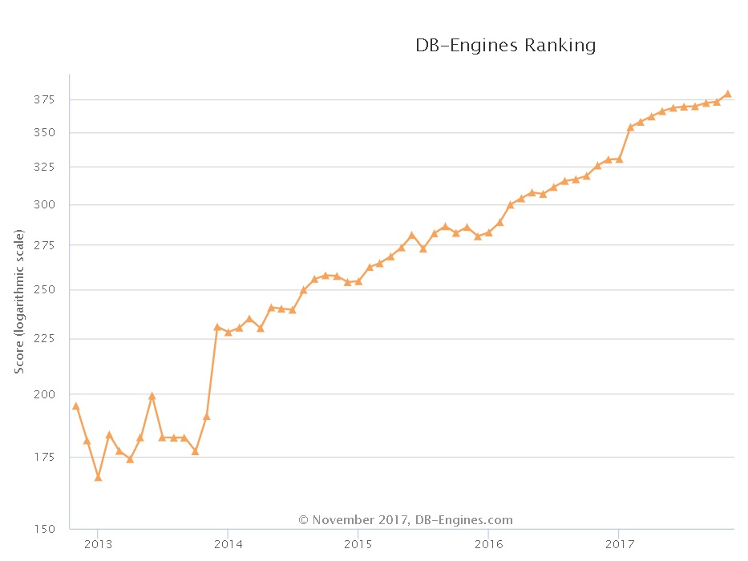

## HTAP数据库 PostgreSQL 场景与性能测试之 6 - (OLTP) 空间应用 - KNN查询（搜索附近对象，由近到远排序输出）         
                                       
### 作者                      
digoal                      
                      
### 日期                       
2017-11-07                      
                        
### 标签                      
PostgreSQL , HTAP , OLTP , OLAP , 场景与性能测试                
                                  
----                                  
                                   
## 背景                    
PostgreSQL是一个历史悠久的数据库，历史可以追溯到1973年，最早由2014计算机图灵奖得主，关系数据库的鼻祖[Michael_Stonebraker](https://en.wikipedia.org/wiki/Michael_Stonebraker) 操刀设计，PostgreSQL具备与Oracle类似的功能、性能、架构以及稳定性。              
              
                
              
PostgreSQL社区的贡献者众多，来自全球各个行业，历经数年，PostgreSQL 每年发布一个大版本，以持久的生命力和稳定性著称。              
              
2017年10月，PostgreSQL 推出10 版本，携带诸多惊天特性，目标是胜任OLAP和OLTP的HTAP混合场景的需求：              
              
[《最受开发者欢迎的HTAP数据库PostgreSQL 10特性》](../201710/20171029_01.md)              
              
1、多核并行增强              
              
2、fdw 聚合下推              
              
3、逻辑订阅              
               
4、分区              
              
5、金融级多副本              
              
6、json、jsonb全文检索              
              
7、还有插件化形式存在的特性，如 **向量计算、JIT、SQL图计算、SQL流计算、分布式并行计算、时序处理、基因测序、化学分析、图像分析** 等。              
              
                
              
在各种应用场景中都可以看到PostgreSQL的应用：              
              
                
              
PostgreSQL近年来的发展非常迅猛，从知名数据库评测网站dbranking的数据库评分趋势，可以看到PostgreSQL向上发展的趋势：              
              
              
              
从每年PostgreSQL中国召开的社区会议，也能看到同样的趋势，参与的公司越来越多，分享的公司越来越多，分享的主题越来越丰富，横跨了 **传统企业、互联网、医疗、金融、国企、物流、电商、社交、车联网、共享XX、云、游戏、公共交通、航空、铁路、军工、培训、咨询服务等** 行业。              
              
接下来的一系列文章，将给大家介绍PostgreSQL的各种应用场景以及对应的性能指标。              
              
## 环境              
环境部署方法参考：              
              
[《PostgreSQL 10 + PostGIS + Sharding(pg_pathman) + MySQL(fdw外部表) on ECS 部署指南(适合新用户)》](../201710/20171018_01.md)                
              
阿里云 ECS：```56核，224G，1.5TB*2 SSD云盘```。      
              
操作系统：```CentOS 7.4 x64```              
              
数据库版本：```PostgreSQL 10```              
              
PS：**ECS的CPU和IO性能相比物理机会打一定的折扣，可以按下降1倍性能来估算。跑物理主机可以按这里测试的性能乘以2来估算。**                
              
## 场景 - 空间应用 - KNN查询（搜索附近对象，由近到远排序输出） (OLTP)              
              
### 1、背景              
              
在社交业务、O2O业务、空间应用中，搜索附近的对象是非常常见的需求，例如：    
    
1、微信的摇一摇，    
    
2、探探的搜索附近的异性，    
    
3、导航软件中搜索附近的加油站、餐馆、酒店等。    
    
4、打车软件，搜索附近的出租车。    
    
5、公安系统，搜索某个多边形内的对象。    
    
6、团圆系统，搜索某个点附近的所有对象。    
    
我们生活的周围有非常多的应用都有附近搜索的需求。    
    
### 2、设计              
              
一张空间表，10亿个经纬点，输入一个随机点，搜索附近5公里的人，按近到远排序输出前1、100条。    
    
10亿个点已经可以包含非常丰富的信息，建筑物、用户、汽车、小区、商场、加油站。。。等。    
              
### 3、准备测试表       
              
```    
create extension postgis;    
    
create table t_pos(    
  id int primary key,    
  pos geometry    
);    
```    
              
### 4、准备测试函数(可选)              
     
```    
create or replace function ff(geometry, float8, int) returns setof record as $$                                                            
declare    
  v_rec record;    
  v_limit int := $3;    
begin    
  set local enable_seqscan=off;   -- 强制索引, 扫描行数够就退出.    
  for v_rec in     
    select *,     
    st_distancespheroid(pos, $1, 'SPHEROID["WGS84",6378137,298.257223563]') as dist     
    from t_pos     
    order by pos <-> $1    
  loop    
    if v_limit <=0 then    
      -- raise notice '已经取足数据';    
      return;    
    end if;    
    if v_rec.dist > $2 then    
      -- raise notice '满足条件的点已输出完毕';    
      return;    
    else    
      -- raise notice 'do someting, v_rec:%', v_rec;    
      return next v_rec;    
    end if;    
    v_limit := v_limit -1;    
  end loop;    
end;    
$$ language plpgsql strict volatile;    
```    
    
### 5、准备测试数据              
              
```    
insert into t_pos     
select * from (    
  select id,    
  ST_SetSRID(    
              ST_Point( round((random()*(135.085831-73.406586)+73.406586)::numeric,6),        
                        round((random()*(53.880950-3.408477)+3.408477)::numeric,6)        
              ),    
             4326    
            )  as pos    
from generate_series(1,1000000000) t(id)     
) t    
order by st_geohash(pos,15);    
    
create index idx_t_pos_1 on t_pos using gist(pos);    
```         
              
### 6、准备测试脚本              
1、指定任意一个点，由近到远返回5公里内的100个点。  
  
```    
vi test1.sql    
    
\set x random(73,135)    
\set y random(3,53)    
select * from ff(st_setsrid(st_makepoint(:x,:y),4326), 5000, 100) as t(id int, pos geometry, dist float8);    
```    
  
2、指定任意一个点，由近到远返回附近的100个点。  
  
```  
vi test2.sql  
  
\set x random(73,135)    
\set y random(3,53)   
select *, st_distancespheroid(pos, st_setsrid(st_makepoint(:x,:y),4326), 'SPHEROID["WGS84",6378137,298.257223563]') as dist from t_pos order by pos <-> st_setsrid(st_makepoint(:x,:y),4326) limit 100;  
```  
  
3、指定任意一个点，由近到远返回5公里内的1个点。  
  
```    
vi test3.sql    
    
\set x random(73,135)    
\set y random(3,53)    
select * from ff(st_setsrid(st_makepoint(:x,:y),4326), 5000, 1) as t(id int, pos geometry, dist float8);    
```    
  
4、指定任意一个点，由近到远返回附近的1个点。  
  
```  
vi test4.sql  
  
\set x random(73,135)    
\set y random(3,53)   
select *, st_distancespheroid(pos, st_setsrid(st_makepoint(:x,:y),4326), 'SPHEROID["WGS84",6378137,298.257223563]') as dist from t_pos order by pos <-> st_setsrid(st_makepoint(:x,:y),4326) limit 1;  
```  
              
### 7、测试              
              
```      
CONNECTS=112      
TIMES=120      
export PGHOST=$PGDATA      
export PGPORT=1999      
export PGUSER=postgres      
export PGPASSWORD=postgres      
export PGDATABASE=postgres      
      
pgbench -M prepared -n -r -f ./test1.sql -P 5 -c $CONNECTS -j $CONNECTS -T $TIMES      
pgbench -M prepared -n -r -f ./test2.sql -P 5 -c $CONNECTS -j $CONNECTS -T $TIMES     
pgbench -M prepared -n -r -f ./test3.sql -P 5 -c $CONNECTS -j $CONNECTS -T $TIMES     
pgbench -M prepared -n -r -f ./test4.sql -P 5 -c $CONNECTS -j $CONNECTS -T $TIMES     
```           
              
### 8、测试结果              
  
1、指定任意一个点，由近到远返回5公里内的100个点。  
  
```  
transaction type: ./test.sql  
scaling factor: 1  
query mode: prepared  
number of clients: 112  
number of threads: 112  
duration: 120 s  
number of transactions actually processed: 1716069  
latency average = 7.830 ms  
latency stddev = 5.340 ms  
tps = 14255.242120 (including connections establishing)  
tps = 14258.960645 (excluding connections establishing)  
script statistics:  
 - statement latencies in milliseconds:  
         0.003  \set x random(73,135)    
         0.001  \set y random(3,53)    
         7.828  select * from ff(st_setsrid(st_makepoint(:x,:y),4326), 5000, 100) as t(id int, pos geometry, dist float8);  
```  
  
2、指定任意一个点，由近到远返回5公里内的1个点。  
  
```  
transaction type: ./test.sql  
scaling factor: 1  
query mode: prepared  
number of clients: 112  
number of threads: 112  
duration: 120 s  
number of transactions actually processed: 12802519  
latency average = 1.049 ms  
latency stddev = 0.948 ms  
tps = 106443.247555 (including connections establishing)  
tps = 106471.622064 (excluding connections establishing)  
script statistics:  
 - statement latencies in milliseconds:  
         0.002  \set x random(73,135)    
         0.001  \set y random(3,53)    
         1.048  select * from ff(st_setsrid(st_makepoint(:x,:y),4326), 5000, 1) as t(id int, pos geometry, dist float8);  
```  
  
3、指定任意一个点，由近到远返回附近的100个点。  
  
```  
transaction type: ./test.sql  
scaling factor: 1  
query mode: prepared  
number of clients: 112  
number of threads: 112  
duration: 120 s  
number of transactions actually processed: 4259777  
latency average = 3.154 ms  
latency stddev = 1.730 ms  
tps = 35485.626794 (including connections establishing)  
tps = 35493.479127 (excluding connections establishing)  
script statistics:  
 - statement latencies in milliseconds:  
         0.002  \set x random(73,135)    
         0.001  \set y random(3,53)   
         3.152  select *, st_distancespheroid(pos, st_setsrid(st_makepoint(:x,:y),4326), 'SPHEROID["WGS84",6378137,298.257223563]') as dist from t_pos order by pos <-> st_setsrid(st_makepoint(:x,:y),4326) limit 100;  
```  
  
4、指定任意一个点，由近到远返回附近的1个点。  
  
```       
transaction type: ./test.sql  
scaling factor: 1  
query mode: prepared  
number of clients: 112  
number of threads: 112  
duration: 120 s  
number of transactions actually processed: 16396606  
latency average = 0.819 ms  
latency stddev = 0.766 ms  
tps = 136561.188639 (including connections establishing)  
tps = 136600.851378 (excluding connections establishing)  
script statistics:  
 - statement latencies in milliseconds:  
         0.002  \set x random(73,135)    
         0.001  \set y random(3,53)   
         0.818  select *, st_distancespheroid(pos, st_setsrid(st_makepoint(:x,:y),4326), 'SPHEROID["WGS84",6378137,298.257223563]') as dist from t_pos order by pos <-> st_setsrid(st_makepoint(:x,:y),4326) limit 1;  
```         
              
#### TPS  
  
1、指定任意一个点，由近到远返回5公里内的100个点。  
  
```14258 ```  
  
2、指定任意一个点，由近到远返回附近的100个点。  
  
```35493 ```  
  
3、指定任意一个点，由近到远返回5公里内的1个点。  
  
```106471 ```  
  
4、指定任意一个点，由近到远返回附近的1个点。  
  
```136600 ```  
              
#### 平均响应时间    
  
1、指定任意一个点，由近到远返回5公里内的100个点。  
  
```7.830 毫秒```  
  
2、指定任意一个点，由近到远返回附近的100个点。  
  
```3.154 毫秒```  
  
3、指定任意一个点，由近到远返回5公里内的1个点。  
  
```1.049 毫秒```  
  
4、指定任意一个点，由近到远返回附近的1个点。  
  
```0.819 毫秒```  
              
## 参考              
[《PostgreSQL、Greenplum 应用案例宝典《如来神掌》 - 目录》](../201706/20170601_02.md)                
              
[《数据库选型之 - 大象十八摸 - 致 架构师、开发者》](../201702/20170209_01.md)                
              
[《PostgreSQL 使用 pgbench 测试 sysbench 相关case》](../201610/20161031_02.md)                
              
[《数据库界的华山论剑 tpc.org》](../201701/20170125_01.md)       
                
https://www.postgresql.org/docs/10/static/pgbench.html                
                
  
<a rel="nofollow" href="http://info.flagcounter.com/h9V1"  ></a>  
  
  
  
  
  
  
## [digoal's 大量PostgreSQL文章入口](https://github.com/digoal/blog/blob/master/README.md "22709685feb7cab07d30f30387f0a9ae")
  
