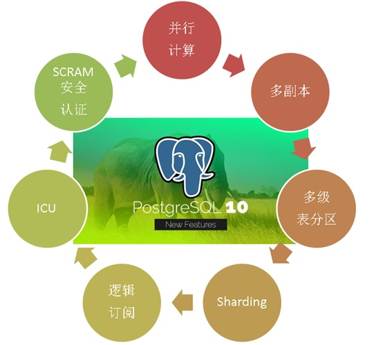
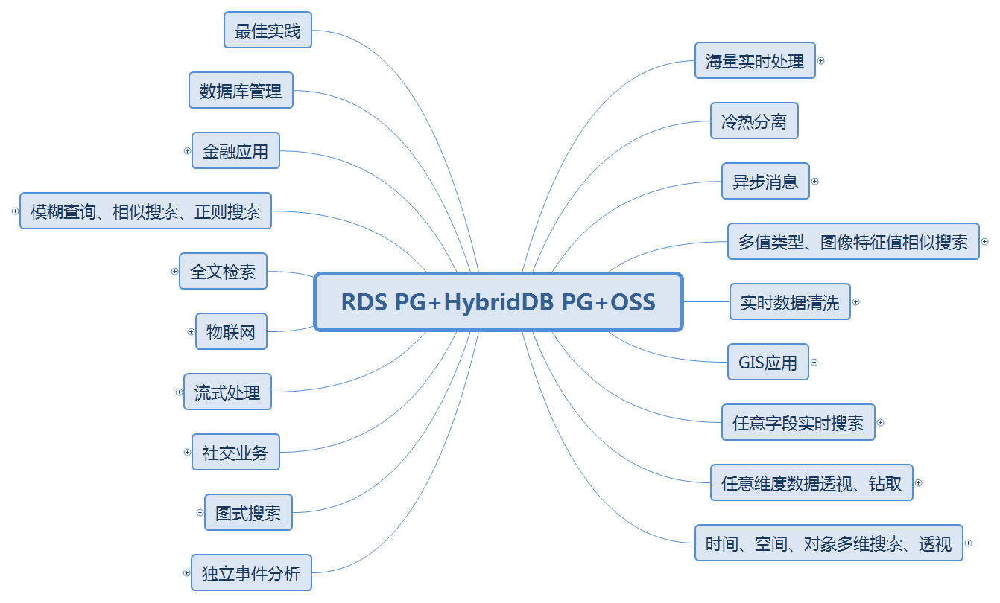
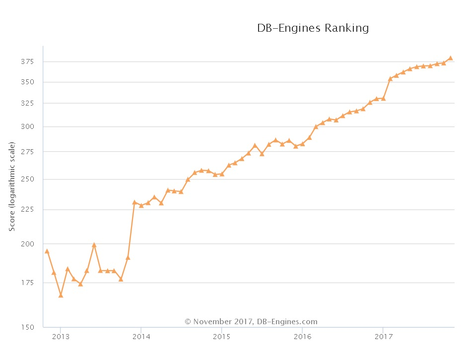

## HTAP数据库 PostgreSQL 场景与性能测试之 21 - (OLTP+OLAP) 排序、建索引  
  
### 作者  
digoal  
  
### 日期  
2017-11-07  
  
### 标签  
PostgreSQL , HTAP , OLTP , OLAP , 场景与性能测试  
  
----  
  
## 背景  
PostgreSQL是一个历史悠久的数据库，历史可以追溯到1973年，最早由2014计算机图灵奖得主，关系数据库的鼻祖[Michael_Stonebraker](https://en.wikipedia.org/wiki/Michael_Stonebraker) 操刀设计，PostgreSQL具备与Oracle类似的功能、性能、架构以及稳定性。  
  
  
  
PostgreSQL社区的贡献者众多，来自全球各个行业，历经数年，PostgreSQL 每年发布一个大版本，以持久的生命力和稳定性著称。  
  
2017年10月，PostgreSQL 推出10 版本，携带诸多惊天特性，目标是胜任OLAP和OLTP的HTAP混合场景的需求：  
  
[《最受开发者欢迎的HTAP数据库PostgreSQL 10特性》](../201710/20171029_01.md)  
  
1、多核并行增强  
  
2、fdw 聚合下推  
  
3、逻辑订阅  
  
4、分区  
  
5、金融级多副本  
  
6、json、jsonb全文检索  
  
7、还有插件化形式存在的特性，如 **向量计算、JIT、SQL图计算、SQL流计算、分布式并行计算、时序处理、基因测序、化学分析、图像分析** 等。  
  
  
  
在各种应用场景中都可以看到PostgreSQL的应用：  
  
  
  
PostgreSQL近年来的发展非常迅猛，从知名数据库评测网站dbranking的数据库评分趋势，可以看到PostgreSQL向上发展的趋势：  
  
  
  
从每年PostgreSQL中国召开的社区会议，也能看到同样的趋势，参与的公司越来越多，分享的公司越来越多，分享的主题越来越丰富，横跨了 **传统企业、互联网、医疗、金融、国企、物流、电商、社交、车联网、共享XX、云、游戏、公共交通、航空、铁路、军工、培训、咨询服务等** 行业。  
  
接下来的一系列文章，将给大家介绍PostgreSQL的各种应用场景以及对应的性能指标。  
  
## 环境  
环境部署方法参考：  
  
[《PostgreSQL 10 + PostGIS + Sharding(pg_pathman) + MySQL(fdw外部表) on ECS 部署指南(适合新用户)》](../201710/20171018_01.md)  
  
阿里云 ECS：```56核，224G，1.5TB*2 SSD云盘```。  
  
操作系统：```CentOS 7.4 x64```  
  
数据库版本：```PostgreSQL 10```  
  
PS：**ECS的CPU和IO性能相比物理机会打一定的折扣，可以按下降1倍性能来估算。跑物理主机可以按这里测试的性能乘以2来估算。**  
  
## 场景 - 排序、建索引 (OLTP+OLAP)  
  
### 1、背景  
  
1、OLTP中，排序通常是小数据集的排序。  
  
2、OLAP中，通常需要对大结果集进行排序，取TOP。  
  
3、排序的快慢，还直接影响建索引的速度。（提一下，PostgreSQL支持 CONCURRENTLY 构建索引，建索引时不会堵塞DML。）  
  
4、OLAP中，取TOP还有一些简便高效的方法：估算、HLL、采样、统计信息等。  
  
[《秒级任意维度分析1TB级大表 - 通过采样估值满足高效TOP N等统计分析需求》](../201709/20170911_02.md)  
  
[《Greenplum 最佳实践 - 估值插件hll的使用(以及hll分式聚合函数优化)》](../201608/20160825_02.md)  
  
[《PostgreSQL hll (HyperLogLog) extension for "State of The Art Cardinality Estimation Algorithm" - 1》](../201302/20130226_01.md)  
  
[《PostgreSQL hll (HyperLogLog) extension for "State of The Art Cardinality Estimation Algorithm" - 2》](../201302/20130227_01.md)  
  
[《PostgreSQL hll (HyperLogLog) extension for "State of The Art Cardinality Estimation Algorithm" - 3》](../201302/20130228_01.md)  
  
[《妙用explain Plan Rows快速估算行》](../201509/20150919_02.md)  
  
[《PostgreSQL pg_stats used to estimate top N freps values and explain rows》](../201308/20130811_01.md)  
  
### 2、设计  
  
1、小数据量排序，1万条数据。  
  
2、大数据量排序，1亿条数据。  
  
3、大数据量创建索引效率，1亿条数据。  
  
4、大数据估值TOP N，1亿条数据。  
  
5、大数据、复合索引、求任意一个GROUP c1的TOP c2的ID，1亿条数据。  
  
### 3、准备测试表  
  
```  
create table t_small (id int);  
  
create table t_large (id int);  
  
create table t_estimate (id int);  
  
create table t_idx_test (id int, c1 int, c2 int);  
```  
  
### 4、准备测试函数(可选)  
  
### 5、准备测试数据  
  
1、小数据量排序，1万条数据。  
  
```  
insert into t_small select generate_series(1,10000);  
```  
  
2、大数据量排序，1亿条数据。  
  
```  
insert into t_large select generate_series(1,100000000);  
```  
  
4、大数据估值TOP N，1亿条数据。  
  
```  
vi test.sql  
  
\set id random_gaussian(1, 1000000, 2.5)  
insert into t_estimate values (:id);  
```  
  
```  
pgbench -M prepared -n -r -P 5 -f ./test.sql -c 50 -j 50 -t 2000000  
```  
  
```  
analyze t_estimate;  
```  
  
5、大数据、复合索引、求任意一个GROUP c1的TOP c2的ID，1亿条数据。  
  
```  
insert into t_idx_test select id, random()*1000, random()*900000 from generate_series(1,100000000) t(id);  
create index idx_t_idx_test on t_idx_test (c1,c2);  
```  
  
### 6、准备测试脚本  
  
```  
vi test.sql  
  
\set c1 random(1,1000)  
select id from t_idx_test where c1=:c1 order by c2 desc limit 1;  
```  
  
压测  
  
```  
CONNECTS=112  
TIMES=300  
export PGHOST=$PGDATA  
export PGPORT=1999  
export PGUSER=postgres  
export PGPASSWORD=postgres  
export PGDATABASE=postgres  
  
pgbench -M prepared -n -r -f ./test.sql -P 5 -c $CONNECTS -j $CONNECTS -T $TIMES  
```  
  
### 7、测试  
  
1、小数据量排序  
  
```  
postgres=# explain (analyze,verbose,timing,costs,buffers) select * from t_small order by id desc limit 1;  
                                                          QUERY PLAN  
------------------------------------------------------------------------------------------------------------------------------  
 Limit  (cost=195.00..195.00 rows=1 width=4) (actual time=2.580..2.581 rows=1 loops=1)  
   Output: id  
   Buffers: shared hit=45  
   ->  Sort  (cost=195.00..220.00 rows=10000 width=4) (actual time=2.580..2.580 rows=1 loops=1)  
         Output: id  
         Sort Key: t_small.id DESC  
         Sort Method: top-N heapsort  Memory: 25kB  
         Buffers: shared hit=45  
         ->  Seq Scan on public.t_small  (cost=0.00..145.00 rows=10000 width=4) (actual time=0.006..1.184 rows=10000 loops=1)  
               Output: id  
               Buffers: shared hit=45  
 Planning time: 0.027 ms  
 Execution time: 2.591 ms  
(13 rows)  
```  
  
2、大数据量排序  
  
```  
alter table t_large set (parallel_workers =32);  
set parallel_setup_cost =0;  
set parallel_tuple_cost =0;  
set max_parallel_workers_per_gather =32;  
set work_mem ='1GB';  
explain select * from t_large order by id desc limit 1;  
  
postgres=# explain select * from t_large order by id desc limit 1;  
                                         QUERY PLAN  
---------------------------------------------------------------------------------------------  
 Limit  (cost=810844.97..810845.00 rows=1 width=4)  
   ->  Gather Merge  (cost=810844.97..3590855.42 rows=100000032 width=4)  
         Workers Planned: 32  
         ->  Sort  (cost=810844.14..818656.64 rows=3125001 width=4)  
               Sort Key: id DESC  
               ->  Parallel Seq Scan on t_large  (cost=0.00..473728.01 rows=3125001 width=4)  
(6 rows)  
  
postgres=# select * from t_large order by id desc limit 1;  
    id  
-----------  
 100000000  
(1 row)  
Time: 1482.964 ms (00:01.483)  
```  
  
3、大数据量创建索引效率  
  
```  
postgres=# create index idx_t_large_id on t_large(id);  
CREATE INDEX  
Time: 37937.482 ms (00:37.937)  
```  
  
4、大数据估值TOP N  
  
```  
postgres=# select most_common_vals, most_common_freqs from pg_stats where tablename='t_estimate';  
-[ RECORD 1 ]-----+-------------------------------------------------------------------------------------------------------------------------------------------------------------------------------------------------------------------------------------------------------------------------------------------------------------------------------------------------------------------------------------------------------------------------------------------------------------------------------------------------------------------------------------------------------------------------------------------------------------------------------------------------------------------------------------------------------------------------------------------------------------------------------------------------------------------------------------------------------------------------------------------------------------------------------------------------------------------------------------------------------------------------------------------------------------------------------------------------------------------------------------------------------------------------------------------  
most_common_vals  | {354316,354445,404899,431899,451975,525707,545934,552219,631936,654703,686785,52824,97919,100231,134912,137688,158267,161541,171349,182376,182892,186086,192265,196224,197934,206937,207098,208325,213459,218788,218939,225221,226377,238291,239857,245513,245868,250632,250836,251535,251972,254658,254998,255236,256667,259600,260215,263041,266027,268086,271091,271490,271520,272019,272459,282086,286285,287848,288015,288233,288310,288344,288605,289181,289901,291581,296327,301385,301631,304765,304923,306094,306309,307188,312000,313190,313449,315581,317808,320374,320769,322517,322889,323389,326463,326738,330239,331553,334323,335451,335588,337521,338605,342766,344188,344662,344730,345081,345096,346053}  
most_common_freqs | {0.0001,0.0001,0.0001,0.0001,0.0001,0.0001,0.0001,0.0001,0.0001,0.0001,0.0001,6.66667e-05,6.66667e-05,6.66667e-05,6.66667e-05,6.66667e-05,6.66667e-05,6.66667e-05,6.66667e-05,6.66667e-05,6.66667e-05,6.66667e-05,6.66667e-05,6.66667e-05,6.66667e-05,6.66667e-05,6.66667e-05,6.66667e-05,6.66667e-05,6.66667e-05,6.66667e-05,6.66667e-05,6.66667e-05,6.66667e-05,6.66667e-05,6.66667e-05,6.66667e-05,6.66667e-05,6.66667e-05,6.66667e-05,6.66667e-05,6.66667e-05,6.66667e-05,6.66667e-05,6.66667e-05,6.66667e-05,6.66667e-05,6.66667e-05,6.66667e-05,6.66667e-05,6.66667e-05,6.66667e-05,6.66667e-05,6.66667e-05,6.66667e-05,6.66667e-05,6.66667e-05,6.66667e-05,6.66667e-05,6.66667e-05,6.66667e-05,6.66667e-05,6.66667e-05,6.66667e-05,6.66667e-05,6.66667e-05,6.66667e-05,6.66667e-05,6.66667e-05,6.66667e-05,6.66667e-05,6.66667e-05,6.66667e-05,6.66667e-05,6.66667e-05,6.66667e-05,6.66667e-05,6.66667e-05,6.66667e-05,6.66667e-05,6.66667e-05,6.66667e-05,6.66667e-05,6.66667e-05,6.66667e-05,6.66667e-05,6.66667e-05,6.66667e-05,6.66667e-05,6.66667e-05,6.66667e-05,6.66667e-05,6.66667e-05,6.66667e-05,6.66667e-05,6.66667e-05,6.66667e-05,6.66667e-05,6.66667e-05,6.66667e-05}  
  
Time: 1.274 ms  
```  
  
5、大数据、复合索引、求任意一个GROUP c1的TOP c2的ID，1亿条数据。  
  
```  
transaction type: ./test.sql  
scaling factor: 1  
query mode: prepared  
number of clients: 112  
number of threads: 112  
duration: 300 s  
number of transactions actually processed: 203376551  
latency average = 0.165 ms  
latency stddev = 0.324 ms  
tps = 677702.381595 (including connections establishing)  
tps = 677897.901150 (excluding connections establishing)  
script statistics:  
 - statement latencies in milliseconds:  
         0.002  \set c1 random(1,1000)  
         0.168  select id from t_idx_test where c1=:c1 order by c2 desc limit 1;  
```  
  
#### TPS： 677897  
  
5、大数据、复合索引、求任意一个GROUP c1的TOP c2的ID，1亿条数据。TPS：677897  
  
#### 平均响应时间： 0.165 毫秒  
  
1、小数据量排序，1万条数据，排序耗时 2.6 毫秒。  
  
2、大数据量排序，1亿条数据，排序耗时 1.48 秒。  
  
3、大数据量创建索引效率，1亿条数据，创建索引耗时 37.9 秒。  
  
4、大数据估值TOP N，1一条数据，估算TOP N，耗时 1.27 毫秒。  
  
5、大数据、复合索引、求任意一个GROUP c1的TOP c2的ID，1亿条数据。平均响应时间： 0.165 毫秒。  
  
## 参考  
[《PostgreSQL、Greenplum 应用案例宝典《如来神掌》 - 目录》](../201706/20170601_02.md)  
  
[《数据库选型之 - 大象十八摸 - 致 架构师、开发者》](../201702/20170209_01.md)  
  
[《PostgreSQL 使用 pgbench 测试 sysbench 相关case》](../201610/20161031_02.md)  
  
[《数据库界的华山论剑 tpc.org》](../201701/20170125_01.md)  
  
https://www.postgresql.org/docs/10/static/pgbench.html  
  
  
<a rel="nofollow" href="http://info.flagcounter.com/h9V1"  ></a>  
  
  
  
  
  
  
## [digoal's 大量PostgreSQL文章入口](https://github.com/digoal/blog/blob/master/README.md "22709685feb7cab07d30f30387f0a9ae")
  
