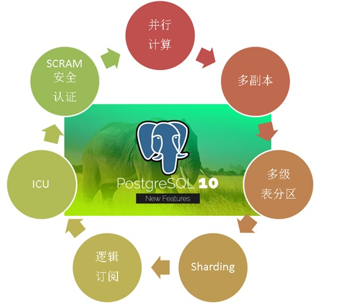

## HTAP数据库 PostgreSQL 场景与性能测试之 23 - (OLAP) 并行计算  
  
### 作者  
digoal  
  
### 日期  
2017-11-07  
  
### 标签  
PostgreSQL , HTAP , OLTP , OLAP , 场景与性能测试  
  
----  
  
## 背景  
PostgreSQL是一个历史悠久的数据库，历史可以追溯到1973年，最早由2014计算机图灵奖得主，关系数据库的鼻祖[Michael_Stonebraker](https://en.wikipedia.org/wiki/Michael_Stonebraker) 操刀设计，PostgreSQL具备与Oracle类似的功能、性能、架构以及稳定性。  
  
  
  
PostgreSQL社区的贡献者众多，来自全球各个行业，历经数年，PostgreSQL 每年发布一个大版本，以持久的生命力和稳定性著称。  
  
2017年10月，PostgreSQL 推出10 版本，携带诸多惊天特性，目标是胜任OLAP和OLTP的HTAP混合场景的需求：  
  
[《最受开发者欢迎的HTAP数据库PostgreSQL 10特性》](../201710/20171029_01.md)  
  
1、多核并行增强  
  
2、fdw 聚合下推  
  
3、逻辑订阅  
  
4、分区  
  
5、金融级多副本  
  
6、json、jsonb全文检索  
  
7、还有插件化形式存在的特性，如 **向量计算、JIT、SQL图计算、SQL流计算、分布式并行计算、时序处理、基因测序、化学分析、图像分析** 等。  
  
  
  
在各种应用场景中都可以看到PostgreSQL的应用：  
  
  
  
PostgreSQL近年来的发展非常迅猛，从知名数据库评测网站dbranking的数据库评分趋势，可以看到PostgreSQL向上发展的趋势：  
  
  
  
从每年PostgreSQL中国召开的社区会议，也能看到同样的趋势，参与的公司越来越多，分享的公司越来越多，分享的主题越来越丰富，横跨了 **传统企业、互联网、医疗、金融、国企、物流、电商、社交、车联网、共享XX、云、游戏、公共交通、航空、铁路、军工、培训、咨询服务等** 行业。  
  
接下来的一系列文章，将给大家介绍PostgreSQL的各种应用场景以及对应的性能指标。  
  
## 环境  
环境部署方法参考：  
  
[《PostgreSQL 10 + PostGIS + Sharding(pg_pathman) + MySQL(fdw外部表) on ECS 部署指南(适合新用户)》](../201710/20171018_01.md)  
  
阿里云 ECS：```56核，224G，1.5TB*2 SSD云盘```。  
  
操作系统：```CentOS 7.4 x64```  
  
数据库版本：```PostgreSQL 10```  
  
PS：**ECS的CPU和IO性能相比物理机会打一定的折扣，可以按下降1倍性能来估算。跑物理主机可以按这里测试的性能乘以2来估算。**  
  
## 场景 - 并行计算 (OLAP)  
  
### 1、背景  
  
PostgreSQL 从9.6开始支持并行计算，使得OLTP和OLAP可以在一个实例中实现。  
  
1、并行排序  
  
2、并行全表扫描  
  
3、并行JOIN  
  
4、并行聚合  
  
5、并行filter  
  
### 2、设计  
  
1亿数据，包括整型，字符串，浮点，时间。  
  
1、并行排序  
  
2、并行全表扫描  
  
3、并行JOIN  
  
4、并行聚合  
  
5、并行filter  
  
### 3、准备测试表  
  
```  
create table t1 (id int, c1 float4, c2 text, c3 timestamp, c4 int);  
create table t2 (id int, c1 float4, c2 text, c3 timestamp, c4 int);  
```  
  
### 4、准备测试函数(可选)  
  
### 5、准备测试数据  
  
```  
insert into t1 select id, random()*1000, md5(random()::text), clock_timestamp(), random()*100 from generate_series(1,100000000) t(id);  
insert into t2 select id, random()*1000, md5(random()::text), clock_timestamp(), random()*1000 from generate_series(1,100000000) t(id);  
```  
  
### 6、准备测试脚本  
  
```  
set parallel_setup_cost =0;  
set parallel_tuple_cost =0;  
set max_parallel_workers_per_gather =32;  
alter table t1 set (parallel_workers =32);  
alter table t2 set (parallel_workers =32);  
```  
  
1、并行排序，1亿记录排序。  
  
```  
select * from t1 order by id desc limit 1;  
```  
  
2、并行全表扫描，1亿记录全表扫描，求id=1的记录。  
  
```  
select count(*) from t1 where id=1;  
```  
  
3、并行JOIN，1亿记录 A JOIN B 1亿记录，按A表的输入条件过滤，按B表聚合。  
  
```  
select count(b.c4) from t2 a join t1 b on (a.id=b.id and a.c4=1);  
```  
  
4、并行聚合，1亿记录，分组聚合。  
  
```  
select max(c1) from t1 where c4>90 group by c4;  
```  
  
5、并行filter，并行的字符串、浮点、时间、整型过滤。  
  
```  
select count(*) from t1 where c2='abc' or c1<'10' or c3<'2017-01-01' or c4>123;  
```  
  
### 7、测试  
1、并行排序，1亿记录排序。 2.6 秒。  
  
```  
postgres=# explain select * from t1 order by id desc limit 1;  
                                        QUERY PLAN  
------------------------------------------------------------------------------------------  
 Limit  (cost=1568818.77..1568818.80 rows=1 width=53)  
   ->  Gather Merge  (cost=1568818.77..4348829.22 rows=100000032 width=53)  
         Workers Planned: 32  
         ->  Sort  (cost=1568817.94..1576630.44 rows=3125001 width=53)  
               Sort Key: id DESC  
               ->  Parallel Seq Scan on t1  (cost=0.00..1167614.01 rows=3125001 width=53)  
(6 rows)  
  
postgres=# select id from t1 order by id desc limit 1;  
    id  
-----------  
 100000000  
(1 row)  
Time: 2600.160 ms (00:02.600)  
```  
  
  
2、并行全表扫描，1亿记录全表扫描，求id=1的记录。 0.88 秒。  
  
```  
postgres=# explain select count(*) from t1 where id=1;  
                                 QUERY PLAN  
-----------------------------------------------------------------------------  
 Aggregate  (cost=1175426.51..1175426.52 rows=1 width=8)  
   ->  Gather  (cost=0.00..1175426.51 rows=1 width=0)  
         Workers Planned: 32  
         ->  Parallel Seq Scan on t1  (cost=0.00..1175426.51 rows=1 width=0)  
               Filter: (id = 1)  
(5 rows)  
  
postgres=# select count(*) from t1 where id=1;  
 count  
-------  
     1  
(1 row)  
Time: 882.059 ms  
```  
  
3、并行JOIN，1亿记录 A JOIN B 1亿记录，按A表的输入条件过滤，按B表聚合。 17 秒。  
  
```  
postgres=# explain select count(b.c4) from t2 a join t1 b on (a.id=b.id and a.c4=1);  
                                              QUERY PLAN  
-------------------------------------------------------------------------------------------------------  
 Finalize Aggregate  (cost=4330512.77..4330512.78 rows=1 width=8)  
   ->  Gather  (cost=4330512.72..4330512.73 rows=16 width=8)  
         Workers Planned: 16  
         ->  Partial Aggregate  (cost=4330512.72..4330512.73 rows=1 width=8)  
               ->  Merge Join  (cost=4298704.54..4330497.64 rows=6034 width=4)  
                     Merge Cond: (b.id = a.id)  
                     ->  Sort  (cost=1904346.28..1919971.29 rows=6250002 width=8)  
                           Sort Key: b.id  
                           ->  Parallel Seq Scan on t1 b  (cost=0.00..1198864.02 rows=6250002 width=8)  
                     ->  Sort  (cost=2394358.25..2394599.63 rows=96550 width=4)  
                           Sort Key: a.id  
                           ->  Seq Scan on t2 a  (cost=0.00..2386364.40 rows=96550 width=4)  
                                 Filter: (c4 = 1)  
(13 rows)  
  
postgres=# select count(b.c4) from t2 a join t1 b on (a.id=b.id and a.c4=1);  
 count  
-------  
 99854  
(1 row)  
  
Time: 17333.843 ms (00:17.334)  
```  
  
4、并行聚合，1亿记录，分组聚合。 0.9 秒。  
  
```  
postgres=# explain select max(c1) from t1 where c4>90 group by c4;  
                                          QUERY PLAN  
----------------------------------------------------------------------------------------------  
 Finalize GroupAggregate  (cost=1177103.43..1177128.68 rows=101 width=8)  
   Group Key: c4  
   ->  Sort  (cost=1177103.43..1177111.51 rows=3232 width=8)  
         Sort Key: c4  
         ->  Gather  (cost=1176914.03..1176915.04 rows=3232 width=8)  
               Workers Planned: 32  
               ->  Partial HashAggregate  (cost=1176914.03..1176915.04 rows=101 width=8)  
                     Group Key: c4  
                     ->  Parallel Seq Scan on t1  (cost=0.00..1175426.51 rows=297503 width=8)  
                           Filter: (c4 > 90)  
(10 rows)  
  
postgres=# select max(c1) from t1 where c4>90 group by c4;  
   max  
---------  
    1000  
 999.999  
 999.999  
 999.999  
 999.999  
 999.996  
    1000  
    1000  
    1000  
 999.999  
(10 rows)  
  
Time: 945.695 ms  
```  
  
5、并行filter，并行的字符串、浮点、时间、整型过滤。 1 秒。  
  
```  
postgres=# explain select count(*) from t1 where c2='abc' or c1<'10' or c3<'2017-01-01' or c4>123;  
                                                                    QUERY PLAN  
--------------------------------------------------------------------------------------------------------------------------------------------------  
 Finalize Aggregate  (cost=1198947.36..1198947.38 rows=1 width=8)  
   ->  Gather  (cost=1198947.27..1198947.28 rows=32 width=8)  
         Workers Planned: 32  
         ->  Partial Aggregate  (cost=1198947.27..1198947.28 rows=1 width=8)  
               ->  Parallel Seq Scan on t1  (cost=0.00..1198864.02 rows=33302 width=0)  
                     Filter: ((c2 = 'abc'::text) OR (c1 < '10'::real) OR (c3 < '2017-01-01 00:00:00'::timestamp without time zone) OR (c4 > 123))  
(6 rows)  
  
postgres=# select count(*) from t1 where c2='abc' or c1<'10' or c3<'2017-01-01' or c4>123;  
 count  
--------  
 999179  
(1 row)  
  
Time: 1015.627 ms (00:01.016)  
```  
  
#### TPS  
  
#### 平均响应时间  
1、并行排序，1亿记录排序。 2.6 秒。  
  
2、并行全表扫描，1亿记录全表扫描，求id=1的记录。 0.88 秒。  
  
3、并行JOIN，1亿记录 A JOIN B 1亿记录，按A表的输入条件过滤，按B表聚合。 17 秒。  
  
4、并行聚合，1亿记录，分组聚合。 0.9 秒。  
  
5、并行filter，1亿记录，并行的字符串、浮点、时间、整型过滤。 1 秒。  
  
## 参考  
[《PostgreSQL、Greenplum 应用案例宝典《如来神掌》 - 目录》](../201706/20170601_02.md)  
  
[《数据库选型之 - 大象十八摸 - 致 架构师、开发者》](../201702/20170209_01.md)  
  
[《PostgreSQL 使用 pgbench 测试 sysbench 相关case》](../201610/20161031_02.md)  
  
[《数据库界的华山论剑 tpc.org》](../201701/20170125_01.md)  
  
https://www.postgresql.org/docs/10/static/pgbench.html  
  
  
<a rel="nofollow" href="http://info.flagcounter.com/h9V1"  ></a>  
  
  
  
  
  
  
## [digoal's 大量PostgreSQL文章入口](https://github.com/digoal/blog/blob/master/README.md "22709685feb7cab07d30f30387f0a9ae")
  
