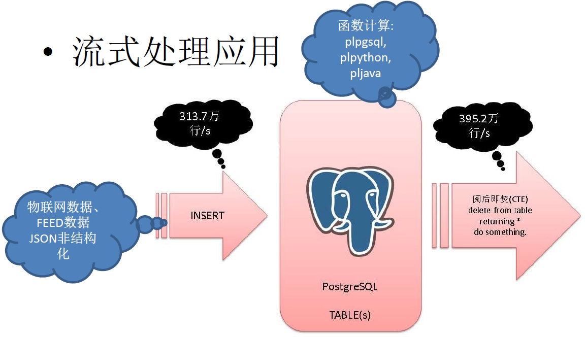

## HTAP数据库 PostgreSQL 场景与性能测试之 31 - (OLTP) 高吞吐数据进出(堆存、行扫、无需索引) - 阅后即焚(读写大吞吐并测)  
  
### 作者  
digoal  
  
### 日期  
2017-11-07  
  
### 标签  
PostgreSQL , HTAP , OLTP , OLAP , 场景与性能测试  
  
----  
  
## 背景  
PostgreSQL是一个历史悠久的数据库，历史可以追溯到1973年，最早由2014计算机图灵奖得主，关系数据库的鼻祖[Michael_Stonebraker](https://en.wikipedia.org/wiki/Michael_Stonebraker) 操刀设计，PostgreSQL具备与Oracle类似的功能、性能、架构以及稳定性。  
  
  
  
PostgreSQL社区的贡献者众多，来自全球各个行业，历经数年，PostgreSQL 每年发布一个大版本，以持久的生命力和稳定性著称。  
  
2017年10月，PostgreSQL 推出10 版本，携带诸多惊天特性，目标是胜任OLAP和OLTP的HTAP混合场景的需求：  
  
[《最受开发者欢迎的HTAP数据库PostgreSQL 10特性》](../201710/20171029_01.md)  
  
1、多核并行增强  
  
2、fdw 聚合下推  
  
3、逻辑订阅  
  
4、分区  
  
5、金融级多副本  
  
6、json、jsonb全文检索  
  
7、还有插件化形式存在的特性，如 **向量计算、JIT、SQL图计算、SQL流计算、分布式并行计算、时序处理、基因测序、化学分析、图像分析** 等。  
  
  
  
在各种应用场景中都可以看到PostgreSQL的应用：  
  
  
  
PostgreSQL近年来的发展非常迅猛，从知名数据库评测网站dbranking的数据库评分趋势，可以看到PostgreSQL向上发展的趋势：  
  
  
  
从每年PostgreSQL中国召开的社区会议，也能看到同样的趋势，参与的公司越来越多，分享的公司越来越多，分享的主题越来越丰富，横跨了 **传统企业、互联网、医疗、金融、国企、物流、电商、社交、车联网、共享XX、云、游戏、公共交通、航空、铁路、军工、培训、咨询服务等** 行业。  
  
接下来的一系列文章，将给大家介绍PostgreSQL的各种应用场景以及对应的性能指标。  
  
## 环境  
环境部署方法参考：  
  
[《PostgreSQL 10 + PostGIS + Sharding(pg_pathman) + MySQL(fdw外部表) on ECS 部署指南(适合新用户)》](../201710/20171018_01.md)  
  
阿里云 ECS：```56核，224G，1.5TB*2 SSD云盘```。  
  
操作系统：```CentOS 7.4 x64```  
  
数据库版本：```PostgreSQL 10```  
  
PS：**ECS的CPU和IO性能相比物理机会打一定的折扣，可以按下降1倍性能来估算。跑物理主机可以按这里测试的性能乘以2来估算。**  
  
## 场景 - 秒杀 - 高并发单点更新 (OLTP)  
  
### 1、背景  
高吞吐的数据写入，消费，通常是MQ的强项和功能点，但是MQ没有数据存储的能力，也没有计算能力。  
  
而PostgreSQL具备了存储、计算能力，同时PG还提供了高吞吐，可靠性。  
  
在需要高吞吐计算的环境，PG是非常不错的选择。  
  
如果业务上需要先进先出的模式，可以加一个时间索引，即可达到这样的效率，写入和消费都在300万行/s以上：  
  
  
  
详见：  
  
[《HTAP数据库 PostgreSQL 场景与性能测试之 27 - (OLTP) 物联网 - FEED日志, 流式处理 与 阅后即焚 (CTE)》](../20171107_28.md)  
  
如果业务上不要求强烈的先进先出，并且处理吞吐足够强悍的话，实际上PG可以不需要索引，因为是堆表，没有索引，写和消费的吞吐可以做到更大。  
  
本文测试的是不需要索引的裸写入和消费吞吐能力(消费、不计算)。  
  
下一篇压测大吞吐下，结合 函数计算和JSON的能力。  
  
### 2、设计  
1、堆表、多表、大吞吐写入  
  
2、堆表、多表、大吞吐消费  
  
同时压测写入和消费。  
  
### 3、准备测试表  
  
```  
create table t_sensor (sid int, info text, crt_time timestamp) ;  
```  
  
使用2048个分表。  
  
```  
do language plpgsql $$  
declare  
begin  
  for i in 0..2047 loop  
    execute 'create table t_sensor'||i||'(like t_sensor including all) inherits(t_sensor) '||case when mod(i,2)=0 then ' ' else ' tablespace tbs1' end;  
  end loop;  
end;  
$$;  
```  
  
### 4、准备测试函数(可选)  
1、批量生成传感器测试数据的函数  
  
```  
CREATE OR REPLACE FUNCTION public.ins_batch(integer,integer)  
 RETURNS void  
 LANGUAGE plpgsql  
 STRICT  
AS $function$  
declare  
  suffix int := mod($1, 2048);  
begin  
  execute 'insert into t_sensor'||suffix||' select '||$1||', 0.1, now() from generate_series(1,'||$2||')';  
end;  
$function$;  
```  
  
2、批量消费传感器数据的函数，按时间，从最早开始消费。  
  
处理逻辑也可以放到里面，例如预警逻辑(采用PostgreSQL异步消息、CTE语法)。  
  
[《PostgreSQL 异步消息实践 - Feed系统实时监测与响应(如 电商主动服务) - 分钟级到毫秒级的跨域》](../201711/20171111_01.md)  
  
[《PostgreSQL 内存表》](../201608/20160818_01.md)  
  
```  
CREATE OR REPLACE FUNCTION public.consume_batch(integer,integer)  
 RETURNS void  
 LANGUAGE plpgsql  
 STRICT  
AS $function$  
declare  
  suffix int := mod($1, 2048);  
begin  
  -- 带流式处理业务逻辑的例句(采用CTE语法)：  
  -- with t1 as (delete from t_sensor$suffix where ctid = any(array(select ctid from t_sensor$suffix limit 1000)) returning *)  
  --   select pg_notify('channel_name', 'reason:xxx::::'||row_to_json(t1)) from t1 where ......;  
  --  
  -- 如果有多个判断基准，可以先存入TMP TABLE，再到TMP TABLE处理。  
  -- 使用普通的TMP table或者使用内存TMP TABLE。  
  -- [《PostgreSQL 内存表》](../201608/20160818_01.md)  
  
  -- 本例仅测试不带处理逻辑，只消费的情况，关注消费速度。  
  execute format('delete from t_sensor%s where ctid = any(array(select ctid from t_sensor%s limit %s))', suffix, suffix, $2);  
end;  
$function$;  
```  
  
### 5、准备测试数据  
  
### 6、准备测试脚本  
同时压测写入和消费。  
  
1、高吞吐写入测试，100万个传感器，每批1000条。  
  
```  
vi test.sql  
  
\set sid random(1,1000000)  
select ins_batch(:sid, 1000);  
```  
  
压测  
  
```  
CONNECTS=28  
TIMES=300  
export PGHOST=$PGDATA  
export PGPORT=1999  
export PGUSER=postgres  
export PGPASSWORD=postgres  
export PGDATABASE=postgres  
  
pgbench -M prepared -n -r -f ./test.sql -P 5 -c $CONNECTS -j $CONNECTS -T $TIMES  
```  
  
2、高吞吐消费测试，100万个传感器，每批1000条。  
  
```  
vi test1.sql  
  
\set sid random(1,1000000)  
select consume_batch(:sid, 1000);  
```  
  
压测  
  
```  
CONNECTS=28  
TIMES=300  
export PGHOST=$PGDATA  
export PGPORT=1999  
export PGUSER=postgres  
export PGPASSWORD=postgres  
export PGDATABASE=postgres  
  
pgbench -M prepared -n -r -f ./test1.sql -P 5 -c $CONNECTS -j $CONNECTS -T $TIMES  
```  
  
### 7、测试  
  
1、高吞吐写入测试，100万个传感器，每批1000条。  
  
```  
transaction type: ./test.sql  
scaling factor: 1  
query mode: prepared  
number of clients: 28  
number of threads: 28  
duration: 300 s  
number of transactions actually processed: 581437  
latency average = 14.446 ms  
latency stddev = 12.231 ms  
tps = 1937.869058 (including connections establishing)  
tps = 1937.999398 (excluding connections establishing)  
script statistics:  
 - statement latencies in milliseconds:  
         0.002  \set sid random(1,1000000)  
        14.445  select ins_batch(:sid, 1000);  
```  
  
2、高吞吐消费测试，100万个传感器，每批1000条。  
  
```  
transaction type: ./test1.sql  
scaling factor: 1  
query mode: prepared  
number of clients: 28  
number of threads: 28  
duration: 300 s  
number of transactions actually processed: 1254322  
latency average = 6.697 ms  
latency stddev = 10.925 ms  
tps = 4180.897450 (including connections establishing)  
tps = 4181.104213 (excluding connections establishing)  
script statistics:  
 - statement latencies in milliseconds:  
         0.002  \set sid random(1,1000000)  
         6.696  select consume_batch(:sid, 1000);  
```  
  
#### 一、 TPS  
同时压测写入和消费的吞吐如下：  
  
##### 1、数据写入速度： 193万 行/s。  
  
##### 2、数据消费速度： 418万 行/s。  
  
#### 二、 平均响应时间  
同时压测写入和消费的吞吐如下：  
  
##### 1、数据写入速度： 14.4 毫秒  
  
##### 2、数据消费速度： 6.7 毫秒  
  
## 参考  
[《PostgreSQL、Greenplum 应用案例宝典《如来神掌》 - 目录》](../201706/20170601_02.md)  
  
[《数据库选型之 - 大象十八摸 - 致 架构师、开发者》](../201702/20170209_01.md)  
  
[《PostgreSQL 使用 pgbench 测试 sysbench 相关case》](../201610/20161031_02.md)  
  
[《数据库界的华山论剑 tpc.org》](../201701/20170125_01.md)  
  
https://www.postgresql.org/docs/10/static/pgbench.html  
  
  
<a rel="nofollow" href="http://info.flagcounter.com/h9V1"  ></a>  
  
  
  
  
  
  
## [digoal's 大量PostgreSQL文章入口](https://github.com/digoal/blog/blob/master/README.md "22709685feb7cab07d30f30387f0a9ae")
  
