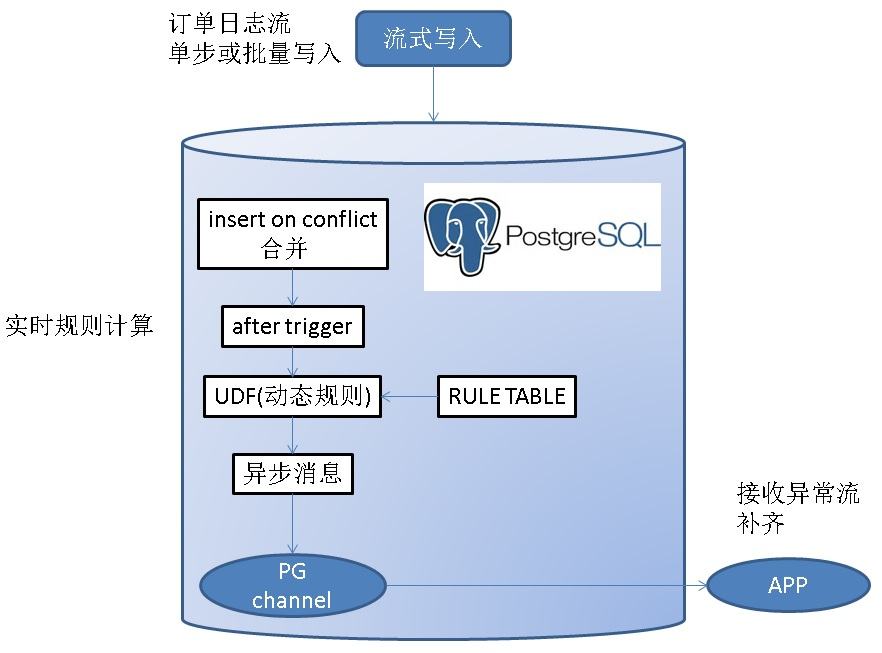
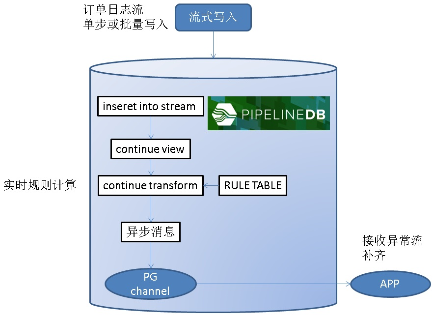
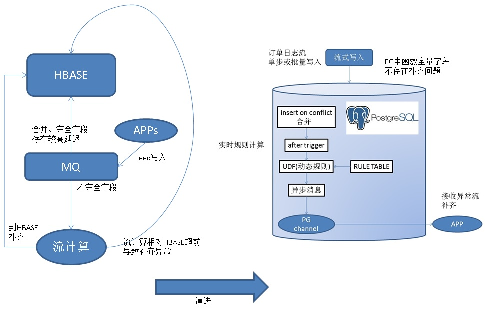

## PostgreSQL 异步消息实践 - Feed系统实时监测与响应(如 电商主动服务) - 分钟级到毫秒级的实现
      
### 作者      
digoal      
      
### 日期      
2017-11-11      
      
### 标签      
PostgreSQL , 异步消息 , 触发器 , 规则 , insert on conflict , 实时分析     
      
----      
      
## 背景     
在很多业务系统中，为了定位问题、运营需要、分析需要或者其他需求，会在业务中设置埋点，记录用户的行为在业务系统中产生的日志，也叫FEED日志。    
    
比如订单系统、在业务系统中环环相扣，从购物车、下单、付款、发货，收货（还有纠纷、退款等等），一笔订单通常会产生若干相关联的记录。    
    
每个环节产生的属性可能是不一样的，有可能有新的属性产生，也有可能变更已有的属性值。    
    
为了便于分析，通常有必要将订单在整个过程中产生的若干记录（若干属性），合并成一条记录（订单大宽表）。    
    
通常业务系统会将实时产生的订单FEED数据写入消息队列，消息队列使得数据变成了流动的数据：    
    
[《从人类河流文明 洞察 数据流动的重要性》](../201707/20170706_01.md)      
    
## 方案一、RDS PG + OSS + HDB PG 分钟清洗和主动检测    
    
数据通过消息队列消费后，实时写入RDS PG，在RDS PG进行订单FEED的合并，写入OSS外部表。(支持压缩格式，换算成裸数据的写入OSS的速度约100MB/s/会话)    
    
HDB PG从OSS外部表读取(支持压缩格式，换算成裸数据的读取OSS的速度约100MB/s/数据节点)，并将订单FEED数据合并到全量订单表。    
    
        
    
[《打造云端流计算、在线业务、数据分析的业务数据闭环 - 阿里云RDS、HybridDB for PostgreSQL最佳实践》](../201707/20170728_01.md)      
    
数据进入HDB PG后，通过规则SQL，从全量订单表中，挖掘异常数据（或者分析）。    
    
通过这种方案，实现了海量订单FEED数据的分钟级准实时分析。    
    
**这个方案已支撑了双十一业务，超高吞吐、低延迟，丝般柔滑。**    
    
## 方案二、毫秒级FEED监测及实时反馈方案    
技术永远是为业务服务的，分钟级延迟虽然说已经很高了，但是在一些极端情况下，可能需要更低的延迟。    
    
实际上RDS PostgreSQL还有更强的杀手锏，可以实现毫秒级的异常FEED数据发现和反馈。    
    
流式处理+异步消息，方法如下：    
    
1、通过触发机制结合异步消息通道实现。    
    
    
    
2、通过pipeline，流式SQL结合异步消息通道实现。    
    
    
    
应用程序监听消息通道(listen channel)，数据库则将异常数据写入到消息通道(notify channel, message)。实现异常数据的主动异步推送。    
    
## 毫秒级FEED监测与反馈架构设计    
之前不做毫秒级的FEED监测，还有一个原因是HBASE的合并延迟较高，导致流计算在补齐字段时异常。使用RDS PG来实现异常监测，完全杜绝了补齐的问题，因为在RDS PG就包含了全字段，不存在补齐的需求。    
    
    
    
### RDS PG设计    
1、分实例，提高系统级吞吐。（例如单实例处理能力是15万行/s，那么100个实例，可以支撑1500万行/s的实时处理。）    
    
例如：    
    
```    
DB0, DB1, DB2, DB3, ..., DB255    
```    
    
映射关系：    
    
```    
db0, host?, port?    
    
db1, host?, port?    
    
...    
```    
    
2、实例内使用分表，提高单实例并行处理吞吐。当规则众多时，分表可以提高单实例的规则处理吞吐。    
    
例如    
    
```    
tbl0, tbl1, tbl2, ..., tbl127    
    
tbl128, tbl129, tbl130, ..., tbl255    
```    
    
映射关系：    
    
```    
tbl0, db?    
    
tbl1, db?    
    
...    
```    
    
### HDB PG设计    
HDB PG依旧保留，用于PB级数据量的海量数据实时分析。    
    
数据通路依旧采用OSS，批量导入的方式。    
    
## DEMO    
    
1、创建订单feed全宽表（当然，我们也可以使用jsonb字段来存储所有属性。因为PostgreSQL支持JSONB类型哦。PostgreSQL支持的多值类型还有hstore, xml等。）    
    
```    
create table feed(id int8 primary key, c1 int, c2 int, c3 int, c4 int, c5 int, c6 int, c7 int, c8 int, c9 int, c10 int, c11 int, c12 int);    
```    
    
2、订单FEED数据的写入，例如A业务系统，写入订单的c1,c2字段。B业务系统，写入订单的c3,c4字段。......    
    
使用on conflict do something语法，进行订单属性的合并。    
    
```    
insert into feed (id, c1, c2) values (2,2,30001) on conflict (id) do update set c1=excluded.c1, c2=excluded.c2 ;    
    
insert into feed (id, c3, c4) values (2,99,290001) on conflict (id) do update set c3=excluded.c3, c4=excluded.c4 ;    
```    
    
3、建立订单FEED的实时监测规则，当满足条件时，向PostgreSQL的异步消息中发送消息。监听该通道的APP，循环从异步消息获取数据，即可满足消息的实时消费。    
    
规则可以保留在TABLE中，也可以写在触发器代码中，也可以写在UDF代码中。    
    
3\.1、如果数据是批量写入的，可以使用语句级触发器，降低触发器函数被调用的次数，提高写入吞吐。    
    
```    
create or replace function tg1() returns trigger as $$    
declare    
begin     
  -- 规则定义，实际使用时，可以联合规则定义表    
  -- c2大于1000时，发送异步消息    
  perform pg_notify('channel_1', 'Resone:c2 overflow::'||row_to_json(inserted)) from inserted where c2>1000;      
    
  -- 多个规则，写单个notify的方法。    
  --   perform pg_notify(    
  --                    'channel_1',      
  --                   case     
  --                    when c2>1000 then 'Resone:c2 overflow::'||row_to_json(inserted)     
  --                    when c1>200 then 'Resone:c1 overflow::'||row_to_json(inserted)     
  --                   end    
  --                  )     
  --   from inserted     
  --   where     
  --     c2 > 1000     
  --     or c1 > 200;      
    
  -- 多个规则，可以写多个notify，或者合并成一个NOTIFY。    
    
  return null;    
end;    
$$ language plpgsql strict;    
```    
    
3\.2、如果数据是单条写入的，可以使用行级触发器。（本例后面的压测使用这个）    
    
```    
create or replace function tg2() returns trigger as $$    
declare    
begin     
  -- 规则定义，实际使用时，可以联合规则定义表    
    
  -- c2大于9999时，发送异步消息    
  perform pg_notify('channel_1', 'Resone:c2 overflow::'||row_to_json(NEW)) where NEW.c2>9999;      
    
  -- 多个规则，调用单个notify，写一个CHANNEL的方法。    
  --   perform pg_notify(    
  --                    'channel_1',      
  --                   case     
  --                    when c2>1000 then 'Resone:c2 overflow::'||row_to_json(NEW)     
  --                    when c1>200 then 'Resone:c1 overflow::'||row_to_json(NEW)     
  --                   end    
  --                  )     
  --   where     
  --     NEW.c2 > 10000     
  --     or NEW.c1 > 200;      
    
  -- 多个规则，调用单个notify，写多个CHANNEL的方法。    
  --   perform pg_notify(    
  --                   case     
  --                    when c2>1000 then 'channel_1'     
  --                    when c1>200 then 'channel_2'     
  --                   end,    
  --                   case     
  --                    when c2>1000 then 'Resone:c2 overflow::'||row_to_json(NEW)     
  --                    when c1>200 then 'Resone:c1 overflow::'||row_to_json(NEW)     
  --                   end    
  --                  )     
  --   where     
  --     NEW.c2 > 1000     
  --     or NEW.c1 > 200;      
    
  -- 多个规则，可以写多个notify，或者合并成一个NOTIFY。    
  -- 例如    
  -- perform pg_notify('channel_1', 'Resone:c2 overflow::'||row_to_json(NEW)) where NEW.c2 > 1000;    
  -- perform pg_notify('channel_2', 'Resone:c1 overflow::'||row_to_json(NEW)) where NEW.c1 > 200;    
    
  -- 也可以把规则定义在TABLE里面，实现动态的规则    
  -- 规则不要过于冗长，否则会降低写入的吞吐，因为是串行处理规则。    
  -- udf的输入为feed类型以及rule_table类型，输出为boolean。判断逻辑定义在UDF中。    
  -- perfrom pg_notify(channel_column, resone_column||'::'||row_to_json(NEW)) from rule_table where udf(NEW::feed, rule_table);    
    
  return null;    
end;    
$$ language plpgsql strict;    
```    
    
3\.3、如上代码中所述，规则可以定义在很多地方。    
    
4、创建触发器。    
    
4\.1、语句级触发器(批量写入，建议采用)    
    
```    
create trigger tg1 after insert on feed REFERENCING NEW TABLE AS inserted for each statement execute procedure tg1();    
create trigger tg2 after update on feed REFERENCING NEW TABLE AS inserted for each statement execute procedure tg1();    
```    
    
4\.2、行级触发器(单步写入建议采用)，（本例后面的压测使用这个）    
    
```    
create trigger tg1 after insert on feed for each row execute procedure tg2();    
create trigger tg2 after update on feed for each row execute procedure tg2();    
```    
    
5、协商好通道名称。    
    
6、应用端监听消息通道。    
    
```    
listen channel_1;    
    
接收消息：    
    
loop    
  sleep ?;    
  get 消息;    
end loop    
```    
    
7、写入订单数据，每行数据都会实时过触发器，在触发器中写好了逻辑，当满足一些规则时，向协商好的消息通道发送消息。    
    
```    
postgres=# insert into feed (id, c1, c2) values (2,2,30001) on conflict (id) do update set c1=excluded.c1, c2=excluded.c2 ;    
INSERT 0 1    
```    
    
8、接收到的消息样本如下：    
    
```    
Asynchronous notification "channel_1" with payload "Resone:c2 overflow::{"id":2,"c1":2,"c2":30001,"c3":null,"c4":null,"c5":null,"c6":null,"c7":null,"c8":null,"c9":null,"c10":null,"c11":null,"c12":null}" received from server process with PID 38445.    
```    
    
9、批量插入    
    
```    
postgres=# insert into feed (id, c1, c2)  select id,random()*100, random()*1001 from generate_series(1,10000) t(id) on conflict (id) do update set c1=excluded.c1, c2=excluded.c2 ;    
INSERT 0 10000    
Time: 59.528 ms    
```    
    
一次接收到的样本如下：    
    
```    
Asynchronous notification "channel_1" with payload "Resone:c2 overflow::{"id":362,"c1":92,"c2":1001,"c3":null,"c4":null,"c5":null,"c6":null,"c7":null,"c8":null,"c9":null,"c10":null,"c11":null,"c12":null}" received from server process with PID 38445.    
Asynchronous notification "channel_1" with payload "Resone:c2 overflow::{"id":4061,"c1":90,"c2":1001,"c3":null,"c4":null,"c5":null,"c6":null,"c7":null,"c8":null,"c9":null,"c10":null,"c11":null,"c12":null}" received from server process with PID 38445.    
Asynchronous notification "channel_1" with payload "Resone:c2 overflow::{"id":4396,"c1":89,"c2":1001,"c3":null,"c4":null,"c5":null,"c6":null,"c7":null,"c8":null,"c9":null,"c10":null,"c11":null,"c12":null}" received from server process with PID 38445.    
Asynchronous notification "channel_1" with payload "Resone:c2 overflow::{"id":5485,"c1":72,"c2":1001,"c3":null,"c4":null,"c5":null,"c6":null,"c7":null,"c8":null,"c9":null,"c10":null,"c11":null,"c12":null}" received from server process with PID 38445.    
Asynchronous notification "channel_1" with payload "Resone:c2 overflow::{"id":6027,"c1":56,"c2":1001,"c3":null,"c4":null,"c5":null,"c6":null,"c7":null,"c8":null,"c9":null,"c10":null,"c11":null,"c12":null}" received from server process with PID 38445.    
Asynchronous notification "channel_1" with payload "Resone:c2 overflow::{"id":6052,"c1":91,"c2":1001,"c3":null,"c4":null,"c5":null,"c6":null,"c7":null,"c8":null,"c9":null,"c10":null,"c11":null,"c12":null}" received from server process with PID 38445.    
Asynchronous notification "channel_1" with payload "Resone:c2 overflow::{"id":7893,"c1":84,"c2":1001,"c3":null,"c4":null,"c5":null,"c6":null,"c7":null,"c8":null,"c9":null,"c10":null,"c11":null,"c12":null}" received from server process with PID 38445.    
Asynchronous notification "channel_1" with payload "Resone:c2 overflow::{"id":8158,"c1":73,"c2":1001,"c3":null,"c4":null,"c5":null,"c6":null,"c7":null,"c8":null,"c9":null,"c10":null,"c11":null,"c12":null}" received from server process with PID 38445.    
```    
    
10、更新数据    
    
```    
postgres=# update feed set c1=1;    
UPDATE 10000    
Time: 33.444 ms    
```    
    
接收到的异步消息样本如下：    
    
```    
Asynchronous notification "channel_1" with payload "Resone:c2 overflow::{"id":1928,"c1":1,"c2":1001,"c3":null,"c4":null,"c5":null,"c6":null,"c7":null,"c8":null,"c9":null,"c10":null,"c11":null,"c12":null}" received from server process with PID 38445.    
Asynchronous notification "channel_1" with payload "Resone:c2 overflow::{"id":2492,"c1":1,"c2":1001,"c3":null,"c4":null,"c5":null,"c6":null,"c7":null,"c8":null,"c9":null,"c10":null,"c11":null,"c12":null}" received from server process with PID 38445.    
Asynchronous notification "channel_1" with payload "Resone:c2 overflow::{"id":2940,"c1":1,"c2":1001,"c3":null,"c4":null,"c5":null,"c6":null,"c7":null,"c8":null,"c9":null,"c10":null,"c11":null,"c12":null}" received from server process with PID 38445.    
Asynchronous notification "channel_1" with payload "Resone:c2 overflow::{"id":2981,"c1":1,"c2":1001,"c3":null,"c4":null,"c5":null,"c6":null,"c7":null,"c8":null,"c9":null,"c10":null,"c11":null,"c12":null}" received from server process with PID 38445.    
Asynchronous notification "channel_1" with payload "Resone:c2 overflow::{"id":4271,"c1":1,"c2":1001,"c3":null,"c4":null,"c5":null,"c6":null,"c7":null,"c8":null,"c9":null,"c10":null,"c11":null,"c12":null}" received from server process with PID 38445.    
Asynchronous notification "channel_1" with payload "Resone:c2 overflow::{"id":4539,"c1":1,"c2":1001,"c3":null,"c4":null,"c5":null,"c6":null,"c7":null,"c8":null,"c9":null,"c10":null,"c11":null,"c12":null}" received from server process with PID 38445.    
Asynchronous notification "channel_1" with payload "Resone:c2 overflow::{"id":7089,"c1":1,"c2":1001,"c3":null,"c4":null,"c5":null,"c6":null,"c7":null,"c8":null,"c9":null,"c10":null,"c11":null,"c12":null}" received from server process with PID 38445.    
Asynchronous notification "channel_1" with payload "Resone:c2 overflow::{"id":7619,"c1":1,"c2":1001,"c3":null,"c4":null,"c5":null,"c6":null,"c7":null,"c8":null,"c9":null,"c10":null,"c11":null,"c12":null}" received from server process with PID 38445.    
Asynchronous notification "channel_1" with payload "Resone:c2 overflow::{"id":8001,"c1":1,"c2":1001,"c3":null,"c4":null,"c5":null,"c6":null,"c7":null,"c8":null,"c9":null,"c10":null,"c11":null,"c12":null}" received from server process with PID 38445.    
Asynchronous notification "channel_1" with payload "Resone:c2 overflow::{"id":8511,"c1":1,"c2":1001,"c3":null,"c4":null,"c5":null,"c6":null,"c7":null,"c8":null,"c9":null,"c10":null,"c11":null,"c12":null}" received from server process with PID 38445.    
Asynchronous notification "channel_1" with payload "Resone:c2 overflow::{"id":8774,"c1":1,"c2":1001,"c3":null,"c4":null,"c5":null,"c6":null,"c7":null,"c8":null,"c9":null,"c10":null,"c11":null,"c12":null}" received from server process with PID 38445.    
Asynchronous notification "channel_1" with payload "Resone:c2 overflow::{"id":9394,"c1":1,"c2":1001,"c3":null,"c4":null,"c5":null,"c6":null,"c7":null,"c8":null,"c9":null,"c10":null,"c11":null,"c12":null}" received from server process with PID 38445.    
```    
    
### 压测1 - 单步实时写入  
1、假设每1万条记录中，有一条异常记录需要推送，这样的频率算是比较现实的。    
    
```    
vi test.sql    
    
\set id random(1,10000000)    
\set c1 random(1,1001)    
\set c2 random(1,10000)    
insert into feed (id, c1, c2) values (:id, :c1, :c2) on conflict (id) do update set c1=excluded.c1, c2=excluded.c2 ;    
```    
    
2、**压测结果，16.7万 行/s 处理吞吐。**    
    
```    
transaction type: ./test.sql    
scaling factor: 1    
query mode: prepared    
number of clients: 56    
number of threads: 56    
duration: 120 s    
number of transactions actually processed: 20060111    
latency average = 0.335 ms    
latency stddev = 0.173 ms    
tps = 167148.009836 (including connections establishing)    
tps = 167190.475312 (excluding connections establishing)    
script statistics:    
 - statement latencies in milliseconds:    
         0.002  \set id random(1,10000000)    
         0.001  \set c1 random(1,1001)    
         0.000  \set c2 random(1,10000)    
         0.332  insert into feed (id, c1, c2) values (:id, :c1, :c2) on conflict (id) do update set c1=excluded.c1, c2=excluded.c2 ;    
```    
    
3、监听到的异步消息采样    
    
```    
postgres=# listen channel_1;    
LISTEN    
Asynchronous notification "channel_1" with payload "Resone:c2 overflow::{"id":3027121,"c1":393,"c2":10000,"c3":null,"c4":null,"c5":null,"c6":null,"c7":null,"c8":null,"c9":null,"c10":null,"c11":null,"c12":null}" received from server process with PID 738.    
Asynchronous notification "channel_1" with payload "Resone:c2 overflow::{"id":5623104,"c1":177,"c2":10000,"c3":null,"c4":null,"c5":null,"c6":null,"c7":null,"c8":null,"c9":null,"c10":null,"c11":null,"c12":null}" received from server process with PID 758.    
Asynchronous notification "channel_1" with payload "Resone:c2 overflow::{"id":3850742,"c1":365,"c2":10000,"c3":null,"c4":null,"c5":null,"c6":null,"c7":null,"c8":null,"c9":null,"c10":null,"c11":null,"c12":null}" received from server process with PID 695.    
Asynchronous notification "channel_1" with payload "Resone:c2 overflow::{"id":5244809,"c1":55,"c2":10000,"c3":null,"c4":null,"c5":null,"c6":null,"c7":null,"c8":null,"c9":null,"c10":null,"c11":null,"c12":null}" received from server process with PID 716.    
Asynchronous notification "channel_1" with payload "Resone:c2 overflow::{"id":4062585,"c1":380,"c2":10000,"c3":null,"c4":null,"c5":null,"c6":null,"c7":null,"c8":null,"c9":null,"c10":null,"c11":null,"c12":null}" received from server process with PID 722.    
Asynchronous notification "channel_1" with payload "Resone:c2 overflow::{"id":8536437,"c1":560,"c2":10000,"c3":null,"c4":null,"c5":null,"c6":null,"c7":null,"c8":null,"c9":null,"c10":null,"c11":null,"c12":null}" received from server process with PID 695.    
Asynchronous notification "channel_1" with payload "Resone:c2 overflow::{"id":7327211,"c1":365,"c2":10000,"c3":null,"c4":null,"c5":null,"c6":null,"c7":null,"c8":null,"c9":null,"c10":null,"c11":null,"c12":null}" received from server process with PID 728.    
Asynchronous notification "channel_1" with payload "Resone:c2 overflow::{"id":431739,"c1":824,"c2":10000,"c3":null,"c4":null,"c5":null,"c6":null,"c7":null,"c8":null,"c9":null,"c10":null,"c11":null,"c12":null}" received from server process with PID 731.    
```    
    
### 单实例分表的schemaless设计    
请参考如下用法或案例，目的是自动建表，自动分片。    
    
[《PostgreSQL 在铁老大订单系统中的schemaless设计和性能压测》](../201709/20170927_03.md)      
    
[《PostgreSQL 按需切片的实现(TimescaleDB插件自动切片功能的plpgsql schemaless实现)》](../201711/20171102_02.md)      
    
[《PostgreSQL schemaless 的实现》](../201705/20170511_01.md)      
    
[《PostgreSQL 时序最佳实践 - 证券交易系统数据库设计 - 阿里云RDS PostgreSQL最佳实践》](../201704/20170417_01.md)      
    
### 压测2 - 单实例分表实时写入  
1、创建订单feed全宽表模板表  
    
```    
create table feed(id int8 primary key, c1 int, c2 int, c3 int, c4 int, c5 int, c6 int, c7 int, c8 int, c9 int, c10 int, c11 int, c12 int);    
```    
    
2、定义规则  
    
```    
create or replace function tg() returns trigger as $$    
declare    
begin     
  -- c2大于9999时，发送异步消息，  
  perform pg_notify('channel_1', 'Resone:c2 overflow::'||row_to_json(NEW)) where NEW.c2>9999;     
  
  -- 写入各个通道的例子，通过trigger parameter传入通道后缀（也可以写入单一通道，具体看设计需求）   
  -- perform pg_notify('channel_'||TG_ARGV[0], 'Resone:c2 overflow::'||row_to_json(NEW)) where NEW.c2>9999;      
    
  return null;    
end;    
$$ language plpgsql strict;    
```    
      
3、定义分表  
  
```  
do language plpgsql $$  
declare  
begin  
  for i in 1..512 loop  
    execute 'create table feed'||i||'(like feed including all) inherits (feed)';  
    -- 创建触发器（采用行级触发） ， 本例采用静态规则(when (...))，实际使用请使用动态规则，处理所有行   
    execute 'create trigger tg1 after insert on feed'||i||' for each row WHEN (NEW.c2>9999) execute procedure tg()';    
    execute 'create trigger tg2 after update on feed'||i||' for each row WHEN (NEW.c2>9999) execute procedure tg()';     
  end loop;  
end;  
$$;  
```  
  
4、定义动态写入分表UDF（这个逻辑可以在应用层实现，本例只是演示单实例分表后的写吞吐能达到多少）  
  
单条提交。  
  
```    
create or replace function ins(int,int8,int,int) returns void as $$  
declare  
begin  
  execute format('insert into feed%s (id,c1,c2) values (%s,%s,%s) on conflict (id) do update set c1=excluded.c1, c2=excluded.c2', $1, $2, $3, $4) ;    
end;  
$$ language plpgsql strict;   
```    
  
批量提交。  
  
```    
create or replace function ins(int, int8) returns void as $$  
declare  
begin  
  execute format('insert into feed%s (id,c1,c2) %s on conflict (id) do update set c1=excluded.c1, c2=excluded.c2', $1, 'select id, random()*100, random()*10000 from generate_series('||$1||','||$1+1000||') t (id)') ;    
end;  
$$ language plpgsql strict;   
```    
  
5、假设每1万条记录中，有一条异常记录需要推送，这样的频率算是比较现实的。    
    
单条提交。  
  
```    
vi test.sql    
    
\set suffix random(1,512)  
\set id random(1,10000000)    
\set c1 random(1,1001)    
\set c2 random(1,10000)    
select ins(:suffix, :id, :c1, :c2);  
```    
  
批量提交。  
  
```  
vi test.sql    
    
\set suffix random(1,512)  
\set id random(1,10000000)    
select ins(:suffix, :id);  
```  
    
6、压测结果  
  
**单条提交， 15万 行/s处理吞吐。**     
  
相比单表单步写入略低，原因是采用了动态SQL（在UDF拼接分表），这部分逻辑放到APP端，性能有20%的提升。   
    
```    
transaction type: ./test.sql  
scaling factor: 1  
query mode: prepared  
number of clients: 112  
number of threads: 112  
duration: 120 s  
number of transactions actually processed: 18047334  
latency average = 0.744 ms  
latency stddev = 0.450 ms  
tps = 150264.463046 (including connections establishing)  
tps = 150347.026261 (excluding connections establishing)  
script statistics:  
 - statement latencies in milliseconds:  
         0.002  \set suffix random(1,512)  
         0.001  \set id random(1,10000000)    
         0.001  \set c1 random(1,1001)    
         0.000  \set c2 random(1,10000)    
         0.742  select ins(:suffix, :id, :c1, :c2);  
```    
    
**批量提交(1000行/批)，117万 行/s处理吞吐。**     
  
批量提交有了质的提升。  
  
```  
transaction type: ./test.sql  
scaling factor: 1  
query mode: prepared  
number of clients: 56  
number of threads: 56  
duration: 120 s  
number of transactions actually processed: 140508  
latency average = 47.820 ms  
latency stddev = 17.175 ms  
tps = 1169.851558 (including connections establishing)  
tps = 1170.150203 (excluding connections establishing)  
script statistics:  
 - statement latencies in milliseconds:  
         0.002  \set suffix random(1,512)  
         0.000  \set id random(1,10000000)    
        47.821  select ins(:suffix, :id);  
```  
  
## jdbc 异步消息使用例子    
https://jdbc.postgresql.org/documentation/81/listennotify.html    
    
```    
import java.sql.*;    
    
public class NotificationTest {    
    
        public static void main(String args[]) throws Exception {    
                Class.forName("org.postgresql.Driver");    
                String url = "jdbc:postgresql://localhost:5432/test";    
    
                // Create two distinct connections, one for the notifier    
                // and another for the listener to show the communication    
                // works across connections although this example would    
                // work fine with just one connection.    
                Connection lConn = DriverManager.getConnection(url,"test","");    
                Connection nConn = DriverManager.getConnection(url,"test","");    
    
                // Create two threads, one to issue notifications and    
                // the other to receive them.    
                Listener listener = new Listener(lConn);    
                Notifier notifier = new Notifier(nConn);    
                listener.start();    
                notifier.start();    
        }    
    
}    
    
class Listener extends Thread {    
    
        private Connection conn;    
        private org.postgresql.PGConnection pgconn;    
    
        Listener(Connection conn) throws SQLException {    
                this.conn = conn;    
                this.pgconn = (org.postgresql.PGConnection)conn;    
                Statement stmt = conn.createStatement();    
                stmt.execute("LISTEN mymessage");    
                stmt.close();    
        }    
    
        public void run() {    
                while (true) {    
                        try {    
                                // issue a dummy query to contact the backend    
                                // and receive any pending notifications.    
                                Statement stmt = conn.createStatement();    
                                ResultSet rs = stmt.executeQuery("SELECT 1");    
                                rs.close();    
                                stmt.close();    
    
                                org.postgresql.PGNotification notifications[] = pgconn.getNotifications();    
                                if (notifications != null) {    
                                        for (int i=0; i<notifications.length; i++) {    
                                                System.out.println("Got notification: " + notifications[i].getName());    
                                        }    
                                }    
    
                                // wait a while before checking again for new    
                                // notifications    
                                Thread.sleep(500);    
                        } catch (SQLException sqle) {    
                                sqle.printStackTrace();    
                        } catch (InterruptedException ie) {    
                                ie.printStackTrace();    
                        }    
                }    
        }    
    
}    
    
class Notifier extends Thread {    
    
        private Connection conn;    
    
        public Notifier(Connection conn) {    
                this.conn = conn;    
        }    
    
        public void run() {    
                while (true) {    
                        try {    
                                Statement stmt = conn.createStatement();    
                                stmt.execute("NOTIFY mymessage");    
                                stmt.close();    
                                Thread.sleep(2000);    
                        } catch (SQLException sqle) {    
                                sqle.printStackTrace();    
                        } catch (InterruptedException ie) {    
                                ie.printStackTrace();    
                        }    
                }    
        }    
    
}    
```    
    
## libpq 异步消息的使用方法    
    
    
https://www.postgresql.org/docs/10/static/libpq-notify.html    
    
## 触发器的用法    
    
https://www.postgresql.org/docs/10/static/sql-createtrigger.html    
    
[《PostgreSQL 触发器 用法详解 1》](../201303/20130311_01.md)      
    
[《PostgreSQL 触发器 用法详解 2》](../201303/20130311_02.md)      
    
## 注意事项    
1、异步消息快速接收，否则会占用实例 ```$PGDATA/pg_notify``` 的目录空间。    
    
2、异步消息上限，没有上限，和存储有个。    
    
buffer大小：    
    
```    
/*    
 * The number of SLRU page buffers we use for the notification queue.    
 */    
#define NUM_ASYNC_BUFFERS       8    
```    
    
3、异步消息可靠性，每个异步消息通道，PG都会跟踪监听这个通道的会话已接收到的消息的位置偏移。    
    
新发起的监听，只从监听时该通道的最后偏移开始发送，该偏移之前的消息不会被发送。    
    
消息接收后，如果没有任何监听需要，则会被清除。    
    
监听消息通道的会话，需要持久化，也就是说会话断开的话，（未接收的消息，以及到会话重新监听这段时间，新产生的消息，都收不到）    
    
4、如果需要强可靠性（替换掉异步消息，使用持久化的模式）    
    
方法：触发器内pg_notify改成```insert into feedback_table ....;```    
    
持久化消息的消费方法，改成如下（阅后即焚模式）：    
    
```    
with t1 as (select ctid from feedback_table order by crt_time limit 100)     
  delete from feedback_table where     
    ctid = any (array(select ctid from t1))    
    returning *;    
```    
    
持久化消息，一样能满足10万行以上的消费能力（通常异常消息不会那么多，所以这里可以考虑使用单个异常表，多个订单表）。    
    
只不过会消耗更多的RDS PG的IOPS，（产生写 WAL，VACUUM WAL。）    
    
## 其他    
    
1、已推送的异常，当数据更新后，可能会被再次触发，通过在逻辑中对比OLD value和NEW value可以来规避这个问题。本文未涉及。实际使用是可以改写触发器代码。    
    
## 实时计算处理吞吐  
1、**RDS PostgreSQL 单实例处理吞吐达到了 117万 行/s。性价比超级棒。**   
  
2、**100个RDS PostgreSQL，可以轻松达到 1亿 行/s (60亿/分钟) 的处理吞吐。宇宙无敌了。**   
  
## 参考    
[《在PostgreSQL中实现update | delete limit - CTID扫描实践 (高效阅后即焚)》](../201608/20160827_01.md)      
    
[《(流式、lambda、触发器)实时处理大比拼 - 物联网(IoT)\金融,时序处理最佳实践》](../201705/20170518_01.md)      
    
[《PostgreSQL 10.0 preview 功能增强 - 触发器函数内置中间表》](../201704/20170401_01.md)      
    
https://www.postgresql.org/docs/10/static/sql-createtrigger.html    
    
https://jdbc.postgresql.org/documentation/81/listennotify.html    
    
https://www.postgresql.org/docs/10/static/libpq-notify.html    
    
[《(流式、lambda、触发器)实时处理大比拼 - 物联网(IoT)\金融,时序处理最佳实践》](../201705/20170518_01.md)      
  
[《HTAP数据库 PostgreSQL 场景与性能测试之 27 - (OLTP) 物联网 - FEED日志, 流式处理 与 阅后即焚 (CTE)》](../201711/20171107_28.md)  
  
[《HTAP数据库 PostgreSQL 场景与性能测试之 31 - (OLTP) 高吞吐数据进出(堆存、行扫、无需索引) - 阅后即焚(读写大吞吐并测)》](../201711/20171107_32.md)    
  
[《HTAP数据库 PostgreSQL 场景与性能测试之 32 - (OLTP) 高吞吐数据进出(堆存、行扫、无需索引) - 阅后即焚(JSON + 函数流式计算)》](../201711/20171107_33.md)  
    
     
  
<a rel="nofollow" href="http://info.flagcounter.com/h9V1"  ></a>  
  
  
  
  
  
  
## [digoal's 大量PostgreSQL文章入口](https://github.com/digoal/blog/blob/master/README.md "22709685feb7cab07d30f30387f0a9ae")
  
