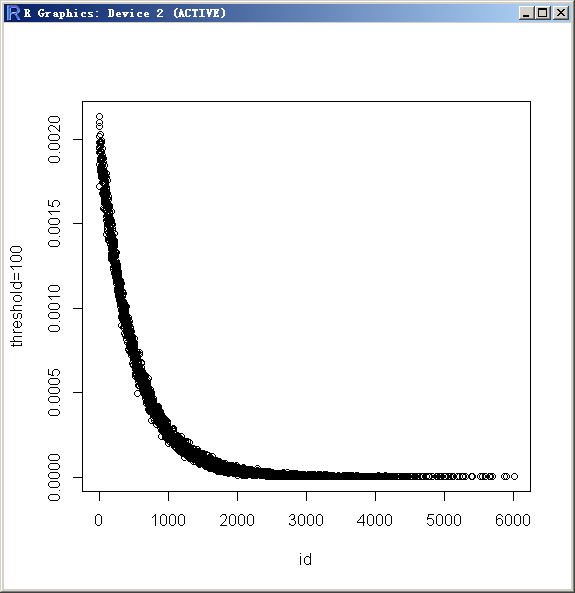

## PostgreSQL 11 preview - pgbench 变量、函数扩展 - 暨pgbench 自定义 benchmark讲解
              
### 作者              
digoal              
              
### 日期              
2017-11-19              
              
### 标签              
PostgreSQL , pgbench , 压测 , 变量 , tpc-b , 自定义压测        
              
----              
              
## 背景       
pgbench是PostgreSQL软件包中的一款benchmark软件，纯C编码，效率高，压测方便。    
    
内置TPC-B benchmark测试，同时支持自定义benchmark。    
    
详细文档见    
    
https://www.postgresql.org/docs/10/static/pgbench.html    
    
## pgbench 自定义benchmark脚本支持的语法    
    
### 变量赋值的语法    
压测需要生成输入变量，才能使得压测覆盖更广的数据范围。    
    
1、pgbench 命令行输入变量    
    
```    
-D varname=value    
--define=varname=value    
    
Define a variable for use by a custom script (see below). Multiple -D options are allowed.    
```    
    
2、benchmark脚本内变量，表达式的值赋予给变量    
    
```    
\set varname express    
```    
    
3、pgbench 自带的两个变量（一个是指client id, 每个连接一个，另一个是scale factor，即pgbench -s 输入的值。）    
    
    
    
### 表达式语法    
    
1、数据类型    
    
INT，浮点类型    
    
2、支持的操作符     
    
```    
unary operators (+, -)     
    
binary operators (+, -, *, /, %)     
    
括号    
```    
    
3、函数调用    
    
    
    
### 睡眠语法    
模拟真实环境，APP处理消耗时间，再次发起请求的间隔。    
    
```    
\sleep number [ us | ms | s ]    
```    
    
### shell调用语法1    
调用shell并将标准输出赋予变量，用于在测试过程中调用SHELL命令。    
    
```    
\setshell varname command [ argument ... ]    
    
\setshell variable_to_be_assigned command literal_argument :variable ::literal_starting_with_colon    
```    
    
### shell调用语法2    
调用shell并抛弃结果，用于在测试过程中调用SHELL命令。    
    
```    
\shell command [ argument ... ]    
    
\shell command literal_argument :variable ::literal_starting_with_colon    
```    
    
### 生成随机值的几个函数    
1、随机分布随机数    
    
在取值区间内，所有值的概率一致。    
    
```    
\set varname random(min, max)    
    
\set id random(1,100000)    
```    
    
2、高斯分布随机数    
    
```    
\set varname random_gaussian(lb, ub, parameter)    
```    
    
在取值区间内，    
    
约67%的值分布在以min,max数学期望为中心的 "1.0 / 参数" 这个区间。    
    
约95%的值分布在以min,max数学期望为中心的 "2.0 / 参数" 这个区间。    
    
参数越大，鈡的曲线越陡峭    
    
      
    
参数越小，鈡的曲线越平缓    
    
      
    
3、指数分布随机数    
    
```    
\set varname random_exponential(lb, ub, parameter)    
```    
    
在取值区间内，"1%" 的高频词，在最靠近min的区间，出现 "参数%" 次。     
    
参数越大，越趋向生成更小的值（越靠近min，出现概率越高）。    
    
      
    
      
    
参数越小，越趋向随机分布。    
    
      
    
      
    
4、也可以使用shell调用生成随机数。    
    
```    
1 -----------------------    
\setshell varname command [ argument ... ]    
    
Sets variable varname to the result of the shell command command with the given argument(s).     
The command must return an integer value through its standard output.    
    
command and each argument can be either a text constant or a :variablename reference to a variable.     
If you want to use an argument starting with a colon, write an additional colon at the beginning of argument.    
    
Example:    
    
\setshell variable_to_be_assigned command literal_argument :variable ::literal_starting_with_colon    
    
2 -----------------------    
\shell command [ argument ... ]    
    
Same as \setshell, but the result of the command is discarded.    
    
Example:    
    
\shell command literal_argument :variable ::literal_starting_with_colon    
```    
    
## pgbench 例子    
    
### tpc-b benchmark 例子    
1、初始化测试数据（如已有，可忽略）    
    
```    
-s 100 单位为10万行，100表示1000万行数据。    
    
pgbench -i -s 100    
```    
    
2、压测    
    
```    
32个连接，测试120秒。    
    
pgbench -M prepared -n -r -P 1 -c 32 -j 32 -T 120    
```    
    
### 自定义 benchmark 例子    
1、创建测试脚本    
    
```    
vi test.sql    
    
\set aid random(1, 100000 * :scale)    
\set bid random(1, 1 * :scale)    
\set tid random(1, 10 * :scale)    
\set delta random(-5000, 5000)    
BEGIN;    
UPDATE pgbench_accounts SET abalance = abalance + :delta WHERE aid = :aid;    
SELECT abalance FROM pgbench_accounts WHERE aid = :aid;    
UPDATE pgbench_tellers SET tbalance = tbalance + :delta WHERE tid = :tid;    
UPDATE pgbench_branches SET bbalance = bbalance + :delta WHERE bid = :bid;    
INSERT INTO pgbench_history (tid, bid, aid, delta, mtime) VALUES (:tid, :bid, :aid, :delta, CURRENT_TIMESTAMP);    
END;    
```    
    
2、压测    
    
```    
32个连接，测试120秒。    
    
pgbench -M prepared -n -r -f ./test.sql -P 1 -c 32 -j 32 -T 120    
```    
    
## PostgreSQL 11 preview    
    
### 增加 pow 函数    
    
https://commitfest.postgresql.org/15/1357/    
    
### 增加 操作符     
    
https://commitfest.postgresql.org/15/985/    
    
```    
Here is a simple patch which adds a bunch of operators :    
    
bitwise: & | ^ ~,     
comparisons: =/== <>/!= < <= > >=,     
logical: and/&& or/|| xor/^^ not/!    
functions (exp ln if)     
    
to pgbench. I've tried to be pg's SQL compatible     
where appropriate.    
```    
    
## 参考    
[《PostgreSQL 使用 pgbench 测试 sysbench 相关case》](../201610/20161031_02.md)      
    
[《PostgreSQL pgbench SQL RT 与 事务RT 浅析》](../201609/20160926_03.md)      
    
[《生成泊松、高斯、指数、随机分布数据 - PostgreSQL 9.5 new feature - pg_bench improve, gaussian (standard normal) & exponential distribution》](../201506/20150618_01.md)      
    
其他例子    
    
[《HTAP数据库 PostgreSQL 场景与性能测试之 43 - (OLTP+OLAP) unlogged table 含索引多表批量写入》](../201711/20171107_44.md)      
  
[《HTAP数据库 PostgreSQL 场景与性能测试之 42 - (OLTP+OLAP) unlogged table 不含索引多表批量写入》](../201711/20171107_43.md)      
  
[《HTAP数据库 PostgreSQL 场景与性能测试之 41 - (OLTP+OLAP) 含索引多表批量写入》](../201711/20171107_42.md)      
  
[《HTAP数据库 PostgreSQL 场景与性能测试之 40 - (OLTP+OLAP) 不含索引多表批量写入》](../201711/20171107_41.md)      
  
[《HTAP数据库 PostgreSQL 场景与性能测试之 39 - (OLTP+OLAP) 含索引多表单点写入》](../201711/20171107_40.md)      
  
[《HTAP数据库 PostgreSQL 场景与性能测试之 38 - (OLTP+OLAP) 不含索引多表单点写入》](../201711/20171107_39.md)      
  
[《HTAP数据库 PostgreSQL 场景与性能测试之 37 - (OLTP+OLAP) 含索引单表批量写入》](../201711/20171107_38.md)      
  
[《HTAP数据库 PostgreSQL 场景与性能测试之 36 - (OLTP+OLAP) 不含索引单表批量写入》](../201711/20171107_37.md)      
  
[《HTAP数据库 PostgreSQL 场景与性能测试之 35 - (OLTP+OLAP) 含索引单表单点写入》](../201711/20171107_36.md)      
  
[《HTAP数据库 PostgreSQL 场景与性能测试之 34 - (OLTP+OLAP) 不含索引单表单点写入》](../201711/20171107_35.md)      
  
[《HTAP数据库 PostgreSQL 场景与性能测试之 33 - (OLAP) 物联网 - 线性字段区间实时统计》](../201711/20171107_34.md)      
  
[《HTAP数据库 PostgreSQL 场景与性能测试之 32 - (OLTP) 高吞吐数据进出(堆存、行扫、无需索引) - 阅后即焚(JSON + 函数流式计算)》](../201711/20171107_33.md)      
  
[《HTAP数据库 PostgreSQL 场景与性能测试之 31 - (OLTP) 高吞吐数据进出(堆存、行扫、无需索引) - 阅后即焚(读写大吞吐并测)》](../201711/20171107_32.md)      
  
[《HTAP数据库 PostgreSQL 场景与性能测试之 30 - (OLTP) 秒杀 - 高并发单点更新》](../201711/20171107_31.md)      
  
[《HTAP数据库 PostgreSQL 场景与性能测试之 29 - (OLTP) 高并发空间位置更新（含空间索引）》](../201711/20171107_30.md)      
  
[《HTAP数据库 PostgreSQL 场景与性能测试之 28 - (OLTP) 高并发点更新》](../201711/20171107_29.md)      
  
[《HTAP数据库 PostgreSQL 场景与性能测试之 27 - (OLTP) 物联网 - FEED日志, 流式处理 与 阅后即焚 (CTE)》](../201711/20171107_28.md)      
  
[《HTAP数据库 PostgreSQL 场景与性能测试之 26 - (OLTP) NOT IN、NOT EXISTS 查询》](../201711/20171107_27.md)      
  
[《HTAP数据库 PostgreSQL 场景与性能测试之 25 - (OLTP) IN , EXISTS 查询》](../201711/20171107_26.md)      
  
[《HTAP数据库 PostgreSQL 场景与性能测试之 24 - (OLTP) 物联网 - 时序数据并发写入(含时序索引BRIN)》](../201711/20171107_25.md)      
  
[《HTAP数据库 PostgreSQL 场景与性能测试之 23 - (OLAP) 并行计算》](../201711/20171107_24.md)      
  
[《HTAP数据库 PostgreSQL 场景与性能测试之 22 - (OLTP) merge insert|upsert|insert on conflict|合并写入》](../201711/20171107_23.md)      
  
[《HTAP数据库 PostgreSQL 场景与性能测试之 21 - (OLTP+OLAP) 排序、建索引》](../201711/20171107_22.md)      
  
[《HTAP数据库 PostgreSQL 场景与性能测试之 20 - (OLAP) 用户画像圈人场景 - 多个字段任意组合条件筛选与透视》](../201711/20171107_21.md)      
  
[《HTAP数据库 PostgreSQL 场景与性能测试之 19 - (OLAP) 用户画像圈人场景 - 数组相交查询与聚合》](../201711/20171107_20.md)      
  
[《HTAP数据库 PostgreSQL 场景与性能测试之 18 - (OLAP) 用户画像圈人场景 - 数组包含查询与聚合》](../201711/20171107_19.md)      
  
[《HTAP数据库 PostgreSQL 场景与性能测试之 17 - (OLTP) 数组相似查询》](../201711/20171107_18.md)      
  
[《HTAP数据库 PostgreSQL 场景与性能测试之 16 - (OLTP) 文本特征向量 - 相似特征(海明...)查询》](../201711/20171107_17.md)      
  
[《HTAP数据库 PostgreSQL 场景与性能测试之 15 - (OLTP) 物联网 - 查询一个时序区间的数据》](../201711/20171107_16.md)      
  
[《HTAP数据库 PostgreSQL 场景与性能测试之 14 - (OLTP) 字符串搜索 - 全文检索》](../201711/20171107_15.md)      
  
[《HTAP数据库 PostgreSQL 场景与性能测试之 13 - (OLTP) 字符串搜索 - 相似查询》](../201711/20171107_14.md)      
  
[《HTAP数据库 PostgreSQL 场景与性能测试之 12 - (OLTP) 字符串搜索 - 前后模糊查询》](../201711/20171107_13.md)      
  
[《HTAP数据库 PostgreSQL 场景与性能测试之 11 - (OLTP) 字符串搜索 - 后缀查询》](../201711/20171107_12.md)      
  
[《HTAP数据库 PostgreSQL 场景与性能测试之 10 - (OLTP) 字符串搜索 - 前缀查询》](../201711/20171107_11.md)      
  
[《HTAP数据库 PostgreSQL 场景与性能测试之 9 - (OLTP) 字符串模糊查询 - 含索引实时写入》](../201711/20171107_10.md)      
  
[《HTAP数据库 PostgreSQL 场景与性能测试之 8 - (OLTP) 多值类型(数组)含索引实时写入》](../201711/20171107_09.md)      
  
[《HTAP数据库 PostgreSQL 场景与性能测试之 7 - (OLTP) 全文检索 - 含索引实时写入》](../201711/20171107_08.md)      
  
[《HTAP数据库 PostgreSQL 场景与性能测试之 6 - (OLTP) 空间应用 - KNN查询（搜索附近对象，由近到远排序输出）》](../201711/20171107_07.md)      
  
[《HTAP数据库 PostgreSQL 场景与性能测试之 5 - (OLTP) 空间应用 - 空间包含查询》](../201711/20171107_06.md)      
  
[《HTAP数据库 PostgreSQL 场景与性能测试之 4 - (OLAP) 大表OUTER JOIN统计查询》](../201711/20171107_05.md)      
  
[《HTAP数据库 PostgreSQL 场景与性能测试之 3 - (OLAP) 大表JOIN统计查询》](../201711/20171107_04.md)      
  
[《HTAP数据库 PostgreSQL 场景与性能测试之 2 - (OLTP) 多表JOIN》](../201711/20171107_03.md)      
  
[《HTAP数据库 PostgreSQL 场景与性能测试之 1 - (OLTP) 点查》](../201711/20171107_02.md)      
  
    
  
<a rel="nofollow" href="http://info.flagcounter.com/h9V1"  ></a>  
  
  
  
  
  
  
## [digoal's 大量PostgreSQL文章入口](https://github.com/digoal/blog/blob/master/README.md "22709685feb7cab07d30f30387f0a9ae")
  
